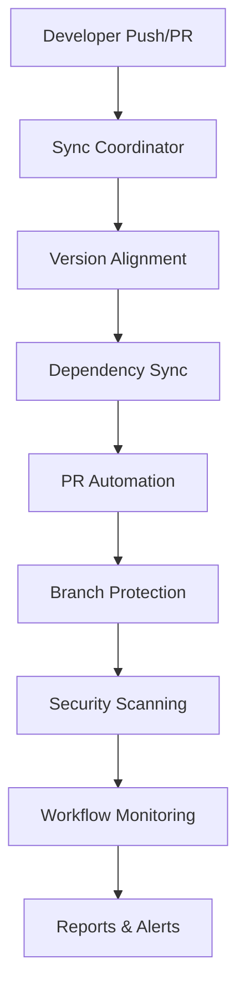

# GitHub Workflow Automation Guide
# Complete guide for multi-package synchronization and repository automation

## 🚀 Overview

This repository implements a comprehensive GitHub Actions automation system designed for multi-package repositories with intelligent synchronization, PR management, security scanning, and monitoring capabilities.

## 📋 Table of Contents

- [Workflow Overview](#workflow-overview)
- [Multi-Package Sync Coordinator](#multi-package-sync-coordinator)
- [Automated PR Management](#automated-pr-management)
- [Branch Protection & Policies](#branch-protection--policies)
- [Security Scanning](#security-scanning)
- [Workflow Monitoring](#workflow-monitoring)
- [Configuration](#configuration)
- [Troubleshooting](#troubleshooting)
- [Best Practices](#best-practices)

## 🔄 Workflow Overview

### Core Automation Workflows

| Workflow | Purpose | Triggers | Key Features |
|----------|---------|----------|--------------|
| `sync-coordinator-v2.yml` | Multi-package version alignment | Push, PR, Schedule, Manual | Dependency sync, version alignment, automated PRs |
| `pr-automation.yml` | Intelligent PR management | PR events, Reviews | Auto-assignment, validation, smart merging |
| `branch-protection.yml` | Branch policy enforcement | Push, PR, Manual | Protection validation, compliance checking |
| `security-scanning.yml` | Comprehensive security scans | Push, PR, Schedule | Vulnerability detection, compliance monitoring |
| `workflow-monitoring.yml` | Health and performance tracking | Workflow completion, Schedule | Performance analysis, failure detection |

### Integration Architecture



## 🔄 Multi-Package Sync Coordinator

### Overview
The sync coordinator automatically manages dependency versions across multiple packages in your monorepo, ensuring consistency and compatibility.

### Features
- **Intelligent Package Discovery**: Automatically detects workspace packages
- **Version Alignment**: Synchronizes dependencies across packages
- **Conflict Resolution**: Handles version conflicts intelligently
- **Automated PR Creation**: Creates PRs for sync changes
- **Security Updates**: Prioritizes security vulnerability fixes

### Configuration

#### Manual Trigger Options
```yaml
sync_mode:
  - align          # Smart alignment of versions
  - force-sync     # Force sync ignoring conflicts
  - validate-only  # Only validate without changes
  - update-deps    # Update to latest compatible versions
  - security-only  # Only security-related updates

dependency_strategy:
  - conservative   # Only patch and minor updates
  - moderate      # Include compatible major updates
  - aggressive    # Update to latest versions
```

#### Usage Examples

**Basic Alignment:**
```bash
# Trigger via GitHub UI
gh workflow run "Multi-Package Sync Coordinator v2" \
  --field sync_mode=align \
  --field target_packages=all
```

**Security-Only Updates:**
```bash
gh workflow run "Multi-Package Sync Coordinator v2" \
  --field sync_mode=security-only \
  --field dependency_strategy=conservative
```

### Monitoring Sync Results

The workflow provides detailed reporting:
- **Alignment Reports**: Per-package analysis
- **Integration Validation**: Cross-package testing
- **PR Summaries**: Automated change documentation

## 🔧 Automated PR Management

### Overview
Intelligent PR processing with automated validation, assignment, and merge management.

### Key Features

#### PR Classification
- **Type Detection**: Automatically classifies PRs (feature, bugfix, hotfix, etc.)
- **Complexity Analysis**: Calculates complexity scores based on files and changes
- **Auto-Assignment**: Assigns reviewers based on changed files
- **Smart Labels**: Applies relevant labels automatically

#### Validation Rules
- **Title Format**: Enforces conventional commit format
- **Description Requirements**: Ensures adequate PR descriptions
- **Branch Naming**: Validates branch naming conventions
- **Merge Conflicts**: Automatically detects conflicts

#### Auto-Merge Eligibility
PRs are eligible for auto-merge when:
- Low complexity score (< 40)
- No critical files changed
- Automated changes (dependabot, sync-coordinator)
- Passes all required checks

### Configuration

#### PR Type Patterns
```yaml
# Conventional commit patterns
feat: New features
fix: Bug fixes
docs: Documentation updates
style: Code style changes
refactor: Code refactoring
test: Test additions/updates
chore: Maintenance tasks
ci: CI/CD changes
```

#### Auto-Merge Labels
- `auto-merge`: Eligible for automatic merging
- `needs-review`: Requires manual review
- `ready-to-merge`: All checks passed, ready for merge

### Usage

The workflow automatically processes all PR events. Manual triggers available for:
```bash
# Validate specific PR
gh workflow run "Automated PR Management & Validation" \
  --field pr_number=123 \
  --field action=validate

# Check merge readiness
gh workflow run "Automated PR Management & Validation" \
  --field pr_number=123 \
  --field action=check-merge-ready
```

## 🛡️ Branch Protection & Policies

### Overview
Enforces branch protection rules and merge policies to maintain code quality and security.

### Protection Rules

#### Main Branch (Production)
- **Required Reviews**: 2 approving reviews
- **Status Checks**: All CI/CD pipelines must pass
- **Admin Enforcement**: Applies to administrators
- **Force Push**: Disabled
- **Deletions**: Disabled

#### Development Branch (Staging)  
- **Required Reviews**: 1 approving review
- **Status Checks**: Core pipelines required
- **Admin Enforcement**: Optional
- **Force Push**: Disabled

#### Test Branch (Testing)
- **Required Reviews**: 1 approving review
- **Status Checks**: Basic validation required
- **Admin Enforcement**: Disabled

### Compliance Monitoring

The workflow continuously monitors:
- **Protection Status**: Verifies rules are active
- **Violation Detection**: Identifies direct pushes
- **Policy Compliance**: Validates merge policies
- **CODEOWNERS**: Ensures proper code ownership

### Emergency Override

For critical situations, emergency overrides are available:
```bash
gh workflow run "Branch Protection & Policy Enforcement" \
  --field action=emergency-override \
  --field emergency_reason="Critical security fix required"
```

**Note**: Emergency overrides are logged and create tracking issues.

## 🔒 Security Scanning

### Overview
Comprehensive security scanning covering dependencies, code analysis, secrets detection, and compliance checking.

### Scan Types

#### Dependency Vulnerability Scan
- **npm audit**: Scans for known vulnerabilities
- **Multi-Package**: Analyzes all workspace packages
- **Auto-Fix**: Attempts automatic fixes for high/critical issues
- **SARIF Upload**: Results integrated with GitHub Security

#### Code Security Analysis
- **CodeQL**: Advanced static analysis
- **Security Queries**: Extended security rule sets
- **Multi-Language**: JavaScript and TypeScript support
- **Integration**: Results appear in Security tab

#### Secrets Scanning
- **TruffleHog**: Advanced secrets detection
- **Pattern Matching**: Common secret patterns
- **Historical Scan**: Checks entire git history
- **Configuration Files**: Validates exposed configs

#### Container Security
- **Trivy Scanner**: Container and filesystem scanning
- **Dockerfile Analysis**: Best practices validation
- **SARIF Integration**: Results in Security dashboard

### Compliance Scoring

The security compliance score (0-100) is calculated based on:
- **Security Files Present**: 40 points
- **Configuration Quality**: 30 points
- **Vulnerability Status**: 20 points
- **Best Practices**: 10 points

### Manual Scanning

```bash
# Full security scan
gh workflow run "Security Scanning & Compliance" \
  --field scan_type=full-scan \
  --field severity_threshold=medium

# Dependency check only
gh workflow run "Security Scanning & Compliance" \
  --field scan_type=dependency-check \
  --field severity_threshold=high
```

## 📊 Workflow Monitoring

### Overview
Comprehensive monitoring of all GitHub Actions workflows with performance tracking and health analysis.

### Monitoring Features

#### Health Assessment
- **Success Rate Tracking**: Monitors workflow success/failure rates
- **Performance Analysis**: Tracks execution times and trends
- **Critical Workflow Identification**: Identifies problematic workflows
- **Health Scoring**: 0-100 health score calculation

#### Failure Analysis
- **Root Cause Analysis**: Identifies common failure patterns
- **Automatic Issue Creation**: Creates tracking issues for critical failures
- **Trend Analysis**: Monitors performance over time
- **Alert Generation**: Sends notifications for health degradation

#### Performance Metrics
- **Execution Duration**: Average and trend analysis
- **Resource Usage**: Monitor compute resource consumption
- **Queue Times**: Track workflow queue and start delays
- **Success Trends**: Historical success rate analysis

### Health Score Calculation

```yaml
Health Score (0-100):
  Success Rate Impact (0-50 points):
    - 95%+: 0 points deducted
    - 90-94%: 10 points deducted
    - 80-89%: 25 points deducted
    - <80%: 50 points deducted
  
  Performance Impact (0-30 points):
    - <15 min avg: 0 points deducted
    - 15-30 min: 10 points deducted
    - >30 min: 20 points deducted
  
  Failure Rate Impact (0-20 points):
    - <10% failures: 0 points deducted
    - 10-20% failures: 10 points deducted
    - >20% failures: 20 points deducted
```

### Alerts and Notifications

#### Health Thresholds
- **Excellent (90-100)**: No alerts
- **Good (70-89)**: Weekly summary
- **Moderate (50-69)**: Daily alerts
- **Poor (<50)**: Immediate alerts

#### Alert Channels
Configure notifications for:
- Slack webhooks
- Email notifications  
- GitHub issues
- PagerDuty integration

## ⚙️ Configuration

### Repository Setup

#### Required Secrets
```yaml
GITHUB_TOKEN: # Automatically provided
# Optional: Add custom tokens for enhanced permissions
```

#### Required Files
```
.github/
├── workflows/
│   ├── sync-coordinator-v2.yml
│   ├── pr-automation.yml
│   ├── branch-protection.yml
│   ├── security-scanning.yml
│   └── workflow-monitoring.yml
├── CODEOWNERS
├── pull_request_template.md
└── GITHUB_AUTOMATION_GUIDE.md
```

### Package Configuration

#### Package.json Scripts
Ensure each package includes standard scripts:
```json
{
  "scripts": {
    "build": "...",
    "test": "...",
    "lint": "...",
    "type-check": "..."
  }
}
```

#### Workspace Configuration
For monorepos, configure workspaces in root package.json:
```json
{
  "workspaces": [
    "frontend",
    "backend", 
    "shared"
  ]
}
```

### Branch Structure

#### Recommended Branch Strategy
```
main          # Production releases
├── development  # Staging environment
├── test        # Testing environment
└── feature/*   # Feature branches
```

## 🔧 Troubleshooting

### Common Issues

#### Sync Coordinator Issues

**Problem**: Package not detected
```bash
# Solution: Check package.json exists and workspaces are configured
ls -la */package.json
cat package.json | jq .workspaces
```

**Problem**: Version conflicts during sync
```bash
# Solution: Use force-sync mode cautiously
gh workflow run "Multi-Package Sync Coordinator v2" \
  --field sync_mode=force-sync
```

#### PR Automation Issues

**Problem**: Auto-merge not working
- Check PR has `auto-merge` label
- Verify all required status checks pass
- Ensure no merge conflicts exist
- Confirm PR meets complexity requirements

**Problem**: Reviewers not assigned
- Verify CODEOWNERS file exists and is properly formatted
- Check file paths match CODEOWNERS patterns
- Ensure team/user handles are correct

#### Security Scanning Issues

**Problem**: False positive vulnerabilities
- Review vulnerability details in Security tab
- Consider using npm audit ignore for false positives
- Add security exceptions with proper justification

**Problem**: Secrets scanning alerts
- Remove secrets from code and history
- Add patterns to .gitignore
- Use environment variables or secret management

### Performance Optimization

#### Workflow Performance
- **Caching**: Leverage npm cache for faster installs
- **Parallelization**: Run independent jobs concurrently  
- **Conditional Execution**: Skip unnecessary steps
- **Resource Limits**: Use appropriate runner sizes

#### Monitoring Optimization
- **Artifact Retention**: Configure appropriate retention periods
- **Report Frequency**: Adjust monitoring frequency based on needs
- **Alert Thresholds**: Fine-tune alert thresholds to reduce noise

## 📚 Best Practices

### Development Workflow

#### PR Guidelines
1. **Follow Conventional Commits**: Use standard prefixes (feat, fix, docs, etc.)
2. **Write Descriptive Titles**: Clear, concise PR titles
3. **Provide Context**: Include adequate description and reasoning
4. **Reference Issues**: Link to related issues when applicable
5. **Small Changes**: Keep PRs focused and manageable

#### Branch Management
1. **Use Feature Branches**: Never commit directly to protected branches
2. **Regular Updates**: Keep feature branches up to date with base branch
3. **Clean History**: Use meaningful commit messages
4. **Delete Merged Branches**: Clean up after successful merges

### Security Best Practices

#### Dependency Management
1. **Regular Updates**: Keep dependencies current
2. **Security Audits**: Run npm audit regularly
3. **Vulnerability Response**: Address security issues promptly
4. **Lock File Commits**: Always commit package-lock.json

#### Secrets Management
1. **Environment Variables**: Use environment variables for secrets
2. **Gitignore Patterns**: Exclude sensitive files from version control
3. **Secret Scanning**: Monitor for accidentally committed secrets
4. **Rotation Policies**: Regularly rotate API keys and tokens

### Monitoring and Maintenance

#### Regular Tasks
1. **Weekly Health Review**: Check workflow health scores
2. **Monthly Security Audit**: Review security scan results
3. **Quarterly Optimization**: Analyze and optimize workflow performance
4. **Annual Policy Review**: Update protection rules and policies

#### Metric Tracking
1. **Success Rates**: Monitor workflow success rates
2. **Performance Trends**: Track execution time trends
3. **Security Compliance**: Monitor compliance scores
4. **Developer Experience**: Gather feedback on automation effectiveness

## 🆘 Support and Maintenance

### Getting Help

#### Documentation Resources
- [GitHub Actions Documentation](https://docs.github.com/en/actions)
- [Workflow Syntax Reference](https://docs.github.com/en/actions/using-workflows/workflow-syntax-for-github-actions)
- [Security Best Practices](https://docs.github.com/en/actions/security-guides)

#### Internal Resources
- Check workflow run logs for detailed error information
- Review artifact uploads for reports and analysis
- Use GitHub Issues to track automation problems
- Monitor Security tab for vulnerability reports

### Maintenance Schedule

#### Daily
- Monitor workflow health alerts
- Review security scan results
- Check for failed workflow runs

#### Weekly  
- Review workflow performance metrics
- Analyze PR automation effectiveness
- Update dependency vulnerabilities

#### Monthly
- Audit branch protection compliance
- Review and update automation configurations
- Analyze cost and resource usage

#### Quarterly
- Comprehensive security audit
- Workflow optimization review
- Update documentation and procedures

---

## 📞 Contact and Support

For questions or issues with the GitHub automation system:

1. **Check Documentation**: Review this guide and workflow files
2. **Search Issues**: Look for existing GitHub Issues
3. **Create Issue**: Open a new issue with detailed information
4. **Review Logs**: Check workflow run logs for error details

**Workflow Status**: Monitor at `https://github.com/{org}/{repo}/actions`
**Security Alerts**: Check at `https://github.com/{org}/{repo}/security`

---

*This automation system is designed to enhance developer productivity while maintaining high security and quality standards. Regular monitoring and maintenance ensure optimal performance.*