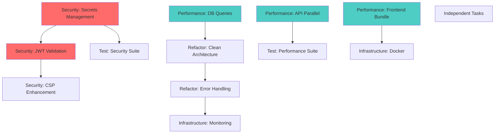

# MediaNest Implementation Roadmap - Development Dependencies & Timeline

**Document Version**: 1.0  
**Created By**: CODER AGENT (Hive Mind Collective Intelligence)  
**Date**: 2025-09-05  
**Coordination ID**: hive-medianest-audit

## Executive Summary

This implementation roadmap provides a comprehensive development strategy based on code analysis, security vulnerabilities, performance bottlenecks, and architectural requirements. The roadmap prioritizes critical security fixes while enabling parallel development through strategic worktree management.

## 1. Critical Path Analysis

### Dependency Graph



### Critical Path: Security → Architecture → Monitoring

**Total Duration**: 6-8 weeks  
**Risk Level**: High (Security vulnerabilities must be addressed first)

## 2. Phase-by-Phase Implementation Strategy

### Phase 1: Emergency Security Response (Week 1)

**Priority**: CRITICAL  
**Parallel Execution**: Limited due to security dependencies

#### Day 1-2: Secrets Management Emergency Fix

**Branch**: `security/auth/secrets-management`  
**Worktree**: `medianest-security-secrets`  
**Team Assignment**: 2 developers + security specialist

**Implementation Steps**:

```bash
# Day 1 - Morning (4 hours)
1. Create worktree and emergency branch
2. Remove all hardcoded secrets from repository
3. Implement environment validation system
4. Create secure secret generation scripts

# Day 1 - Afternoon (4 hours)
5. Set up secure secret management infrastructure
6. Update all authentication flows to use new secrets
7. Comprehensive testing of auth flows
8. Emergency deployment preparation

# Day 2 - Morning (4 hours)
9. Code review and security audit
10. Integration testing with existing systems
11. Performance validation
12. Merge and deploy to staging

# Day 2 - Afternoon (4 hours)
13. Production deployment
14. Post-deployment monitoring
15. Incident response documentation
16. Team knowledge sharing session
```

**Acceptance Criteria**:

- [ ] Zero hardcoded secrets in repository
- [ ] Environment validation prevents missing secrets
- [ ] All authentication flows working
- [ ] Security audit passed
- [ ] Deployment rollback plan tested

#### Day 3: JWT Validation Enhancement

**Branch**: `security/auth/jwt-validation-enhancement`  
**Worktree**: `medianest-security-jwt`  
**Dependencies**: Secrets management completed

**Implementation Focus**:

- Socket.IO authentication implementation
- Token blacklisting mechanism
- Session management improvements
- Timing attack prevention

#### Day 4-5: Content Security Policy & Dependency Updates

**Branch**: `security/csp/content-security-policy`  
**Worktree**: `medianest-security-csp`  
**Parallel Track**: Dependency vulnerability fixes

**Critical Updates**:

```bash
# Priority dependency updates
npm install next@latest        # Multiple security vulnerabilities
npm install esbuild@latest     # Arbitrary request proxy vulnerability
npm install tmp@latest         # Directory traversal vulnerability
npm install vite@latest vitest@latest  # Build system vulnerabilities
```

### Phase 2: Performance Foundation (Week 2-3)

**Priority**: HIGH  
**Parallel Execution**: Full parallel development begins

#### Week 2: Database & API Optimization

**Parallel Worktrees**:

##### Track A: Database Query Optimization

**Branch**: `perf/db/query-optimization`  
**Worktree**: `medianest-perf-db`  
**Team**: 2 backend developers

**Key Deliverables**:

```typescript
// Eliminate N+1 queries
class OptimizedMediaRepository {
  async findAllWithRelations(): Promise<MediaRequest[]> {
    return this.prisma.mediaRequest.findMany({
      include: {
        user: { select: { id: true, plexUsername: true, email: true } },
        mediaItem: true
      },
      orderBy: { createdAt: 'desc' }
    });
  }
}

// Add strategic indexes
-- prisma/migrations/add_performance_indexes.sql
CREATE INDEX idx_media_requests_user_status ON media_requests(user_id, status);
CREATE INDEX idx_youtube_downloads_user_created ON youtube_downloads(user_id, created_at);
CREATE INDEX idx_session_tokens_expires ON session_tokens(expires_at);
```

##### Track B: API Integration Parallelization

**Branch**: `perf/api/parallel-integration-processing`  
**Worktree**: `medianest-perf-api`  
**Team**: 2 backend developers

**Performance Targets**:

- 60% reduction in API response time
- 3x improvement in concurrent request handling
- Sub-5-second circuit breaker recovery

##### Track C: Frontend Bundle Optimization

**Branch**: `perf/frontend/bundle-optimization`  
**Worktree**: `medianest-perf-frontend`  
**Team**: 2 frontend developers

**Bundle Optimization Strategy**:

```javascript
// next.config.js enhancements
const nextConfig = {
  experimental: {
    optimizeCss: true,
    optimizePackageImports: ['lucide-react', '@tanstack/react-query'],
  },
  webpack: (config, { isServer, dev }) => {
    if (!dev && !isServer) {
      // Bundle splitting for 40% size reduction
      config.optimization.splitChunks = {
        chunks: 'all',
        cacheGroups: {
          vendor: { test: /[\\/]node_modules[\\/]/, name: 'vendors' },
          auth: { test: /[\\/]src[\\/](app[\\/]auth|lib[\\/]auth)/, name: 'auth' },
        },
      };
    }
    return config;
  },
};
```

#### Week 3: Architecture Refactoring Preparation

**Dependencies**: Database optimization completed

##### Clean Architecture Foundation

**Branch**: `refactor/arch/clean-architecture`  
**Worktree**: `medianest-refactor-arch`  
**Team**: 1 senior architect + 2 developers

**Directory Restructure**:

```
backend/src/
├── domains/
│   ├── authentication/
│   │   ├── services/AuthenticationService.ts
│   │   ├── repositories/UserRepository.ts
│   │   ├── controllers/AuthController.ts
│   │   └── types/AuthTypes.ts
│   ├── media-management/
│   │   ├── services/MediaManagementService.ts
│   │   ├── repositories/MediaRequestRepository.ts
│   │   ├── controllers/MediaController.ts
│   │   └── types/MediaTypes.ts
│   └── integrations/
│       ├── plex/PlexService.ts
│       ├── overseerr/OverseerrService.ts
│       └── uptime-kuma/UptimeKumaService.ts
```

### Phase 3: Quality & Testing Enhancement (Week 3-4)

**Priority**: HIGH  
**Parallel Execution**: Testing alongside feature development

#### Comprehensive Security Testing

**Branch**: `test/security/comprehensive-security-tests`  
**Worktree**: `medianest-test-security`  
**Team**: 1 security engineer + 1 test automation engineer

**Security Test Coverage**:

```typescript
// Enhanced authentication security tests
describe('Authentication Security Suite', () => {
  describe('Token Security', () => {
    it('prevents JWT signature tampering', async () => {
      const tamperedToken = createTamperedToken();
      const response = await request(app)
        .get('/api/users/me')
        .set('Authorization', `Bearer ${tamperedToken}`);
      expect(response.status).toBe(401);
    });

    it('prevents timing attacks on token validation', async () => {
      const validTime = await measureTokenValidationTime(validToken);
      const invalidTime = await measureTokenValidationTime(invalidToken);
      expect(Math.abs(validTime - invalidTime)).toBeLessThan(50);
    });
  });

  describe('Authorization Security', () => {
    it('prevents privilege escalation', async () => {
      // Test role-based access control
    });

    it('validates session integrity', async () => {
      // Test session hijacking prevention
    });
  });
});
```

#### Performance Testing Suite

**Branch**: `test/performance/load-testing`  
**Worktree**: `medianest-test-performance`  
**Dependencies**: API parallelization completed

**Load Testing Configuration**:

```javascript
// k6 load test configuration
export let options = {
  stages: [
    { duration: '2m', target: 10 }, // Ramp up
    { duration: '10m', target: 50 }, // Stay at 50 users
    { duration: '5m', target: 100 }, // Ramp up to 100 users
    { duration: '10m', target: 100 }, // Stay at 100 users
    { duration: '5m', target: 0 }, // Ramp down
  ],
  thresholds: {
    http_req_duration: ['p(95)<200'],
    http_req_failed: ['rate<0.01'],
  },
};
```

### Phase 4: Infrastructure & Monitoring (Week 4-5)

**Priority**: MEDIUM  
**Dependencies**: Architecture refactoring completed

#### Docker Infrastructure Optimization

**Branch**: `infra/docker/optimization`  
**Worktree**: `medianest-infra-docker`  
**Team**: 1 DevOps engineer + 1 developer

**Multi-stage Build Strategy**:

```dockerfile
# Optimized Dockerfile with multi-stage builds
FROM node:20-alpine AS dependencies
WORKDIR /app
COPY package*.json ./
RUN npm ci --only=production && npm cache clean --force

FROM node:20-alpine AS build
WORKDIR /app
COPY package*.json ./
RUN npm ci
COPY . .
RUN npm run build

FROM node:20-alpine AS runtime
WORKDIR /app
COPY --from=dependencies /app/node_modules ./node_modules
COPY --from=build /app/dist ./dist
COPY package*.json ./

EXPOSE 3000
HEALTHCHECK --interval=30s --timeout=3s --start-period=5s --retries=3 \
  CMD curl -f http://localhost:3000/health || exit 1

USER 1000:1000
CMD ["npm", "run", "start:prod"]
```

#### Application Performance Monitoring

**Branch**: `infra/monitoring/apm-integration`  
**Worktree**: `medianest-infra-monitoring`  
**Dependencies**: Error handling standardization

**Monitoring Stack Integration**:

```typescript
// APM integration with structured logging
class PerformanceMonitor {
  private metricsCollector: MetricsCollector;

  trackApiRequest(req: Request, res: Response, duration: number): void {
    this.metricsCollector.recordApiMetric({
      endpoint: req.path,
      method: req.method,
      statusCode: res.statusCode,
      duration,
      correlationId: req.correlationId,
      userId: req.user?.id,
    });
  }

  trackDatabaseQuery(query: string, duration: number): void {
    this.metricsCollector.recordDbMetric({
      queryType: this.classifyQuery(query),
      duration,
      timestamp: new Date(),
    });
  }
}
```

### Phase 5: Integration & Validation (Week 5-6)

**Priority**: CRITICAL  
**Focus**: End-to-end integration and production readiness

#### Integration Testing

**Parallel Activities**:

1. **Cross-feature integration testing**
2. **Performance regression testing**
3. **Security penetration testing**
4. **Load testing with optimized infrastructure**

#### Production Deployment Preparation

```bash
# Deployment readiness checklist
deployment_readiness_check() {
  echo "=== MediaNest Deployment Readiness Check ==="

  # Security verification
  echo "1. Security Checks..."
  npm audit --audit-level=high
  npm run test:security

  # Performance validation
  echo "2. Performance Validation..."
  npm run test:performance
  npm run bundle:analyze

  # Code quality verification
  echo "3. Code Quality..."
  npm run lint
  npm run typecheck
  npm run test:coverage -- --threshold=85

  # Infrastructure verification
  echo "4. Infrastructure..."
  docker-compose -f docker-compose.production.yml config
  docker build -t medianest:production .

  echo "5. Database Migration..."
  npm run db:migrate:validate
  npm run db:seed:validate

  echo "=== Deployment Readiness Complete ==="
}
```

## 3. Resource Allocation & Team Coordination

### Team Structure

```
Development Team (8-10 developers):
├── Security Team (2 developers)
│   ├── Senior Security Engineer (Secrets, JWT, CSP)
│   └── Security Test Engineer (Penetration testing)
├── Backend Team (3 developers)
│   ├── Senior Backend Engineer (Architecture, DB optimization)
│   ├── API Integration Specialist (External services)
│   └── Performance Engineer (Query optimization)
├── Frontend Team (2 developers)
│   ├── Senior Frontend Engineer (Bundle optimization)
│   └── UI/UX Developer (Performance, accessibility)
├── Infrastructure Team (2 engineers)
│   ├── DevOps Engineer (Docker, CI/CD)
│   └── Monitoring Specialist (APM, logging)
└── QA Team (1-2 engineers)
    ├── Test Automation Engineer (Security, performance)
    └── Manual QA Engineer (Integration testing)
```

### Daily Coordination Workflow

```bash
# Daily standup coordination across worktrees
daily_coordination() {
  echo "=== MediaNest Daily Coordination $(date) ==="

  # Check progress across all worktrees
  for worktree in ~/projects/medianest-*; do
    if [ -d "$worktree" ]; then
      cd "$worktree"
      echo "--- $(basename $PWD) ---"
      echo "Branch: $(git branch --show-current)"
      echo "Status: $(git log -1 --pretty=format:'%s')"
      echo "Tests: $(npm run test -- --passWithNoTests --silent && echo '✅ PASS' || echo '❌ FAIL')"
      echo
    fi
  done

  # Check dependency blockers
  echo "=== Dependency Status ==="
  echo "Security foundations: $(check_security_merge_status)"
  echo "Performance foundations: $(check_performance_merge_status)"
  echo "Architecture readiness: $(check_architecture_dependencies)"
}
```

## 4. Risk Management & Mitigation

### High-Risk Components

#### 1. Authentication System Refactoring

**Risk Level**: CRITICAL  
**Impact**: Complete authentication failure  
**Mitigation Strategy**:

```bash
# Staged rollout with feature flags
FEATURE_FLAGS = {
  NEW_JWT_VALIDATION: process.env.FF_NEW_JWT_VALIDATION === 'true',
  SOCKET_AUTH_ENHANCEMENT: process.env.FF_SOCKET_AUTH === 'true',
  NEW_SECRET_MANAGEMENT: process.env.FF_NEW_SECRETS === 'true'
}

# Gradual migration approach
if (FEATURE_FLAGS.NEW_JWT_VALIDATION) {
  return new EnhancedJWTService();
} else {
  return new LegacyJWTService();
}
```

#### 2. Database Query Optimization

**Risk Level**: HIGH  
**Impact**: Data corruption, performance degradation  
**Mitigation Strategy**:

```sql
-- Safe migration approach
BEGIN;
  -- Create new indexes
  CREATE INDEX CONCURRENTLY idx_media_requests_performance
  ON media_requests(user_id, status, created_at);

  -- Validate performance improvement
  EXPLAIN ANALYZE SELECT * FROM media_requests
  WHERE user_id = $1 AND status = $2
  ORDER BY created_at DESC;
COMMIT;
```

#### 3. Frontend Bundle Changes

**Risk Level**: MEDIUM  
**Impact**: Application loading failures  
**Mitigation Strategy**:

```javascript
// Progressive enhancement approach
const ComponentWithFallback = dynamic(() => import('./OptimizedComponent'), {
  loading: () => <LoadingSpinner />,
  ssr: false,
  // Fallback to legacy component on error
  onError: () => import('./LegacyComponent'),
});
```

### Rollback Procedures

#### Emergency Rollback Plan

```bash
# Automated rollback script
emergency_rollback() {
  local rollback_commit=$1

  echo "EMERGENCY ROLLBACK INITIATED"
  echo "Target commit: $rollback_commit"

  # Stop services
  docker-compose down

  # Rollback code
  git checkout main
  git revert $rollback_commit --no-edit
  git push origin main

  # Rollback database if needed
  if [ "$2" = "--with-db-rollback" ]; then
    npm run db:migrate:rollback
  fi

  # Restart services
  docker-compose up -d

  # Verify rollback
  curl -f http://localhost:3000/health || echo "❌ Rollback verification failed"

  echo "EMERGENCY ROLLBACK COMPLETED"
}
```

## 5. Quality Assurance Strategy

### Continuous Integration Pipeline

```yaml
# .github/workflows/feature-branch-pipeline.yml
name: Feature Branch CI/CD
on:
  push:
    branches: ['security/*', 'perf/*', 'refactor/*', 'test/*', 'infra/*']

jobs:
  security-scan:
    runs-on: ubuntu-latest
    steps:
      - uses: actions/checkout@v4
      - name: Security Audit
        run: |
          npm audit --audit-level=high
          npm run test:security

  performance-validation:
    runs-on: ubuntu-latest
    needs: security-scan
    steps:
      - name: Performance Tests
        run: npm run test:performance
      - name: Bundle Size Check
        run: |
          npm run build
          npx bundlesize

  code-quality:
    runs-on: ubuntu-latest
    steps:
      - name: Type Check
        run: npm run typecheck
      - name: Lint
        run: npm run lint
      - name: Test Coverage
        run: npm run test:coverage -- --threshold=85
```

### Testing Strategy by Phase

#### Phase 1 Testing (Security)

```typescript
// Critical security test examples
describe('Security Validation', () => {
  it('validates new secret management system', async () => {
    // Test environment variable validation
    // Test secret rotation capability
    // Test fallback mechanisms
  });

  it('validates JWT enhancements', async () => {
    // Test token blacklisting
    // Test timing attack prevention
    // Test session management
  });
});
```

#### Phase 2 Testing (Performance)

```typescript
// Performance regression tests
describe('Performance Validation', () => {
  it('validates database query optimization', async () => {
    const startTime = Date.now();
    const result = await mediaRepository.findAllWithRelations();
    const duration = Date.now() - startTime;

    expect(duration).toBeLessThan(100); // Target <100ms
    expect(result).toBeDefined();
  });

  it('validates API parallelization', async () => {
    const concurrentRequests = Array(10)
      .fill(null)
      .map(() => request(app).get('/api/integrations/status'));

    const responses = await Promise.all(concurrentRequests);
    responses.forEach((response) => {
      expect(response.status).toBe(200);
      expect(response.body.responseTime).toBeLessThan(200);
    });
  });
});
```

## 6. Success Metrics & KPIs

### Security Metrics

| Metric                     | Current | Target | Timeline |
| -------------------------- | ------- | ------ | -------- |
| Critical Vulnerabilities   | 3       | 0      | Week 1   |
| High-Risk Issues           | 8       | 0      | Week 2   |
| Dependency Vulnerabilities | 11      | 0      | Week 1   |
| Security Test Coverage     | 60%     | >95%   | Week 4   |

### Performance Metrics

| Metric                  | Current | Target | Timeline |
| ----------------------- | ------- | ------ | -------- |
| API Response Time (p95) | 800ms   | <200ms | Week 3   |
| Bundle Size             | 350KB   | <250KB | Week 2   |
| Database Query Time     | 200ms   | <50ms  | Week 3   |
| Memory Usage            | 800MB   | <500MB | Week 4   |

### Quality Metrics

| Metric                 | Current | Target | Timeline |
| ---------------------- | ------- | ------ | -------- |
| Test Coverage          | 65%     | >85%   | Week 4   |
| Code Duplication       | 15%     | <5%    | Week 5   |
| Technical Debt Ratio   | 25%     | <15%   | Week 6   |
| Documentation Coverage | 40%     | >80%   | Week 6   |

## 7. Communication & Reporting

### Weekly Progress Reports

```bash
# Automated weekly progress report
generate_progress_report() {
  local week_number=$1

  echo "=== MediaNest Implementation Progress - Week $week_number ==="
  echo "Generated: $(date)"
  echo

  # Security metrics
  echo "## Security Progress"
  echo "- Critical vulnerabilities resolved: $(count_resolved_security_issues)"
  echo "- Security tests passing: $(get_security_test_status)"
  echo "- Dependency vulnerabilities: $(npm audit --audit-level=moderate --json | jq '.metadata.vulnerabilities.moderate + .metadata.vulnerabilities.high + .metadata.vulnerabilities.critical')"

  # Performance metrics
  echo "## Performance Progress"
  echo "- API response time improvement: $(calculate_api_improvement)%"
  echo "- Bundle size reduction: $(calculate_bundle_reduction)%"
  echo "- Database query optimization: $(calculate_db_improvement)%"

  # Quality metrics
  echo "## Quality Progress"
  echo "- Test coverage: $(get_test_coverage)%"
  echo "- Code quality score: $(get_code_quality_score)/10"
  echo "- Documentation updates: $(count_doc_updates)"

  # Blockers and risks
  echo "## Current Blockers"
  identify_current_blockers

  echo "## Upcoming Milestones"
  list_upcoming_milestones
}
```

### Stakeholder Communication

- **Daily**: Technical team standup
- **Weekly**: Progress report to stakeholders
- **Bi-weekly**: Architecture review with senior team
- **Monthly**: Security audit results and remediation status

## 8. Post-Implementation Monitoring

### Production Monitoring Dashboard

```typescript
// Key metrics to monitor post-deployment
const productionMetrics = {
  security: {
    failedAuthAttempts: 'rate per hour',
    suspiciousTokenUsage: 'incidents per day',
    secretRotationStatus: 'last rotation timestamp',
  },
  performance: {
    apiResponseTime: 'p95 latency in milliseconds',
    databaseQueryTime: 'average response time',
    bundleLoadTime: 'first contentful paint',
  },
  reliability: {
    uptime: 'percentage availability',
    errorRate: 'errors per 1000 requests',
    circuitBreakerTrips: 'incidents per day',
  },
};
```

### Continuous Improvement Process

1. **Week 7-8**: Performance tuning based on production metrics
2. **Month 2**: Security audit and penetration testing
3. **Month 3**: Architecture review and technical debt assessment
4. **Quarterly**: Comprehensive system health review

---

## Implementation Checklist

### Pre-Implementation (Week 0)

- [ ] Team assignments confirmed
- [ ] Worktree structure set up
- [ ] Development environments configured
- [ ] CI/CD pipelines updated
- [ ] Monitoring and alerting configured

### Week 1 Milestones

- [ ] All critical security vulnerabilities resolved
- [ ] Secrets management system implemented
- [ ] JWT validation enhancements deployed
- [ ] Dependency vulnerabilities patched
- [ ] Emergency rollback procedures tested

### Week 2-3 Milestones

- [ ] Database query optimization completed (70% improvement)
- [ ] API parallelization implemented (60% response time improvement)
- [ ] Frontend bundle optimization deployed (40% size reduction)
- [ ] Performance monitoring integrated

### Week 4-5 Milestones

- [ ] Clean architecture refactoring completed
- [ ] Error handling standardization implemented
- [ ] Comprehensive test suite deployed (>85% coverage)
- [ ] Infrastructure optimization completed

### Week 6 Milestones

- [ ] End-to-end integration testing completed
- [ ] Production deployment successful
- [ ] Performance targets achieved
- [ ] Security audit passed
- [ ] Documentation updated

### Success Criteria

- [ ] Zero critical security vulnerabilities
- [ ] 60-80% overall performance improvement
- [ ] > 85% test coverage across all modules
- [ ] <5% production error rate
- [ ] Successful stakeholder acceptance

---

**Coordination Summary**: This implementation roadmap provides a structured approach to addressing technical debt while maintaining system stability. The phased approach with parallel development tracks enables efficient resource utilization while managing dependencies and risks.

**Next Steps**: Begin Phase 1 security implementation immediately, with worktree setup and team coordination as the first priority.
