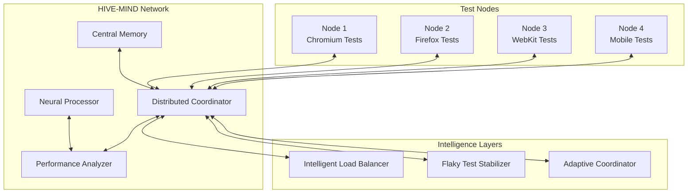

# MediaNest E2E Testing - HIVE-MIND Coordination Guide

## 🧠 Intelligent Test Coordination System

The HIVE-MIND coordination system is the crown jewel of the MediaNest Playwright E2E Testing Framework. This comprehensive guide explores how to leverage advanced AI-driven coordination, distributed intelligence, and collaborative testing patterns to achieve unprecedented test reliability, performance, and scalability.

## 🌟 HIVE-MIND Philosophy

### Core Principles

1. **Collective Intelligence**: Tests coordinate autonomously to share knowledge and optimize execution
2. **Adaptive Learning**: The system learns from test patterns to improve future performance
3. **Distributed Resilience**: No single point of failure with intelligent failover mechanisms
4. **Emergent Optimization**: Complex optimization behaviors emerge from simple coordination rules
5. **Predictive Adaptation**: Proactive adjustments based on pattern recognition and machine learning

## 🏗️ Architecture Overview



## 🚀 Quick Start with HIVE-MIND

### Basic HIVE-MIND Setup

```typescript
// Initialize HIVE-MIND coordination
import { HiveMindCoordinator, HiveMindConfig } from '../fixtures/api/hive-mind-coordinator';

const hiveMindConfig: HiveMindConfig = {
  nodeId: `medianest-node-${process.env.WORKER_INDEX || Date.now()}`,
  enablePersistence: true,
  coordinationType: 'distributed', // centralized, distributed, mesh
  syncInterval: 5000,
  maxStateSize: 1000,
  compressionEnabled: true,
};

// Global setup for test suite
export default class HiveMindTestSetup {
  static async setupHiveMind(): Promise<HiveMindCoordinator> {
    const coordinator = new HiveMindCoordinator(hiveMindConfig);
    await coordinator.initialize();

    // Register node capabilities
    await coordinator.registerNode({
      id: hiveMindConfig.nodeId,
      type: 'test-executor',
      capabilities: [
        'e2e-testing',
        'visual-regression',
        'accessibility-testing',
        'performance-monitoring',
      ],
      status: 'active',
      metadata: {
        browser: process.env.PLAYWRIGHT_BROWSER || 'chromium',
        environment: process.env.NODE_ENV || 'test',
        version: '2.1.0',
      },
    });

    return coordinator;
  }
}

// Usage in tests
let hiveMindCoordinator: HiveMindCoordinator;

test.beforeAll(async () => {
  if (process.env.HIVE_MIND_ENABLED === 'true') {
    hiveMindCoordinator = await HiveMindTestSetup.setupHiveMind();
    console.log('🧠 HIVE-MIND coordination initialized');
  }
});
```

### Basic Coordination Patterns

```typescript
// Pattern 1: Shared Test State
test('Shared authentication state across test nodes', async ({ page }) => {
  // Store authentication data for other tests to use
  const authData = await authenticateUser('admin');

  if (hiveMindCoordinator) {
    await hiveMindCoordinator.storeState('shared-auth-admin', {
      token: authData.token,
      userId: authData.userId,
      expiresAt: Date.now() + 3600000, // 1 hour
    });
  }

  // Continue with test logic
  await verifyAdminAccess(page);
});

test('Using shared authentication state', async ({ page }) => {
  // Retrieve shared auth data instead of re-authenticating
  if (hiveMindCoordinator) {
    const sharedAuth = await hiveMindCoordinator.getState('shared-auth-admin');

    if (sharedAuth && sharedAuth.expiresAt > Date.now()) {
      // Use shared authentication
      await page.setExtraHTTPHeaders({
        Authorization: `Bearer ${sharedAuth.token}`,
      });

      console.log('✅ Using shared authentication from HIVE-MIND');
    } else {
      // Fallback to normal authentication
      await authenticateUser('admin');
    }
  }
});

// Pattern 2: Coordinated Test Execution
test('Coordinated load testing', async ({ page }) => {
  if (!hiveMindCoordinator) return;

  const testPhase = 'load-test-phase-1';
  const nodeId = process.env.HIVE_NODE_ID;

  // Signal readiness for coordinated execution
  await hiveMindCoordinator.storeState(`${testPhase}-ready-${nodeId}`, {
    nodeId,
    readyAt: Date.now(),
    testCount: 10,
  });

  // Wait for all nodes to be ready
  const maxWait = 60000; // 60 seconds
  const startTime = Date.now();

  while (Date.now() - startTime < maxWait) {
    const readyNodes = await hiveMindCoordinator.getState(`${testPhase}-coordination`);

    if (readyNodes && readyNodes.allReady) {
      break;
    }

    await new Promise((resolve) => setTimeout(resolve, 1000));
  }

  // Execute coordinated load test
  console.log('🚀 Starting coordinated load test');
  await simulateHighLoadScenario(page);
});
```

## 🎯 Advanced Coordination Patterns

### Intelligent Test Distribution

```typescript
export class IntelligentTestDistributor {
  private coordinator: HiveMindCoordinator;
  private nodeCapabilities: Map<string, NodeCapabilities> = new Map();
  private testComplexityAnalyzer: TestComplexityAnalyzer;

  constructor(coordinator: HiveMindCoordinator) {
    this.coordinator = coordinator;
    this.testComplexityAnalyzer = new TestComplexityAnalyzer();
  }

  /**
   * Distribute tests intelligently across HIVE-MIND nodes
   */
  async distributeTestsIntelligently(testSuite: TestSuite): Promise<TestDistribution> {
    console.log('🧠 Analyzing test suite for intelligent distribution...');

    // Analyze test complexity and requirements
    const testAnalysis = await this.analyzeTestSuite(testSuite);

    // Get current node states and capabilities
    const availableNodes = await this.getAvailableNodes();

    // Calculate optimal distribution
    const distribution = await this.calculateOptimalDistribution(testAnalysis, availableNodes);

    // Store distribution plan in HIVE-MIND
    await this.coordinator.storeState('test-distribution-plan', distribution);

    return distribution;
  }

  /**
   * Analyze test suite characteristics
   */
  private async analyzeTestSuite(testSuite: TestSuite): Promise<TestAnalysis[]> {
    return Promise.all(
      testSuite.tests.map(async (test) => {
        const complexity = await this.testComplexityAnalyzer.analyze(test);

        return {
          testId: test.id,
          name: test.name,
          estimatedDuration: complexity.estimatedDuration,
          resourceRequirements: complexity.resourceRequirements,
          dependencies: complexity.dependencies,
          tags: test.tags,
          browserRequirements: complexity.browserRequirements,
          reliability: await this.getTestReliability(test.id),
        };
      }),
    );
  }

  /**
   * Calculate optimal test distribution using AI algorithms
   */
  private async calculateOptimalDistribution(
    tests: TestAnalysis[],
    nodes: NodeInfo[],
  ): Promise<TestDistribution> {
    const distribution: TestDistribution = {
      nodes: [],
      totalEstimatedDuration: 0,
      loadBalance: 0,
      reliabilityScore: 0,
    };

    // Use genetic algorithm for optimization
    const optimizer = new GeneticTestDistributionOptimizer({
      populationSize: 100,
      generations: 50,
      crossoverRate: 0.8,
      mutationRate: 0.1,
    });

    const optimizedDistribution = await optimizer.optimize(tests, nodes, {
      objectives: [
        'minimize_total_duration',
        'maximize_load_balance',
        'maximize_reliability',
        'minimize_resource_conflicts',
      ],
    });

    return optimizedDistribution;
  }

  /**
   * Dynamic redistribution based on real-time performance
   */
  async performDynamicRedistribution(sessionId: string): Promise<void> {
    const currentMetrics = await this.getCurrentExecutionMetrics(sessionId);

    // Detect underperforming or overloaded nodes
    const redistributionNeeded = this.analyzeRedistributionNeeds(currentMetrics);

    if (redistributionNeeded.length > 0) {
      console.log(`🔄 Dynamic redistribution needed for ${redistributionNeeded.length} nodes`);

      for (const redistribution of redistributionNeeded) {
        await this.redistributeNodeLoad(redistribution);
      }
    }
  }
}

// Usage in test execution
const testDistributor = new IntelligentTestDistributor(hiveMindCoordinator);

test.beforeAll(async () => {
  if (process.env.HIVE_MIND_ENABLED === 'true') {
    // Get test suite from current context
    const testSuite = await getCurrentTestSuite();

    // Distribute tests intelligently
    const distribution = await testDistributor.distributeTestsIntelligently(testSuite);

    console.log(
      `📊 Intelligent distribution: ${distribution.nodes.length} nodes, estimated ${distribution.totalEstimatedDuration}ms`,
    );

    // Start dynamic redistribution monitoring
    testDistributor.performDynamicRedistribution(process.env.HIVE_SESSION_ID);
  }
});
```

### Collaborative State Management

```typescript
export class CollaborativeStateManager {
  private coordinator: HiveMindCoordinator;
  private stateVersions: Map<string, number> = new Map();
  private conflictResolver: StateConflictResolver;

  constructor(coordinator: HiveMindCoordinator) {
    this.coordinator = coordinator;
    this.conflictResolver = new StateConflictResolver();
  }

  /**
   * Collaborative test data setup across nodes
   */
  async setupCollaborativeTestData(sessionId: string): Promise<CollaborativeDataSetup> {
    const setupPlan: CollaborativeDataSetup = {
      producers: [],
      consumers: [],
      sharedResources: [],
      timeline: [],
    };

    // Identify data producers and consumers
    const nodes = this.coordinator.getNodes();
    const testRequirements = await this.analyzeDataRequirements(sessionId);

    // Assign roles based on node capabilities
    for (const requirement of testRequirements) {
      const bestProducer = this.findBestDataProducer(nodes, requirement);
      const consumers = this.findDataConsumers(nodes, requirement);

      setupPlan.producers.push({
        nodeId: bestProducer.id,
        dataType: requirement.type,
        priority: requirement.priority,
        dependencies: requirement.dependencies,
      });

      setupPlan.consumers.push(
        ...consumers.map((consumer) => ({
          nodeId: consumer.id,
          dataType: requirement.type,
          waitCondition: requirement.waitCondition,
        })),
      );
    }

    // Create execution timeline
    setupPlan.timeline = await this.createDataSetupTimeline(setupPlan);

    // Store collaborative setup plan
    await this.coordinator.storeState(`collaborative-setup-${sessionId}`, setupPlan);

    return setupPlan;
  }

  /**
   * Producer pattern for test data generation
   */
  async produceTestData(dataType: string, config: DataProductionConfig): Promise<void> {
    console.log(`🏭 Producing test data: ${dataType}`);

    // Generate data based on configuration
    const data = await this.generateTestData(dataType, config);

    // Store with versioning and conflict resolution
    await this.coordinator.storeState(`data-${dataType}`, {
      data,
      version: this.incrementVersion(dataType),
      producer: this.coordinator.getStatus().nodeId,
      timestamp: Date.now(),
      checksum: this.calculateChecksum(data),
    });

    // Signal completion to consumers
    await this.coordinator.storeState(`data-ready-${dataType}`, {
      ready: true,
      producer: this.coordinator.getStatus().nodeId,
      timestamp: Date.now(),
    });

    console.log(`✅ Test data produced: ${dataType}`);
  }

  /**
   * Consumer pattern for test data consumption
   */
  async consumeTestData(dataType: string, timeout: number = 60000): Promise<any> {
    console.log(`🍽️ Consuming test data: ${dataType}`);

    const startTime = Date.now();

    // Wait for data availability
    while (Date.now() - startTime < timeout) {
      const dataReady = await this.coordinator.getState(`data-ready-${dataType}`);

      if (dataReady?.ready) {
        const storedData = await this.coordinator.getState(`data-${dataType}`);

        if (storedData) {
          // Verify data integrity
          const expectedChecksum = this.calculateChecksum(storedData.data);
          if (expectedChecksum !== storedData.checksum) {
            throw new Error(`Data integrity check failed for ${dataType}`);
          }

          console.log(`✅ Test data consumed: ${dataType} from ${storedData.producer}`);
          return storedData.data;
        }
      }

      await new Promise((resolve) => setTimeout(resolve, 1000));
    }

    throw new Error(`Timeout waiting for test data: ${dataType}`);
  }

  /**
   * Distributed lock mechanism for exclusive resource access
   */
  async acquireDistributedLock(
    resourceId: string,
    nodeId: string,
    timeout: number = 30000,
  ): Promise<DistributedLock> {
    const lockKey = `lock-${resourceId}`;
    const lockValue = {
      holder: nodeId,
      acquiredAt: Date.now(),
      expiresAt: Date.now() + timeout,
    };

    // Attempt to acquire lock using atomic operation
    const existingLock = await this.coordinator.getState(lockKey);

    if (existingLock && existingLock.expiresAt > Date.now()) {
      throw new Error(`Resource ${resourceId} is locked by ${existingLock.holder}`);
    }

    // Acquire the lock
    await this.coordinator.storeState(lockKey, lockValue, timeout);

    return {
      resourceId,
      holder: nodeId,
      acquired: true,
      expiresAt: lockValue.expiresAt,
      release: async () => {
        await this.coordinator.clearState(lockKey);
        console.log(`🔓 Released distributed lock: ${resourceId}`);
      },
    };
  }

  /**
   * State synchronization across nodes
   */
  async synchronizeState(pattern: string): Promise<SynchronizationResult> {
    const nodes = this.coordinator.getNodes();
    const synchronizationResult: SynchronizationResult = {
      synchronized: 0,
      conflicts: 0,
      errors: 0,
      details: [],
    };

    for (const node of nodes) {
      try {
        const nodeState = await this.getNodeState(node.id, pattern);
        const conflicts = await this.conflictResolver.detectConflicts(nodeState);

        if (conflicts.length > 0) {
          const resolvedState = await this.conflictResolver.resolveConflicts(conflicts);
          await this.applyResolvedState(node.id, resolvedState);
          synchronizationResult.conflicts += conflicts.length;
        } else {
          synchronizationResult.synchronized++;
        }

        synchronizationResult.details.push({
          nodeId: node.id,
          status: 'success',
          conflicts: conflicts.length,
        });
      } catch (error) {
        synchronizationResult.errors++;
        synchronizationResult.details.push({
          nodeId: node.id,
          status: 'error',
          error: error.message,
        });
      }
    }

    return synchronizationResult;
  }
}

// Usage patterns
const stateManager = new CollaborativeStateManager(hiveMindCoordinator);

test.beforeAll(async () => {
  if (process.env.HIVE_MIND_ENABLED === 'true') {
    // Setup collaborative test data
    const setupPlan = await stateManager.setupCollaborativeTestData(process.env.HIVE_SESSION_ID);

    console.log(
      `🤝 Collaborative setup: ${setupPlan.producers.length} producers, ${setupPlan.consumers.length} consumers`,
    );
  }
});

test('Producer: Generate shared user accounts', async ({ page }) => {
  if (process.env.HIVE_MIND_ENABLED === 'true') {
    // Check if this node should produce user data
    const setupPlan = await stateManager.coordinator.getState(
      `collaborative-setup-${process.env.HIVE_SESSION_ID}`,
    );

    const isProducer = setupPlan?.producers.some(
      (p) => p.nodeId === process.env.HIVE_NODE_ID && p.dataType === 'user-accounts',
    );

    if (isProducer) {
      await stateManager.produceTestData('user-accounts', {
        count: 50,
        types: ['admin', 'user', 'moderator'],
        withPermissions: true,
      });
    }
  }

  // Continue with test that may use shared data
  await testUserAccountFunctionality(page);
});

test('Consumer: Use shared user accounts', async ({ page }) => {
  if (process.env.HIVE_MIND_ENABLED === 'true') {
    try {
      // Consume shared user data
      const sharedUsers = await stateManager.consumeTestData('user-accounts');
      const adminUser = sharedUsers.find((u) => u.type === 'admin');

      if (adminUser) {
        await authenticateWithSharedUser(page, adminUser);
        console.log('✅ Using shared admin user from HIVE-MIND');
      }
    } catch (error) {
      console.warn('⚠️ Shared user data not available, creating local user');
      await createLocalTestUser(page);
    }
  }

  await performAdminActions(page);
});
```

## 🤖 Machine Learning Integration

### Predictive Test Optimization

```typescript
export class PredictiveTestOptimizer {
  private neuralNetwork: TestOptimizationNetwork;
  private trainingData: TrainingDataManager;
  private coordinator: HiveMindCoordinator;

  constructor(coordinator: HiveMindCoordinator) {
    this.coordinator = coordinator;
    this.neuralNetwork = new TestOptimizationNetwork({
      layers: [
        { type: 'input', neurons: 15 }, // Test characteristics
        { type: 'hidden', neurons: 32, activation: 'relu' },
        { type: 'hidden', neurons: 16, activation: 'relu' },
        { type: 'output', neurons: 4 }, // Optimization recommendations
      ],
    });
    this.trainingData = new TrainingDataManager();
  }

  /**
   * Train the neural network on historical test data
   */
  async trainOptimizationModel(historicalData: HistoricalTestData[]): Promise<TrainingResult> {
    console.log('🧠 Training predictive optimization model...');

    // Prepare training data
    const trainingSet = await this.prepareTrainingData(historicalData);

    // Train the neural network
    const trainingResult = await this.neuralNetwork.train(trainingSet, {
      epochs: 100,
      learningRate: 0.001,
      batchSize: 32,
      validationSplit: 0.2,
    });

    // Store trained model in HIVE-MIND
    await this.coordinator.storeState('neural-optimization-model', {
      model: this.neuralNetwork.serialize(),
      trainingResult,
      version: Date.now(),
    });

    console.log(`✅ Model trained - Accuracy: ${trainingResult.accuracy}%`);
    return trainingResult;
  }

  /**
   * Predict optimal test execution parameters
   */
  async predictOptimalParameters(
    testCharacteristics: TestCharacteristics,
  ): Promise<OptimizationPrediction> {
    // Normalize input features
    const inputFeatures = this.normalizeTestCharacteristics(testCharacteristics);

    // Get prediction from neural network
    const rawPrediction = await this.neuralNetwork.predict(inputFeatures);

    // Interpret prediction results
    const prediction: OptimizationPrediction = {
      recommendedWorkers: Math.round(rawPrediction[0] * 16), // Scale to 1-16 workers
      estimatedDuration: rawPrediction[1] * 300000, // Scale to 0-5 minutes
      reliabilityScore: rawPrediction[2], // 0-1 scale
      resourceRequirement: this.interpretResourceRequirement(rawPrediction[3]),
      confidence: this.calculatePredictionConfidence(rawPrediction),
    };

    return prediction;
  }

  /**
   * Adaptive learning from test execution results
   */
  async learnFromExecution(
    testExecution: TestExecutionResult,
    actualMetrics: ActualMetrics,
  ): Promise<void> {
    // Create learning sample
    const learningSample: LearningSample = {
      input: this.normalizeTestCharacteristics(testExecution.characteristics),
      output: this.normalizeActualMetrics(actualMetrics),
      weight: this.calculateSampleWeight(testExecution, actualMetrics),
    };

    // Update neural network with online learning
    await this.neuralNetwork.incrementalLearning([learningSample]);

    // Store learning data for batch retraining
    await this.trainingData.addSample(learningSample);

    // Periodically retrain the model
    if (this.trainingData.shouldRetrain()) {
      await this.performIncrementalRetraining();
    }
  }

  /**
   * Flaky test prediction and prevention
   */
  async predictFlakyTests(testSuite: TestSuite): Promise<FlakyTestPrediction[]> {
    const predictions: FlakyTestPrediction[] = [];

    for (const test of testSuite.tests) {
      const characteristics = await this.extractTestCharacteristics(test);
      const historicalFlakiness = await this.getHistoricalFlakiness(test.id);

      // Combine neural network prediction with historical data
      const neuralPrediction = await this.neuralNetwork.predict(characteristics);
      const flakinessProbability = neuralPrediction[2] * 0.7 + historicalFlakiness * 0.3;

      if (flakinessProbability > 0.3) {
        // 30% threshold
        predictions.push({
          testId: test.id,
          flakinessProbability,
          recommendedStabilization: await this.generateStabilizationRecommendations(
            test,
            flakinessProbability,
          ),
          confidence: this.calculatePredictionConfidence(neuralPrediction),
        });
      }
    }

    return predictions;
  }

  /**
   * Real-time optimization adjustments
   */
  async performRealTimeOptimizations(
    sessionId: string,
    currentMetrics: CurrentExecutionMetrics,
  ): Promise<OptimizationAdjustments> {
    const adjustments: OptimizationAdjustments = {
      workerAdjustments: [],
      timeoutAdjustments: [],
      retryAdjustments: [],
      resourceReallocation: [],
    };

    // Predict upcoming resource needs
    const upcomingNeeds = await this.predictUpcomingResourceNeeds(currentMetrics);

    // Generate optimization adjustments
    if (upcomingNeeds.cpuSpike > 0.8) {
      adjustments.workerAdjustments.push({
        action: 'reduce',
        amount: Math.ceil(currentMetrics.activeWorkers * 0.2),
        reason: 'Predicted CPU spike',
      });
    }

    if (upcomingNeeds.memoryPressure > 0.7) {
      adjustments.resourceReallocation.push({
        resource: 'memory',
        action: 'cleanup',
        priority: 'high',
      });
    }

    // Apply adjustments
    await this.applyOptimizationAdjustments(sessionId, adjustments);

    return adjustments;
  }
}

// Integration with HIVE-MIND
const predictiveOptimizer = new PredictiveTestOptimizer(hiveMindCoordinator);

test.beforeAll(async () => {
  if (process.env.HIVE_MIND_ENABLED === 'true') {
    // Load or train optimization model
    const existingModel = await hiveMindCoordinator.getState('neural-optimization-model');

    if (!existingModel || Date.now() - existingModel.version > 86400000) {
      // Retrain daily
      const historicalData = await loadHistoricalTestData();
      await predictiveOptimizer.trainOptimizationModel(historicalData);
    } else {
      await predictiveOptimizer.loadModel(existingModel.model);
    }

    // Predict and prevent flaky tests
    const testSuite = await getCurrentTestSuite();
    const flakyPredictions = await predictiveOptimizer.predictFlakyTests(testSuite);

    if (flakyPredictions.length > 0) {
      console.log(`🔮 Predicted ${flakyPredictions.length} potentially flaky tests`);

      // Apply preventive measures
      for (const prediction of flakyPredictions) {
        await applyFlakyTestStabilization(prediction.testId, prediction.recommendedStabilization);
      }
    }
  }
});
```

## 🔧 Advanced Configuration Patterns

### Dynamic Configuration Management

```typescript
export class DynamicHiveMindConfiguration {
  private coordinator: HiveMindCoordinator;
  private configManager: ConfigurationManager;
  private environmentMonitor: EnvironmentMonitor;

  constructor(coordinator: HiveMindCoordinator) {
    this.coordinator = coordinator;
    this.configManager = new ConfigurationManager();
    this.environmentMonitor = new EnvironmentMonitor();
  }

  /**
   * Adaptive configuration based on environment conditions
   */
  async adaptConfigurationToEnvironment(): Promise<AdaptiveConfigResult> {
    const environmentMetrics = await this.environmentMonitor.getMetrics();
    const currentConfig = await this.configManager.getCurrentConfiguration();

    const adaptations: ConfigurationAdaptation[] = [];

    // Adapt based on resource availability
    if (environmentMetrics.availableMemory < 2048) {
      // Less than 2GB
      adaptations.push({
        parameter: 'maxConcurrency',
        oldValue: currentConfig.maxConcurrency,
        newValue: Math.max(1, Math.floor(currentConfig.maxConcurrency * 0.5)),
        reason: 'Low memory availability',
      });

      adaptations.push({
        parameter: 'cacheSize',
        oldValue: currentConfig.cacheSize,
        newValue: Math.floor(currentConfig.cacheSize * 0.7),
        reason: 'Reducing cache size due to memory constraints',
      });
    }

    // Adapt based on network conditions
    if (environmentMetrics.networkLatency > 200) {
      // High latency
      adaptations.push({
        parameter: 'syncInterval',
        oldValue: currentConfig.syncInterval,
        newValue: currentConfig.syncInterval * 2,
        reason: 'Increased sync interval due to high network latency',
      });

      adaptations.push({
        parameter: 'compressionEnabled',
        oldValue: currentConfig.compressionEnabled,
        newValue: true,
        reason: 'Enabled compression to reduce network overhead',
      });
    }

    // Apply adaptations
    for (const adaptation of adaptations) {
      await this.configManager.updateParameter(adaptation.parameter, adaptation.newValue);
      console.log(
        `🔧 Config adapted: ${adaptation.parameter} = ${adaptation.newValue} (${adaptation.reason})`,
      );
    }

    // Store adaptation history
    await this.coordinator.storeState('config-adaptations', {
      timestamp: Date.now(),
      environmentMetrics,
      adaptations,
    });

    return {
      adaptations,
      environmentMetrics,
      success: true,
    };
  }

  /**
   * Self-tuning configuration optimization
   */
  async performSelfTuning(performanceHistory: PerformanceMetrics[]): Promise<SelfTuningResult> {
    const tuner = new ConfigurationTuner({
      algorithm: 'bayesian-optimization',
      maxIterations: 50,
      convergenceThreshold: 0.01,
    });

    // Define parameter search space
    const searchSpace: ParameterSearchSpace = {
      syncInterval: { min: 1000, max: 30000, type: 'integer' },
      maxStateSize: { min: 500, max: 5000, type: 'integer' },
      compressionThreshold: { min: 0.1, max: 0.9, type: 'float' },
      timeoutMultiplier: { min: 0.5, max: 3.0, type: 'float' },
    };

    // Optimize configuration based on performance history
    const optimizationResult = await tuner.optimize(searchSpace, performanceHistory, {
      objective: 'minimize_execution_time',
      constraints: ['reliability >= 0.95', 'memory_usage <= 0.8', 'cpu_usage <= 0.9'],
    });

    // Apply optimized configuration
    await this.applyOptimizedConfiguration(optimizationResult.bestConfiguration);

    return {
      optimizedParameters: optimizationResult.bestConfiguration,
      performanceImprovement: optimizationResult.improvement,
      confidence: optimizationResult.confidence,
    };
  }

  /**
   * Configuration versioning and rollback
   */
  async manageConfigurationVersions(): Promise<ConfigVersionManager> {
    return new ConfigVersionManager({
      coordinator: this.coordinator,
      versioningStrategy: 'semantic',
      rollbackEnabled: true,
      maxVersions: 10,

      autoRollback: {
        enabled: true,
        triggers: ['performance_degradation > 20%', 'error_rate > 5%', 'reliability < 90%'],
      },
    });
  }
}

// Environment-specific configuration patterns
const environmentConfigs = {
  development: {
    coordination: {
      syncInterval: 10000,
      enableDebugMode: true,
      logLevel: 'verbose',
    },
    performance: {
      maxConcurrency: 2,
      cacheEnabled: true,
      compressionEnabled: false,
    },
  },

  ci: {
    coordination: {
      syncInterval: 5000,
      enableDebugMode: false,
      logLevel: 'info',
    },
    performance: {
      maxConcurrency: 4,
      cacheEnabled: true,
      compressionEnabled: true,
    },
  },

  production: {
    coordination: {
      syncInterval: 3000,
      enableDebugMode: false,
      logLevel: 'error',
    },
    performance: {
      maxConcurrency: 8,
      cacheEnabled: true,
      compressionEnabled: true,
    },
  },
};

// Apply environment-specific configuration
const currentEnv = process.env.NODE_ENV || 'development';
const envConfig = environmentConfigs[currentEnv] || environmentConfigs.development;

const hiveMindConfig: HiveMindConfig = {
  nodeId: `medianest-${currentEnv}-${Date.now()}`,
  enablePersistence: envConfig.coordination.enableDebugMode,
  coordinationType: 'distributed',
  syncInterval: envConfig.coordination.syncInterval,
  maxStateSize: envConfig.performance.cacheEnabled ? 1000 : 100,
  compressionEnabled: envConfig.performance.compressionEnabled,
};
```

## 📊 Monitoring and Observability

### Comprehensive HIVE-MIND Monitoring

```typescript
export class HiveMindMonitoringSystem {
  private coordinator: HiveMindCoordinator;
  private metricsCollector: MetricsCollector;
  private alertManager: AlertManager;
  private dashboard: MonitoringDashboard;

  constructor(coordinator: HiveMindCoordinator) {
    this.coordinator = coordinator;
    this.metricsCollector = new MetricsCollector();
    this.alertManager = new AlertManager();
    this.dashboard = new MonitoringDashboard();
  }

  /**
   * Start comprehensive monitoring
   */
  async startMonitoring(): Promise<void> {
    console.log('📊 Starting HIVE-MIND monitoring system...');

    // Network topology monitoring
    this.monitorNetworkTopology();

    // Performance metrics collection
    this.collectPerformanceMetrics();

    // Health monitoring
    this.monitorSystemHealth();

    // Anomaly detection
    this.startAnomalyDetection();

    // Real-time dashboard updates
    await this.dashboard.start();
  }

  /**
   * Monitor network topology and node health
   */
  private async monitorNetworkTopology(): Promise<void> {
    setInterval(async () => {
      const networkSnapshot: NetworkSnapshot = {
        timestamp: Date.now(),
        nodes: this.coordinator.getNodes(),
        connections: await this.getNetworkConnections(),
        latencies: await this.measureNetworkLatencies(),
        partitions: await this.detectNetworkPartitions(),
      };

      await this.metricsCollector.record('network-topology', networkSnapshot);

      // Detect unhealthy nodes
      const unhealthyNodes = networkSnapshot.nodes.filter(
        (node) => node.status !== 'active' || Date.now() - node.lastSeen > 30000,
      );

      if (unhealthyNodes.length > 0) {
        await this.alertManager.triggerAlert('unhealthy-nodes', {
          nodes: unhealthyNodes,
          count: unhealthyNodes.length,
        });
      }

      // Detect network partitions
      if (networkSnapshot.partitions.length > 1) {
        await this.alertManager.triggerAlert('network-partition', {
          partitions: networkSnapshot.partitions,
          severity: 'critical',
        });
      }
    }, 10000); // Every 10 seconds
  }

  /**
   * Collect comprehensive performance metrics
   */
  private async collectPerformanceMetrics(): Promise<void> {
    setInterval(async () => {
      const performanceMetrics: HiveMindPerformanceMetrics = {
        timestamp: Date.now(),
        coordination: {
          stateOperationsPerSecond: await this.measureStateOperations(),
          syncLatency: await this.measureSyncLatency(),
          conflictResolutionTime: await this.measureConflictResolution(),
          memoryUsage: await this.getCoordinationMemoryUsage(),
        },
        nodes: await this.collectNodeMetrics(),
        network: {
          bandwidth: await this.measureNetworkBandwidth(),
          packetLoss: await this.measurePacketLoss(),
          jitter: await this.measureNetworkJitter(),
        },
      };

      await this.metricsCollector.record('performance', performanceMetrics);

      // Performance alerting
      if (performanceMetrics.coordination.syncLatency > 5000) {
        await this.alertManager.triggerAlert('high-sync-latency', performanceMetrics);
      }

      if (performanceMetrics.coordination.memoryUsage > 0.9) {
        await this.alertManager.triggerAlert('high-memory-usage', performanceMetrics);
      }
    }, 5000); // Every 5 seconds
  }

  /**
   * Anomaly detection using machine learning
   */
  private async startAnomalyDetection(): Promise<void> {
    const anomalyDetector = new HiveMindAnomalyDetector({
      algorithm: 'isolation-forest',
      sensitivity: 0.1,
      windowSize: 100,
      features: ['sync_latency', 'memory_usage', 'error_rate', 'throughput', 'node_count'],
    });

    // Train on historical data
    const historicalData = await this.getHistoricalMetrics(30); // 30 days
    await anomalyDetector.train(historicalData);

    // Real-time anomaly detection
    setInterval(async () => {
      const currentMetrics = await this.getCurrentMetrics();
      const anomalies = await anomalyDetector.detect(currentMetrics);

      for (const anomaly of anomalies) {
        await this.alertManager.triggerAlert('anomaly-detected', {
          anomaly,
          severity: anomaly.severity,
          confidence: anomaly.confidence,
        });

        // Auto-remediation for known anomaly patterns
        if (anomaly.confidence > 0.9) {
          await this.attemptAutoRemediation(anomaly);
        }
      }
    }, 30000); // Every 30 seconds
  }

  /**
   * Generate comprehensive monitoring report
   */
  async generateMonitoringReport(): Promise<HiveMindMonitoringReport> {
    const report: HiveMindMonitoringReport = {
      reportId: `hive-report-${Date.now()}`,
      generatedAt: Date.now(),
      period: {
        start: Date.now() - 3600000, // Last hour
        end: Date.now(),
      },
      summary: {
        totalNodes: this.coordinator.getNodes().length,
        averagePerformance: await this.calculateAveragePerformance(),
        reliability: await this.calculateReliability(),
        efficiency: await this.calculateEfficiency(),
      },
      networkHealth: await this.assessNetworkHealth(),
      performanceAnalysis: await this.analyzePerformanceTrends(),
      anomalies: await this.getRecentAnomalies(),
      recommendations: await this.generateOptimizationRecommendations(),
    };

    // Store report in HIVE-MIND
    await this.coordinator.storeState(`monitoring-report-${report.reportId}`, report);

    return report;
  }
}

// Usage in test framework
const monitoringSystem = new HiveMindMonitoringSystem(hiveMindCoordinator);

test.beforeAll(async () => {
  if (process.env.HIVE_MIND_ENABLED === 'true') {
    await monitoringSystem.startMonitoring();

    // Generate monitoring reports every hour
    setInterval(async () => {
      const report = await monitoringSystem.generateMonitoringReport();
      console.log(
        `📊 HIVE-MIND Report: ${report.summary.totalNodes} nodes, ${report.summary.reliability}% reliability`,
      );
    }, 3600000); // Every hour
  }
});
```

## 🎯 Best Practices and Patterns

### HIVE-MIND Design Patterns

```typescript
// Pattern 1: Producer-Consumer with Smart Queuing
export class SmartProducerConsumer {
  async implementSmartQueuing(queueName: string, config: QueueConfig): Promise<SmartQueue> {
    return new SmartQueue({
      name: queueName,
      coordinator: this.coordinator,
      features: {
        priorityQueuing: true,
        loadBalancing: true,
        deadLetterQueue: true,
        retryMechanism: true,
        circuitBreaker: true,
      },
      ...config,
    });
  }
}

// Pattern 2: Event-Driven Coordination
export class EventDrivenCoordination {
  private eventBus: HiveMindEventBus;

  async setupEventDrivenPattern(): Promise<void> {
    this.eventBus = new HiveMindEventBus({
      coordinator: this.coordinator,
      eventTypes: [
        'test-started',
        'test-completed',
        'test-failed',
        'resource-exhausted',
        'performance-degraded',
      ],
    });

    // Event handlers
    this.eventBus.on('test-failed', async (event) => {
      await this.handleTestFailure(event);
    });

    this.eventBus.on('resource-exhausted', async (event) => {
      await this.handleResourceExhaustion(event);
    });
  }
}

// Pattern 3: Hierarchical Coordination
export class HierarchicalCoordination {
  async setupHierarchy(): Promise<CoordinationHierarchy> {
    return {
      masterCoordinator: await this.createMasterCoordinator(),
      regionCoordinators: await this.createRegionCoordinators(),
      workerNodes: await this.createWorkerNodes(),
    };
  }
}

// Anti-patterns to avoid
export class HiveMindAntiPatterns {
  // ❌ DON'T: Store large objects in shared state
  async badLargeStateStorage(): Promise<void> {
    const largeObject = new Array(1000000).fill('data');
    await this.coordinator.storeState('large-data', largeObject); // This will cause memory issues
  }

  // ✅ DO: Use references or chunking for large data
  async goodLargeDataHandling(): Promise<void> {
    const largeData = await this.generateLargeData();
    const chunks = this.chunkData(largeData, 1000);

    for (let i = 0; i < chunks.length; i++) {
      await this.coordinator.storeState(`data-chunk-${i}`, chunks[i]);
    }

    await this.coordinator.storeState('data-metadata', {
      chunks: chunks.length,
      totalSize: largeData.length,
      checksum: this.calculateChecksum(largeData),
    });
  }

  // ❌ DON'T: Create tight coupling between nodes
  async badTightCoupling(): Promise<void> {
    // Waiting synchronously for specific nodes
    const nodeSpecificData = await this.coordinator.getState('node-123-specific-data');
    // This creates dependency on specific nodes
  }

  // ✅ DO: Use capability-based coordination
  async goodCapabilityBasedCoordination(): Promise<void> {
    const capableNodes = this.coordinator.getNodesByCapability('data-processing');
    if (capableNodes.length > 0) {
      const data = await this.coordinator.getState('processed-data');
      // Use data from any capable node
    }
  }
}
```

This comprehensive HIVE-MIND Coordination Guide provides advanced patterns and techniques for leveraging the full power of distributed intelligence in E2E testing, enabling unprecedented coordination, optimization, and reliability through collective intelligence and machine learning integration.
