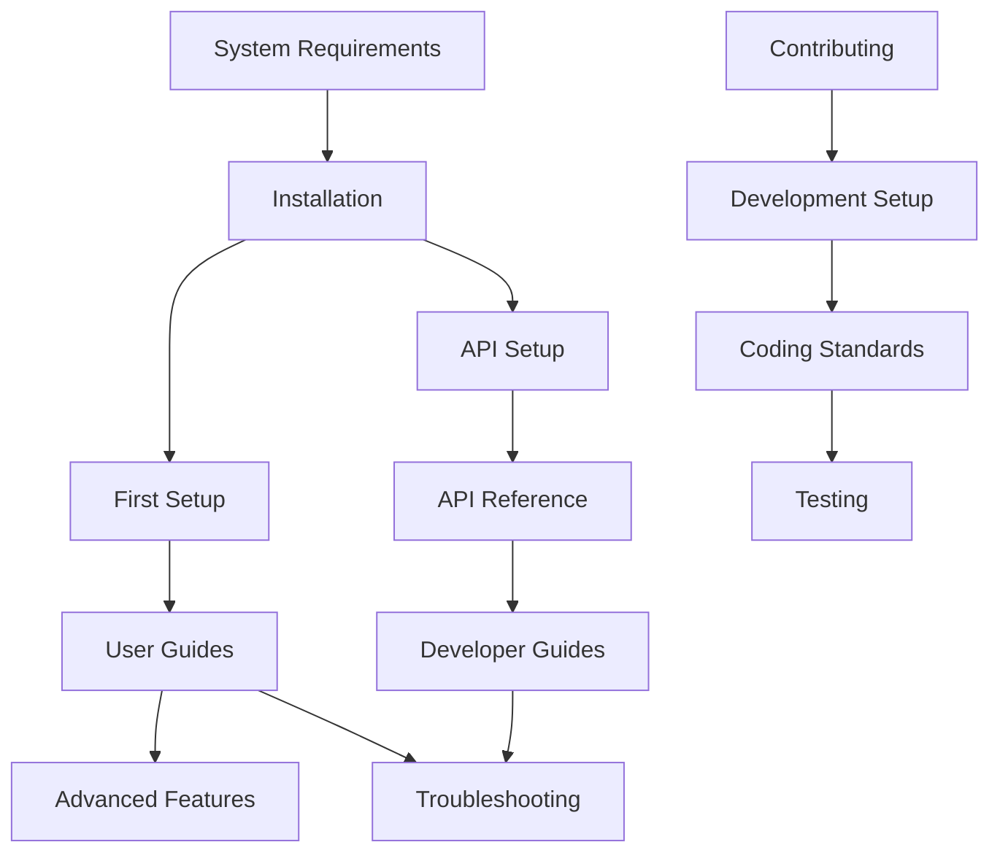

# MediaNest Documentation Content Migration Strategy

## Systematic Content Organization and Taxonomy Design

### MIGRATION PRIORITY MATRIX

#### PRIORITY 1: CRITICAL CONTENT (Immediate Action Required)

**Target: Complete within 24 hours**

| Source File               | Target Location              | Migration Type    | Status   |
| ------------------------- | ---------------------------- | ----------------- | -------- |
| `docs/ARCHITECTURE.md`    | `developers/architecture.md` | MIGRATE           | 🔄 Ready |
| `docs/API.md`             | `api/index.md`               | ENHANCE & MIGRATE | 🔄 Ready |
| `docs/INSTALLATION.md`    | `installation/index.md`      | MIGRATE           | 🔄 Ready |
| `docs/USER_GUIDE.md`      | `user-guides/index.md`       | MIGRATE           | 🔄 Ready |
| `docs/SECURITY.md`        | `developers/security.md`     | MIGRATE           | 🔄 Ready |
| `docs/TROUBLESHOOTING.md` | `troubleshooting/index.md`   | MIGRATE           | 🔄 Ready |
| `docs/CONTRIBUTING.md`    | `developers/contributing.md` | MIGRATE           | 🔄 Ready |

#### PRIORITY 2: VALUABLE CONTENT (48-72 hours)

**Target: Complete within 3 days**

| Source Content                                  | Target Structure                           | Action Required |
| ----------------------------------------------- | ------------------------------------------ | --------------- |
| Scattered API docs in `docs/api/`               | Consolidate into unified API reference     | CONSOLIDATE     |
| Implementation guides in `docs/implementation/` | Integrate into developers/ section         | INTEGRATE       |
| Performance docs in `docs/performance/`         | Split between user-guides/ and developers/ | REORGANIZE      |
| Operations docs in `docs/operations/`           | Move to developers/deployment.md           | MERGE           |

#### PRIORITY 3: CLEANUP (Ongoing)

**Target: Complete within 1 week**

| Content Type                       | Action  | Rationale                    |
| ---------------------------------- | ------- | ---------------------------- |
| Assessment reports (\*\_REPORT.md) | ARCHIVE | Historical value only        |
| Build validation docs              | ARCHIVE | Development artifacts        |
| Audit summaries (2025-09-08)       | ARCHIVE | Dated assessment data        |
| Cleanup backup folders             | DELETE  | Redundant duplicates         |
| Memory performance data            | ARCHIVE | Raw data, keep for reference |

### CONTENT TAXONOMY SYSTEM

#### CONTENT TYPE CLASSIFICATION

```yaml
content_types:
  conceptual:
    description: 'Explains concepts and how things work'
    examples: ['architecture.md', 'system-overview.md']
    template: 'concept-template.md'

  procedural:
    description: 'Step-by-step instructions'
    examples: ['installation.md', 'setup-guide.md']
    template: 'procedure-template.md'

  reference:
    description: 'Technical specifications and lookups'
    examples: ['api-reference.md', 'config-options.md']
    template: 'reference-template.md'

  troubleshooting:
    description: 'Problem-solution documentation'
    examples: ['common-issues.md', 'error-codes.md']
    template: 'troubleshooting-template.md'

  tutorial:
    description: 'Learning-oriented guidance'
    examples: ['getting-started.md', 'first-setup.md']
    template: 'tutorial-template.md'
```

#### AUDIENCE SEGMENTATION

```yaml
audiences:
  end_user:
    needs: ['how to use features', 'basic troubleshooting']
    content_focus: ['user-guides', 'getting-started', 'basic troubleshooting']
    complexity: 'beginner to intermediate'

  developer:
    needs: ['integration guides', 'API reference', 'architecture']
    content_focus: ['api', 'developers', 'advanced troubleshooting']
    complexity: 'intermediate to advanced'

  administrator:
    needs: ['deployment', 'configuration', 'system management']
    content_focus: ['installation', 'configuration', 'operations']
    complexity: 'intermediate to advanced'

  contributor:
    needs: ['development setup', 'coding standards', 'testing']
    content_focus: ['developers', 'contributing guidelines']
    complexity: 'advanced'
```

#### DIFFICULTY CLASSIFICATION

```yaml
difficulty_levels:
  beginner:
    characteristics: ['step-by-step', 'no prerequisites', 'basic concepts']
    time_investment: '5-15 minutes'
    examples: ['quickstart.md', 'basic-features.md']

  intermediate:
    characteristics: ['some experience assumed', 'references other concepts']
    time_investment: '15-45 minutes'
    examples: ['advanced-configuration.md', 'api-integration.md']

  advanced:
    characteristics: ['expert knowledge', 'complex procedures']
    time_investment: '45+ minutes'
    examples: ['custom-development.md', 'performance-tuning.md']
```

### SYSTEMATIC MIGRATION PROCESS

#### PHASE 1: CONTENT AUDIT AND PREPARATION

```bash
# 1. Create backup of current structure
cp -r docs/ docs-backup-$(date +%Y%m%d)/

# 2. Analyze content for migration mapping
find docs/ -name "*.md" -exec wc -l {} + | sort -nr > content-analysis.txt

# 3. Create target directory structure
mkdir -p docs/{getting-started,installation,user-guides,api,developers,troubleshooting,reference}

# 4. Identify orphaned and duplicate content
find docs/ -name "*REPORT*.md" -o -name "*SUMMARY*.md" -o -name "*ASSESSMENT*.md" > archive-list.txt
```

#### PHASE 2: CORE CONTENT MIGRATION

```bash
# Critical content migration script
#!/bin/bash

# Function to migrate with front matter enhancement
migrate_content() {
    local source=$1
    local target=$2
    local content_type=$3
    local audience=$4
    local difficulty=$5

    # Add front matter
    cat > "$target" << EOF
---
title: "$(basename "$target" .md | tr '-' ' ' | sed 's/\b\w/\u&/g')"
description: "Generated from $source"
type: "$content_type"
audience: "$audience"
difficulty: "$difficulty"
tags: [$(echo "$audience" | tr ',' '\n' | sed 's/^/  - /' | tr '\n' ',' | sed 's/,$/\n/')]
last_updated: "$(date -I)"
---

EOF

    # Append original content (skip existing front matter)
    sed '/^---$/,/^---$/d' "$source" >> "$target"
}

# Execute migrations
migrate_content "docs/ARCHITECTURE.md" "docs/developers/architecture.md" "conceptual" "developer" "intermediate"
migrate_content "docs/API.md" "docs/api/index.md" "reference" "developer" "intermediate"
migrate_content "docs/INSTALLATION.md" "docs/installation/index.md" "procedural" "administrator" "beginner"
```

#### PHASE 3: CONTENT CONSOLIDATION

```yaml
# API Documentation Consolidation Plan
api_consolidation:
  target: 'docs/api/'
  sources:
    - 'docs/api/REST_API_REFERENCE.md' # → Keep as comprehensive reference
    - 'docs/api/WEBSOCKET_API_REFERENCE.md' # → Integrate into main API docs
    - 'docs/api/ERROR_CODES_REFERENCE.md' # → Merge into errors.md
    - 'docs/api/OPENAPI_SPECIFICATION.md' # → Link from index.md
    - 'docs/api/authentication.md' # → Enhance with examples
    - 'docs/api/media.md' # → Expand with use cases

  actions:
    - consolidate_error_codes: 'Merge error codes into unified reference'
    - enhance_examples: 'Add practical code examples'
    - cross_reference: 'Add links between related endpoints'
    - validate_openapi: 'Ensure OpenAPI spec matches documentation'
```

### CONTENT ENHANCEMENT STRATEGY

#### MISSING CONTENT IDENTIFICATION

```yaml
content_gaps:
  user_guides:
    missing:
      - 'Media library setup and organization'
      - 'Advanced search and filtering techniques'
      - 'Collection management and sharing'
      - 'Backup and restoration procedures'
      - 'Performance optimization for users'

  developer_docs:
    missing:
      - 'Plugin development guide'
      - 'Database schema documentation'
      - 'Testing framework usage'
      - 'Performance profiling tools'
      - 'Security best practices'

  troubleshooting:
    missing:
      - 'Database connection issues'
      - 'Media processing failures'
      - 'Performance bottleneck diagnosis'
      - 'Authentication troubleshooting'
      - 'Log analysis guides'
```

#### CONTENT TEMPLATE SYSTEM

```markdown
# Template: User Guide Page

---

title: "[Feature Name] Guide"
description: "Learn how to use [feature] in MediaNest"
type: "procedural"
audience: "end_user"
difficulty: "beginner"
tags: [user-guide, [feature-tag]]
prerequisites: []
estimated_time: "10-15 minutes"

---

# [Feature Name] Guide

## Overview

Brief explanation of what this feature does and why it's useful.

## Prerequisites

- List any required setup
- Link to relevant installation/configuration docs

## Step-by-Step Instructions

### Step 1: [Action]

Detailed instructions with screenshots

### Step 2: [Action]

Continue with clear, actionable steps

## Common Use Cases

### Use Case 1: [Scenario]

Real-world example with context

## Troubleshooting

### Issue: [Common Problem]

**Symptoms**: What the user sees
**Solution**: How to fix it
**Prevention**: How to avoid it

## What's Next?

- Link to related guides
- Suggest logical next steps
- Reference advanced topics

## Related Resources

- [Related User Guide](../path/to/guide.md)
- [API Reference](../api/endpoint.md)
- [Troubleshooting](../troubleshooting/issue.md)
```

### QUALITY ASSURANCE FRAMEWORK

#### CONTENT VALIDATION CHECKLIST

```yaml
validation_criteria:
  structure:
    - [ ] Front matter complete and accurate
    - [ ] Heading hierarchy logical (H1 → H2 → H3)
    - [ ] Navigation breadcrumbs present
    - [ ] Cross-references working

  content:
    - [ ] Clear value proposition in introduction
    - [ ] Step-by-step instructions actionable
    - [ ] Code examples tested and working
    - [ ] Screenshots current and relevant

  accessibility:
    - [ ] Alt text for all images
    - [ ] Descriptive link text
    - [ ] Logical reading order
    - [ ] Proper heading structure

  seo:
    - [ ] Meta description under 160 characters
    - [ ] Title tag descriptive and unique
    - [ ] Keywords naturally integrated
    - [ ] Internal linking optimized
```

#### AUTOMATED VALIDATION TOOLS

```bash
# Link validation
find docs/ -name "*.md" -exec markdown-link-check {} \;

# Style validation
markdownlint docs/**/*.md

# Spelling check
find docs/ -name "*.md" -exec aspell --mode=markdown check {} \;

# Accessibility validation
pa11y-ci --sitemap http://localhost:8000/sitemap.xml
```

### CONTENT RELATIONSHIP MAPPING

#### CROSS-REFERENCE AUTOMATION

```python
# Cross-reference mapping system
cross_references = {
    'installation': {
        'related': ['getting-started', 'configuration'],
        'dependencies': ['system-requirements'],
        'next_steps': ['user-guides', 'api-setup']
    },
    'api-reference': {
        'related': ['developers', 'authentication'],
        'dependencies': ['installation'],
        'examples': ['tutorials', 'use-cases']
    },
    'troubleshooting': {
        'related': ['user-guides', 'developers'],
        'dependencies': ['installation', 'configuration'],
        'escalation': ['support-channels', 'bug-reporting']
    }
}
```

#### CONTENT DEPENDENCY GRAPH



### MAINTENANCE STRATEGY

#### CONTENT LIFECYCLE MANAGEMENT

```yaml
lifecycle_stages:
  creation:
    process: ['draft', 'technical_review', 'editorial_review', 'publish']
    templates: 'Use standardized content templates'
    validation: 'Automated quality checks'

  maintenance:
    frequency: 'Quarterly content audits'
    triggers: ['version updates', 'user feedback', 'support tickets']
    process: ['review', 'update', 'validate', 'republish']

  retirement:
    criteria: ['outdated information', 'deprecated features', 'low usage']
    process: ['archive', 'redirect', 'update_references']
    preservation: 'Maintain in archive for historical reference'
```

#### SUCCESS METRICS

```yaml
kpis:
  findability:
    metric: 'Time to find information'
    target: '< 30 seconds for common tasks'
    measurement: 'User testing and analytics'

  completeness:
    metric: 'Documentation coverage'
    target: '100% of features documented'
    measurement: 'Feature audit against documentation'

  accuracy:
    metric: 'Documentation error rate'
    target: '< 1% reported errors per page'
    measurement: 'User feedback and testing'

  usability:
    metric: 'Task completion rate'
    target: '> 90% successful task completion'
    measurement: 'User testing sessions'
```

This migration strategy provides a systematic approach to transforming the fragmented MediaNest documentation into a coherent, user-centric information architecture that aligns with modern documentation best practices.
