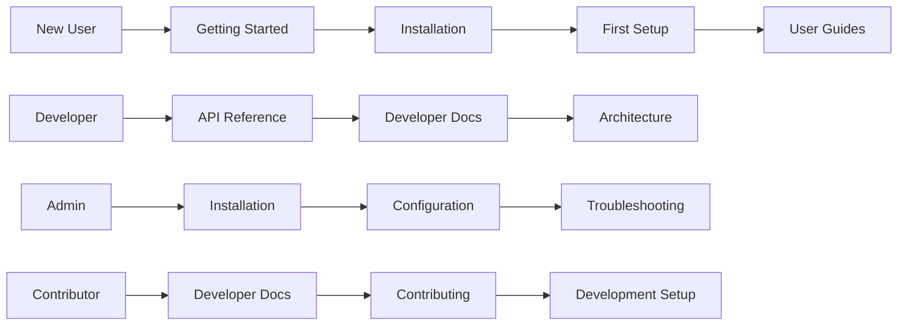

# MediaNest Documentation Information Architecture Analysis

## Structure Architect Assessment - September 9, 2025

### EXECUTIVE SUMMARY

The MediaNest documentation has an **EXCELLENT foundation** with professional MKDocs Material configuration but suffers from **SEVERE CONTENT FRAGMENTATION**. The existing mkdocs.yml provides a solid architectural framework that needs content consolidation and strategic reorganization.

### CURRENT STATE ANALYSIS

#### ✅ STRENGTHS

1. **Professional MKDocs Setup**: Comprehensive Material theme configuration with advanced features
2. **Logical Navigation Structure**: Well-planned hierarchy in mkdocs.yml
3. **Quality Landing Pages**: docs/index.md provides excellent user onboarding
4. **API Documentation**: Comprehensive API reference structure already established
5. **Automated Infrastructure**: Complete CI/CD pipeline for documentation deployment

#### ❌ CRITICAL ISSUES

1. **Content Fragmentation**: 500+ markdown files scattered across project
2. **Directory Structure Mismatch**: Current content doesn't align with mkdocs.yml navigation
3. **Assessment Report Overload**: Dozens of status reports cluttering structure
4. **Orphaned Content**: Valuable documentation buried in subdirectories
5. **Inconsistent Information Hierarchy**: No unified content taxonomy

### INFORMATION ARCHITECTURE DESIGN

#### USER JOURNEY MAPPING



#### CONTENT HIERARCHY OPTIMIZATION

**PRIMARY NAVIGATION (Top-Level)**:

```
1. Home (Landing/Dashboard)
2. Getting Started (Progressive Onboarding)
3. Installation (Environment Setup)
4. User Guides (Feature Usage)
5. API Reference (Developer Integration)
6. Developer Docs (Advanced Development)
7. Troubleshooting (Problem Resolution)
8. Reference (Technical Specifications)
```

**SECONDARY NAVIGATION (Section-Level)**:

- Each primary section has 5-8 focused subsections
- Progressive disclosure from basic to advanced
- Clear mental model alignment

#### CONTENT CATEGORIZATION STRATEGY

**KEEP & MIGRATE (High Value)**:

- docs/ARCHITECTURE.md → developers/architecture.md
- docs/API.md → api/index.md
- docs/INSTALLATION.md → installation/manual.md
- docs/USER_GUIDE.md → user-guides/index.md
- docs/SECURITY.md → developers/security.md
- docs/TROUBLESHOOTING.md → troubleshooting/index.md

**ARCHIVE (Historical Value)**:

- All _-REPORT.md, _-SUMMARY.md, \*-ASSESSMENT.md files
- cleanup-backups-\* directories
- docs/memory/ performance data
- Build validation and audit reports

**ENHANCE (Fill Gaps)**:

- Create missing user guides for media management
- Consolidate scattered API documentation
- Add visual architecture diagrams
- Create comprehensive troubleshooting guides

### NAVIGATION DESIGN PRINCIPLES

#### 1. PROGRESSIVE DISCLOSURE

- Basic → Intermediate → Advanced content flow
- Contextual cross-references between sections
- Clear prerequisites and dependencies

#### 2. MENTAL MODEL ALIGNMENT

- **Getting Started**: "I want to try MediaNest"
- **Installation**: "I want to deploy MediaNest"
- **User Guides**: "I want to use MediaNest features"
- **API Reference**: "I want to integrate with MediaNest"
- **Developer Docs**: "I want to contribute to MediaNest"

#### 3. WAYFINDING SYSTEMS

- Breadcrumb navigation for orientation
- "What's Next" sections for guided progression
- Related content suggestions
- Search optimization with proper tagging

### RESPONSIVE INFORMATION ARCHITECTURE

#### MOBILE-FIRST CONSIDERATIONS

- Collapsible navigation sections
- Touch-optimized menu interactions
- Progressive content loading
- Simplified navigation for small screens

#### DESKTOP ENHANCEMENTS

- Sidebar table of contents
- Multi-level navigation expansion
- Quick search with autocomplete
- Cross-referencing sidebar

### SEARCH & FINDABILITY OPTIMIZATION

#### CONTENT TAGGING STRATEGY

```yaml
tags:
  difficulty: [beginner, intermediate, advanced]
  category: [setup, usage, development, troubleshooting]
  audience: [user, developer, admin]
  platform: [docker, manual, cloud]
  integration: [plex, api, webhook]
```

#### FACETED SEARCH IMPLEMENTATION

- Filter by difficulty level
- Filter by audience type
- Filter by content category
- Filter by platform/deployment method

### ACCESSIBILITY & USABILITY

#### WCAG 2.1 AA COMPLIANCE

- Semantic heading hierarchy (H1-H6)
- Alt text for all images and diagrams
- Keyboard navigation support
- Screen reader optimization

#### COGNITIVE ACCESSIBILITY

- Clear, concise language
- Consistent terminology
- Visual hierarchy with proper contrast
- Logical information sequencing

### CONTENT MANAGEMENT TAXONOMY

#### CONTENT TYPES

1. **Conceptual**: Understanding MediaNest concepts
2. **Procedural**: Step-by-step instructions
3. **Reference**: Technical specifications
4. **Troubleshooting**: Problem-solution pairs
5. **Examples**: Code samples and use cases

#### CONTENT LIFECYCLE

- **Creation**: Template-based content creation
- **Review**: Technical and editorial review process
- **Maintenance**: Regular content audits and updates
- **Retirement**: Archival of outdated content

### IMPLEMENTATION ROADMAP

#### PHASE 1: FOUNDATION (Days 1-2)

1. **Content Audit Complete**: Categorize all existing content
2. **Directory Cleanup**: Remove assessment reports and duplicates
3. **Core Migration**: Move essential documentation to proper structure
4. **Navigation Alignment**: Ensure content matches mkdocs.yml structure

#### PHASE 2: ENHANCEMENT (Days 3-5)

1. **Content Gap Analysis**: Identify missing documentation
2. **User Guide Creation**: Develop comprehensive user guides
3. **API Consolidation**: Merge scattered API documentation
4. **Visual Assets**: Add architecture diagrams and screenshots

#### PHASE 3: OPTIMIZATION (Days 6-7)

1. **Search Implementation**: Configure advanced search features
2. **Cross-References**: Add contextual navigation links
3. **Performance Testing**: Optimize build and load times
4. **User Testing**: Validate navigation patterns

### QUALITY METRICS

#### SUCCESS CRITERIA

- **Findability**: Users can locate information in <30 seconds
- **Completeness**: No dead ends or missing information
- **Consistency**: Uniform structure and terminology
- **Accessibility**: WCAG 2.1 AA compliance achieved
- **Performance**: Page load times <3 seconds

#### MEASUREMENT APPROACH

- User testing sessions with task completion rates
- Analytics tracking for most/least visited sections
- Search query analysis for content gaps
- Feedback collection via GitHub issues

### RISK MITIGATION

#### CONTENT MIGRATION RISKS

- **Content Loss**: Systematic backup before migration
- **Link Breakage**: Comprehensive link validation
- **Search Impact**: Temporary search disruption during migration
- **User Confusion**: Clear migration communication

#### MITIGATION STRATEGIES

- Phased migration with rollback capabilities
- Automated link checking and redirects
- Search index rebuilding automation
- User communication via announcements

### TECHNICAL REQUIREMENTS

#### MKDocs Configuration Enhancements

- Search plugin optimization for better indexing
- Navigation path breadcrumbs
- Cross-reference automation
- Content template system

#### Infrastructure Dependencies

- CI/CD pipeline for automated content validation
- Link checking automation
- Search index optimization
- Performance monitoring

### RECOMMENDATION PRIORITY MATRIX

| Priority | Action                     | Impact | Effort |
| -------- | -------------------------- | ------ | ------ |
| P0       | Remove assessment reports  | High   | Low    |
| P0       | Migrate core documentation | High   | Medium |
| P1       | Create missing user guides | High   | High   |
| P1       | Consolidate API docs       | Medium | Medium |
| P2       | Add visual assets          | Medium | High   |
| P2       | Implement advanced search  | Medium | Medium |

The MediaNest documentation has excellent infrastructure and a solid architectural foundation. The primary challenge is content organization and consolidation, not structural design. With focused effort on content migration and gap-filling, this can become exemplary technical documentation.
