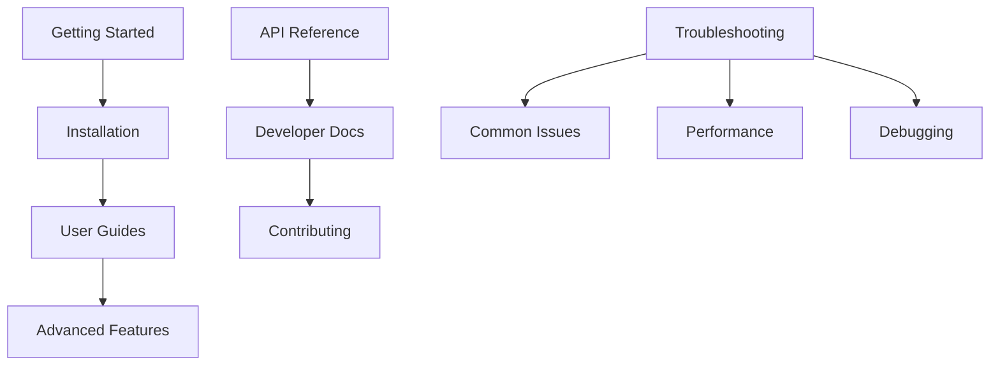

# MediaNest Documentation Navigation Design Blueprint

## Information Architecture Implementation Plan

### OPTIMAL DIRECTORY STRUCTURE

```
docs/
├── index.md                           # Landing page with clear value proposition
├── assets/                            # Shared assets and media
│   ├── images/
│   │   ├── architecture/              # System diagrams
│   │   ├── screenshots/               # UI screenshots
│   │   ├── logos/                     # Brand assets
│   │   └── icons/                     # Navigation icons
│   ├── stylesheets/
│   │   ├── extra.css                  # Custom styling
│   │   ├── medianest-theme.css        # Brand theme
│   │   └── responsive.css             # Mobile optimization
│   └── javascripts/
│       ├── medianest.js               # Core functionality
│       ├── search-enhancements.js     # Search optimization
│       └── analytics.js               # Usage tracking
│
├── getting-started/                   # Progressive onboarding
│   ├── index.md                       # Welcome & overview
│   ├── quickstart.md                  # 5-minute setup
│   ├── requirements.md                # System requirements
│   └── first-setup.md                 # Initial configuration
│
├── installation/                      # Environment setup
│   ├── index.md                       # Installation overview
│   ├── docker.md                      # Docker deployment (recommended)
│   ├── manual.md                      # Manual installation
│   ├── configuration.md               # Configuration options
│   ├── environment.md                 # Environment variables
│   └── database.md                    # Database setup
│
├── user-guides/                       # Feature usage documentation
│   ├── index.md                       # User guide overview
│   ├── media-management.md            # Managing media libraries
│   ├── file-organization.md           # File structure best practices
│   ├── search-filtering.md            # Advanced search techniques
│   ├── metadata.md                    # Metadata management
│   ├── collections.md                 # Creating and managing collections
│   ├── sharing.md                     # Sharing and permissions
│   └── backup-sync.md                 # Backup and synchronization
│
├── api/                               # Developer integration
│   ├── index.md                       # API overview
│   ├── authentication.md              # Auth flow and tokens
│   ├── media.md                       # Media endpoints
│   ├── collections.md                 # Collection management
│   ├── users.md                       # User management
│   ├── search.md                      # Search API
│   ├── webhooks.md                    # Webhook integration
│   ├── admin.md                       # Admin endpoints
│   ├── health.md                      # Health checks
│   ├── dashboard.md                   # Dashboard data
│   ├── plex.md                        # Plex integration
│   ├── rate-limiting.md               # Rate limiting
│   ├── errors.md                      # Error handling
│   ├── REST_API_REFERENCE.md          # Complete REST reference
│   ├── WEBSOCKET_API_REFERENCE.md     # WebSocket reference
│   ├── ERROR_CODES_REFERENCE.md       # Error codes
│   └── OPENAPI_SPECIFICATION_V3.yaml  # OpenAPI spec
│
├── developers/                        # Advanced development
│   ├── index.md                       # Developer overview
│   ├── architecture.md                # System architecture
│   ├── contributing.md                # Contribution guidelines
│   ├── development-setup.md           # Dev environment setup
│   ├── coding-standards.md            # Code style and standards
│   ├── testing.md                     # Testing strategy
│   ├── deployment.md                  # Deployment procedures
│   ├── database-schema.md             # Database design
│   ├── plugins.md                     # Plugin development
│   ├── security.md                    # Security considerations
│   └── performance.md                 # Performance optimization
│
├── troubleshooting/                   # Problem resolution
│   ├── index.md                       # Troubleshooting guide
│   ├── common-issues.md               # Frequently encountered problems
│   ├── performance.md                 # Performance issues
│   ├── database.md                    # Database problems
│   ├── media-processing.md            # Media processing issues
│   ├── authentication.md              # Authentication problems
│   └── debugging.md                   # Debug tools and techniques
│
├── reference/                         # Technical specifications
│   ├── index.md                       # Reference overview
│   ├── cli.md                         # Command-line interface
│   ├── config-reference.md            # Configuration reference
│   ├── formats.md                     # Supported file formats
│   ├── faq.md                         # Frequently asked questions
│   ├── glossary.md                    # Technical glossary
│   └── changelog.md                   # Version history
│
├── overrides/                         # MkDocs theme customization
│   ├── 404.html                       # Custom 404 page
│   ├── base.html                      # Base template override
│   └── partials/
│       ├── header.html                # Custom header
│       ├── footer.html                # Custom footer
│       └── navigation.html            # Navigation override
│
└── quality-assurance/                 # Documentation QA
    ├── style-guide.md                 # Writing style guide
    ├── accessibility.md               # Accessibility guidelines
    ├── content-templates.md           # Content templates
    └── review-checklist.md            # Quality review checklist
```

### NAVIGATION HIERARCHY DESIGN

#### PRIMARY NAVIGATION (Main Menu)

```yaml
nav:
  - Home: index.md

  - Getting Started: # 🚀 Onboarding pathway
      - getting-started/index.md
      - Quick Start: getting-started/quickstart.md
      - System Requirements: getting-started/requirements.md
      - First Time Setup: getting-started/first-setup.md

  - Installation: # ⚙️ Deployment pathway
      - installation/index.md
      - Docker Installation: installation/docker.md
      - Manual Installation: installation/manual.md
      - Configuration: installation/configuration.md
      - Environment Variables: installation/environment.md
      - Database Setup: installation/database.md

  - User Guides: # 👤 Feature usage pathway
      - user-guides/index.md
      - Media Management: user-guides/media-management.md
      - File Organization: user-guides/file-organization.md
      - Search and Filtering: user-guides/search-filtering.md
      - Metadata Management: user-guides/metadata.md
      - Collections: user-guides/collections.md
      - Sharing and Permissions: user-guides/sharing.md
      - Backup and Sync: user-guides/backup-sync.md

  - API Reference: # 🔌 Integration pathway
      - api/index.md
      - Authentication: api/authentication.md
      - Media API: api/media.md
      - Collections API: api/collections.md
      - User Management: api/users.md
      - Search API: api/search.md
      - Webhooks: api/webhooks.md
      - Admin Functions: api/admin.md
      - Health Checks: api/health.md
      - Rate Limiting: api/rate-limiting.md
      - Error Handling: api/errors.md

  - Developer Docs: # 🛠️ Development pathway
      - developers/index.md
      - Architecture Overview: developers/architecture.md
      - Contributing: developers/contributing.md
      - Development Setup: developers/development-setup.md
      - Coding Standards: developers/coding-standards.md
      - Testing: developers/testing.md
      - Deployment: developers/deployment.md
      - Database Schema: developers/database-schema.md
      - Plugin Development: developers/plugins.md

  - Troubleshooting: # 🔧 Problem resolution pathway
      - troubleshooting/index.md
      - Common Issues: troubleshooting/common-issues.md
      - Performance Issues: troubleshooting/performance.md
      - Database Issues: troubleshooting/database.md
      - Media Processing: troubleshooting/media-processing.md
      - Authentication Problems: troubleshooting/authentication.md
      - Logs and Debugging: troubleshooting/debugging.md

  - Reference: # 📖 Technical reference pathway
      - reference/index.md
      - CLI Commands: reference/cli.md
      - Configuration Reference: reference/config-reference.md
      - Supported Formats: reference/formats.md
      - FAQ: reference/faq.md
      - Glossary: reference/glossary.md
      - Changelog: reference/changelog.md
```

### USER EXPERIENCE DESIGN

#### LANDING PAGE OPTIMIZATION (index.md)

```markdown
# Welcome to MediaNest Documentation

## What would you like to do?

### 🚀 Get Started Quickly

**New to MediaNest?** Start here for guided setup in 5 minutes.
[Quick Start Guide →](getting-started/quickstart.md)

### ⚙️ Install MediaNest

**Ready to deploy?** Choose your installation method.
[Installation Guide →](installation/index.md)

### 👤 Learn the Features

**Want to explore capabilities?** Discover what MediaNest can do.
[User Guides →](user-guides/index.md)

### 🔌 Integrate with API

**Building integrations?** Complete API documentation.
[API Reference →](api/index.md)

### 🛠️ Contribute Code

**Want to contribute?** Developer resources and guidelines.
[Developer Docs →](developers/index.md)

### 🔧 Solve Problems

**Having issues?** Find solutions and debugging help.
[Troubleshooting →](troubleshooting/index.md)
```

#### BREADCRUMB NAVIGATION

```html
<nav aria-label="Breadcrumb">
  <ol class="breadcrumb">
    <li><a href="/">Home</a></li>
    <li><a href="/user-guides/">User Guides</a></li>
    <li class="current">Media Management</li>
  </ol>
</nav>
```

#### CONTEXTUAL NAVIGATION

```markdown
## What's Next?

After setting up media management, you might want to:

- [Configure file organization](file-organization.md)
- [Set up automated metadata](metadata.md)
- [Create your first collection](collections.md)

## Related Topics

- [API: Media endpoints](../api/media.md)
- [Troubleshooting: Media processing issues](../troubleshooting/media-processing.md)
```

### RESPONSIVE DESIGN PATTERNS

#### MOBILE NAVIGATION

```css
/* Mobile-first navigation */
@media (max-width: 768px) {
  .md-nav__title {
    font-size: 1.1rem;
    padding: 0.5rem;
  }

  .md-nav__list {
    padding: 0.25rem;
  }

  .md-nav__item {
    margin: 0.125rem 0;
  }
}
```

#### PROGRESSIVE DISCLOSURE

- Section overviews with expandable subsections
- "Show more" patterns for comprehensive content
- Collapsible code examples and technical details

### SEARCH OPTIMIZATION

#### CONTENT TAGGING

```yaml
# Front matter for content pages
---
title: 'Media Management Guide'
description: 'Complete guide to managing media libraries in MediaNest'
tags:
  - user-guide
  - media
  - beginner
audience: user
difficulty: beginner
platform: all
---
```

#### SEARCH CONFIGURATION

```yaml
# Enhanced search in mkdocs.yml
plugins:
  - search:
      separator: '[\s\-,:!=\[\]()"`/]+|\.(?!\d)|&[lg]t;|(?!\b)(?=[A-Z][a-z])'
      lang:
        - en
      indexing: 'full'
      prebuild_index: true
```

### ACCESSIBILITY IMPLEMENTATION

#### SEMANTIC STRUCTURE

```html
<main role="main" aria-label="Main content">
  <article>
    <header>
      <h1>Media Management</h1>
      <nav aria-label="Page contents">
        <!-- Table of contents -->
      </nav>
    </header>
    <section>
      <!-- Content sections -->
    </section>
  </article>
</main>
```

#### KEYBOARD NAVIGATION

- Tab order optimized for logical flow
- Skip links for screen readers
- Focus indicators on all interactive elements

### CONTENT RELATIONSHIP MAPPING

#### CROSS-REFERENCE SYSTEM

```markdown
<!-- Automatic cross-references -->

[!ref API Reference](../api/media.md#upload-media)
[!ref Troubleshooting](../troubleshooting/media-processing.md)
[!ref Developer Guide](../developers/architecture.md#media-pipeline)
```

#### CONTENT DEPENDENCIES



### PERFORMANCE OPTIMIZATION

#### CONTENT LOADING STRATEGY

- Lazy loading for images and heavy content
- Prefetching for likely next pages
- Optimized bundle sizes with tree shaking

#### CACHING STRATEGY

- CDN distribution for static assets
- Service worker for offline documentation
- Incremental build optimization

### QUALITY ASSURANCE FRAMEWORK

#### CONTENT VALIDATION

```yaml
# Automated content checks
validation:
  nav:
    omitted_files: warn
    not_found: error
    absolute_links: info
  links:
    not_found: error
    external_links: warn
  content:
    duplicate_titles: warn
    missing_descriptions: info
```

#### USER TESTING METRICS

- Task completion rates for common workflows
- Time to find information benchmarks
- User satisfaction surveys
- Navigation pattern analysis

This navigation design blueprint provides a scalable, user-centric information architecture that aligns with the existing MKDocs Material configuration while addressing the content fragmentation issues identified in the audit.
