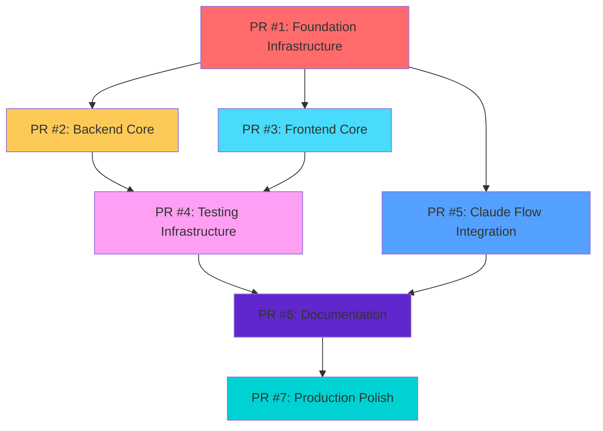

# PR Dependency Mapping & Critical Path Analysis

## Strategic Dependencies for 1,083 File Migration

**Version:** 1.0  
**Date:** July 21, 2025  
**Objective:** Map critical dependencies between PR groups for safe parallel development and deployment

---

## Dependency Matrix

### 🔄 Critical Path Dependencies



### 📊 Dependency Analysis

#### **BLOCKING DEPENDENCIES** (Must be sequential):

1. **PR #1 → PR #2:** Backend requires Docker, database schema, and configuration
2. **PR #1 → PR #3:** Frontend requires build tools, environment setup, and CI/CD
3. **PR #2 + PR #3 → PR #4:** Tests require both backend and frontend to be functional
4. **PR #4 → PR #6:** Documentation includes test results and coverage reports
5. **PR #6 → PR #7:** Production polish uses documentation for validation

#### **PARALLEL OPPORTUNITIES** (Can develop simultaneously):

- **PR #2 & PR #3:** Backend and Frontend teams can work in parallel after PR #1
- **PR #5:** Claude Flow integration can be developed parallel to PR #2-4
- **PR #6:** Documentation writing can start after PR #4 begins
- **PR #7:** Production optimization can be prepared while PR #6 is being reviewed

---

## Critical Path Items

### 🚨 **CRITICAL PATH:** PR #1 → PR #2 → PR #4 → PR #7

**Total Duration:** 8-12 days  
**Risk Level:** HIGH  
**Why Critical:** Core functionality and production readiness

#### Path Details:

```
PR #1 (2-3 days) → PR #2 (2-3 days) → PR #4 (2-3 days) → PR #7 (1-2 days)
     ↓                    ↓                    ↓                    ↓
Foundation         Backend API        Testing Suite      Production
Infrastructure     Authentication     Critical Paths     Deployment
Docker/CI/CD       Database Layer     Performance        Optimization
```

### 🔶 **SECONDARY PATH:** PR #1 → PR #3 → PR #4 → PR #6

**Total Duration:** 7-10 days  
**Risk Level:** MEDIUM  
**Why Important:** User interface and documentation completeness

### 🔷 **PARALLEL PATH:** PR #1 → PR #5 → PR #6 → PR #7

**Total Duration:** 6-8 days  
**Risk Level:** LOW-MEDIUM  
**Why Valuable:** AI coordination and automation benefits

---

## File-Level Dependencies

### 📋 Core Configuration Dependencies

#### **Root Package.json** (PR #1) → **Module Package.json** (PR #2, #3)

```json
{
  "dependencies": {
    "shared": "workspace:*", // PR #1 must establish workspace
    "backend": "workspace:*", // PR #2 depends on workspace setup
    "frontend": "workspace:*" // PR #3 depends on workspace setup
  }
}
```

#### **Docker Infrastructure** (PR #1) → **Application Code** (PR #2, #3)

```dockerfile
# PR #1 establishes base images and build stages
FROM node:24-alpine as base
FROM base as backend-build  # PR #2 uses this stage
FROM base as frontend-build # PR #3 uses this stage
```

#### **Database Schema** (PR #1) → **Backend Services** (PR #2)

```sql
-- PR #1: Schema definition
-- backend/prisma/schema.prisma

-- PR #2: Service implementations depend on schema
-- backend/src/repositories/*.ts
-- backend/src/services/*.ts
```

### 🔗 Code-Level Dependencies

#### **Shared Types** (PR #1) → **Application Types** (PR #2, #3)

```typescript
// PR #1: shared/src/types/index.ts
export interface User { ... }
export interface MediaRequest { ... }

// PR #2: backend/src/types/index.ts (extends shared)
// PR #3: frontend/src/types/*.ts (extends shared)
```

#### **Environment Configuration** (PR #1) → **Service Configuration** (PR #2, #3)

```bash
# PR #1: .env.example, .env.production.template
DATABASE_URL=postgresql://...
REDIS_URL=redis://...

# PR #2: backend/src/config/*.ts (reads these vars)
# PR #3: frontend/next.config.js (reads these vars)
```

#### **Middleware Chain** (PR #2) → **Route Handlers** (PR #2)

```typescript
// Must be deployed in dependency order within PR #2:
// 1. middleware/error.ts
// 2. middleware/auth.ts
// 3. middleware/rate-limit.ts
// 4. controllers/*.ts (uses middleware)
// 5. routes/*.ts (uses controllers)
```

---

## Risk Mitigation by Dependency

### 🔴 **HIGH RISK DEPENDENCIES**

#### **Database Migrations** (PR #1 → PR #2)

**Risk:** Backend services fail if schema doesn't match expectations  
**Mitigation:**

- Run migrations in staging before PR #2 deployment
- Validate schema compatibility with integration tests
- Keep migration rollback scripts ready
- Use database connection retry logic

#### **Authentication Flow** (PR #2 → PR #3)

**Risk:** Frontend auth breaks if backend auth changes
**Mitigation:**

- Maintain API contract compatibility
- Use feature flags for auth changes
- Deploy backend auth first, then frontend
- Validate auth flows in staging

#### **Environment Variables** (PR #1 → PR #2, #3)

**Risk:** Missing or incorrect env vars break services  
**Mitigation:**

- Validate all required env vars before deployment
- Use env var validation scripts
- Document all new env vars
- Test with production-like env vars in staging

### 🟡 **MEDIUM RISK DEPENDENCIES**

#### **Shared Components** (PR #3 → PR #4)

**Risk:** Test files reference components that may have changed
**Mitigation:**

- Update tests alongside component changes
- Use Storybook for component contract validation
- Run visual regression tests
- Maintain component prop interface stability

#### **API Endpoints** (PR #2 → PR #4)

**Risk:** API tests fail if endpoints change
**Mitigation:**

- Maintain OpenAPI spec accuracy
- Use contract testing for API validation
- Deploy API changes before test changes
- Mock external APIs in tests

### 🟢 **LOW RISK DEPENDENCIES**

#### **Documentation References** (PR #2, #3 → PR #6)

**Risk:** Documentation becomes outdated
**Mitigation:**

- Generate docs from code where possible
- Review docs during code review process
- Use automated link checking
- Schedule regular documentation audits

---

## Deployment Sequence Optimization

### 🚀 **Optimal Parallel Deployment Strategy**

#### **Week 1: Foundation & Core**

```
Day 1: PR #1 (Foundation) - BLOCKING for all others
Day 2: PR #1 review & staging deployment
Day 3: PR #2 (Backend) + PR #5 (Claude Flow) development in parallel
Day 4: PR #3 (Frontend) development (after PR #1 deployed)
Day 5: PR #2 & PR #3 review & staging deployment
```

#### **Week 2: Integration & Testing**

```
Day 6: PR #4 (Testing) development (after PR #2 & #3 deployed)
Day 7: PR #4 review & comprehensive test execution
Day 8: PR #6 (Documentation) development (parallel with PR #4 review)
Day 9: PR #4 deployment + PR #6 review
Day 10: PR #6 deployment
```

#### **Week 3: Production Polish**

```
Day 11: PR #7 (Production Polish) development
Day 12: PR #7 review & performance validation
Day 13: PR #7 deployment + end-to-end validation
Day 14: Production monitoring & optimization
Day 15: Migration completion celebration! 🎉
```

### ⚡ **Time-Critical Path Management**

#### **Bottleneck Identification:**

1. **PR #1 Review:** Most critical bottleneck - all other work waits
2. **PR #2 Database Changes:** Can block PR #4 testing infrastructure
3. **PR #4 Test Execution:** Can delay PR #6 documentation completion

#### **Bottleneck Mitigation:**

- **Dedicated Review Team:** Assign senior engineers to PR #1 review
- **Parallel Review Prep:** Pre-review PR #2 while PR #1 is in staging
- **Test Environment Isolation:** Use separate test DB to avoid blocking
- **Documentation Templates:** Pre-create doc templates before PR #6

---

## Rollback Dependencies

### 🔄 **Rollback Chain Analysis**

#### **Forward Dependencies** (Normal deployment):

PR #1 → PR #2 → PR #4 → PR #7

#### **Rollback Dependencies** (If issues occur):

PR #7 ← PR #4 ← PR #2 ← PR #1

#### **Safe Rollback Points:**

- **After PR #1:** Can rollback to previous infrastructure
- **After PR #2:** Can rollback backend while keeping infrastructure
- **After PR #3:** Can rollback frontend independently
- **After PR #4:** Can rollback tests without affecting functionality
- **After PR #5:** Can disable Claude Flow features via config
- **After PR #6:** Documentation rollback has no functional impact
- **After PR #7:** Can rollback optimizations to stable state

### 🛡️ **Rollback Safety Mechanisms**

#### **Database Rollback:**

- Migration scripts with tested `down()` functions
- Database backup before each major schema change
- Row-level rollback for data changes

#### **Configuration Rollback:**

- Environment variable versioning
- Docker image tagging for quick revert
- Feature flag toggling for immediate disabling

#### **Code Rollback:**

- Git tag at each successful deployment
- Automated rollback scripts for each PR
- Health check integration with auto-rollback

---

## Success Criteria by Dependency Level

### 🎯 **Critical Path Success (PR #1 → #2 → #4 → #7):**

- [ ] Infrastructure deploys without downtime
- [ ] Backend API responds within SLA (<200ms)
- [ ] All critical path tests pass (authentication, media requests, downloads)
- [ ] Production performance meets or exceeds current benchmarks
- [ ] Zero security vulnerabilities introduced

### 🎯 **Secondary Path Success (PR #1 → #3 → #4 → #6):**

- [ ] Frontend renders without hydration errors
- [ ] User workflows complete successfully
- [ ] Visual regression tests pass
- [ ] Documentation accuracy validated
- [ ] Mobile responsiveness maintained

### 🎯 **Parallel Path Success (PR #1 → #5 → #6 → #7):**

- [ ] Claude Flow coordination functional
- [ ] AI-assisted development workflows active
- [ ] Memory persistence and learning operational
- [ ] Performance insights and optimizations applied
- [ ] Team productivity metrics improved

---

## Monitoring & Validation

### 📊 **Dependency Health Monitoring**

#### **Real-time Dependency Checks:**

```bash
# PR #2 depends on PR #1 database
curl /api/health/database

# PR #3 depends on PR #2 auth endpoints
curl /api/v1/auth/status

# PR #4 depends on PR #2 & #3 functionality
npm run test:integration

# PR #6 depends on PR #4 test results
npm run test:coverage-report
```

#### **Automated Dependency Validation:**

- Health check endpoints for each dependency layer
- Integration tests that validate cross-service dependencies
- Performance benchmarks that catch dependency-related slowdowns
- Security scans that validate auth dependencies

### 📈 **Success Metrics by Dependency:**

#### **Infrastructure Dependencies (PR #1):**

- Docker build time: <5 minutes
- Container startup time: <30 seconds
- Database migration time: <2 minutes
- CI/CD pipeline execution: <10 minutes

#### **Application Dependencies (PR #2, #3):**

- API response time: <200ms 95th percentile
- Frontend page load: <3 seconds
- Authentication flow: <5 seconds end-to-end
- WebSocket connection: <1 second establishment

#### **Testing Dependencies (PR #4):**

- Test suite execution: <15 minutes
- Code coverage: >80% maintained
- Integration test success: 100%
- Performance test variance: <5%

---

## Conclusion

This dependency mapping ensures the safe, efficient migration of 1,083 files by:

1. **Identifying Critical Path:** PR #1 → #2 → #4 → #7 as the highest priority sequence
2. **Enabling Parallelization:** PR #2 & #3, PR #5 & #6 can be developed simultaneously
3. **Mitigating Risks:** Each dependency has specific rollback and validation procedures
4. **Optimizing Timeline:** 15-day migration with maximum parallel development
5. **Ensuring Quality:** Comprehensive monitoring and validation at each dependency point

**The result:** A production-ready MediaNest application with advanced Claude Flow capabilities, deployed safely and efficiently with minimal risk to business operations.

---

_This dependency analysis is designed for execution with full Claude Flow swarm coordination, ensuring optimal resource allocation and automated dependency validation throughout the migration process._
