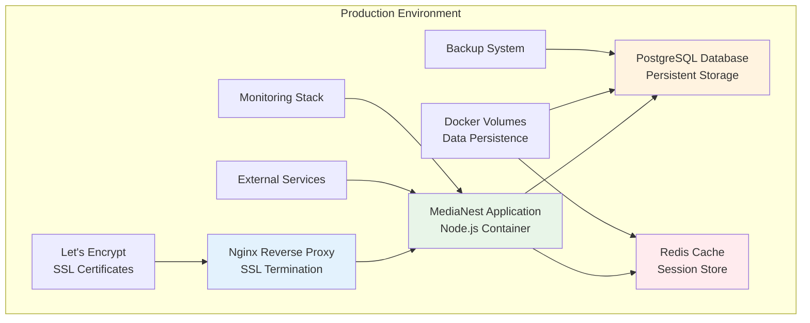

# MediaNest Deployment Guide

**Version:** 2.0  
**Last Updated:** September 9, 2025  
**Target Environment:** Production Ready

## 📋 Table of Contents

1. [Overview](#overview)
2. [Prerequisites](#prerequisites)
3. [Environment Setup](#environment-setup)
4. [Docker Deployment](#docker-deployment)
5. [Database Setup](#database-setup)
6. [SSL Configuration](#ssl-configuration)
7. [Monitoring Setup](#monitoring-setup)
8. [Production Checklist](#production-checklist)
9. [Maintenance & Updates](#maintenance--updates)
10. [Troubleshooting](#troubleshooting)

## Overview

This guide provides comprehensive instructions for deploying MediaNest to production environments. The deployment architecture uses Docker Compose for container orchestration, with proper security, monitoring, and backup procedures.

### Deployment Architecture



## Prerequisites

### System Requirements

**Minimum Specifications:**
- **CPU:** 2 cores
- **RAM:** 4GB
- **Storage:** 50GB SSD
- **Network:** 100Mbps internet connection
- **OS:** Ubuntu 22.04 LTS, Debian 12, CentOS 8, or compatible Linux distribution

**Recommended Specifications:**
- **CPU:** 4 cores
- **RAM:** 8GB
- **Storage:** 100GB SSD
- **Network:** 1Gbps internet connection

### Software Dependencies

```bash
# Required packages
- Docker Engine 24.0+
- Docker Compose V2
- Git 2.30+
- curl/wget
- openssl
- certbot (for SSL certificates)

# Install Docker and Docker Compose
curl -fsSL https://get.docker.com -o get-docker.sh
sudo sh get-docker.sh
sudo usermod -aG docker $USER

# Install Docker Compose V2
sudo apt-get update
sudo apt-get install docker-compose-plugin

# Verify installation
docker --version
docker compose version
```

### Network Requirements

- **Ports:** 80 (HTTP), 443 (HTTPS), 22 (SSH)
- **DNS:** A record pointing to your server IP
- **Firewall:** Configured to allow HTTP/HTTPS traffic

## Environment Setup

### 1. Clone Repository

```bash
# Clone the MediaNest repository
git clone https://github.com/yourusername/medianest.git
cd medianest

# Create production branch (if not exists)
git checkout -b production
```

### 2. Generate Secrets

```bash
# Generate secure random secrets
openssl rand -hex 64 > secrets/jwt_secret
openssl rand -hex 32 > secrets/encryption_key
openssl rand -hex 32 > secrets/nextauth_secret
openssl rand -base64 32 > secrets/db_password

# Set appropriate permissions
chmod 600 secrets/*
```

### 3. Environment Configuration

Create and configure the production environment file:

```bash
# Copy environment template
cp .env.example .env.production

# Edit with production values
nano .env.production
```

**Production Environment Variables:**

```bash
# Application Configuration
NODE_ENV=production
APP_URL=https://your-domain.com
FRONTEND_URL=https://your-domain.com
API_BASE_URL=https://your-domain.com/api

# Database Configuration
DATABASE_URL=postgresql://medianest:$(cat secrets/db_password)@postgres:5432/medianest?sslmode=require&connection_limit=20&pool_timeout=30

# Cache Configuration
REDIS_URL=redis://redis:6379
REDIS_PASSWORD=
REDIS_MAX_RETRIES=3

# Authentication
NEXTAUTH_URL=https://your-domain.com
NEXTAUTH_SECRET=$(cat secrets/nextauth_secret)
JWT_SECRET=$(cat secrets/jwt_secret)
ENCRYPTION_KEY=$(cat secrets/encryption_key)

# Plex Integration
PLEX_CLIENT_ID=your-plex-client-id
PLEX_CLIENT_SECRET=your-plex-client-secret

# External Services
PLEX_SERVER_URL=http://your-plex-server:32400
OVERSEERR_URL=http://your-overseerr-server:5055
OVERSEERR_API_KEY=your-overseerr-api-key
UPTIME_KUMA_URL=http://your-uptime-kuma:3001
UPTIME_KUMA_TOKEN=your-uptime-kuma-token

# YouTube Integration
YOUTUBE_API_KEY=your-youtube-api-key
YOUTUBE_DOWNLOAD_PATH=/app/youtube
YOUTUBE_MAX_CONCURRENT=3

# Security & Performance
RATE_LIMIT_ENABLED=true
HELMET_ENABLED=true
CORS_ENABLED=true
COMPRESSION_ENABLED=true

# Logging & Monitoring
LOG_LEVEL=info
LOG_FORMAT=json
ENABLE_REQUEST_LOGGING=true
ENABLE_METRICS=true

# SSL Configuration
SSL_CERT_PATH=/etc/nginx/ssl/cert.pem
SSL_KEY_PATH=/etc/nginx/ssl/key.pem
```

## Docker Deployment

### 1. Production Docker Compose

Create the production Docker Compose configuration:

```yaml
# docker-compose.production.yml
version: '3.8'

services:
  nginx:
    image: nginx:alpine
    container_name: medianest-nginx
    ports:
      - "80:80"
      - "443:443"
    volumes:
      - ./nginx/nginx.conf:/etc/nginx/nginx.conf:ro
      - ./nginx/ssl:/etc/nginx/ssl:ro
      - ./nginx/html:/usr/share/nginx/html:ro
    depends_on:
      - app
    restart: unless-stopped
    networks:
      - medianest-network

  app:
    build:
      context: .
      dockerfile: Dockerfile.production
      args:
        NODE_ENV: production
    container_name: medianest-app
    env_file:
      - .env.production
    volumes:
      - app_data:/app/data:rw
      - youtube_downloads:/app/youtube:rw
      - app_logs:/app/logs:rw
    secrets:
      - jwt_secret
      - encryption_key
      - nextauth_secret
      - db_password
    depends_on:
      postgres:
        condition: service_healthy
      redis:
        condition: service_healthy
    restart: unless-stopped
    healthcheck:
      test: ["CMD", "curl", "-f", "http://localhost:3000/api/health"]
      interval: 30s
      timeout: 10s
      retries: 3
      start_period: 40s
    networks:
      - medianest-network

  postgres:
    image: postgres:15-alpine
    container_name: medianest-postgres
    environment:
      POSTGRES_DB: medianest
      POSTGRES_USER: medianest
      POSTGRES_PASSWORD_FILE: /run/secrets/db_password
      POSTGRES_INITDB_ARGS: "--encoding=UTF-8 --lc-collate=C --lc-ctype=C"
    volumes:
      - postgres_data:/var/lib/postgresql/data
      - postgres_backups:/backups
      - ./postgres/init.sql:/docker-entrypoint-initdb.d/init.sql:ro
    secrets:
      - db_password
    restart: unless-stopped
    healthcheck:
      test: ["CMD-SHELL", "pg_isready -U medianest -d medianest"]
      interval: 10s
      timeout: 5s
      retries: 5
    networks:
      - medianest-network

  redis:
    image: redis:7-alpine
    container_name: medianest-redis
    command: >
      redis-server 
      --appendonly yes 
      --maxmemory 512mb 
      --maxmemory-policy allkeys-lru
      --save 900 1
      --save 300 10
      --save 60 10000
    volumes:
      - redis_data:/data
    restart: unless-stopped
    healthcheck:
      test: ["CMD", "redis-cli", "ping"]
      interval: 10s
      timeout: 5s
      retries: 3
    networks:
      - medianest-network

volumes:
  postgres_data:
    driver: local
    driver_opts:
      type: none
      o: bind
      device: /opt/medianest/data/postgres
  redis_data:
    driver: local
    driver_opts:
      type: none
      o: bind
      device: /opt/medianest/data/redis
  app_data:
    driver: local
    driver_opts:
      type: none
      o: bind
      device: /opt/medianest/data/app
  youtube_downloads:
    driver: local
    driver_opts:
      type: none
      o: bind
      device: /opt/medianest/data/youtube
  postgres_backups:
    driver: local
    driver_opts:
      type: none
      o: bind
      device: /opt/medianest/backups/postgres
  app_logs:
    driver: local
    driver_opts:
      type: none
      o: bind
      device: /opt/medianest/logs

secrets:
  jwt_secret:
    file: ./secrets/jwt_secret
  encryption_key:
    file: ./secrets/encryption_key
  nextauth_secret:
    file: ./secrets/nextauth_secret
  db_password:
    file: ./secrets/db_password

networks:
  medianest-network:
    driver: bridge
    ipam:
      config:
        - subnet: 172.20.0.0/16
          gateway: 172.20.0.1
```

### 2. Production Dockerfile

```dockerfile
# Dockerfile.production
FROM node:20-alpine AS base

# Install dependencies for building
RUN apk add --no-cache libc6-compat python3 make g++

# Set working directory
WORKDIR /app

# Create non-root user
RUN addgroup --system --gid 1001 nodejs
RUN adduser --system --uid 1001 nextjs

# Copy package files
COPY package*.json ./
COPY frontend/package*.json ./frontend/
COPY backend/package*.json ./backend/
COPY shared/package*.json ./shared/

# Install dependencies
RUN npm ci --only=production --ignore-scripts

# Build stage
FROM base AS builder

# Install all dependencies for building
RUN npm ci

# Copy source code
COPY . .

# Generate Prisma client
RUN npx prisma generate

# Build applications
RUN npm run build

# Production stage
FROM node:20-alpine AS runner

WORKDIR /app

# Install runtime dependencies
RUN apk add --no-cache curl

# Create non-root user
RUN addgroup --system --gid 1001 nodejs
RUN adduser --system --uid 1001 nextjs

# Copy built applications
COPY --from=builder --chown=nextjs:nodejs /app/.next ./frontend/.next
COPY --from=builder --chown=nextjs:nodejs /app/backend/dist ./backend/dist
COPY --from=builder --chown=nextjs:nodejs /app/node_modules ./node_modules
COPY --from=builder --chown=nextjs:nodejs /app/package*.json ./
COPY --from=builder --chown=nextjs:nodejs /app/prisma ./prisma

# Copy production files
COPY --chown=nextjs:nodejs docker-entrypoint.sh /usr/local/bin/
COPY --chown=nextjs:nodejs health-check.sh /usr/local/bin/

# Set permissions
RUN chmod +x /usr/local/bin/docker-entrypoint.sh
RUN chmod +x /usr/local/bin/health-check.sh

# Create data directories
RUN mkdir -p /app/data /app/logs /app/youtube
RUN chown -R nextjs:nodejs /app/data /app/logs /app/youtube

# Switch to non-root user
USER nextjs

# Expose port
EXPOSE 3000

# Health check
HEALTHCHECK --interval=30s --timeout=10s --start-period=40s --retries=3 \
  CMD /usr/local/bin/health-check.sh

# Start application
ENTRYPOINT ["/usr/local/bin/docker-entrypoint.sh"]
CMD ["npm", "start"]
```

### 3. Deploy to Production

```bash
# Create data directories
sudo mkdir -p /opt/medianest/{data/{postgres,redis,app,youtube},backups/postgres,logs}
sudo chown -R 1001:1001 /opt/medianest/

# Deploy the application
docker compose -f docker-compose.production.yml up -d

# Check deployment status
docker compose -f docker-compose.production.yml ps
docker compose -f docker-compose.production.yml logs -f
```

## Database Setup

### 1. Initialize Database

```bash
# Run database migrations
docker compose -f docker-compose.production.yml exec app npx prisma migrate deploy

# Seed initial data (admin user)
docker compose -f docker-compose.production.yml exec app npm run seed

# Verify database health
docker compose -f docker-compose.production.yml exec postgres psql -U medianest -d medianest -c "SELECT version();"
```

### 2. Database Backup Setup

Create automated backup script:

```bash
#!/bin/bash
# /opt/medianest/scripts/backup-database.sh

set -e

BACKUP_DIR="/opt/medianest/backups/postgres"
BACKUP_NAME="medianest-$(date +%Y%m%d_%H%M%S).sql"
CONTAINER_NAME="medianest-postgres"

# Create backup
docker exec $CONTAINER_NAME pg_dump -U medianest -d medianest > "$BACKUP_DIR/$BACKUP_NAME"

# Compress backup
gzip "$BACKUP_DIR/$BACKUP_NAME"

# Keep only last 7 days of backups
find $BACKUP_DIR -name "*.gz" -mtime +7 -delete

echo "Database backup completed: $BACKUP_NAME.gz"
```

```bash
# Make script executable
chmod +x /opt/medianest/scripts/backup-database.sh

# Add to crontab for daily backups
echo "0 2 * * * /opt/medianest/scripts/backup-database.sh" | crontab -
```

## SSL Configuration

### 1. Let's Encrypt SSL Setup

```bash
# Install Certbot
sudo apt-get update
sudo apt-get install certbot python3-certbot-nginx

# Stop nginx temporarily
docker compose -f docker-compose.production.yml stop nginx

# Generate SSL certificate
sudo certbot certonly --standalone \
  --preferred-challenges http \
  -d your-domain.com \
  --email your-email@domain.com \
  --agree-tos \
  --non-interactive

# Copy certificates to nginx directory
sudo mkdir -p ./nginx/ssl
sudo cp /etc/letsencrypt/live/your-domain.com/fullchain.pem ./nginx/ssl/cert.pem
sudo cp /etc/letsencrypt/live/your-domain.com/privkey.pem ./nginx/ssl/key.pem
sudo chown -R $(whoami):$(whoami) ./nginx/ssl

# Set appropriate permissions
chmod 644 ./nginx/ssl/cert.pem
chmod 600 ./nginx/ssl/key.pem
```

### 2. Nginx SSL Configuration

```nginx
# nginx/nginx.conf
events {
    worker_connections 1024;
}

http {
    include /etc/nginx/mime.types;
    default_type application/octet-stream;

    # Logging
    log_format main '$remote_addr - $remote_user [$time_local] "$request" '
                   '$status $body_bytes_sent "$http_referer" '
                   '"$http_user_agent" "$http_x_forwarded_for"';

    access_log /var/log/nginx/access.log main;
    error_log /var/log/nginx/error.log warn;

    # Basic settings
    sendfile on;
    tcp_nopush on;
    tcp_nodelay on;
    keepalive_timeout 65;
    types_hash_max_size 2048;
    client_max_body_size 100M;

    # Compression
    gzip on;
    gzip_vary on;
    gzip_min_length 1024;
    gzip_proxied any;
    gzip_comp_level 6;
    gzip_types
        application/atom+xml
        application/geo+json
        application/javascript
        application/x-javascript
        application/json
        application/ld+json
        application/manifest+json
        application/rdf+xml
        application/rss+xml
        application/xhtml+xml
        application/xml
        font/eot
        font/otf
        font/ttf
        image/svg+xml
        text/css
        text/javascript
        text/plain
        text/xml;

    # Rate limiting
    limit_req_zone $binary_remote_addr zone=api:10m rate=10r/s;
    limit_req_zone $binary_remote_addr zone=auth:10m rate=1r/s;

    # Upstream configuration
    upstream app {
        server app:3000;
        keepalive 32;
    }

    # Redirect HTTP to HTTPS
    server {
        listen 80;
        server_name your-domain.com;
        return 301 https://$server_name$request_uri;
    }

    # HTTPS server
    server {
        listen 443 ssl http2;
        server_name your-domain.com;

        # SSL configuration
        ssl_certificate /etc/nginx/ssl/cert.pem;
        ssl_certificate_key /etc/nginx/ssl/key.pem;
        ssl_session_timeout 1d;
        ssl_session_cache shared:SSL:50m;
        ssl_session_tickets off;

        # Modern SSL configuration
        ssl_protocols TLSv1.2 TLSv1.3;
        ssl_ciphers ECDHE-ECDSA-AES128-GCM-SHA256:ECDHE-RSA-AES128-GCM-SHA256:ECDHE-ECDSA-AES256-GCM-SHA384:ECDHE-RSA-AES256-GCM-SHA384;
        ssl_prefer_server_ciphers off;

        # HSTS
        add_header Strict-Transport-Security "max-age=63072000" always;

        # Security headers
        add_header X-Frame-Options DENY always;
        add_header X-Content-Type-Options nosniff always;
        add_header X-XSS-Protection "1; mode=block" always;
        add_header Referrer-Policy "strict-origin-when-cross-origin" always;
        add_header Content-Security-Policy "default-src 'self'; script-src 'self' 'unsafe-inline' 'unsafe-eval'; style-src 'self' 'unsafe-inline'; img-src 'self' data: https:; font-src 'self' data:; connect-src 'self' wss:; media-src 'self'; object-src 'none'; frame-ancestors 'none';" always;

        # API endpoints with rate limiting
        location /api/ {
            limit_req zone=api burst=20 nodelay;
            proxy_pass http://app;
            proxy_http_version 1.1;
            proxy_set_header Upgrade $http_upgrade;
            proxy_set_header Connection 'upgrade';
            proxy_set_header Host $host;
            proxy_set_header X-Real-IP $remote_addr;
            proxy_set_header X-Forwarded-For $proxy_add_x_forwarded_for;
            proxy_set_header X-Forwarded-Proto $scheme;
            proxy_cache_bypass $http_upgrade;
        }

        # Authentication endpoints with stricter rate limiting
        location /api/auth/ {
            limit_req zone=auth burst=5 nodelay;
            proxy_pass http://app;
            proxy_http_version 1.1;
            proxy_set_header Upgrade $http_upgrade;
            proxy_set_header Connection 'upgrade';
            proxy_set_header Host $host;
            proxy_set_header X-Real-IP $remote_addr;
            proxy_set_header X-Forwarded-For $proxy_add_x_forwarded_for;
            proxy_set_header X-Forwarded-Proto $scheme;
            proxy_cache_bypass $http_upgrade;
        }

        # WebSocket support
        location /socket.io/ {
            proxy_pass http://app;
            proxy_http_version 1.1;
            proxy_set_header Upgrade $http_upgrade;
            proxy_set_header Connection "upgrade";
            proxy_set_header Host $host;
            proxy_set_header X-Real-IP $remote_addr;
            proxy_set_header X-Forwarded-For $proxy_add_x_forwarded_for;
            proxy_set_header X-Forwarded-Proto $scheme;
        }

        # Static files with caching
        location /_next/static/ {
            proxy_pass http://app;
            expires 1y;
            add_header Cache-Control "public, immutable";
        }

        # All other requests
        location / {
            proxy_pass http://app;
            proxy_http_version 1.1;
            proxy_set_header Upgrade $http_upgrade;
            proxy_set_header Connection 'upgrade';
            proxy_set_header Host $host;
            proxy_set_header X-Real-IP $remote_addr;
            proxy_set_header X-Forwarded-For $proxy_add_x_forwarded_for;
            proxy_set_header X-Forwarded-Proto $scheme;
            proxy_cache_bypass $http_upgrade;
        }

        # Health check endpoint
        location /health {
            access_log off;
            proxy_pass http://app/api/health;
        }
    }
}
```

### 3. SSL Certificate Renewal

```bash
# Create renewal script
cat << 'EOF' > /opt/medianest/scripts/renew-ssl.sh
#!/bin/bash
set -e

echo "Renewing SSL certificate..."

# Stop nginx
docker compose -f /opt/medianest/docker-compose.production.yml stop nginx

# Renew certificate
certbot renew --standalone --preferred-challenges http

# Copy renewed certificates
cp /etc/letsencrypt/live/your-domain.com/fullchain.pem /opt/medianest/nginx/ssl/cert.pem
cp /etc/letsencrypt/live/your-domain.com/privkey.pem /opt/medianest/nginx/ssl/key.pem

# Start nginx
docker compose -f /opt/medianest/docker-compose.production.yml start nginx

echo "SSL certificate renewed successfully"
EOF

chmod +x /opt/medianest/scripts/renew-ssl.sh

# Add to crontab for monthly renewal
echo "0 3 1 * * /opt/medianest/scripts/renew-ssl.sh" | crontab -
```

## Monitoring Setup

### 1. Application Monitoring

Create monitoring configuration:

```yaml
# monitoring/docker-compose.yml
version: '3.8'

services:
  prometheus:
    image: prom/prometheus:latest
    container_name: medianest-prometheus
    ports:
      - "9090:9090"
    volumes:
      - ./prometheus/prometheus.yml:/etc/prometheus/prometheus.yml:ro
      - prometheus_data:/prometheus
    command:
      - '--config.file=/etc/prometheus/prometheus.yml'
      - '--storage.tsdb.path=/prometheus'
      - '--web.console.libraries=/etc/prometheus/console_libraries'
      - '--web.console.templates=/etc/prometheus/consoles'
      - '--storage.tsdb.retention.time=200h'
      - '--web.enable-lifecycle'
    restart: unless-stopped
    networks:
      - medianest-network

  grafana:
    image: grafana/grafana:latest
    container_name: medianest-grafana
    ports:
      - "3001:3000"
    volumes:
      - grafana_data:/var/lib/grafana
      - ./grafana/dashboards:/etc/grafana/provisioning/dashboards:ro
      - ./grafana/datasources:/etc/grafana/provisioning/datasources:ro
    environment:
      - GF_SECURITY_ADMIN_PASSWORD=your-grafana-password
      - GF_USERS_ALLOW_SIGN_UP=false
    restart: unless-stopped
    networks:
      - medianest-network

volumes:
  prometheus_data:
  grafana_data:

networks:
  medianest-network:
    external: true
```

### 2. Log Aggregation

```bash
# Install log rotation
sudo apt-get install logrotate

# Configure log rotation
cat << 'EOF' > /etc/logrotate.d/medianest
/opt/medianest/logs/*.log {
    daily
    missingok
    rotate 30
    compress
    delaycompress
    notifempty
    create 644 1001 1001
    postrotate
        docker compose -f /opt/medianest/docker-compose.production.yml exec app kill -USR1 1
    endscript
}
EOF
```

## Production Checklist

### Pre-Deployment Checklist

- [ ] **Environment Configuration**
  - [ ] All environment variables configured
  - [ ] Secrets generated and secured
  - [ ] DNS records configured
  - [ ] Firewall rules configured

- [ ] **Security**
  - [ ] SSL certificates installed
  - [ ] Security headers configured
  - [ ] Rate limiting configured
  - [ ] Database access restricted

- [ ] **Infrastructure**
  - [ ] Docker and Docker Compose installed
  - [ ] Sufficient system resources allocated
  - [ ] Backup system configured
  - [ ] Monitoring system configured

- [ ] **Application**
  - [ ] Database migrations completed
  - [ ] Admin user created
  - [ ] External services configured
  - [ ] Health checks passing

### Post-Deployment Verification

```bash
# Health check script
#!/bin/bash
# /opt/medianest/scripts/health-check.sh

echo "=== MediaNest Health Check ==="

# Check services status
echo "Checking Docker services..."
docker compose -f /opt/medianest/docker-compose.production.yml ps

# Check application health
echo "Checking application health..."
curl -f https://your-domain.com/api/health || echo "Application health check failed"

# Check database connectivity
echo "Checking database..."
docker compose -f /opt/medianest/docker-compose.production.yml exec postgres pg_isready -U medianest

# Check Redis connectivity
echo "Checking Redis..."
docker compose -f /opt/medianest/docker-compose.production.yml exec redis redis-cli ping

# Check SSL certificate
echo "Checking SSL certificate..."
echo | openssl s_client -connect your-domain.com:443 -servername your-domain.com 2>/dev/null | openssl x509 -noout -dates

echo "=== Health Check Complete ==="
```

## Maintenance & Updates

### 1. Application Updates

```bash
#!/bin/bash
# /opt/medianest/scripts/update-application.sh

set -e

echo "Starting MediaNest update..."

# Backup database
/opt/medianest/scripts/backup-database.sh

# Pull latest changes
cd /opt/medianest
git fetch origin
git checkout production
git pull origin production

# Rebuild and restart services
docker compose -f docker-compose.production.yml build --no-cache
docker compose -f docker-compose.production.yml up -d

# Run database migrations
docker compose -f docker-compose.production.yml exec app npx prisma migrate deploy

# Verify deployment
sleep 30
curl -f https://your-domain.com/api/health

echo "Update completed successfully"
```

### 2. System Maintenance

```bash
# System cleanup script
#!/bin/bash
# /opt/medianest/scripts/system-cleanup.sh

echo "Starting system maintenance..."

# Clean up Docker
docker system prune -af --volumes
docker compose -f /opt/medianest/docker-compose.production.yml pull

# Clean up logs
find /opt/medianest/logs -name "*.log" -mtime +30 -delete

# Clean up old backups
find /opt/medianest/backups -name "*.gz" -mtime +30 -delete

# Update system packages
sudo apt-get update
sudo apt-get upgrade -y
sudo apt-get autoremove -y

echo "System maintenance completed"
```

## Troubleshooting

### Common Issues

1. **Application Won't Start**
   ```bash
   # Check container logs
   docker compose -f docker-compose.production.yml logs app
   
   # Check environment variables
   docker compose -f docker-compose.production.yml config
   
   # Verify secrets
   ls -la secrets/
   ```

2. **Database Connection Issues**
   ```bash
   # Check database status
   docker compose -f docker-compose.production.yml exec postgres pg_isready
   
   # Check database logs
   docker compose -f docker-compose.production.yml logs postgres
   
   # Test connection manually
   docker compose -f docker-compose.production.yml exec postgres psql -U medianest -d medianest -c "SELECT NOW();"
   ```

3. **SSL Certificate Issues**
   ```bash
   # Check certificate validity
   openssl x509 -in nginx/ssl/cert.pem -text -noout
   
   # Test SSL connection
   echo | openssl s_client -connect your-domain.com:443
   
   # Check nginx configuration
   docker compose -f docker-compose.production.yml exec nginx nginx -t
   ```

4. **Performance Issues**
   ```bash
   # Check resource usage
   docker stats
   
   # Check application metrics
   curl https://your-domain.com/api/metrics
   
   # Monitor logs for errors
   tail -f /opt/medianest/logs/combined.log
   ```

### Recovery Procedures

1. **Database Recovery**
   ```bash
   # Stop application
   docker compose -f docker-compose.production.yml stop app
   
   # Restore from backup
   gunzip -c /opt/medianest/backups/postgres/medianest-YYYYMMDD_HHMMSS.sql.gz | \
   docker compose -f docker-compose.production.yml exec -T postgres psql -U medianest -d medianest
   
   # Start application
   docker compose -f docker-compose.production.yml start app
   ```

2. **Full System Recovery**
   ```bash
   # Stop all services
   docker compose -f docker-compose.production.yml down
   
   # Restore data volumes
   sudo tar -xzf /backup/medianest-data-backup.tar.gz -C /opt/medianest/
   
   # Start services
   docker compose -f docker-compose.production.yml up -d
   ```

---

## 📚 Related Documentation

- [System Architecture](../architecture/SYSTEM_ARCHITECTURE.md) - Complete system design overview
- [Security Guide](../security/SECURITY_GUIDE.md) - Security implementation details
- [Monitoring Setup](MONITORING.md) - Comprehensive monitoring configuration
- [Performance Guide](../performance/PERFORMANCE_GUIDE.md) - Performance optimization strategies

---

**Deployment Guide Status:** ✅ Complete and Production Ready  
**Last Updated:** September 9, 2025  
**Tested Environment:** Ubuntu 22.04 LTS with Docker 24.0+