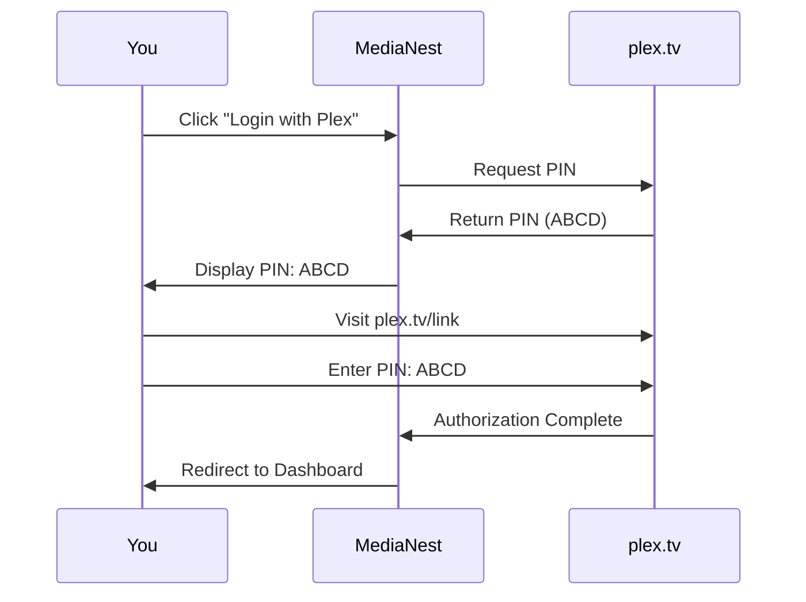

# MediaNest User Guide

**Version:** 2.0  
**Last Updated:** September 9, 2025  
**Target Audience:** End Users

## 📋 Table of Contents

1. [Overview](#overview)
2. [Getting Started](#getting-started)
3. [Authentication](#authentication)
4. [Dashboard Overview](#dashboard-overview)
5. [Media Management](#media-management)
6. [YouTube Integration](#youtube-integration)
7. [User Settings](#user-settings)
8. [Troubleshooting](#troubleshooting)
9. [Support](#support)

## Overview

MediaNest is a unified media management platform that brings together your Plex server, Overseerr requests, and YouTube downloads in one convenient interface. This guide will help you navigate and make the most of MediaNest's features.

### Key Features

- **Unified Dashboard:** View the status of all your media services in one place
- **Media Search:** Search across your Plex library and discover new content
- **Request Management:** Submit and track media requests through Overseerr
- **YouTube Downloads:** Download YouTube playlists directly to your Plex server
- **Real-time Updates:** Get instant notifications about service status and download progress

### Supported Services

- **Plex Media Server:** Library browsing and media streaming
- **Overseerr:** Media request management and approval workflow
- **YouTube:** Playlist downloading with automatic Plex integration
- **Uptime Kuma:** Service monitoring and status updates

## Getting Started

### System Requirements

**Browser Requirements:**
- Chrome 90+, Firefox 88+, Safari 14+, or Edge 90+
- JavaScript enabled
- Cookies enabled
- Minimum screen resolution: 1024x768

**Network Requirements:**
- Stable internet connection
- Access to your Plex server
- Access to configured Overseerr instance (if used)

### Initial Access

1. **Navigate to MediaNest:** Open your browser and go to your MediaNest URL
2. **First-Time Setup:** You'll be prompted to log in with your Plex account
3. **Service Configuration:** Admin users can configure external services

## Authentication

MediaNest uses Plex authentication to ensure secure access to your media services.

### Logging In

1. **Visit MediaNest:** Navigate to your MediaNest URL
2. **Click "Login with Plex":** You'll see the login button on the main page
3. **Get Your PIN:** MediaNest will display a 4-character PIN code
4. **Authorize on Plex:** 
   - Visit [plex.tv/link](https://plex.tv/link) in a new tab
   - Enter the PIN code shown in MediaNest
   - Click "Submit" on the Plex website
5. **Return to MediaNest:** The page will automatically redirect once authorized
6. **Access Granted:** You'll be taken to the main dashboard

### PIN Authentication Process

### Session Management

- **Automatic Login:** Your session will be remembered for 7 days
- **Security:** Sessions are automatically secured and encrypted
- **Multiple Devices:** You can be logged in on multiple devices simultaneously
- **Logout:** Use the logout button in the top-right corner to end your session

## Dashboard Overview

The MediaNest dashboard provides a real-time overview of your media ecosystem.

### Service Status Cards

Each service displays important status information:

#### Plex Server Status
- **🟢 Online:** Server is accessible and responding normally
- **🟡 Degraded:** Server is responding but with delays
- **🔴 Offline:** Server is not responding or unreachable
- **Response Time:** Shows current server response time in milliseconds

#### Overseerr Status
- **Connection Status:** Whether MediaNest can reach your Overseerr instance
- **Request Count:** Number of pending media requests
- **Recent Activity:** Latest request activity

#### Uptime Kuma Status
- **Monitoring Status:** Overall health of monitored services
- **Alert Count:** Number of active alerts or issues
- **Uptime Percentage:** Overall system uptime for the past 30 days

### Quick Actions

The dashboard provides quick access to common tasks:

- **Search Media:** Quickly search across your Plex library
- **Submit Request:** Fast-track a media request
- **View Downloads:** Check YouTube download progress
- **System Status:** Detailed system health information

### Real-time Updates

The dashboard automatically updates without refreshing the page:

- **Service Status:** Updates every 30 seconds
- **Download Progress:** Real-time progress bars for active downloads
- **Notifications:** Instant alerts for important events

## Media Management

### Searching Your Library

1. **Navigate to Media Search:** Click "Media" in the main navigation
2. **Enter Search Terms:** Use the search box to find content
3. **Filter Results:** Use filters to narrow down results by:
   - Media Type (Movies, TV Shows, Music)
   - Availability (Available, Unavailable)
   - Source (Plex, Overseerr)
4. **Browse Results:** Click on any item to see detailed information

### Search Features

- **Fuzzy Search:** Finds results even with typos or partial matches
- **Multi-service Search:** Searches both your Plex library and available content
- **Instant Results:** Results appear as you type
- **Smart Suggestions:** Get recommendations based on your search

### Media Information

For each media item, you can view:

- **Title and Year:** Basic media information
- **Synopsis:** Plot summary or description
- **Cast and Crew:** Key people involved in the production
- **Ratings:** IMDb, Rotten Tomatoes, or other ratings
- **Availability:** Whether it's in your Plex library
- **Request Status:** If it's been requested through Overseerr

### Making Requests

If content isn't available in your Plex library:

1. **Find the Media:** Search for the content you want
2. **Click "Request":** Use the request button on unavailable items
3. **Confirm Request:** Review the request details
4. **Submit:** Your request will be sent to Overseerr
5. **Track Progress:** Monitor request status in the dashboard

### Request Management

Track your media requests:

- **Pending:** Requests waiting for admin approval
- **Approved:** Requests approved and being processed
- **Available:** Content has been added to your Plex library
- **Declined:** Requests that were not approved (with reason)

## YouTube Integration

MediaNest allows you to download YouTube playlists directly to your Plex server.

### Downloading Playlists

1. **Navigate to YouTube:** Click "YouTube" in the main navigation
2. **Paste Playlist URL:** Enter the full YouTube playlist URL
3. **Select Options:**
   - **Quality:** Choose video quality (720p, 1080p, etc.)
   - **Format:** Select output format (MP4, MKV, etc.)
   - **Plex Collection:** Choose which Plex collection to add to
4. **Submit Download:** Click "Start Download"
5. **Monitor Progress:** Watch real-time progress in the downloads section

### Supported URL Formats

- **Full Playlist URLs:** `https://youtube.com/playlist?list=PLxxxxxxxx`
- **Shortened URLs:** `https://youtu.be/playlist?list=PLxxxxxxxx`
- **Individual Videos:** Single video URLs (will create a single-item playlist)

### Download Process

1. **Queue:** Your download is added to the processing queue
2. **Analysis:** MediaNest analyzes the playlist and retrieves video information
3. **Download:** Videos are downloaded in the selected quality and format
4. **Processing:** Files are processed and organized
5. **Plex Integration:** Content is added to your specified Plex collection
6. **Notification:** You'll receive a notification when complete

### Download Management

Monitor and manage your downloads:

- **Active Downloads:** Currently downloading content with progress bars
- **Queue:** Pending downloads waiting to be processed
- **Completed:** Successfully downloaded content
- **Failed:** Downloads that encountered errors (with error details)

### Download Limitations

- **Rate Limits:** Maximum 5 downloads per hour to prevent abuse
- **Size Limits:** Individual playlists limited to 100 videos
- **Format Support:** Supports most common video formats
- **Quality Options:** Depends on source video availability

## User Settings

### Profile Management

Access your profile settings through the user menu:

- **Profile Information:** View your Plex username and email
- **Session Information:** See active sessions and login history
- **Preferences:** Customize your MediaNest experience

### Notification Preferences

Configure when and how you receive notifications:

- **Download Completion:** Get notified when downloads finish
- **Request Updates:** Receive updates on your media requests
- **Service Alerts:** Get alerts about service outages or issues
- **Email Notifications:** Configure email notification preferences

### Privacy Settings

Control your privacy and data sharing:

- **Download History:** Manage your download history visibility
- **Request History:** Control request history retention
- **Analytics:** Opt-in or opt-out of usage analytics
- **Data Export:** Request a copy of your data

## Troubleshooting

### Common Issues

#### Cannot Log In

**Problem:** The login process fails or gets stuck

**Solutions:**
1. **Clear Browser Cache:** Clear your browser's cache and cookies
2. **Check Plex Status:** Verify that Plex.tv is accessible
3. **Disable Extensions:** Temporarily disable browser extensions
4. **Try Incognito Mode:** Use a private browsing window
5. **Contact Admin:** If the issue persists, contact your system administrator

#### Services Show as Offline

**Problem:** Services appear offline when they should be online

**Solutions:**
1. **Check Network:** Verify your internet connection
2. **Wait for Update:** Status updates every 30 seconds automatically
3. **Refresh Page:** Manually refresh the browser page
4. **Check Service Status:** Verify the services are actually running
5. **Contact Admin:** Report persistent issues to your administrator

#### Downloads Fail

**Problem:** YouTube downloads fail or get stuck

**Solutions:**
1. **Check URL:** Verify the YouTube playlist URL is correct and public
2. **Try Different Quality:** Lower quality settings may work better
3. **Check Quota:** You may have hit the download rate limit
4. **Retry Later:** Temporary YouTube issues may resolve themselves
5. **Contact Support:** Report persistent download failures

#### Slow Performance

**Problem:** MediaNest loads slowly or is unresponsive

**Solutions:**
1. **Check Connection:** Verify your internet speed and stability
2. **Close Tabs:** Close other browser tabs to free up memory
3. **Update Browser:** Ensure you're using a supported, up-to-date browser
4. **Clear Cache:** Clear browser cache and reload the page
5. **Try Different Browser:** Test with a different web browser

### Error Messages

#### "Authentication Required"
- **Cause:** Your session has expired
- **Solution:** Click the login button and re-authenticate with Plex

#### "Service Unavailable"
- **Cause:** External service (Plex, Overseerr) is temporarily offline
- **Solution:** Wait for the service to come back online, or contact admin

#### "Rate Limit Exceeded"
- **Cause:** You've made too many requests in a short time
- **Solution:** Wait for the rate limit to reset (usually 1 hour)

#### "Download Failed"
- **Cause:** YouTube download encountered an error
- **Solution:** Check the URL and try again, or contact support

### Getting Help

If you can't resolve an issue:

1. **Check System Status:** Look at the dashboard for service alerts
2. **Review Documentation:** Check this guide for solutions
3. **Contact Admin:** Reach out to your system administrator
4. **Report Bugs:** Use the feedback system to report issues

## Support

### Contact Information

- **System Administrator:** Contact your local MediaNest administrator
- **Documentation:** Refer to this user guide and help sections
- **Status Page:** Check the system status dashboard for service issues

### Best Practices

- **Regular Logout:** Log out when using shared computers
- **Reasonable Usage:** Don't abuse download quotas or rate limits
- **Report Issues:** Help improve the system by reporting bugs
- **Keep Updated:** Use a modern, updated web browser for best experience

### Privacy and Security

- **Secure Connections:** MediaNest uses HTTPS for all communications
- **No Password Storage:** Your Plex credentials are never stored locally
- **Session Security:** All sessions are encrypted and automatically expire
- **Data Privacy:** Your download and request history is private to your account

---

## 📚 Related Documentation

- [Installation Guide](INSTALLATION.md) - Setup and prerequisites
- [Configuration Guide](CONFIGURATION.md) - Environment configuration
- [API Reference](../api/API_REFERENCE.md) - Developer API documentation
- [Troubleshooting Guide](../operations/TROUBLESHOOTING.md) - Advanced troubleshooting

---

**User Guide Status:** ✅ Complete and Production Ready  
**Last Updated:** September 9, 2025  
**Target Audience:** End Users  
**Difficulty Level:** Beginner to Intermediate