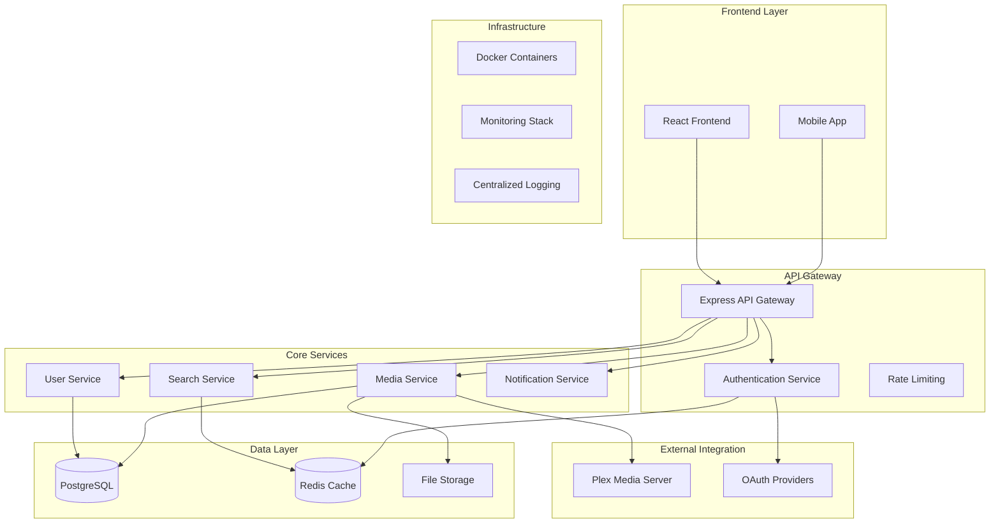
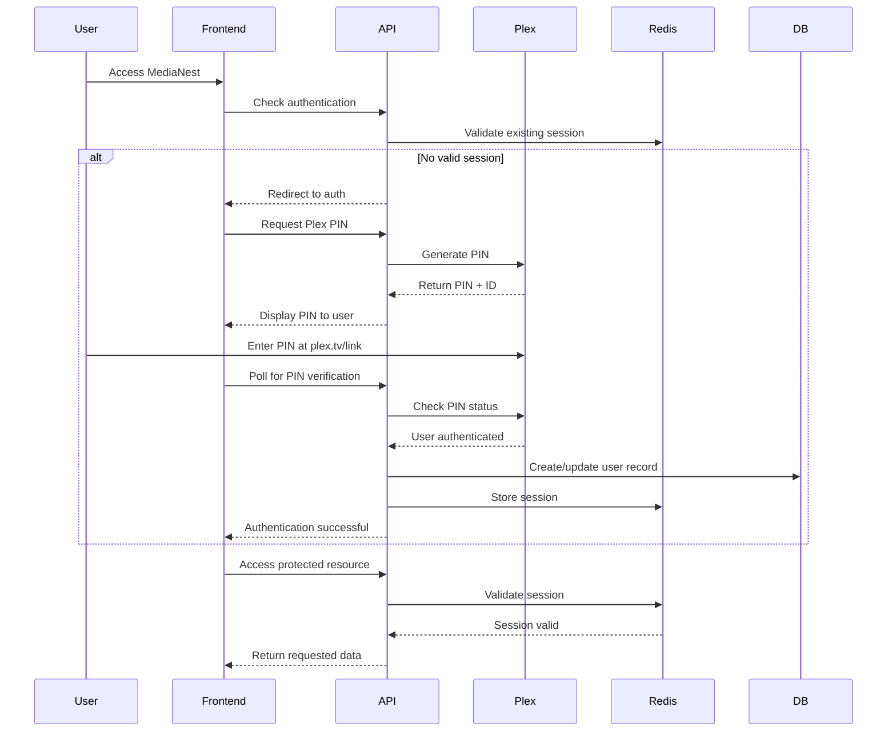
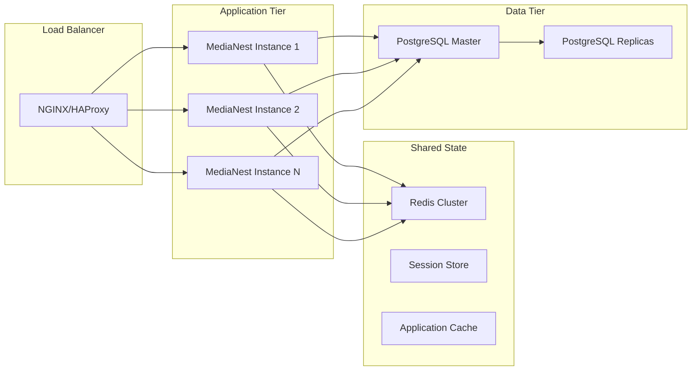

# MediaNest System Architecture

_Comprehensive system design and architecture documentation consolidating multiple architecture documents._

## Overview

MediaNest is a modern, scalable media management platform built with a microservices architecture. This document consolidates our architecture decisions, system design diagrams, and authentication architecture into a single comprehensive guide.

## Core Architecture

### High-Level System Design



## Architecture Decision Records (ADR)

### ADR-001: Authentication Framework Selection

**Status**: Accepted  
**Decision**: NextAuth.js with custom Plex OAuth provider

**Context**: MediaNest requires robust authentication supporting Plex OAuth, admin bootstrap, and future multi-provider authentication for 10-20+ users.

**Rationale**:

- ✅ Mature authentication framework with TypeScript support
- ✅ Built-in provider support and JWT/database sessions
- ✅ Active community and comprehensive documentation
- ✅ CSRF protection and session management handled

**Implementation**:

```typescript
// Custom Plex provider implementation
export default function PlexProvider(options: OAuthUserConfig<PlexProfile>) {
  return {
    id: 'plex',
    name: 'Plex',
    type: 'oauth',
    authorization: {
      /* Plex PIN-based auth flow */
    },
  };
}
```

### ADR-002: Session Management Strategy

**Status**: Accepted  
**Decision**: Redis-backed JWT sessions with NextAuth.js JWT strategy

**Benefits**:

- Stateless for horizontal scaling
- Redis for shared state and session invalidation
- Fast session validation with 30-day TTL
- Automated session cleanup

### ADR-003: Database Architecture

**Status**: Accepted  
**Decision**: PostgreSQL primary + Redis caching layer

**Schema Design**:

- Users and authentication data in PostgreSQL
- Session data and search indices in Redis
- Media metadata cached with intelligent invalidation
- Full-text search capabilities with proper indexing

## Authentication Architecture

### Enhanced Authentication Flow



### Security Features

1. **Multi-Layer Security**:

   - JWT tokens with RS256 signing
   - Redis session invalidation
   - CSRF protection via NextAuth.js
   - Rate limiting on all endpoints

2. **Enhanced Authentication**:

   - Plex OAuth PIN flow integration
   - Admin bootstrap with forced password change
   - Future 2FA and multi-provider support
   - Account linking capabilities

3. **Session Security**:
   - 30-day session TTL with refresh
   - Automatic cleanup of expired sessions
   - Secure cookie handling
   - Device-based session tracking

## Service Architecture

### Microservices Design

**API Gateway Pattern**:

- Single entry point for all client requests
- Authentication and authorization middleware
- Request routing and load balancing
- Rate limiting and request validation

**Service Separation**:

```typescript
// Service structure
services/
├── auth-service/     // Authentication and user management
├── media-service/    // Media metadata and search
├── plex-service/     // Plex integration
├── notification/     // Real-time notifications
└── shared/          // Common utilities and types
```

### Data Flow Architecture

1. **Request Flow**:

   ```
   Client → API Gateway → Authentication → Service → Database
   ```

2. **Caching Strategy**:

   - Redis for session data and search results
   - Application-level caching for media metadata
   - CDN for static assets and media thumbnails

3. **Real-time Updates**:
   - WebSocket connections for live updates
   - Redis Pub/Sub for service communication
   - Event-driven architecture for notifications

## Scalability Design

### Horizontal Scaling Architecture



### Performance Optimizations

1. **Database Optimizations**:

   - Read replicas for search queries
   - Proper indexing on frequently queried fields
   - Connection pooling and prepared statements

2. **Caching Strategy**:

   - Multi-level caching (Redis + application)
   - Cache warming for popular content
   - Intelligent cache invalidation

3. **API Optimizations**:
   - Response compression
   - Pagination for large datasets
   - GraphQL for flexible data fetching

## Technology Stack Details

### Frontend Technologies

```yaml
Framework: React 18 + TypeScript
UI Library: Material-UI v5
State Management: React Query + Context API
Routing: React Router v6
Testing: Jest + React Testing Library
Build Tool: Vite
```

### Backend Technologies

```yaml
Runtime: Node.js 18+ LTS
Framework: Express.js with TypeScript
Authentication: NextAuth.js v4
Database: PostgreSQL 14+
Cache: Redis 6+
Testing: Jest + Supertest
API Documentation: OpenAPI/Swagger
```

### Infrastructure

```yaml
Containers: Docker + Docker Compose
Reverse Proxy: NGINX
Monitoring: Prometheus + Grafana
Logging: Winston + centralized logging
CI/CD: GitHub Actions
```

## Security Architecture

### Defense in Depth

1. **Network Security**:

   - HTTPS everywhere with proper SSL/TLS configuration
   - Reverse proxy with security headers
   - Network isolation between services

2. **Application Security**:

   - Input validation and sanitization
   - SQL injection prevention via parameterized queries
   - XSS protection via content security policies
   - CSRF tokens for state-changing operations

3. **Authentication Security**:
   - Secure token storage and rotation
   - Session fixation protection
   - Account lockout policies
   - Audit logging for all auth events

### Compliance Considerations

- GDPR compliance for user data handling
- Secure password storage with bcrypt
- Data retention and deletion policies
- Privacy controls and user consent

## Integration Patterns

### Plex Media Server Integration

```typescript
// Plex service integration pattern
class PlexService {
  async authenticateUser(pin: string): Promise<PlexUser> {
    // PIN verification with Plex.tv
    const response = await this.verifyPIN(pin);
    return this.transformPlexUser(response);
  }

  async getLibraries(token: string): Promise<PlexLibrary[]> {
    // Fetch user's accessible libraries
    return this.fetchUserLibraries(token);
  }
}
```

### External Service Integration

- RESTful APIs with proper error handling
- Circuit breaker pattern for service resilience
- Retry logic with exponential backoff
- Health check endpoints for monitoring

## Monitoring and Observability

### Health Monitoring

```typescript
// Health check endpoint implementation
app.get('/health', async (req, res) => {
  const health = {
    timestamp: new Date().toISOString(),
    status: 'healthy',
    services: {
      database: await checkDatabase(),
      redis: await checkRedis(),
      plex: await checkPlexConnectivity(),
    },
  };

  res.json(health);
});
```

### Metrics and Logging

- Structured JSON logging with correlation IDs
- Performance metrics collection
- Error tracking and alerting
- User activity analytics

## Deployment Architecture

### Container Strategy

```yaml
# docker-compose.production.yml structure
services:
  frontend:
    build: ./frontend
    depends_on: [backend]

  backend:
    build: ./backend
    depends_on: [postgres, redis]
    environment:
      - NODE_ENV=production

  postgres:
    image: postgres:14-alpine
    volumes:
      - postgres_data:/var/lib/postgresql/data

  redis:
    image: redis:6-alpine
    volumes:
      - redis_data:/data
```

### Production Considerations

- Resource limits and health checks
- Persistent volume management
- Backup and recovery procedures
- Rolling deployments with zero downtime

## Future Architecture Considerations

### Planned Enhancements

1. **Multi-Provider Authentication**:

   - GitHub and Google OAuth integration
   - Account linking and provider switching
   - Federated identity management

2. **Advanced Security**:

   - Two-factor authentication (TOTP)
   - Biometric authentication support
   - Advanced threat detection

3. **Performance Improvements**:

   - GraphQL API for flexible queries
   - CDN integration for static assets
   - Advanced caching strategies

4. **Scalability Features**:
   - Kubernetes deployment options
   - Microservices decomposition
   - Event-driven architecture

## Related Documentation

- [API Reference](../03-api-reference/README.md) - Complete API documentation
- [Implementation Guides](../04-implementation-guides/README.md) - Feature implementation
- [Security Guide](../07-security/README.md) - Security best practices
- [Deployment Guide](../06-deployment/README.md) - Production deployment
- [Testing Guide](../05-testing/README.md) - Testing strategies
