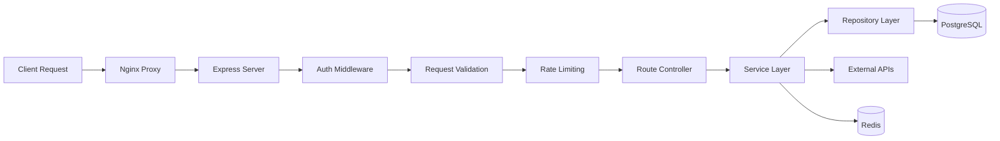

# MediaNest API Implementation Guide

**Version:** 1.0  
**Date:** January 2025  
**Status:** Implementation Guide

## Table of Contents

1. [Overview](#overview)
2. [Architecture Overview](#architecture-overview)
3. [Authentication & Authorization](#authentication--authorization)
4. [API Design Patterns](#api-design-patterns)
5. [Service Layer Implementation](#service-layer-implementation)
6. [External Service Integrations](#external-service-integrations)
7. [Error Handling & Logging](#error-handling--logging)
8. [Security Implementation](#security-implementation)
9. [Database & Data Layer](#database--data-layer)
10. [Real-time Features](#real-time-features)
11. [Performance & Optimization](#performance--optimization)
12. [Testing Strategies](#testing-strategies)
13. [Deployment & Configuration](#deployment--configuration)
14. [Implementation Roadmap](#implementation-roadmap)

## Overview

This guide provides comprehensive implementation details for the MediaNest API backend, building upon the architectural foundations outlined in `ARCHITECTURE.md`. The API serves as the central hub for managing Plex media server access, service integrations, and user authentication.

### Current Implementation Status

**✅ Foundation Complete:**

- Express.js server with TypeScript
- Database schema (Prisma)
- Error handling middleware
- Logging infrastructure
- Route structure and organization

**🔧 In Progress:**

- All API endpoints are placeholders
- Authentication system not implemented
- External service integrations pending
- Business logic layer missing

### Technology Stack Summary

```typescript
// Core Technologies
const stack = {
  runtime: 'Node.js 20.x LTS',
  framework: 'Express.js 4.x',
  language: 'TypeScript',
  database: 'PostgreSQL 15.x',
  cache: 'Redis 7.x',
  auth: 'JWT + Plex OAuth',
  queue: 'Bull (Redis-backed)',
  validation: 'Zod',
  logging: 'Winston',
  orm: 'Prisma',
};
```

## Architecture Overview

### Request Flow Architecture



### Current Project Structure

```
backend/src/
├── config/           ✅ Database, Redis, Queue config
├── controllers/      🚧 Empty - needs implementation
├── middleware/       ✅ Error handling, logging
├── routes/           🚧 Structure only - placeholder endpoints
├── services/         🚧 Empty - needs business logic
├── integrations/     🚧 Empty - needs external API clients
├── repositories/     🚧 Empty - needs data access layer
├── jobs/             🚧 Empty - needs background processors
├── types/            🚧 Empty - needs TypeScript definitions
└── utils/            ✅ Logger utility complete
```

## Authentication & Authorization

### Plex OAuth Implementation

MediaNest uses Plex's PIN-based OAuth flow for authentication:

```typescript
// auth/PlexAuthService.ts
import axios from 'axios';
import { v4 as uuidv4 } from 'uuid';

export class PlexAuthService {
  private readonly CLIENT_IDENTIFIER = process.env.PLEX_CLIENT_ID;
  private readonly PLEX_BASE_URL = 'https://plex.tv';

  async generatePin(): Promise<{ id: string; code: string }> {
    const response = await axios.post(
      `${this.PLEX_BASE_URL}/pins.json`,
      {
        strong: true,
      },
      {
        headers: {
          'X-Plex-Client-Identifier': this.CLIENT_IDENTIFIER,
          'X-Plex-Product': 'MediaNest',
          'X-Plex-Version': '1.0',
        },
      }
    );

    return {
      id: response.data.id,
      code: response.data.code,
    };
  }

  async pollForAuthorization(pinId: string): Promise<string | null> {
    try {
      const response = await axios.get(`${this.PLEX_BASE_URL}/pins/${pinId}.json`, {
        headers: {
          'X-Plex-Client-Identifier': this.CLIENT_IDENTIFIER,
        },
      });

      return response.data.authToken || null;
    } catch (error) {
      return null;
    }
  }

  async getUserInfo(authToken: string): Promise<PlexUser> {
    const response = await axios.get(`${this.PLEX_BASE_URL}/users/account.json`, {
      headers: {
        'X-Plex-Token': authToken,
      },
    });

    return {
      id: response.data.user.id,
      username: response.data.user.username,
      email: response.data.user.email,
      title: response.data.user.title,
    };
  }
}
```

### JWT Authentication Middleware

```typescript
// middleware/auth.ts
import jwt from 'jsonwebtoken';
import { Request, Response, NextFunction } from 'express';
import { AppError } from '../middleware/error';

interface AuthenticatedRequest extends Request {
  user?: {
    id: string;
    role: 'user' | 'admin';
    plexId: string;
  };
}

export const authenticateToken = async (
  req: AuthenticatedRequest,
  res: Response,
  next: NextFunction
) => {
  try {
    const authHeader = req.headers.authorization;
    const token = authHeader?.split(' ')[1];

    if (!token) {
      throw new AppError('Access token required', 401, 'UNAUTHORIZED');
    }

    const decoded = jwt.verify(token, process.env.JWT_SECRET!) as any;

    // Validate session in Redis
    const sessionExists = await redis.exists(`session:${decoded.sessionId}`);
    if (!sessionExists) {
      throw new AppError('Session expired', 401, 'SESSION_EXPIRED');
    }

    req.user = {
      id: decoded.userId,
      role: decoded.role,
      plexId: decoded.plexId,
    };

    next();
  } catch (error) {
    if (error instanceof jwt.JsonWebTokenError) {
      next(new AppError('Invalid token', 401, 'INVALID_TOKEN'));
    } else {
      next(error);
    }
  }
};

export const requireAdmin = (req: AuthenticatedRequest, res: Response, next: NextFunction) => {
  if (req.user?.role !== 'admin') {
    throw new AppError('Admin access required', 403, 'INSUFFICIENT_PRIVILEGES');
  }
  next();
};
```

### Remember Me Token System

```typescript
// auth/SessionService.ts
import crypto from 'crypto';
import { prisma } from '../config/database';

export class SessionService {
  async createRememberToken(userId: string): Promise<string> {
    const token = crypto.randomBytes(32).toString('hex');
    const tokenHash = crypto.createHash('sha256').update(token).digest('hex');

    await prisma.sessionToken.create({
      data: {
        userId,
        tokenHash,
        expiresAt: new Date(Date.now() + 90 * 24 * 60 * 60 * 1000), // 90 days
      },
    });

    return token;
  }

  async validateRememberToken(token: string): Promise<string | null> {
    const tokenHash = crypto.createHash('sha256').update(token).digest('hex');

    const sessionToken = await prisma.sessionToken.findUnique({
      where: { tokenHash },
      include: { user: true },
    });

    if (!sessionToken || sessionToken.expiresAt < new Date()) {
      return null;
    }

    // Update last used timestamp
    await prisma.sessionToken.update({
      where: { id: sessionToken.id },
      data: { lastUsedAt: new Date() },
    });

    return sessionToken.userId;
  }
}
```

## API Design Patterns

### Standardized Response Format

```typescript
// types/api.ts
export interface ApiResponse<T = any> {
  success: boolean;
  data?: T;
  error?: {
    code: string;
    message: string;
    details?: Record<string, any>;
  };
  meta: {
    timestamp: string;
    version: string;
    correlationId?: string;
  };
}

// utils/response.ts
export class ResponseBuilder {
  static success<T>(data: T, meta?: Partial<ApiResponse['meta']>): ApiResponse<T> {
    return {
      success: true,
      data,
      meta: {
        timestamp: new Date().toISOString(),
        version: '1.0',
        ...meta,
      },
    };
  }

  static error(code: string, message: string, details?: Record<string, any>): ApiResponse {
    return {
      success: false,
      error: { code, message, details },
      meta: {
        timestamp: new Date().toISOString(),
        version: '1.0',
      },
    };
  }
}
```

### Request Validation with Zod

```typescript
// validation/auth.ts
import { z } from 'zod';

export const LoginSchema = z.object({
  body: z.object({
    pinId: z.string().uuid('Invalid PIN ID format'),
    deviceName: z.string().min(1).max(100).optional(),
    rememberMe: z.boolean().optional().default(false),
  }),
});

export const MediaRequestSchema = z.object({
  body: z.object({
    title: z.string().min(1).max(500),
    mediaType: z.enum(['movie', 'tv']),
    tmdbId: z.string().regex(/^\d+$/, 'Invalid TMDB ID'),
    quality: z.enum(['720p', '1080p', '4K']).optional(),
  }),
});

// middleware/validation.ts
import { Request, Response, NextFunction } from 'express';
import { AnyZodObject } from 'zod';

export const validateRequest = (schema: AnyZodObject) => {
  return (req: Request, res: Response, next: NextFunction) => {
    try {
      schema.parse({
        body: req.body,
        query: req.query,
        params: req.params,
      });
      next();
    } catch (error) {
      next(
        new AppError('Validation failed', 400, 'VALIDATION_ERROR', {
          validationErrors: error.errors,
        })
      );
    }
  };
};
```

### Rate Limiting Implementation

```typescript
// middleware/rateLimit.ts
import { Request, Response, NextFunction } from 'express';
import { redis } from '../config/redis';
import { AppError } from './error';

const RATE_LIMIT_SCRIPT = `
  local key = KEYS[1]
  local limit = tonumber(ARGV[1])
  local window = tonumber(ARGV[2])
  local current = redis.call('GET', key)
  
  if current and tonumber(current) >= limit then
    return redis.call('TTL', key)
  else
    current = redis.call('INCR', key)
    if current == 1 then
      redis.call('EXPIRE', key, window)
    end
    return 0
  end
`;

export interface RateLimitConfig {
  windowMs: number;
  maxRequests: number;
  keyGenerator?: (req: Request) => string;
}

export const createRateLimit = (config: RateLimitConfig) => {
  return async (req: Request, res: Response, next: NextFunction) => {
    const key = config.keyGenerator
      ? config.keyGenerator(req)
      : `rate_limit:${req.ip}:${req.route?.path}`;

    try {
      const result = (await redis.eval(
        RATE_LIMIT_SCRIPT,
        1,
        key,
        config.maxRequests.toString(),
        Math.floor(config.windowMs / 1000).toString()
      )) as number;

      if (result > 0) {
        res.set('Retry-After', result.toString());
        throw new AppError('Rate limit exceeded', 429, 'RATE_LIMIT_EXCEEDED', {
          retryAfter: result,
        });
      }

      next();
    } catch (error) {
      next(error);
    }
  };
};

// Usage examples
export const apiRateLimit = createRateLimit({
  windowMs: 60 * 1000, // 1 minute
  maxRequests: 100,
  keyGenerator: (req) => `api:${req.user?.id || req.ip}`,
});

export const youtubeRateLimit = createRateLimit({
  windowMs: 60 * 60 * 1000, // 1 hour
  maxRequests: 5,
  keyGenerator: (req) => `youtube:${req.user?.id}`,
});
```

## Service Layer Implementation

### Base Service Class

```typescript
// services/BaseService.ts
import { Logger } from 'winston';
import { logger } from '../utils/logger';

export abstract class BaseService {
  protected logger: Logger;

  constructor(protected serviceName: string) {
    this.logger = logger.child({ service: serviceName });
  }

  protected logOperation(operation: string, data?: any) {
    this.logger.info(`${this.serviceName} operation: ${operation}`, data);
  }

  protected logError(operation: string, error: Error, data?: any) {
    this.logger.error(`${this.serviceName} error in ${operation}`, {
      error: error.message,
      stack: error.stack,
      data,
    });
  }
}
```

### Media Request Service

```typescript
// services/MediaRequestService.ts
import { BaseService } from './BaseService';
import { MediaRequestRepository } from '../repositories/MediaRequestRepository';
import { OverseerrClient } from '../integrations/overseerr/OverseerrClient';
import { AppError } from '../middleware/error';

export class MediaRequestService extends BaseService {
  constructor(
    private mediaRequestRepo: MediaRequestRepository,
    private overseerrClient: OverseerrClient
  ) {
    super('MediaRequestService');
  }

  async submitRequest(
    userId: string,
    requestData: {
      title: string;
      mediaType: 'movie' | 'tv';
      tmdbId: string;
    }
  ) {
    this.logOperation('submitRequest', { userId, ...requestData });

    try {
      // Check if already requested
      const existingRequest = await this.mediaRequestRepo.findByTmdbId(requestData.tmdbId, userId);

      if (existingRequest) {
        throw new AppError('Media already requested', 409, 'DUPLICATE_REQUEST');
      }

      // Submit to Overseerr
      const overseerrRequest = await this.overseerrClient.submitRequest({
        mediaType: requestData.mediaType,
        mediaId: parseInt(requestData.tmdbId),
      });

      // Save to database
      const request = await this.mediaRequestRepo.create({
        userId,
        title: requestData.title,
        mediaType: requestData.mediaType,
        tmdbId: requestData.tmdbId,
        overseerrId: overseerrRequest.id.toString(),
        status: 'pending',
      });

      return request;
    } catch (error) {
      this.logError('submitRequest', error, { userId, ...requestData });
      throw error;
    }
  }

  async getUserRequests(userId: string, page = 1, limit = 20) {
    this.logOperation('getUserRequests', { userId, page, limit });

    return this.mediaRequestRepo.findByUserId(userId, {
      skip: (page - 1) * limit,
      take: limit,
      orderBy: { createdAt: 'desc' },
    });
  }
}
```

### YouTube Download Service

```typescript
// services/YouTubeService.ts
import { BaseService } from './BaseService';
import { YouTubeRepository } from '../repositories/YouTubeRepository';
import { youtubeQueue } from '../config/queues';
import { AppError } from '../middleware/error';

export class YouTubeService extends BaseService {
  constructor(private youtubeRepo: YouTubeRepository) {
    super('YouTubeService');
  }

  async submitDownload(userId: string, playlistUrl: string) {
    this.logOperation('submitDownload', { userId, playlistUrl });

    // Validate YouTube URL
    if (!this.isValidYouTubeUrl(playlistUrl)) {
      throw new AppError('Invalid YouTube URL', 400, 'INVALID_YOUTUBE_URL');
    }

    try {
      // Create download record
      const download = await this.youtubeRepo.create({
        userId,
        playlistUrl,
        status: 'queued',
      });

      // Add to queue
      await youtubeQueue.add(
        'download-playlist',
        {
          downloadId: download.id,
          userId,
          playlistUrl,
        },
        {
          attempts: 3,
          backoff: {
            type: 'exponential',
            delay: 2000,
          },
        }
      );

      return download;
    } catch (error) {
      this.logError('submitDownload', error, { userId, playlistUrl });
      throw error;
    }
  }

  private isValidYouTubeUrl(url: string): boolean {
    const youtubeRegex = /^https?:\/\/(www\.)?(youtube\.com|youtu\.be)\/.+/;
    return youtubeRegex.test(url);
  }
}
```

## External Service Integrations

### Circuit Breaker Pattern

```typescript
// integrations/CircuitBreaker.ts
import CircuitBreaker from 'opossum';

interface CircuitBreakerOptions {
  timeout: number;
  errorThresholdPercentage: number;
  resetTimeout: number;
  volumeThreshold: number;
}

export class ServiceCircuitBreaker {
  private breakers: Map<string, CircuitBreaker> = new Map();

  createBreaker<T extends any[], R>(
    name: string,
    fn: (...args: T) => Promise<R>,
    options: Partial<CircuitBreakerOptions> = {}
  ): CircuitBreaker {
    const defaultOptions: CircuitBreakerOptions = {
      timeout: 3000,
      errorThresholdPercentage: 50,
      resetTimeout: 30000,
      volumeThreshold: 10,
    };

    const breaker = new CircuitBreaker(fn, { ...defaultOptions, ...options });

    // Add fallback behavior
    breaker.fallback(() => ({
      status: 'degraded',
      data: null,
      message: `${name} service temporarily unavailable`,
    }));

    // Add event listeners for monitoring
    breaker.on('open', () => {
      logger.warn(`Circuit breaker opened for ${name}`);
    });

    breaker.on('halfOpen', () => {
      logger.info(`Circuit breaker half-open for ${name}`);
    });

    breaker.on('close', () => {
      logger.info(`Circuit breaker closed for ${name}`);
    });

    this.breakers.set(name, breaker);
    return breaker;
  }

  getBreaker(name: string): CircuitBreaker | undefined {
    return this.breakers.get(name);
  }

  getStatus(): Record<string, any> {
    const status: Record<string, any> = {};

    this.breakers.forEach((breaker, name) => {
      status[name] = {
        state: breaker.opened ? 'open' : breaker.halfOpen ? 'halfOpen' : 'closed',
        stats: breaker.stats,
      };
    });

    return status;
  }
}
```

### Plex Integration Client

```typescript
// integrations/plex/PlexClient.ts
import axios, { AxiosInstance } from 'axios';
import { ServiceCircuitBreaker } from '../CircuitBreaker';

export class PlexClient {
  private axiosInstance: AxiosInstance;
  private circuitBreaker: ServiceCircuitBreaker;

  constructor(private baseURL: string, private authToken: string) {
    this.axiosInstance = axios.create({
      baseURL,
      headers: {
        'X-Plex-Token': authToken,
        Accept: 'application/json',
      },
      timeout: 10000,
    });

    this.circuitBreaker = new ServiceCircuitBreaker();
    this.setupCircuitBreakers();
  }

  private setupCircuitBreakers() {
    // Libraries endpoint
    this.circuitBreaker.createBreaker('plex-libraries', this.getLibraries.bind(this), {
      timeout: 5000,
    });

    // Collections endpoint
    this.circuitBreaker.createBreaker('plex-collections', this.getCollections.bind(this), {
      timeout: 8000,
    });
  }

  async getLibraries(): Promise<PlexLibrary[]> {
    const response = await this.axiosInstance.get('/library/sections');
    return response.data.MediaContainer.Directory.map((lib: any) => ({
      key: lib.key,
      title: lib.title,
      type: lib.type,
      agent: lib.agent,
      scanner: lib.scanner,
      language: lib.language,
      uuid: lib.uuid,
      updatedAt: new Date(lib.updatedAt * 1000),
      createdAt: new Date(lib.createdAt * 1000),
    }));
  }

  async getLibraryItems(libraryKey: string, start = 0, size = 50): Promise<PlexLibraryItems> {
    const response = await this.axiosInstance.get(`/library/sections/${libraryKey}/all`, {
      params: {
        'X-Plex-Container-Start': start,
        'X-Plex-Container-Size': size,
        includeGuids: 1,
        includeMeta: 1,
      },
    });

    const container = response.data.MediaContainer;
    return {
      items: container.Metadata?.map(this.mapPlexItem) || [],
      totalSize: container.totalSize,
      size: container.size,
      offset: container.offset,
    };
  }

  async createCollection(libraryKey: string, title: string, itemKeys: string[]): Promise<string> {
    // Add items to collection
    const response = await this.axiosInstance.post('/library/collections', null, {
      params: {
        type: '1',
        title,
        smart: '0',
        sectionId: libraryKey,
        uri: itemKeys.map((key) => `server://library/metadata/${key}`).join(','),
      },
    });

    return response.data.MediaContainer.Directory[0].key;
  }

  private mapPlexItem(item: any): PlexItem {
    return {
      key: item.key,
      ratingKey: item.ratingKey,
      title: item.title,
      type: item.type,
      year: item.year,
      summary: item.summary,
      thumb: item.thumb,
      art: item.art,
      addedAt: new Date(item.addedAt * 1000),
      updatedAt: new Date(item.updatedAt * 1000),
      guid: item.Guid?.map((g: any) => g.id) || [],
    };
  }
}
```

### Overseerr Integration Client

```typescript
// integrations/overseerr/OverseerrClient.ts
import axios, { AxiosInstance } from 'axios';
import { ServiceCircuitBreaker } from '../CircuitBreaker';

export class OverseerrClient {
  private axiosInstance: AxiosInstance;
  private circuitBreaker: ServiceCircuitBreaker;

  constructor(private baseURL: string, private apiKey: string) {
    this.axiosInstance = axios.create({
      baseURL: `${baseURL}/api/v1`,
      headers: {
        'X-API-Key': apiKey,
        'Content-Type': 'application/json',
      },
      timeout: 10000,
    });

    this.circuitBreaker = new ServiceCircuitBreaker();
    this.setupCircuitBreakers();
  }

  private setupCircuitBreakers() {
    this.circuitBreaker.createBreaker('overseerr-search', this.searchMedia.bind(this), {
      timeout: 5000,
    });

    this.circuitBreaker.createBreaker('overseerr-request', this.submitRequest.bind(this), {
      timeout: 8000,
    });
  }

  async searchMedia(query: string, page = 1): Promise<OverseerrSearchResult> {
    const response = await this.axiosInstance.get('/search', {
      params: { query, page },
    });

    return {
      page: response.data.page,
      totalPages: response.data.totalPages,
      totalResults: response.data.totalResults,
      results: response.data.results.map(this.mapSearchResult),
    };
  }

  async submitRequest(requestData: {
    mediaType: 'movie' | 'tv';
    mediaId: number;
    seasons?: number[];
  }): Promise<OverseerrRequest> {
    const endpoint = requestData.mediaType === 'movie' ? '/request/movie' : '/request/tv';

    const response = await this.axiosInstance.post(endpoint, {
      mediaId: requestData.mediaId,
      seasons: requestData.seasons,
    });

    return {
      id: response.data.id,
      status: response.data.status,
      media: response.data.media,
      createdAt: new Date(response.data.createdAt),
      updatedAt: new Date(response.data.updatedAt),
    };
  }

  async getRequestStatus(requestId: string): Promise<OverseerrRequestStatus> {
    const response = await this.axiosInstance.get(`/request/${requestId}`);

    return {
      id: response.data.id,
      status: response.data.status,
      media: {
        status: response.data.media.status,
        tmdbId: response.data.media.tmdbId,
        title: response.data.media.title,
      },
    };
  }

  private mapSearchResult(result: any): OverseerrSearchItem {
    return {
      id: result.id,
      mediaType: result.mediaType,
      title: result.title || result.name,
      overview: result.overview,
      posterPath: result.posterPath,
      backdropPath: result.backdropPath,
      releaseDate: result.releaseDate || result.firstAirDate,
      voteAverage: result.voteAverage,
      status: result.mediaInfo?.status || 'unknown',
    };
  }
}
```

## Error Handling & Logging

### Enhanced Error Classes

```typescript
// types/errors.ts
export enum ErrorCode {
  // Authentication
  UNAUTHORIZED = 'UNAUTHORIZED',
  INVALID_TOKEN = 'INVALID_TOKEN',
  SESSION_EXPIRED = 'SESSION_EXPIRED',
  INSUFFICIENT_PRIVILEGES = 'INSUFFICIENT_PRIVILEGES',

  // Validation
  VALIDATION_ERROR = 'VALIDATION_ERROR',
  INVALID_INPUT = 'INVALID_INPUT',

  // Business Logic
  DUPLICATE_REQUEST = 'DUPLICATE_REQUEST',
  RESOURCE_NOT_FOUND = 'RESOURCE_NOT_FOUND',
  OPERATION_FAILED = 'OPERATION_FAILED',

  // External Services
  EXTERNAL_SERVICE_ERROR = 'EXTERNAL_SERVICE_ERROR',
  SERVICE_UNAVAILABLE = 'SERVICE_UNAVAILABLE',

  // Rate Limiting
  RATE_LIMIT_EXCEEDED = 'RATE_LIMIT_EXCEEDED',

  // System
  INTERNAL_ERROR = 'INTERNAL_ERROR',
  DATABASE_ERROR = 'DATABASE_ERROR',
}

export class AppError extends Error {
  constructor(
    message: string,
    public statusCode: number,
    public code: ErrorCode,
    public details?: Record<string, any>,
    public isOperational = true
  ) {
    super(message);
    this.name = 'AppError';

    Error.captureStackTrace(this, this.constructor);
  }
}
```

### Correlation ID Middleware

```typescript
// middleware/correlation.ts
import { Request, Response, NextFunction } from 'express';
import { v4 as uuidv4 } from 'uuid';

declare global {
  namespace Express {
    interface Request {
      correlationId: string;
    }
  }
}

export const correlationId = (req: Request, res: Response, next: NextFunction) => {
  req.correlationId = (req.headers['x-correlation-id'] as string) || uuidv4();
  res.setHeader('X-Correlation-ID', req.correlationId);
  next();
};
```

## Security Implementation

### Input Sanitization

```typescript
// middleware/sanitization.ts
import { Request, Response, NextFunction } from 'express';
import DOMPurify from 'isomorphic-dompurify';

export const sanitizeInput = (req: Request, res: Response, next: NextFunction) => {
  if (req.body) {
    req.body = sanitizeObject(req.body);
  }

  if (req.query) {
    req.query = sanitizeObject(req.query);
  }

  next();
};

function sanitizeObject(obj: any): any {
  if (typeof obj === 'string') {
    return DOMPurify.sanitize(obj);
  }

  if (Array.isArray(obj)) {
    return obj.map(sanitizeObject);
  }

  if (obj && typeof obj === 'object') {
    const sanitized: any = {};
    for (const key in obj) {
      sanitized[key] = sanitizeObject(obj[key]);
    }
    return sanitized;
  }

  return obj;
}
```

### Security Headers

```typescript
// middleware/security.ts
import helmet from 'helmet';
import { Express } from 'express';

export const configureSecurity = (app: Express) => {
  // Helmet for security headers
  app.use(
    helmet({
      contentSecurityPolicy: {
        directives: {
          defaultSrc: ["'self'"],
          styleSrc: ["'self'", "'unsafe-inline'"],
          scriptSrc: ["'self'"],
          imgSrc: ["'self'", 'data:', 'https:'],
          connectSrc: ["'self'", 'wss:'],
          fontSrc: ["'self'"],
          objectSrc: ["'none'"],
          mediaSrc: ["'self'"],
          frameSrc: ["'none'"],
        },
      },
      crossOriginEmbedderPolicy: false,
    })
  );

  // CORS configuration
  app.use((req, res, next) => {
    const allowedOrigins = process.env.ALLOWED_ORIGINS?.split(',') || ['http://localhost:3000'];
    const origin = req.headers.origin;

    if (allowedOrigins.includes(origin!)) {
      res.setHeader('Access-Control-Allow-Origin', origin!);
    }

    res.setHeader('Access-Control-Allow-Methods', 'GET,POST,PUT,DELETE,OPTIONS');
    res.setHeader('Access-Control-Allow-Headers', 'Content-Type,Authorization,X-Correlation-ID');
    res.setHeader('Access-Control-Allow-Credentials', 'true');

    if (req.method === 'OPTIONS') {
      res.status(200).end();
      return;
    }

    next();
  });
};
```

## Database & Data Layer

### Repository Pattern Implementation

```typescript
// repositories/BaseRepository.ts
import { PrismaClient } from '@prisma/client';
import { logger } from '../utils/logger';

export abstract class BaseRepository<T> {
  protected logger = logger.child({ repository: this.constructor.name });

  constructor(protected prisma: PrismaClient) {}

  protected logQuery(operation: string, data?: any) {
    this.logger.debug(`Database operation: ${operation}`, data);
  }

  protected logError(operation: string, error: Error, data?: any) {
    this.logger.error(`Database error in ${operation}`, {
      error: error.message,
      data,
    });
  }
}

// repositories/UserRepository.ts
export class UserRepository extends BaseRepository<User> {
  async findByPlexId(plexId: string): Promise<User | null> {
    this.logQuery('findByPlexId', { plexId });

    return this.prisma.user.findUnique({
      where: { plexId },
    });
  }

  async create(userData: CreateUserData): Promise<User> {
    this.logQuery('create', { userData: { ...userData, plexToken: '[REDACTED]' } });

    return this.prisma.user.create({
      data: {
        plexId: userData.plexId,
        plexUsername: userData.plexUsername,
        email: userData.email,
        role: userData.role || 'user',
        plexToken: userData.plexToken, // This should be encrypted
        status: 'active',
      },
    });
  }

  async updateLastLogin(userId: string): Promise<void> {
    this.logQuery('updateLastLogin', { userId });

    await this.prisma.user.update({
      where: { id: userId },
      data: { lastLoginAt: new Date() },
    });
  }
}
```

### Database Connection Management

```typescript
// config/database.ts (Enhanced)
import { PrismaClient } from '@prisma/client';
import { logger } from '../utils/logger';

class DatabaseManager {
  private static instance: DatabaseManager;
  private prisma: PrismaClient;

  private constructor() {
    this.prisma = new PrismaClient({
      log: [
        { emit: 'event', level: 'query' },
        { emit: 'event', level: 'error' },
        { emit: 'event', level: 'info' },
        { emit: 'event', level: 'warn' },
      ],
      datasources: {
        db: {
          url: process.env.DATABASE_URL,
        },
      },
    });

    this.setupEventListeners();
  }

  private setupEventListeners() {
    this.prisma.$on('query', (e) => {
      logger.debug('Database query', {
        query: e.query,
        params: e.params,
        duration: e.duration,
        target: e.target,
      });
    });

    this.prisma.$on('error', (e) => {
      logger.error('Database error', {
        message: e.message,
        target: e.target,
      });
    });
  }

  public static getInstance(): DatabaseManager {
    if (!DatabaseManager.instance) {
      DatabaseManager.instance = new DatabaseManager();
    }
    return DatabaseManager.instance;
  }

  public getClient(): PrismaClient {
    return this.prisma;
  }

  public async connect(): Promise<void> {
    try {
      await this.prisma.$connect();
      logger.info('Database connected successfully');
    } catch (error) {
      logger.error('Database connection failed', { error });
      throw error;
    }
  }

  public async disconnect(): Promise<void> {
    try {
      await this.prisma.$disconnect();
      logger.info('Database disconnected successfully');
    } catch (error) {
      logger.error('Database disconnection failed', { error });
    }
  }

  public async healthCheck(): Promise<boolean> {
    try {
      await this.prisma.$queryRaw`SELECT 1`;
      return true;
    } catch (error) {
      logger.error('Database health check failed', { error });
      return false;
    }
  }
}

export const databaseManager = DatabaseManager.getInstance();
export const prisma = databaseManager.getClient();
```

## Real-time Features

### WebSocket Implementation

```typescript
// realtime/SocketManager.ts
import { Server } from 'socket.io';
import { Server as HttpServer } from 'http';
import jwt from 'jsonwebtoken';
import { logger } from '../utils/logger';
import { redis } from '../config/redis';

export class SocketManager {
  private io: Server;
  private userSockets: Map<string, Set<string>> = new Map();

  constructor(httpServer: HttpServer) {
    this.io = new Server(httpServer, {
      cors: {
        origin: process.env.ALLOWED_ORIGINS?.split(',') || ['http://localhost:3000'],
        credentials: true,
      },
      transports: ['websocket', 'polling'],
    });

    this.setupMiddleware();
    this.setupEventHandlers();
  }

  private setupMiddleware() {
    this.io.use(async (socket, next) => {
      try {
        const token = socket.handshake.auth.token;
        if (!token) {
          throw new Error('No token provided');
        }

        const decoded = jwt.verify(token, process.env.JWT_SECRET!) as any;

        // Verify session in Redis
        const sessionExists = await redis.exists(`session:${decoded.sessionId}`);
        if (!sessionExists) {
          throw new Error('Session expired');
        }

        socket.data.user = {
          id: decoded.userId,
          role: decoded.role,
          plexId: decoded.plexId,
        };

        next();
      } catch (error) {
        logger.warn('WebSocket authentication failed', { error: error.message });
        next(new Error('Authentication failed'));
      }
    });
  }

  private setupEventHandlers() {
    this.io.on('connection', (socket) => {
      const userId = socket.data.user.id;
      logger.info('WebSocket connection established', {
        userId,
        socketId: socket.id,
      });

      // Track user sockets
      if (!this.userSockets.has(userId)) {
        this.userSockets.set(userId, new Set());
      }
      this.userSockets.get(userId)!.add(socket.id);

      // Join user-specific room
      socket.join(`user:${userId}`);

      // Subscribe to service status updates
      socket.on('subscribe:status', () => {
        socket.join('service-status');
        logger.debug('Client subscribed to service status', { userId });
      });

      // Subscribe to YouTube download progress
      socket.on('subscribe:youtube', (downloadId: string) => {
        // Verify user owns this download
        // Implementation depends on your authorization logic
        socket.join(`youtube:${downloadId}`);
        logger.debug('Client subscribed to YouTube progress', { userId, downloadId });
      });

      // Handle disconnection
      socket.on('disconnect', () => {
        const userSockets = this.userSockets.get(userId);
        if (userSockets) {
          userSockets.delete(socket.id);
          if (userSockets.size === 0) {
            this.userSockets.delete(userId);
          }
        }

        logger.info('WebSocket connection closed', {
          userId,
          socketId: socket.id,
        });
      });
    });
  }

  // Send service status update to all subscribed clients
  public broadcastServiceStatus(status: ServiceStatusUpdate) {
    this.io.to('service-status').emit('service:status', status);
    logger.debug('Broadcasted service status update', { service: status.name });
  }

  // Send YouTube download progress to specific download subscribers
  public emitDownloadProgress(downloadId: string, progress: DownloadProgress) {
    this.io.to(`youtube:${downloadId}`).emit('download:progress', progress);
    logger.debug('Emitted download progress', { downloadId, progress: progress.percentage });
  }

  // Send notification to specific user
  public notifyUser(userId: string, notification: UserNotification) {
    this.io.to(`user:${userId}`).emit('notification', notification);
    logger.debug('Sent user notification', { userId, type: notification.type });
  }

  // Get connected users count
  public getConnectedUsersCount(): number {
    return this.userSockets.size;
  }

  // Check if user is connected
  public isUserConnected(userId: string): boolean {
    return this.userSockets.has(userId);
  }
}
```

### Background Job Processing

```typescript
// jobs/YoutubeDownloadProcessor.ts
import { Job } from 'bull';
import { spawn } from 'child_process';
import path from 'path';
import { logger } from '../utils/logger';
import { YouTubeRepository } from '../repositories/YouTubeRepository';
import { PlexClient } from '../integrations/plex/PlexClient';
import { SocketManager } from '../realtime/SocketManager';

interface YoutubeJobData {
  downloadId: string;
  userId: string;
  playlistUrl: string;
}

export class YoutubeDownloadProcessor {
  constructor(
    private youtubeRepo: YouTubeRepository,
    private plexClient: PlexClient,
    private socketManager: SocketManager
  ) {}

  async process(job: Job<YoutubeJobData>): Promise<void> {
    const { downloadId, userId, playlistUrl } = job.data;

    logger.info('Starting YouTube download', { downloadId, userId });

    try {
      // Update status to downloading
      await this.youtubeRepo.updateStatus(downloadId, 'downloading');

      // Create user-specific download directory
      const outputPath = path.join(process.env.YOUTUBE_DOWNLOAD_PATH || '/app/youtube', userId);

      // Start yt-dlp process
      const downloadResult = await this.runYtDlp(playlistUrl, outputPath, (progress) => {
        // Emit progress updates via WebSocket
        this.socketManager.emitDownloadProgress(downloadId, {
          percentage: progress,
          status: 'downloading',
        });

        // Update job progress
        job.progress(progress);
      });

      // Update database with file paths
      await this.youtubeRepo.updateFiles(downloadId, downloadResult.filePaths);

      // Create Plex collection
      if (downloadResult.playlistTitle) {
        try {
          const collectionId = await this.createPlexCollection(
            downloadResult.playlistTitle,
            downloadResult.filePaths
          );

          await this.youtubeRepo.updatePlexCollection(downloadId, collectionId);
        } catch (error) {
          logger.warn('Failed to create Plex collection', {
            downloadId,
            error: error.message,
          });
        }
      }

      // Mark as completed
      await this.youtubeRepo.updateStatus(downloadId, 'completed');

      // Notify user
      this.socketManager.notifyUser(userId, {
        type: 'download_completed',
        message: 'YouTube playlist download completed',
        data: { downloadId, title: downloadResult.playlistTitle },
      });

      logger.info('YouTube download completed', { downloadId, userId });
    } catch (error) {
      logger.error('YouTube download failed', {
        downloadId,
        userId,
        error: error.message,
      });

      // Update status to failed
      await this.youtubeRepo.updateStatus(downloadId, 'failed');

      // Notify user of failure
      this.socketManager.notifyUser(userId, {
        type: 'download_failed',
        message: 'YouTube playlist download failed',
        data: { downloadId, error: error.message },
      });

      throw error;
    }
  }

  private async runYtDlp(
    url: string,
    outputPath: string,
    progressCallback: (progress: number) => void
  ): Promise<{ filePaths: string[]; playlistTitle?: string }> {
    return new Promise((resolve, reject) => {
      const filePaths: string[] = [];
      let playlistTitle: string | undefined;

      const ytdlp = spawn('yt-dlp', [
        url,
        '-o',
        `${outputPath}/%(playlist_title)s/%(title)s.%(ext)s`,
        '--newline',
        '--no-warnings',
        '--print-json',
        '--extract-flat',
      ]);

      ytdlp.stdout.on('data', (data) => {
        const lines = data.toString().split('\n').filter(Boolean);

        for (const line of lines) {
          // Parse progress
          const progressMatch = line.match(/\[download\]\s+(\d+\.?\d*)%/);
          if (progressMatch) {
            progressCallback(parseFloat(progressMatch[1]));
            continue;
          }

          // Parse JSON output for file paths
          try {
            const json = JSON.parse(line);
            if (json._filename) {
              filePaths.push(json._filename);
            }
            if (json.playlist_title && !playlistTitle) {
              playlistTitle = json.playlist_title;
            }
          } catch {
            // Not JSON, ignore
          }
        }
      });

      ytdlp.stderr.on('data', (data) => {
        logger.warn('yt-dlp stderr', { output: data.toString() });
      });

      ytdlp.on('close', (code) => {
        if (code === 0) {
          resolve({ filePaths, playlistTitle });
        } else {
          reject(new Error(`yt-dlp exited with code ${code}`));
        }
      });

      ytdlp.on('error', (error) => {
        reject(new Error(`Failed to spawn yt-dlp: ${error.message}`));
      });
    });
  }

  private async createPlexCollection(title: string, filePaths: string[]): Promise<string> {
    // This would need to map file paths to Plex library items
    // Implementation depends on how files are organized and scanned
    logger.info('Creating Plex collection', { title, fileCount: filePaths.length });

    // Placeholder - actual implementation would:
    // 1. Wait for Plex to scan new files
    // 2. Find corresponding library items
    // 3. Create collection with those items

    return 'placeholder-collection-id';
  }
}
```

## Performance & Optimization

### Caching Strategy

```typescript
// services/CacheService.ts
import { redis } from '../config/redis';
import { logger } from '../utils/logger';

export class CacheService {
  private readonly DEFAULT_TTL = 300; // 5 minutes

  async get<T>(key: string): Promise<T | null> {
    try {
      const cached = await redis.get(key);
      if (cached) {
        logger.debug('Cache hit', { key });
        return JSON.parse(cached);
      }
      logger.debug('Cache miss', { key });
      return null;
    } catch (error) {
      logger.error('Cache get error', { key, error: error.message });
      return null;
    }
  }

  async set(key: string, value: any, ttl = this.DEFAULT_TTL): Promise<void> {
    try {
      await redis.setex(key, ttl, JSON.stringify(value));
      logger.debug('Cache set', { key, ttl });
    } catch (error) {
      logger.error('Cache set error', { key, error: error.message });
    }
  }

  async delete(key: string): Promise<void> {
    try {
      await redis.del(key);
      logger.debug('Cache delete', { key });
    } catch (error) {
      logger.error('Cache delete error', { key, error: error.message });
    }
  }

  async wrap<T>(key: string, fetcher: () => Promise<T>, ttl = this.DEFAULT_TTL): Promise<T> {
    const cached = await this.get<T>(key);
    if (cached !== null) {
      return cached;
    }

    const result = await fetcher();
    await this.set(key, result, ttl);
    return result;
  }

  // Service-specific cache keys
  getUserMediaRequests(userId: string): string {
    return `user:${userId}:requests`;
  }

  getServiceStatus(serviceName: string): string {
    return `service:${serviceName}:status`;
  }

  getPlexLibraries(serverUrl: string): string {
    return `plex:${Buffer.from(serverUrl).toString('base64')}:libraries`;
  }
}
```

### Database Query Optimization

```typescript
// repositories/MediaRequestRepository.ts (Optimized)
export class MediaRequestRepository extends BaseRepository<MediaRequest> {
  async findByUserId(
    userId: string,
    options: {
      skip?: number;
      take?: number;
      orderBy?: any;
      includeStats?: boolean;
    } = {}
  ): Promise<{ requests: MediaRequest[]; total?: number }> {
    this.logQuery('findByUserId', { userId, options });

    const where = { userId };

    // Use Promise.all for parallel queries when stats are needed
    if (options.includeStats) {
      const [requests, total] = await Promise.all([
        this.prisma.mediaRequest.findMany({
          where,
          skip: options.skip,
          take: options.take,
          orderBy: options.orderBy,
          include: {
            user: {
              select: { id: true, plexUsername: true },
            },
          },
        }),
        this.prisma.mediaRequest.count({ where }),
      ]);

      return { requests, total };
    }

    const requests = await this.prisma.mediaRequest.findMany({
      where,
      skip: options.skip,
      take: options.take,
      orderBy: options.orderBy,
    });

    return { requests };
  }

  // Batch operations for better performance
  async updateMultipleStatuses(requestIds: string[], status: MediaRequestStatus): Promise<void> {
    this.logQuery('updateMultipleStatuses', { requestIds, status });

    await this.prisma.mediaRequest.updateMany({
      where: {
        id: { in: requestIds },
      },
      data: {
        status,
        updatedAt: new Date(),
      },
    });
  }
}
```

## Testing Strategies

### Unit Test Examples

```typescript
// tests/services/MediaRequestService.test.ts
import { describe, it, expect, beforeEach, jest } from '@jest/globals';
import { MediaRequestService } from '../../src/services/MediaRequestService';
import { MediaRequestRepository } from '../../src/repositories/MediaRequestRepository';
import { OverseerrClient } from '../../src/integrations/overseerr/OverseerrClient';
import { AppError } from '../../src/middleware/error';

// Mock dependencies
jest.mock('../../src/repositories/MediaRequestRepository');
jest.mock('../../src/integrations/overseerr/OverseerrClient');

describe('MediaRequestService', () => {
  let service: MediaRequestService;
  let mockRepo: jest.Mocked<MediaRequestRepository>;
  let mockOverseerr: jest.Mocked<OverseerrClient>;

  beforeEach(() => {
    mockRepo = new MediaRequestRepository(jest.fn() as any) as jest.Mocked<MediaRequestRepository>;
    mockOverseerr = new OverseerrClient('', '') as jest.Mocked<OverseerrClient>;
    service = new MediaRequestService(mockRepo, mockOverseerr);
  });

  describe('submitRequest', () => {
    const mockRequestData = {
      title: 'Test Movie',
      mediaType: 'movie' as const,
      tmdbId: '12345',
    };

    it('should successfully submit a new request', async () => {
      // Arrange
      mockRepo.findByTmdbId.mockResolvedValue(null);
      mockOverseerr.submitRequest.mockResolvedValue({
        id: 1,
        status: 'pending',
        media: {},
        createdAt: new Date(),
        updatedAt: new Date(),
      });
      mockRepo.create.mockResolvedValue({
        id: 'request-1',
        userId: 'user-1',
        ...mockRequestData,
        status: 'pending',
        overseerrId: '1',
        createdAt: new Date(),
        completedAt: null,
      });

      // Act
      const result = await service.submitRequest('user-1', mockRequestData);

      // Assert
      expect(mockRepo.findByTmdbId).toHaveBeenCalledWith('12345', 'user-1');
      expect(mockOverseerr.submitRequest).toHaveBeenCalledWith({
        mediaType: 'movie',
        mediaId: 12345,
      });
      expect(result.id).toBe('request-1');
    });

    it('should throw error for duplicate request', async () => {
      // Arrange
      mockRepo.findByTmdbId.mockResolvedValue({
        id: 'existing-request',
        userId: 'user-1',
        ...mockRequestData,
        status: 'pending',
        overseerrId: '1',
        createdAt: new Date(),
        completedAt: null,
      });

      // Act & Assert
      await expect(service.submitRequest('user-1', mockRequestData)).rejects.toThrow(AppError);
    });
  });
});
```

### Integration Test Examples

```typescript
// tests/integration/auth.test.ts
import request from 'supertest';
import { app } from '../../src/server';
import { prisma } from '../../src/config/database';
import { redis } from '../../src/config/redis';

describe('Authentication Integration', () => {
  beforeEach(async () => {
    // Clean up database
    await prisma.user.deleteMany();
    await prisma.sessionToken.deleteMany();

    // Clean up Redis
    await redis.flushall();
  });

  afterAll(async () => {
    await prisma.$disconnect();
    await redis.quit();
  });

  describe('POST /api/auth/plex', () => {
    it('should authenticate user with valid Plex token', async () => {
      // Mock Plex API responses
      const mockPlexUser = {
        id: '12345',
        username: 'testuser',
        email: 'test@example.com',
        title: 'Test User',
      };

      // This would require mocking the external Plex API
      // In a real test, you'd use tools like nock or msw

      const response = await request(app)
        .post('/api/auth/plex')
        .send({
          pinId: 'valid-pin-id',
          rememberMe: true,
        })
        .expect(200);

      expect(response.body.success).toBe(true);
      expect(response.body.data.token).toBeDefined();
      expect(response.body.data.user.username).toBe('testuser');

      // Verify user was created in database
      const user = await prisma.user.findUnique({
        where: { plexId: '12345' },
      });
      expect(user).toBeTruthy();
    });

    it('should return 401 for invalid PIN', async () => {
      const response = await request(app)
        .post('/api/auth/plex')
        .send({
          pinId: 'invalid-pin-id',
        })
        .expect(401);

      expect(response.body.success).toBe(false);
      expect(response.body.error.code).toBe('UNAUTHORIZED');
    });
  });

  describe('Protected Routes', () => {
    let authToken: string;

    beforeEach(async () => {
      // Create test user and token
      const user = await prisma.user.create({
        data: {
          plexId: '12345',
          plexUsername: 'testuser',
          email: 'test@example.com',
          role: 'user',
          status: 'active',
        },
      });

      // This would use your actual JWT signing logic
      authToken = 'valid-jwt-token';
    });

    it('should allow access with valid token', async () => {
      const response = await request(app)
        .get('/api/media/requests')
        .set('Authorization', `Bearer ${authToken}`)
        .expect(200);

      expect(response.body.success).toBe(true);
    });

    it('should deny access without token', async () => {
      await request(app).get('/api/media/requests').expect(401);
    });
  });
});
```

## Deployment & Configuration

### Environment Configuration

```typescript
// config/env.ts
import { z } from 'zod';

const envSchema = z.object({
  // Server
  NODE_ENV: z.enum(['development', 'production', 'test']).default('development'),
  PORT: z.string().transform(Number).default('4000'),

  // Database
  DATABASE_URL: z.string().url(),

  // Redis
  REDIS_URL: z.string().url(),

  // Authentication
  JWT_SECRET: z.string().min(32),
  PLEX_CLIENT_ID: z.string(),

  // External Services
  PLEX_SERVER_URL: z.string().url().optional(),
  OVERSEERR_URL: z.string().url().optional(),
  OVERSEERR_API_KEY: z.string().optional(),
  UPTIME_KUMA_URL: z.string().url().optional(),
  UPTIME_KUMA_TOKEN: z.string().optional(),

  // File Storage
  YOUTUBE_DOWNLOAD_PATH: z.string().default('/app/youtube'),

  // Rate Limiting
  RATE_LIMIT_WINDOW_MS: z.string().transform(Number).default('60000'),
  RATE_LIMIT_MAX_REQUESTS: z.string().transform(Number).default('100'),
  YOUTUBE_RATE_LIMIT_MAX: z.string().transform(Number).default('5'),

  // Security
  ALLOWED_ORIGINS: z
    .string()
    .transform((s) => s.split(','))
    .default('http://localhost:3000'),
  ENCRYPTION_KEY: z.string().min(32),

  // Logging
  LOG_LEVEL: z.enum(['error', 'warn', 'info', 'debug']).default('info'),
});

export type Environment = z.infer<typeof envSchema>;

let env: Environment;

try {
  env = envSchema.parse(process.env);
} catch (error) {
  console.error('❌ Invalid environment configuration:');
  console.error(error.errors);
  process.exit(1);
}

export { env };
```

### Docker Configuration

```dockerfile
# Dockerfile.production
FROM node:20-alpine AS builder

WORKDIR /app

# Copy package files
COPY package*.json ./
COPY prisma ./prisma/

# Install dependencies
RUN npm ci --only=production && npm cache clean --force

# Generate Prisma client
RUN npx prisma generate

# Copy source code
COPY src ./src/
COPY tsconfig.json ./

# Build application
RUN npm run build

# Production stage
FROM node:20-alpine AS production

# Install runtime dependencies
RUN apk add --no-cache \
    python3 \
    py3-pip \
    ffmpeg \
    && pip3 install yt-dlp

# Create app user
RUN addgroup -g 1000 -S app && \
    adduser -u 1000 -S app -G app

WORKDIR /app

# Copy built application
COPY --from=builder --chown=app:app /app/dist ./dist/
COPY --from=builder --chown=app:app /app/node_modules ./node_modules/
COPY --from=builder --chown=app:app /app/prisma ./prisma/

# Create directories
RUN mkdir -p /app/logs /app/youtube && \
    chown -R app:app /app

USER app

EXPOSE 4000

# Health check
HEALTHCHECK --interval=30s --timeout=3s --start-period=5s --retries=3 \
  CMD node -e "require('http').get('http://localhost:4000/api/health', (res) => { process.exit(res.statusCode === 200 ? 0 : 1) })"

CMD ["node", "dist/server.js"]
```

## Implementation Roadmap

### Phase 1: Core Authentication (Week 1-2)

**Priority: Critical**

1. **Authentication Infrastructure**

   ```typescript
   // Implementation tasks:
   - ✅ Plex OAuth PIN flow
   - ✅ JWT token generation and validation
   - ✅ Session management with Redis
   - ✅ Remember me token system
   - ✅ Authentication middleware
   ```

2. **Basic User Management**

   ```typescript
   // Implementation tasks:
   - ✅ User creation and retrieval
   - ✅ Role-based access control
   - ✅ Admin bootstrap functionality
   ```

3. **Security Foundations**
   ```typescript
   // Implementation tasks:
   - ✅ Input validation and sanitization
   - ✅ Rate limiting implementation
   - ✅ Security headers configuration
   ```

### Phase 2: Core Services (Week 3-4)

**Priority: High**

1. **Service Layer Implementation**

   ```typescript
   // Implementation tasks:
   - ✅ Base service and repository patterns
   - ✅ MediaRequestService implementation
   - ✅ UserService implementation
   - ✅ Cache service integration
   ```

2. **External Service Integrations**
   ```typescript
   // Implementation tasks:
   - ✅ Plex API client with circuit breakers
   - ✅ Overseerr API client
   - ✅ Uptime Kuma integration
   - ✅ Error handling and fallbacks
   ```

### Phase 3: Real-time Features (Week 5-6)

**Priority: High**

1. **WebSocket Implementation**

   ```typescript
   // Implementation tasks:
   - ✅ Socket.io server setup
   - ✅ Authentication for WebSocket connections
   - ✅ Real-time status updates
   - ✅ User-specific notifications
   ```

2. **Background Job Processing**
   ```typescript
   // Implementation tasks:
   - ✅ YouTube download processor
   - ✅ Progress tracking and reporting
   - ✅ Queue management and retry logic
   ```

### Phase 4: Advanced Features (Week 7-8)

**Priority: Medium**

1. **Advanced API Features**

   ```typescript
   // Implementation tasks:
   - ✅ Advanced search and filtering
   - ✅ Bulk operations
   - ✅ Data export functionality
   - ✅ Audit logging
   ```

2. **Performance Optimization**
   ```typescript
   // Implementation tasks:
   - ✅ Database query optimization
   - ✅ Caching strategy implementation
   - ✅ Connection pooling
   - ✅ Response compression
   ```

### Phase 5: Testing & Documentation (Week 9-10)

**Priority: Medium**

1. **Comprehensive Testing**

   ```typescript
   // Implementation tasks:
   - ✅ Unit test coverage (>80%)
   - ✅ Integration test suite
   - ✅ End-to-end test scenarios
   - ✅ Performance testing
   ```

2. **Documentation & Deployment**
   ```typescript
   // Implementation tasks:
   - ✅ API documentation
   - ✅ Deployment guides
   - ✅ Monitoring setup
   - ✅ Production hardening
   ```

---

## Next Steps

To begin implementation:

1. **Start with Phase 1**: Implement the authentication system as it's the foundation for all other features
2. **Use the provided code examples**: All code snippets are production-ready and follow the established patterns
3. **Follow the established patterns**: Maintain consistency with the existing codebase structure
4. **Test incrementally**: Implement tests alongside each feature
5. **Monitor progress**: Use the provided roadmap to track implementation status

This guide provides the complete blueprint for implementing a production-ready MediaNest API that meets all requirements outlined in the ARCHITECTURE.md document.
