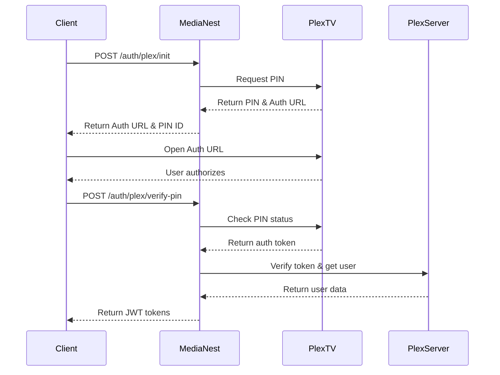
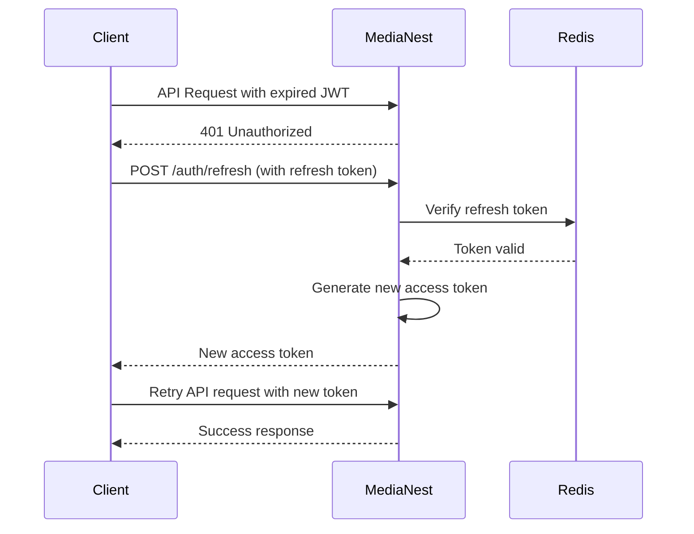

# MediaNest Comprehensive API Reference

**Version:** 2.0  
**Last Updated:** September 2025  
**Base URL:** `http://localhost:4000/api/v1` (Development) | `https://yourdomain.com/api/v1` (Production)  
**Authentication:** JWT-based authentication using secure httpOnly cookies  
**Consolidation:** Merged from 9 API documents for unified reference

## Table of Contents

1. [API Overview](#api-overview)
2. [Authentication & Authorization](#authentication--authorization)
3. [API Design Standards](#api-design-standards)
4. [Response Format](#response-format)
5. [Error Handling](#error-handling)
6. [Rate Limiting](#rate-limiting)
7. [API Endpoints](#api-endpoints)
8. [Authentication Flows](#authentication-flows)
9. [Middleware Analysis](#middleware-analysis)
10. [Integration Workflows](#integration-workflows)
11. [WebSocket APIs](#websocket-apis)
12. [Testing & Documentation](#testing--documentation)

## API Overview

MediaNest provides a RESTful API for managing media streaming, user authentication, and service integrations. The API is built with Express.js and TypeScript, following modern API design principles and security best practices.

### Key Features

- **Multi-Provider Authentication**: Plex, Google, GitHub OAuth
- **Media Management**: Streaming, playlists, search
- **Real-time Features**: WebSocket support for live updates
- **Security**: JWT tokens, CSRF protection, rate limiting
- **Integration**: Plex server and YouTube API integration
- **Admin Features**: User management, system monitoring

### API Architecture

```
┌─────────────────┐    ┌─────────────────┐    ┌─────────────────┐
│   API Gateway   │    │   Middleware    │    │   Controllers   │
│   (Express)     │───▶│   Pipeline      │───▶│   (Handlers)    │
└─────────────────┘    └─────────────────┘    └─────────────────┘
                                │                       │
                                ▼                       ▼
                       ┌─────────────────┐    ┌─────────────────┐
                       │   Validation    │    │    Services     │
                       │   & Security    │    │   (Business)    │
                       └─────────────────┘    └─────────────────┘
                                                       │
                                                       ▼
                                              ┌─────────────────┐
                                              │   Data Layer    │
                                              │ (Repositories)  │
                                              └─────────────────┘
```

### API Versioning

- **v1**: Current stable version
- **Future versions**: Will maintain backward compatibility
- **Deprecation policy**: 6-month notice for breaking changes

## Authentication & Authorization

### Authentication Methods

**1. Plex OAuth (Primary)**

```typescript
// Plex OAuth flow
POST / api / v1 / auth / plex / init; // Initialize OAuth
GET / api / v1 / auth / plex / callback; // OAuth callback
POST / api / v1 / auth / plex / verify - pin; // PIN verification
```

**2. Google OAuth**

```typescript
GET / api / v1 / auth / google; // Initialize Google OAuth
GET / api / v1 / auth / google / callback; // Google callback
```

**3. GitHub OAuth**

```typescript
GET / api / v1 / auth / github; // Initialize GitHub OAuth
GET / api / v1 / auth / github / callback; // GitHub callback
```

### JWT Token Management

**Token Structure:**

```typescript
interface JWTPayload {
  userId: string;
  email: string;
  role: 'admin' | 'user';
  plexId?: string;
  sessionId: string;
  deviceId: string;
  iat: number;
  exp: number;
}
```

**Token Storage:**

- **Access Token**: HttpOnly secure cookie (15 minutes)
- **Refresh Token**: HttpOnly secure cookie (7 days)
- **Device Session**: Redis storage with device fingerprinting

**Authentication Headers:**

```http
# Automatic via cookies - no manual headers required
Cookie: access_token=<jwt>; refresh_token=<jwt>

# Manual header (if needed)
Authorization: Bearer <jwt>
```

### Authorization Levels

| Role      | Permissions                                        |
| --------- | -------------------------------------------------- |
| **Admin** | Full system access, user management, configuration |
| **User**  | Personal content access, playlist management       |
| **Guest** | Public content only (if enabled)                   |

### Session Management

**Session Features:**

- Device-specific sessions
- Concurrent session limits
- Session revocation
- Activity tracking
- Automatic cleanup

**Session API:**

```typescript
GET    /api/v1/auth/sessions        // List user sessions
DELETE /api/v1/auth/sessions/:id    // Revoke specific session
DELETE /api/v1/auth/sessions/all    // Revoke all sessions
```

## API Design Standards

### RESTful Design Principles

**1. Resource-Based URLs:**

```
GET    /api/v1/users             # Collection
GET    /api/v1/users/123         # Specific resource
POST   /api/v1/users             # Create resource
PUT    /api/v1/users/123         # Update resource
DELETE /api/v1/users/123         # Delete resource
```

**2. HTTP Methods:**

- `GET`: Retrieve data (idempotent)
- `POST`: Create new resources
- `PUT`: Update/replace resources (idempotent)
- `PATCH`: Partial updates
- `DELETE`: Remove resources (idempotent)

**3. Status Codes:**

- `200 OK`: Successful GET, PUT, PATCH, DELETE
- `201 Created`: Successful POST
- `204 No Content`: Successful DELETE with no response body
- `400 Bad Request`: Client error
- `401 Unauthorized`: Authentication required
- `403 Forbidden`: Insufficient permissions
- `404 Not Found`: Resource not found
- `429 Too Many Requests`: Rate limit exceeded
- `500 Internal Server Error`: Server error

### Naming Conventions

**Endpoints:**

- Use plural nouns for collections: `/users`, `/playlists`
- Use kebab-case for multi-word resources: `/user-preferences`
- Avoid deep nesting: max 2 levels (`/users/123/playlists`)

**Query Parameters:**

- `limit`: Number of items to return (default: 20, max: 100)
- `offset`: Number of items to skip
- `sort`: Sort field and direction (`name:asc`, `created_at:desc`)
- `filter`: Simple filtering (`status:active`)
- `search`: Full-text search

### Content Types

**Supported Content Types:**

- `application/json`: Primary format
- `multipart/form-data`: File uploads
- `text/event-stream`: Server-sent events

## Response Format

### Standard Response Envelope

**Success Response:**

```typescript
{
  "success": true,
  "data": {
    // Response data
  },
  "meta": {
    "timestamp": "2025-09-07T10:30:00Z",
    "requestId": "req-123-456-789",
    "pagination": {
      "total": 100,
      "limit": 20,
      "offset": 0,
      "hasMore": true
    }
  }
}
```

**Error Response:**

```typescript
{
  "success": false,
  "error": {
    "code": "VALIDATION_ERROR",
    "message": "Invalid input data",
    "details": {
      "field": "email",
      "issue": "Invalid email format"
    }
  },
  "meta": {
    "timestamp": "2025-09-07T10:30:00Z",
    "requestId": "req-123-456-789"
  }
}
```

### Pagination

**Query Parameters:**

```
GET /api/v1/users?limit=20&offset=40
```

**Response:**

```typescript
{
  "data": [...],
  "meta": {
    "pagination": {
      "total": 100,
      "limit": 20,
      "offset": 40,
      "hasMore": true,
      "page": 3,
      "totalPages": 5
    }
  }
}
```

### Data Formats

**Timestamps:**

- ISO 8601 format: `2025-09-07T10:30:00Z`
- UTC timezone
- Consistent field names: `createdAt`, `updatedAt`

**IDs:**

- UUIDs for all resource identifiers
- External IDs preserved as separate fields

## Error Handling

### Error Categories

**1. Client Errors (4xx):**

- `400 Bad Request`: Invalid request format
- `401 Unauthorized`: Authentication required
- `403 Forbidden`: Insufficient permissions
- `404 Not Found`: Resource not found
- `422 Unprocessable Entity`: Validation errors

**2. Server Errors (5xx):**

- `500 Internal Server Error`: Unexpected server error
- `502 Bad Gateway`: External service error
- `503 Service Unavailable`: Service temporarily unavailable

### Error Response Details

```typescript
interface ErrorResponse {
  success: false;
  error: {
    code: string; // Machine-readable error code
    message: string; // Human-readable message
    details?: any; // Additional error context
    field?: string; // Field causing validation error
    stack?: string; // Stack trace (development only)
  };
  meta: {
    timestamp: string;
    requestId: string;
    path: string;
    method: string;
  };
}
```

### Common Error Codes

| Code                       | Description                                 |
| -------------------------- | ------------------------------------------- |
| `AUTHENTICATION_REQUIRED`  | Valid authentication token required         |
| `INVALID_CREDENTIALS`      | Login credentials are incorrect             |
| `TOKEN_EXPIRED`            | JWT token has expired                       |
| `INSUFFICIENT_PERMISSIONS` | User lacks required permissions             |
| `VALIDATION_ERROR`         | Request data validation failed              |
| `RESOURCE_NOT_FOUND`       | Requested resource does not exist           |
| `RATE_LIMIT_EXCEEDED`      | Too many requests from client               |
| `EXTERNAL_SERVICE_ERROR`   | Error from external service (Plex, YouTube) |
| `DATABASE_ERROR`           | Database operation failed                   |

## Rate Limiting

### Rate Limiting Strategy

**Implementation**: Token Bucket Algorithm with Redis storage

**Rate Limits by Endpoint Type:**

| Endpoint Category  | Rate Limit    | Window   |
| ------------------ | ------------- | -------- |
| **Authentication** | 10 requests   | 1 minute |
| **API General**    | 1000 requests | 1 hour   |
| **Search**         | 100 requests  | 1 minute |
| **Upload**         | 10 requests   | 1 minute |
| **Admin**          | 500 requests  | 1 hour   |

### Rate Limit Headers

```http
X-RateLimit-Limit: 1000
X-RateLimit-Remaining: 999
X-RateLimit-Reset: 1623456789
X-RateLimit-Window: 3600
```

### Rate Limit Response

```typescript
{
  "success": false,
  "error": {
    "code": "RATE_LIMIT_EXCEEDED",
    "message": "Too many requests. Please try again later.",
    "details": {
      "limit": 1000,
      "remaining": 0,
      "resetTime": "2025-09-07T11:00:00Z"
    }
  }
}
```

## API Endpoints

### Health Check

**System Health:**

```http
GET /api/v1/health
```

```typescript
// Response
{
  "success": true,
  "data": {
    "status": "healthy",
    "timestamp": "2025-09-07T10:30:00Z",
    "version": "1.0.0",
    "uptime": 3600,
    "services": {
      "database": "healthy",
      "redis": "healthy",
      "plex": "healthy"
    }
  }
}
```

### Authentication Endpoints

**Plex Authentication:**

```http
# Initialize Plex OAuth
POST /api/v1/auth/plex/init
Content-Type: application/json

{
  "clientIdentifier": "client-id-123"
}

# Response
{
  "success": true,
  "data": {
    "authUrl": "https://plex.tv/auth#!?...",
    "pinId": "123456",
    "code": "abcdef"
  }
}
```

```http
# Verify PIN
POST /api/v1/auth/plex/verify-pin
Content-Type: application/json

{
  "pinId": "123456"
}

# Response
{
  "success": true,
  "data": {
    "user": {
      "id": "user-uuid",
      "email": "user@example.com",
      "plexUsername": "username"
    },
    "tokens": {
      "accessToken": "jwt-token",
      "refreshToken": "refresh-token"
    }
  }
}
```

**Token Management:**

```http
# Refresh token
POST /api/v1/auth/refresh
# Uses refresh token from httpOnly cookie

# Logout
POST /api/v1/auth/logout
# Clears cookies and revokes tokens

# Logout all devices
POST /api/v1/auth/logout-all
```

### User Endpoints

**User Profile:**

```http
# Get current user
GET /api/v1/users/me

# Update user profile
PUT /api/v1/users/me
Content-Type: application/json

{
  "displayName": "John Doe",
  "preferences": {
    "theme": "dark",
    "language": "en",
    "autoplay": true
  }
}
```

**User Settings:**

```http
# Get user settings
GET /api/v1/users/me/settings

# Update settings
PATCH /api/v1/users/me/settings
Content-Type: application/json

{
  "theme": "dark",
  "notifications": true,
  "autoplay": false
}
```

### Media Endpoints

**Media Library:**

```http
# Get media items
GET /api/v1/media?limit=20&offset=0&type=movie&sort=title:asc

# Get specific media item
GET /api/v1/media/:id

# Search media
GET /api/v1/media/search?q=batman&type=movie&source=plex
```

**Playlists:**

```http
# Get user playlists
GET /api/v1/playlists

# Create playlist
POST /api/v1/playlists
Content-Type: application/json

{
  "name": "My Favorites",
  "description": "Favorite movies and shows",
  "isPublic": false
}

# Add items to playlist
POST /api/v1/playlists/:id/items
Content-Type: application/json

{
  "mediaItems": ["media-id-1", "media-id-2"]
}

# Remove items from playlist
DELETE /api/v1/playlists/:id/items/:itemId
```

**Watch History:**

```http
# Get watch history
GET /api/v1/users/me/history?limit=50

# Update watch progress
POST /api/v1/media/:id/progress
Content-Type: application/json

{
  "progress": 1800,  // seconds
  "completed": false
}

# Mark as watched
POST /api/v1/media/:id/watched
```

### Plex Integration Endpoints

**Plex Server Management:**

```http
# Get Plex servers
GET /api/v1/plex/servers

# Get server libraries
GET /api/v1/plex/servers/:serverId/libraries

# Get library content
GET /api/v1/plex/libraries/:libraryId/content?limit=20&offset=0

# Get media details
GET /api/v1/plex/media/:mediaId

# Get streaming URL
GET /api/v1/plex/media/:mediaId/stream
```

**Plex Synchronization:**

```http
# Sync Plex library
POST /api/v1/plex/sync
Content-Type: application/json

{
  "libraryId": "library-123",
  "fullSync": false
}

# Get sync status
GET /api/v1/plex/sync/status
```

### YouTube Integration Endpoints

**YouTube Content:**

```http
# Search YouTube
GET /api/v1/youtube/search?q=music+video&type=video&maxResults=25

# Get video details
GET /api/v1/youtube/videos/:videoId

# Get channel info
GET /api/v1/youtube/channels/:channelId

# Get video streaming URL
GET /api/v1/youtube/videos/:videoId/stream
```

### Admin Endpoints

**User Management:**

```http
# Get all users (admin only)
GET /api/v1/admin/users?limit=50&role=user

# Update user role
PUT /api/v1/admin/users/:userId/role
Content-Type: application/json

{
  "role": "admin"
}

# Deactivate user
POST /api/v1/admin/users/:userId/deactivate
```

**System Management:**

```http
# Get system statistics
GET /api/v1/admin/stats

# Get system logs
GET /api/v1/admin/logs?level=error&limit=100

# Clear cache
POST /api/v1/admin/cache/clear
```

### Webhook Endpoints

**Plex Webhooks:**

```http
# Plex webhook handler
POST /api/v1/webhooks/plex
Content-Type: application/json

{
  "event": "media.scrobble",
  "user": true,
  "owner": true,
  "Account": { ... },
  "Server": { ... },
  "Player": { ... },
  "Metadata": { ... }
}
```

## Authentication Flows

### Plex OAuth Flow



### JWT Token Refresh Flow



## Middleware Analysis

### Middleware Pipeline

```
Request → Logger → CORS → Security → Rate Limit → Auth → Validation → Controller
```

**1. Logger Middleware:**

```typescript
// Logs all requests with timing and response codes
app.use(morgan('combined'));
app.use(requestLogger);
```

**2. CORS Middleware:**

```typescript
// Cross-Origin Resource Sharing configuration
app.use(
  cors({
    origin: process.env.FRONTEND_URL,
    credentials: true,
    methods: ['GET', 'POST', 'PUT', 'DELETE', 'PATCH'],
    allowedHeaders: ['Content-Type', 'Authorization'],
  })
);
```

**3. Security Middleware:**

```typescript
// Security headers and protection
app.use(
  helmet({
    contentSecurityPolicy: {
      directives: {
        defaultSrc: ["'self'"],
        scriptSrc: ["'self'", "'unsafe-inline'"],
        styleSrc: ["'self'", "'unsafe-inline'"],
      },
    },
  })
);
```

**4. Rate Limiting Middleware:**

```typescript
// Request rate limiting
const limiter = rateLimit({
  windowMs: 15 * 60 * 1000, // 15 minutes
  max: 100, // requests per window
  message: 'Too many requests from this IP',
});
```

**5. Authentication Middleware:**

```typescript
// JWT token validation
const authenticate = async (req, res, next) => {
  try {
    const token = req.cookies.access_token;
    const decoded = jwt.verify(token, process.env.JWT_SECRET);
    req.user = decoded;
    next();
  } catch (error) {
    return res.status(401).json({ error: 'Unauthorized' });
  }
};
```

**6. Validation Middleware:**

```typescript
// Request body validation with Zod
const validate = (schema) => (req, res, next) => {
  try {
    req.body = schema.parse(req.body);
    next();
  } catch (error) {
    return res.status(400).json({ error: error.errors });
  }
};
```

### Error Handling Middleware

```typescript
// Global error handler
app.use((error, req, res, next) => {
  logger.error('API Error:', error);

  if (error.type === 'validation') {
    return res.status(400).json({
      success: false,
      error: {
        code: 'VALIDATION_ERROR',
        message: error.message,
        details: error.details,
      },
    });
  }

  if (error.type === 'authentication') {
    return res.status(401).json({
      success: false,
      error: {
        code: 'AUTHENTICATION_ERROR',
        message: 'Authentication required',
      },
    });
  }

  // Default server error
  res.status(500).json({
    success: false,
    error: {
      code: 'INTERNAL_ERROR',
      message: 'An unexpected error occurred',
    },
  });
});
```

## Integration Workflows

### Plex Integration Workflow

**1. Server Discovery:**

```typescript
// Discover user's Plex servers
const discoverServers = async (userToken: string) => {
  const response = await plex.get('/pms/servers', {
    headers: { 'X-Plex-Token': userToken },
  });

  return response.data.servers.map((server) => ({
    id: server.machineIdentifier,
    name: server.name,
    host: server.host,
    port: server.port,
    version: server.version,
  }));
};
```

**2. Library Synchronization:**

```typescript
// Sync Plex library with local database
const syncLibrary = async (serverId: string, libraryId: string) => {
  const mediaItems = await plex.getLibraryContent(serverId, libraryId);

  for (const item of mediaItems) {
    await mediaRepository.upsert({
      externalId: item.ratingKey,
      title: item.title,
      type: item.type,
      metadata: item,
      source: 'plex',
    });
  }
};
```

### YouTube Integration Workflow

**1. Content Search:**

```typescript
// Search YouTube content
const searchYouTube = async (query: string, type: string = 'video') => {
  const response = await youtube.search.list({
    part: 'snippet',
    q: query,
    type: type,
    maxResults: 25,
  });

  return response.data.items.map((item) => ({
    id: item.id.videoId,
    title: item.snippet.title,
    description: item.snippet.description,
    thumbnail: item.snippet.thumbnails.medium.url,
    channelTitle: item.snippet.channelTitle,
  }));
};
```

**2. Stream URL Generation:**

```typescript
// Get YouTube stream URL
const getStreamUrl = async (videoId: string, quality: string = '720p') => {
  const info = await ytdl.getInfo(videoId);
  const format = ytdl.chooseFormat(info.formats, {
    quality: quality,
    filter: 'audioandvideo',
  });

  return {
    url: format.url,
    quality: format.qualityLabel,
    duration: info.videoDetails.lengthSeconds,
  };
};
```

## WebSocket APIs

### WebSocket Connection

**Connection Endpoint:**

```javascript
const socket = io('/api/v1/ws', {
  auth: {
    token: accessToken,
  },
});
```

### WebSocket Events

**Client to Server:**

```typescript
// Join room for real-time updates
socket.emit('join-room', { room: 'user-123' });

// Subscribe to media updates
socket.emit('subscribe', { type: 'media-updates' });

// Player state updates
socket.emit('player-state', {
  mediaId: 'media-123',
  position: 1800,
  playing: true,
});
```

**Server to Client:**

```typescript
// Media library updates
socket.emit('media-updated', {
  type: 'media-added',
  data: { mediaItem },
});

// System notifications
socket.emit('notification', {
  type: 'info',
  message: 'Library sync completed',
  timestamp: '2025-09-07T10:30:00Z',
});

// Player synchronization
socket.emit('player-sync', {
  mediaId: 'media-123',
  position: 1800,
  playing: true,
  userId: 'user-123',
});
```

### WebSocket Authentication

```typescript
// JWT-based WebSocket authentication
io.use((socket, next) => {
  const token = socket.handshake.auth.token;

  try {
    const decoded = jwt.verify(token, process.env.JWT_SECRET);
    socket.userId = decoded.userId;
    next();
  } catch (error) {
    next(new Error('Authentication failed'));
  }
});
```

## Testing & Documentation

### API Testing Strategy

**1. Unit Tests:**

```typescript
describe('AuthController', () => {
  it('should authenticate user with valid Plex token', async () => {
    const result = await authController.plexLogin({
      token: 'valid-plex-token',
    });

    expect(result.success).toBe(true);
    expect(result.data.user).toBeDefined();
  });
});
```

**2. Integration Tests:**

```typescript
describe('API Integration', () => {
  it('should create and retrieve playlist', async () => {
    const createResponse = await request(app)
      .post('/api/v1/playlists')
      .set('Cookie', authCookie)
      .send({ name: 'Test Playlist' })
      .expect(201);

    const getResponse = await request(app)
      .get(`/api/v1/playlists/${createResponse.body.data.id}`)
      .set('Cookie', authCookie)
      .expect(200);

    expect(getResponse.body.data.name).toBe('Test Playlist');
  });
});
```

**3. End-to-End Tests:**

```typescript
describe('Authentication Flow E2E', () => {
  it('should complete Plex OAuth flow', async () => {
    // Test complete authentication workflow
    const initResponse = await request(app).post('/api/v1/auth/plex/init').expect(200);

    // Simulate PIN verification
    const verifyResponse = await request(app)
      .post('/api/v1/auth/plex/verify-pin')
      .send({ pinId: initResponse.body.data.pinId })
      .expect(200);

    expect(verifyResponse.body.data.user).toBeDefined();
  });
});
```

### API Documentation Tools

**OpenAPI Specification:**

- Complete OpenAPI 3.0 specification
- Interactive documentation with Swagger UI
- Automated API documentation generation
- Client SDK generation

**Postman Collection:**

- Complete API endpoint collection
- Environment variables for different stages
- Automated testing suites
- Documentation examples

### Performance Testing

**Load Testing with Artillery:**

```yaml
config:
  target: 'http://localhost:4000'
  phases:
    - duration: 60
      arrivalRate: 10

scenarios:
  - name: 'API Load Test'
    requests:
      - get:
          url: '/api/v1/media'
          headers:
            Cookie: '{{ authCookie }}'
```

**Monitoring & Metrics:**

- Response time monitoring
- Error rate tracking
- Throughput measurement
- Resource utilization

---

**Last Updated:** September 7, 2025  
**Document Version:** 2.0  
**Consolidation Note:** This reference combines content from 9 previously separate API documents for unified reference.

For implementation details, see:

- [Architecture Guide](./COMPREHENSIVE_ARCHITECTURE_GUIDE.md)
- [Security Guide](./COMPREHENSIVE_SECURITY_GUIDE.md)
- [Deployment Guide](./COMPREHENSIVE_DEPLOYMENT_GUIDE.md)
