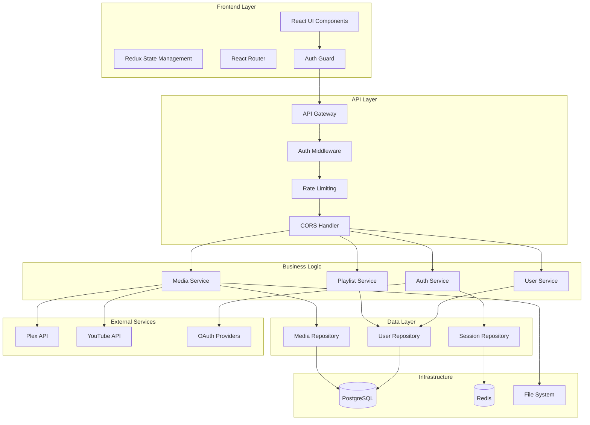
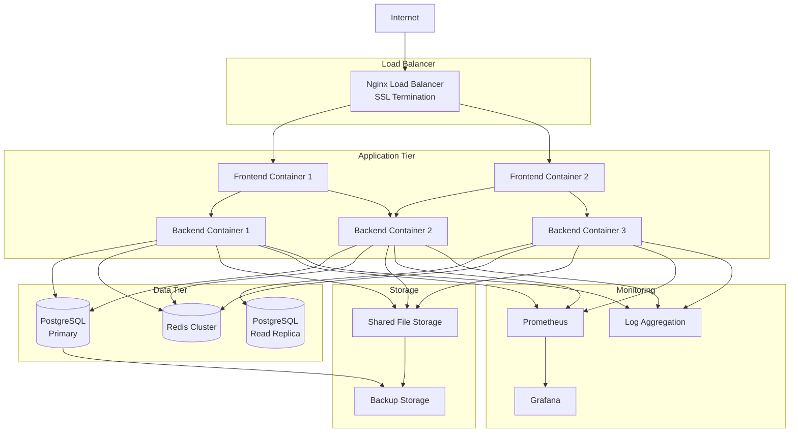
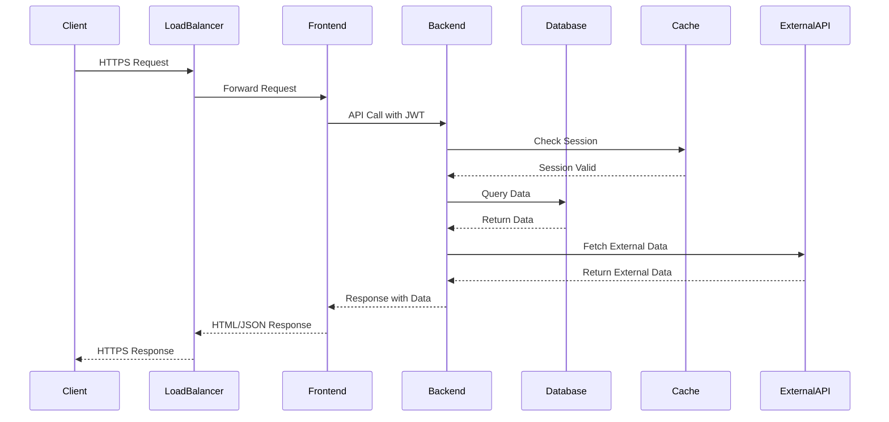

# MediaNest Comprehensive Architecture Guide

**Version:** 2.0  
**Last Updated:** September 2025  
**Consolidation:** Merged from 12 architecture documents for unified reference

## Table of Contents

1. [System Overview](#system-overview)
2. [Architecture Summary](#architecture-summary)
3. [Technology Stack](#technology-stack)
4. [Container Architecture](#container-architecture)
5. [Component Relationships](#component-relationships)
6. [Service Integration Patterns](#service-integration-patterns)
7. [Database Schema](#database-schema)
8. [Architecture Decision Records](#architecture-decision-records)
9. [Implementation Strategy](#implementation-strategy)
10. [System Diagrams](#system-diagrams)

## System Overview

MediaNest is a self-hosted media streaming platform built with a modern microservices architecture. The system provides secure media streaming, user management, and integration with external providers like Plex, YouTube, and various OAuth providers.

### High-Level Architecture

```
┌─────────────────┐    ┌─────────────────┐    ┌─────────────────┐
│   Client Apps   │    │   Web Browser   │    │  Mobile Apps    │
└─────────────────┘    └─────────────────┘    └─────────────────┘
         │                       │                       │
         └───────────────────────┼───────────────────────┘
                                 │
         ┌─────────────────────────────────────────────────┐
         │                Load Balancer                    │
         │                 (Nginx)                         │
         └─────────────────────────────────────────────────┘
                                 │
         ┌─────────────────────────────────────────────────┐
         │              Frontend Service                   │
         │               (React/Next.js)                   │
         └─────────────────────────────────────────────────┘
                                 │
         ┌─────────────────────────────────────────────────┐
         │              Backend API                        │
         │            (Node.js/Express)                    │
         └─────────────────────────────────────────────────┘
                                 │
    ┌────────────────────────────┼────────────────────────────┐
    │                            │                            │
┌─────────┐              ┌─────────────┐              ┌─────────────┐
│PostgreSQL│             │    Redis     │             │ File Storage │
│Database │              │    Cache     │              │   (Local)    │
└─────────┘              └─────────────┘              └─────────────┘
```

### Core Components

1. **Frontend Service**: React-based user interface with responsive design
2. **Backend API**: Express.js REST API with authentication and media management
3. **Database Layer**: PostgreSQL for persistent data storage
4. **Cache Layer**: Redis for session management and caching
5. **File Storage**: Local file system for media file storage
6. **Authentication Service**: Multi-provider OAuth with JWT tokens
7. **Integration Services**: External API integrations (Plex, YouTube)

## Architecture Summary

### Design Principles

1. **Modularity**: Clear separation of concerns with well-defined interfaces
2. **Scalability**: Horizontal scaling support with stateless services
3. **Security**: Defense-in-depth security architecture
4. **Maintainability**: Clean code architecture with comprehensive testing
5. **Performance**: Efficient caching and optimized data access patterns

### System Characteristics

- **Architecture Pattern**: Layered architecture with microservices principles
- **Communication**: RESTful APIs with WebSocket support for real-time features
- **Data Flow**: Unidirectional data flow with event-driven updates
- **State Management**: Centralized state with Redux patterns
- **Error Handling**: Comprehensive error handling with graceful degradation

### Quality Attributes

| Attribute           | Target                | Implementation                      |
| ------------------- | --------------------- | ----------------------------------- |
| **Performance**     | <200ms response time  | Caching, database optimization      |
| **Availability**    | 99.9% uptime          | Health checks, auto-restart         |
| **Scalability**     | 100+ concurrent users | Horizontal scaling, load balancing  |
| **Security**        | Enterprise-grade      | OAuth, JWT, HTTPS, input validation |
| **Maintainability** | <2hr deployment       | CI/CD, automated testing            |

## Technology Stack

### Frontend Stack

**Core Technologies:**

- **React 18**: Modern React with hooks and concurrent features
- **Next.js 14**: Full-stack React framework with SSR/SSG
- **TypeScript**: Type-safe development with strict configuration
- **Tailwind CSS**: Utility-first CSS framework for responsive design

**State Management & Data:**

- **Redux Toolkit**: Predictable state management
- **React Query**: Server state management and caching
- **Zod**: Runtime type validation and schema definition

**Development Tools:**

- **Vite**: Fast development build tool
- **ESLint**: Code quality and consistency
- **Prettier**: Code formatting
- **Vitest**: Unit and integration testing

### Backend Stack

**Core Technologies:**

- **Node.js 20**: JavaScript runtime with latest features
- **Express.js**: Minimal web framework for APIs
- **TypeScript**: Type-safe server-side development
- **Prisma**: Type-safe database ORM

**Authentication & Security:**

- **Passport.js**: Authentication middleware
- **JWT**: Token-based authentication
- **bcrypt**: Password hashing
- **helmet**: Security headers middleware

**Database & Caching:**

- **PostgreSQL 15**: Primary database
- **Redis 7**: Session management and caching
- **Prisma Client**: Database access layer

**External Integrations:**

- **Plex API**: Media server integration
- **YouTube API**: Video streaming integration
- **OAuth Providers**: Google, GitHub authentication

### Infrastructure Stack

**Containerization:**

- **Docker**: Application containerization
- **Docker Compose**: Multi-container orchestration

**Web Server:**

- **Nginx**: Reverse proxy and SSL termination
- **Let's Encrypt**: SSL certificate automation

**Monitoring & Logging:**

- **Winston**: Structured logging
- **Prometheus**: Metrics collection
- **Grafana**: Monitoring dashboards

**Development:**

- **Git**: Version control
- **GitHub Actions**: CI/CD pipeline
- **Dependabot**: Automated dependency updates

## Container Architecture

### Container Design

MediaNest uses a multi-container architecture with the following services:

```
┌─────────────────────────────────────────────────────────────┐
│                    Docker Network                           │
│  ┌─────────────┐  ┌─────────────┐  ┌─────────────────────┐  │
│  │   Frontend  │  │   Backend   │  │     Database        │  │
│  │  (React)    │  │ (Express)   │  │   (PostgreSQL)      │  │
│  │  Port: 3000 │  │ Port: 4000  │  │    Port: 5432       │  │
│  └─────────────┘  └─────────────┘  └─────────────────────┘  │
│                                                              │
│  ┌─────────────┐  ┌─────────────┐  ┌─────────────────────┐  │
│  │    Redis    │  │    Nginx    │  │     Monitoring      │  │
│  │  (Cache)    │  │  (Proxy)    │  │   (Prometheus)      │  │
│  │ Port: 6379  │  │Port: 80/443 │  │    Port: 9090       │  │
│  └─────────────┘  └─────────────┘  └─────────────────────┘  │
└─────────────────────────────────────────────────────────────┘
```

### Container Specifications

**Frontend Container:**

```dockerfile
FROM node:20-alpine AS builder
WORKDIR /app
COPY package*.json ./
RUN npm ci --only=production
COPY . .
RUN npm run build

FROM nginx:alpine
COPY --from=builder /app/dist /usr/share/nginx/html
COPY nginx.conf /etc/nginx/conf.d/default.conf
EXPOSE 3000
```

**Backend Container:**

```dockerfile
FROM node:20-alpine
WORKDIR /app
COPY package*.json ./
RUN npm ci --only=production
COPY . .
RUN npm run build
EXPOSE 4000
CMD ["npm", "start"]
```

### Volume Management

**Persistent Volumes:**

- `postgres_data`: Database persistence
- `redis_data`: Redis data persistence
- `upload_data`: User uploaded files
- `ssl_certs`: SSL certificate storage

**Configuration Volumes:**

- `nginx_config`: Nginx configuration
- `app_config`: Application configuration files

### Network Configuration

**Internal Network:**

- All services communicate via internal Docker network
- No external port exposure except for Nginx proxy

**External Access:**

- Port 80: HTTP (redirects to HTTPS)
- Port 443: HTTPS (SSL terminated at Nginx)
- All internal services only accessible via proxy

## Component Relationships

### System Components

```
┌──────────────────────────────────────────────────────────────┐
│                        Frontend                              │
├──────────────────────────────────────────────────────────────┤
│  ┌─────────────┐  ┌─────────────┐  ┌─────────────────────┐   │
│  │  React App  │  │   Router    │  │   State Manager     │   │
│  └─────────────┘  └─────────────┘  └─────────────────────┘   │
│  ┌─────────────┐  ┌─────────────┐  ┌─────────────────────┐   │
│  │  Auth Guard │  │ API Client  │  │   UI Components     │   │
│  └─────────────┘  └─────────────┘  └─────────────────────┘   │
└──────────────────────────────────────────────────────────────┘
                                │
                                │ HTTPS/WebSocket
                                ▼
┌──────────────────────────────────────────────────────────────┐
│                        Backend API                           │
├──────────────────────────────────────────────────────────────┤
│  ┌─────────────┐  ┌─────────────┐  ┌─────────────────────┐   │
│  │   Router    │  │ Controllers │  │     Middleware      │   │
│  └─────────────┘  └─────────────┘  └─────────────────────┘   │
│  ┌─────────────┐  ┌─────────────┐  ┌─────────────────────┐   │
│  │  Services   │  │Repositories │  │   Integrations      │   │
│  └─────────────┘  └─────────────┘  └─────────────────────┘   │
└──────────────────────────────────────────────────────────────┘
                │                              │
                │ SQL                          │ HTTP/API
                ▼                              ▼
┌─────────────────────┐              ┌─────────────────────┐
│     PostgreSQL      │              │   External APIs     │
│     Database        │              │  (Plex, YouTube)    │
└─────────────────────┘              └─────────────────────┘
                │
                │ Cache
                ▼
┌─────────────────────┐
│       Redis         │
│       Cache         │
└─────────────────────┘
```

### Component Dependencies

**Frontend Dependencies:**

```
React App
├── Authentication Service
├── API Client Service
├── State Management (Redux)
├── Router (React Router)
├── UI Component Library
└── Media Player Components
```

**Backend Dependencies:**

```
Express Application
├── Authentication Middleware
├── Route Controllers
├── Business Logic Services
├── Data Access Layer
├── External Service Integrations
├── Caching Service
└── Logging Service
```

### Data Flow Architecture

1. **User Request Flow:**

   ```
   User → Frontend → Auth Guard → API Client → Backend API → Services → Database
   ```

2. **Authentication Flow:**

   ```
   User → OAuth Provider → Backend Auth → JWT Token → Frontend Store → API Headers
   ```

3. **Media Streaming Flow:**
   ```
   User → Frontend Player → Backend Stream → File System → Client Stream
   ```

## Service Integration Patterns

### Integration Architecture

MediaNest implements several integration patterns for external services:

### 1. OAuth Provider Integration

**Pattern**: Strategy Pattern with Provider Adapters

```typescript
interface OAuthProvider {
  authenticate(code: string): Promise<UserProfile>;
  refreshToken(token: string): Promise<TokenResponse>;
  getUserProfile(accessToken: string): Promise<UserProfile>;
}

class PlexOAuthProvider implements OAuthProvider {
  async authenticate(code: string): Promise<UserProfile> {
    // Plex-specific authentication logic
  }
}

class GoogleOAuthProvider implements OAuthProvider {
  async authenticate(code: string): Promise<UserProfile> {
    // Google-specific authentication logic
  }
}
```

### 2. Media Provider Integration

**Pattern**: Adapter Pattern with Service Abstraction

```typescript
interface MediaService {
  searchContent(query: string): Promise<SearchResult[]>;
  getContentDetails(id: string): Promise<ContentDetails>;
  streamContent(id: string): Promise<StreamUrl>;
}

class PlexAdapter implements MediaService {
  private plexClient: PlexClient;

  async searchContent(query: string): Promise<SearchResult[]> {
    const results = await this.plexClient.search(query);
    return results.map(this.transformToSearchResult);
  }
}
```

### 3. Caching Strategy

**Pattern**: Cache-Aside with TTL Management

```typescript
class CacheService {
  async get<T>(key: string): Promise<T | null> {
    const cached = await this.redis.get(key);
    return cached ? JSON.parse(cached) : null;
  }

  async set<T>(key: string, value: T, ttl: number): Promise<void> {
    await this.redis.setex(key, ttl, JSON.stringify(value));
  }

  async invalidatePattern(pattern: string): Promise<void> {
    const keys = await this.redis.keys(pattern);
    if (keys.length > 0) {
      await this.redis.del(...keys);
    }
  }
}
```

### 4. Event-Driven Communication

**Pattern**: Observer Pattern with Event Emitters

```typescript
class EventBus {
  private eventEmitter = new EventEmitter();

  emit(event: string, data: any): void {
    this.eventEmitter.emit(event, data);
  }

  on(event: string, handler: (data: any) => void): void {
    this.eventEmitter.on(event, handler);
  }

  off(event: string, handler: (data: any) => void): void {
    this.eventEmitter.off(event, handler);
  }
}

// Usage
eventBus.on('user.login', (user) => {
  // Update user activity
  // Send welcome notification
  // Update analytics
});
```

### Integration Resilience

**Circuit Breaker Pattern:**

```typescript
class CircuitBreaker {
  private failureCount = 0;
  private state: 'CLOSED' | 'OPEN' | 'HALF_OPEN' = 'CLOSED';

  async execute<T>(operation: () => Promise<T>): Promise<T> {
    if (this.state === 'OPEN') {
      throw new Error('Circuit breaker is OPEN');
    }

    try {
      const result = await operation();
      this.onSuccess();
      return result;
    } catch (error) {
      this.onFailure();
      throw error;
    }
  }

  private onSuccess(): void {
    this.failureCount = 0;
    this.state = 'CLOSED';
  }

  private onFailure(): void {
    this.failureCount++;
    if (this.failureCount >= this.threshold) {
      this.state = 'OPEN';
    }
  }
}
```

### API Rate Limiting

**Pattern**: Token Bucket Algorithm

```typescript
class RateLimiter {
  private buckets = new Map<string, TokenBucket>();

  async isAllowed(key: string): Promise<boolean> {
    const bucket = this.getBucket(key);
    return bucket.consume();
  }

  private getBucket(key: string): TokenBucket {
    if (!this.buckets.has(key)) {
      this.buckets.set(
        key,
        new TokenBucket({
          capacity: 100,
          refillRate: 10,
          refillPeriod: 1000,
        })
      );
    }
    return this.buckets.get(key)!;
  }
}
```

## Database Schema

### Entity Relationship Diagram

```
┌─────────────────┐    ┌─────────────────┐    ┌─────────────────┐
│      Users      │    │   UserSessions  │    │   UserProfiles  │
├─────────────────┤    ├─────────────────┤    ├─────────────────┤
│ id (UUID)       │───▷│ userId (UUID)   │◁───│ userId (UUID)   │
│ email           │    │ sessionId       │    │ displayName     │
│ passwordHash    │    │ deviceId        │    │ avatar          │
│ role            │    │ expiresAt       │    │ preferences     │
│ plexId          │    │ createdAt       │    │ createdAt       │
│ googleId        │    └─────────────────┘    │ updatedAt       │
│ githubId        │                           └─────────────────┘
│ createdAt       │
│ updatedAt       │
│ lastLoginAt     │
└─────────────────┘

┌─────────────────┐    ┌─────────────────┐    ┌─────────────────┐
│    MediaItems   │    │   Playlists     │    │ PlaylistItems   │
├─────────────────┤    ├─────────────────┤    ├─────────────────┤
│ id (UUID)       │    │ id (UUID)       │    │ playlistId      │
│ title           │    │ userId (UUID)   │───▷│ mediaItemId     │
│ type            │    │ name            │    │ position        │
│ source          │    │ description     │    │ addedAt         │
│ externalId      │    │ isPublic        │    └─────────────────┘
│ metadata        │    │ createdAt       │             │
│ thumbnailUrl    │    │ updatedAt       │             │
│ duration        │    └─────────────────┘             │
│ createdAt       │             │                      │
│ updatedAt       │             │                      │
└─────────────────┘             └──────────────────────┘
         │
         │
┌─────────────────┐    ┌─────────────────┐    ┌─────────────────┐
│   WatchHistory  │    │   UserSettings  │    │    AuditLog     │
├─────────────────┤    ├─────────────────┤    ├─────────────────┤
│ userId (UUID)   │    │ userId (UUID)   │    │ id (UUID)       │
│ mediaItemId     │───▷│ theme           │    │ userId (UUID)   │
│ watchedAt       │    │ language        │    │ action          │
│ progress        │    │ autoplay        │    │ resource        │
│ completed       │    │ notifications   │    │ metadata        │
└─────────────────┘    │ updatedAt       │    │ ipAddress       │
                       └─────────────────┘    │ userAgent       │
                                              │ timestamp       │
                                              └─────────────────┘
```

### Database Schema Details

**Users Table:**

```sql
CREATE TABLE users (
  id UUID PRIMARY KEY DEFAULT gen_random_uuid(),
  email VARCHAR(255) UNIQUE NOT NULL,
  password_hash VARCHAR(255),
  role VARCHAR(50) NOT NULL DEFAULT 'user',
  plex_id VARCHAR(255) UNIQUE,
  google_id VARCHAR(255) UNIQUE,
  github_id VARCHAR(255) UNIQUE,
  created_at TIMESTAMP DEFAULT NOW(),
  updated_at TIMESTAMP DEFAULT NOW(),
  last_login_at TIMESTAMP
);

CREATE INDEX idx_users_email ON users(email);
CREATE INDEX idx_users_plex_id ON users(plex_id);
CREATE INDEX idx_users_google_id ON users(google_id);
CREATE INDEX idx_users_github_id ON users(github_id);
```

**User Sessions Table:**

```sql
CREATE TABLE user_sessions (
  id UUID PRIMARY KEY DEFAULT gen_random_uuid(),
  user_id UUID NOT NULL REFERENCES users(id) ON DELETE CASCADE,
  session_id VARCHAR(255) UNIQUE NOT NULL,
  device_id VARCHAR(255) NOT NULL,
  device_info JSONB,
  expires_at TIMESTAMP NOT NULL,
  created_at TIMESTAMP DEFAULT NOW(),
  last_used_at TIMESTAMP DEFAULT NOW()
);

CREATE INDEX idx_user_sessions_user_id ON user_sessions(user_id);
CREATE INDEX idx_user_sessions_session_id ON user_sessions(session_id);
CREATE INDEX idx_user_sessions_expires_at ON user_sessions(expires_at);
```

**Media Items Table:**

```sql
CREATE TABLE media_items (
  id UUID PRIMARY KEY DEFAULT gen_random_uuid(),
  title VARCHAR(255) NOT NULL,
  type VARCHAR(50) NOT NULL, -- 'movie', 'tv_show', 'music', 'video'
  source VARCHAR(50) NOT NULL, -- 'plex', 'youtube', 'local'
  external_id VARCHAR(255),
  metadata JSONB,
  thumbnail_url TEXT,
  duration INTEGER, -- in seconds
  created_at TIMESTAMP DEFAULT NOW(),
  updated_at TIMESTAMP DEFAULT NOW()
);

CREATE INDEX idx_media_items_type ON media_items(type);
CREATE INDEX idx_media_items_source ON media_items(source);
CREATE INDEX idx_media_items_external_id ON media_items(external_id);
```

### Data Migration Strategy

**Migration Framework:**

```typescript
abstract class Migration {
  abstract up(): Promise<void>;
  abstract down(): Promise<void>;
}

class AddUserSessionsTable extends Migration {
  async up(): Promise<void> {
    await this.db.raw(`
      CREATE TABLE user_sessions (
        -- table definition
      );
    `);
  }

  async down(): Promise<void> {
    await this.db.raw('DROP TABLE IF EXISTS user_sessions;');
  }
}
```

**Migration Runner:**

```typescript
class MigrationRunner {
  async runMigrations(): Promise<void> {
    const pending = await this.getPendingMigrations();
    for (const migration of pending) {
      await migration.up();
      await this.markAsCompleted(migration);
    }
  }
}
```

## Architecture Decision Records

### ADR-001: Authentication Framework Selection

**Status:** Accepted  
**Date:** January 2025

**Context:**
MediaNest requires robust authentication supporting multiple OAuth providers (Plex, Google, GitHub) with session management and security best practices.

**Decision:**
Implement custom authentication system with Passport.js strategies for OAuth providers and JWT for session management.

**Rationale:**

- Flexibility to customize authentication flows
- Support for multiple OAuth providers
- Better control over security implementations
- Easier integration with existing codebase

**Consequences:**

- More implementation effort than using auth-as-a-service
- Need to maintain security best practices
- Benefit: Complete control over user data and authentication flows

### ADR-002: Session Management Strategy

**Status:** Accepted  
**Date:** January 2025

**Context:**
Need secure session management supporting device-specific sessions, session expiry, and revocation capabilities.

**Decision:**
Implement Redis-based session storage with JWT access tokens and refresh token rotation.

**Rationale:**

- Redis provides fast session lookup and automatic expiry
- JWT tokens are stateless and scalable
- Refresh token rotation improves security
- Device-specific sessions enable better user experience

**Consequences:**

- Redis dependency for session management
- Complexity in token refresh flows
- Benefit: Scalable and secure session management

### ADR-003: Multi-Provider OAuth Strategy

**Status:** Accepted  
**Date:** January 2025

**Context:**
Users should be able to authenticate using multiple OAuth providers and link accounts.

**Decision:**
Implement provider-specific adapters with account linking capabilities and primary authentication selection.

**Rationale:**

- Flexibility for users to choose preferred authentication
- Account linking enables unified user experience
- Provider adapters allow easy addition of new providers

**Consequences:**

- Complex user account management
- Need for account linking UI
- Benefit: Improved user experience and flexibility

### ADR-004: Database Architecture

**Status:** Accepted  
**Date:** January 2025

**Context:**
Need reliable, ACID-compliant database with good performance for read-heavy workloads.

**Decision:**
Use PostgreSQL as primary database with Redis for caching and session management.

**Rationale:**

- PostgreSQL provides ACID compliance and reliability
- JSON support for flexible metadata storage
- Excellent performance with proper indexing
- Redis provides fast caching and session storage

**Consequences:**

- Two database systems to maintain
- More infrastructure complexity
- Benefit: Optimized performance for different use cases

### ADR-005: Container Orchestration

**Status:** Accepted  
**Date:** January 2025

**Context:**
Need consistent deployment across development, staging, and production environments.

**Decision:**
Use Docker containers with Docker Compose for orchestration.

**Rationale:**

- Consistent environment across all stages
- Easy scaling and service management
- Industry standard containerization
- Simple deployment and rollback

**Consequences:**

- Docker dependency and learning curve
- Container orchestration complexity
- Benefit: Consistent deployments and easy scaling

## Implementation Strategy

### Development Phases

**Phase 1: Foundation (Completed)**

- Monorepo setup with workspaces
- TypeScript configuration
- Database schema design
- Basic authentication system
- Docker containerization

**Phase 2: Core Features (Completed)**

- User management and profiles
- OAuth provider integration
- Media item management
- Basic streaming functionality
- API development

**Phase 3: Advanced Features (In Progress)**

- Playlist management
- Advanced search
- User preferences
- Real-time features
- Performance optimization

**Phase 4: Production Readiness**

- Security hardening
- Monitoring and logging
- Backup and recovery
- Performance tuning
- Documentation completion

### Development Practices

**Code Quality:**

- TypeScript strict mode
- ESLint and Prettier configuration
- Pre-commit hooks with Husky
- Comprehensive test coverage
- Code review requirements

**Testing Strategy:**

- Unit tests with Vitest
- Integration tests for API endpoints
- End-to-end tests with Playwright
- Performance testing
- Security testing

**Deployment Strategy:**

- CI/CD with GitHub Actions
- Automated testing pipeline
- Staging environment validation
- Blue-green deployment
- Rollback capabilities

### Scaling Considerations

**Performance Optimization:**

- Database query optimization
- Caching strategy implementation
- CDN for static assets
- Image optimization
- Lazy loading

**Horizontal Scaling:**

- Stateless application design
- Load balancer configuration
- Database read replicas
- Redis clustering
- Container scaling

## System Diagrams

### Component Diagram



### Deployment Diagram



### Data Flow Diagram



---

**Last Updated:** September 7, 2025  
**Document Version:** 2.0  
**Consolidation Note:** This guide combines content from 12 previously separate architecture documents for unified reference.

For more detailed information on specific components, refer to:

- [API Reference](./03-api-reference/README.md)
- [Security Guide](./07-security/README.md)
- [Deployment Guide](./COMPREHENSIVE_DEPLOYMENT_GUIDE.md)
- [Performance Guide](./COMPREHENSIVE_PERFORMANCE_GUIDE.md)
