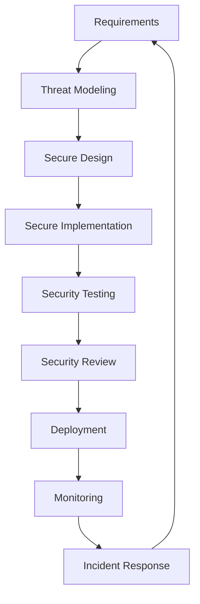

# MediaNest Comprehensive Security Guide

**Version:** 2.0  
**Last Updated:** September 2025  
**Classification:** Internal Documentation  
**Consolidation:** Merged from 6 security documents for unified reference

## Table of Contents

1. [Security Overview](#security-overview)
2. [Security Philosophy & Principles](#security-philosophy--principles)
3. [Threat Model & Risk Assessment](#threat-model--risk-assessment)
4. [Authentication Architecture](#authentication-architecture)
5. [Authorization & Access Control](#authorization--access-control)
6. [Data Protection & Encryption](#data-protection--encryption)
7. [API Security](#api-security)
8. [Network Security](#network-security)
9. [Container Security](#container-security)
10. [Input Validation & Sanitization](#input-validation--sanitization)
11. [CSRF Protection](#csrf-protection)
12. [Session Management](#session-management)
13. [Infrastructure Security](#infrastructure-security)
14. [Monitoring & Incident Response](#monitoring--incident-response)
15. [Security Implementation Checklist](#security-implementation-checklist)
16. [Common Vulnerabilities & Mitigations](#common-vulnerabilities--mitigations)
17. [Compliance & Privacy](#compliance--privacy)
18. [Security Testing](#security-testing)

## Security Overview

MediaNest implements a comprehensive defense-in-depth security strategy designed for a homelab environment serving 10-20 trusted users. The security architecture balances robust protection with practical implementation complexity.

### Security Layers

```
┌─────────────────────────────────────────────────────────────┐
│                    User Interface Layer                    │
│              • Input Validation                            │
│              • XSS Protection                              │
│              • CSRF Tokens                                 │
└─────────────────────────────────────────────────────────────┘
                                │
┌─────────────────────────────────────────────────────────────┐
│                   Transport Layer                          │
│              • HTTPS/TLS 1.3                              │
│              • Certificate Management                      │
│              • Security Headers                            │
└─────────────────────────────────────────────────────────────┘
                                │
┌─────────────────────────────────────────────────────────────┐
│                 Authentication Layer                       │
│              • Multi-Provider OAuth                        │
│              • JWT Token Management                        │
│              • Session Validation                          │
└─────────────────────────────────────────────────────────────┘
                                │
┌─────────────────────────────────────────────────────────────┐
│                 Authorization Layer                        │
│              • Role-Based Access Control                   │
│              • Resource Permissions                        │
│              • API Endpoint Protection                     │
└─────────────────────────────────────────────────────────────┘
                                │
┌─────────────────────────────────────────────────────────────┐
│                  Application Layer                         │
│              • Rate Limiting                               │
│              • Input Sanitization                          │
│              • Business Logic Security                     │
└─────────────────────────────────────────────────────────────┘
                                │
┌─────────────────────────────────────────────────────────────┐
│                     Data Layer                             │
│              • Encryption at Rest                          │
│              • Database Security                           │
│              • Backup Encryption                           │
└─────────────────────────────────────────────────────────────┘
                                │
┌─────────────────────────────────────────────────────────────┐
│                Infrastructure Layer                        │
│              • Container Isolation                         │
│              • Network Segmentation                        │
│              • System Hardening                            │
└─────────────────────────────────────────────────────────────┘
```

### Security Objectives

**Primary Objectives:**

1. **Confidentiality**: Protect user data and authentication tokens
2. **Integrity**: Ensure data accuracy and prevent unauthorized modifications
3. **Availability**: Maintain service availability against attacks
4. **Authentication**: Verify user identities reliably
5. **Authorization**: Control access to resources appropriately

**Secondary Objectives:**

- **Auditability**: Log security events for analysis
- **Non-repudiation**: Maintain accountability for actions
- **Privacy**: Protect user personal information
- **Compliance**: Meet security standards and regulations

## Security Philosophy & Principles

### Core Security Principles

**1. Defense in Depth**

- Multiple security layers to prevent single points of failure
- Each layer provides independent protection
- Layered approach increases attack complexity

**2. Principle of Least Privilege**

- Users receive minimum necessary permissions
- Services operate with minimal required access
- Regular privilege reviews and updates

**3. Security by Design**

- Security considerations integrated from design phase
- Secure defaults for all configurations
- Proactive rather than reactive security measures

**4. Zero Trust Architecture**

- Never trust, always verify
- Continuous verification of users and devices
- Micro-segmentation of network and resources

**5. Fail Secure**

- System fails to secure state when errors occur
- Default deny policies
- Graceful degradation with maintained security

### Security Development Lifecycle



**Phase Descriptions:**

- **Requirements**: Security requirements definition
- **Threat Modeling**: Risk assessment and mitigation planning
- **Secure Design**: Architecture with security controls
- **Secure Implementation**: Coding with security best practices
- **Security Testing**: Vulnerability assessment and testing
- **Security Review**: Code and configuration review
- **Deployment**: Secure deployment practices
- **Monitoring**: Continuous security monitoring
- **Incident Response**: Security incident handling

## Threat Model & Risk Assessment

### Threat Landscape

**External Threats:**

- **Unauthorized Access**: External attackers attempting system access
- **Data Exfiltration**: Attempts to steal user data or content
- **DDoS Attacks**: Service disruption through traffic floods
- **Malware Injection**: Attempts to inject malicious code
- **Social Engineering**: Attacks targeting users directly

**Internal Threats:**

- **Privilege Escalation**: Users attempting to gain higher privileges
- **Data Misuse**: Authorized users accessing inappropriate data
- **Configuration Errors**: Misconfigurations creating vulnerabilities
- **Insider Threats**: Malicious actions by trusted users

**Environmental Threats:**

- **Infrastructure Failures**: Hardware or network failures
- **Third-Party Breaches**: Compromised external services
- **Supply Chain Attacks**: Compromised dependencies
- **Physical Security**: Physical access to servers

### Risk Assessment Matrix

| Threat Category           | Likelihood | Impact | Risk Level | Mitigation Priority |
| ------------------------- | ---------- | ------ | ---------- | ------------------- |
| **Authentication Bypass** | Medium     | High   | High       | Critical            |
| **Data Exfiltration**     | Low        | High   | Medium     | High                |
| **DDoS Attack**           | Medium     | Medium | Medium     | Medium              |
| **SQL Injection**         | Low        | High   | Medium     | High                |
| **XSS Attack**            | Medium     | Medium | Medium     | Medium              |
| **CSRF Attack**           | Medium     | Medium | Medium     | Medium              |
| **Privilege Escalation**  | Low        | High   | Medium     | High                |
| **Third-Party Breach**    | Medium     | Medium | Medium     | Medium              |

### Attack Vectors

**Web Application Attacks:**

- SQL Injection attempts
- Cross-Site Scripting (XSS)
- Cross-Site Request Forgery (CSRF)
- Session hijacking
- Authentication bypass

**Network Attacks:**

- Man-in-the-middle attacks
- Traffic interception
- Port scanning
- Service enumeration

**Infrastructure Attacks:**

- Container escape
- Privilege escalation
- File system attacks
- Configuration exploitation

## Authentication Architecture

### Multi-Provider OAuth Implementation

**Supported Providers:**

1. **Plex OAuth** (Primary)
2. **Google OAuth** (Secondary)
3. **GitHub OAuth** (Development)

### Plex OAuth Flow Implementation

```typescript
class PlexAuthService {
  // Initialize OAuth flow
  async initializeAuth(clientIdentifier: string): Promise<AuthInitResponse> {
    const pin = await this.requestPlexPin();
    const authUrl = this.buildAuthUrl(pin.id, clientIdentifier);

    // Store PIN state in Redis with expiration
    await this.redis.setex(
      `plex_pin:${pin.id}`,
      600, // 10 minutes
      JSON.stringify({ pin, clientIdentifier, timestamp: Date.now() })
    );

    return {
      authUrl,
      pinId: pin.id,
      expiresIn: 600,
    };
  }

  // Verify PIN and complete authentication
  async verifyPin(pinId: string): Promise<AuthResult> {
    const pinData = await this.redis.get(`plex_pin:${pinId}`);
    if (!pinData) {
      throw new AuthenticationError('PIN expired or invalid');
    }

    const { pin } = JSON.parse(pinData);
    const authToken = await this.checkPinStatus(pin.id);

    if (!authToken) {
      throw new AuthenticationError('PIN not yet authorized');
    }

    // Verify token with Plex and get user info
    const userInfo = await this.getPlexUserInfo(authToken);
    const user = await this.createOrUpdateUser(userInfo);

    // Generate JWT tokens
    const tokens = await this.generateTokens(user);

    // Clean up PIN data
    await this.redis.del(`plex_pin:${pinId}`);

    return { user, tokens };
  }
}
```

### JWT Token Architecture

**Token Structure:**

```typescript
interface JWTPayload {
  // Standard claims
  sub: string; // Subject (user ID)
  iat: number; // Issued at
  exp: number; // Expiration
  iss: string; // Issuer
  aud: string; // Audience

  // Custom claims
  userId: string; // User identifier
  email: string; // User email
  role: UserRole; // User role
  sessionId: string; // Session identifier
  deviceId: string; // Device identifier
  plexId?: string; // Plex user ID (optional)
  permissions: string[]; // User permissions
}
```

**Token Types:**

**Access Token:**

- Short-lived (15 minutes)
- Contains user identity and permissions
- Used for API authentication
- Stored in httpOnly secure cookie

**Refresh Token:**

- Long-lived (7 days)
- Used to generate new access tokens
- Single-use with rotation
- Stored in httpOnly secure cookie

**Device Token:**

- Persistent device identification
- Used for trusted device recognition
- Long-lived (30 days)
- Enables "remember this device" functionality

### Token Security Measures

**Token Generation:**

```typescript
class JWTService {
  private readonly accessTokenSecret: string;
  private readonly refreshTokenSecret: string;

  async generateAccessToken(payload: JWTPayload): Promise<string> {
    // Add security claims
    const securePayload = {
      ...payload,
      jti: uuidv4(), // Unique token ID
      iat: Math.floor(Date.now() / 1000),
      exp: Math.floor(Date.now() / 1000) + 15 * 60, // 15 minutes
      iss: 'medianest-api',
      aud: 'medianest-client',
    };

    return jwt.sign(securePayload, this.accessTokenSecret, {
      algorithm: 'HS256',
    });
  }

  async verifyToken(token: string, type: 'access' | 'refresh'): Promise<JWTPayload> {
    const secret = type === 'access' ? this.accessTokenSecret : this.refreshTokenSecret;

    try {
      const decoded = jwt.verify(token, secret) as JWTPayload;

      // Verify token hasn't been revoked
      const isRevoked = await this.isTokenRevoked(decoded.jti);
      if (isRevoked) {
        throw new AuthenticationError('Token has been revoked');
      }

      return decoded;
    } catch (error) {
      throw new AuthenticationError('Invalid token');
    }
  }
}
```

**Token Rotation:**

```typescript
class TokenRotationService {
  async rotateRefreshToken(currentToken: string): Promise<TokenPair> {
    // Verify current refresh token
    const decoded = await this.jwtService.verifyToken(currentToken, 'refresh');

    // Mark current token as used
    await this.markTokenAsUsed(decoded.jti);

    // Generate new token pair
    const newAccessToken = await this.jwtService.generateAccessToken(decoded);
    const newRefreshToken = await this.jwtService.generateRefreshToken(decoded);

    // Store new refresh token
    await this.storeRefreshToken(decoded.userId, newRefreshToken);

    return {
      accessToken: newAccessToken,
      refreshToken: newRefreshToken,
    };
  }
}
```

## Authorization & Access Control

### Role-Based Access Control (RBAC)

**User Roles:**

| Role        | Description            | Permissions                                        |
| ----------- | ---------------------- | -------------------------------------------------- |
| **Admin**   | System administrator   | Full system access, user management, configuration |
| **User**    | Regular user           | Personal content access, playlist management       |
| **Guest**   | Limited access user    | Public content only (if enabled)                   |
| **Service** | System service account | Specific service permissions                       |

**Permission Matrix:**

| Resource                 | Admin | User | Guest | Service |
| ------------------------ | ----- | ---- | ----- | ------- |
| **User Management**      | ✅    | ❌   | ❌    | ❌      |
| **System Configuration** | ✅    | ❌   | ❌    | ❌      |
| **Personal Content**     | ✅    | ✅   | ❌    | ❌      |
| **Public Content**       | ✅    | ✅   | ✅    | ❌      |
| **Playlists**            | ✅    | ✅   | ❌    | ❌      |
| **System APIs**          | ✅    | ❌   | ❌    | ✅      |

### Permission System Implementation

```typescript
// Permission definitions
enum Permission {
  // User management
  USER_CREATE = 'user:create',
  USER_READ = 'user:read',
  USER_UPDATE = 'user:update',
  USER_DELETE = 'user:delete',

  // Content management
  CONTENT_READ = 'content:read',
  CONTENT_UPLOAD = 'content:upload',
  CONTENT_DELETE = 'content:delete',

  // Playlist management
  PLAYLIST_CREATE = 'playlist:create',
  PLAYLIST_READ = 'playlist:read',
  PLAYLIST_UPDATE = 'playlist:update',
  PLAYLIST_DELETE = 'playlist:delete',

  // System administration
  SYSTEM_CONFIG = 'system:config',
  SYSTEM_LOGS = 'system:logs',
  SYSTEM_STATS = 'system:stats',
}

// Role permission mapping
const ROLE_PERMISSIONS: Record<UserRole, Permission[]> = {
  admin: [
    Permission.USER_CREATE,
    Permission.USER_READ,
    Permission.USER_UPDATE,
    Permission.USER_DELETE,
    Permission.CONTENT_READ,
    Permission.CONTENT_UPLOAD,
    Permission.CONTENT_DELETE,
    Permission.PLAYLIST_CREATE,
    Permission.PLAYLIST_READ,
    Permission.PLAYLIST_UPDATE,
    Permission.PLAYLIST_DELETE,
    Permission.SYSTEM_CONFIG,
    Permission.SYSTEM_LOGS,
    Permission.SYSTEM_STATS,
  ],
  user: [
    Permission.CONTENT_READ,
    Permission.CONTENT_UPLOAD,
    Permission.PLAYLIST_CREATE,
    Permission.PLAYLIST_READ,
    Permission.PLAYLIST_UPDATE,
    Permission.PLAYLIST_DELETE,
  ],
  guest: [Permission.CONTENT_READ],
};

// Authorization middleware
const authorize = (requiredPermission: Permission) => {
  return (req: AuthenticatedRequest, res: Response, next: NextFunction) => {
    const userPermissions = ROLE_PERMISSIONS[req.user.role] || [];

    if (!userPermissions.includes(requiredPermission)) {
      return res.status(403).json({
        success: false,
        error: {
          code: 'INSUFFICIENT_PERMISSIONS',
          message: 'You do not have permission to perform this action',
          requiredPermission,
        },
      });
    }

    next();
  };
};
```

### Resource-Level Authorization

```typescript
// Resource ownership authorization
const authorizeResource = (resourceType: string) => {
  return async (req: AuthenticatedRequest, res: Response, next: NextFunction) => {
    const resourceId = req.params.id;
    const userId = req.user.userId;

    try {
      const resource = await getResource(resourceType, resourceId);

      if (!resource) {
        return res.status(404).json({
          success: false,
          error: { code: 'RESOURCE_NOT_FOUND', message: 'Resource not found' },
        });
      }

      // Check ownership or admin role
      if (resource.userId !== userId && req.user.role !== 'admin') {
        return res.status(403).json({
          success: false,
          error: { code: 'ACCESS_DENIED', message: 'Access denied to resource' },
        });
      }

      req.resource = resource;
      next();
    } catch (error) {
      next(error);
    }
  };
};
```

## Data Protection & Encryption

### Encryption Strategy

**Encryption at Rest:**

- Database: PostgreSQL with encryption
- File system: Encrypted volumes
- Backups: AES-256 encrypted archives
- Configuration: Encrypted environment variables

**Encryption in Transit:**

- HTTPS/TLS 1.3 for all communication
- Certificate management with Let's Encrypt
- Perfect Forward Secrecy (PFS)
- HSTS (HTTP Strict Transport Security)

**Key Management:**

```typescript
class EncryptionService {
  private readonly algorithm = 'aes-256-gcm';
  private readonly keyDerivationIterations = 100000;

  // Encrypt sensitive data
  async encrypt(data: string, key: Buffer): Promise<EncryptedData> {
    const iv = crypto.randomBytes(16);
    const cipher = crypto.createCipher(this.algorithm, key);
    cipher.setAAD(Buffer.from('medianest-encryption'));

    let encrypted = cipher.update(data, 'utf8', 'hex');
    encrypted += cipher.final('hex');

    const authTag = cipher.getAuthTag();

    return {
      encrypted,
      iv: iv.toString('hex'),
      authTag: authTag.toString('hex'),
    };
  }

  // Decrypt sensitive data
  async decrypt(encryptedData: EncryptedData, key: Buffer): Promise<string> {
    const decipher = crypto.createDecipher(this.algorithm, key);
    decipher.setAAD(Buffer.from('medianest-encryption'));
    decipher.setAuthTag(Buffer.from(encryptedData.authTag, 'hex'));

    let decrypted = decipher.update(encryptedData.encrypted, 'hex', 'utf8');
    decrypted += decipher.final('utf8');

    return decrypted;
  }
}
```

### Sensitive Data Handling

**Data Classification:**

| Classification   | Examples                          | Protection Level          |
| ---------------- | --------------------------------- | ------------------------- |
| **Public**       | API documentation, public content | Standard HTTPS            |
| **Internal**     | System logs, configuration        | Encryption at rest        |
| **Confidential** | User data, authentication tokens  | Full encryption           |
| **Restricted**   | Admin credentials, secrets        | Hardware security modules |

**Data Sanitization:**

```typescript
class DataSanitizer {
  // Remove sensitive data from logs
  sanitizeForLogging(data: any): any {
    const sensitiveKeys = [
      'password',
      'token',
      'secret',
      'key',
      'authorization',
      'cookie',
      'session',
      'auth',
      'credential',
    ];

    return this.recursiveSanitize(data, sensitiveKeys);
  }

  // Sanitize user input
  sanitizeUserInput(input: string): string {
    return validator
      .escape(input)
      .replace(/<script\b[^<]*(?:(?!<\/script>)<[^<]*)*<\/script>/gi, '')
      .trim();
  }

  // Clean email addresses
  sanitizeEmail(email: string): string {
    return validator.normalizeEmail(email.toLowerCase().trim());
  }
}
```

## API Security

### API Security Headers

**Security Headers Implementation:**

```typescript
const securityHeaders = {
  // Prevent XSS attacks
  'X-Content-Type-Options': 'nosniff',
  'X-Frame-Options': 'DENY',
  'X-XSS-Protection': '1; mode=block',

  // Content Security Policy
  'Content-Security-Policy': [
    "default-src 'self'",
    "script-src 'self' 'unsafe-inline'",
    "style-src 'self' 'unsafe-inline'",
    "img-src 'self' data: https:",
    "font-src 'self'",
    "connect-src 'self'",
    "frame-ancestors 'none'",
  ].join('; '),

  // HTTPS enforcement
  'Strict-Transport-Security': 'max-age=31536000; includeSubDomains',

  // Referrer policy
  'Referrer-Policy': 'strict-origin-when-cross-origin',

  // Permissions policy
  'Permissions-Policy': ['camera=()', 'microphone=()', 'geolocation=()', 'payment=()'].join(', '),
};
```

### Rate Limiting Implementation

**Advanced Rate Limiting:**

```typescript
class RateLimiter {
  private redis: Redis;

  // Token bucket rate limiting
  async isAllowed(
    identifier: string,
    limit: number,
    window: number,
    burst?: number
  ): Promise<RateLimitResult> {
    const key = `rate_limit:${identifier}`;
    const now = Date.now();
    const windowStart = now - window * 1000;

    // Use Redis pipeline for atomic operations
    const pipeline = this.redis.pipeline();

    // Remove old entries
    pipeline.zremrangebyscore(key, '-inf', windowStart);

    // Count current requests
    pipeline.zcard(key);

    // Add current request
    pipeline.zadd(key, now, `${now}-${Math.random()}`);

    // Set expiration
    pipeline.expire(key, window);

    const results = await pipeline.exec();
    const currentRequests = results[1][1] as number;

    const allowed = currentRequests < limit;
    const remaining = Math.max(0, limit - currentRequests - 1);

    return {
      allowed,
      limit,
      remaining,
      resetTime: windowStart + window * 1000,
    };
  }

  // Sliding window rate limiting
  async slidingWindowCheck(
    identifier: string,
    limit: number,
    windowSize: number
  ): Promise<boolean> {
    const key = `sliding:${identifier}`;
    const now = Date.now();
    const windowStart = now - windowSize;

    const current = await this.redis.zcount(key, windowStart, '+inf');

    if (current < limit) {
      await this.redis.zadd(key, now, now);
      await this.redis.expire(key, Math.ceil(windowSize / 1000));
      return true;
    }

    return false;
  }
}
```

### Input Validation & Sanitization

**Comprehensive Input Validation:**

```typescript
// Validation schemas using Zod
const userRegistrationSchema = z.object({
  email: z.string().email().max(255),
  password: z
    .string()
    .min(8)
    .regex(/^(?=.*[a-z])(?=.*[A-Z])(?=.*\d)(?=.*[@$!%*?&])[A-Za-z\d@$!%*?&]/)
    .max(128),
  name: z.string().min(1).max(100),
  preferences: z
    .object({
      theme: z.enum(['light', 'dark']),
      language: z.string().length(2),
    })
    .optional(),
});

const apiKeySchema = z.object({
  name: z.string().min(1).max(50),
  permissions: z.array(z.enum(Object.values(Permission))),
  expiresIn: z.number().min(3600).max(31536000), // 1 hour to 1 year
});

// Validation middleware
const validate = <T>(schema: z.ZodSchema<T>) => {
  return (req: Request, res: Response, next: NextFunction) => {
    try {
      const validated = schema.parse(req.body);
      req.body = validated;
      next();
    } catch (error) {
      if (error instanceof z.ZodError) {
        return res.status(400).json({
          success: false,
          error: {
            code: 'VALIDATION_ERROR',
            message: 'Invalid request data',
            details: error.errors,
          },
        });
      }
      next(error);
    }
  };
};
```

## CSRF Protection

### CSRF Implementation

**Double Submit Cookie Pattern:**

```typescript
class CSRFProtection {
  private readonly tokenLength = 32;
  private readonly cookieName = 'csrf-token';
  private readonly headerName = 'X-CSRF-Token';

  // Generate CSRF token
  generateToken(): string {
    return crypto.randomBytes(this.tokenLength).toString('hex');
  }

  // CSRF middleware
  middleware() {
    return (req: Request, res: Response, next: NextFunction) => {
      // Skip CSRF for safe methods
      if (['GET', 'HEAD', 'OPTIONS'].includes(req.method)) {
        return next();
      }

      // Skip CSRF for API authentication (JWT-based)
      if (req.headers.authorization) {
        return next();
      }

      const cookieToken = req.cookies[this.cookieName];
      const headerToken = req.headers[this.headerName] as string;

      if (!cookieToken || !headerToken || cookieToken !== headerToken) {
        return res.status(403).json({
          success: false,
          error: {
            code: 'CSRF_TOKEN_INVALID',
            message: 'Invalid CSRF token',
          },
        });
      }

      next();
    };
  }

  // Set CSRF cookie
  setCsrfCookie(res: Response): void {
    const token = this.generateToken();
    res.cookie(this.cookieName, token, {
      httpOnly: false, // Accessible to JavaScript
      secure: process.env.NODE_ENV === 'production',
      sameSite: 'strict',
      maxAge: 3600000, // 1 hour
    });
  }
}
```

**SameSite Cookie Configuration:**

```typescript
const cookieOptions = {
  httpOnly: true,
  secure: process.env.NODE_ENV === 'production',
  sameSite: 'strict' as const,
  domain: process.env.COOKIE_DOMAIN,
  path: '/',
  maxAge: 7 * 24 * 60 * 60 * 1000, // 7 days
};

// Set secure cookies
app.use(cookieParser());
app.use((req, res, next) => {
  res.cookie = (name: string, value: string, options?: any) => {
    return res.cookie(name, value, { ...cookieOptions, ...options });
  };
  next();
});
```

## Session Management

### Session Architecture

**Session Storage Strategy:**

```typescript
class SessionManager {
  private redis: Redis;
  private readonly sessionTTL = 7 * 24 * 60 * 60; // 7 days

  // Create session
  async createSession(userId: string, deviceInfo: DeviceInfo): Promise<Session> {
    const sessionId = uuidv4();
    const deviceId = this.generateDeviceId(deviceInfo);

    const session: Session = {
      id: sessionId,
      userId,
      deviceId,
      deviceInfo,
      createdAt: new Date(),
      lastAccessedAt: new Date(),
      expiresAt: new Date(Date.now() + this.sessionTTL * 1000),
    };

    // Store session in Redis
    await this.redis.setex(`session:${sessionId}`, this.sessionTTL, JSON.stringify(session));

    // Track user sessions
    await this.redis.sadd(`user_sessions:${userId}`, sessionId);

    return session;
  }

  // Validate session
  async validateSession(sessionId: string): Promise<Session | null> {
    const sessionData = await this.redis.get(`session:${sessionId}`);

    if (!sessionData) {
      return null;
    }

    const session: Session = JSON.parse(sessionData);

    // Check expiration
    if (new Date() > session.expiresAt) {
      await this.destroySession(sessionId);
      return null;
    }

    // Update last access time
    session.lastAccessedAt = new Date();
    await this.redis.setex(`session:${sessionId}`, this.sessionTTL, JSON.stringify(session));

    return session;
  }

  // Destroy session
  async destroySession(sessionId: string): Promise<void> {
    const sessionData = await this.redis.get(`session:${sessionId}`);

    if (sessionData) {
      const session: Session = JSON.parse(sessionData);
      await this.redis.srem(`user_sessions:${session.userId}`, sessionId);
    }

    await this.redis.del(`session:${sessionId}`);
  }

  // Destroy all user sessions
  async destroyAllUserSessions(userId: string): Promise<void> {
    const sessionIds = await this.redis.smembers(`user_sessions:${userId}`);

    if (sessionIds.length > 0) {
      const pipeline = this.redis.pipeline();
      sessionIds.forEach((sessionId) => {
        pipeline.del(`session:${sessionId}`);
      });
      pipeline.del(`user_sessions:${userId}`);
      await pipeline.exec();
    }
  }
}
```

### Device Recognition

```typescript
class DeviceRecognition {
  // Generate device fingerprint
  generateDeviceFingerprint(req: Request): string {
    const components = [
      req.headers['user-agent'] || '',
      req.headers['accept-language'] || '',
      req.headers['accept-encoding'] || '',
      req.connection.remoteAddress || '',
      req.headers['x-forwarded-for'] || '',
    ];

    return crypto.createHash('sha256').update(components.join('|')).digest('hex');
  }

  // Trusted device management
  async markDeviceAsTrusted(userId: string, deviceId: string): Promise<void> {
    const trustedDevice: TrustedDevice = {
      userId,
      deviceId,
      trustedAt: new Date(),
      lastSeenAt: new Date(),
    };

    await this.redis.setex(
      `trusted_device:${userId}:${deviceId}`,
      30 * 24 * 60 * 60, // 30 days
      JSON.stringify(trustedDevice)
    );
  }

  // Check if device is trusted
  async isDeviceTrusted(userId: string, deviceId: string): Promise<boolean> {
    const deviceData = await this.redis.get(`trusted_device:${userId}:${deviceId}`);
    return !!deviceData;
  }
}
```

## Network Security

### TLS Configuration

**Nginx TLS Configuration:**

```nginx
server {
    listen 443 ssl http2;
    server_name media.yourdomain.com;

    # SSL Configuration
    ssl_certificate /etc/letsencrypt/live/media.yourdomain.com/fullchain.pem;
    ssl_certificate_key /etc/letsencrypt/live/media.yourdomain.com/privkey.pem;

    # Modern TLS configuration
    ssl_protocols TLSv1.2 TLSv1.3;
    ssl_ciphers ECDHE-ECDSA-AES128-GCM-SHA256:ECDHE-RSA-AES128-GCM-SHA256:ECDHE-ECDSA-AES256-GCM-SHA384:ECDHE-RSA-AES256-GCM-SHA384;
    ssl_prefer_server_ciphers off;

    # HSTS
    add_header Strict-Transport-Security "max-age=63072000" always;

    # OCSP stapling
    ssl_stapling on;
    ssl_stapling_verify on;

    # Security headers
    add_header X-Frame-Options DENY always;
    add_header X-Content-Type-Options nosniff always;
    add_header X-XSS-Protection "1; mode=block" always;
    add_header Referrer-Policy "strict-origin-when-cross-origin" always;

    # CSP header
    add_header Content-Security-Policy "default-src 'self'; script-src 'self' 'unsafe-inline'; style-src 'self' 'unsafe-inline'; img-src 'self' data: https:; font-src 'self'; connect-src 'self'; frame-ancestors 'none';" always;
}
```

### Firewall Configuration

**UFW Firewall Rules:**

```bash
# Basic firewall setup
ufw --force reset
ufw default deny incoming
ufw default allow outgoing

# SSH access
ufw allow 22/tcp

# HTTP/HTTPS
ufw allow 80/tcp
ufw allow 443/tcp

# Rate limiting for SSH
ufw limit ssh

# Enable firewall
ufw --force enable
```

**Application-Level IP Filtering:**

```typescript
class IPFilter {
  private allowedIPs: Set<string>;
  private blockedIPs: Set<string>;

  constructor() {
    this.loadIPLists();
  }

  // Check if IP is allowed
  isAllowed(ip: string): boolean {
    // Check if explicitly blocked
    if (this.blockedIPs.has(ip)) {
      return false;
    }

    // Check if in allowed list (if whitelist is used)
    if (this.allowedIPs.size > 0 && !this.allowedIPs.has(ip)) {
      return false;
    }

    // Check against known threat lists
    if (this.isThreatIP(ip)) {
      return false;
    }

    return true;
  }

  // Middleware for IP filtering
  middleware() {
    return (req: Request, res: Response, next: NextFunction) => {
      const clientIP = this.getClientIP(req);

      if (!this.isAllowed(clientIP)) {
        return res.status(403).json({
          success: false,
          error: {
            code: 'IP_BLOCKED',
            message: 'Access denied from this IP address',
          },
        });
      }

      next();
    };
  }

  private getClientIP(req: Request): string {
    return (
      (req.headers['x-forwarded-for'] as string)?.split(',')[0].trim() ||
      req.connection.remoteAddress ||
      req.socket.remoteAddress ||
      ''
    );
  }
}
```

## Container Security

### Docker Security Hardening

**Dockerfile Security Best Practices:**

```dockerfile
# Use specific version tags
FROM node:20.11.0-alpine AS builder

# Create non-root user
RUN addgroup -g 1001 -S nodejs
RUN adduser -S medianest -u 1001

# Set working directory
WORKDIR /app

# Copy package files
COPY package*.json ./

# Install dependencies
RUN npm ci --only=production && npm cache clean --force

# Copy application code
COPY --chown=medianest:nodejs . .

# Build application
RUN npm run build

# Production image
FROM node:20.11.0-alpine AS production

# Install security updates
RUN apk upgrade --no-cache

# Create non-root user
RUN addgroup -g 1001 -S nodejs
RUN adduser -S medianest -u 1001

# Set working directory
WORKDIR /app

# Copy built application
COPY --from=builder --chown=medianest:nodejs /app/dist ./dist
COPY --from=builder --chown=medianest:nodejs /app/node_modules ./node_modules
COPY --from=builder --chown=medianest:nodejs /app/package.json ./package.json

# Switch to non-root user
USER medianest

# Health check
HEALTHCHECK --interval=30s --timeout=3s --start-period=5s --retries=3 \
  CMD curl -f http://localhost:4000/health || exit 1

# Expose port
EXPOSE 4000

# Start application
CMD ["npm", "start"]
```

**Docker Compose Security:**

```yaml
version: '3.8'
services:
  backend:
    build: .
    security_opt:
      - no-new-privileges:true
    cap_drop:
      - ALL
    cap_add:
      - NET_BIND_SERVICE
    read_only: true
    tmpfs:
      - /tmp:noexec,nosuid,size=100m
    volumes:
      - type: volume
        source: app_data
        target: /app/data
        read_only: false
    networks:
      - app_network
    deploy:
      resources:
        limits:
          cpus: '1.0'
          memory: 512M
        reservations:
          cpus: '0.5'
          memory: 256M

networks:
  app_network:
    driver: bridge
    ipam:
      config:
        - subnet: 172.20.0.0/16
```

### Container Runtime Security

**Runtime Security Monitoring:**

```typescript
class ContainerSecurity {
  // Monitor container health
  async checkContainerHealth(): Promise<SecurityStatus> {
    const containers = await docker.listContainers();
    const issues: SecurityIssue[] = [];

    for (const container of containers) {
      // Check for running as root
      if (container.User === 'root') {
        issues.push({
          type: 'ROOT_USER',
          container: container.Names[0],
          severity: 'HIGH',
        });
      }

      // Check for privileged mode
      if (container.HostConfig?.Privileged) {
        issues.push({
          type: 'PRIVILEGED_MODE',
          container: container.Names[0],
          severity: 'CRITICAL',
        });
      }

      // Check resource limits
      if (!container.HostConfig?.Memory) {
        issues.push({
          type: 'NO_MEMORY_LIMIT',
          container: container.Names[0],
          severity: 'MEDIUM',
        });
      }
    }

    return {
      status: issues.length === 0 ? 'SECURE' : 'VULNERABLE',
      issues,
    };
  }
}
```

## Monitoring & Incident Response

### Security Monitoring

**Security Event Logging:**

```typescript
class SecurityLogger {
  private logger: winston.Logger;

  constructor() {
    this.logger = winston.createLogger({
      level: 'info',
      format: winston.format.combine(
        winston.format.timestamp(),
        winston.format.errors({ stack: true }),
        winston.format.json()
      ),
      defaultMeta: { service: 'medianest-security' },
      transports: [
        new winston.transports.File({
          filename: 'logs/security.log',
          level: 'warn',
        }),
        new winston.transports.Console({
          format: winston.format.simple(),
        }),
      ],
    });
  }

  logAuthenticationEvent(event: AuthEvent): void {
    this.logger.info('Authentication Event', {
      type: event.type,
      userId: event.userId,
      ip: event.ip,
      userAgent: event.userAgent,
      success: event.success,
      timestamp: event.timestamp,
    });
  }

  logSecurityIncident(incident: SecurityIncident): void {
    this.logger.warn('Security Incident', {
      type: incident.type,
      severity: incident.severity,
      description: incident.description,
      ip: incident.ip,
      userId: incident.userId,
      timestamp: incident.timestamp,
    });
  }

  logAccessAttempt(attempt: AccessAttempt): void {
    this.logger.info('Access Attempt', {
      resource: attempt.resource,
      userId: attempt.userId,
      ip: attempt.ip,
      allowed: attempt.allowed,
      reason: attempt.reason,
      timestamp: attempt.timestamp,
    });
  }
}
```

**Anomaly Detection:**

```typescript
class AnomalyDetector {
  private redis: Redis;

  // Detect suspicious login patterns
  async detectSuspiciousLogins(userId: string, ip: string): Promise<boolean> {
    const key = `login_attempts:${userId}`;
    const now = Date.now();
    const window = 3600000; // 1 hour

    // Add current attempt
    await this.redis.zadd(key, now, `${ip}:${now}`);

    // Clean old attempts
    await this.redis.zremrangebyscore(key, '-inf', now - window);

    // Check for multiple IPs
    const attempts = await this.redis.zrange(key, 0, -1);
    const uniqueIPs = new Set(attempts.map((attempt) => attempt.split(':')[0]));

    // Alert if more than 3 different IPs in 1 hour
    if (uniqueIPs.size > 3) {
      await this.triggerSecurityAlert({
        type: 'SUSPICIOUS_LOGIN_PATTERN',
        userId,
        details: { uniqueIPs: uniqueIPs.size, window: '1 hour' },
      });
      return true;
    }

    return false;
  }

  // Detect brute force attacks
  async detectBruteForce(ip: string): Promise<boolean> {
    const key = `failed_attempts:${ip}`;
    const failures = await this.redis.incr(key);

    if (failures === 1) {
      await this.redis.expire(key, 900); // 15 minutes
    }

    if (failures > 10) {
      await this.triggerSecurityAlert({
        type: 'BRUTE_FORCE_ATTACK',
        ip,
        details: { attempts: failures },
      });
      return true;
    }

    return false;
  }
}
```

### Incident Response

**Automated Incident Response:**

```typescript
class IncidentResponse {
  // Handle security incidents
  async handleIncident(incident: SecurityIncident): Promise<void> {
    switch (incident.type) {
      case 'BRUTE_FORCE_ATTACK':
        await this.handleBruteForceAttack(incident);
        break;

      case 'SUSPICIOUS_LOGIN_PATTERN':
        await this.handleSuspiciousLogin(incident);
        break;

      case 'UNAUTHORIZED_ACCESS_ATTEMPT':
        await this.handleUnauthorizedAccess(incident);
        break;

      default:
        await this.handleGenericIncident(incident);
    }

    // Log incident
    await this.logIncident(incident);

    // Notify administrators if critical
    if (incident.severity === 'CRITICAL') {
      await this.notifyAdministrators(incident);
    }
  }

  private async handleBruteForceAttack(incident: SecurityIncident): Promise<void> {
    // Block IP temporarily
    await this.blockIP(incident.ip, 3600); // 1 hour

    // Increase monitoring for this IP
    await this.addToWatchList(incident.ip);

    // Rate limit more aggressively
    await this.applyStrictRateLimit(incident.ip);
  }

  private async handleSuspiciousLogin(incident: SecurityIncident): Promise<void> {
    // Require additional verification for user
    await this.requireAdditionalVerification(incident.userId);

    // Notify user of suspicious activity
    await this.notifyUser(incident.userId, incident);

    // Review user sessions
    await this.reviewUserSessions(incident.userId);
  }
}
```

## Security Implementation Checklist

### Pre-Production Security Checklist

**Authentication & Authorization:**

- [ ] Multi-provider OAuth implemented (Plex, Google, GitHub)
- [ ] JWT token security measures in place
- [ ] Token rotation implemented
- [ ] Session management configured
- [ ] Role-based access control implemented
- [ ] Permission system configured

**Data Protection:**

- [ ] Encryption at rest configured
- [ ] Encryption in transit enforced (HTTPS/TLS)
- [ ] Sensitive data sanitization implemented
- [ ] Database security hardened
- [ ] Backup encryption configured

**API Security:**

- [ ] Security headers implemented
- [ ] Rate limiting configured
- [ ] Input validation comprehensive
- [ ] CSRF protection enabled
- [ ] API authentication working

**Infrastructure Security:**

- [ ] Container security hardened
- [ ] Network security configured
- [ ] Firewall rules applied
- [ ] SSL certificates configured
- [ ] Security monitoring implemented

**Monitoring & Logging:**

- [ ] Security event logging configured
- [ ] Anomaly detection implemented
- [ ] Incident response procedures defined
- [ ] Log rotation configured
- [ ] Alerting system operational

### Ongoing Security Maintenance

**Daily:**

- Monitor security logs
- Check for failed authentication attempts
- Review system alerts

**Weekly:**

- Security log analysis
- User access review
- System vulnerability scan
- Security metric review

**Monthly:**

- Security audit
- Permission review
- Dependency updates
- Incident response testing

**Quarterly:**

- Comprehensive security assessment
- Penetration testing
- Security policy review
- Disaster recovery testing

## Common Vulnerabilities & Mitigations

### OWASP Top 10 Mitigations

**1. Injection Attacks**

- **Risk**: SQL injection, NoSQL injection, command injection
- **Mitigation**:
  - Parameterized queries with ORM (Prisma)
  - Input validation and sanitization
  - Least privilege database access

**2. Broken Authentication**

- **Risk**: Weak authentication, session management flaws
- **Mitigation**:
  - Strong password policies
  - Multi-factor authentication
  - Secure session management

**3. Sensitive Data Exposure**

- **Risk**: Unencrypted data, weak encryption
- **Mitigation**:
  - Encryption at rest and in transit
  - Proper key management
  - Data classification and handling

**4. XML External Entities (XXE)**

- **Risk**: XML parsing vulnerabilities
- **Mitigation**:
  - Disable external entity processing
  - Input validation for XML data
  - Use safe XML parsers

**5. Broken Access Control**

- **Risk**: Unauthorized access to resources
- **Mitigation**:
  - Implement proper authorization
  - Resource-level access control
  - Regular permission audits

**6. Security Misconfiguration**

- **Risk**: Default configurations, unnecessary features
- **Mitigation**:
  - Secure configuration templates
  - Regular security configuration reviews
  - Automated configuration management

**7. Cross-Site Scripting (XSS)**

- **Risk**: Client-side script injection
- **Mitigation**:
  - Output encoding
  - Content Security Policy (CSP)
  - Input validation and sanitization

**8. Insecure Deserialization**

- **Risk**: Object injection, remote code execution
- **Mitigation**:
  - Avoid deserialization of untrusted data
  - Implement integrity checks
  - Use safe serialization formats (JSON)

**9. Using Components with Known Vulnerabilities**

- **Risk**: Vulnerable dependencies
- **Mitigation**:
  - Regular dependency updates
  - Vulnerability scanning
  - Software composition analysis

**10. Insufficient Logging & Monitoring**

- **Risk**: Undetected breaches, slow incident response
- **Mitigation**:
  - Comprehensive logging strategy
  - Real-time monitoring
  - Automated alerting

### Security Testing Strategy

**Static Application Security Testing (SAST):**

```bash
# ESLint security rules
npm install eslint-plugin-security --save-dev

# Semgrep for security scanning
pip install semgrep
semgrep scan --config=auto .
```

**Dynamic Application Security Testing (DAST):**

```bash
# OWASP ZAP for web application scanning
docker run -v $(pwd):/zap/wrk/:rw \
  -t owasp/zap2docker-stable zap-full-scan.py \
  -t http://localhost:4000 -g gen.conf -r testreport.html
```

**Dependency Scanning:**

```bash
# Audit npm packages
npm audit --audit-level moderate

# Snyk scanning
npx snyk test
npx snyk monitor
```

**Container Security Scanning:**

```bash
# Trivy container scanning
trivy image medianest:latest

# Docker bench security
docker run --rm --net host --pid host --userns host --cap-add audit_control \
  -e DOCKER_CONTENT_TRUST=$DOCKER_CONTENT_TRUST \
  -v /etc:/etc:ro \
  -v /usr/bin/docker-containerd:/usr/bin/docker-containerd:ro \
  -v /usr/bin/runc:/usr/bin/runc:ro \
  -v /usr/lib/systemd:/usr/lib/systemd:ro \
  -v /var/lib:/var/lib:ro \
  -v /var/run/docker.sock:/var/run/docker.sock:ro \
  --label docker_bench_security \
  docker/docker-bench-security
```

---

**Last Updated:** September 7, 2025  
**Document Version:** 2.0  
**Consolidation Note:** This guide combines content from 6 previously separate security documents for unified reference.

For implementation details, see:

- [API Reference](./COMPREHENSIVE_API_REFERENCE.md)
- [Architecture Guide](./COMPREHENSIVE_ARCHITECTURE_GUIDE.md)
- [Deployment Guide](./COMPREHENSIVE_DEPLOYMENT_GUIDE.md)
