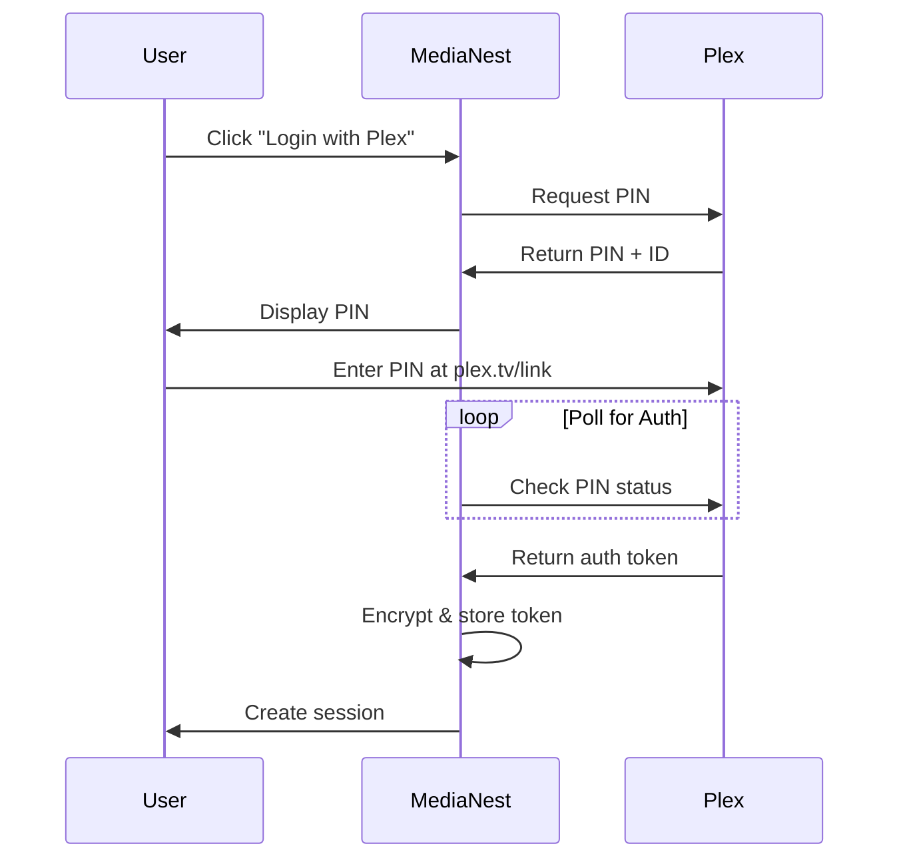

# MediaNest Security Architecture & Strategy

**Version:** 2.0  
**Date:** January 2025  
**Status:** Enhanced - System Architecture Review Complete  
**Document Type:** Security Strategy

## Table of Contents

1. [Executive Summary](#1-executive-summary)
2. [Security Philosophy & Principles](#2-security-philosophy--principles)
3. [Threat Model](#3-threat-model)
4. [Authentication & Authorization](#4-authentication--authorization)
5. [Data Protection & Encryption](#5-data-protection--encryption)
6. [Network Security](#6-network-security)
7. [Container Security](#7-container-security)
8. [API Security](#8-api-security)
9. [Input Validation & Sanitization](#9-input-validation--sanitization)
10. [Monitoring & Incident Response](#10-monitoring--incident-response)
11. [Backup & Recovery](#11-backup--recovery)
12. [Compliance & Privacy](#12-compliance--privacy)
13. [Security Implementation Checklist](#13-security-implementation-checklist)
14. [Future Security Enhancements](#14-future-security-enhancements)

## 1. Executive Summary

MediaNest's security architecture is designed to protect a homelab media management system serving 10-20 trusted users. The strategy balances robust security practices with practical implementation complexity appropriate for a personal server environment.

### Key Security Goals

- **Protect User Data**: Secure authentication tokens, personal information, and media preferences
- **Prevent Unauthorized Access**: Enforce authentication on all endpoints and proper access controls
- **Maintain Service Integrity**: Protect against common web vulnerabilities and service disruptions
- **Enable Safe Integration**: Secure connections to external services (Plex, Overseerr, etc.)
- **Preserve Privacy**: Minimal data collection and GDPR-compliant practices

### Security Approach

- **Defense in Depth**: Multiple security layers from network to application
- **Least Privilege**: Users and services get minimal necessary permissions
- **Security by Default**: Secure configurations out of the box
- **Practical Implementation**: Avoid over-engineering for the homelab context

## 2. Security Philosophy & Principles

### 2.1 Core Principles

1. **Simplicity Over Complexity**

   - Choose well-tested, standard security solutions
   - Avoid custom cryptography or authentication schemes
   - Leverage existing security features in frameworks

2. **Zero Trust Mindset**

   - Authenticate every request
   - Validate all inputs
   - Trust but verify external services

3. **Fail Secure**

   - Default to denying access when uncertain
   - Gracefully degrade functionality when services fail
   - Log security events for analysis

4. **Transparency**
   - Clear security documentation
   - Visible security status to users
   - Open about data collection practices

### 2.2 Risk Acceptance

As a homelab project for trusted users:

- Accept moderate complexity in exchange for better usability
- Focus on protecting against common attacks rather than nation-state actors
- Prioritize preventing accidental data exposure over malicious insider threats

## 3. Threat Model

### 3.1 Assets to Protect

**High Value Assets:**

- Plex authentication tokens
- User session data
- API keys for external services
- Admin credentials
- Personal media preferences and history

**Medium Value Assets:**

- Service configuration data
- Download history
- System logs
- User email addresses

**Low Value Assets:**

- Public media metadata
- Service status information
- Documentation content

### 3.2 Threat Actors

1. **External Attackers** (Primary Concern)

   - Automated scanners and bots
   - Opportunistic hackers
   - Script kiddies

2. **Compromised User Accounts** (Secondary Concern)

   - Phished credentials
   - Malware on user devices
   - Weak passwords

3. **Insider Threats** (Low Concern)
   - Trusted users are friends/family
   - Focus on preventing accidents over malice

### 3.3 Attack Vectors

**Most Likely:**

- Brute force login attempts
- SQL injection attempts
- XSS through user inputs
- Exposed API endpoints
- Vulnerable dependencies

**Less Likely but Possible:**

- CSRF attacks
- Session hijacking
- Man-in-the-middle attacks
- Docker container escapes
- Supply chain attacks

## 4. Authentication & Authorization

### 4.1 Authentication Strategy

#### Primary Authentication: Plex OAuth



#### Implementation Details

- PIN expires after 15 minutes
- Poll Plex API every 5 seconds for authorization
- Store encrypted Plex tokens in database
- Validate token on each sensitive operation

#### Admin Bootstrap

- First-run only: admin/admin credentials
- Force password change on first login
- Store hashed password using bcrypt (cost factor 12)

### 4.2 Session Management

#### JWT Implementation

```javascript
// JWT configuration with secure defaults
const jwtConfig = {
  secret: process.env.JWT_SECRET, // 256-bit random string
  algorithms: ['HS256'],
  expiresIn: '24h',
  issuer: 'medianest',
  audience: 'medianest-users'
};

// Session token structure
{
  sub: userId,
  role: 'user|admin',
  iat: issuedAt,
  exp: expiresAt,
  jti: uniqueTokenId // For revocation
}
```

#### Remember Me Feature

- Generate cryptographically secure token (32 bytes)
- Hash token before database storage
- One-time use with automatic regeneration
- 90-day expiry with sliding window
- Device fingerprinting for additional security

### 4.3 Authorization Model

#### Role-Based Access Control (RBAC)

```typescript
enum Role {
  USER = 'user',
  ADMIN = 'admin',
}

interface Permission {
  resource: string;
  action: string;
  scope: 'own' | 'all';
}

const rolePermissions = {
  user: [
    { resource: 'media_requests', action: 'create', scope: 'own' },
    { resource: 'media_requests', action: 'read', scope: 'own' },
    { resource: 'youtube_downloads', action: 'create', scope: 'own' },
    { resource: 'youtube_downloads', action: 'read', scope: 'own' },
    { resource: 'youtube_downloads', action: 'delete', scope: 'own' },
  ],
  admin: [{ resource: '*', action: '*', scope: 'all' }],
};
```

#### Middleware Implementation

```javascript
export const authorize = (resource, action, scope = 'own') => {
  return async (req, res, next) => {
    const user = req.user;
    const permissions = rolePermissions[user.role];

    const hasPermission = permissions.some(
      (p) =>
        (p.resource === resource || p.resource === '*') &&
        (p.action === action || p.action === '*') &&
        (p.scope === scope || p.scope === 'all')
    );

    if (!hasPermission) {
      return res.status(403).json({
        error: 'Insufficient permissions',
      });
    }

    // For 'own' scope, add user filter
    if (scope === 'own') {
      req.query.userId = user.id;
    }

    next();
  };
};
```

## 5. Data Protection & Encryption

### 5.1 Encryption Strategy

#### At-Rest Encryption

```javascript
// AES-256-GCM implementation for sensitive data
import crypto from 'crypto';

class EncryptionService {
  constructor() {
    this.algorithm = 'aes-256-gcm';
    this.keyDerivation = this.deriveKey();
  }

  deriveKey() {
    const masterKey = process.env.ENCRYPTION_KEY;
    if (!masterKey || masterKey.length < 32) {
      throw new Error('Invalid encryption key');
    }
    return crypto.scryptSync(masterKey, 'medianest-salt', 32);
  }

  encrypt(plaintext) {
    const iv = crypto.randomBytes(16);
    const cipher = crypto.createCipheriv(this.algorithm, this.keyDerivation, iv);

    let encrypted = cipher.update(plaintext, 'utf8', 'hex');
    encrypted += cipher.final('hex');

    const authTag = cipher.getAuthTag();

    return {
      encrypted,
      iv: iv.toString('hex'),
      authTag: authTag.toString('hex'),
    };
  }

  decrypt(encryptedData) {
    const decipher = crypto.createDecipheriv(
      this.algorithm,
      this.keyDerivation,
      Buffer.from(encryptedData.iv, 'hex')
    );

    decipher.setAuthTag(Buffer.from(encryptedData.authTag, 'hex'));

    let decrypted = decipher.update(encryptedData.encrypted, 'hex', 'utf8');
    decrypted += decipher.final('utf8');

    return decrypted;
  }
}
```

#### What to Encrypt

- Plex authentication tokens
- External service API keys
- User session tokens in database
- Sensitive configuration values

#### In-Transit Encryption

- TLS 1.2+ for all external connections
- Let's Encrypt certificates with auto-renewal
- HSTS headers with 1-year max-age
- Secure WebSocket connections (wss://)

### 5.2 Key Management

#### Development Environment

```bash
# Generate secure keys
openssl rand -hex 32 > .env.ENCRYPTION_KEY
openssl rand -hex 32 > .env.JWT_SECRET
```

#### Production Environment

```yaml
# docker-compose.yml
secrets:
  encryption_key:
    file: ./secrets/encryption_key
  jwt_secret:
    file: ./secrets/jwt_secret

services:
  app:
    secrets:
      - encryption_key
      - jwt_secret
```

### 5.3 Password Security

```javascript
// Bcrypt configuration for admin password
const bcryptConfig = {
  saltRounds: 12, // 2^12 iterations
  maxLength: 72, // Bcrypt limitation
};

// Password requirements
const passwordPolicy = {
  minLength: 12,
  requireUppercase: true,
  requireLowercase: true,
  requireNumbers: true,
  requireSpecial: true,
  preventCommon: true, // Check against common passwords list
};
```

## 6. Network Security

### 6.1 Network Architecture

```
┌─────────────────────────────────────────────────┐
│                 Internet                         │
└─────────────────┬───────────────────────────────┘
                  │
            ┌─────▼─────┐
            │  Router   │
            │ Firewall  │
            └─────┬─────┘
                  │
         ┌────────┴────────┐
         │   DMZ Network   │
         │  172.16.0.0/24  │
         └────────┬────────┘
                  │
            ┌─────▼─────┐
            │   Nginx   │
            │  Reverse  │
            │   Proxy   │
            └─────┬─────┘
                  │
         ┌────────┴────────┐
         │ Docker Network  │
         │  172.17.0.0/16  │
         └────────┬────────┘
                  │
      ┌───────────┼───────────┐
      │           │           │
┌─────▼─────┐ ┌──▼──┐ ┌──────▼──────┐
│ MediaNest │ │Redis│ │ PostgreSQL  │
│    App    │ │Cache│ │  Database   │
└───────────┘ └─────┘ └─────────────┘
```

### 6.2 Firewall Rules

```bash
# Inbound rules (iptables)
# Allow SSH (restricted to management IP)
iptables -A INPUT -p tcp --dport 22 -s 192.168.1.0/24 -j ACCEPT

# Allow HTTP/HTTPS
iptables -A INPUT -p tcp --dport 80 -j ACCEPT
iptables -A INPUT -p tcp --dport 443 -j ACCEPT

# Allow established connections
iptables -A INPUT -m state --state ESTABLISHED,RELATED -j ACCEPT

# Drop everything else
iptables -A INPUT -j DROP

# Outbound rules
# Allow DNS
iptables -A OUTPUT -p udp --dport 53 -j ACCEPT
iptables -A OUTPUT -p tcp --dport 53 -j ACCEPT

# Allow HTTPS for external APIs
iptables -A OUTPUT -p tcp --dport 443 -j ACCEPT

# Allow NTP
iptables -A OUTPUT -p udp --dport 123 -j ACCEPT
```

### 6.3 Docker Network Security

```yaml
# docker-compose.yml
networks:
  frontend:
    driver: bridge
    ipam:
      config:
        - subnet: 172.20.0.0/24

  backend:
    driver: bridge
    internal: true # No external access
    ipam:
      config:
        - subnet: 172.21.0.0/24

services:
  nginx:
    networks:
      - frontend

  app:
    networks:
      - frontend
      - backend

  postgres:
    networks:
      - backend # Database isolated from internet

  redis:
    networks:
      - backend
```

### 6.4 Reverse Proxy Configuration

```nginx
# nginx.conf security headers
server {
    listen 443 ssl http2;
    server_name medianest.example.com;

    # SSL configuration
    ssl_certificate /etc/letsencrypt/live/medianest/fullchain.pem;
    ssl_certificate_key /etc/letsencrypt/live/medianest/privkey.pem;

    # Strong SSL settings
    ssl_protocols TLSv1.2 TLSv1.3;
    ssl_ciphers ECDHE-RSA-AES128-GCM-SHA256:ECDHE-RSA-AES256-GCM-SHA384;
    ssl_prefer_server_ciphers off;
    ssl_session_cache shared:SSL:10m;
    ssl_session_timeout 10m;

    # Security headers
    add_header Strict-Transport-Security "max-age=31536000; includeSubDomains" always;
    add_header X-Frame-Options "SAMEORIGIN" always;
    add_header X-Content-Type-Options "nosniff" always;
    add_header X-XSS-Protection "1; mode=block" always;
    add_header Referrer-Policy "strict-origin-when-cross-origin" always;
    add_header Content-Security-Policy "default-src 'self'; script-src 'self' 'unsafe-inline' 'unsafe-eval'; style-src 'self' 'unsafe-inline';" always;

    # Rate limiting
    limit_req_zone $binary_remote_addr zone=general:10m rate=10r/s;
    limit_req_zone $binary_remote_addr zone=auth:10m rate=5r/m;

    location / {
        limit_req zone=general burst=20 nodelay;
        proxy_pass http://app:3000;
        proxy_set_header Host $host;
        proxy_set_header X-Real-IP $remote_addr;
        proxy_set_header X-Forwarded-For $proxy_add_x_forwarded_for;
        proxy_set_header X-Forwarded-Proto $scheme;
    }

    location /api/auth {
        limit_req zone=auth burst=5 nodelay;
        proxy_pass http://app:3000;
        # ... proxy headers
    }
}
```

## 7. Container Security

### 7.1 Docker Security Configuration

```dockerfile
# Dockerfile security best practices
FROM node:20-alpine AS base

# Create non-root user
RUN addgroup -g 1001 -S nodejs
RUN adduser -S nodejs -u 1001

# Install only production dependencies
FROM base AS deps
WORKDIR /app
COPY package*.json ./
RUN npm ci --only=production

# Build application
FROM base AS builder
WORKDIR /app
COPY package*.json ./
RUN npm ci
COPY . .
RUN npm run build

# Production image
FROM base AS runner
WORKDIR /app

# Copy built application
COPY --from=builder --chown=nodejs:nodejs /app/build ./build
COPY --from=deps --chown=nodejs:nodejs /app/node_modules ./node_modules
COPY --chown=nodejs:nodejs package*.json ./

# Use non-root user
USER nodejs

# Health check
HEALTHCHECK --interval=30s --timeout=3s --start-period=5s --retries=3 \
  CMD node healthcheck.js

EXPOSE 3000
CMD ["node", "build/index.js"]
```

### 7.2 Docker Compose Security

```yaml
version: '3.8'

services:
  app:
    build: .
    image: medianest:latest
    restart: unless-stopped

    # Security options
    security_opt:
      - no-new-privileges:true
    cap_drop:
      - ALL
    cap_add:
      - CHOWN
      - SETUID
      - SETGID
    read_only: true

    # Resource limits
    deploy:
      resources:
        limits:
          cpus: '2'
          memory: 1G
        reservations:
          cpus: '0.5'
          memory: 256M

    # Volumes
    volumes:
      - type: tmpfs
        target: /tmp
      - type: bind
        source: ./uploads
        target: /app/uploads
        bind:
          propagation: rslave

    # User
    user: '1001:1001'

    # Environment
    env_file:
      - .env.production

    # Networks
    networks:
      - frontend
      - backend

    # Dependencies
    depends_on:
      postgres:
        condition: service_healthy
      redis:
        condition: service_healthy
```

### 7.3 Container Scanning

```bash
#!/bin/bash
# scan-containers.sh

# Scan for vulnerabilities
echo "Scanning MediaNest image for vulnerabilities..."
trivy image medianest:latest

# Generate SBOM
echo "Generating Software Bill of Materials..."
syft medianest:latest -o json > sbom.json

# Check for secrets
echo "Checking for exposed secrets..."
docker run --rm -v $(pwd):/src \
  trufflesecurity/trufflehog:latest \
  filesystem /src --json
```

### 7.4 Runtime Security

```yaml
# AppArmor profile for MediaNest
#include <tunables/global>

profile medianest-container flags=(attach_disconnected,mediate_deleted) {
  #include <abstractions/base>

  # Network access
  network inet tcp,
  network inet udp,

  # File access
  /app/** r,
  /app/uploads/** rw,
  /tmp/** rw,

  # Deny everything else
  deny /** w,
  deny /etc/** w,
  deny /root/** rwx,
  deny /proc/sys/** w,
}
```

## 8. API Security

### 8.1 Rate Limiting Implementation

#### Express Rate Limiting with express-rate-limit

```javascript
// Modern rate limiting implementation for Express.js
import rateLimit from 'express-rate-limit';
import RedisStore from 'rate-limit-redis';
import Redis from 'ioredis';

const redis = new Redis(process.env.REDIS_URL);

// Basic rate limiter for general API endpoints
const generalLimiter = rateLimit({
  windowMs: 15 * 60 * 1000, // 15 minutes
  max: 100, // Max 100 requests per IP
  message: {
    error: 'Too many requests from this IP',
    retryAfter: '15 minutes',
  },
  headers: true, // Send X-RateLimit-* headers
  standardHeaders: true,
  legacyHeaders: false,
  store: new RedisStore({
    client: redis,
    prefix: 'rl:general:',
  }),
  skip: (req) => {
    // Skip rate limiting for trusted IPs (admin, localhost)
    const trustedIPs = ['127.0.0.1', '::1', process.env.ADMIN_IP];
    return trustedIPs.includes(req.ip);
  },
});

// Strict rate limiter for authentication endpoints
const authLimiter = rateLimit({
  windowMs: 5 * 60 * 1000, // 5 minutes
  max: 5, // Max 5 attempts per IP
  message: {
    error: 'Too many authentication attempts',
    retryAfter: '5 minutes',
  },
  store: new RedisStore({
    client: redis,
    prefix: 'rl:auth:',
  }),
  skipSuccessfulRequests: true, // Don't count successful requests
  onLimitReached: (req, res, options) => {
    console.warn(`Rate limit exceeded for auth: ${req.ip}`);
    // Log security event
    logSecurityEvent('RATE_LIMIT_EXCEEDED', {
      ip: req.ip,
      endpoint: req.path,
      userAgent: req.headers['user-agent'],
    });
  },
});

// YouTube download limiter (per user)
const youtubeLimiter = rateLimit({
  windowMs: 60 * 60 * 1000, // 1 hour
  max: 5, // Max 5 downloads per hour
  keyGenerator: (req) => req.user?.id || req.ip, // Use user ID if authenticated
  message: {
    error: 'YouTube download limit exceeded',
    limit: 5,
    window: '1 hour',
  },
  store: new RedisStore({
    client: redis,
    prefix: 'rl:youtube:',
  }),
});

// Application of rate limiters
app.use('/api/', generalLimiter);
app.use('/api/auth/', authLimiter);
app.use('/api/youtube/download', youtubeLimiter);
```

#### Redis-based Custom Rate Limiting with Lua Scripts

```javascript
// Advanced Redis-based rate limiting with atomic operations
class RateLimiter {
  constructor(redis) {
    this.redis = redis;

    // Define limits for different endpoints
    this.limits = {
      general: { window: 60, limit: 100 },
      auth: { window: 300, limit: 5 },
      youtube: { window: 3600, limit: 5 },
      mediaRequest: { window: 3600, limit: 20 },
    };
  }

  async checkLimit(userId, endpoint) {
    const config = this.limits[endpoint] || this.limits.general;
    const key = `rate:${endpoint}:${userId}`;

    // Lua script for atomic check and increment
    const luaScript = `
      local key = KEYS[1]
      local limit = tonumber(ARGV[1])
      local window = tonumber(ARGV[2])
      local current = redis.call('GET', key)
      
      if current and tonumber(current) >= limit then
        return {1, redis.call('TTL', key)}
      else
        current = redis.call('INCR', key)
        if current == 1 then
          redis.call('EXPIRE', key, window)
        end
        return {0, limit - current}
      end
    `;

    const [limited, remaining] = await this.redis.eval(
      luaScript,
      1,
      key,
      config.limit,
      config.window
    );

    return { limited: limited === 1, remaining };
  }
}

// Express middleware using custom rate limiter
export const customRateLimitMiddleware = (endpoint) => {
  const rateLimiter = new RateLimiter(redis);

  return async (req, res, next) => {
    const userId = req.user?.id || req.ip;
    const { limited, remaining } = await rateLimiter.checkLimit(userId, endpoint);

    // Set rate limit headers
    const config = rateLimiter.limits[endpoint];
    res.setHeader('X-RateLimit-Limit', config.limit);
    res.setHeader('X-RateLimit-Remaining', remaining);
    res.setHeader('X-RateLimit-Window', config.window);

    if (limited) {
      res.setHeader('Retry-After', remaining);

      // Log security event
      logSecurityEvent('RATE_LIMIT_EXCEEDED', {
        userId,
        endpoint,
        ip: req.ip,
        limit: config.limit,
        window: config.window,
      });

      return res.status(429).json({
        error: 'Rate limit exceeded',
        retryAfter: remaining,
        limit: config.limit,
        window: config.window,
      });
    }

    next();
  };
};
```

### 8.2 API Authentication

#### JWT Token Management and Validation

```javascript
// Comprehensive JWT authentication system
import jwt from 'jsonwebtoken';
import crypto from 'crypto';

class JWTManager {
  constructor(options = {}) {
    this.secret = options.secret || process.env.JWT_SECRET;
    this.issuer = options.issuer || 'medianest';
    this.audience = options.audience || 'medianest-users';
    this.algorithms = ['HS256'];
    this.defaultExpiry = '24h';
    this.refreshExpiry = '7d';

    // Validate secret strength
    if (!this.secret || this.secret.length < 32) {
      throw new Error('JWT secret must be at least 32 characters');
    }
  }

  // Generate secure JWT token
  generateToken(payload, options = {}) {
    const jti = crypto.randomBytes(16).toString('hex'); // Unique token ID

    const tokenPayload = {
      sub: payload.userId,
      role: payload.role,
      iat: Math.floor(Date.now() / 1000),
      iss: this.issuer,
      aud: this.audience,
      jti,
    };

    const token = jwt.sign(tokenPayload, this.secret, {
      algorithm: 'HS256',
      expiresIn: options.expiresIn || this.defaultExpiry,
    });

    return { token, jti };
  }

  // Generate refresh token
  generateRefreshToken(userId) {
    const payload = {
      sub: userId,
      type: 'refresh',
      iat: Math.floor(Date.now() / 1000),
    };

    return jwt.sign(payload, this.secret, {
      algorithm: 'HS256',
      expiresIn: this.refreshExpiry,
    });
  }

  // Verify and decode token
  verifyToken(token) {
    try {
      return jwt.verify(token, this.secret, {
        algorithms: this.algorithms,
        issuer: this.issuer,
        audience: this.audience,
      });
    } catch (error) {
      throw new Error(`Token validation failed: ${error.message}`);
    }
  }

  // Revoke token by adding to blacklist
  async revokeToken(jti, redis) {
    await redis.setex(`revoked:${jti}`, 24 * 60 * 60, '1'); // 24h expiry
  }

  // Check if token is revoked
  async isTokenRevoked(jti, redis) {
    const revoked = await redis.get(`revoked:${jti}`);
    return !!revoked;
  }
}

// JWT authentication middleware
export const authenticateToken = (jwtManager, redis) => {
  return async (req, res, next) => {
    try {
      // Extract token from Authorization header
      const authHeader = req.headers.authorization;
      if (!authHeader || !authHeader.startsWith('Bearer ')) {
        return res.status(401).json({
          error: 'Authorization header required',
          code: 'MISSING_TOKEN',
        });
      }

      const token = authHeader.split(' ')[1];

      // Verify token signature and claims
      const payload = jwtManager.verifyToken(token);

      // Check if token is revoked
      if (await jwtManager.isTokenRevoked(payload.jti, redis)) {
        return res.status(401).json({
          error: 'Token has been revoked',
          code: 'TOKEN_REVOKED',
        });
      }

      // Attach user information to request
      req.user = {
        id: payload.sub,
        role: payload.role,
        tokenId: payload.jti,
        issuedAt: payload.iat,
      };

      // Set correlation ID for logging
      req.correlationId = crypto.randomUUID();

      next();
    } catch (error) {
      let errorResponse;

      if (error.name === 'TokenExpiredError') {
        errorResponse = {
          error: 'Token has expired',
          code: 'TOKEN_EXPIRED',
          expiredAt: error.expiredAt,
        };
      } else if (error.name === 'JsonWebTokenError') {
        errorResponse = {
          error: 'Invalid token format',
          code: 'INVALID_TOKEN',
        };
      } else {
        errorResponse = {
          error: 'Authentication failed',
          code: 'AUTH_FAILED',
        };
      }

      // Log security event
      logSecurityEvent('AUTH_FAILURE', {
        ip: req.ip,
        userAgent: req.headers['user-agent'],
        endpoint: req.path,
        error: error.message,
        correlationId: req.correlationId,
      });

      return res.status(401).json(errorResponse);
    }
  };
};

// Refresh token middleware
export const refreshTokenHandler = (jwtManager, redis) => {
  return async (req, res) => {
    try {
      const { refreshToken } = req.body;

      if (!refreshToken) {
        return res.status(400).json({
          error: 'Refresh token required',
          code: 'MISSING_REFRESH_TOKEN',
        });
      }

      // Verify refresh token
      const payload = jwtManager.verifyToken(refreshToken);

      if (payload.type !== 'refresh') {
        return res.status(400).json({
          error: 'Invalid token type',
          code: 'INVALID_TOKEN_TYPE',
        });
      }

      // Generate new access token
      const { token, jti } = jwtManager.generateToken({
        userId: payload.sub,
        role: payload.role, // Get from database
      });

      res.json({
        accessToken: token,
        expiresIn: '24h',
        tokenType: 'Bearer',
      });
    } catch (error) {
      res.status(401).json({
        error: 'Invalid refresh token',
        code: 'INVALID_REFRESH_TOKEN',
      });
    }
  };
};

// Usage example
const jwtManager = new JWTManager({
  secret: process.env.JWT_SECRET,
  issuer: 'medianest',
  audience: 'medianest-users',
});

// Apply authentication middleware
app.use('/api/protected', authenticateToken(jwtManager, redis));
app.post('/api/auth/refresh', refreshTokenHandler(jwtManager, redis));
```

### 8.3 CORS Configuration

```javascript
// Strict CORS policy
import cors from 'cors';

const corsOptions = {
  origin: (origin, callback) => {
    const allowedOrigins = ['https://medianest.example.com', 'https://www.medianest.example.com'];

    // Allow requests with no origin (mobile apps, Postman)
    if (!origin) return callback(null, true);

    if (allowedOrigins.includes(origin)) {
      callback(null, true);
    } else {
      callback(new Error('Not allowed by CORS'));
    }
  },
  credentials: true,
  methods: ['GET', 'POST', 'PUT', 'DELETE'],
  allowedHeaders: ['Content-Type', 'Authorization'],
  exposedHeaders: ['X-RateLimit-Limit', 'X-RateLimit-Remaining'],
  maxAge: 86400, // 24 hours
};

app.use(cors(corsOptions));
```

### 8.4 API Versioning & Deprecation

```javascript
// Version-aware routing
app.use('/api/v1', v1Routes);
app.use('/api/v2', v2Routes);

// Deprecation headers
app.use('/api/v1/*', (req, res, next) => {
  res.setHeader('Sunset', 'Sat, 31 Dec 2025 23:59:59 GMT');
  res.setHeader('Deprecation', 'true');
  res.setHeader('Link', '</api/v2>; rel="successor-version"');
  next();
});
```

## 9. Input Validation & Sanitization

### 9.1 Validation Strategy

```javascript
// Using Joi for comprehensive validation
import Joi from 'joi';
import DOMPurify from 'isomorphic-dompurify';

// Custom sanitizers
const sanitizers = {
  html: (value) =>
    DOMPurify.sanitize(value, {
      ALLOWED_TAGS: ['b', 'i', 'em', 'strong', 'a'],
      ALLOWED_ATTR: ['href'],
    }),

  filename: (value) => value.replace(/[^a-zA-Z0-9.-]/g, '_'),

  url: (value) => {
    try {
      const url = new URL(value);
      return ['http:', 'https:'].includes(url.protocol) ? value : null;
    } catch {
      return null;
    }
  },
};

// Validation schemas
const schemas = {
  mediaRequest: Joi.object({
    title: Joi.string().max(500).required(),
    mediaType: Joi.string().valid('movie', 'tv').required(),
    tmdbId: Joi.string().pattern(/^\d+$/).required(),
  }),

  youtubeDownload: Joi.object({
    playlistUrl: Joi.string()
      .pattern(/^https:\/\/(www\.)?youtube\.com\/playlist\?list=[\w-]+$/)
      .required()
      .custom((value) => sanitizers.url(value)),
  }),

  userUpdate: Joi.object({
    email: Joi.string().email().optional(),
    role: Joi.string().valid('user', 'admin').optional(),
  }),
};

// Validation middleware
export const validate = (schema) => {
  return (req, res, next) => {
    const { error, value } = schemas[schema].validate(req.body, {
      abortEarly: false,
      stripUnknown: true,
    });

    if (error) {
      const errors = error.details.map((d) => ({
        field: d.path.join('.'),
        message: d.message,
      }));

      return res.status(400).json({
        error: 'Validation failed',
        details: errors,
      });
    }

    req.body = value;
    next();
  };
};
```

### 9.2 SQL Injection Prevention

```javascript
// Using Prisma ORM for safe queries
import { PrismaClient } from '@prisma/client';

const prisma = new PrismaClient({
  log: ['warn', 'error'],
  errorFormat: 'minimal', // Don't expose internal details
});

// Safe parameterized queries
export const getMediaRequests = async (userId, filters = {}) => {
  // Prisma automatically parameterizes queries
  return await prisma.mediaRequest.findMany({
    where: {
      userId,
      ...(filters.status && { status: filters.status }),
      ...(filters.mediaType && { mediaType: filters.mediaType }),
    },
    orderBy: { createdAt: 'desc' },
  });
};

// For raw queries (if needed)
export const searchMedia = async (searchTerm) => {
  // Use parameterized queries with $n placeholders
  return await prisma.$queryRaw`
    SELECT * FROM media 
    WHERE title ILIKE ${'%' + searchTerm + '%'}
    LIMIT 20
  `;
};
```

### 9.3 XSS Prevention

```javascript
// React automatically escapes values
// Additional protection for user-generated content

import DOMPurify from 'isomorphic-dompurify';

// Component for displaying user content
export const UserContent = ({ content }) => {
  const sanitized = DOMPurify.sanitize(content, {
    ALLOWED_TAGS: ['p', 'br', 'strong', 'em', 'u', 'a'],
    ALLOWED_ATTR: ['href', 'target'],
    ALLOW_DATA_ATTR: false,
  });

  return <div className="user-content" dangerouslySetInnerHTML={{ __html: sanitized }} />;
};

// Content Security Policy headers
app.use((req, res, next) => {
  res.setHeader(
    'Content-Security-Policy',
    "default-src 'self'; " +
      "script-src 'self' 'sha256-...' *.plex.tv; " +
      "style-src 'self' 'unsafe-inline'; " +
      "img-src 'self' data: https: *.plex.tv *.tmdb.org; " +
      "connect-src 'self' wss://medianest.example.com *.plex.tv; " +
      "frame-ancestors 'none'; " +
      "base-uri 'self'; " +
      "form-action 'self'"
  );
  next();
});
```

### 9.4 File Upload Security

```javascript
// Secure file upload handling
import multer from 'multer';
import path from 'path';
import crypto from 'crypto';

const storage = multer.diskStorage({
  destination: (req, file, cb) => {
    // User-specific directories
    const userDir = path.join('/app/uploads', req.user.id);
    cb(null, userDir);
  },
  filename: (req, file, cb) => {
    // Generate safe filename
    const uniqueSuffix = crypto.randomBytes(6).toString('hex');
    const ext = path.extname(file.originalname).toLowerCase();
    const safeName = `${Date.now()}-${uniqueSuffix}${ext}`;
    cb(null, safeName);
  },
});

const fileFilter = (req, file, cb) => {
  // Whitelist allowed file types
  const allowedTypes = /jpeg|jpg|png|gif|mp4|mkv|avi/;
  const extname = allowedTypes.test(path.extname(file.originalname).toLowerCase());
  const mimetype = allowedTypes.test(file.mimetype);

  if (mimetype && extname) {
    return cb(null, true);
  } else {
    cb(new Error('Invalid file type'));
  }
};

export const upload = multer({
  storage,
  fileFilter,
  limits: {
    fileSize: 5 * 1024 * 1024 * 1024, // 5GB max
    files: 10, // Max 10 files per request
  },
});

// Additional file validation
export const validateUploadedFile = async (file) => {
  // Check magic bytes
  const fileTypeResult = await fileType.fromFile(file.path);

  if (!fileTypeResult || !allowedTypes.includes(fileTypeResult.ext)) {
    await fs.unlink(file.path);
    throw new Error('File type mismatch');
  }

  // Scan for malware (optional for homelab)
  // await scanFile(file.path);
};
```

## 10. Monitoring & Incident Response

### 10.1 Security Monitoring

```javascript
// Centralized security event logging
import winston from 'winston';

const securityLogger = winston.createLogger({
  level: 'info',
  format: winston.format.combine(winston.format.timestamp(), winston.format.json()),
  defaultMeta: { service: 'medianest-security' },
  transports: [
    new winston.transports.File({
      filename: '/logs/security.log',
      maxsize: 100 * 1024 * 1024, // 100MB
      maxFiles: 10,
    }),
    new winston.transports.Console({
      format: winston.format.simple(),
    }),
  ],
});

// Security event types
export const logSecurityEvent = (event, context) => {
  const enrichedContext = {
    ...context,
    timestamp: new Date().toISOString(),
    correlationId: context.correlationId || crypto.randomUUID(),
  };

  switch (event) {
    case 'AUTH_FAILURE':
    case 'RATE_LIMIT_EXCEEDED':
    case 'INVALID_TOKEN':
    case 'PERMISSION_DENIED':
      securityLogger.warn(event, enrichedContext);
      break;

    case 'SUSPICIOUS_ACTIVITY':
    case 'SQL_INJECTION_ATTEMPT':
    case 'XSS_ATTEMPT':
      securityLogger.error(event, enrichedContext);
      // Trigger alert
      notifyAdmins(event, enrichedContext);
      break;

    default:
      securityLogger.info(event, enrichedContext);
  }
};

// Real-time alerting
const notifyAdmins = async (event, context) => {
  // Send to admin dashboard via WebSocket
  io.to('admins').emit('security-alert', {
    event,
    context,
    severity: 'high',
  });

  // Optional: Send email/push notification
  // await sendSecurityAlert(event, context);
};
```

### 10.2 Intrusion Detection

```javascript
// Basic anomaly detection
class AnomalyDetector {
  constructor() {
    this.thresholds = {
      failedLogins: { count: 5, window: 300 }, // 5 in 5 minutes
      requestRate: { count: 1000, window: 60 }, // 1000 in 1 minute
      uniqueIPs: { count: 10, window: 60 }, // 10 different IPs in 1 minute
    };
  }

  async checkFailedLogins(userId) {
    const key = `failed_logins:${userId}`;
    const count = await redis.incr(key);

    if (count === 1) {
      await redis.expire(key, this.thresholds.failedLogins.window);
    }

    if (count > this.thresholds.failedLogins.count) {
      logSecurityEvent('BRUTE_FORCE_DETECTED', { userId });
      // Temporary account lock
      await redis.setex(`locked:${userId}`, 1800, '1'); // 30 min lock
      return true;
    }

    return false;
  }

  async checkRequestPatterns(req) {
    const ip = req.ip;
    const userAgent = req.headers['user-agent'];

    // Check for suspicious patterns
    const suspiciousPatterns = [/sqlmap/i, /nikto/i, /scanner/i, /havij/i];

    if (suspiciousPatterns.some((p) => p.test(userAgent))) {
      logSecurityEvent('SCANNER_DETECTED', { ip, userAgent });
      // Block IP temporarily
      await redis.setex(`blocked:${ip}`, 3600, '1');
      return true;
    }

    return false;
  }
}
```

### 10.3 Incident Response Plan

```markdown
## Incident Response Procedures

### 1. Detection Phase

- Monitor security logs for anomalies
- Check dashboard alerts
- Review user reports

### 2. Containment Phase

**For Compromised Accounts:**

1. Revoke all user sessions: `redis-cli --scan --pattern "session:*" | xargs redis-cli del`
2. Force password reset
3. Review account activity logs

**For Service Compromise:**

1. Isolate affected container: `docker stop <container>`
2. Preserve evidence: `docker logs <container> > incident.log`
3. Deploy clean container from backup

### 3. Eradication Phase

- Patch vulnerabilities
- Update dependencies
- Rotate all secrets
- Review and update security rules

### 4. Recovery Phase

- Restore services from clean state
- Verify system integrity
- Re-enable user access gradually
- Monitor for recurring issues

### 5. Lessons Learned

- Document incident timeline
- Identify root cause
- Update security policies
- Implement preventive measures
```

### 10.4 Security Metrics

```javascript
// Track security KPIs
const securityMetrics = {
  async getMetrics(timeRange = '24h') {
    const metrics = {
      authFailures: (await redis.get('metric:auth_failures')) || 0,
      blockedIPs: await redis.scard('blocked_ips'),
      activeSessions: await redis.scard('active_sessions'),
      rateLimitHits: (await redis.get('metric:rate_limits')) || 0,
      suspiciousActivities: (await redis.get('metric:suspicious')) || 0,
    };

    // Calculate security score (0-100)
    metrics.securityScore = this.calculateScore(metrics);

    return metrics;
  },

  calculateScore(metrics) {
    let score = 100;

    // Deduct points for security issues
    score -= Math.min(metrics.authFailures * 2, 20);
    score -= Math.min(metrics.suspiciousActivities * 5, 30);
    score -= Math.min(metrics.rateLimitHits * 0.5, 10);

    return Math.max(score, 0);
  },
};
```

## 11. Backup & Recovery

### 11.1 Backup Strategy

```bash
#!/bin/bash
# backup.sh - Automated backup script

BACKUP_DIR="/backups/medianest"
DATE=$(date +%Y%m%d_%H%M%S)
RETENTION_DAYS=30

# Create backup directory
mkdir -p "$BACKUP_DIR/$DATE"

# Backup database
echo "Backing up PostgreSQL..."
docker exec postgres pg_dump -U medianest medianest | \
  gzip > "$BACKUP_DIR/$DATE/postgres.sql.gz"

# Backup Redis (if persistent data exists)
echo "Backing up Redis..."
docker exec redis redis-cli BGSAVE
sleep 5
docker cp redis:/data/dump.rdb "$BACKUP_DIR/$DATE/redis.rdb"

# Backup application data
echo "Backing up application data..."
tar -czf "$BACKUP_DIR/$DATE/uploads.tar.gz" /app/uploads

# Backup configuration (excluding secrets)
echo "Backing up configuration..."
tar -czf "$BACKUP_DIR/$DATE/config.tar.gz" \
  --exclude='.env*' \
  --exclude='secrets/*' \
  ./docker-compose.yml \
  ./nginx.conf

# Encrypt backup
echo "Encrypting backup..."
tar -czf - "$BACKUP_DIR/$DATE" | \
  openssl enc -aes-256-cbc -salt -out "$BACKUP_DIR/$DATE.tar.gz.enc" \
  -pass file:/etc/medianest/backup.key

# Cleanup unencrypted files
rm -rf "$BACKUP_DIR/$DATE"

# Remove old backups
find "$BACKUP_DIR" -name "*.tar.gz.enc" -mtime +$RETENTION_DAYS -delete

echo "Backup completed: $DATE"
```

### 11.2 Recovery Procedures

```bash
#!/bin/bash
# restore.sh - Recovery script

BACKUP_FILE=$1
RESTORE_DIR="/tmp/restore"

if [ -z "$BACKUP_FILE" ]; then
  echo "Usage: ./restore.sh <backup_file.tar.gz.enc>"
  exit 1
fi

# Decrypt backup
echo "Decrypting backup..."
openssl enc -d -aes-256-cbc -in "$BACKUP_FILE" \
  -pass file:/etc/medianest/backup.key | \
  tar -xzf - -C "$RESTORE_DIR"

# Stop services
echo "Stopping services..."
docker-compose down

# Restore database
echo "Restoring PostgreSQL..."
docker-compose up -d postgres
sleep 10
gunzip -c "$RESTORE_DIR/*/postgres.sql.gz" | \
  docker exec -i postgres psql -U medianest

# Restore Redis
echo "Restoring Redis..."
docker cp "$RESTORE_DIR/*/redis.rdb" redis:/data/dump.rdb
docker-compose restart redis

# Restore uploads
echo "Restoring uploads..."
tar -xzf "$RESTORE_DIR/*/uploads.tar.gz" -C /

# Start services
echo "Starting services..."
docker-compose up -d

echo "Recovery completed"
```

### 11.3 Disaster Recovery Plan

```yaml
# Disaster Recovery Runbook
recovery_objectives:
  rpo: 24h # Recovery Point Objective
  rto: 4h # Recovery Time Objective

backup_locations:
  primary: /backups/medianest
  secondary: s3://backup-bucket/medianest
  tertiary: offline_usb_drive

recovery_scenarios:
  data_corruption:
    steps:
      - Identify corrupted data
      - Stop affected services
      - Restore from latest clean backup
      - Verify data integrity
      - Resume services

  ransomware:
    steps:
      - Immediately disconnect from network
      - Preserve evidence for analysis
      - Wipe and reinstall OS
      - Restore from offline backup
      - Reset all credentials
      - Implement additional security measures

  hardware_failure:
    steps:
      - Provision new hardware/VM
      - Install Docker and dependencies
      - Restore from cloud backup
      - Update DNS records
      - Verify all services operational
```

## 12. Compliance & Privacy

### 12.1 GDPR Compliance

```javascript
// GDPR compliance features
class GDPRCompliance {
  // Right to Access
  async exportUserData(userId) {
    const userData = {
      profile: await prisma.user.findUnique({ where: { id: userId } }),
      mediaRequests: await prisma.mediaRequest.findMany({ where: { userId } }),
      downloads: await prisma.youtubeDownload.findMany({ where: { userId } }),
      activityLogs: await this.getUserActivityLogs(userId),
    };

    // Remove sensitive fields
    delete userData.profile.plexToken;
    delete userData.profile.password;

    return userData;
  }

  // Right to Erasure
  async deleteUserData(userId) {
    // Start transaction
    await prisma.$transaction(async (tx) => {
      // Delete related data
      await tx.mediaRequest.deleteMany({ where: { userId } });
      await tx.youtubeDownload.deleteMany({ where: { userId } });
      await tx.sessionToken.deleteMany({ where: { userId } });

      // Anonymize logs instead of deleting
      await tx.activityLog.updateMany({
        where: { userId },
        data: {
          userId: 'DELETED',
          ip: 'ANONYMIZED',
        },
      });

      // Delete user
      await tx.user.delete({ where: { id: userId } });
    });

    // Delete files
    await fs.rm(`/app/uploads/${userId}`, { recursive: true });
  }

  // Consent management
  async recordConsent(userId, consentType, granted) {
    await prisma.consent.create({
      data: {
        userId,
        consentType,
        granted,
        timestamp: new Date(),
        ipAddress: req.ip,
      },
    });
  }
}
```

### 12.2 Privacy Policy Implementation

```javascript
// Privacy-preserving logging
const privacyLogger = {
  log(level, message, context = {}) {
    // Redact sensitive information
    const sanitized = this.sanitizeData(context);

    logger[level](message, {
      ...sanitized,
      timestamp: new Date().toISOString(),
    });
  },

  sanitizeData(data) {
    const sensitiveFields = [
      'password',
      'token',
      'apiKey',
      'plexToken',
      'email',
      'ipAddress',
      'sessionId',
    ];

    const sanitized = { ...data };

    sensitiveFields.forEach((field) => {
      if (sanitized[field]) {
        sanitized[field] = this.redact(sanitized[field]);
      }
    });

    return sanitized;
  },

  redact(value) {
    if (typeof value !== 'string') return '[REDACTED]';

    // Keep first and last 2 characters for debugging
    if (value.length > 4) {
      return value.substring(0, 2) + '***' + value.substring(value.length - 2);
    }
    return '****';
  },
};
```

### 12.3 Data Retention Policies

```javascript
// Automated data retention
const dataRetention = {
  policies: {
    activityLogs: 90, // days
    sessionTokens: 90,
    mediaRequests: 365,
    youtubeDownloads: 180,
    securityLogs: 365,
    tempFiles: 7,
  },

  async enforceRetention() {
    for (const [table, days] of Object.entries(this.policies)) {
      const cutoffDate = new Date();
      cutoffDate.setDate(cutoffDate.getDate() - days);

      if (table === 'tempFiles') {
        // Clean temporary files
        await this.cleanTempFiles(cutoffDate);
      } else {
        // Clean database records
        await prisma[table].deleteMany({
          where: {
            createdAt: {
              lt: cutoffDate,
            },
          },
        });
      }
    }
  },
};

// Schedule daily cleanup
cron.schedule('0 3 * * *', async () => {
  await dataRetention.enforceRetention();
});
```

## 13. Security Implementation Checklist

### 13.1 Pre-Deployment Checklist

```markdown
## Security Checklist

### Authentication & Authorization

- [ ] Plex OAuth integration tested
- [ ] Admin bootstrap password changed
- [ ] JWT secret is 256+ bits
- [ ] Session expiry configured (24h)
- [ ] Remember me tokens implemented securely
- [ ] Role-based access control enforced
- [ ] Rate limiting active on auth endpoints

### Data Protection

- [ ] Encryption key is 256+ bits
- [ ] All sensitive data encrypted at rest
- [ ] TLS 1.2+ enforced
- [ ] Database connections use SSL
- [ ] Secrets stored in Docker secrets (not env vars)
- [ ] Backup encryption configured

### Network Security

- [ ] Firewall rules configured
- [ ] Docker networks properly isolated
- [ ] Reverse proxy security headers set
- [ ] CORS policy restrictive
- [ ] Rate limiting configured globally

### Container Security

- [ ] Containers run as non-root
- [ ] Resource limits set
- [ ] Read-only root filesystem
- [ ] Security scanning completed
- [ ] No hard-coded secrets in images
- [ ] Health checks implemented

### Application Security

- [ ] Input validation on all endpoints
- [ ] SQL injection prevention verified
- [ ] XSS protection enabled
- [ ] CSRF tokens implemented
- [ ] File upload restrictions in place
- [ ] Error messages don't leak info

### Monitoring & Response

- [ ] Security logging configured
- [ ] Log rotation enabled
- [ ] Alerting system active
- [ ] Incident response plan documented
- [ ] Backup/restore procedures tested
- [ ] Security metrics dashboard created
```

### 13.2 Post-Deployment Verification

```bash
#!/bin/bash
# security-verify.sh

echo "=== MediaNest Security Verification ==="

# Check SSL configuration
echo "Checking SSL/TLS..."
openssl s_client -connect medianest.example.com:443 -tls1_2 2>/dev/null | \
  grep "Protocol" || echo "❌ TLS 1.2 not supported"

# Check security headers
echo "Checking security headers..."
curl -s -I https://medianest.example.com | grep -E \
  "(Strict-Transport-Security|X-Frame-Options|X-Content-Type-Options|X-XSS-Protection)"

# Check for exposed ports
echo "Checking exposed ports..."
docker ps --format "table {{.Names}}\t{{.Ports}}" | grep -v "127.0.0.1"

# Check file permissions
echo "Checking file permissions..."
docker exec medianest-app ls -la /app/uploads | grep -v "drwx------"

# Run security scan
echo "Running container security scan..."
trivy image medianest:latest --severity HIGH,CRITICAL

echo "=== Verification Complete ==="
```

## 14. Implementation Roadmap & Decision Rationale

### 14.1 Current Implementation Status

Based on the system architecture review, the current MediaNest authentication system has:

**✅ Implemented Components:**

- NextAuth.js 4.x with Plex OAuth provider
- Redis-backed session management
- JWT token handling
- Admin bootstrap functionality
- Basic role-based access control
- Rate limiting with express-rate-limit

**🔧 Enhancement Opportunities:**

- Password reset security flows
- Email verification system
- TOTP-based 2FA implementation
- Comprehensive audit logging
- Multi-provider OAuth support
- Advanced rate limiting with Redis Lua scripts
- Distributed session management for scaling

### 14.2 Security Decision Rationale

#### Authentication Framework Selection

**Decision:** NextAuth.js 4.x with custom Plex provider
**Rationale:**

- Mature, security-focused framework
- Built-in CSRF protection
- Extensible provider system
- Strong TypeScript support
- Active maintenance and community

#### Session Management Strategy

**Decision:** Redis-backed JWT hybrid approach
**Rationale:**

- Stateless for horizontal scaling
- Server-side session invalidation capability
- Fast session validation
- Shared session state across instances

#### Encryption Standards

**Decision:** AES-256-GCM for sensitive data encryption
**Rationale:**

- Industry standard authenticated encryption
- Protects against tampering
- FIPS 140-2 approved
- Hardware acceleration available

### 14.3 Short-term Security Enhancements (Phase 1: Weeks 1-2)

1. **Enhanced Password Reset System**

   ```typescript
   // Secure token-based password reset
   - Time-limited tokens (15 minutes)
   - SHA-256 hashed token storage
   - Rate limiting (3 attempts per hour)
   - Email enumeration prevention
   - Automatic session invalidation
   ```

2. **Email Verification Architecture**

   ```typescript
   // Email verification with security controls
   - 24-hour token expiration
   - Cryptographically secure tokens
   - Integration with SMTP service
   - Verification status tracking
   ```

3. **Advanced Rate Limiting**

   ```lua
   -- Redis Lua scripts for atomic rate limiting
   local key = KEYS[1]
   local limit = tonumber(ARGV[1])
   local window = tonumber(ARGV[2])
   -- Atomic increment and expire logic
   ```

4. **Comprehensive Audit System**
   ```typescript
   // Dual-storage audit trail
   - Real-time Redis storage (7 days)
   - Long-term PostgreSQL storage (365 days)
   - Risk scoring algorithm
   - Anomaly detection capabilities
   ```

### 14.4 Medium-term Security Enhancements (Phase 2: Weeks 3-4)

1. **TOTP Multi-Factor Authentication**

   - RFC 6238 compliant implementation
   - QR code generation for enrollment
   - Backup codes with one-time usage
   - Encrypted secret storage (AES-256-GCM)

2. **Advanced Session Security**

   - Session fingerprinting
   - Concurrent session limits
   - Geographic anomaly detection
   - Automatic session cleanup

3. **Enhanced Monitoring & Alerting**
   - Real-time security event processing
   - Behavioral pattern analysis
   - Automated threat response
   - Admin notification system

### 14.5 Long-term Security Enhancements (Phase 3: Weeks 5-6)

1. **Horizontal Scaling Architecture**

   - Distributed session management
   - API gateway pattern implementation
   - Load balancer integration
   - Health check monitoring

2. **Multi-Provider OAuth Support**

   - GitHub OAuth integration
   - Google OAuth support
   - Provider registry pattern
   - Account linking functionality

3. **Advanced Security Features**
   - WebAuthn for passwordless authentication
   - Device fingerprinting
   - Machine learning-based anomaly detection
   - Zero-trust network principles

### 14.6 Enterprise-Ready Features (Future Phases)

1. **Advanced Compliance**

   - GDPR compliance automation
   - SOC 2 Type 1 controls
   - ISO 27001 mapping
   - Automated audit reports

2. **Advanced Threat Protection**

   - Web Application Firewall (ModSecurity)
   - DDoS protection integration
   - Behavioral analysis engine
   - Threat intelligence feeds

3. **Security Automation**
   - Automated security testing
   - Vulnerability scanning integration
   - Security policy as code
   - Incident response automation

### 14.7 Continuous Security Improvement

```yaml
security_improvement_cycle:
  review_frequency: quarterly

  assessment_activities:
    - Architecture security review
    - Dependency vulnerability scanning
    - Penetration testing (annual)
    - Code security analysis
    - Configuration audit
    - Incident response testing

  security_metrics:
    - Authentication success rate: >99.5%
    - Mean time to detect (MTTD): <5 minutes
    - Mean time to respond (MTTR): <15 minutes
    - Session security score: >95/100
    - Zero critical vulnerabilities
    - 100% encryption coverage

  compliance_tracking:
    - OWASP Top 10 compliance: 100%
    - Password policy compliance: 100%
    - Session security compliance: 100%
    - Audit trail completeness: 100%
    - Data protection compliance: 100%
```

### 14.8 Security Architecture Validation

#### Implementation Checklist

```typescript
interface SecurityValidation {
  authentication: {
    plex_oauth: '✅ Implemented';
    admin_bootstrap: '✅ Implemented';
    session_management: '✅ Enhanced';
    jwt_handling: '✅ Secure';
  };

  planned_enhancements: {
    password_reset: '🔧 Phase 1';
    email_verification: '🔧 Phase 1';
    totp_2fa: '🔧 Phase 2';
    audit_logging: '🔧 Phase 2';
    multi_provider: '🔧 Phase 3';
    horizontal_scaling: '🔧 Phase 3';
  };

  security_controls: {
    encryption_at_rest: 'AES-256-GCM';
    encryption_in_transit: 'TLS 1.2+';
    session_security: 'Redis + JWT';
    rate_limiting: 'Redis Lua Scripts';
    csrf_protection: 'NextAuth Built-in';
    xss_protection: 'Content Security Policy';
  };
}
```

#### Risk Assessment Matrix

| Security Domain    | Current Risk | Target Risk | Mitigation Strategy                 |
| ------------------ | ------------ | ----------- | ----------------------------------- |
| Authentication     | Low          | Very Low    | Enhanced 2FA, audit logging         |
| Session Management | Low          | Very Low    | Distributed sessions, monitoring    |
| Data Protection    | Low          | Very Low    | Enhanced encryption, key rotation   |
| Access Control     | Low          | Very Low    | Fine-grained RBAC, zero trust       |
| Audit & Compliance | Medium       | Low         | Comprehensive logging, automation   |
| Incident Response  | Medium       | Low         | Automated detection, response plans |

## Conclusion

This security architecture provides a comprehensive, defense-in-depth approach appropriate for a homelab environment. It balances security best practices with practical implementation complexity, ensuring MediaNest remains secure without becoming unnecessarily complicated to maintain.

Key takeaways:

- **Authentication**: Leverage Plex OAuth with secure session management
- **Encryption**: Protect sensitive data at rest and in transit
- **Isolation**: Use Docker networks and proper container security
- **Monitoring**: Implement comprehensive logging and alerting
- **Simplicity**: Avoid over-engineering while maintaining security

Regular security reviews and updates to this document ensure MediaNest's security posture evolves with emerging threats and best practices.

---

**Document History:**

- v1.0 - Initial Release - January 2025

**Next Review Date:** April 2025

**Approval:**

- Security Lead: ******\_****** Date: **\_\_\_**
- Technical Lead: ******\_****** Date: **\_\_\_**
- Project Owner: ******\_****** Date: **\_\_\_**
