# Authentication & Authorization Flow

This document details the comprehensive authentication and authorization system used in MediaNest, including Plex OAuth integration, session management, and security controls.

## Authentication Flow Overview

MediaNest uses a hybrid authentication approach combining Plex OAuth with NextAuth.js for robust, secure user management.

## Plex OAuth Integration Details

## Session Management Architecture

## Role-Based Access Control (RBAC)

```mermaid
graph TB
    subgraph "User Roles & Permissions"
        subgraph "Roles"
            ADMIN[👑 Administrator<br/>Full System Access]
            MODERATOR[🛡️ Moderator<br/>User Management]
            USER[👤 Standard User<br/>Basic Features]
            GUEST[👥 Guest User<br/>Limited Access]
        end

        subgraph "Permission Matrix"
            subgraph "System Permissions"
                SYS_CONFIG[System Configuration]
                USER_MGMT[User Management]
                SERVICE_CONFIG[Service Configuration]
                SYSTEM_LOGS[System Logs Access]
            end

            subgraph "Media Permissions"
                MEDIA_REQUEST[Request Media]
                MEDIA_DOWNLOAD[Download Content]
                PLAYLIST_MGMT[Playlist Management]
                LIBRARY_ACCESS[Library Access]
            end

            subgraph "API Permissions"
                API_ADMIN[Admin API Endpoints]
                API_USER[User API Endpoints]
                API_READ[Read-only Access]
                API_WRITE[Write Access]
            end
        end

        subgraph "Dynamic Permissions"
            RESOURCE_OWNER[Resource Ownership<br/>Own Content Only]
            TEAM_MEMBER[Team Membership<br/>Shared Access]
            TIME_LIMITED[Time-based Access<br/>Temporary Permissions]
        end
    end

    %% Permission Assignments
    ADMIN --> SYS_CONFIG
    ADMIN --> USER_MGMT
    ADMIN --> SERVICE_CONFIG
    ADMIN --> SYSTEM_LOGS
    ADMIN --> API_ADMIN

    MODERATOR --> USER_MGMT
    MODERATOR --> MEDIA_REQUEST
    MODERATOR --> API_USER
    MODERATOR --> API_WRITE

    USER --> MEDIA_REQUEST
    USER --> MEDIA_DOWNLOAD
    USER --> PLAYLIST_MGMT
    USER --> LIBRARY_ACCESS
    USER --> API_USER
    USER --> API_READ

    GUEST --> LIBRARY_ACCESS
    GUEST --> API_READ

    %% Dynamic Permissions
    USER --> RESOURCE_OWNER
    MODERATOR --> TEAM_MEMBER
    ADMIN --> TIME_LIMITED

    %% Styling
    classDef adminRole fill:#ffebee,stroke:#d32f2f,stroke-width:3px
    classDef modRole fill:#fff3e0,stroke:#f57c00,stroke-width:2px
    classDef userRole fill:#e8f5e8,stroke:#388e3c,stroke-width:2px
    classDef guestRole fill:#f3e5f5,stroke:#7b1fa2,stroke-width:2px
    classDef sysPerms fill:#e1f5fe,stroke:#0277bd
    classDef mediaPerms fill:#e8f5e8,stroke:#4caf50
    classDef apiPerms fill:#fff3e0,stroke:#ff9800
    classDef dynamicPerms fill:#f3e5f5,stroke:#9c27b0

    class ADMIN adminRole
    class MODERATOR modRole
    class USER userRole
    class GUEST guestRole
    class SYS_CONFIG,USER_MGMT,SERVICE_CONFIG,SYSTEM_LOGS sysPerms
    class MEDIA_REQUEST,MEDIA_DOWNLOAD,PLAYLIST_MGMT,LIBRARY_ACCESS mediaPerms
    class API_ADMIN,API_USER,API_READ,API_WRITE apiPerms
    class RESOURCE_OWNER,TEAM_MEMBER,TIME_LIMITED dynamicPerms
```

## API Authentication Middleware

## Security Implementation Details

### Token Security

- **JWT Tokens**: Short-lived access tokens (15 minutes)
- **Refresh Tokens**: Long-lived refresh tokens (7 days)
- **Token Rotation**: Automatic token refresh on API calls
- **Secure Storage**: HttpOnly cookies with SameSite=Strict

### Session Security

- **Redis Backing**: Fast session lookup and invalidation
- **Database Persistence**: Long-term session tracking
- **Device Fingerprinting**: Track user devices and locations
- **Concurrent Session Limits**: Configurable max sessions per user

### API Security

- **Rate Limiting**: Per-user and per-endpoint rate limits
- **CSRF Protection**: Double-submit cookie pattern
- **CORS Configuration**: Strict origin validation
- **Request Signing**: HMAC signature for sensitive operations

### Audit & Monitoring

- **Authentication Events**: All auth events logged
- **Failed Attempts**: Brute force detection
- **Session Analytics**: Login patterns and anomaly detection
- **Security Alerts**: Real-time security event notifications

This comprehensive authentication system ensures MediaNest maintains enterprise-level security while providing a smooth user experience for media management workflows.
