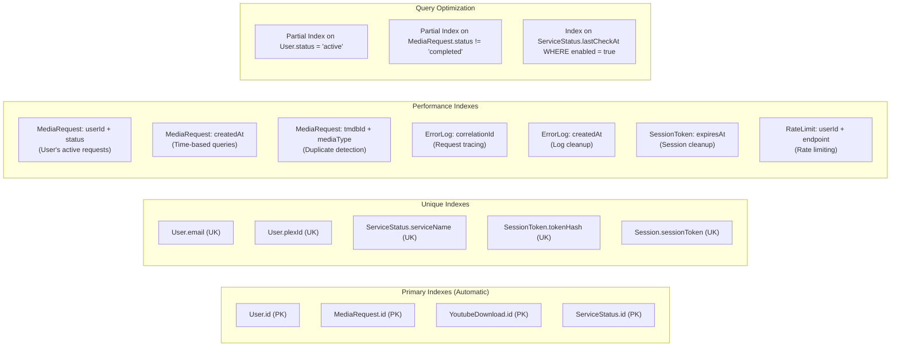
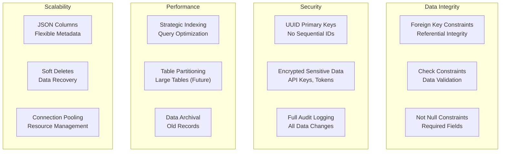

# MediaNest Database Schema Documentation

## Overview

MediaNest uses PostgreSQL as its primary database with Prisma ORM for type-safe database operations. The schema is designed to support user management, media requests, external service integrations, and comprehensive audit logging.

## Database Configuration

- **Database**: PostgreSQL 15-Alpine
- **ORM**: Prisma 6.15.0
- **Connection Pool**: 20 connections with 30s timeout
- **Encoding**: UTF-8

## Entity Relationship Diagram

The following ERD shows the complete MediaNest database schema with all relationships:

```mermaid
erDiagram
    User {
        string id PK "UUID Primary Key"
        string plexId UK "Unique Plex User ID"
        string plexUsername "Plex Display Name"
        string email UK "Unique Email Address"
        string name "Full Name"
        string role "USER | ADMIN | MODERATOR"
        string plexToken "Encrypted Plex Token"
        string image "Profile Image URL"
        boolean requiresPasswordChange "Force Password Reset"
        datetime createdAt "Account Creation"
        datetime lastLoginAt "Last Authentication"
        string status "active | suspended | deleted"
    }

    MediaRequest {
        string id PK "UUID Primary Key"
        string userId FK "Reference to User"
        string title "Media Title"
        string mediaType "movie | tv"
        string tmdbId "TMDB Database ID"
        string status "pending | approved | available | failed"
        string overseerrId "Overseerr Request ID"
        datetime createdAt "Request Creation"
        datetime completedAt "Request Completion"
    }

    YoutubeDownload {
        string id PK "UUID Primary Key"
        string userId FK "Reference to User"
        string playlistUrl "YouTube Playlist URL"
        string playlistTitle "Playlist Display Name"
        string status "queued | downloading | completed | failed"
        json filePaths "Downloaded File Paths Array"
        string plexCollectionId "Plex Collection ID"
        datetime createdAt "Download Initiation"
        datetime completedAt "Download Completion"
    }

    ServiceStatus {
        int id PK "Auto-increment ID"
        string serviceName UK "Service Identifier"
        string status "online | offline | degraded"
        int responseTimeMs "Response Time in MS"
        datetime lastCheckAt "Last Health Check"
        decimal uptimePercentage "99.99 format (5,2)"
    }

    RateLimit {
        int id PK "Auto-increment ID"
        string userId FK "Reference to User"
        string endpoint "API Endpoint Path"
        int requestCount "Current Request Count"
        datetime windowStart "Rate Limit Window Start"
    }

    ServiceConfig {
        int id PK "Auto-increment ID"
        string serviceName UK "Service Identifier"
        string serviceUrl "Service Base URL"
        string apiKey "Encrypted API Key"
        boolean enabled "Service Status"
        json configData "Service-specific Configuration"
        datetime updatedAt "Last Configuration Update"
        string updatedBy FK "User who updated config"
    }

    SessionToken {
        string id PK "UUID Primary Key"
        string userId FK "Reference to User"
        string tokenHash UK "Hashed Token Value"
        datetime expiresAt "Token Expiration"
        datetime createdAt "Token Creation"
        datetime lastUsedAt "Last Token Usage"
    }

    Account {
        string id PK "UUID Primary Key"
        string userId FK "Reference to User"
        string type "oauth | credentials"
        string provider "plex | local"
        string providerAccountId "Provider User ID"
        string refresh_token "OAuth Refresh Token"
        string access_token "OAuth Access Token"
        int expires_at "Token Expiration Timestamp"
        string token_type "Bearer | etc"
        string scope "OAuth Scope"
        string id_token "OpenID Connect ID Token"
        string session_state "OAuth Session State"
    }

    Session {
        string id PK "UUID Primary Key"
        string sessionToken UK "Unique Session Token"
        string userId FK "Reference to User"
        datetime expires "Session Expiration"
    }

    VerificationToken {
        string identifier "Email | Phone Number"
        string token UK "Verification Token"
        datetime expires "Token Expiration"
    }

    ErrorLog {
        string id PK "UUID Primary Key"
        string correlationId "Request Correlation ID"
        string userId FK "Reference to User"
        string errorCode "Application Error Code"
        string errorMessage "Human Readable Error"
        string stackTrace "Full Stack Trace"
        string requestPath "HTTP Request Path"
        string requestMethod "GET | POST | etc"
        int statusCode "HTTP Status Code"
        json metadata "Additional Error Context"
        datetime createdAt "Error Occurrence Time"
    }

    %% Primary Relationships
    User ||--o{ MediaRequest : "creates"
    User ||--o{ YoutubeDownload : "initiates"
    User ||--o{ RateLimit : "has_limits"
    User ||--o{ SessionToken : "owns_tokens"
    User ||--o{ Account : "has_accounts"
    User ||--o{ Session : "authenticated_via"
    User ||--o{ ErrorLog : "generates_errors"
    User ||--o{ ServiceConfig : "last_updated_by"

    %% Composite Unique Constraints
    Account ||--|| User : "unique_provider_account"
    VerificationToken ||--|| User : "unique_identifier_token"
```



## Database Indexes and Performance



## Schema Design Principles



         │         │ createdAt       │
         │         │ lastUsedAt      │
         │         └─────────────────┘
         │
         ├────┐    ┌─────────────────┐
         │    └────│   ErrorLog      │
         │         │                 │
         │         │ id (PK)         │
         │         │ correlationId   │
         │         │ userId (FK)     │
         │         │ errorCode       │
         │         │ errorMessage    │
         │         │ stackTrace      │
         │         │ requestPath     │
         │         │ requestMethod   │
         │         │ statusCode      │
         │         │ metadata        │
         │         │ createdAt       │
         │         └─────────────────┘
         │
         └─NextAuth Integration
                    │
                    ├─── Account
                    ├─── Session
                    └─── VerificationToken

````

## Core Tables

### 1. User Table

The central entity for user management with Plex integration.

```sql
CREATE TABLE users (
    id VARCHAR PRIMARY KEY DEFAULT gen_random_uuid(),
    plex_id VARCHAR UNIQUE,
    plex_username VARCHAR,
    email VARCHAR UNIQUE NOT NULL,
    name VARCHAR,
    role VARCHAR DEFAULT 'USER',
    plex_token VARCHAR,
    image VARCHAR,
    requires_password_change BOOLEAN DEFAULT false,
    created_at TIMESTAMP DEFAULT NOW(),
    last_login_at TIMESTAMP,
    status VARCHAR DEFAULT 'active'
);
````

**Key Features:**

- UUID primary key for security
- Plex integration fields (plexId, plexUsername, plexToken)
- Role-based access control (USER/ADMIN)
- Password change enforcement
- Activity tracking (createdAt, lastLoginAt)

**Relationships:**

- One-to-many: MediaRequest, YoutubeDownload, RateLimit, SessionToken, ErrorLog
- NextAuth: Account, Session

### 2. MediaRequest Table

Handles media requests with external service integration.

```sql
CREATE TABLE media_requests (
    id VARCHAR PRIMARY KEY DEFAULT gen_random_uuid(),
    user_id VARCHAR NOT NULL REFERENCES users(id),
    title VARCHAR NOT NULL,
    media_type VARCHAR NOT NULL,
    tmdb_id VARCHAR,
    status VARCHAR DEFAULT 'pending',
    overseerr_id VARCHAR,
    created_at TIMESTAMP DEFAULT NOW(),
    completed_at TIMESTAMP
);
```

**Indexes:**

- `(user_id, status)` - User request filtering
- `(created_at)` - Chronological queries
- `(tmdb_id, media_type)` - External service matching

**Status Flow:**
`pending → processing → completed/failed`

### 3. YoutubeDownload Table

Manages YouTube playlist downloads with Plex collection integration.

```sql
CREATE TABLE youtube_downloads (
    id VARCHAR PRIMARY KEY DEFAULT gen_random_uuid(),
    user_id VARCHAR NOT NULL REFERENCES users(id),
    playlist_url VARCHAR NOT NULL,
    playlist_title VARCHAR,
    status VARCHAR DEFAULT 'queued',
    file_paths JSONB,
    plex_collection_id VARCHAR,
    created_at TIMESTAMP DEFAULT NOW(),
    completed_at TIMESTAMP
);
```

**Features:**

- JSON storage for flexible file path arrays
- Plex collection integration
- Status tracking for async processing

### 4. ServiceStatus Table

Monitors external service health and performance.

```sql
CREATE TABLE service_status (
    id SERIAL PRIMARY KEY,
    service_name VARCHAR UNIQUE NOT NULL,
    status VARCHAR,
    response_time_ms INTEGER,
    last_check_at TIMESTAMP,
    uptime_percentage DECIMAL(5,2)
);
```

**Monitored Services:**

- Plex Media Server
- Overseerr
- Uptime Kuma
- Redis
- Database

### 5. RateLimit Table

Implements user-specific rate limiting.

```sql
CREATE TABLE rate_limits (
    id SERIAL PRIMARY KEY,
    user_id VARCHAR NOT NULL REFERENCES users(id),
    endpoint VARCHAR NOT NULL,
    request_count INTEGER DEFAULT 0,
    window_start TIMESTAMP DEFAULT NOW()
);
```

**Indexes:**

- `(user_id, endpoint)` - Rate limit lookups
- `(window_start)` - Cleanup queries

### 6. ServiceConfig Table

Stores external service configurations.

```sql
CREATE TABLE service_config (
    id SERIAL PRIMARY KEY,
    service_name VARCHAR UNIQUE NOT NULL,
    service_url VARCHAR NOT NULL,
    api_key VARCHAR,
    enabled BOOLEAN DEFAULT true,
    config_data JSONB,
    updated_at TIMESTAMP DEFAULT NOW(),
    updated_by VARCHAR REFERENCES users(id)
);
```

**Features:**

- Flexible JSON configuration storage
- Audit trail with user tracking
- Enable/disable service toggles

### 7. SessionToken Table

Manages custom session tokens for device authentication.

```sql
CREATE TABLE session_tokens (
    id VARCHAR PRIMARY KEY DEFAULT gen_random_uuid(),
    user_id VARCHAR NOT NULL REFERENCES users(id),
    token_hash VARCHAR UNIQUE NOT NULL,
    expires_at TIMESTAMP NOT NULL,
    created_at TIMESTAMP DEFAULT NOW(),
    last_used_at TIMESTAMP
);
```

**Security Features:**

- Hashed token storage (never plain text)
- Expiration management
- Usage tracking for suspicious activity detection

### 8. ErrorLog Table

Comprehensive error tracking and debugging.

```sql
CREATE TABLE error_logs (
    id VARCHAR PRIMARY KEY DEFAULT gen_random_uuid(),
    correlation_id VARCHAR NOT NULL,
    user_id VARCHAR NOT NULL REFERENCES users(id),
    error_code VARCHAR NOT NULL,
    error_message VARCHAR NOT NULL,
    stack_trace TEXT,
    request_path VARCHAR NOT NULL,
    request_method VARCHAR NOT NULL,
    status_code INTEGER,
    metadata JSONB,
    created_at TIMESTAMP DEFAULT NOW()
);
```

**Indexes:**

- `(correlation_id)` - Request tracing
- `(created_at)` - Time-based queries
- `(user_id)` - User-specific error analysis

## NextAuth Integration Tables

### Account Table

OAuth provider account linking.

```sql
CREATE TABLE accounts (
    id VARCHAR PRIMARY KEY DEFAULT gen_random_uuid(),
    user_id VARCHAR NOT NULL REFERENCES users(id) ON DELETE CASCADE,
    type VARCHAR NOT NULL,
    provider VARCHAR NOT NULL,
    provider_account_id VARCHAR NOT NULL,
    refresh_token TEXT,
    access_token TEXT,
    expires_at INTEGER,
    token_type VARCHAR,
    scope VARCHAR,
    id_token TEXT,
    session_state VARCHAR,
    UNIQUE(provider, provider_account_id)
);
```

### Session Table

NextAuth session management.

```sql
CREATE TABLE sessions (
    id VARCHAR PRIMARY KEY DEFAULT gen_random_uuid(),
    session_token VARCHAR UNIQUE NOT NULL,
    user_id VARCHAR NOT NULL REFERENCES users(id) ON DELETE CASCADE,
    expires TIMESTAMP NOT NULL
);
```

**Indexes:**

- `(user_id)` - User session lookup
- `(expires)` - Session cleanup

### VerificationToken Table

Email verification and password reset tokens.

```sql
CREATE TABLE verification_tokens (
    identifier VARCHAR NOT NULL,
    token VARCHAR UNIQUE NOT NULL,
    expires TIMESTAMP NOT NULL,
    UNIQUE(identifier, token)
);
```

## Performance Optimizations

### Index Strategy

#### High-Priority Indexes

1. **Users**

   - `email` (unique) - Authentication lookups
   - `plex_id` (unique) - Plex integration

2. **MediaRequest**

   - `(user_id, status)` - Dashboard filtering
   - `created_at` - Chronological sorting
   - `(tmdb_id, media_type)` - Duplicate prevention

3. **ErrorLog**
   - `correlation_id` - Request tracing
   - `created_at` - Log analysis
   - `user_id` - User-specific debugging

#### Composite Indexes

- User activity patterns: `(user_id, created_at DESC)`
- Request filtering: `(status, created_at DESC)`
- Error analysis: `(error_code, created_at DESC)`

### Query Optimization

#### N+1 Query Prevention

```typescript
// Optimized: Single query with joins
const usersWithRequests = await prisma.user.findMany({
  include: {
    mediaRequests: {
      where: { status: 'pending' },
      orderBy: { createdAt: 'desc' },
    },
  },
});
```

#### Pagination Strategy

```typescript
// Cursor-based pagination for large datasets
const requests = await prisma.mediaRequest.findMany({
  take: 20,
  skip: cursor ? 1 : 0,
  cursor: cursor ? { id: cursor } : undefined,
  orderBy: { createdAt: 'desc' },
});
```

## Data Integrity

### Constraints

1. **Foreign Key Constraints**: Enforce referential integrity
2. **Unique Constraints**: Prevent duplicate users/emails
3. **Check Constraints**: Valid status values and data ranges
4. **NOT NULL Constraints**: Required field enforcement

### Cascade Rules

- **Account/Session**: CASCADE delete on user deletion
- **MediaRequest**: SET NULL on user deletion (preserve history)
- **ErrorLog**: Retain for audit purposes

## Backup and Maintenance

### Backup Strategy

1. **Daily Automated Backups**: Full database backup
2. **Point-in-time Recovery**: WAL archiving
3. **Schema Versioning**: Prisma migration history

### Maintenance Tasks

1. **Index Maintenance**: REINDEX on performance degradation
2. **Log Cleanup**: Archive old error logs (>6 months)
3. **Session Cleanup**: Remove expired sessions daily

### Monitoring Queries

```sql
-- Active user sessions
SELECT COUNT(*) FROM sessions WHERE expires > NOW();

-- Request processing status
SELECT status, COUNT(*) FROM media_requests GROUP BY status;

-- Error rate by endpoint
SELECT request_path, COUNT(*) FROM error_logs
WHERE created_at > NOW() - INTERVAL '24 hours'
GROUP BY request_path ORDER BY COUNT(*) DESC;
```

## Migration Strategy

### Prisma Migration Workflow

1. **Schema Changes**: Update `schema.prisma`
2. **Generate Migration**: `prisma migrate dev`
3. **Review SQL**: Validate generated migration
4. **Deploy**: `prisma migrate deploy` in production

### Data Migration Patterns

```typescript
// Example: Adding new status enum
await prisma.$executeRaw`
  ALTER TYPE "MediaRequestStatus" ADD VALUE 'archived';
`;

// Backfill default values
await prisma.mediaRequest.updateMany({
  where: { status: null },
  data: { status: 'pending' },
});
```

This database schema provides a robust foundation for MediaNest's functionality while maintaining performance, security, and scalability requirements.
