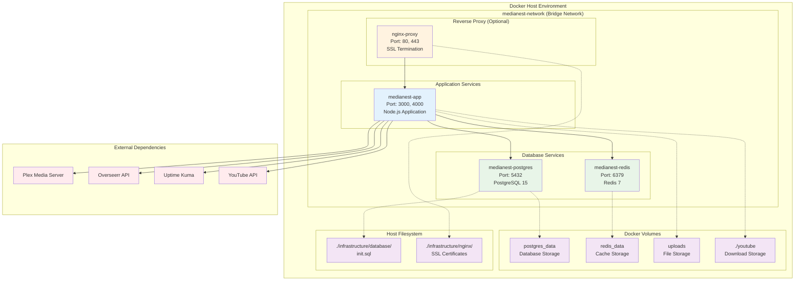
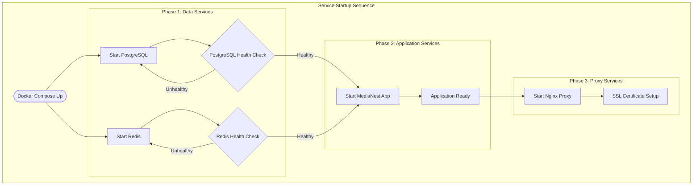
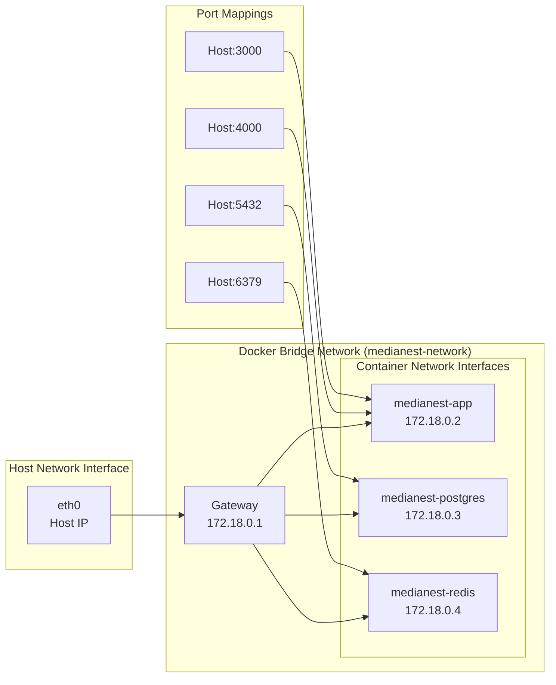
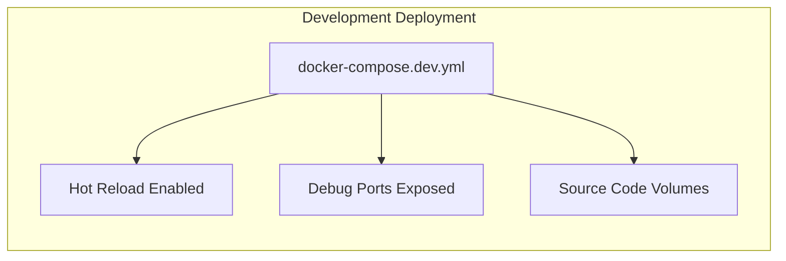
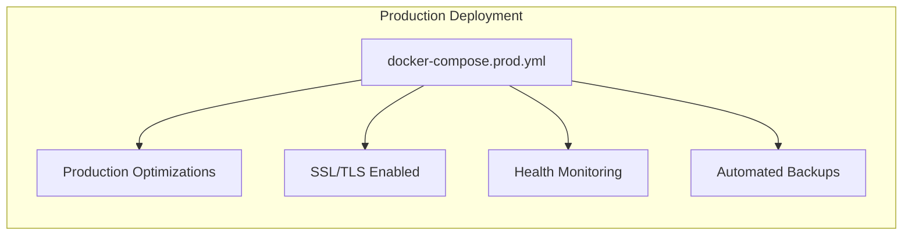
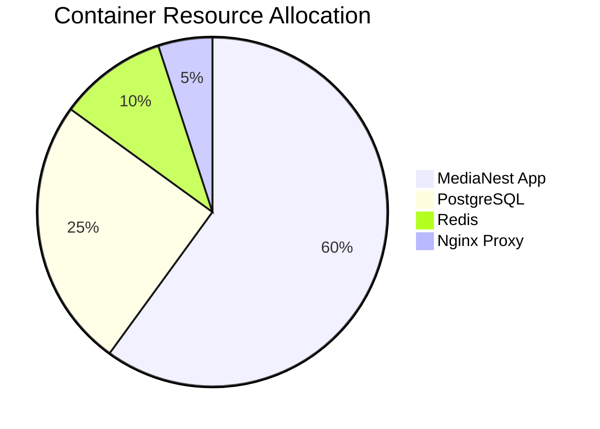

# Docker Architecture & Service Topology

This document describes the containerized architecture of MediaNest and how services are orchestrated using Docker Compose.

## Service Architecture Diagram

The following diagram shows the complete Docker service topology:



## Container Specifications

### Application Container (medianest-app)

```mermaid
graph LR
    subgraph "medianest-app Container"
        subgraph "Process Layer"
            FRONTEND[Next.js Frontend<br/>SSR Process]
            BACKEND[Express API<br/>Backend Process]
            WORKER[Background Workers<br/>Job Processing]
        end

        subgraph "Runtime Environment"
            NODEJS[Node.js Runtime]
            NPM[NPM Dependencies]
        end

        subgraph "File System"
            APPCODE[/app<br/>Application Code]
            YOUTUBE_VOL[/app/youtube<br/>Download Storage]
            UPLOADS_VOL[/app/uploads<br/>File Storage]
        end
    end

    FRONTEND --> NODEJS
    BACKEND --> NODEJS
    WORKER --> NODEJS
    NODEJS --> NPM

    FRONTEND --> APPCODE
    BACKEND --> APPCODE
    WORKER --> APPCODE

    WORKER --> YOUTUBE_VOL
    BACKEND --> UPLOADS_VOL
```

### Database Container (medianest-postgres)

```mermaid
graph LR
    subgraph "medianest-postgres Container"
        subgraph "Database Engine"
            PG15[PostgreSQL 15<br/>Alpine Linux]
            INITDB[Database Initialization<br/>Scripts]
        end

        subgraph "Storage"
            PGDATA_INT[/var/lib/postgresql/data<br/>Data Directory]
            INIT_SQL[/docker-entrypoint-initdb.d/<br/>Init Scripts]
        end

        subgraph "Configuration"
            ENV_VARS[Environment Variables<br/>DB Name, User, Password]
            HEALTH_CHECK[Health Check<br/>pg_isready]
        end
    end

    PG15 --> PGDATA_INT
    PG15 --> INIT_SQL
    INITDB --> INIT_SQL
    ENV_VARS --> PG15
    HEALTH_CHECK --> PG15
```

## Service Dependencies & Health Checks



## Network Configuration



## Security Architecture

```mermaid
graph TB
    subgraph "Security Layers"
        subgraph "Network Security"
            FIREWALL[Host Firewall<br/>iptables/ufw]
            DOCKER_NET[Docker Network Isolation]
        end

        subgraph "Container Security"
            USER_MAPPING[User Mapping<br/>1000:1000]
            READ_ONLY[Read-Only Filesystems]
            SECRETS[Environment Secrets]
        end

        subgraph "Application Security"
            TLS[TLS Termination<br/>Nginx Proxy]
            AUTH[JWT Authentication]
            RATE_LIMIT[Rate Limiting]
        end

        subgraph "Data Security"
            DB_AUTH[Database Authentication]
            ENCRYPTION[Data Encryption at Rest]
            BACKUP_ENCRYPT[Encrypted Backups]
        end
    end

    FIREWALL --> DOCKER_NET
    DOCKER_NET --> USER_MAPPING
    USER_MAPPING --> READ_ONLY
    READ_ONLY --> SECRETS

    SECRETS --> TLS
    TLS --> AUTH
    AUTH --> RATE_LIMIT

    RATE_LIMIT --> DB_AUTH
    DB_AUTH --> ENCRYPTION
    ENCRYPTION --> BACKUP_ENCRYPT
```



## Deployment Modes

### Development Mode



### Production Mode



## Resource Allocation



This architecture ensures scalable, secure, and maintainable deployment of MediaNest using modern containerization best practices.
