# Infrastructure Topology & Network Architecture

This document describes the complete infrastructure topology, network architecture, and deployment patterns for MediaNest across different environments.

## Infrastructure Overview

```mermaid
graph TB
    subgraph "Production Infrastructure"
        subgraph "Load Balancer Tier"
            LB[🌐 Load Balancer<br/>Nginx/HAProxy<br/>SSL Termination]
            CDN[📡 CDN<br/>Static Assets<br/>Global Distribution]
        end

        subgraph "Application Tier"
            APP1[🚀 App Instance 1<br/>MediaNest Container]
            APP2[🚀 App Instance 2<br/>MediaNest Container]
            APP3[🚀 App Instance 3<br/>MediaNest Container]
        end

        subgraph "Database Tier"
            POSTGRES_PRIMARY[🐘 PostgreSQL Primary<br/>Read/Write Operations]
            POSTGRES_REPLICA[🐘 PostgreSQL Replica<br/>Read Operations]
            REDIS_CLUSTER[🔴 Redis Cluster<br/>Cache & Sessions<br/>3 Node Cluster]
        end

        subgraph "Storage Tier"
            MEDIA_STORAGE[💾 Media Storage<br/>NFS/Object Storage<br/>High Availability]
            BACKUP_STORAGE[💿 Backup Storage<br/>Encrypted Backups<br/>Geographic Distribution]
        end

        subgraph "Monitoring & Logging"
            PROMETHEUS[📊 Prometheus<br/>Metrics Collection]
            GRAFANA[📈 Grafana<br/>Dashboards & Alerts]
            ELASTICSEARCH[🔍 Elasticsearch<br/>Log Aggregation]
            KIBANA[📋 Kibana<br/>Log Analysis]
        end

        subgraph "External Services"
            PLEX_SERVER[🎬 Plex Media Server<br/>External/Managed]
            OVERSEERR[📥 Overseerr Instance<br/>External/Managed]
            UPTIME_KUMA[📊 Uptime Kuma<br/>External/Managed]
        end
    end

    subgraph "Network Flow"
        INTERNET[🌍 Internet]
        FIREWALL[🛡️ Firewall/WAF<br/>Security Gateway]

        INTERNET --> FIREWALL
        FIREWALL --> LB
        FIREWALL --> CDN

        LB --> APP1
        LB --> APP2
        LB --> APP3

        APP1 --> POSTGRES_PRIMARY
        APP2 --> POSTGRES_PRIMARY
        APP3 --> POSTGRES_REPLICA

        APP1 --> REDIS_CLUSTER
        APP2 --> REDIS_CLUSTER
        APP3 --> REDIS_CLUSTER

        APP1 --> MEDIA_STORAGE
        APP2 --> MEDIA_STORAGE
        APP3 --> MEDIA_STORAGE

        POSTGRES_PRIMARY --> BACKUP_STORAGE
        REDIS_CLUSTER --> BACKUP_STORAGE
        MEDIA_STORAGE --> BACKUP_STORAGE

        APP1 --> PROMETHEUS
        APP2 --> PROMETHEUS
        APP3 --> PROMETHEUS
        POSTGRES_PRIMARY --> PROMETHEUS
        REDIS_CLUSTER --> PROMETHEUS

        PROMETHEUS --> GRAFANA
        APP1 --> ELASTICSEARCH
        APP2 --> ELASTICSEARCH
        APP3 --> ELASTICSEARCH
        ELASTICSEARCH --> KIBANA

        APP1 --> PLEX_SERVER
        APP2 --> OVERSEERR
        APP3 --> UPTIME_KUMA
    end

    %% Styling
    classDef loadBalancer fill:#e1f5fe,stroke:#0277bd,stroke-width:3px
    classDef application fill:#e8f5e8,stroke:#4caf50,stroke-width:2px
    classDef database fill:#fff3e0,stroke:#f57c00,stroke-width:2px
    classDef storage fill:#f3e5f5,stroke:#9c27b0,stroke-width:2px
    classDef monitoring fill:#ffebee,stroke:#d32f2f,stroke-width:2px
    classDef external fill:#e0f2f1,stroke:#00695c,stroke-width:2px
    classDef network fill:#fce4ec,stroke:#ad1457,stroke-width:2px

    class LB,CDN loadBalancer
    class APP1,APP2,APP3 application
    class POSTGRES_PRIMARY,POSTGRES_REPLICA,REDIS_CLUSTER database
    class MEDIA_STORAGE,BACKUP_STORAGE storage
    class PROMETHEUS,GRAFANA,ELASTICSEARCH,KIBANA monitoring
    class PLEX_SERVER,OVERSEERR,UPTIME_KUMA external
    class INTERNET,FIREWALL network
```

## Network Security Architecture

```mermaid
graph LR
    subgraph "Security Layers"
        subgraph "Perimeter Security"
            WAF[🛡️ Web Application Firewall<br/>OWASP Top 10 Protection<br/>DDoS Mitigation]
            FIREWALL[🔥 Network Firewall<br/>Port/IP Filtering<br/>Intrusion Detection]
        end

        subgraph "Network Segmentation"
            DMZ[🌐 DMZ Network<br/>Public-facing Services<br/>172.16.0.0/16]
            APP_NET[🔒 Application Network<br/>Internal Services<br/>10.0.0.0/16]
            DB_NET[🔐 Database Network<br/>Data Services<br/>192.168.0.0/16]
            MGMT_NET[⚙️ Management Network<br/>Admin Access<br/>10.10.0.0/16]
        end

        subgraph "Access Control"
            VPN[🔑 VPN Gateway<br/>Admin Access<br/>OpenVPN/WireGuard]
            BASTION[🏰 Bastion Host<br/>Jump Server<br/>SSH Access]
            IAM[👤 Identity & Access Management<br/>RBAC<br/>MFA Required]
        end

        subgraph "Encryption"
            SSL_TERM[🔒 SSL/TLS Termination<br/>Certificate Management<br/>Perfect Forward Secrecy]
            DATA_ENCRYPT[💾 Data Encryption at Rest<br/>AES-256<br/>Key Rotation]
            TRANSIT_ENCRYPT[🚀 Data in Transit<br/>TLS 1.3<br/>End-to-end Encryption]
        end
    end

    WAF --> DMZ
    FIREWALL --> APP_NET
    DMZ --> APP_NET
    APP_NET --> DB_NET

    VPN --> MGMT_NET
    BASTION --> MGMT_NET
    IAM --> VPN
    IAM --> BASTION

    SSL_TERM --> WAF
    DATA_ENCRYPT --> DB_NET
    TRANSIT_ENCRYPT --> APP_NET

    %% Styling
    classDef perimeter fill:#ffebee,stroke:#d32f2f,stroke-width:3px
    classDef network fill:#e8f5e8,stroke:#4caf50,stroke-width:2px
    classDef access fill:#e1f5fe,stroke:#0277bd,stroke-width:2px
    classDef encryption fill:#f3e5f5,stroke:#9c27b0,stroke-width:2px

    class WAF,FIREWALL perimeter
    class DMZ,APP_NET,DB_NET,MGMT_NET network
    class VPN,BASTION,IAM access
    class SSL_TERM,DATA_ENCRYPT,TRANSIT_ENCRYPT encryption
```

## SSL/TLS Certificate Management

```mermaid
flowchart TD
    subgraph "Certificate Lifecycle"
        START([Certificate Need Identified])

        subgraph "Certificate Acquisition"
            CERT_TYPE{Certificate Type}
            LETSENCRYPT[🔒 Let's Encrypt<br/>Free, Automated<br/>90-day validity]
            COMMERCIAL[🏢 Commercial CA<br/>Extended Validation<br/>1-3 year validity]
            INTERNAL_CA[🏛️ Internal CA<br/>Private certificates<br/>Custom validity]
        end

        subgraph "Validation Process"
            DOMAIN_VAL[🌐 Domain Validation<br/>HTTP/DNS Challenge]
            ORG_VAL[🏢 Organization Validation<br/>Business Verification]
            EV_VAL[✅ Extended Validation<br/>Comprehensive Checks]
        end

        subgraph "Deployment"
            CERT_INSTALL[📥 Certificate Installation]
            NGINX_CONFIG[⚙️ Nginx Configuration<br/>SSL Settings]
            CERT_CHAIN[🔗 Certificate Chain<br/>Intermediate CAs]
            SSL_TEST[🧪 SSL Configuration Test<br/>Qualys SSL Labs]
        end

        subgraph "Monitoring & Renewal"
            CERT_MONITOR[📊 Certificate Monitoring<br/>Expiry Alerts]
            AUTO_RENEWAL[🔄 Automatic Renewal<br/>Certbot/ACME Client]
            MANUAL_RENEWAL[👤 Manual Renewal<br/>Admin Intervention]
            UPDATE_CHAIN[🔄 Update Certificate Chain]
        end

        subgraph "Security Features"
            HSTS[🔒 HTTP Strict Transport Security<br/>Force HTTPS]
            OCSP[📋 OCSP Stapling<br/>Certificate Status]
            CIPHER_SUITE[🔐 Cipher Suite Configuration<br/>Modern Ciphers Only]
            PERFECT_FS[🛡️ Perfect Forward Secrecy<br/>DHE/ECDHE Key Exchange]
        end

        START --> CERT_TYPE

        CERT_TYPE -->|Free/Automated| LETSENCRYPT
        CERT_TYPE -->|Paid/Advanced| COMMERCIAL
        CERT_TYPE -->|Internal/Private| INTERNAL_CA

        LETSENCRYPT --> DOMAIN_VAL
        COMMERCIAL --> ORG_VAL
        COMMERCIAL --> EV_VAL
        INTERNAL_CA --> DOMAIN_VAL

        DOMAIN_VAL --> CERT_INSTALL
        ORG_VAL --> CERT_INSTALL
        EV_VAL --> CERT_INSTALL

        CERT_INSTALL --> NGINX_CONFIG
        NGINX_CONFIG --> CERT_CHAIN
        CERT_CHAIN --> SSL_TEST

        SSL_TEST --> CERT_MONITOR
        CERT_MONITOR --> AUTO_RENEWAL
        CERT_MONITOR --> MANUAL_RENEWAL

        AUTO_RENEWAL --> UPDATE_CHAIN
        MANUAL_RENEWAL --> UPDATE_CHAIN

        UPDATE_CHAIN --> HSTS
        HSTS --> OCSP
        OCSP --> CIPHER_SUITE
        CIPHER_SUITE --> PERFECT_FS

        %% Loop back for renewal
        PERFECT_FS --> CERT_MONITOR

        %% Styling
        classDef start fill:#e8f5e8,stroke:#4caf50,stroke-width:2px
        classDef acquisition fill:#e3f2fd,stroke:#2196f3,stroke-width:2px
        classDef validation fill:#fff3e0,stroke:#ff9800,stroke-width:2px
        classDef deployment fill:#f3e5f5,stroke:#9c27b0,stroke-width:2px
        classDef monitoring fill:#ffebee,stroke:#d32f2f,stroke-width:2px
        classDef security fill:#e0f2f1,stroke:#00695c,stroke-width:2px

        class START start
        class LETSENCRYPT,COMMERCIAL,INTERNAL_CA acquisition
        class DOMAIN_VAL,ORG_VAL,EV_VAL validation
        class CERT_INSTALL,NGINX_CONFIG,CERT_CHAIN,SSL_TEST deployment
        class CERT_MONITOR,AUTO_RENEWAL,MANUAL_RENEWAL,UPDATE_CHAIN monitoring
        class HSTS,OCSP,CIPHER_SUITE,PERFECT_FS security
    end
```

## Backup & Recovery Architecture

```mermaid
graph TB
    subgraph "Backup Strategy"
        subgraph "Data Sources"
            APP_DATA[📱 Application Data<br/>User uploads, configs<br/>File system backups]
            DB_DATA[🐘 PostgreSQL Database<br/>Full & incremental<br/>Point-in-time recovery]
            CACHE_DATA[🔴 Redis Data<br/>Session snapshots<br/>Configuration backups]
            LOG_DATA[📋 Log Files<br/>Application logs<br/>System logs<br/>Audit trails]
        end

        subgraph "Backup Types"
            FULL_BACKUP[💾 Full Backups<br/>Complete system state<br/>Weekly schedule]
            INCREMENTAL[📈 Incremental Backups<br/>Changed data only<br/>Daily schedule]
            DIFFERENTIAL[📊 Differential Backups<br/>Changes since last full<br/>Hourly snapshots]
            CONTINUOUS[🔄 Continuous Backup<br/>Real-time replication<br/>Transaction logs]
        end

        subgraph "Storage Locations"
            LOCAL_STORAGE[💽 Local Storage<br/>Fast recovery<br/>Primary backups]
            REMOTE_STORAGE[☁️ Remote Storage<br/>Geographic redundancy<br/>Disaster recovery]
            TAPE_STORAGE[📼 Tape/Archive<br/>Long-term retention<br/>Compliance storage]
            CLOUD_STORAGE[🌤️ Cloud Storage<br/>S3/Azure/GCS<br/>Scalable & secure]
        end

        subgraph "Recovery Procedures"
            RTO[⏰ Recovery Time Objective<br/>4 hours maximum<br/>Service restoration]
            RPO[📅 Recovery Point Objective<br/>1 hour maximum<br/>Data loss tolerance]
            DR_TESTING[🧪 Disaster Recovery Testing<br/>Monthly validation<br/>Automated testing]
            FAILOVER[🔄 Automated Failover<br/>Health monitoring<br/>Automatic switching]
        end
    end

    %% Data flow connections
    APP_DATA --> FULL_BACKUP
    APP_DATA --> INCREMENTAL
    DB_DATA --> FULL_BACKUP
    DB_DATA --> CONTINUOUS
    CACHE_DATA --> DIFFERENTIAL
    LOG_DATA --> INCREMENTAL

    FULL_BACKUP --> LOCAL_STORAGE
    FULL_BACKUP --> REMOTE_STORAGE
    INCREMENTAL --> LOCAL_STORAGE
    INCREMENTAL --> CLOUD_STORAGE
    DIFFERENTIAL --> LOCAL_STORAGE
    CONTINUOUS --> REMOTE_STORAGE

    LOCAL_STORAGE --> RTO
    REMOTE_STORAGE --> RPO
    CLOUD_STORAGE --> DR_TESTING
    TAPE_STORAGE --> DR_TESTING

    RTO --> FAILOVER
    RPO --> FAILOVER
    DR_TESTING --> FAILOVER

    %% Styling
    classDef dataSources fill:#e3f2fd,stroke:#2196f3,stroke-width:2px
    classDef backupTypes fill:#e8f5e8,stroke:#4caf50,stroke-width:2px
    classDef storage fill:#fff3e0,stroke:#f57c00,stroke-width:2px
    classDef recovery fill:#ffebee,stroke:#d32f2f,stroke-width:2px

    class APP_DATA,DB_DATA,CACHE_DATA,LOG_DATA dataSources
    class FULL_BACKUP,INCREMENTAL,DIFFERENTIAL,CONTINUOUS backupTypes
    class LOCAL_STORAGE,REMOTE_STORAGE,TAPE_STORAGE,CLOUD_STORAGE storage
    class RTO,RPO,DR_TESTING,FAILOVER recovery
```

## Monitoring & Observability Stack

```mermaid
graph LR
    subgraph "Data Collection Layer"
        subgraph "Metrics Collection"
            PROM_AGENT[📊 Prometheus Node Exporter<br/>System metrics<br/>Hardware stats]
            APP_METRICS[📈 Application Metrics<br/>Custom metrics<br/>Business KPIs]
            DOCKER_METRICS[🐳 Container Metrics<br/>Resource usage<br/>Performance stats]
        end

        subgraph "Log Collection"
            LOG_AGENT[📋 Log Agents<br/>Fluentd/Filebeat<br/>Log shipping]
            STRUCTURED_LOGS[📝 Structured Logging<br/>JSON format<br/>Correlation IDs]
            AUDIT_LOGS[🔍 Audit Logs<br/>Security events<br/>Compliance tracking]
        end

        subgraph "Trace Collection"
            JAEGER[🔗 Jaeger<br/>Distributed tracing<br/>Request tracking]
            OPENTEL[📡 OpenTelemetry<br/>Trace collection<br/>Span correlation]
        end
    end

    subgraph "Storage & Processing"
        PROMETHEUS[📊 Prometheus<br/>Time-series database<br/>Metrics storage]
        ELASTICSEARCH[🔍 Elasticsearch<br/>Log aggregation<br/>Full-text search]
        JAEGER_STORE[🗄️ Jaeger Storage<br/>Trace persistence<br/>Query interface]
    end

    subgraph "Visualization & Alerting"
        GRAFANA[📈 Grafana<br/>Dashboards<br/>Data visualization]
        KIBANA[📋 Kibana<br/>Log exploration<br/>Data discovery]
        ALERT_MGR[🚨 Alert Manager<br/>Alert routing<br/>Notification delivery]

        subgraph "Notification Channels"
            EMAIL[📧 Email Alerts<br/>Admin notifications<br/>Digest reports]
            SLACK[💬 Slack Integration<br/>Team notifications<br/>Incident updates]
            WEBHOOK[🔗 Webhook Alerts<br/>Custom integrations<br/>Automation triggers]
            SMS[📱 SMS Alerts<br/>Critical alerts<br/>Emergency notifications]
        end
    end

    %% Data flow
    PROM_AGENT --> PROMETHEUS
    APP_METRICS --> PROMETHEUS
    DOCKER_METRICS --> PROMETHEUS

    LOG_AGENT --> ELASTICSEARCH
    STRUCTURED_LOGS --> ELASTICSEARCH
    AUDIT_LOGS --> ELASTICSEARCH

    JAEGER --> JAEGER_STORE
    OPENTEL --> JAEGER_STORE

    PROMETHEUS --> GRAFANA
    PROMETHEUS --> ALERT_MGR
    ELASTICSEARCH --> KIBANA
    JAEGER_STORE --> GRAFANA

    ALERT_MGR --> EMAIL
    ALERT_MGR --> SLACK
    ALERT_MGR --> WEBHOOK
    ALERT_MGR --> SMS

    %% Styling
    classDef collection fill:#e1f5fe,stroke:#0277bd,stroke-width:2px
    classDef storage fill:#e8f5e8,stroke:#4caf50,stroke-width:2px
    classDef visualization fill:#fff3e0,stroke:#f57c00,stroke-width:2px
    classDef notification fill:#ffebee,stroke:#d32f2f,stroke-width:2px

    class PROM_AGENT,APP_METRICS,DOCKER_METRICS,LOG_AGENT,STRUCTURED_LOGS,AUDIT_LOGS,JAEGER,OPENTEL collection
    class PROMETHEUS,ELASTICSEARCH,JAEGER_STORE storage
    class GRAFANA,KIBANA,ALERT_MGR visualization
    class EMAIL,SLACK,WEBHOOK,SMS notification
```

## Environment-Specific Deployments

```mermaid
graph TD
    subgraph "Deployment Environments"
        subgraph "Development Environment"
            DEV_SINGLE[🔧 Single Container<br/>All services in one<br/>Local development]
            DEV_COMPOSE[🐳 Docker Compose<br/>Multi-container<br/>Local testing]
            DEV_VOLUMES[💾 Local Volumes<br/>Persistent data<br/>Hot reloading]
        end

        subgraph "Staging Environment"
            STAGE_CLUSTER[🎭 Staging Cluster<br/>Production-like<br/>Pre-deployment testing]
            STAGE_DATA[📊 Sanitized Data<br/>Production subset<br/>Privacy compliant]
            STAGE_MONITORING[📈 Full Monitoring<br/>Performance testing<br/>Load testing]
        end

        subgraph "Production Environment"
            PROD_HA[🏗️ High Availability<br/>Multi-node cluster<br/>Zero downtime]
            PROD_SCALING[📈 Auto Scaling<br/>Load-based scaling<br/>Resource optimization]
            PROD_SECURITY[🛡️ Enhanced Security<br/>Full encryption<br/>Compliance ready]
        end

        subgraph "Disaster Recovery Environment"
            DR_STANDBY[⏸️ Standby Environment<br/>Warm standby<br/>Ready for activation]
            DR_REPLICATION[🔄 Data Replication<br/>Real-time sync<br/>Geographic separation]
            DR_TESTING[🧪 DR Testing<br/>Regular validation<br/>Automated failover]
        end
    end

    %% Environment progression
    DEV_SINGLE --> DEV_COMPOSE
    DEV_COMPOSE --> STAGE_CLUSTER
    STAGE_CLUSTER --> PROD_HA

    DEV_VOLUMES --> STAGE_DATA
    STAGE_DATA --> PROD_SCALING

    STAGE_MONITORING --> PROD_SECURITY
    PROD_SECURITY --> DR_STANDBY

    PROD_HA --> DR_REPLICATION
    DR_REPLICATION --> DR_TESTING

    %% Styling
    classDef development fill:#e8f5e8,stroke:#4caf50,stroke-width:2px
    classDef staging fill:#fff3e0,stroke:#f57c00,stroke-width:2px
    classDef production fill:#ffebee,stroke:#d32f2f,stroke-width:3px
    classDef disaster fill:#f3e5f5,stroke:#9c27b0,stroke-width:2px

    class DEV_SINGLE,DEV_COMPOSE,DEV_VOLUMES development
    class STAGE_CLUSTER,STAGE_DATA,STAGE_MONITORING staging
    class PROD_HA,PROD_SCALING,PROD_SECURITY production
    class DR_STANDBY,DR_REPLICATION,DR_TESTING disaster
```

This comprehensive infrastructure documentation provides a complete view of MediaNest's deployment architecture, from development through disaster recovery scenarios, ensuring robust and scalable operations across all environments.
