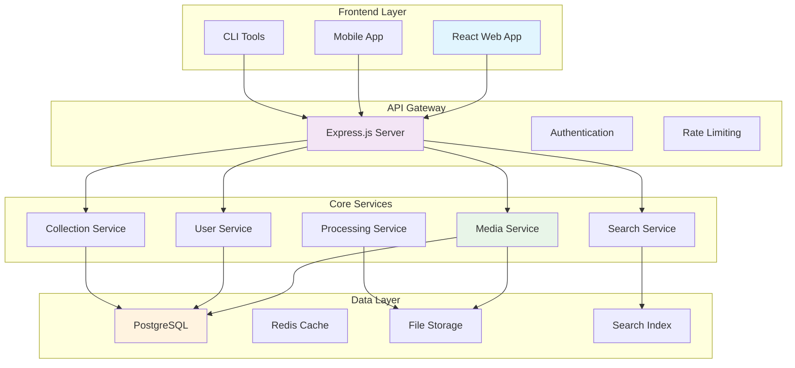
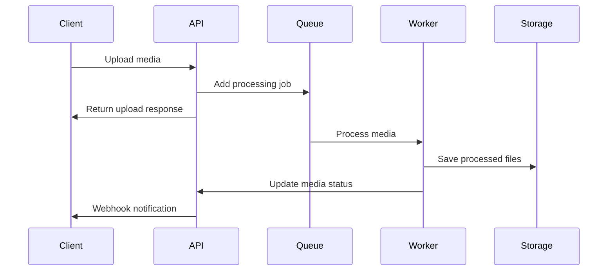

# Developer Documentation

Welcome to the MediaNest developer documentation! This section provides comprehensive information for developers who want to contribute to MediaNest, extend its functionality, or integrate it into their systems.

## Getting Started as a Developer

<div class="grid cards" markdown>

- :material-code-braces: **Architecture Overview**

  ***

  Understand MediaNest's system architecture, components, and design patterns.

  [Architecture Guide →](architecture.md)

- :material-heart: **Contributing**

  ***

  Learn how to contribute code, report issues, and collaborate with the community.

  [Contributing Guide →](contributing.md)

- :material-laptop: **Development Setup**

  ***

  Set up your local development environment for MediaNest development.

  [Setup Guide →](development-setup.md)

- :material-code-tags: **Coding Standards**

  ***

  Follow our coding conventions, style guides, and best practices.

  [Coding Standards →](coding-standards.md)

- :material-test-tube: **Testing**

  ***

  Comprehensive guide to testing strategies, tools, and practices.

  [Testing Guide →](testing.md)

- :material-rocket-launch: **Deployment**

  ***

  Deploy MediaNest in various environments and configurations.

  [Deployment Guide →](deployment.md)

- :material-database: **Database Schema**

  ***

  Understand the database structure and relationships.

  [Database Guide →](database-schema.md)

- :material-puzzle: **Plugin Development**

  ***

  Create custom plugins to extend MediaNest functionality.

  [Plugin Guide →](plugins.md)

</div>

## Technology Stack

MediaNest is built with modern technologies and follows current best practices:

### Backend Technologies

| Technology     | Version | Purpose              |
| -------------- | ------- | -------------------- |
| **Node.js**    | 18+     | Runtime environment  |
| **TypeScript** | 5.0+    | Type-safe JavaScript |
| **Express.js** | 4.18+   | Web framework        |
| **PostgreSQL** | 13+     | Primary database     |
| **Redis**      | 6.0+    | Caching and sessions |
| **FFmpeg**     | 4.4+    | Media processing     |

### Frontend Technologies

| Technology       | Version | Purpose       |
| ---------------- | ------- | ------------- |
| **React**        | 18+     | UI framework  |
| **TypeScript**   | 5.0+    | Type safety   |
| **Vite**         | 4.0+    | Build tool    |
| **Tailwind CSS** | 3.0+    | Styling       |
| **React Query**  | 4.0+    | Data fetching |

### Development Tools

| Tool               | Purpose          |
| ------------------ | ---------------- |
| **ESLint**         | Code linting     |
| **Prettier**       | Code formatting  |
| **Jest**           | Unit testing     |
| **Cypress**        | E2E testing      |
| **Docker**         | Containerization |
| **GitHub Actions** | CI/CD            |

## Architecture Overview

MediaNest follows a modular, microservices-inspired architecture:



## Quick Start for Developers

### 1. Clone and Setup

```bash
# Clone the repository
git clone https://github.com/medianest/medianest.git
cd medianest

# Install dependencies
npm install

# Setup development environment
cp .env.example .env.development
npm run setup:dev
```

### 2. Start Development Server

```bash
# Start all services
npm run dev

# Or start individual services
npm run dev:api      # API server only
npm run dev:web      # Frontend only
npm run dev:worker   # Background workers
```

### 3. Run Tests

```bash
# Run all tests
npm test

# Run specific test suites
npm run test:unit    # Unit tests
npm run test:e2e     # End-to-end tests
npm run test:api     # API tests
```

## Development Workflow

### 1. Planning Phase

- Review requirements and create GitHub issues
- Design API endpoints and data models
- Create technical specifications
- Plan testing strategy

### 2. Development Phase

- Create feature branch from `develop`
- Write tests first (TDD approach)
- Implement features with proper error handling
- Follow coding standards and best practices

### 3. Review Phase

- Create pull request with detailed description
- Ensure all tests pass
- Code review by team members
- Address feedback and make improvements

### 4. Integration Phase

- Merge to `develop` branch
- Run integration tests
- Deploy to staging environment
- Perform manual testing

### 5. Release Phase

- Merge to `main` branch
- Tag release version
- Deploy to production
- Monitor for issues

## Project Structure

```
medianest/
├── apps/
│   ├── api/           # Backend API server
│   ├── web/           # React frontend
│   ├── cli/           # Command-line tools
│   └── worker/        # Background workers
├── packages/
│   ├── shared/        # Shared utilities
│   ├── database/      # Database schemas
│   └── types/         # TypeScript types
├── docs/              # Documentation
├── scripts/           # Build and deployment scripts
├── tests/             # Test utilities and fixtures
└── tools/             # Development tools
```

## Core Concepts for Developers

### Media Processing Pipeline



### Plugin System

MediaNest supports a powerful plugin system:

```typescript
export interface MediaNestPlugin {
  name: string;
  version: string;
  hooks?: {
    beforeUpload?: (file: File) => Promise<File>;
    afterUpload?: (media: Media) => Promise<void>;
    beforeProcess?: (media: Media) => Promise<Media>;
    afterProcess?: (media: Media) => Promise<void>;
  };
}
```

### API Design Patterns

All API endpoints follow consistent patterns:

```typescript
// Standard response format
interface ApiResponse<T> {
  success: boolean;
  data?: T;
  error?: ApiError;
  metadata: {
    timestamp: string;
    requestId: string;
    version: string;
  };
}

// Pagination
interface PaginatedResponse<T> extends ApiResponse<T[]> {
  pagination: {
    page: number;
    limit: number;
    total: number;
    hasNext: boolean;
    hasPrev: boolean;
  };
}
```

## Performance Considerations

### Backend Performance

1. **Database Optimization**

   - Use database indexes effectively
   - Implement query optimization
   - Use connection pooling
   - Cache frequently accessed data

2. **Media Processing**

   - Implement queue-based processing
   - Use worker processes for CPU-intensive tasks
   - Optimize image/video processing pipelines
   - Implement progressive loading

3. **Caching Strategy**
   - Redis for session and API caching
   - CDN for static assets
   - Browser caching headers
   - Smart cache invalidation

### Frontend Performance

1. **Code Splitting**

   - Route-based code splitting
   - Component lazy loading
   - Dynamic imports for heavy features

2. **Asset Optimization**

   - Image optimization and WebP support
   - Bundle size analysis and optimization
   - Tree shaking for unused code

3. **User Experience**
   - Progressive loading for large galleries
   - Virtualized lists for many items
   - Optimistic updates for better UX

## Security Guidelines

### Backend Security

1. **Authentication & Authorization**

   - JWT token validation
   - Role-based access control (RBAC)
   - API rate limiting
   - Input validation and sanitization

2. **Data Protection**
   - Encrypt sensitive data at rest
   - Use HTTPS in production
   - Implement proper CORS policies
   - Regular security audits

### Frontend Security

1. **Input Handling**

   - Validate all user inputs
   - Prevent XSS attacks
   - Sanitize file uploads
   - Use Content Security Policy (CSP)

2. **State Management**
   - Secure token storage
   - Clean up sensitive data
   - Implement proper logout

## Monitoring and Observability

### Logging

```typescript
import { Logger } from '@medianest/logger';

const logger = new Logger('media-service');

logger.info('Processing media', {
  mediaId: '123',
  userId: 'user456',
});

logger.error('Processing failed', {
  error: error.message,
  stack: error.stack,
});
```

### Metrics

- Application performance metrics
- Business metrics (uploads, users, etc.)
- System metrics (CPU, memory, disk)
- Custom metrics for specific features

### Error Tracking

- Structured error logging
- Error aggregation and alerting
- User-facing error messages
- Debug information for developers

## Resources for Developers

### Documentation

- [API Reference](../api/) - Complete API documentation
- [Database Schema](database-schema.md) - Data model documentation
- [Testing Guide](testing.md) - Comprehensive testing strategies

### Community

- **GitHub**: Source code and issue tracking
- **Discussions**: Technical discussions and Q&A
- **Discord**: Real-time chat with developers
- **Stack Overflow**: Tagged questions and answers

### Tools and Utilities

- **Development CLI**: `npm run dev:tools`
- **Database Migrations**: `npm run db:migrate`
- **Code Generators**: `npm run generate:component`
- **Performance Profiling**: Built-in profiling tools

---

Ready to start developing? Begin with the [Development Setup Guide](development-setup.md) to configure your environment!
