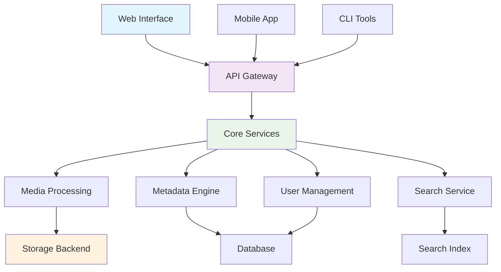

# MediaNest Documentation

Welcome to **MediaNest**, the advanced media management platform designed for modern content creators, teams, and organizations. MediaNest provides powerful tools for organizing, processing, and managing your digital media assets with ease.

{ align=center }

## What is MediaNest?

MediaNest is a comprehensive media management solution that combines:

- **Intelligent Organization**: Automated file categorization and smart folder structures
- **Advanced Search**: AI-powered search capabilities across metadata, content, and visual elements
- **Processing Pipeline**: Automated media processing, optimization, and format conversion
- **Collaboration Tools**: Team-based workflows with permissions and sharing controls
- **API-First Design**: Extensive REST API for integration with existing systems
- **Scalable Architecture**: Built to handle everything from personal collections to enterprise-level deployments

## Key Features

### 🚀 **Performance & Scalability**

- High-performance media processing pipeline
- Distributed storage support
- Horizontal scaling capabilities
- Optimized for large media collections

### 🧠 **Intelligence & Automation**

- AI-powered content analysis and tagging
- Automated duplicate detection
- Smart categorization and organization
- Intelligent thumbnail generation

### 🔧 **Developer-Friendly**

- Comprehensive REST API
- Plugin architecture for extensibility
- Docker-based deployment
- Extensive documentation and examples

### 🔒 **Security & Control**

- Role-based access control (RBAC)
- Encrypted storage options
- Audit logging and compliance
- Fine-grained permissions

## Quick Navigation

- :material-rocket-launch: **Getting Started**

  ***

  New to MediaNest? Start here to get up and running quickly.

  [Get Started](getting-started/){ .md-button }

- :material-download: **Installation**

  ***

  Complete installation guides for Docker, manual setup, and configuration.

  [Install MediaNest](installation/){ .md-button }

- :material-account: **User Guides**

  ***

  Learn how to use MediaNest's features effectively.

  [User Guides](user-guides/){ .md-button }

- :material-api: **API Reference**

  ***

  Complete API documentation for developers and integrations.

  [API Docs](api/){ .md-button }

- :material-code-braces: **Developer Docs**

  ***

  Architecture, contributing guidelines, and development setup.

  [Developer Guide](developers/){ .md-button }

- :material-help-circle: **Troubleshooting**

  ***

  Solutions to common problems and debugging guides.

  [Get Help](troubleshooting/){ .md-button }

## Latest Updates

!!! tip "Version 2.0 Released!"
MediaNest 2.0 introduces advanced AI features, improved performance, and enhanced collaboration tools. [See what's new](reference/changelog.md)

## Community & Support

- **GitHub**: [Source code and issue tracking](https://github.com/medianest/medianest)
- **Discussions**: Join the community discussions
- **Documentation**: This comprehensive guide
- **Examples**: Sample implementations and use cases

## Architecture Overview

---

Ready to get started? Check out our [Quick Start Guide](getting-started/quickstart.md) or dive into the [Installation Instructions](installation/).
