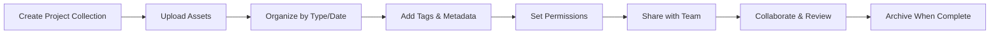
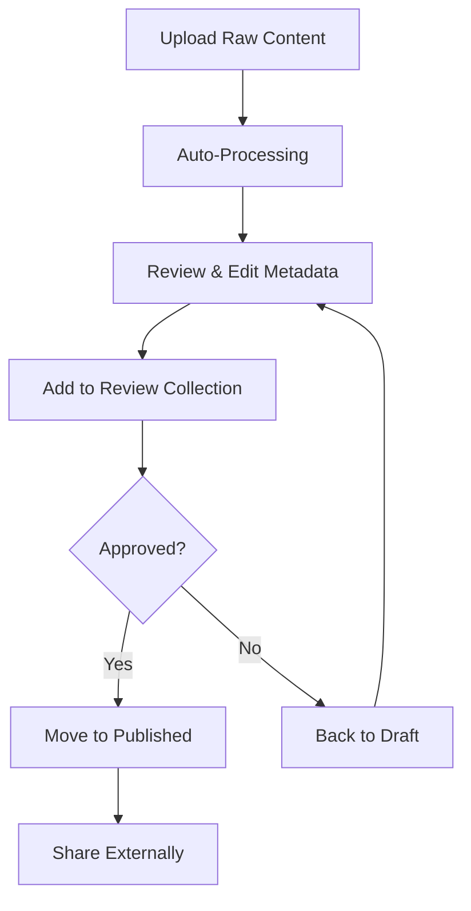

# User Guides

Learn how to make the most of MediaNest with our comprehensive user guides. Whether you're managing a personal media library or coordinating assets for a large team, these guides will help you master MediaNest's features.

## Getting the Most from MediaNest

- :material-image-multiple: **Media Management**

  ***

  Master the fundamentals of uploading, organizing, and managing your media files.

  [Media Management Guide →](media-management.md)

- :material-folder-multiple: **File Organization**

  ***

  Learn advanced organization techniques, folder structures, and automated workflows.

  [Organization Guide →](file-organization.md)

- :material-magnify: **Search & Filtering**

  ***

  Discover powerful search capabilities and filtering options to find media quickly.

  [Search Guide →](search-filtering.md)

- :material-tag-multiple: **Metadata Management**

  ***

  Understand how to use tags, custom fields, and automated metadata extraction.

  [Metadata Guide →](metadata.md)

- :material-folder-heart: **Collections**

  ***

  Create and manage collections to group related media for projects and campaigns.

  [Collections Guide →](collections.md)

- :material-share-variant: **Sharing & Permissions**

  ***

  Learn how to share media securely with team members and external collaborators.

  [Sharing Guide →](sharing.md)

- :material-backup-restore: **Backup & Sync**

  ***

  Set up automated backups and synchronization across multiple locations.

  [Backup Guide →](backup-sync.md)

## Quick Reference

### Essential Tasks

| Task                  | Quick Action                   | Guide                                                   |
| --------------------- | ------------------------------ | ------------------------------------------------------- |
| **Upload Media**      | Drag & drop to main interface  | [Media Management](media-management.md#uploading)       |
| **Create Collection** | Click "+" in Collections panel | [Collections](collections.md#creating)                  |
| **Search Media**      | Use search bar or Ctrl+F       | [Search & Filtering](search-filtering.md)               |
| **Add Tags**          | Select media → Add Tags panel  | [Metadata](metadata.md#tagging)                         |
| **Share Collection**  | Collection menu → Share        | [Sharing](sharing.md#collections)                       |
| **Bulk Edit**         | Select multiple → Actions menu | [Media Management](media-management.md#bulk-operations) |

### Keyboard Shortcuts

| Action             | Shortcut       | Context          |
| ------------------ | -------------- | ---------------- |
| **Search**         | `Ctrl/Cmd + F` | Global           |
| **Upload**         | `Ctrl/Cmd + U` | Global           |
| **New Collection** | `Ctrl/Cmd + N` | Collections view |
| **Delete**         | `Del`          | Selected media   |
| **Select All**     | `Ctrl/Cmd + A` | Media grid       |
| **Slideshow**      | `F5`           | Media view       |
| **Fullscreen**     | `F11`          | Media preview    |

## User Personas & Workflows

### Content Creator

**Goal**: Manage creative assets efficiently

**Workflow**:

1. Upload raw footage and images
2. Organize by project using collections
3. Add descriptive tags and metadata
4. Share work-in-progress with clients
5. Archive completed projects

**Key Features**: Collections, sharing, metadata, version control

### Team Collaborator

**Goal**: Coordinate media assets across team members

**Workflow**:

1. Access shared team collections
2. Download approved assets
3. Upload new content for review
4. Comment on media for feedback
5. Track version history

**Key Features**: Permissions, comments, notifications, version control

### Marketing Manager

**Goal**: Organize campaign assets and ensure brand consistency

**Workflow**:

1. Create campaign-specific collections
2. Set up approval workflows
3. Manage brand asset library
4. Track asset usage and performance
5. Archive completed campaigns

**Key Features**: Collections, workflows, usage tracking, analytics

### IT Administrator

**Goal**: Maintain system security and performance

**Workflow**:

1. Monitor system health and usage
2. Manage user accounts and permissions
3. Configure backup and sync settings
4. Optimize storage and performance
5. Handle security and compliance

**Key Features**: User management, system monitoring, backup, security

## Common Workflows

### Project-Based Organization

### Content Publishing Pipeline

## Tips for Success

### Organization Best Practices

1. **Use Consistent Naming**: Develop naming conventions for files and collections
2. **Tag Early and Often**: Add tags during upload for better searchability
3. **Create Template Collections**: Set up reusable collection structures
4. **Regular Cleanup**: Archive or delete unused media periodically

### Collaboration Tips

1. **Set Clear Permissions**: Define who can view, edit, and share media
2. **Use Comments**: Provide feedback directly on media files
3. **Version Control**: Keep track of different versions of the same file
4. **Regular Communication**: Use notifications to stay informed of changes

### Performance Optimization

1. **Optimize File Sizes**: Balance quality and file size for better performance
2. **Use Collections**: Group related media to reduce search scope
3. **Regular Maintenance**: Clean up tags and metadata regularly
4. **Monitor Usage**: Keep an eye on storage and bandwidth usage

## Advanced Features

### Automation

- **Auto-tagging**: AI-powered tag suggestions
- **Smart Collections**: Dynamic collections based on criteria
- **Batch Operations**: Process multiple files simultaneously
- **Scheduled Tasks**: Automate repetitive workflows

### Integration

- **API Access**: Connect external applications
- **Webhook Notifications**: Real-time event notifications
- **Third-party Plugins**: Extend functionality
- **Export/Import**: Move data between systems

### Analytics

- **Usage Reports**: Track how media is being used
- **Performance Metrics**: Monitor system performance
- **User Activity**: See who's accessing what
- **Storage Analytics**: Optimize storage usage

## Support Resources

### Getting Help

- **Search Documentation**: Use the search feature to find specific topics
- **Check FAQ**: Common questions and answers
- **Community Forum**: Connect with other users
- **Support Tickets**: Direct help for specific issues

### Learning Resources

- **Video Tutorials**: Step-by-step visual guides
- **Webinar Recordings**: Deep-dive feature explanations
- **Best Practices**: Learn from successful implementations
- **Case Studies**: See how others use MediaNest

---

Ready to dive deeper? Start with [Media Management](media-management.md) to learn the basics, or jump to any specific guide that matches your needs!
