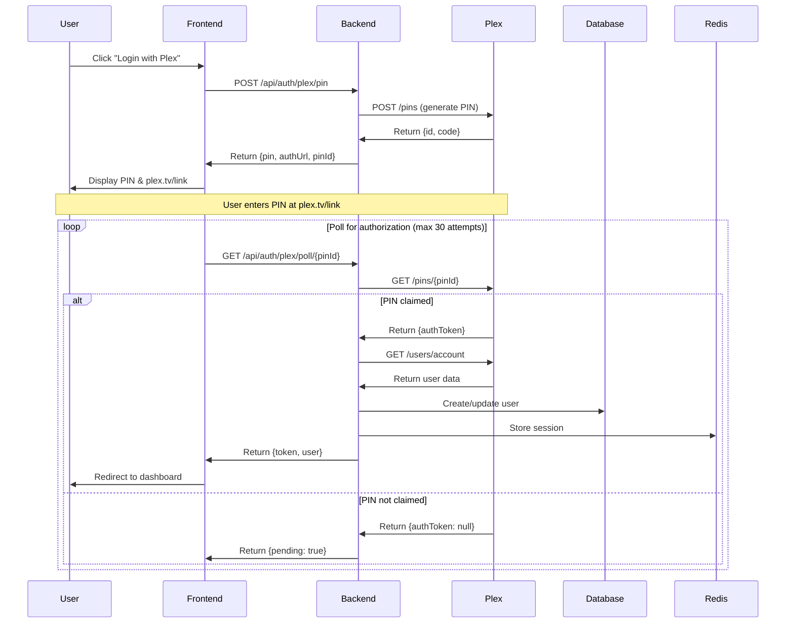
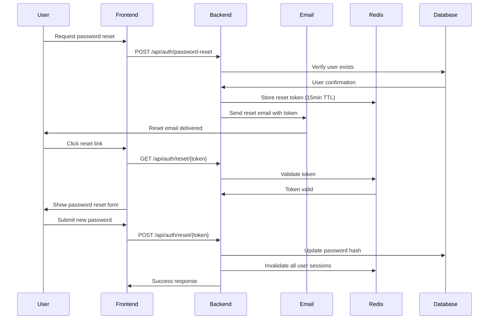

# MediaNest Authentication Architecture and Implementation Guide

**Version:** 2.0  
**Date:** January 2025  
**Status:** Enhanced - System Architecture Review Complete  

## Table of Contents

1. [Overview](#1-overview)
2. [Architecture Design](#2-architecture-design)
3. [Technology Stack](#3-technology-stack)
4. [Authentication Flow](#4-authentication-flow)
5. [Implementation Details](#5-implementation-details)
6. [Security Measures](#6-security-measures)
7. [Session Management](#7-session-management)
8. [Role-Based Access Control](#8-role-based-access-control)
9. [API Authentication](#9-api-authentication)
10. [Enhanced Security Features](#10-enhanced-security-features)
11. [Scalability Architecture](#11-scalability-architecture)
12. [Integration Patterns](#12-integration-patterns)
13. [Code Examples](#13-code-examples)
14. [Testing Strategy](#14-testing-strategy)
15. [Migration Strategy](#15-migration-strategy)
16. [Troubleshooting](#16-troubleshooting)

## 1. Overview

MediaNest's authentication system is designed to provide secure, seamless access for 10-20 concurrent users while integrating with Plex's OAuth PIN flow. The architecture prioritizes security, user experience, and maintainability.

### Key Features

- **Primary Authentication**: Plex OAuth PIN flow with enhanced security
- **Admin Bootstrap**: Initial admin/admin login with forced password change
- **Session Management**: JWT tokens with Redis-backed sessions and automatic cleanup
- **Remember Me**: 90-day persistent authentication with rotation
- **Role-Based Access**: Admin and User roles with granular permissions
- **API Security**: JWT-protected endpoints with sophisticated rate limiting
- **Enhanced Security**: Password reset flows, email verification, 2FA readiness
- **Multi-Provider Support**: Architecture ready for GitHub, Google OAuth
- **Audit Logging**: Comprehensive authentication event tracking
- **Scalability**: Distributed session management and horizontal scaling support

### Design Principles

1. **Security First**: All sensitive data encrypted, tokens rotated regularly, zero-trust architecture
2. **User-Friendly**: Single sign-on with Plex credentials, fallback authentication methods
3. **Stateless API**: JWT tokens for horizontal scalability with Redis session coordination
4. **Graceful Degradation**: System functions even if external auth providers are unavailable
5. **Enterprise-Ready**: Audit trails, compliance features, and administrative controls
6. **Future-Proof**: Modular architecture supporting additional authentication methods
7. **Performance**: Optimized for 10-20 users with ability to scale to 100+

## 2. Architecture Design

```
┌─────────────────────────────────────────────────────────────┐
│                   Authentication Flow                        │
├─────────────────────────────────────────────────────────────┤
│                                                             │
│  ┌──────────┐    ┌──────────────┐    ┌──────────────────┐ │
│  │  Client  │───►│  Next.js App │───►│ Express Backend  │ │
│  │ Browser  │    │  (Frontend)  │    │     (API)        │ │
│  └──────────┘    └──────────────┘    └──────────────────┘ │
│        │                 │                     │            │
│        │                 │                     │            │
│        │         ┌───────▼────────┐           │            │
│        │         │  NextAuth.js   │           │            │
│        │         │  (Auth Layer)  │           │            │
│        │         └───────┬────────┘           │            │
│        │                 │                     │            │
│        │         ┌───────▼────────┐    ┌──────▼────────┐  │
│        └────────►│   Plex OAuth   │    │ JWT Manager   │  │
│                  │   (PIN Flow)   │    │  (Express)    │  │
│                  └────────────────┘    └───────────────┘  │
│                                                │            │
│                                        ┌───────▼────────┐  │
│                                        │     Redis      │  │
│                                        │ (Session Store)│  │
│                                        └────────────────┘  │
└─────────────────────────────────────────────────────────────┘
```

### Component Responsibilities

- **NextAuth.js**: Manages authentication flows, session creation, and provider integration
- **Plex OAuth**: Handles PIN-based authentication without client secrets
- **JWT Manager**: Issues and validates API tokens
- **Redis**: Stores sessions, rate limits, and remember tokens

## 3. Technology Stack

### Core Dependencies

```json
{
  "dependencies": {
    "next-auth": "^5.x",
    "@auth/prisma-adapter": "^2.x",
    "jsonwebtoken": "^9.x",
    "bcryptjs": "^2.x",
    "ioredis": "^5.x"
  }
}
```

### Key Libraries

- **NextAuth.js**: Authentication framework for Next.js
- **Prisma**: Database ORM with type safety
- **jsonwebtoken**: JWT token generation and validation
- **bcryptjs**: Password hashing for admin bootstrap
- **ioredis**: Redis client for session management

## 4. Authentication Flow

### 4.1 Plex OAuth PIN Flow



### 4.2 Admin Bootstrap Flow

```javascript
// First-run admin creation
if (firstRun && credentials.username === 'admin' && credentials.password === 'admin') {
  const hashedPassword = await bcrypt.hash(credentials.password, 10);
  const adminUser = await prisma.user.create({
    data: {
      email: 'admin@medianest.local',
      role: 'admin',
      plex_username: 'admin',
      password: hashedPassword,
      isBootstrap: true
    }
  });
  // Force password change on next login
  return { ...adminUser, requirePasswordChange: true };
}
```

## 5. Implementation Details

### 5.1 NextAuth.js Configuration

```typescript
// app/api/auth/[...nextauth]/route.ts
import NextAuth from "next-auth";
import type { NextAuthOptions } from "next-auth";
import { PrismaAdapter } from "@auth/prisma-adapter";
import CredentialsProvider from "next-auth/providers/credentials";
import { prisma } from "@/lib/prisma";
import { PlexProvider } from "./providers/plex";

export const authOptions: NextAuthOptions = {
  adapter: PrismaAdapter(prisma),
  session: {
    strategy: "jwt",
    maxAge: 30 * 24 * 60 * 60, // 30 days
  },
  providers: [
    PlexProvider({
      clientId: process.env.PLEX_CLIENT_ID!,
      clientName: "MediaNest",
    }),
    CredentialsProvider({
      id: "admin-bootstrap",
      name: "Admin Bootstrap",
      credentials: {
        username: { label: "Username", type: "text" },
        password: { label: "Password", type: "password" },
      },
      async authorize(credentials) {
        // Admin bootstrap logic
        if (await isFirstRun()) {
          return handleAdminBootstrap(credentials);
        }
        return null;
      },
    }),
  ],
  callbacks: {
    async jwt({ token, user, account, trigger, session }) {
      // Initial sign in
      if (account && user) {
        return {
          ...token,
          accessToken: account.access_token,
          refreshToken: account.refresh_token,
          userId: user.id,
          role: user.role,
          plexToken: account.plexToken,
        };
      }

      // Update session
      if (trigger === "update" && session) {
        token = { ...token, ...session };
      }

      // Return previous token if no update
      return token;
    },
    async session({ session, token }) {
      return {
        ...session,
        user: {
          ...session.user,
          id: token.userId,
          role: token.role,
        },
        accessToken: token.accessToken,
        error: token.error,
      };
    },
  },
  pages: {
    signIn: "/auth/signin",
    error: "/auth/error",
  },
  events: {
    async signIn({ user, account }) {
      // Log successful sign-ins
      await prisma.auditLog.create({
        data: {
          userId: user.id,
          action: "SIGN_IN",
          ipAddress: account?.ip_address,
        },
      });
    },
  },
};

const handler = NextAuth(authOptions);
export { handler as GET, handler as POST };
```

### 5.2 Custom Plex Provider Implementation

```typescript
// app/api/auth/[...nextauth]/providers/plex.ts
import type { OAuthConfig, OAuthUserConfig } from "next-auth/providers";
import { PlexUser } from "@/types/auth";

export function PlexProvider(
  options: OAuthUserConfig<PlexUser>
): OAuthConfig<PlexUser> {
  return {
    id: "plex",
    name: "Plex",
    type: "oauth",
    authorization: {
      url: "https://app.plex.tv/auth#",
      params: {
        clientID: options.clientId,
        code: "{PIN_CODE}", // Dynamically replaced
      },
    },
    token: {
      // Custom token handling for PIN flow
      async request({ params }) {
        const token = await pollForPlexToken(params.pinId, options.clientId);
        return { tokens: { access_token: token } };
      },
    },
    userinfo: {
      url: "https://plex.tv/users/account",
      async request({ tokens }) {
        const response = await fetch("https://plex.tv/users/account", {
          headers: {
            Accept: "application/json",
            "X-Plex-Token": tokens.access_token!,
          },
        });
        return response.json();
      },
    },
    profile(profile) {
      return {
        id: profile.uuid,
        name: profile.username,
        email: profile.email,
        image: profile.thumb,
        role: "user", // Default role
      };
    },
    style: {
      logo: "/images/plex-logo.svg",
      bg: "#1f2937",
      text: "#ffffff",
    },
    options,
  };
}
```

### 5.3 PIN Flow API Routes

```typescript
// app/api/auth/plex/pin/route.ts
import { NextResponse } from "next/server";
import { generatePlexPin } from "@/lib/plex";

export async function POST() {
  try {
    const { id, code, authUrl } = await generatePlexPin({
      clientId: process.env.PLEX_CLIENT_ID!,
      clientName: "MediaNest",
      device: "MediaNest Web",
    });

    return NextResponse.json({
      pinId: id,
      pin: code,
      authUrl,
      expiresIn: 900, // 15 minutes
    });
  } catch (error) {
    return NextResponse.json(
      { error: "Failed to generate PIN" },
      { status: 500 }
    );
  }
}

// app/api/auth/plex/poll/[pinId]/route.ts
export async function GET(
  request: Request,
  { params }: { params: { pinId: string } }
) {
  try {
    const token = await checkPlexPin(params.pinId);
    
    if (token) {
      // PIN claimed, fetch user data
      const userData = await getPlexUser(token);
      
      // Create NextAuth session
      const session = await createSession({
        user: userData,
        token,
      });

      return NextResponse.json({
        success: true,
        token,
        user: userData,
        sessionToken: session.sessionToken,
      });
    }

    return NextResponse.json({
      success: false,
      pending: true,
    });
  } catch (error) {
    return NextResponse.json(
      { error: "Polling failed" },
      { status: 500 }
    );
  }
}
```

### 5.4 Remember Me Implementation

```typescript
// lib/auth/remember-me.ts
import crypto from "crypto";
import { Redis } from "ioredis";

const redis = new Redis(process.env.REDIS_URL!);
const REMEMBER_TOKEN_TTL = 90 * 24 * 60 * 60; // 90 days

export async function createRememberToken(userId: string): Promise<string> {
  const token = crypto.randomBytes(32).toString("hex");
  const hashedToken = crypto
    .createHash("sha256")
    .update(token)
    .digest("hex");

  await redis.setex(
    `remember:${hashedToken}`,
    REMEMBER_TOKEN_TTL,
    JSON.stringify({
      userId,
      createdAt: new Date().toISOString(),
    })
  );

  return token;
}

export async function validateRememberToken(token: string) {
  const hashedToken = crypto
    .createHash("sha256")
    .update(token)
    .digest("hex");

  const data = await redis.get(`remember:${hashedToken}`);
  if (!data) return null;

  // Rotate token on use
  await redis.del(`remember:${hashedToken}`);
  const { userId } = JSON.parse(data);
  
  const newToken = await createRememberToken(userId);
  return { userId, newToken };
}
```

## 6. Security Measures

### 6.1 Token Security

```typescript
// lib/security/tokens.ts
import jwt from "jsonwebtoken";
import crypto from "crypto";

const JWT_SECRET = process.env.JWT_SECRET!;
const ENCRYPTION_KEY = process.env.ENCRYPTION_KEY!;

interface TokenPayload {
  userId: string;
  role: string;
  sessionId: string;
  iat?: number;
  exp?: number;
}

export function generateAccessToken(payload: TokenPayload): string {
  return jwt.sign(payload, JWT_SECRET, {
    expiresIn: "1h",
    issuer: "medianest",
    audience: "medianest-api",
  });
}

export function generateRefreshToken(): string {
  return crypto.randomBytes(32).toString("base64url");
}

export function encryptSensitiveData(data: string): string {
  const algorithm = "aes-256-gcm";
  const iv = crypto.randomBytes(16);
  const cipher = crypto.createCipheriv(
    algorithm,
    Buffer.from(ENCRYPTION_KEY, "hex"),
    iv
  );

  let encrypted = cipher.update(data, "utf8", "hex");
  encrypted += cipher.final("hex");

  const authTag = cipher.getAuthTag();

  return JSON.stringify({
    encrypted,
    iv: iv.toString("hex"),
    authTag: authTag.toString("hex"),
  });
}
```

### 6.2 Rate Limiting

```typescript
// middleware/rateLimiter.ts
import { Redis } from "ioredis";
import { NextRequest, NextResponse } from "next/server";

const redis = new Redis(process.env.REDIS_URL!);

interface RateLimitConfig {
  windowMs: number;
  max: number;
  keyPrefix: string;
}

export function createRateLimiter(config: RateLimitConfig) {
  return async function rateLimiter(req: NextRequest, userId: string) {
    const key = `${config.keyPrefix}:${userId}`;
    const now = Date.now();
    const windowStart = now - config.windowMs;

    // Use Redis sorted set for sliding window
    const pipe = redis.pipeline();
    pipe.zremrangebyscore(key, "-inf", windowStart);
    pipe.zadd(key, now, `${now}-${Math.random()}`);
    pipe.zcard(key);
    pipe.expire(key, Math.ceil(config.windowMs / 1000));
    
    const results = await pipe.exec();
    const count = results?.[2]?.[1] as number;

    if (count > config.max) {
      const oldestRequest = await redis.zrange(key, 0, 0, "WITHSCORES");
      const resetTime = parseInt(oldestRequest[1]) + config.windowMs;
      
      return NextResponse.json(
        {
          error: "Too many requests",
          retryAfter: Math.ceil((resetTime - now) / 1000),
        },
        {
          status: 429,
          headers: {
            "Retry-After": Math.ceil((resetTime - now) / 1000).toString(),
            "X-RateLimit-Limit": config.max.toString(),
            "X-RateLimit-Remaining": "0",
            "X-RateLimit-Reset": new Date(resetTime).toISOString(),
          },
        }
      );
    }

    return null; // Request allowed
  };
}

// Usage
export const apiRateLimiter = createRateLimiter({
  windowMs: 60 * 1000, // 1 minute
  max: 100,
  keyPrefix: "rate:api",
});

export const authRateLimiter = createRateLimiter({
  windowMs: 15 * 60 * 1000, // 15 minutes
  max: 5,
  keyPrefix: "rate:auth",
});
```

### 6.3 CSRF Protection

```typescript
// lib/security/csrf.ts
import crypto from "crypto";

export function generateCSRFToken(): string {
  return crypto.randomBytes(32).toString("hex");
}

export function validateCSRFToken(token: string, sessionToken: string): boolean {
  // Implement double-submit cookie pattern
  const expectedToken = crypto
    .createHmac("sha256", process.env.CSRF_SECRET!)
    .update(sessionToken)
    .digest("hex");
    
  return crypto.timingSafeEqual(
    Buffer.from(token),
    Buffer.from(expectedToken)
  );
}
```

## 7. Session Management

### 7.1 Session Store Implementation

```typescript
// lib/session/store.ts
import { Redis } from "ioredis";
import { nanoid } from "nanoid";

const redis = new Redis(process.env.REDIS_URL!);
const SESSION_TTL = 30 * 24 * 60 * 60; // 30 days

export interface Session {
  id: string;
  userId: string;
  role: string;
  plexToken?: string;
  createdAt: Date;
  expiresAt: Date;
  lastActivityAt: Date;
  ipAddress?: string;
  userAgent?: string;
}

export class SessionStore {
  async create(data: Omit<Session, "id" | "createdAt" | "expiresAt">): Promise<Session> {
    const session: Session = {
      ...data,
      id: nanoid(),
      createdAt: new Date(),
      expiresAt: new Date(Date.now() + SESSION_TTL * 1000),
      lastActivityAt: new Date(),
    };

    await redis.setex(
      `session:${session.id}`,
      SESSION_TTL,
      JSON.stringify(session)
    );

    // Track active sessions per user
    await redis.sadd(`user:sessions:${data.userId}`, session.id);

    return session;
  }

  async get(sessionId: string): Promise<Session | null> {
    const data = await redis.get(`session:${sessionId}`);
    if (!data) return null;

    const session = JSON.parse(data);
    
    // Update last activity
    session.lastActivityAt = new Date();
    await redis.setex(
      `session:${sessionId}`,
      SESSION_TTL,
      JSON.stringify(session)
    );

    return session;
  }

  async revoke(sessionId: string): Promise<void> {
    const session = await this.get(sessionId);
    if (session) {
      await redis.del(`session:${sessionId}`);
      await redis.srem(`user:sessions:${session.userId}`, sessionId);
    }
  }

  async revokeAllUserSessions(userId: string): Promise<void> {
    const sessionIds = await redis.smembers(`user:sessions:${userId}`);
    
    if (sessionIds.length > 0) {
      const pipeline = redis.pipeline();
      sessionIds.forEach(id => pipeline.del(`session:${id}`));
      pipeline.del(`user:sessions:${userId}`);
      await pipeline.exec();
    }
  }
}
```

### 7.2 Session Middleware

```typescript
// middleware/session.ts
import { NextRequest, NextResponse } from "next/server";
import { verifyJWT } from "@/lib/auth/jwt";
import { SessionStore } from "@/lib/session/store";

const sessionStore = new SessionStore();

export async function sessionMiddleware(request: NextRequest) {
  const token = request.headers.get("authorization")?.replace("Bearer ", "");
  
  if (!token) {
    return NextResponse.json(
      { error: "Unauthorized" },
      { status: 401 }
    );
  }

  try {
    const payload = await verifyJWT(token);
    const session = await sessionStore.get(payload.sessionId);

    if (!session) {
      return NextResponse.json(
        { error: "Session expired" },
        { status: 401 }
      );
    }

    // Attach session to request
    const requestHeaders = new Headers(request.headers);
    requestHeaders.set("x-user-id", session.userId);
    requestHeaders.set("x-user-role", session.role);
    requestHeaders.set("x-session-id", session.id);

    return NextResponse.next({
      request: {
        headers: requestHeaders,
      },
    });
  } catch (error) {
    return NextResponse.json(
      { error: "Invalid token" },
      { status: 401 }
    );
  }
}
```

## 8. Role-Based Access Control

### 8.1 Role Definitions

```typescript
// types/auth.ts
export enum UserRole {
  ADMIN = "admin",
  USER = "user",
}

export interface Permission {
  resource: string;
  actions: string[];
}

export const rolePermissions: Record<UserRole, Permission[]> = {
  [UserRole.ADMIN]: [
    { resource: "users", actions: ["create", "read", "update", "delete"] },
    { resource: "services", actions: ["create", "read", "update", "delete"] },
    { resource: "settings", actions: ["read", "update"] },
    { resource: "youtube", actions: ["create", "read", "update", "delete"] },
    { resource: "requests", actions: ["read", "update", "delete"] },
  ],
  [UserRole.USER]: [
    { resource: "profile", actions: ["read", "update"] },
    { resource: "youtube", actions: ["create", "read"] },
    { resource: "requests", actions: ["create", "read"] },
    { resource: "services", actions: ["read"] },
  ],
};
```

### 8.2 Authorization Middleware

```typescript
// middleware/authorization.ts
import { NextRequest, NextResponse } from "next/server";
import { rolePermissions, UserRole } from "@/types/auth";

export function requirePermission(resource: string, action: string) {
  return async function authorize(request: NextRequest) {
    const userRole = request.headers.get("x-user-role") as UserRole;
    
    if (!userRole) {
      return NextResponse.json(
        { error: "Unauthorized" },
        { status: 401 }
      );
    }

    const permissions = rolePermissions[userRole];
    const hasPermission = permissions.some(
      p => p.resource === resource && p.actions.includes(action)
    );

    if (!hasPermission) {
      return NextResponse.json(
        { error: "Forbidden" },
        { status: 403 }
      );
    }

    return NextResponse.next();
  };
}

// Usage in API routes
export async function GET(request: NextRequest) {
  const authResult = await requirePermission("users", "read")(request);
  if (authResult.status !== 200) return authResult;
  
  // Handle request...
}
```

### 8.3 Frontend Authorization

```typescript
// hooks/useAuthorization.ts
import { useSession } from "next-auth/react";
import { rolePermissions } from "@/types/auth";

export function useAuthorization() {
  const { data: session } = useSession();

  const can = (resource: string, action: string): boolean => {
    if (!session?.user?.role) return false;

    const permissions = rolePermissions[session.user.role];
    return permissions.some(
      p => p.resource === resource && p.actions.includes(action)
    );
  };

  const isAdmin = (): boolean => {
    return session?.user?.role === "admin";
  };

  return { can, isAdmin, role: session?.user?.role };
}

// Usage in components
export function AdminPanel() {
  const { can, isAdmin } = useAuthorization();

  if (!isAdmin()) {
    return <div>Access Denied</div>;
  }

  return (
    <div>
      {can("users", "create") && <CreateUserButton />}
      {can("settings", "update") && <SettingsForm />}
    </div>
  );
}
```

## 9. API Authentication

### 9.1 API Token Management

```typescript
// backend/src/services/authService.ts
import jwt from "jsonwebtoken";
import { Redis } from "ioredis";

export class AuthService {
  private redis: Redis;
  private jwtSecret: string;

  constructor() {
    this.redis = new Redis(process.env.REDIS_URL!);
    this.jwtSecret = process.env.JWT_SECRET!;
  }

  async generateAPITokens(userId: string, role: string) {
    const accessToken = jwt.sign(
      {
        sub: userId,
        role,
        type: "access",
      },
      this.jwtSecret,
      {
        expiresIn: "1h",
        issuer: "medianest-api",
      }
    );

    const refreshToken = jwt.sign(
      {
        sub: userId,
        type: "refresh",
      },
      this.jwtSecret,
      {
        expiresIn: "30d",
      }
    );

    // Store refresh token in Redis
    await this.redis.setex(
      `refresh:${userId}:${refreshToken}`,
      30 * 24 * 60 * 60,
      JSON.stringify({
        userId,
        createdAt: new Date().toISOString(),
      })
    );

    return { accessToken, refreshToken };
  }

  async refreshAccessToken(refreshToken: string) {
    try {
      const decoded = jwt.verify(refreshToken, this.jwtSecret) as any;
      
      if (decoded.type !== "refresh") {
        throw new Error("Invalid token type");
      }

      // Check if refresh token exists in Redis
      const exists = await this.redis.exists(
        `refresh:${decoded.sub}:${refreshToken}`
      );

      if (!exists) {
        throw new Error("Refresh token revoked");
      }

      // Get user details
      const user = await this.getUserById(decoded.sub);
      
      // Generate new access token
      const accessToken = jwt.sign(
        {
          sub: user.id,
          role: user.role,
          type: "access",
        },
        this.jwtSecret,
        {
          expiresIn: "1h",
          issuer: "medianest-api",
        }
      );

      return { accessToken };
    } catch (error) {
      throw new Error("Invalid refresh token");
    }
  }
}
```

### 9.2 Express JWT Middleware

```typescript
// backend/src/middleware/auth.ts
import { Request, Response, NextFunction } from "express";
import jwt from "jsonwebtoken";
import { AuthService } from "../services/authService";

declare global {
  namespace Express {
    interface Request {
      user?: {
        id: string;
        role: string;
      };
    }
  }
}

const authService = new AuthService();

export async function authenticateToken(
  req: Request,
  res: Response,
  next: NextFunction
) {
  const authHeader = req.headers["authorization"];
  const token = authHeader && authHeader.split(" ")[1];

  if (!token) {
    return res.status(401).json({ error: "Access token required" });
  }

  try {
    const decoded = jwt.verify(
      token,
      process.env.JWT_SECRET!
    ) as any;

    if (decoded.type !== "access") {
      throw new Error("Invalid token type");
    }

    req.user = {
      id: decoded.sub,
      role: decoded.role,
    };

    next();
  } catch (error) {
    if (error.name === "TokenExpiredError") {
      return res.status(401).json({ 
        error: "Token expired",
        code: "TOKEN_EXPIRED" 
      });
    }
    
    return res.status(403).json({ error: "Invalid token" });
  }
}

export function requireRole(role: string) {
  return (req: Request, res: Response, next: NextFunction) => {
    if (req.user?.role !== role) {
      return res.status(403).json({ 
        error: "Insufficient permissions" 
      });
    }
    next();
  };
}
```

## 10. Enhanced Security Features

### 10.1 Password Reset Architecture

#### Secure Password Reset Flow


#### Implementation
```typescript
// lib/auth/password-reset.ts
import crypto from 'crypto';
import { getRedisClient } from '../redis/redis-client';
import { prisma } from '../db/prisma';
import { sendPasswordResetEmail } from '../email/templates';

const RESET_TOKEN_TTL = 15 * 60; // 15 minutes
const MAX_RESET_ATTEMPTS = 3;

export class PasswordResetService {
  private redis = getRedisClient();

  async requestPasswordReset(email: string): Promise<boolean> {
    // Check rate limiting
    const attemptKey = `pwd_reset_attempts:${email}`;
    const attempts = await this.redis.get(attemptKey);
    
    if (attempts && parseInt(attempts) >= MAX_RESET_ATTEMPTS) {
      throw new Error('Too many reset attempts. Please try again later.');
    }

    // Verify user exists
    const user = await prisma.user.findUnique({ where: { email } });
    if (!user) {
      // Don't reveal if email exists - always return success
      return true;
    }

    // Generate secure token
    const resetToken = crypto.randomBytes(32).toString('hex');
    const tokenHash = crypto.createHash('sha256').update(resetToken).digest('hex');

    // Store token in Redis
    const tokenKey = `pwd_reset_token:${tokenHash}`;
    await this.redis.setex(tokenKey, RESET_TOKEN_TTL, JSON.stringify({
      userId: user.id,
      email: user.email,
      createdAt: new Date().toISOString()
    }));

    // Track attempt
    await this.redis.incr(attemptKey);
    await this.redis.expire(attemptKey, 3600); // 1 hour window

    // Send email
    await sendPasswordResetEmail(user.email, resetToken);

    return true;
  }

  async validateResetToken(token: string): Promise<{ userId: string; email: string } | null> {
    const tokenHash = crypto.createHash('sha256').update(token).digest('hex');
    const tokenKey = `pwd_reset_token:${tokenHash}`;

    const tokenData = await this.redis.get(tokenKey);
    if (!tokenData) {
      return null;
    }

    return JSON.parse(tokenData);
  }

  async resetPassword(token: string, newPassword: string): Promise<boolean> {
    const tokenData = await this.validateResetToken(token);
    if (!tokenData) {
      throw new Error('Invalid or expired reset token');
    }

    // Hash new password
    const bcrypt = await import('bcryptjs');
    const hashedPassword = await bcrypt.hash(newPassword, 12);

    // Update password in database
    await prisma.user.update({
      where: { id: tokenData.userId },
      data: { 
        password: hashedPassword,
        // Force password change flag off
        requiresPasswordChange: false,
        // Update password changed timestamp
        passwordChangedAt: new Date()
      }
    });

    // Invalidate all user sessions
    await this.invalidateUserSessions(tokenData.userId);

    // Remove reset token
    const tokenHash = crypto.createHash('sha256').update(token).digest('hex');
    await this.redis.del(`pwd_reset_token:${tokenHash}`);

    return true;
  }

  private async invalidateUserSessions(userId: string): Promise<void> {
    // Get all user sessions from Redis
    const sessionKeys = await this.redis.keys(`session:*`);
    
    for (const sessionKey of sessionKeys) {
      const sessionData = await this.redis.get(sessionKey);
      if (sessionData) {
        const session = JSON.parse(sessionData);
        if (session.user?.id === userId) {
          await this.redis.del(sessionKey);
        }
      }
    }
  }
}
```

### 10.2 Email Verification System

#### Email Verification Architecture
```typescript
// lib/auth/email-verification.ts
export class EmailVerificationService {
  private redis = getRedisClient();

  async sendVerificationEmail(userId: string, email: string): Promise<void> {
    // Generate verification token
    const verificationToken = crypto.randomBytes(32).toString('hex');
    const tokenHash = crypto.createHash('sha256').update(verificationToken).digest('hex');

    // Store token with 24-hour expiry
    const tokenKey = `email_verify:${tokenHash}`;
    await this.redis.setex(tokenKey, 24 * 60 * 60, JSON.stringify({
      userId,
      email,
      createdAt: new Date().toISOString()
    }));

    // Send verification email
    await sendEmailVerificationEmail(email, verificationToken);
  }

  async verifyEmail(token: string): Promise<boolean> {
    const tokenHash = crypto.createHash('sha256').update(token).digest('hex');
    const tokenKey = `email_verify:${tokenHash}`;

    const tokenData = await this.redis.get(tokenKey);
    if (!tokenData) {
      return false;
    }

    const { userId, email } = JSON.parse(tokenData);

    // Update user as verified
    await prisma.user.update({
      where: { id: userId },
      data: { 
        emailVerified: new Date(),
        email: email
      }
    });

    // Remove verification token
    await this.redis.del(tokenKey);

    return true;
  }
}
```

### 10.3 Multi-Factor Authentication (2FA) Architecture

#### 2FA Implementation Framework
```typescript
// lib/auth/two-factor.ts
import { authenticator } from 'otplib';
import QRCode from 'qrcode';

export class TwoFactorService {
  async generateTwoFactorSecret(userId: string): Promise<{
    secret: string;
    qrCodeUrl: string;
    backupCodes: string[];
  }> {
    const secret = authenticator.generateSecret();
    const user = await prisma.user.findUnique({ where: { id: userId } });
    
    if (!user) throw new Error('User not found');

    // Generate QR code
    const otpUrl = authenticator.keyuri(
      user.email,
      'MediaNest',
      secret
    );
    const qrCodeUrl = await QRCode.toDataURL(otpUrl);

    // Generate backup codes
    const backupCodes = Array.from({ length: 10 }, () =>
      crypto.randomBytes(4).toString('hex').toUpperCase()
    );

    // Store encrypted secret and backup codes
    const encryptedSecret = await this.encryptTwoFactorData({
      secret,
      backupCodes
    });

    await prisma.user.update({
      where: { id: userId },
      data: {
        twoFactorSecret: encryptedSecret,
        twoFactorEnabled: false // Not enabled until verified
      }
    });

    return { secret, qrCodeUrl, backupCodes };
  }

  async enableTwoFactor(userId: string, token: string): Promise<boolean> {
    const user = await prisma.user.findUnique({ where: { id: userId } });
    if (!user?.twoFactorSecret) return false;

    const decryptedData = await this.decryptTwoFactorData(user.twoFactorSecret);
    const isValid = authenticator.verify({ token, secret: decryptedData.secret });

    if (isValid) {
      await prisma.user.update({
        where: { id: userId },
        data: { twoFactorEnabled: true }
      });
      return true;
    }

    return false;
  }

  async verifyTwoFactor(userId: string, token: string): Promise<boolean> {
    const user = await prisma.user.findUnique({ where: { id: userId } });
    if (!user?.twoFactorSecret || !user.twoFactorEnabled) return false;

    const decryptedData = await this.decryptTwoFactorData(user.twoFactorSecret);

    // Check TOTP token
    if (authenticator.verify({ token, secret: decryptedData.secret })) {
      return true;
    }

    // Check backup codes
    const backupCodeIndex = decryptedData.backupCodes.indexOf(token.toUpperCase());
    if (backupCodeIndex !== -1) {
      // Remove used backup code
      decryptedData.backupCodes.splice(backupCodeIndex, 1);
      
      const encryptedData = await this.encryptTwoFactorData(decryptedData);
      await prisma.user.update({
        where: { id: userId },
        data: { twoFactorSecret: encryptedData }
      });
      
      return true;
    }

    return false;
  }

  private async encryptTwoFactorData(data: any): Promise<string> {
    // Implement AES-256-GCM encryption
    const algorithm = 'aes-256-gcm';
    const key = Buffer.from(process.env.TWO_FACTOR_ENCRYPTION_KEY!, 'hex');
    const iv = crypto.randomBytes(16);
    
    const cipher = crypto.createCipheriv(algorithm, key, iv);
    let encrypted = cipher.update(JSON.stringify(data), 'utf8', 'hex');
    encrypted += cipher.final('hex');
    
    const authTag = cipher.getAuthTag();
    
    return JSON.stringify({
      encrypted,
      iv: iv.toString('hex'),
      authTag: authTag.toString('hex')
    });
  }

  private async decryptTwoFactorData(encryptedData: string): Promise<any> {
    const { encrypted, iv, authTag } = JSON.parse(encryptedData);
    const algorithm = 'aes-256-gcm';
    const key = Buffer.from(process.env.TWO_FACTOR_ENCRYPTION_KEY!, 'hex');
    
    const decipher = crypto.createDecipheriv(algorithm, key, Buffer.from(iv, 'hex'));
    decipher.setAuthTag(Buffer.from(authTag, 'hex'));
    
    let decrypted = decipher.update(encrypted, 'hex', 'utf8');
    decrypted += decipher.final('utf8');
    
    return JSON.parse(decrypted);
  }
}
```

## 11. Scalability Architecture

### 11.1 Distributed Session Management

#### Session Clustering Strategy
```typescript
// lib/auth/distributed-session.ts
export class DistributedSessionManager {
  private redis = getRedisClient();

  async storeSession(sessionToken: string, sessionData: SessionData, nodeId: string): Promise<void> {
    const pipeline = this.redis.pipeline();
    
    // Store session data
    const sessionKey = `session:${sessionToken}`;
    pipeline.setex(sessionKey, SESSION_TTL, JSON.stringify({
      ...sessionData,
      nodeId,
      lastAccessed: new Date().toISOString()
    }));

    // Update node session count
    const nodeKey = `node:${nodeId}:sessions`;
    pipeline.sadd(nodeKey, sessionToken);
    pipeline.expire(nodeKey, SESSION_TTL);

    // Update global session registry
    pipeline.zadd('global:active_sessions', Date.now(), sessionToken);

    await pipeline.exec();
  }

  async getSessionWithLoadBalancing(sessionToken: string): Promise<SessionData | null> {
    const sessionData = await this.redis.get(`session:${sessionToken}`);
    if (!sessionData) return null;

    const parsed = JSON.parse(sessionData);
    
    // Update access patterns for load balancing
    await this.redis.zadd('session:access_patterns', Date.now(), sessionToken);
    
    return parsed;
  }

  async redistributeSessions(): Promise<void> {
    // Get all active nodes
    const nodes = await this.redis.keys('node:*:sessions');
    const sessionCounts: Record<string, number> = {};

    // Count sessions per node
    for (const nodeKey of nodes) {
      const nodeId = nodeKey.split(':')[1];
      const sessionCount = await this.redis.scard(nodeKey);
      sessionCounts[nodeId] = sessionCount;
    }

    // Identify overloaded nodes and redistribute
    const avgSessions = Object.values(sessionCounts).reduce((a, b) => a + b, 0) / nodes.length;
    
    for (const [nodeId, count] of Object.entries(sessionCounts)) {
      if (count > avgSessions * 1.5) {
        await this.redistributeNodeSessions(nodeId, count - Math.floor(avgSessions));
      }
    }
  }

  private async redistributeNodeSessions(overloadedNodeId: string, sessionsToMove: number): Promise<void> {
    // Implementation for moving sessions to less loaded nodes
    const sessionsToRedistribute = await this.redis.srandmember(
      `node:${overloadedNodeId}:sessions`,
      sessionsToMove
    );

    // Find least loaded node
    const targetNode = await this.findLeastLoadedNode();
    
    for (const sessionToken of sessionsToRedistribute) {
      await this.moveSession(sessionToken, overloadedNodeId, targetNode);
    }
  }
}
```

### 11.2 Horizontal Scaling Architecture

#### API Gateway Pattern
```typescript
// lib/gateway/auth-gateway.ts
export class AuthenticationGateway {
  private nodes: Array<{ id: string; url: string; weight: number }> = [];
  private healthCheck = new Map<string, boolean>();

  async routeAuthRequest(request: AuthRequest): Promise<AuthResponse> {
    // Select optimal node based on load and health
    const selectedNode = await this.selectOptimalNode(request.type);
    
    if (!selectedNode) {
      throw new Error('No healthy authentication nodes available');
    }

    try {
      // Forward request to selected node
      const response = await this.forwardRequest(selectedNode, request);
      
      // Update node health status
      this.healthCheck.set(selectedNode.id, true);
      
      return response;
    } catch (error) {
      // Mark node as unhealthy and retry
      this.healthCheck.set(selectedNode.id, false);
      
      const fallbackNode = await this.selectFallbackNode(selectedNode.id);
      if (fallbackNode) {
        return this.forwardRequest(fallbackNode, request);
      }
      
      throw error;
    }
  }

  private async selectOptimalNode(requestType: string): Promise<AuthNode | null> {
    // Implement weighted round-robin with health checks
    const healthyNodes = this.nodes.filter(node => 
      this.healthCheck.get(node.id) !== false
    );

    if (healthyNodes.length === 0) return null;

    // For auth-heavy operations, prefer nodes with auth specialization
    if (requestType === 'plex-oauth') {
      const plexSpecializedNodes = healthyNodes.filter(node => 
        node.capabilities?.includes('plex-oauth')
      );
      if (plexSpecializedNodes.length > 0) {
        return this.weightedSelection(plexSpecializedNodes);
      }
    }

    return this.weightedSelection(healthyNodes);
  }

  async performHealthChecks(): Promise<void> {
    const healthPromises = this.nodes.map(async node => {
      try {
        const response = await fetch(`${node.url}/health`, { 
          timeout: 5000 
        });
        this.healthCheck.set(node.id, response.ok);
      } catch {
        this.healthCheck.set(node.id, false);
      }
    });

    await Promise.allSettled(healthPromises);
  }
}
```

## 12. Integration Patterns

### 12.1 Multi-Provider OAuth Architecture

#### OAuth Provider Registry
```typescript
// lib/auth/oauth-registry.ts
export class OAuthProviderRegistry {
  private providers = new Map<string, OAuthProviderConfig>();

  registerProvider(name: string, config: OAuthProviderConfig): void {
    this.providers.set(name, {
      ...config,
      enabled: config.enabled ?? true,
      priority: config.priority ?? 0
    });
  }

  async authenticateWithProvider(
    provider: string, 
    credentials: any
  ): Promise<AuthResult> {
    const providerConfig = this.providers.get(provider);
    if (!providerConfig || !providerConfig.enabled) {
      throw new Error(`Provider ${provider} not available`);
    }

    const authHandler = this.getProviderHandler(provider);
    return authHandler.authenticate(credentials);
  }

  getAvailableProviders(): Array<{ name: string; displayName: string; icon: string }> {
    return Array.from(this.providers.entries())
      .filter(([, config]) => config.enabled)
      .sort(([, a], [, b]) => b.priority - a.priority)
      .map(([name, config]) => ({
        name,
        displayName: config.displayName,
        icon: config.icon
      }));
  }

  // Provider-specific handlers
  private getProviderHandler(provider: string): AuthProviderHandler {
    switch (provider) {
      case 'plex':
        return new PlexOAuthHandler();
      case 'github':
        return new GitHubOAuthHandler();
      case 'google':
        return new GoogleOAuthHandler();
      default:
        throw new Error(`Unsupported provider: ${provider}`);
    }
  }
}

// Initialize providers
const oauthRegistry = new OAuthProviderRegistry();

oauthRegistry.registerProvider('plex', {
  displayName: 'Plex',
  icon: 'plex-icon',
  priority: 100,
  enabled: true,
  clientId: process.env.AUTH_PLEX_CLIENT_ID!,
  clientSecret: process.env.AUTH_PLEX_CLIENT_SECRET!
});

oauthRegistry.registerProvider('github', {
  displayName: 'GitHub',
  icon: 'github-icon',
  priority: 50,
  enabled: !!process.env.AUTH_GITHUB_CLIENT_ID,
  clientId: process.env.AUTH_GITHUB_CLIENT_ID!,
  clientSecret: process.env.AUTH_GITHUB_CLIENT_SECRET!
});
```

### 12.2 Audit Trail Implementation

#### Comprehensive Audit Logging
```typescript
// lib/audit/audit-logger.ts
export class AuditLogger {
  private redis = getRedisClient();

  async logAuthEvent(event: AuthAuditEvent): Promise<void> {
    const auditEntry: AuditEntry = {
      id: crypto.randomUUID(),
      timestamp: new Date().toISOString(),
      eventType: event.type,
      userId: event.userId,
      sessionId: event.sessionId,
      ipAddress: event.ipAddress,
      userAgent: event.userAgent,
      details: event.details,
      success: event.success,
      risk_score: await this.calculateRiskScore(event)
    };

    // Store in both Redis (for recent events) and database (for long-term storage)
    await Promise.all([
      this.storeInRedis(auditEntry),
      this.storeInDatabase(auditEntry)
    ]);

    // Check for suspicious patterns
    await this.checkSuspiciousActivity(auditEntry);
  }

  private async calculateRiskScore(event: AuthAuditEvent): Promise<number> {
    let riskScore = 0;

    // Failed authentication attempts
    if (!event.success) {
      riskScore += 10;
    }

    // Multiple IPs for same user
    const userIPs = await this.redis.smembers(`user_ips:${event.userId}`);
    if (userIPs.length > 3) {
      riskScore += 20;
    }

    // Unusual time patterns
    const hour = new Date().getHours();
    if (hour < 6 || hour > 23) {
      riskScore += 5;
    }

    // Geographic anomalies (if IP geolocation available)
    const previousLocation = await this.redis.get(`user_location:${event.userId}`);
    if (previousLocation && event.location && 
        this.calculateDistance(previousLocation, event.location) > 1000) {
      riskScore += 15;
    }

    return Math.min(riskScore, 100);
  }

  async getAuditTrail(
    userId: string, 
    options: { limit?: number; startDate?: Date; endDate?: Date }
  ): Promise<AuditEntry[]> {
    return prisma.auditEntry.findMany({
      where: {
        userId,
        timestamp: {
          gte: options.startDate,
          lte: options.endDate
        }
      },
      orderBy: { timestamp: 'desc' },
      take: options.limit ?? 50
    });
  }

  async detectAnomalies(): Promise<SecurityAnomaly[]> {
    // Implement ML-based anomaly detection
    const anomalies: SecurityAnomaly[] = [];

    // Check for brute force patterns
    const recentFailures = await this.redis.hgetall('auth_failures');
    for (const [ip, failures] of Object.entries(recentFailures)) {
      if (parseInt(failures) > 10) {
        anomalies.push({
          type: 'brute_force',
          severity: 'high',
          details: { ip, failures: parseInt(failures) },
          timestamp: new Date()
        });
      }
    }

    return anomalies;
  }
}
```

## 14. Testing Strategy

### 14.1 Authentication Testing Framework

#### Test Categories
1. **Unit Tests**: Authentication service logic, token generation/validation
2. **Integration Tests**: OAuth flows, session management, database operations
3. **Security Tests**: Penetration testing, vulnerability scanning
4. **Performance Tests**: Session load testing, concurrent authentication
5. **E2E Tests**: Complete user authentication journeys

#### Sample Test Implementation
```typescript
// tests/auth/plex-oauth.test.ts
describe('Plex OAuth Authentication', () => {
  it('should complete PIN-based OAuth flow', async () => {
    const authService = new PlexOAuthService();
    
    // Generate PIN
    const pin = await authService.generatePin();
    expect(pin.code).toHaveLength(4);
    
    // Simulate PIN verification
    const mockPlexResponse = {
      authToken: 'test-token',
      user: { id: '123', email: 'test@example.com' }
    };
    
    jest.spyOn(authService, 'verifyPin')
      .mockResolvedValue(mockPlexResponse);
    
    // Complete authentication
    const result = await authService.authenticate(pin.id);
    expect(result.user.email).toBe('test@example.com');
  });
});
```

## 15. Migration Strategy

### 15.1 Current State Assessment

Based on analysis of the existing codebase, the current implementation includes:

**✅ Already Implemented:**
- NextAuth.js 4.x integration
- Plex OAuth provider with PIN flow
- Redis session storage
- Admin bootstrap functionality
- Basic role-based access control
- JWT token management

**🔧 Needs Enhancement:**
- Password reset functionality
- Email verification system
- 2FA/MFA implementation
- Multi-provider OAuth support
- Audit logging system
- Enhanced rate limiting

### 15.2 Migration Phases

#### Phase 1: Core Security Enhancements (Week 1-2)
```typescript
// Migration checklist
const phase1Tasks = [
  'Implement password reset service',
  'Add email verification system',
  'Enhance rate limiting with Redis Lua scripts',
  'Implement comprehensive audit logging',
  'Add session security improvements'
];
```

#### Phase 2: Multi-Factor Authentication (Week 3-4)
```typescript
const phase2Tasks = [
  'Implement TOTP-based 2FA',
  'Add backup codes system',
  'Create 2FA enrollment UI',
  'Add 2FA verification middleware',
  'Implement 2FA recovery flows'
];
```

#### Phase 3: Scalability & Multi-Provider (Week 5-6)
```typescript
const phase3Tasks = [
  'Add GitHub OAuth provider',
  'Implement distributed session management',
  'Add API gateway patterns',
  'Implement horizontal scaling support',
  'Add performance monitoring'
];
```

### 15.3 Database Schema Updates

#### Required Schema Additions
```sql
-- Add new columns to existing users table
ALTER TABLE users ADD COLUMN IF NOT EXISTS password VARCHAR(255);
ALTER TABLE users ADD COLUMN IF NOT EXISTS email_verified TIMESTAMP;
ALTER TABLE users ADD COLUMN IF NOT EXISTS two_factor_secret TEXT;
ALTER TABLE users ADD COLUMN IF NOT EXISTS two_factor_enabled BOOLEAN DEFAULT FALSE;
ALTER TABLE users ADD COLUMN IF NOT EXISTS password_changed_at TIMESTAMP;

-- Create audit log table
CREATE TABLE IF NOT EXISTS audit_entries (
  id UUID PRIMARY KEY DEFAULT gen_random_uuid(),
  user_id UUID REFERENCES users(id),
  event_type VARCHAR(100) NOT NULL,
  ip_address INET,
  user_agent TEXT,
  success BOOLEAN NOT NULL,
  risk_score INTEGER DEFAULT 0,
  details JSONB,
  created_at TIMESTAMP DEFAULT CURRENT_TIMESTAMP
);

-- Create session management table (backup to Redis)
CREATE TABLE IF NOT EXISTS user_sessions (
  id UUID PRIMARY KEY DEFAULT gen_random_uuid(),
  user_id UUID REFERENCES users(id),
  session_token VARCHAR(255) UNIQUE NOT NULL,
  expires_at TIMESTAMP NOT NULL,
  ip_address INET,
  user_agent TEXT,
  created_at TIMESTAMP DEFAULT CURRENT_TIMESTAMP,
  last_accessed TIMESTAMP DEFAULT CURRENT_TIMESTAMP
);

-- Indexes for performance
CREATE INDEX idx_audit_entries_user_id ON audit_entries(user_id);
CREATE INDEX idx_audit_entries_created_at ON audit_entries(created_at);
CREATE INDEX idx_user_sessions_user_id ON user_sessions(user_id);
CREATE INDEX idx_user_sessions_expires_at ON user_sessions(expires_at);
```

### 15.4 Environment Variables Update

#### New Environment Variables
```bash
# Enhanced security
TWO_FACTOR_ENCRYPTION_KEY=32-byte-hex-key
PASSWORD_RESET_TOKEN_TTL=900  # 15 minutes
EMAIL_VERIFICATION_TTL=86400  # 24 hours

# Multi-provider OAuth
AUTH_GITHUB_CLIENT_ID=github-client-id
AUTH_GITHUB_CLIENT_SECRET=github-client-secret
AUTH_GOOGLE_CLIENT_ID=google-client-id
AUTH_GOOGLE_CLIENT_SECRET=google-client-secret

# Email service
SMTP_HOST=smtp.example.com
SMTP_PORT=587
SMTP_USER=noreply@medianest.com
SMTP_PASS=smtp-password
EMAIL_FROM=noreply@medianest.com

# Audit and monitoring
AUDIT_LOG_RETENTION_DAYS=365
SECURITY_ALERT_EMAIL=admin@medianest.com
```

## 16. Troubleshooting

### 16.1 Common Issues and Solutions

#### Authentication Flow Issues
```typescript
// Debug authentication issues
export class AuthDebugger {
  async diagnoseAuthIssue(sessionToken: string): Promise<DiagnosticReport> {
    const report: DiagnosticReport = {
      timestamp: new Date(),
      sessionToken: sessionToken?.substring(0, 8) + '...',
      issues: []
    };

    // Check session existence
    const sessionExists = await this.redis.exists(`session:${sessionToken}`);
    if (!sessionExists) {
      report.issues.push({
        type: 'session_not_found',
        severity: 'high',
        description: 'Session does not exist in Redis'
      });
    }

    // Check JWT validity
    try {
      const decoded = jwt.verify(sessionToken, process.env.JWT_SECRET!);
      report.jwtPayload = decoded;
    } catch (error) {
      report.issues.push({
        type: 'invalid_jwt',
        severity: 'high',
        description: `JWT validation failed: ${error.message}`
      });
    }

    // Check user existence
    if (report.jwtPayload?.sub) {
      const user = await prisma.user.findUnique({
        where: { id: report.jwtPayload.sub }
      });
      
      if (!user) {
        report.issues.push({
          type: 'user_not_found',
          severity: 'high',
          description: 'User referenced in JWT does not exist'
        });
      }
    }

    return report;
  }
}
```

#### Session Management Issues
```typescript
// Session cleanup and diagnostics
export class SessionDiagnostics {
  async cleanupOrphanedSessions(): Promise<number> {
    const redis = getRedisClient();
    let cleaned = 0;

    // Find all session keys
    const sessionKeys = await redis.keys('session:*');
    
    for (const sessionKey of sessionKeys) {
      const sessionData = await redis.get(sessionKey);
      
      if (!sessionData) continue;

      try {
        const session = JSON.parse(sessionData);
        
        // Check if user still exists
        const user = await prisma.user.findUnique({
          where: { id: session.user?.id }
        });

        if (!user) {
          await redis.del(sessionKey);
          cleaned++;
        }
      } catch (error) {
        // Invalid session data, remove it
        await redis.del(sessionKey);
        cleaned++;
      }
    }

    return cleaned;
  }

  async getSessionStats(): Promise<SessionStats> {
    const redis = getRedisClient();
    
    const totalSessions = await redis.dbsize();
    const activeSessions = await redis.zcard('global:active_sessions');
    const nodeSessionCounts = await this.getNodeSessionCounts();
    
    return {
      totalSessions,
      activeSessions,
      nodeDistribution: nodeSessionCounts,
      memoryUsage: await this.getRedisMemoryUsage()
    };
  }
}
```

#### Performance Troubleshooting
```typescript
// Performance monitoring and optimization
export class AuthPerformanceMonitor {
  async analyzeAuthPerformance(): Promise<PerformanceReport> {
    const redis = getRedisClient();
    
    // Measure Redis response times
    const redisLatency = await this.measureRedisLatency();
    
    // Check database connection pool
    const dbStats = await this.getDatabaseStats();
    
    // Analyze session access patterns
    const sessionPatterns = await this.analyzeSessionPatterns();
    
    return {
      redisLatency,
      databaseStats: dbStats,
      sessionPatterns,
      recommendations: this.generateRecommendations({
        redisLatency,
        dbStats,
        sessionPatterns
      })
    };
  }

  private async measureRedisLatency(): Promise<number> {
    const redis = getRedisClient();
    const start = Date.now();
    
    await redis.ping();
    
    return Date.now() - start;
  }

  private generateRecommendations(stats: any): string[] {
    const recommendations: string[] = [];
    
    if (stats.redisLatency > 10) {
      recommendations.push('Consider Redis optimization or scaling');
    }
    
    if (stats.dbStats.activeConnections > 15) {
      recommendations.push('Consider increasing database connection pool');
    }
    
    if (stats.sessionPatterns.averageSessionDuration < 300) {
      recommendations.push('Consider adjusting session timeout settings');
    }
    
    return recommendations;
  }
}
```

## 13. Code Examples

```typescript
// app/auth/signin/page.tsx
"use client";

import { useState, useEffect } from "react";
import { signIn } from "next-auth/react";
import { useRouter } from "next/navigation";

export default function SignInPage() {
  const router = useRouter();
  const [isLoading, setIsLoading] = useState(false);
  const [pinData, setPinData] = useState<{
    pin: string;
    authUrl: string;
    pinId: string;
    expiresAt: Date;
  } | null>(null);

  async function initiatePlexLogin() {
    setIsLoading(true);
    
    try {
      const response = await fetch("/api/auth/plex/pin", {
        method: "POST",
      });
      
      const data = await response.json();
      
      setPinData({
        ...data,
        expiresAt: new Date(Date.now() + data.expiresIn * 1000),
      });

      // Open Plex auth page in new tab
      window.open(data.authUrl, "_blank");

      // Start polling
      pollForAuthentication(data.pinId);
    } catch (error) {
      console.error("Failed to initiate Plex login:", error);
      setIsLoading(false);
    }
  }

  async function pollForAuthentication(pinId: string) {
    const maxAttempts = 60; // 5 minutes
    let attempts = 0;

    const pollInterval = setInterval(async () => {
      attempts++;

      try {
        const response = await fetch(`/api/auth/plex/poll/${pinId}`);
        const data = await response.json();

        if (data.success) {
          clearInterval(pollInterval);
          
          // Sign in with NextAuth using the token
          const result = await signIn("plex", {
            token: data.token,
            redirect: false,
          });

          if (result?.ok) {
            router.push("/dashboard");
          } else {
            console.error("Sign in failed:", result?.error);
          }
        } else if (attempts >= maxAttempts) {
          clearInterval(pollInterval);
          setPinData(null);
          setIsLoading(false);
          alert("Authentication timeout. Please try again.");
        }
      } catch (error) {
        console.error("Polling error:", error);
        clearInterval(pollInterval);
        setIsLoading(false);
      }
    }, 5000); // Poll every 5 seconds
  }

  return (
    <div className="flex min-h-screen items-center justify-center">
      <div className="w-full max-w-md space-y-8 rounded-lg bg-white p-6 shadow-lg">
        <div className="text-center">
          <h2 className="text-3xl font-bold">Sign in to MediaNest</h2>
          <p className="mt-2 text-gray-600">
            Use your Plex account to sign in
          </p>
        </div>

        {!pinData ? (
          <button
            onClick={initiatePlexLogin}
            disabled={isLoading}
            className="w-full rounded-md bg-orange-600 px-4 py-2 text-white hover:bg-orange-700 disabled:opacity-50"
          >
            {isLoading ? "Loading..." : "Sign in with Plex"}
          </button>
        ) : (
          <div className="space-y-4">
            <div className="rounded-lg bg-gray-100 p-4">
              <p className="text-sm text-gray-600">
                Enter this PIN on plex.tv:
              </p>
              <p className="mt-2 text-center text-4xl font-bold tracking-wider">
                {pinData.pin}
              </p>
            </div>
            
            <div className="text-center text-sm text-gray-600">
              <p>Waiting for authentication...</p>
              <p>
                Expires in{" "}
                {Math.max(
                  0,
                  Math.floor(
                    (pinData.expiresAt.getTime() - Date.now()) / 1000
                  )
                )}{" "}
                seconds
              </p>
            </div>

            <a
              href={pinData.authUrl}
              target="_blank"
              rel="noopener noreferrer"
              className="block w-full rounded-md border border-gray-300 px-4 py-2 text-center text-gray-700 hover:bg-gray-50"
            >
              Open plex.tv/link
            </a>
          </div>
        )}
      </div>
    </div>
  );
}
```

### 10.2 Protected API Route

```typescript
// app/api/admin/users/route.ts
import { NextRequest, NextResponse } from "next/server";
import { getServerSession } from "next-auth";
import { authOptions } from "@/app/api/auth/[...nextauth]/route";
import { prisma } from "@/lib/prisma";

export async function GET(request: NextRequest) {
  // Verify session
  const session = await getServerSession(authOptions);
  
  if (!session) {
    return NextResponse.json(
      { error: "Unauthorized" },
      { status: 401 }
    );
  }

  // Check admin role
  if (session.user.role !== "admin") {
    return NextResponse.json(
      { error: "Forbidden" },
      { status: 403 }
    );
  }

  try {
    const users = await prisma.user.findMany({
      select: {
        id: true,
        email: true,
        plex_username: true,
        role: true,
        status: true,
        created_at: true,
        last_login_at: true,
      },
    });

    return NextResponse.json({ users });
  } catch (error) {
    return NextResponse.json(
      { error: "Failed to fetch users" },
      { status: 500 }
    );
  }
}
```

### 10.3 Client-Side Protected Component

```typescript
// components/ProtectedContent.tsx
"use client";

import { useSession } from "next-auth/react";
import { redirect } from "next/navigation";
import { useAuthorization } from "@/hooks/useAuthorization";

interface ProtectedContentProps {
  children: React.ReactNode;
  resource?: string;
  action?: string;
  fallback?: React.ReactNode;
}

export function ProtectedContent({
  children,
  resource,
  action,
  fallback = <div>Access Denied</div>,
}: ProtectedContentProps) {
  const { data: session, status } = useSession({
    required: true,
    onUnauthenticated() {
      redirect("/auth/signin");
    },
  });

  const { can } = useAuthorization();

  if (status === "loading") {
    return <div>Loading...</div>;
  }

  if (resource && action && !can(resource, action)) {
    return <>{fallback}</>;
  }

  return <>{children}</>;
}
```

## 11. Testing Strategy

### 11.1 Unit Tests

```typescript
// __tests__/auth/plex.test.ts
import { describe, it, expect, vi } from "vitest";
import { generatePlexPin, pollForPlexToken } from "@/lib/plex";

describe("Plex Authentication", () => {
  it("should generate a valid PIN", async () => {
    const mockResponse = {
      id: "123",
      code: "ABCD",
      authToken: null,
    };

    vi.mocked(fetch).mockResolvedValueOnce({
      ok: true,
      json: async () => mockResponse,
    } as Response);

    const result = await generatePlexPin({
      clientId: "test-client",
      clientName: "Test App",
    });

    expect(result).toEqual({
      id: "123",
      code: "ABCD",
      authUrl: expect.stringContaining("ABCD"),
    });
  });

  it("should poll for token successfully", async () => {
    const mockResponses = [
      { authToken: null }, // First poll - not ready
      { authToken: null }, // Second poll - not ready
      { authToken: "test-token" }, // Third poll - success
    ];

    let callCount = 0;
    vi.mocked(fetch).mockImplementation(async () => ({
      ok: true,
      json: async () => mockResponses[callCount++],
    } as Response));

    const token = await pollForPlexToken("123", "test-client");
    expect(token).toBe("test-token");
    expect(fetch).toHaveBeenCalledTimes(3);
  });
});
```

### 11.2 Integration Tests

```typescript
// __tests__/api/auth.test.ts
import { createMocks } from "node-mocks-http";
import { POST as signInHandler } from "@/app/api/auth/[...nextauth]/route";

describe("/api/auth/[...nextauth]", () => {
  it("should handle Plex sign in", async () => {
    const { req, res } = createMocks({
      method: "POST",
      body: {
        csrfToken: "test-csrf",
        callbackUrl: "/dashboard",
      },
    });

    await signInHandler(req, res);

    expect(res._getStatusCode()).toBe(200);
    const json = JSON.parse(res._getData());
    expect(json).toHaveProperty("url");
  });
});
```

## 12. Troubleshooting

### Common Issues and Solutions

#### 1. PIN Expires Before User Authenticates
**Problem**: User takes too long to enter PIN  
**Solution**: 
- Increase polling duration in client
- Add countdown timer to UI
- Implement PIN refresh mechanism

#### 2. Session Expires Unexpectedly
**Problem**: Users complaining about frequent logouts  
**Solution**:
- Check Redis connection stability
- Verify JWT expiration settings
- Implement session refresh on activity

#### 3. Rate Limiting Too Aggressive
**Problem**: Legitimate users hitting rate limits  
**Solution**:
```typescript
// Implement graduated rate limiting
const rateLimits = {
  unauthenticated: { windowMs: 60000, max: 20 },
  authenticated: { windowMs: 60000, max: 100 },
  admin: { windowMs: 60000, max: 500 },
};
```

#### 4. Plex Token Invalid
**Problem**: Stored Plex tokens becoming invalid  
**Solution**:
- Implement token validation on each use
- Add automatic re-authentication flow
- Monitor Plex API changes

### Debug Logging

```typescript
// lib/auth/debug.ts
import winston from "winston";

const authLogger = winston.createLogger({
  level: process.env.NODE_ENV === "production" ? "info" : "debug",
  format: winston.format.json(),
  transports: [
    new winston.transports.Console({
      format: winston.format.simple(),
    }),
  ],
});

export function logAuthEvent(event: string, data: any) {
  authLogger.info("AUTH_EVENT", {
    event,
    timestamp: new Date().toISOString(),
    ...data,
  });
}
```

## Conclusion

This authentication architecture provides a secure, scalable foundation for MediaNest. The implementation leverages industry best practices while accommodating the unique requirements of Plex's PIN-based OAuth flow. Regular security audits and monitoring will ensure the system remains robust as the application evolves.

### Key Takeaways

1. **Security First**: Every component implements defense in depth
2. **User Experience**: Seamless authentication with familiar Plex credentials
3. **Scalability**: Stateless design supports horizontal scaling
4. **Maintainability**: Clear separation of concerns and comprehensive testing

For additional support or questions, refer to the MediaNest development documentation or contact the technical team.