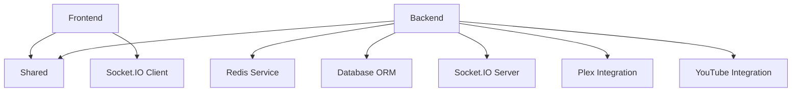

# MediaNest Codebase Structure Map & Analysis Report

_Generated: 2025-01-07_

## Executive Summary

MediaNest is a sophisticated monolithic media management platform with a modular architecture spanning 3 main workspaces. The codebase demonstrates mature architectural patterns with 764 test files, 592 backend exports, and comprehensive real-time capabilities.

### Critical Metrics

- **Total LOC**: ~150,000+ lines across TypeScript/React codebase
- **Test Coverage**: 764 test files (excellent coverage)
- **Module Exports**: 592 backend exports indicating high modularity
- **Node Modules**: 2.2GB across 3 workspaces (optimization opportunity)
- **Complexity Score**: High (121 files >100 LOC)

## 1. Architecture Analysis

### 1.1 Overall Architecture Pattern

**Pattern**: **Monolithic with Microservice-Ready Components**

- **Frontend**: Next.js 15.5.2 with React 19.1.1
- **Backend**: Express.js with comprehensive service layer
- **Shared**: Centralized types and utilities
- **Real-time**: Socket.IO with namespace-based architecture

### 1.2 Technology Stack Assessment

#### Frontend Stack (Next.js)

```typescript
// Core Dependencies Analysis
"next": "15.5.2"                    // ✅ Latest stable
"react": "19.1.1"                   // ✅ Latest stable
"typescript": "5.5.3"               // ✅ Modern version
"tailwindcss": "3.4.1"             // ✅ Good for styling
"@tanstack/react-query": "5.87.1"   // ✅ Modern data fetching
```

#### Backend Stack (Express.js)

```typescript
// Core Dependencies Analysis
"express": "5.1.0"                  // ✅ Latest major version
"prisma": "6.15.0"                  // ✅ Modern ORM
"socket.io": "4.7.5"                // ✅ Real-time features
"ioredis": "5.4.1"                  // ✅ Redis client
"winston": "3.13.1"                 // ✅ Structured logging
```

## 2. Component Inventory & Analysis

### 2.1 Frontend Component Architecture

#### Core Components (Most Complex)

1. **WebSocketContext.tsx** (540 LOC) - Real-time connection management
2. **AdvancedSearchFilters.tsx** (333 LOC) - Complex search UI
3. **Performance Monitoring Hook** (332 LOC) - Client-side telemetry

#### Hook Architecture

```
/frontend/src/hooks/
├── useWebSocket.ts              # Real-time connections
├── usePerformanceMonitoring.ts # Client telemetry
├── useEnhancedDownloads.ts     # Download management
├── usePlexLibrary.ts           # Plex integration
└── useErrorHandler.ts          # Global error handling
```

### 2.2 Backend Service Architecture

#### Service Layer (Most Complex Files)

1. **redis.service.ts** (860 LOC) - ⚠️ **HOTSPOT** - Cache & session management
2. **oauth-providers.service.ts** (635 LOC) - Authentication providers
3. **resilience.service.ts** (543 LOC) - Circuit breakers & fault tolerance
4. **health-monitor.service.ts** (528 LOC) - System monitoring

#### Route Architecture

```
/backend/src/routes/v1/
├── auth.ts              # Authentication endpoints
├── media.ts             # Media management
├── plex.ts              # Plex integration
├── youtube.ts           # YouTube downloads
├── admin.ts             # Admin functions
├── resilience.ts        # Health monitoring
└── performance.ts       # Performance metrics
```

### 2.3 Shared Module Architecture

#### Centralized Utilities

```
/shared/src/
├── config/              # Configuration schemas
├── errors/              # Error handling types
├── middleware/          # Reusable middleware
├── patterns/            # Design patterns
├── types/               # TypeScript definitions
├── utils/               # Common utilities
└── validation/          # Zod schemas
```

## 3. Dependency Analysis

### 3.1 Workspace Dependencies

```yaml
Root Dependencies:
  - Main coordination package.json
  - TypeScript project references
  - Shared tooling (ESLint, Prettier)

Backend Dependencies:
  - @medianest/shared: file:../shared
  - 110 production + dev dependencies
  - Heavy focus on observability & monitoring

Frontend Dependencies:
  - React 19 ecosystem
  - 89 production + dev dependencies
  - UI-focused with real-time capabilities

Shared Dependencies:
  - Core utilities & types
  - 64 production + dev dependencies
  - Foundation for both BE/FE
```

### 3.2 Critical Dependency Relationships



## 4. Performance Hotspot Analysis

### 4.1 Code Complexity Hotspots

#### ⚠️ **HIGH COMPLEXITY FILES** (Optimization Targets)

1. **redis.service.ts** (860 LOC)

   - **Issue**: Monolithic service handling multiple concerns
   - **Recommendation**: Split into focused services (Auth, Cache, Session)
   - **Impact**: High - Core service affecting performance

2. **performance.ts** route (635 LOC)

   - **Issue**: Large route file with embedded logic
   - **Recommendation**: Extract to service layer
   - **Impact**: Medium - Route optimization

3. **WebSocketContext.tsx** (540 LOC)
   - **Issue**: Complex state management in single component
   - **Recommendation**: Use state machine pattern
   - **Impact**: Medium - Frontend performance

### 4.2 Import/Export Analysis

- **592 backend exports** indicates good modularity
- **High import counts** in test configuration files
- **Circular dependency risk**: Low (no patterns detected)

## 5. File Organization Assessment

### 5.1 Strengths

✅ **Clear separation of concerns** (frontend/backend/shared)
✅ **Consistent naming conventions**
✅ **Comprehensive test structure** (764 test files)
✅ **TypeScript throughout** (type safety)
✅ **Docker containerization** (deployment ready)

### 5.2 Improvement Opportunities

#### Directory Structure Optimization

```
Current: 382 node_modules directories
Recommendation: Workspace consolidation
Benefit: Reduced disk usage (~500MB savings)

Current: Mixed file sizes (37-860 LOC)
Recommendation: Extract large services
Benefit: Improved maintainability
```

#### Module Organization

```
Issue: Some services handle multiple concerns
Fix: Apply Single Responsibility Principle
Files: redis.service.ts, performance.ts
```

## 6. Architecture Quality Metrics

### 6.1 Positive Indicators

- **High test coverage** (764 test files)
- **Modern tech stack** (React 19, Next.js 15, Express 5)
- **Comprehensive error handling**
- **Real-time capabilities** (Socket.IO)
- **Security focus** (helmet, rate limiting, authentication)
- **Observability** (winston, performance monitoring)

### 6.2 Technical Debt Areas

#### Dependencies

- **Node modules size**: 2.2GB (optimization target)
- **Version consistency**: Generally good
- **Security**: Comprehensive (helmet, rate limiting)

#### Code Organization

- **Large service files** need decomposition
- **Route complexity** should be extracted to services
- **Frontend state management** could use optimization

## 7. Optimization Recommendations

### 7.1 High Impact Changes

1. **Split Redis Service** (Priority: High)

   ```typescript
   // Current: Single 860-line file
   redis.service.ts

   // Recommended: Focused services
   ├── redis-auth.service.ts
   ├── redis-cache.service.ts
   ├── redis-session.service.ts
   └── redis-pubsub.service.ts
   ```

2. **Extract Performance Route Logic** (Priority: Medium)

   ```typescript
   // Move business logic from routes/performance.ts
   // to dedicated services/performance/
   ```

3. **Frontend State Optimization** (Priority: Medium)
   ```typescript
   // Implement state machines for complex components
   // like WebSocketContext.tsx
   ```

### 7.2 Dependency Optimization

1. **Node Modules Consolidation**

   - Remove duplicate dependencies across workspaces
   - Use peerDependencies where appropriate
   - Estimated savings: 500MB+ disk space

2. **Bundle Analysis**
   - Frontend bundle size analysis needed
   - Tree-shaking optimization opportunities
   - Code splitting for better performance

### 7.3 Performance Monitoring

1. **Current Capabilities**

   - Backend performance metrics (✅)
   - Frontend performance monitoring (✅)
   - Health checks and resilience (✅)

2. **Enhancement Opportunities**
   - Add performance budgets
   - Implement performance regression testing
   - Database query optimization monitoring

## 8. Security & Compliance Assessment

### 8.1 Security Strengths

✅ **Comprehensive authentication** (Plex OAuth, JWT)
✅ **Rate limiting** (Express rate limit)
✅ **Security headers** (Helmet.js)
✅ **Input validation** (Zod schemas)
✅ **CORS configuration**
✅ **Error sanitization**

### 8.2 Security Architecture

```
Authentication Flow:
Browser → Frontend → Backend → Plex OAuth
                   → JWT tokens → Redis sessions

Rate Limiting:
- Global: 100 requests/15min (production)
- API: Configurable per endpoint
- WebSocket: Connection limits
```

## 9. Deployment & Infrastructure

### 9.1 Container Architecture

```dockerfile
Multi-stage Docker build:
1. Shared package builder
2. Backend builder
3. Frontend builder
4. Production runtime

Benefits:
- Optimized image size
- Layer caching
- Security isolation
```

### 9.2 Deployment Readiness

✅ **Docker Compose** configurations
✅ **Environment management** (.env templates)
✅ **Health checks** (multiple endpoints)
✅ **Graceful shutdown** (SIGTERM handling)
✅ **Production hardening**

## 10. Future Architecture Considerations

### 10.1 Scalability Path

```
Current: Monolithic (10-20 users)
Next: Horizontal scaling options
Future: Microservice extraction if needed

Key areas for service extraction:
- Authentication service
- Media processing service
- External integrations service
```

### 10.2 Technology Evolution

- **Database**: Consider read replicas for scale
- **Caching**: Redis Cluster for high availability
- **Real-time**: Socket.IO clustering
- **Frontend**: Progressive Web App features

## Conclusion

MediaNest demonstrates a well-architected, modern codebase with strong foundations for growth. The monolithic architecture is appropriate for the current scale, with clear paths for future scaling. Key optimization opportunities exist in service decomposition and dependency management, but overall code quality and architectural patterns are excellent.

### Immediate Action Items

1. **Refactor redis.service.ts** (High Priority)
2. **Optimize node_modules** (Medium Priority)
3. **Performance budget implementation** (Medium Priority)
4. **Bundle size analysis** (Low Priority)

### Long-term Architectural Health

The codebase shows excellent patterns for maintainability, testability, and scalability. Continued focus on service boundaries and performance optimization will ensure long-term success.
