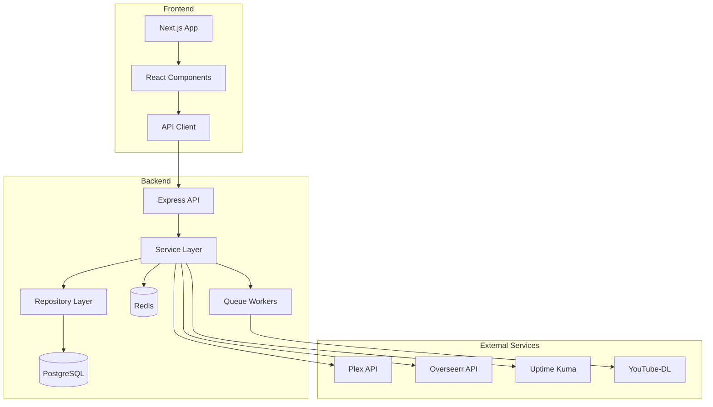

# MediaNest Developer Guide

## Table of Contents

1. [Architecture Overview](#architecture-overview)
2. [Development Setup](#development-setup)
3. [Project Structure](#project-structure)
4. [Technology Stack](#technology-stack)
5. [Development Workflow](#development-workflow)
6. [API Development](#api-development)
7. [Frontend Development](#frontend-development)
8. [Database Management](#database-management)
9. [Testing](#testing)
10. [Deployment](#deployment)
11. [Contributing](#contributing)

## Architecture Overview

MediaNest follows a modern microservices architecture with the following components:



### Key Architectural Decisions

1. **Monorepo Structure**: All code in a single repository with workspaces
2. **TypeScript Everywhere**: Type safety across frontend and backend
3. **API-First Design**: RESTful API with OpenAPI documentation
4. **Real-time Updates**: WebSocket support for live updates
5. **Queue-Based Processing**: BullMQ for background jobs
6. **Container-First**: Docker for all environments

## Development Setup

### Prerequisites

- Node.js 20.x or higher
- Docker Desktop
- PostgreSQL 15.x (or use Docker)
- Redis 7.x (or use Docker)
- Git

### Initial Setup

1. **Clone and Install**

   ```bash
   git clone <repository-url>
   cd medianest
   npm install
   ```

2. **Environment Configuration**

   ```bash
   # Copy example environment
   cp .env.example .env.development

   # Generate secrets
   npm run generate-secrets

   # Edit .env.development with your values
   nano .env.development
   ```

3. **Database Setup**

   ```bash
   # Start PostgreSQL and Redis
   docker-compose up -d postgres redis

   # Run migrations
   npm run db:generate
   npm run db:migrate

   # Seed development data (optional)
   npm run db:seed
   ```

4. **Start Development**

   ```bash
   # Start all services
   npm run dev

   # Or start individually
   npm run dev:backend
   npm run dev:frontend
   ```

### Development URLs

- Frontend: http://localhost:3000
- Backend API: http://localhost:4000
- API Documentation: http://localhost:4000/api-docs
- WebSocket: ws://localhost:4000
- Database Admin: http://localhost:5050 (pgAdmin)
- Redis Admin: http://localhost:8081 (RedisInsight)

## Project Structure

```
medianest/
├── frontend/               # Next.js frontend application
│   ├── src/
│   │   ├── app/           # App router pages
│   │   ├── components/    # React components
│   │   ├── hooks/         # Custom React hooks
│   │   ├── lib/           # Utilities and API client
│   │   └── types/         # TypeScript types
│   └── public/            # Static assets
│
├── backend/               # Express backend application
│   ├── src/
│   │   ├── controllers/   # Request handlers
│   │   ├── services/      # Business logic
│   │   ├── repositories/  # Data access layer
│   │   ├── middleware/    # Express middleware
│   │   ├── routes/        # API routes
│   │   ├── jobs/          # Background job processors
│   │   └── integrations/  # External service clients
│   └── prisma/            # Database schema and migrations
│
├── shared/                # Shared utilities and types
│   └── src/
│       ├── types/         # Shared TypeScript types
│       ├── constants/     # Shared constants
│       └── utils/         # Shared utilities
│
├── infrastructure/        # Deployment and configuration
│   ├── docker/           # Docker configurations
│   ├── nginx/            # Nginx configurations
│   └── scripts/          # Deployment scripts
│
└── docs/                 # Documentation
```

## Technology Stack

### Frontend

- **Framework**: Next.js 14 (App Router)
- **UI Library**: React 18
- **Styling**: Tailwind CSS
- **State Management**: React Query + Zustand
- **Forms**: React Hook Form
- **Validation**: Zod
- **Testing**: Vitest + React Testing Library

### Backend

- **Framework**: Express.js
- **Language**: TypeScript
- **Database**: PostgreSQL with Prisma ORM
- **Caching**: Redis
- **Queue**: BullMQ
- **WebSocket**: Socket.io
- **Authentication**: NextAuth.js
- **Testing**: Vitest + Supertest

### Infrastructure

- **Container**: Docker
- **Reverse Proxy**: Nginx
- **Process Manager**: PM2 (production)
- **Monitoring**: Prometheus + Grafana
- **Logging**: Winston + Loki

## Development Workflow

### Git Workflow

1. **Branch Naming**

   - Feature: `feature/description`
   - Bug fix: `fix/description`
   - Hotfix: `hotfix/description`
   - Refactor: `refactor/description`

2. **Commit Messages**
   Follow conventional commits:

   ```
   type(scope): subject

   body

   footer
   ```

   Types: feat, fix, docs, style, refactor, test, chore

3. **Pull Request Process**
   - Create PR from feature branch
   - Ensure all tests pass
   - Request code review
   - Squash and merge

### Code Standards

1. **TypeScript**

   - Strict mode enabled
   - No `any` types
   - Prefer interfaces over types
   - Use proper generics

2. **Code Style**

   - ESLint + Prettier configured
   - Run `npm run lint` before committing
   - Format on save in VS Code

3. **File Naming**
   - Components: PascalCase (`UserProfile.tsx`)
   - Utilities: camelCase (`formatDate.ts`)
   - Constants: UPPER_SNAKE_CASE
   - CSS Modules: kebab-case

## API Development

### Creating New Endpoints

1. **Define Route** (`backend/src/routes/v1/feature.ts`)

   ```typescript
   import { Router } from 'express';
   import { authenticate } from '@/middleware/auth';
   import { validate } from '@/middleware/validate';
   import { featureController } from '@/controllers/feature.controller';
   import { createFeatureSchema } from '@/validations/feature.validation';

   const router = Router();

   router.use(authenticate); // Require authentication

   router.post('/', validate(createFeatureSchema), featureController.create);

   export default router;
   ```

2. **Create Controller** (`backend/src/controllers/feature.controller.ts`)

   ```typescript
   import { Request, Response } from 'express';
   import { featureService } from '@/services/feature.service';
   import { asyncHandler } from '@/utils/asyncHandler';

   export const featureController = {
     create: asyncHandler(async (req: Request, res: Response) => {
       const result = await featureService.create(req.body);
       res.status(201).json({
         success: true,
         data: result,
       });
     }),
   };
   ```

3. **Implement Service** (`backend/src/services/feature.service.ts`)

   ```typescript
   import { featureRepository } from '@/repositories/feature.repository';

   export const featureService = {
     async create(data: CreateFeatureDto) {
       // Business logic here
       return featureRepository.create(data);
     },
   };
   ```

### API Best Practices

1. **RESTful Design**

   - Use proper HTTP methods
   - Nest resources logically
   - Version your APIs (`/api/v1`)
   - Use consistent naming

2. **Error Handling**

   - Use custom error classes
   - Return proper status codes
   - Include error details in development
   - Log errors appropriately

3. **Validation**

   - Validate all inputs with Zod
   - Sanitize user data
   - Use DTOs for type safety
   - Return validation errors clearly

4. **Security**
   - Authenticate all private routes
   - Implement rate limiting
   - Use CORS properly
   - Sanitize all outputs

## Frontend Development

### Component Development

1. **Component Structure**

   ```typescript
   // components/feature/FeatureComponent.tsx
   import { FC } from 'react';
   import { cn } from '@/lib/utils';

   interface FeatureComponentProps {
     className?: string;
     // other props
   }

   export const FeatureComponent: FC<FeatureComponentProps> = ({
     className,
     ...props
   }) => {
     return (
       <div className={cn('default-styles', className)}>
         {/* Component content */}
       </div>
     );
   };
   ```

2. **Custom Hooks**

   ```typescript
   // hooks/useFeature.ts
   import { useQuery } from '@tanstack/react-query';
   import { api } from '@/lib/api';

   export function useFeature(id: string) {
     return useQuery({
       queryKey: ['feature', id],
       queryFn: () => api.features.get(id),
       staleTime: 5 * 60 * 1000, // 5 minutes
     });
   }
   ```

3. **API Integration**

   ```typescript
   // lib/api/features.ts
   import { apiClient } from './client';

   export const featuresApi = {
     async list(params?: ListParams) {
       const { data } = await apiClient.get('/features', { params });
       return data;
     },

     async create(data: CreateFeatureDto) {
       const { data: result } = await apiClient.post('/features', data);
       return result;
     },
   };
   ```

### State Management

1. **Server State**: React Query for API data
2. **Client State**: Zustand for UI state
3. **Form State**: React Hook Form
4. **URL State**: Next.js router

## Database Management

### Schema Changes

1. **Update Prisma Schema**

   ```prisma
   model Feature {
     id        String   @id @default(cuid())
     name      String
     enabled   Boolean  @default(true)
     createdAt DateTime @default(now())
     updatedAt DateTime @updatedAt
   }
   ```

2. **Create Migration**

   ```bash
   npm run db:migrate:create -- --name add_feature_table
   ```

3. **Apply Migration**
   ```bash
   npm run db:migrate:deploy
   ```

### Database Best Practices

1. **Indexes**: Add indexes for frequently queried fields
2. **Relations**: Use proper foreign keys
3. **Soft Deletes**: Implement where necessary
4. **Timestamps**: Always include created/updated
5. **UUIDs**: Use for public-facing IDs

## Testing

### Unit Tests

```typescript
// feature.service.test.ts
import { describe, it, expect, vi } from 'vitest';
import { featureService } from '@/services/feature.service';

describe('FeatureService', () => {
  it('should create a feature', async () => {
    const mockData = { name: 'Test Feature' };
    const result = await featureService.create(mockData);

    expect(result).toMatchObject({
      id: expect.any(String),
      name: mockData.name,
    });
  });
});
```

### Integration Tests

```typescript
// feature.integration.test.ts
import request from 'supertest';
import { app } from '@/app';

describe('Feature API', () => {
  it('POST /api/v1/features', async () => {
    const response = await request(app)
      .post('/api/v1/features')
      .set('Authorization', `Bearer ${testToken}`)
      .send({ name: 'Test Feature' });

    expect(response.status).toBe(201);
    expect(response.body.data).toHaveProperty('id');
  });
});
```

### E2E Tests

```typescript
// features.e2e.spec.ts
import { test, expect } from '@playwright/test';

test('create feature flow', async ({ page }) => {
  await page.goto('/features');
  await page.click('button:has-text("New Feature")');
  await page.fill('input[name="name"]', 'Test Feature');
  await page.click('button:has-text("Create")');

  await expect(page.locator('text=Test Feature')).toBeVisible();
});
```

## Deployment

### Production Build

```bash
# Build all applications
npm run build

# Build specific app
npm run build:frontend
npm run build:backend
```

### Docker Deployment

```bash
# Build production images
docker-compose -f docker-compose.prod.yml build

# Deploy stack
docker-compose -f docker-compose.prod.yml up -d
```

### Environment Variables

See `.env.example` for all required variables:

- Database connection
- Redis connection
- External API keys
- Security secrets

## Contributing

### Code Review Checklist

- [ ] Tests added/updated
- [ ] Documentation updated
- [ ] TypeScript types correct
- [ ] No console.logs
- [ ] Error handling in place
- [ ] Security considered
- [ ] Performance impact assessed

### Performance Guidelines

1. **Database Queries**

   - Use indexes effectively
   - Avoid N+1 queries
   - Paginate large results
   - Cache when appropriate

2. **Frontend Performance**

   - Lazy load components
   - Optimize images
   - Minimize bundle size
   - Use React.memo wisely

3. **API Performance**
   - Implement caching
   - Use compression
   - Optimize payloads
   - Rate limit appropriately

---

For more specific guides, see:

- [API Reference](./API_REFERENCE.md)
- [Database Schema](./prisma/README.md)
- [Testing Guide](./TESTING.md)
- [Deployment Guide](./DEPLOYMENT_GUIDE.md)
