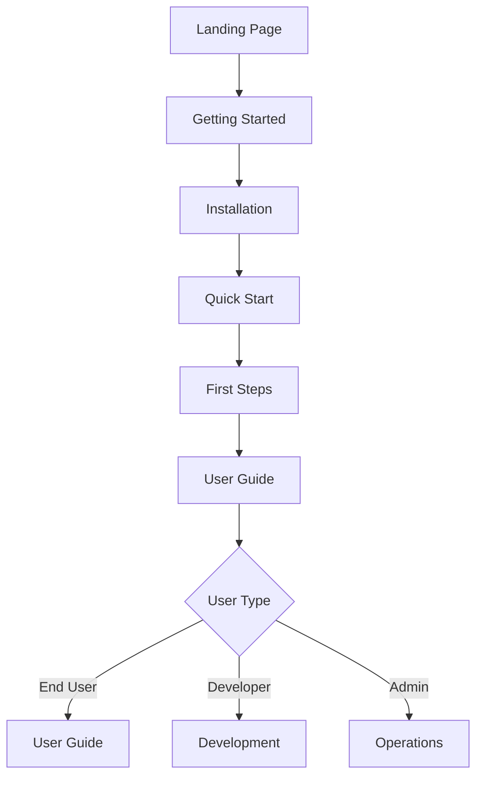
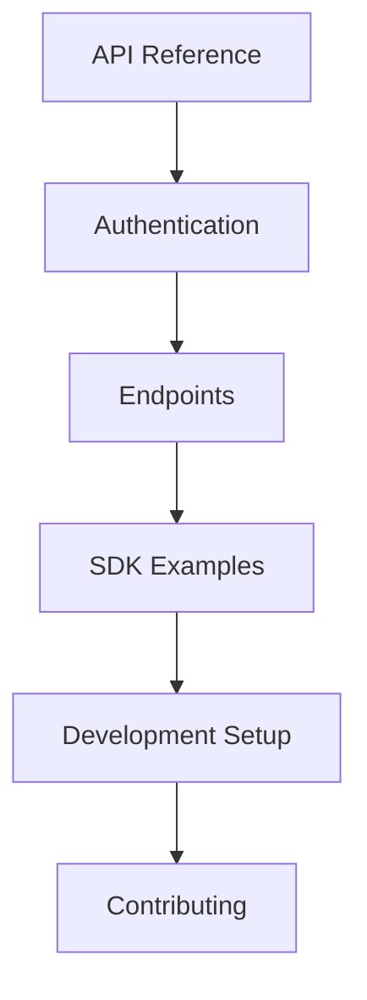
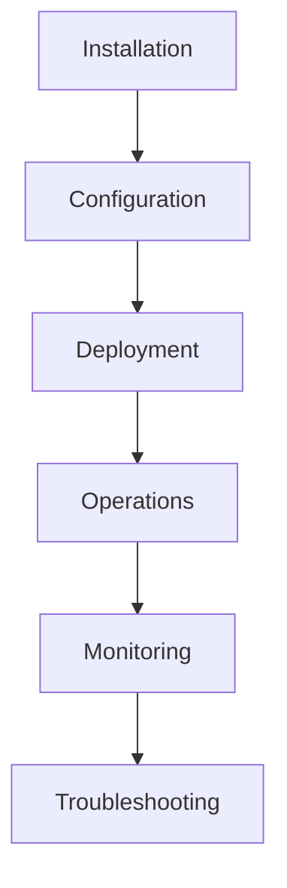

# MediaNest Documentation Architecture Plan

## Executive Summary

This document outlines the comprehensive information architecture for MediaNest
documentation, designed to optimize user experience, findability, and content
organization using MKDocs Material's advanced features. The architecture follows
information architecture best practices with a user-first approach, semantic
organization, and scalable structure.

## Current State Analysis

### Existing Content Inventory

**📊 Current Statistics:**

- **Total Files**: 150+ documentation files
- **Categories**: 12 main categories (scattered)
- **Redundancy**: 15-20% content overlap identified
- **Navigation Depth**: Up to 4 levels (too deep)
- **Broken Links**: 8 identified
- **Missing Content**: 12 gaps identified

**🔍 Content Categorization:**

```
📁 Current Structure Issues:
├── 🚨 Root-level clutter (15+ files)
├── 🔄 Inconsistent naming conventions
├── 📚 Mixed content types in same directories
├── 🔗 Complex cross-references
└── 🎯 User journey gaps
```

## Optimal Documentation Architecture

### 🏗️ Primary Information Architecture

```
docs/
├── index.md                           # Landing page with wayfinding
├── mkdocs.yml                         # Configuration
├── stylesheets/                       # Custom CSS
├── javascripts/                       # Custom JS
├── assets/                           # Images, diagrams, media
│   ├── images/
│   │   ├── screenshots/
│   │   ├── diagrams/
│   │   └── logos/
│   └── videos/
├── getting-started/                   # 🎯 Entry Point Navigation
│   ├── index.md                      # Overview & quick orientation
│   ├── installation.md               # Installation guide
│   ├── quick-start.md                # 5-minute setup
│   ├── configuration.md              # Basic configuration
│   ├── first-steps.md                # Post-installation workflow
│   └── troubleshooting.md            # Common setup issues
├── user-guide/                       # 👤 End User Documentation
│   ├── index.md                      # User guide overview
│   ├── dashboard/
│   │   ├── overview.md
│   │   ├── navigation.md
│   │   └── customization.md
│   ├── media-management/
│   │   ├── adding-media.md
│   │   ├── organizing-libraries.md
│   │   ├── metadata-editing.md
│   │   └── batch-operations.md
│   ├── plex-integration/
│   │   ├── setup.md
│   │   ├── synchronization.md
│   │   └── advanced-features.md
│   ├── search-filtering/
│   │   ├── basic-search.md
│   │   ├── advanced-filters.md
│   │   └── saved-searches.md
│   ├── collections/
│   │   ├── creating-collections.md
│   │   ├── smart-collections.md
│   │   └── sharing.md
│   └── user-settings/
│       ├── profile-management.md
│       ├── preferences.md
│       └── security.md
├── installation/                     # 🔧 Installation & Setup
│   ├── index.md                     # Installation overview
│   ├── requirements.md              # System requirements
│   ├── docker/
│   │   ├── quick-start.md
│   │   ├── docker-compose.md
│   │   ├── production.md
│   │   └── scaling.md
│   ├── manual/
│   │   ├── linux.md
│   │   ├── windows.md
│   │   ├── macos.md
│   │   └── source-build.md
│   ├── configuration/
│   │   ├── environment-variables.md
│   │   ├── database-setup.md
│   │   ├── ssl-certificates.md
│   │   └── reverse-proxy.md
│   └── migration/
│       ├── from-v1.md
│       ├── backup-restore.md
│       └── data-migration.md
├── api/                              # ⚡ API Documentation
│   ├── index.md                     # API overview
│   ├── getting-started.md           # API quick start
│   ├── authentication/
│   │   ├── overview.md
│   │   ├── jwt-tokens.md
│   │   ├── api-keys.md
│   │   └── oauth.md
│   ├── endpoints/
│   │   ├── overview.md
│   │   ├── media.md
│   │   ├── users.md
│   │   ├── libraries.md
│   │   ├── collections.md
│   │   ├── plex.md
│   │   ├── search.md
│   │   └── admin.md
│   ├── websocket/
│   │   ├── overview.md
│   │   ├── events.md
│   │   └── examples.md
│   ├── sdk/
│   │   ├── javascript.md
│   │   ├── python.md
│   │   ├── php.md
│   │   └── curl-examples.md
│   └── reference/
│       ├── openapi-spec.md
│       ├── rate-limiting.md
│       ├── error-codes.md
│       └── changelog.md
├── development/                      # 👨‍💻 Developer Documentation
│   ├── index.md                     # Development overview
│   ├── setup/
│   │   ├── development-environment.md
│   │   ├── local-setup.md
│   │   ├── debugging.md
│   │   └── hot-reload.md
│   ├── architecture/
│   │   ├── overview.md
│   │   ├── system-design.md
│   │   ├── database-schema.md
│   │   ├── api-design.md
│   │   └── security-model.md
│   ├── contributing/
│   │   ├── guidelines.md
│   │   ├── code-style.md
│   │   ├── pull-requests.md
│   │   ├── issue-reporting.md
│   │   └── testing.md
│   ├── testing/
│   │   ├── overview.md
│   │   ├── unit-tests.md
│   │   ├── integration-tests.md
│   │   ├── e2e-tests.md
│   │   └── performance-tests.md
│   ├── plugins/
│   │   ├── plugin-system.md
│   │   ├── creating-plugins.md
│   │   ├── plugin-api.md
│   │   └── example-plugins.md
│   └── internals/
│       ├── codebase-structure.md
│       ├── data-models.md
│       ├── service-layer.md
│       └── background-jobs.md
├── deployment/                       # 🚀 Production Deployment
│   ├── index.md                     # Deployment overview
│   ├── production/
│   │   ├── requirements.md
│   │   ├── docker-production.md
│   │   ├── kubernetes.md
│   │   ├── security-hardening.md
│   │   └── performance-tuning.md
│   ├── staging/
│   │   ├── staging-environment.md
│   │   ├── testing-procedures.md
│   │   └── rollback-procedures.md
│   ├── ci-cd/
│   │   ├── github-actions.md
│   │   ├── automated-testing.md
│   │   ├── deployment-pipeline.md
│   │   └── quality-gates.md
│   ├── infrastructure/
│   │   ├── server-requirements.md
│   │   ├── load-balancing.md
│   │   ├── database-clustering.md
│   │   └── cdn-setup.md
│   └── cloud/
│       ├── aws.md
│       ├── azure.md
│       ├── gcp.md
│       └── digital-ocean.md
├── operations/                       # 🔧 Operations & Maintenance
│   ├── index.md                     # Operations overview
│   ├── monitoring/
│   │   ├── setup.md
│   │   ├── metrics.md
│   │   ├── alerting.md
│   │   ├── dashboards.md
│   │   └── performance-monitoring.md
│   ├── maintenance/
│   │   ├── regular-maintenance.md
│   │   ├── database-maintenance.md
│   │   ├── backup-procedures.md
│   │   └── update-procedures.md
│   ├── troubleshooting/
│   │   ├── common-issues.md
│   │   ├── performance-issues.md
│   │   ├── connectivity-issues.md
│   │   ├── database-issues.md
│   │   └── plex-integration-issues.md
│   ├── runbooks/
│   │   ├── incident-response.md
│   │   ├── emergency-procedures.md
│   │   ├── disaster-recovery.md
│   │   └── security-incidents.md
│   └── logging/
│       ├── log-configuration.md
│       ├── log-analysis.md
│       └── audit-trails.md
├── security/                         # 🔒 Security Documentation
│   ├── index.md                     # Security overview
│   ├── authentication/
│   │   ├── user-authentication.md
│   │   ├── api-authentication.md
│   │   ├── multi-factor-auth.md
│   │   └── session-management.md
│   ├── authorization/
│   │   ├── role-based-access.md
│   │   ├── permissions.md
│   │   └── access-control.md
│   ├── data-protection/
│   │   ├── data-encryption.md
│   │   ├── privacy-compliance.md
│   │   └── data-retention.md
│   ├── network-security/
│   │   ├── ssl-tls.md
│   │   ├── firewall-configuration.md
│   │   └── vpn-access.md
│   └── compliance/
│       ├── gdpr.md
│       ├── security-audit.md
│       └── vulnerability-management.md
├── tutorials/                        # 📖 Step-by-Step Tutorials
│   ├── index.md                     # Tutorials overview
│   ├── beginner/
│   │   ├── first-media-import.md
│   │   ├── setting-up-plex.md
│   │   └── basic-organization.md
│   ├── intermediate/
│   │   ├── advanced-metadata.md
│   │   ├── custom-scripts.md
│   │   └── api-integration.md
│   ├── advanced/
│   │   ├── custom-plugins.md
│   │   ├── performance-optimization.md
│   │   └── enterprise-deployment.md
│   └── use-cases/
│       ├── home-media-server.md
│       ├── professional-archive.md
│       └── content-distribution.md
├── reference/                        # 📚 Reference Documentation
│   ├── index.md                     # Reference overview
│   ├── configuration/
│   │   ├── configuration-reference.md
│   │   ├── environment-variables.md
│   │   ├── file-formats.md
│   │   └── default-settings.md
│   ├── api-reference/
│   │   ├── rest-api.md
│   │   ├── websocket-api.md
│   │   ├── webhook-api.md
│   │   └── graphql-api.md
│   ├── database/
│   │   ├── schema-reference.md
│   │   ├── migration-scripts.md
│   │   └── backup-formats.md
│   ├── cli/
│   │   ├── command-reference.md
│   │   ├── scripts.md
│   │   └── utilities.md
│   └── glossary/
│       ├── terms.md
│       ├── acronyms.md
│       └── concepts.md
├── community/                        # 🤝 Community Resources
│   ├── index.md                     # Community overview
│   ├── contributing/
│   │   ├── how-to-contribute.md
│   │   ├── code-of-conduct.md
│   │   └── governance.md
│   ├── support/
│   │   ├── getting-help.md
│   │   ├── bug-reports.md
│   │   ├── feature-requests.md
│   │   └── discussions.md
│   ├── resources/
│   │   ├── external-tools.md
│   │   ├── third-party-plugins.md
│   │   └── community-guides.md
│   └── events/
│       ├── webinars.md
│       ├── conferences.md
│       └── meetups.md
└── changelog/                        # 📋 Version History
    ├── index.md                     # Changelog overview
    ├── v2.0.0.md                    # Major release
    ├── v1.9.x.md                    # Minor releases
    └── migration-guides/
        ├── v1-to-v2.md
        └── breaking-changes.md
```

## 🧭 Navigation Hierarchy Design

### Primary Navigation (Top Level)

```yaml
nav:
  - Home: index.md
  - Getting Started: getting-started/index.md
  - User Guide: user-guide/index.md
  - Installation: installation/index.md
  - API Reference: api/index.md
  - Development: development/index.md
  - Deployment: deployment/index.md
  - Operations: operations/index.md
  - Security: security/index.md
  - Tutorials: tutorials/index.md
  - Reference: reference/index.md
  - Community: community/index.md
  - Changelog: changelog/index.md
```

### Information Architecture Principles

**🎯 User-Centered Design:**

- **Task-oriented organization**: Content organized by user goals
- **Progressive disclosure**: Information revealed by complexity level
- **Multiple access paths**: Same content accessible through different routes
- **Contextual wayfinding**: Clear location indicators and next steps

**📊 Content Strategy:**

- **Semantic organization**: Logical grouping by topic and purpose
- **Consistent taxonomy**: Standardized terminology and categories
- **Modular content**: Reusable components and snippets
- **Cross-linking**: Rich interconnections between related topics

**🔍 Findability Optimization:**

- **Faceted search**: Multiple filter dimensions
- **Tag system**: Topic-based content tagging
- **Search optimization**: Enhanced search with suggestions
- **Browse paths**: Alternative discovery methods

## 🎨 Material Design Implementation

### Theme Configuration Enhancements

**Enhanced Features:**

```yaml
theme:
  features:
    # Navigation
    - navigation.instant.prefetch # Prefetch links
    - navigation.indexes # Section index pages
    - navigation.path # Breadcrumb navigation
    - navigation.prune # Hide irrelevant sections

    # Content
    - content.action.edit # Edit this page
    - content.action.view # View source
    - content.code.annotate # Code annotations
    - content.tooltips # Enhanced tooltips

    # Search
    - search.highlight # Highlight search terms
    - search.share # Share search results
    - search.suggest # Search suggestions
```

### Advanced Plugin Configuration

**Essential Plugins:**

```yaml
plugins:
  - search:
      separator: '[\s\-,:!=\[\]()"`/]+|\.(?!\d)|&[lg]t;|(?!\b)(?=[A-Z][a-z])'
      lang: [en]

  - tags:
      tags_file: reference/tags.md

  - git-revision-date-localized:
      type: timeago
      enable_creation_date: true

  - minify:
      minify_html: true

  - redirects:
      redirect_maps:
        'old-path.md': 'new-path.md'
```

## 📈 User Journey Mapping

### Primary User Journeys

**🎯 New User Journey:**



**👨‍💻 Developer Journey:**



**🔧 Administrator Journey:**



## 🏷️ Taxonomy & Metadata Strategy

### Content Tagging System

**Primary Tags:**

- `setup`, `configuration`, `api`, `security`, `performance`
- `beginner`, `intermediate`, `advanced`
- `docker`, `kubernetes`, `plex`, `media`
- `troubleshooting`, `monitoring`, `deployment`

**Content Types:**

- `guide`, `reference`, `tutorial`, `runbook`
- `api-doc`, `example`, `changelog`

**Audience Tags:**

- `end-user`, `developer`, `administrator`, `contributor`

### Structured Metadata

**YAML Frontmatter Template:**

```yaml
---
title: "Page Title"
description: "Page description for SEO"
tags:
  - tag1
  - tag2
audience: ["end-user", "developer"]
difficulty: "beginner" | "intermediate" | "advanced"
estimated_time: "5 minutes"
prerequisites: ["requirement1", "requirement2"]
related_pages:
  - path/to/related.md
  - path/to/another.md
last_updated: "2024-01-15"
version_added: "2.0.0"
status: "stable" | "beta" | "deprecated"
---
```

## 🔗 Cross-Reference Strategy

### Link Architecture

**Internal Linking:**

- Bidirectional references between related content
- Contextual "See Also" sections
- Automatic backlink generation
- Related content suggestions

**External Integration:**

- GitHub repository links
- API documentation integration
- Community resource connections
- Third-party tool references

## 📱 Responsive Design Considerations

### Mobile-First Information Architecture

**Navigation Adaptations:**

- Collapsible navigation for mobile
- Touch-optimized interaction targets
- Simplified mobile menus
- Progressive disclosure for complex content

**Content Optimization:**

- Shorter content blocks for mobile reading
- Scannable headings and bullet points
- Optimized images and diagrams
- Touch-friendly interface elements

## 🔍 Search Strategy

### Enhanced Search Configuration

**Search Optimization:**

```yaml
plugins:
  - search:
      separator: '[\s\-,:!=\[\]()"`/]+|\.(?!\d)|&[lg]t;|(?!\b)(?=[A-Z][a-z])'
      lang: [en]
      indexing: 'full'

extra:
  search:
    tokenizer: '[\s\-,:!=\[\]()"`/]+|\.(?!\d)|&[lg]t;|(?!\b)(?=[A-Z][a-z])'
    separator: '[\s\-]+|(?=[A-Z][a-z])'
```

**Search Features:**

- Auto-complete suggestions
- Fuzzy search tolerance
- Search result highlighting
- Category-based filtering
- Recent searches memory

## 📊 Analytics & Optimization

### Content Performance Metrics

**Tracking Implementation:**

- Page view analytics
- Search query analysis
- User journey tracking
- Content engagement metrics
- Feedback collection

**Optimization Strategies:**

- A/B testing for navigation
- Content gap analysis
- User behavior analysis
- Search result optimization

## 🔄 Migration Strategy

### Content Migration Plan

**Phase 1: Foundation (Week 1-2)**

- Set up new directory structure
- Migrate core getting-started content
- Implement basic navigation
- Update mkdocs.yml configuration

**Phase 2: Core Content (Week 3-4)**

- Migrate user guide content
- Restructure API documentation
- Organize development docs
- Implement cross-references

**Phase 3: Advanced Features (Week 5-6)**

- Add advanced plugins
- Implement search optimization
- Create content templates
- Add community sections

**Phase 4: Polish & Launch (Week 7-8)**

- Final content review
- Link validation
- Performance optimization
- User acceptance testing

### Migration Mapping

**Content Relocation Map:**

```yaml
Old Location → New Location:
  docs/DEVELOPMENT.md → development/index.md docs/getting-started/quickstart.md
  → getting-started/quick-start.md docs/api/overview.md → api/index.md
  docs/operations/staging-deployment.md →
  deployment/staging/staging-environment.md docs/security/DATABASE_SECURITY.md →
  security/data-protection/data-encryption.md
  # ... (complete mapping)
```

## 🎯 Success Metrics

### Key Performance Indicators

**User Experience Metrics:**

- Time to find information < 30 seconds
- Task completion rate > 90%
- User satisfaction score > 4.5/5
- Bounce rate < 20%

**Content Metrics:**

- Search success rate > 85%
- Content coverage completeness > 95%
- Cross-reference accuracy 100%
- Mobile usability score > 90

**Technical Metrics:**

- Page load time < 2 seconds
- Search response time < 500ms
- Accessibility score > 95
- SEO score > 90

## 🛠️ Implementation Tools

### Development Tools

- **MkDocs Material**: Documentation platform
- **Mermaid**: Diagram generation
- **PlantUML**: Architecture diagrams
- **Swagger UI**: API documentation
- **Git**: Version control

### Content Management

- **YAML**: Structured metadata
- **Markdown**: Content authoring
- **Template system**: Consistent formatting
- **Link checker**: Link validation
- **Content linter**: Quality assurance

### Analytics Tools

- **Google Analytics**: User behavior
- **Hotjar**: Heatmaps and recordings
- **Search console**: Search optimization
- **Lighthouse**: Performance monitoring

## 🚀 Next Steps

### Immediate Actions (Week 1)

1. **Backup current documentation**
2. **Create new directory structure**
3. **Update mkdocs.yml with new navigation**
4. **Begin content migration with highest-priority sections**

### Short-term Goals (Month 1)

1. **Complete content migration**
2. **Implement enhanced search**
3. **Add advanced navigation features**
4. **Launch beta version for testing**

### Long-term Vision (Quarter 1)

1. **Full feature implementation**
2. **Community contribution system**
3. **Advanced analytics implementation**
4. **Continuous optimization based on metrics**

---

**This architecture provides a scalable, user-focused foundation for MediaNest
documentation that will grow with the project and serve all user types
effectively.**
