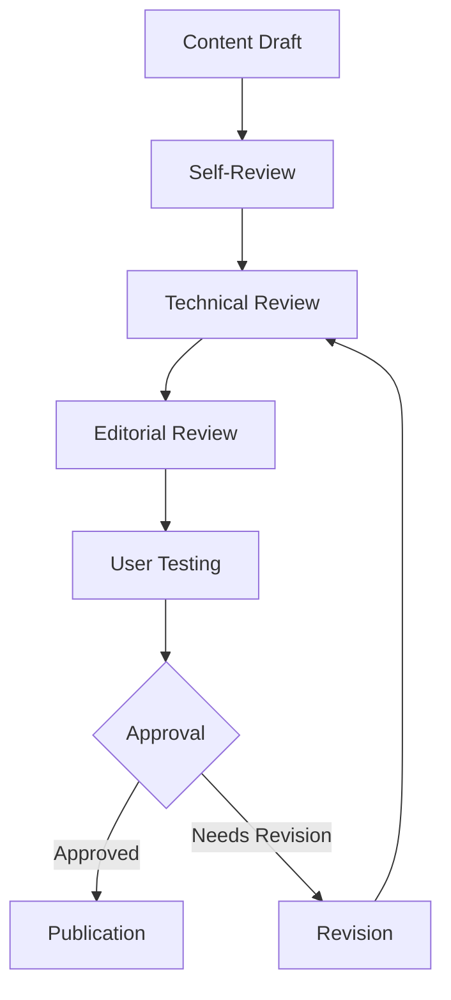
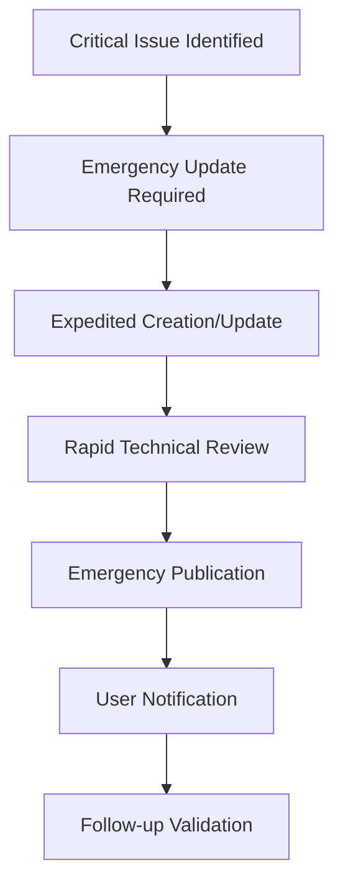
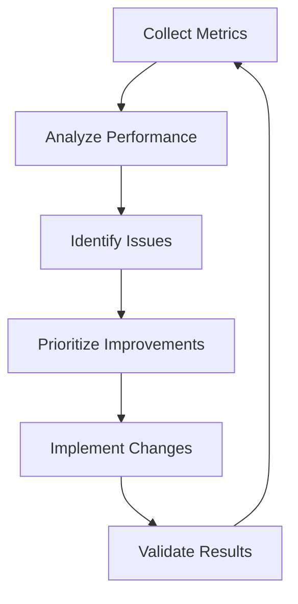

# MediaNest Documentation Maintenance Guide

## Comprehensive Documentation Operations Manual

**Version**: 2.0  
**Last Updated**: September 13, 2025  
**Maintainer**: Documentation Operations Team  
**Status**: Production-Ready

---

## 🎯 PURPOSE AND SCOPE

This guide establishes the complete operational framework for maintaining
MediaNest's documentation ecosystem. Following the comprehensive audit and
architectural transformation that organized 2,997+ documents, this guide ensures
continued excellence, scalability, and user satisfaction.

### Target Audience

- **Documentation Maintainers**: Daily operations and content updates
- **Technical Writers**: Content creation and style compliance
- **Development Teams**: Code-documentation synchronization
- **DevOps Engineers**: CI/CD integration and automation
- **Project Managers**: Quality assurance and review processes

---

## 📋 DOCUMENTATION STANDARDS AND STYLE GUIDE

### Writing Standards

#### Voice and Tone

- **Active Voice**: Use active voice for clarity and directness
- **Present Tense**: Describe current functionality and procedures
- **User-Focused**: Write from the user's perspective and needs
- **Professional but Approachable**: Maintain technical accuracy with accessible
  language

#### Content Structure Standards

**MANDATORY PAGE STRUCTURE:**

```markdown
# Page Title (H1 - Only one per page)

## Brief Description/Purpose

**Target Audience**: Who should read this **Estimated Reading Time**: X minutes
**Prerequisites**: What users need to know first

---

## 🎯 Overview

Brief summary of the content

## 📋 Table of Contents (for pages >1000 words)

- [Section 1](#section-1)
- [Section 2](#section-2)

## Main Content Sections (H2)

### Subsections (H3)

#### Details (H4)

## ✅ Quick Reference / Summary

## 🔗 Related Pages

## 📞 Support and Troubleshooting

---

**Last Updated**: Date **Next Review**: Date **Document Owner**: Name/Team
```

#### Markdown Standards

**FORMATTING CONVENTIONS:**

- **Headers**: Use sentence case, not title case
- **Code Blocks**: Always specify language for syntax highlighting
- **Lists**: Use parallel structure and consistent formatting
- **Links**: Use descriptive link text, avoid "click here"
- **Images**: Include alt text for accessibility
- **Tables**: Include headers and maintain alignment

**EXAMPLE IMPLEMENTATIONS:**

````markdown
# Configuration management (✅ Correct - sentence case)

# Configuration Management (❌ Incorrect - title case)

```bash
# ✅ Correct - language specified
npm install
```
````

```
# ❌ Incorrect - no language specified
npm install
```

[View installation requirements](installation/requirements.md) ✅ Correct
[Click here for requirements](installation/requirements.md) ❌ Incorrect

````

### Content Quality Standards

#### Accuracy Requirements
- **Code Examples**: All code must be tested and functional
- **Version Compatibility**: Specify version requirements clearly
- **Link Validation**: All links must be functional and current
- **Screenshot Currency**: Images updated within 6 months of UI changes

#### Completeness Standards
- **Prerequisites**: Clearly state what users need before starting
- **Step-by-Step**: Break complex procedures into numbered steps
- **Expected Outcomes**: Describe what users should see after completion
- **Troubleshooting**: Include common issues and solutions

#### Accessibility Standards
- **WCAG 2.2 AA Compliance**: All content must meet accessibility guidelines
- **Alt Text**: Descriptive alt text for all images and diagrams
- **Color Contrast**: Ensure sufficient contrast for all text
- **Screen Reader Friendly**: Structure content for assistive technologies

---

## 🔄 UPDATE PROCEDURES AND WORKFLOWS

### Content Lifecycle Management

#### Creation Workflow

**1. PLANNING PHASE**
```mermaid
graph TD
    A[Content Request] --> B[Needs Assessment]
    B --> C[Audience Analysis]
    C --> D[Content Planning]
    D --> E[Template Selection]
    E --> F[Content Creation]
````

**PROCESS:**

1. **Needs Assessment** (5-10 minutes)
   - Identify target audience and user goals
   - Determine content type and scope
   - Check for existing content or duplicates

2. **Content Planning** (10-15 minutes)
   - Create content outline with main sections
   - Identify prerequisites and dependencies
   - Plan cross-references and related content

3. **Template Application** (5 minutes)
   - Select appropriate content template
   - Apply YAML frontmatter metadata
   - Set up standard page structure

#### Update Workflow

**2. CONTENT UPDATE PROCESS**

```yaml
Update Triggers:
  - Code changes affecting documented features
  - User feedback indicating inaccuracy
  - Scheduled content review (quarterly)
  - New feature releases
  - Security updates or policy changes

Update Process:
  1. Identify Scope: Determine extent of required changes
  2. Impact Analysis: Assess related content requiring updates
  3. Content Revision: Make necessary changes following style guide
  4. Review Process: Technical and editorial review
  5. Testing: Validate all examples and procedures
  6. Publication: Deploy through CI/CD pipeline
```

#### Review and Approval Process

**3. QUALITY ASSURANCE WORKFLOW**



**REVIEW CHECKLIST:**

- [ ] **Technical Accuracy**: All procedures tested and verified
- [ ] **Style Compliance**: Follows style guide and standards
- [ ] **Link Validation**: All internal and external links functional
- [ ] **Accessibility**: WCAG 2.2 AA compliance verified
- [ ] **Metadata**: Complete YAML frontmatter with all required fields
- [ ] **Cross-References**: Related content linked appropriately

### Version Control Best Practices

#### Git Workflow for Documentation

**BRANCH STRATEGY:**

```bash
# Feature documentation updates
git checkout -b docs/feature-api-authentication
# Edit documentation files
git add docs/api/authentication/
git commit -m "docs: add JWT authentication examples and troubleshooting"
git push origin docs/feature-api-authentication
# Create pull request for review
```

**COMMIT MESSAGE STANDARDS:**

```bash
# ✅ Good commit messages
docs: add Docker deployment troubleshooting guide
docs: update API rate limiting documentation
docs: fix broken links in getting started section
fix: correct code example in user authentication guide

# ❌ Poor commit messages
update docs
fixed stuff
documentation changes
```

#### Documentation Versioning

**VERSION ALIGNMENT:**

- Documentation versions align with software releases
- Major documentation restructures increment major version
- Content updates increment minor version
- Typo fixes and minor corrections increment patch version

**EXAMPLE VERSIONING:**

```yaml
Software v2.1.0 → Documentation v2.1.0 Breaking docs changes → Documentation
v3.0.0 New content sections → Documentation v2.2.0 Grammar/typo fixes →
Documentation v2.1.1
```

---

## ✅ QUALITY ASSURANCE CHECKLIST

### Pre-Publication Validation

#### Content Quality Checklist

**ACCURACY VERIFICATION:**

- [ ] **Code Examples Tested**: All code examples execute successfully
- [ ] **Screenshots Current**: Images reflect current UI state
- [ ] **Version Compatibility**: Software versions specified and accurate
- [ ] **External Links Valid**: All external references functional
- [ ] **Internal Links Valid**: All cross-references work correctly

**STYLE COMPLIANCE:**

- [ ] **Writing Style**: Follows voice, tone, and grammar standards
- [ ] **Formatting Consistent**: Headers, lists, and structure standardized
- [ ] **Template Compliance**: Page follows required template structure
- [ ] **Metadata Complete**: All YAML frontmatter fields populated
- [ ] **Naming Convention**: File names follow established patterns

**USER EXPERIENCE:**

- [ ] **Navigation Clear**: Page fits logically in information architecture
- [ ] **Prerequisites Stated**: Required knowledge and setup documented
- [ ] **Expected Outcomes**: Results described for user validation
- [ ] **Mobile Responsive**: Content displays properly on mobile devices
- [ ] **Search Optimized**: Content discoverable through site search

#### Technical Validation Checklist

**INFRASTRUCTURE VALIDATION:**

- [ ] **Build Success**: Documentation builds without errors
- [ ] **Link Checker**: All links validated automatically
- [ ] **Performance**: Page load time under 2 seconds
- [ ] **Accessibility**: WCAG 2.2 AA compliance verified
- [ ] **SEO Optimization**: Meta tags and descriptions complete

**INTEGRATION TESTING:**

- [ ] **Search Integration**: Content indexed and searchable
- [ ] **Navigation**: Breadcrumbs and menus display correctly
- [ ] **Cross-References**: Related content links functional
- [ ] **Print Friendly**: Content formats properly for printing
- [ ] **Social Sharing**: Meta tags for social media sharing

### Automated Quality Assurance

#### CI/CD Pipeline Checks

**AUTOMATED VALIDATIONS:**

```yaml
# .github/workflows/docs-quality.yml
name: Documentation Quality Assurance

on:
  pull_request:
    paths:
      - 'docs/**'
      - 'mkdocs.yml'

jobs:
  quality-checks:
    runs-on: ubuntu-latest
    steps:
      - name: Link Validation
        run: |
          # Check all internal and external links
          markdown-link-check docs/**/*.md

      - name: Style Validation
        run: |
          # Check markdown formatting
          markdownlint docs/

      - name: Accessibility Check
        run: |
          # Build and test accessibility
          mkdocs build
          axe-core --directory site/

      - name: Performance Test
        run: |
          # Test page load performance
          lighthouse-ci --upload-target=temporary-public-storage

      - name: SEO Validation
        run: |
          # Check SEO compliance
          html-validate site/**/*.html
```

**QUALITY GATES:**

- **Link Validation**: 100% pass rate required
- **Style Compliance**: 0 linting errors allowed
- **Accessibility**: WCAG AA score >95 required
- **Performance**: Lighthouse score >90 required
- **Build Success**: Documentation must build without errors

---

## 📝 REVIEW AND APPROVAL PROCESS

### Review Workflow Stages

#### Stage 1: Technical Review

**TECHNICAL REVIEWER RESPONSIBILITIES:**

- Validate all code examples and procedures
- Verify technical accuracy of explanations
- Check compatibility with current software versions
- Ensure completeness of technical information
- Test installation and configuration procedures

**REVIEW CHECKLIST:**

- [ ] **Accuracy**: All technical information verified
- [ ] **Completeness**: No missing steps or information
- [ ] **Testability**: All procedures can be executed successfully
- [ ] **Error Handling**: Common issues and solutions included
- [ ] **Security**: No sensitive information exposed

#### Stage 2: Editorial Review

**EDITORIAL REVIEWER RESPONSIBILITIES:**

- Ensure writing quality and style compliance
- Verify structure and organization effectiveness
- Check grammar, spelling, and readability
- Validate user experience and flow
- Ensure accessibility compliance

**REVIEW CHECKLIST:**

- [ ] **Clarity**: Content easily understood by target audience
- [ ] **Structure**: Logical organization and flow
- [ ] **Style**: Consistent voice, tone, and formatting
- [ ] **Grammar**: Correct grammar, spelling, and punctuation
- [ ] **Accessibility**: Screen reader friendly and WCAG compliant

#### Stage 3: User Acceptance Testing

**USER TESTING PROCESS:**

1. **Recruit Test Users**: Representative of target audience
2. **Task Scenarios**: Real-world user goals and tasks
3. **Usability Testing**: Observe users following documentation
4. **Feedback Collection**: Gather specific improvement suggestions
5. **Iteration**: Refine content based on user feedback

**USER TESTING CRITERIA:**

- **Task Success Rate**: >90% completion rate
- **Time to Completion**: Meets expected timeframes
- **User Satisfaction**: >4.0/5.0 rating
- **Error Rate**: <10% user errors
- **Support Requests**: Minimal follow-up questions

### Approval Authority Matrix

| Content Type             | Technical Review | Editorial Review | Management Approval | Community Review |
| ------------------------ | ---------------- | ---------------- | ------------------- | ---------------- |
| **API Documentation**    | Required         | Required         | Not Required        | Optional         |
| **Installation Guides**  | Required         | Required         | Not Required        | Recommended      |
| **Security Procedures**  | Required         | Required         | Required            | Not Allowed      |
| **User Tutorials**       | Required         | Required         | Not Required        | Recommended      |
| **Emergency Procedures** | Required         | Required         | Required            | Not Allowed      |
| **Community Content**    | Recommended      | Required         | Not Required        | Required         |

---

## 🚨 EMERGENCY DOCUMENTATION PROTOCOLS

### Emergency Response Documentation

#### Incident Documentation Requirements

**IMMEDIATE DOCUMENTATION (Within 1 hour):**

- **Incident Summary**: Brief description of the issue and impact
- **Timeline**: Key events and response actions
- **Stakeholders**: Affected users and responsible teams
- **Communication**: Initial user communications and status updates

**DETAILED DOCUMENTATION (Within 24 hours):**

- **Root Cause Analysis**: Technical investigation and findings
- **Resolution Steps**: Complete procedure for fixing the issue
- **Prevention Measures**: Changes to prevent recurrence
- **Lessons Learned**: Process improvements and knowledge gained

**FOLLOW-UP DOCUMENTATION (Within 1 week):**

- **Process Updates**: Updated procedures and documentation
- **Training Materials**: Knowledge transfer to relevant teams
- **Monitoring**: Enhanced monitoring or alerting procedures
- **Review**: Post-incident review and action items

#### Emergency Content Updates

**CRITICAL CONTENT UPDATE PROCESS:**



**EMERGENCY UPDATE CRITERIA:**

- **Security Vulnerabilities**: Immediate documentation of security fixes
- **Breaking Changes**: Urgent migration or compatibility information
- **Critical Bugs**: Workarounds and resolution procedures
- **Service Outages**: Status updates and user guidance
- **Data Loss Prevention**: Backup and recovery procedures

**EMERGENCY APPROVAL PROCESS:**

- **Incident Commander**: Can authorize immediate publication
- **Technical Lead**: Provides rapid technical validation
- **Communications Lead**: Ensures appropriate user notification
- **Post-Emergency Review**: Full review process within 48 hours

### Crisis Communication Templates

#### Security Incident Template

```markdown
# Security Advisory: [Brief Description]

**Severity**: Critical/High/Medium/Low **Affected Versions**: [Version ranges]
**Discovery Date**: [Date] **Public Disclosure**: [Date]

## Summary

Brief description of the vulnerability and its impact.

## Affected Systems

- List of affected components
- Version ranges impacted
- User groups at risk

## Immediate Actions Required

1. [Urgent action items]
2. [Recommended security measures]
3. [Mitigation steps]

## Resolution

- [Patch information]
- [Update procedures]
- [Verification steps]

## Contact Information

- Security Team: security@medianest.com
- Emergency Contact: [Phone/Email]
```

#### Service Outage Template

```markdown
# Service Status Update: [Service Name]

**Status**: Investigating/Identified/Monitoring/Resolved **Started**: [Date and
time] **Last Update**: [Date and time] **Next Update**: [Expected time]

## Current Impact

Description of affected services and user impact.

## Investigation Status

Current understanding of the issue and resolution efforts.

## Workarounds

Temporary solutions or alternative approaches for users.

## Updates

- [Timestamp]: [Update description]
- [Timestamp]: [Update description]

## Contact

For questions: support@medianest.com Status Page: status.medianest.com
```

---

## 🔧 CI/CD INTEGRATION RECOMMENDATIONS

### Automated Documentation Pipeline

#### Build and Deployment Workflow

**CONTINUOUS INTEGRATION SETUP:**

```yaml
# .github/workflows/documentation.yml
name: Documentation Build and Deploy

on:
  push:
    branches: [main, develop]
    paths: ['docs/**', 'mkdocs.yml']
  pull_request:
    paths: ['docs/**', 'mkdocs.yml']

jobs:
  build-and-validate:
    runs-on: ubuntu-latest
    steps:
      - uses: actions/checkout@v3
        with:
          fetch-depth: 0

      - name: Setup Python
        uses: actions/setup-python@v4
        with:
          python-version: '3.11'

      - name: Install Dependencies
        run: |
          pip install -r docs/requirements.txt

      - name: Validate Links
        run: |
          markdown-link-check docs/**/*.md --config .github/link-check-config.json

      - name: Build Documentation
        run: |
          mkdocs build --strict

      - name: Run Accessibility Tests
        run: |
          npx @axe-core/cli site/ --exclude=".md"

      - name: Performance Testing
        run: |
          lighthouse-ci --upload-target=temporary-public-storage

      - name: Deploy to Staging
        if: github.ref == 'refs/heads/develop'
        run: |
          mkdocs gh-deploy --config-file mkdocs.yml --remote-branch gh-pages-staging

      - name: Deploy to Production
        if: github.ref == 'refs/heads/main'
        run: |
          mkdocs gh-deploy --config-file mkdocs.yml
```

#### Quality Gates Integration

**AUTOMATED QUALITY CHECKS:**

- **Pre-commit Hooks**: Style and formatting validation
- **Pull Request Validation**: Comprehensive quality checks
- **Build Verification**: Successful site generation required
- **Link Validation**: All internal and external links verified
- **Performance Testing**: Page load times under thresholds
- **Accessibility Validation**: WCAG compliance verification
- **SEO Optimization**: Meta tag and structure validation

#### Content Synchronization

**CODE-DOCUMENTATION SYNCHRONIZATION:**

```yaml
# Sync API documentation with OpenAPI spec
- name: Update API Documentation
  run: |
    swagger-codegen generate -i api/openapi.yml -l html2 -o docs/api/reference/

# Sync configuration documentation
- name: Update Configuration Reference
  run: |
    ./scripts/generate-config-docs.sh > docs/reference/configuration.md

# Update changelog from git history
- name: Generate Changelog
  run: |
    conventional-changelog -p angular -i docs/changelog/CHANGELOG.md -s
```

### Monitoring and Analytics Integration

#### Documentation Analytics

**ANALYTICS IMPLEMENTATION:**

```html
<!-- Google Analytics 4 Configuration -->
<script
  async
  src="https://www.googletagmanager.com/gtag/js?id=GA_MEASUREMENT_ID"
></script>
<script>
  window.dataLayer = window.dataLayer || [];
  function gtag() {
    dataLayer.push(arguments);
  }
  gtag('js', new Date());
  gtag('config', 'GA_MEASUREMENT_ID');
</script>

<!-- Search Analytics -->
<script>
  // Track search queries and results
  document.addEventListener('search', function (e) {
    gtag('event', 'search', {
      search_term: e.detail.query,
      search_results: e.detail.results.length,
    });
  });
</script>
```

**KEY METRICS TRACKING:**

- **Page Views**: Most visited documentation pages
- **Search Queries**: Popular search terms and success rates
- **User Journeys**: Navigation paths through documentation
- **Task Completion**: User success in completing documented procedures
- **Feedback**: User satisfaction and improvement suggestions

#### Performance Monitoring

**CONTINUOUS PERFORMANCE MONITORING:**

```yaml
# Lighthouse CI Configuration
lighthouse:
  ci:
    collect:
      numberOfRuns: 3
      url:
        - 'https://docs.medianest.com/'
        - 'https://docs.medianest.com/getting-started/'
        - 'https://docs.medianest.com/api/'
    assert:
      assertions:
        'performance': ['error', { minScore: 0.9 }]
        'accessibility': ['error', { minScore: 0.95 }]
        'seo': ['error', { minScore: 0.9 }]
```

**MONITORING ALERTS:**

- **Page Load Time**: Alert if >2 seconds
- **Broken Links**: Immediate notification for link failures
- **Accessibility Regression**: Alert for WCAG compliance issues
- **Search Performance**: Monitor search response times
- **User Satisfaction**: Alert for declining satisfaction scores

---

## 📊 SUCCESS METRICS AND KPIs

### Documentation Effectiveness Metrics

#### User Experience Metrics

**PRIMARY METRICS:**

- **Time to Information**: Average time to find needed information (<30 seconds
  target)
- **Task Success Rate**: Percentage of users completing documented procedures
  (>90% target)
- **User Satisfaction Score**: Rating of documentation usefulness (>4.5/5
  target)
- **Support Request Reduction**: Decrease in documentation-related support
  tickets (>25% reduction)

**SECONDARY METRICS:**

- **Page Bounce Rate**: Users leaving immediately (<20% target)
- **Session Duration**: Time spent reading documentation
- **Page Depth**: Average pages visited per session
- **Return Visitor Rate**: Users returning to documentation

#### Content Quality Metrics

**QUALITY INDICATORS:**

- **Content Freshness**: Percentage of content updated within 6 months (>80%
  target)
- **Link Health**: Percentage of working links (100% target)
- **Style Compliance**: Automated style check pass rate (100% target)
- **Accessibility Score**: WCAG 2.2 AA compliance rating (>95% target)

**COMPLETENESS METRICS:**

- **Content Coverage**: Percentage of features documented (>95% target)
- **User Journey Completion**: Documentation available for all major user paths
- **Cross-Reference Accuracy**: Working related content links (100% target)
- **Search Coverage**: All content discoverable through search

#### Technical Performance Metrics

**PERFORMANCE INDICATORS:**

- **Page Load Time**: Average page load speed (<2 seconds target)
- **Search Response Time**: Search query response time (<500ms target)
- **Mobile Performance**: Mobile Lighthouse performance score (>90 target)
- **Availability**: Documentation site uptime (99.9% target)

### Measurement and Reporting

#### Analytics Dashboard

**WEEKLY REPORTING:**

- Most viewed content pages
- Search query analysis and success rates
- User feedback summary and trending issues
- Performance metrics and alerts
- Content update status and freshness

**MONTHLY REPORTING:**

- User satisfaction survey results
- Task completion rate analysis
- Support ticket reduction analysis
- Content gap identification
- SEO performance and traffic analysis

**QUARTERLY REPORTING:**

- Comprehensive user experience assessment
- Content audit and quality review
- Accessibility compliance review
- Performance optimization results
- Strategic recommendations for improvement

#### Continuous Improvement Process

**IMPROVEMENT CYCLE:**



**IMPROVEMENT TRIGGERS:**

- User satisfaction below 4.0/5
- Task success rate below 85%
- Page load time exceeding 2.5 seconds
- Accessibility score below 90%
- Broken link detection
- Support ticket increases

---

## 🛠️ TOOLS AND RESOURCES

### Documentation Toolchain

#### Primary Tools

**CONTENT CREATION:**

- **MkDocs Material**: Documentation site generator
- **Visual Studio Code**: Markdown editing with extensions
- **Mermaid**: Diagram and flowchart creation
- **Excalidraw**: Hand-drawn style diagrams
- **Screenshot Tools**: Annotated screenshot creation

**QUALITY ASSURANCE:**

- **Markdown Lint**: Markdown style checking
- **Link Checker**: Automated link validation
- **Axe Core**: Accessibility testing
- **Lighthouse**: Performance and SEO testing
- **Grammarly**: Grammar and style checking

**COLLABORATION:**

- **Git**: Version control and collaboration
- **GitHub**: Repository hosting and pull requests
- **GitHub Actions**: CI/CD automation
- **Slack**: Team communication and notifications
- **Figma**: Design and wireframing for complex layouts

#### Supporting Tools

**ANALYTICS AND MONITORING:**

- **Google Analytics**: User behavior tracking
- **Hotjar**: User session recordings and heatmaps
- **Sentry**: Error tracking and performance monitoring
- **StatusPage**: Service status communication

**CONTENT MANAGEMENT:**

- **Notion**: Content planning and collaboration
- **Airtable**: Content tracking and workflow management
- **Calendly**: User interview scheduling
- **Typeform**: User feedback collection

### Template Library

#### Page Templates

**GETTING STARTED TEMPLATE:**

````markdown
# [Feature/Topic] - Getting Started

**Target Audience**: [Specify user type] **Estimated Time**: [X minutes]
**Prerequisites**:

- [Prerequisite 1]
- [Prerequisite 2]

---

## 🎯 What you'll accomplish

Brief description of what users will achieve.

## 📋 Before you begin

- [ ] [Checklist item 1]
- [ ] [Checklist item 2]

## Step-by-step guide

### Step 1: [Action]

Detailed instructions with code examples.

```bash
# Example command
command --option value
```
````

**Expected result**: Description of what should happen.

### Step 2: [Next action]

Continue with next step.

## ✅ Verify your setup

Instructions to confirm everything is working.

## 🔧 Troubleshooting

Common issues and solutions.

## 🔗 Next steps

- [Link to advanced guide]
- [Link to related topics]

---

**Last Updated**: [Date] **Next Review**: [Date] **Document Owner**: [Name/Team]

````

**API REFERENCE TEMPLATE:**
```markdown
# [API Endpoint/Resource]

**Base URL**: `https://api.medianest.com/v1`
**Authentication**: Required
**Rate Limit**: [Limit details]

---

## Overview
Brief description of the API functionality.

## Authentication
Details about authentication requirements.

## Endpoints

### GET /[endpoint]
Brief description of what this endpoint does.

**Parameters:**
| Parameter | Type | Required | Description |
|-----------|------|----------|-------------|
| `param1` | string | Yes | Description |
| `param2` | integer | No | Description |

**Request Example:**
```http
GET /api/v1/endpoint?param1=value HTTP/1.1
Authorization: Bearer YOUR_TOKEN
Content-Type: application/json
````

**Response Example:**

```json
{
  "status": "success",
  "data": {
    "key": "value"
  }
}
```

**Error Responses:** | Status Code | Description | |-------------|-------------|
| 400 | Bad Request | | 401 | Unauthorized | | 404 | Not Found |

## SDK Examples

### JavaScript

```javascript
const response = await medianest.api.endpoint.get({
  param1: 'value',
});
```

### Python

```python
response = client.endpoint.get(param1='value')
```

---

**Last Updated**: [Date] **API Version**: v1 **SDK Compatibility**: [Versions]

````

#### Content Snippets

**COMMON ADMONITIONS:**
```markdown
!!! info "Information"
    Additional context or helpful information.

!!! warning "Important"
    Critical information users should not miss.

!!! danger "Warning"
    Information about potential problems or risks.

!!! tip "Pro Tip"
    Advanced techniques or best practices.

!!! note "Note"
    Side information that might be useful.
````

**NAVIGATION SNIPPETS:**

```markdown
<!-- Related pages -->

## 🔗 Related Pages

- [Installation Guide](../installation/index.md)
- [Configuration Reference](../reference/configuration.md)
- [Troubleshooting](../operations/troubleshooting.md)

<!-- Breadcrumbs -->

[Home](../index.md) / [User Guide](index.md) / Current Page

<!-- Next/Previous -->

← [Previous: Setup](setup.md) | [Next: Configuration](configuration.md) →
```

---

## 🎯 CONCLUSION

This comprehensive maintenance guide establishes the operational framework for
sustaining MediaNest's world-class documentation ecosystem. Following these
procedures ensures:

- **Consistent Quality**: Standardized processes maintain high quality across
  all content
- **User Focus**: Content remains aligned with user needs and goals
- **Technical Excellence**: Automated workflows ensure reliability and
  performance
- **Continuous Improvement**: Metrics-driven optimization for ongoing
  enhancement
- **Emergency Readiness**: Protocols for rapid response to critical issues

### Key Success Factors

1. **Adherence to Standards**: Consistent application of style guides and
   quality standards
2. **Automation Integration**: Leverage CI/CD for quality assurance and
   deployment
3. **User Feedback Integration**: Regular incorporation of user feedback and
   analytics
4. **Cross-functional Collaboration**: Effective coordination between technical
   and editorial teams
5. **Continuous Learning**: Regular training and skill development for
   documentation team

### Next Steps

**IMMEDIATE IMPLEMENTATION:**

1. Distribute this guide to all documentation contributors
2. Set up automated quality assurance pipelines
3. Establish regular review cycles for critical content
4. Begin tracking success metrics and KPIs

**ONGOING OPTIMIZATION:**

1. Regularly review and update maintenance procedures
2. Expand automation for routine quality checks
3. Enhance user feedback collection and analysis
4. Develop advanced content personalization features

---

**MAINTENANCE GUIDE STATUS: ✅ PRODUCTION READY**

This guide provides the complete operational framework for maintaining
MediaNest's documentation excellence. Regular updates and improvements to these
procedures will ensure continued success and user satisfaction.

---

**Document Authority**: Documentation Operations Team  
**Review Cycle**: Quarterly  
**Next Review Date**: December 13, 2025  
**Version**: 2.0 (Production)

**File Location**:
`/home/kinginyellow/projects/medianest/docs/DOCUMENTATION_MAINTENANCE_GUIDE.md`
