# MediaNest System Architecture Diagrams

**Version:** 2.0  
**Date:** January 2025  
**Status:** Enhanced Architecture Review  

## Table of Contents

1. [Enhanced Authentication Flow](#enhanced-authentication-flow)
2. [Distributed Session Architecture](#distributed-session-architecture)
3. [Multi-Provider OAuth Integration](#multi-provider-oauth-integration)
4. [Security Architecture Overview](#security-architecture-overview)
5. [Horizontal Scaling Architecture](#horizontal-scaling-architecture)
6. [Audit Trail and Monitoring](#audit-trail-and-monitoring)

## Enhanced Authentication Flow

### Current Implementation (Plex OAuth + Admin Bootstrap)
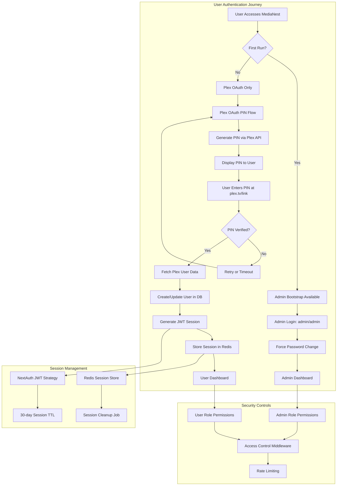

### Enhanced Authentication Flow (Future Implementation)
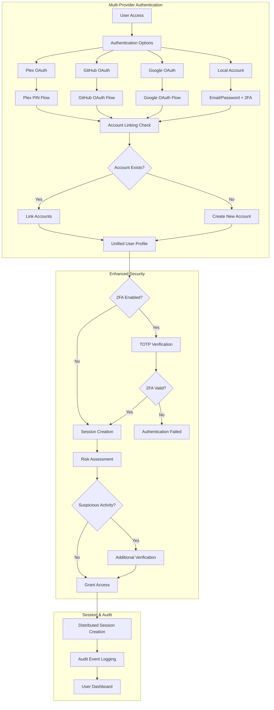

## Distributed Session Architecture

### Current Session Management
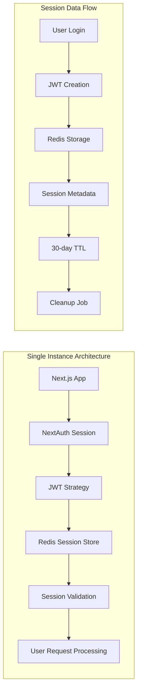

### Enhanced Distributed Session Architecture
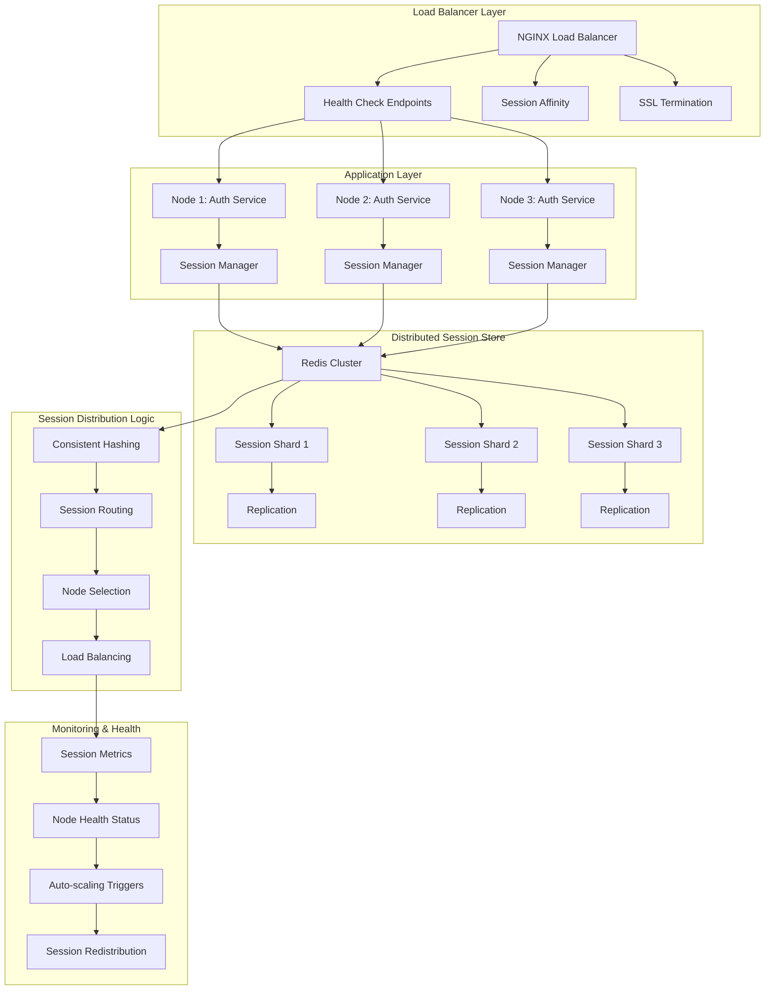

## Multi-Provider OAuth Integration

### OAuth Provider Registry Architecture
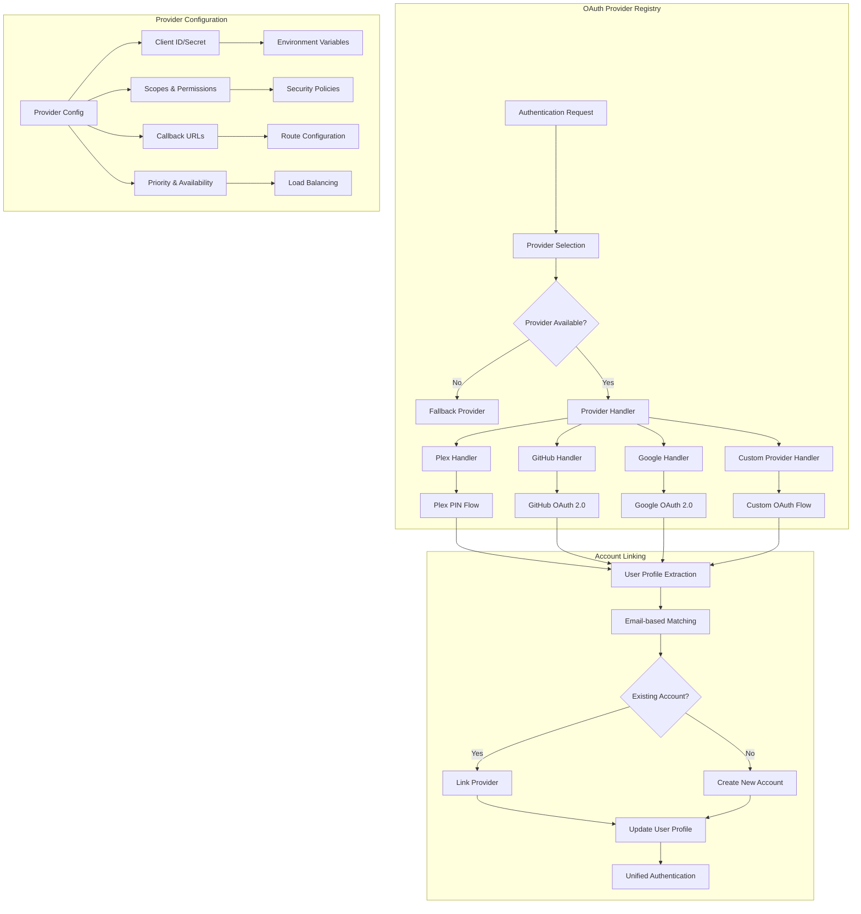

## Security Architecture Overview

### Defense in Depth Security Model
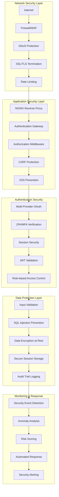

### Enhanced Authentication Security Flow
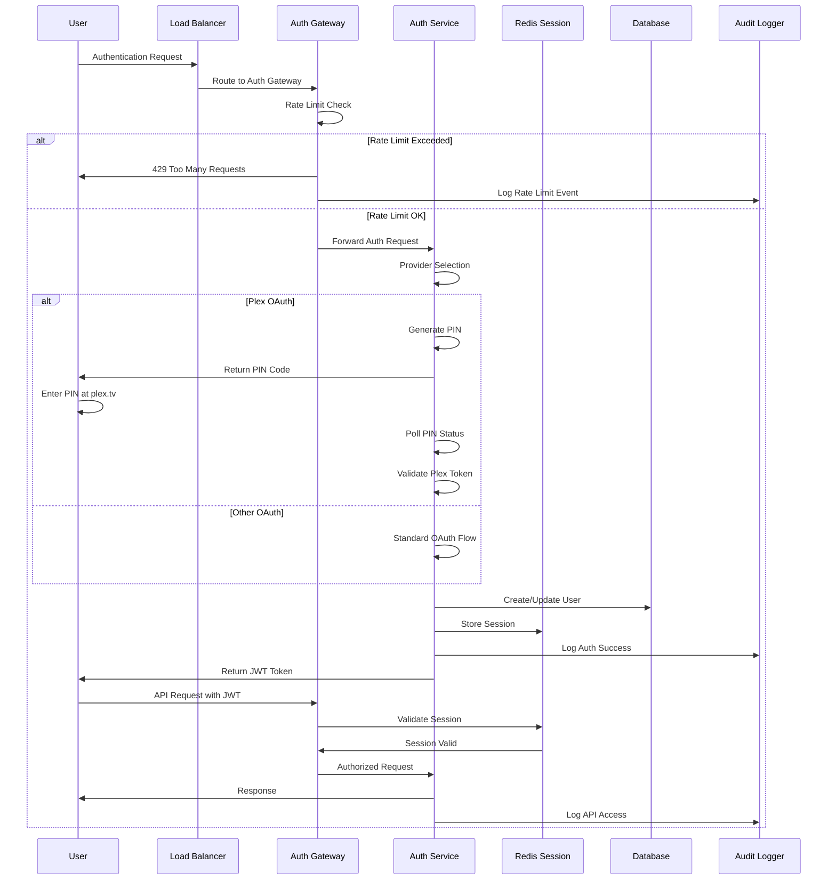

## Horizontal Scaling Architecture

### Multi-Node Deployment Architecture
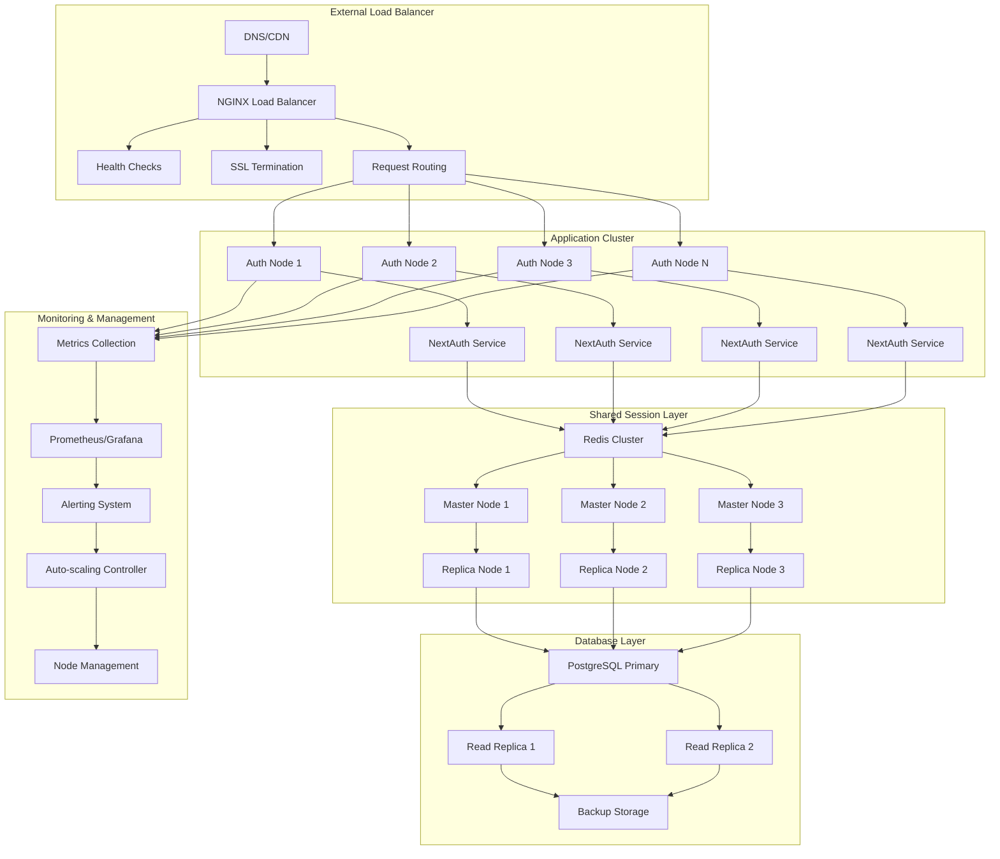

### Session Synchronization Flow
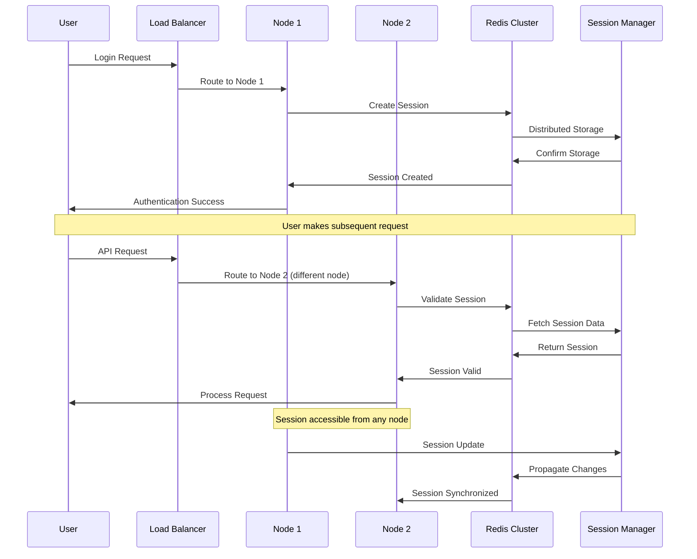

## Audit Trail and Monitoring

### Comprehensive Audit Architecture
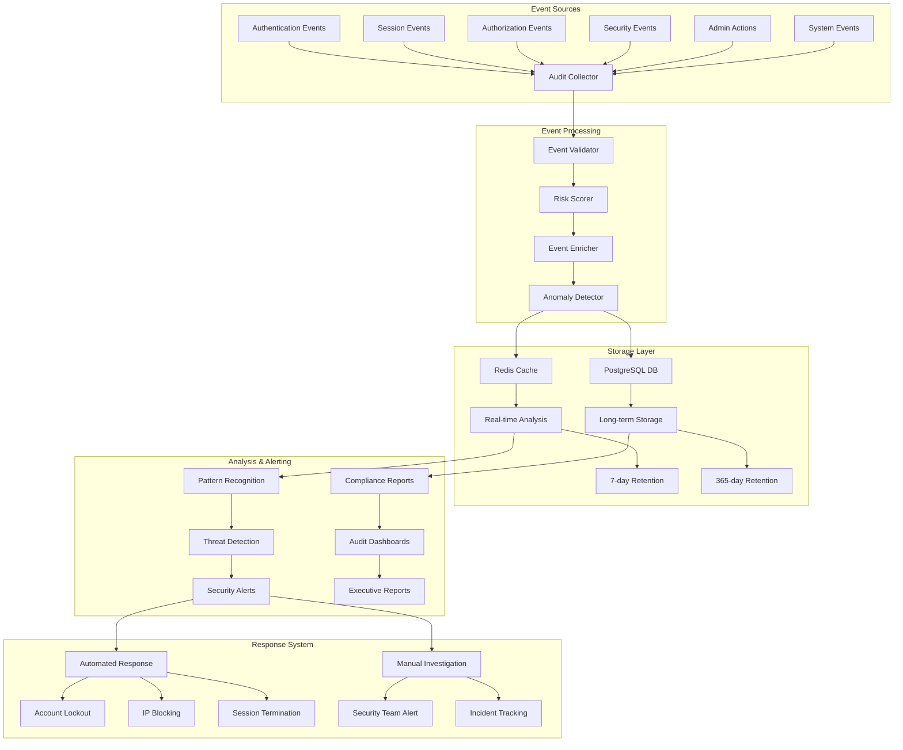

### Security Monitoring Dashboard Architecture
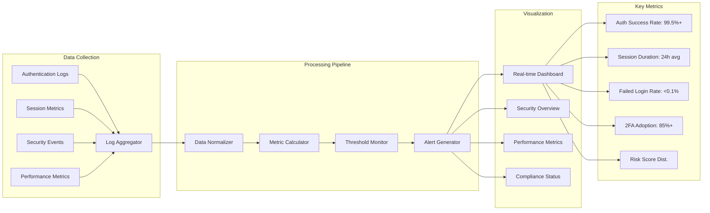

## Implementation Architecture Summary

### Technology Stack Integration
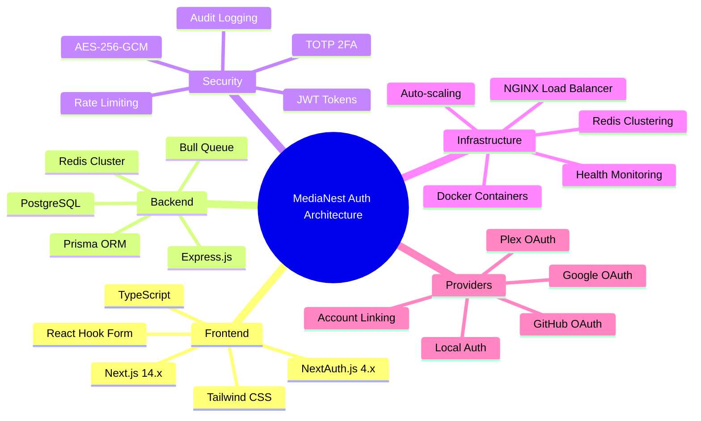

### Deployment Architecture
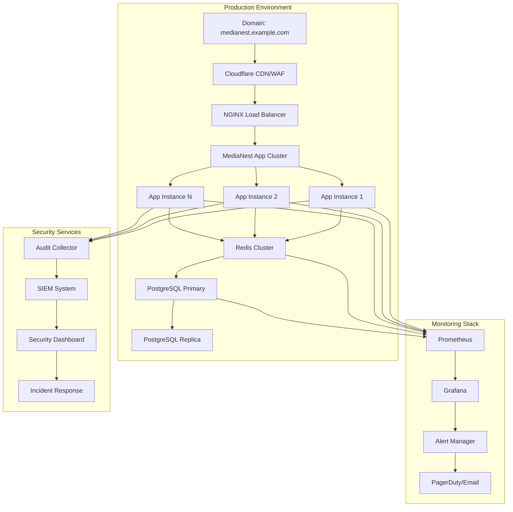

---

**Document Status:** Enhanced Architecture Review Complete  
**Next Review:** Architecture diagrams should be updated when implementing new phases  
**Maintainer:** System Architecture Team