# API Workflows & Integration Patterns

This document outlines the comprehensive API workflows, integration patterns, and data flow sequences within MediaNest's API ecosystem.

## API Architecture Overview

```mermaid
graph TB
    subgraph "API Gateway Layer"
        API_GATEWAY[🌐 API Gateway<br/>Rate Limiting<br/>Authentication<br/>Request Routing]

        subgraph "API Versions"
            API_V1[📋 API v1<br/>Current Stable<br/>REST Endpoints]
            API_V2[📋 API v2<br/>Future Version<br/>GraphQL + REST]
        end
    end

    subgraph "Service Layer"
        subgraph "Core Services"
            AUTH_SVC[🔐 Authentication Service<br/>JWT Management<br/>Session Handling]
            MEDIA_SVC[🎬 Media Service<br/>Request Processing<br/>Library Management]
            USER_SVC[👤 User Service<br/>Profile Management<br/>Preferences]
            DOWNLOAD_SVC[⬇️ Download Service<br/>YouTube Integration<br/>File Management]
        end

        subgraph "Integration Services"
            PLEX_SVC[🎭 Plex Integration<br/>Library Sync<br/>OAuth Management]
            OVERSEERR_SVC[📥 Overseerr Integration<br/>Request Forwarding<br/>Status Sync]
            UPTIME_SVC[📊 Uptime Integration<br/>Service Monitoring<br/>Health Checks]
        end
    end

    subgraph "Data Access Layer"
        POSTGRES_REPO[🐘 PostgreSQL Repository<br/>Data Persistence<br/>Transaction Management]
        REDIS_CACHE[🔴 Redis Cache<br/>Session Storage<br/>Query Caching]
        FILE_STORAGE[💾 File Storage<br/>Media Files<br/>Upload Management]
    end

    %% API Gateway connections
    API_GATEWAY --> API_V1
    API_GATEWAY --> API_V2

    %% Service connections
    API_V1 --> AUTH_SVC
    API_V1 --> MEDIA_SVC
    API_V1 --> USER_SVC
    API_V1 --> DOWNLOAD_SVC

    API_V2 --> AUTH_SVC
    API_V2 --> MEDIA_SVC
    API_V2 --> USER_SVC
    API_V2 --> DOWNLOAD_SVC

    %% Core service to integration service connections
    MEDIA_SVC --> PLEX_SVC
    MEDIA_SVC --> OVERSEERR_SVC
    USER_SVC --> PLEX_SVC
    DOWNLOAD_SVC --> UPTIME_SVC

    %% Data layer connections
    AUTH_SVC --> POSTGRES_REPO
    AUTH_SVC --> REDIS_CACHE
    MEDIA_SVC --> POSTGRES_REPO
    MEDIA_SVC --> REDIS_CACHE
    USER_SVC --> POSTGRES_REPO
    USER_SVC --> REDIS_CACHE
    DOWNLOAD_SVC --> POSTGRES_REPO
    DOWNLOAD_SVC --> FILE_STORAGE

    PLEX_SVC --> REDIS_CACHE
    OVERSEERR_SVC --> REDIS_CACHE
    UPTIME_SVC --> REDIS_CACHE

    %% Styling
    classDef gateway fill:#e1f5fe,stroke:#0277bd,stroke-width:3px
    classDef coreService fill:#e8f5e8,stroke:#4caf50,stroke-width:2px
    classDef integration fill:#fff3e0,stroke:#f57c00,stroke-width:2px
    classDef dataLayer fill:#ffebee,stroke:#d32f2f,stroke-width:2px

    class API_GATEWAY,API_V1,API_V2 gateway
    class AUTH_SVC,MEDIA_SVC,USER_SVC,DOWNLOAD_SVC coreService
    class PLEX_SVC,OVERSEERR_SVC,UPTIME_SVC integration
    class POSTGRES_REPO,REDIS_CACHE,FILE_STORAGE dataLayer
```

## Media Request API Workflow

```mermaid
sequenceDiagram
    participant Client as 📱 Client App
    participant Gateway as 🌐 API Gateway
    participant Auth as 🔐 Auth Service
    participant Media as 🎬 Media Service
    participant Plex as 🎭 Plex Service
    participant Overseerr as 📥 Overseerr Service
    participant DB as 🐘 Database
    participant Queue as 📋 Job Queue
    participant Worker as ⚙️ Background Worker
    participant Cache as 🔴 Redis Cache

    Note over Client,Cache: Media Request Flow

    Client->>Gateway: POST /api/v1/media/request
    Gateway->>Auth: Validate JWT Token
    Auth->>Cache: Check Session Cache
    Cache->>Auth: Session Valid
    Auth->>Gateway: User Authenticated

    Gateway->>Media: Process Media Request
    Media->>DB: Check Duplicate Requests
    DB->>Media: No Duplicates Found

    Media->>Plex: Check If Already Available
    Plex->>Media: Media Not Found

    Media->>DB: Create Media Request Record
    DB->>Media: Request Created (ID: req_123)

    Media->>Queue: Queue Processing Job
    Queue->>Media: Job Queued (job_456)

    Media->>Gateway: Return Request Created
    Gateway->>Client: 201 Created {requestId: req_123}

    Note over Worker,Cache: Background Processing

    Queue->>Worker: Process Media Request Job
    Worker->>DB: Get Request Details
    DB->>Worker: Request Data

    Worker->>Overseerr: Submit Media Request
    Overseerr->>Worker: Request Submitted (overseerr_789)

    Worker->>DB: Update Request Status
    DB->>Worker: Status Updated

    Worker->>Cache: Invalidate Cache
    Worker->>Client: WebSocket Notification

    Note over Client,Cache: Status Check

    Client->>Gateway: GET /api/v1/media/request/req_123
    Gateway->>Auth: Validate Token
    Auth->>Gateway: Authenticated

    Gateway->>Media: Get Request Status
    Media->>Cache: Check Cache
    Cache->>Media: Cache Miss

    Media->>DB: Query Request Status
    DB->>Media: Request Data + Status

    Media->>Cache: Cache Response (TTL: 5min)
    Media->>Gateway: Return Status
    Gateway->>Client: 200 OK {status: "processing"}
```

## User Authentication API Flow

## WebSocket Real-time Communication

```mermaid
sequenceDiagram
    participant Client as 📱 Client
    participant Gateway as 🌐 WebSocket Gateway
    participant Auth as 🔐 Auth Service
    participant Socket as 🔌 Socket.IO Server
    participant Redis as 🔴 Redis PubSub
    participant Worker as ⚙️ Background Worker
    participant DB as 🐘 Database

    Note over Client,DB: WebSocket Connection Setup

    Client->>Gateway: WebSocket Connection Request
    Gateway->>Auth: Validate Connection Token
    Auth->>Gateway: Token Valid

    Gateway->>Socket: Establish Connection
    Socket->>Redis: Subscribe to User Channels
    Redis->>Socket: Subscription Confirmed

    Socket->>Client: Connection Established
    Socket->>Client: Send Initial State

    Note over Client,DB: Real-time Updates

    Worker->>DB: Update Media Request Status
    DB->>Worker: Status Updated

    Worker->>Redis: Publish Status Update
    Redis->>Socket: Status Change Event

    Socket->>Client: Emit 'mediaRequest:statusChanged'
    Client->>Socket: Acknowledge Receipt

    Note over Client,DB: Client-initiated Events

    Client->>Socket: Emit 'user:preferencesChanged'
    Socket->>Auth: Validate User Permissions
    Auth->>Socket: Permissions Valid

    Socket->>DB: Update User Preferences
    DB->>Socket: Preferences Updated

    Socket->>Redis: Publish User Update
    Redis->>Socket: Broadcast to Other Sessions
    Socket->>Client: Emit 'preferences:updated'

    Note over Client,DB: Error Handling

    Client->>Socket: Emit Invalid Event
    Socket->>Client: Emit 'error' {code: 'INVALID_EVENT'}

    Socket->>Gateway: Connection Lost
    Gateway->>Redis: Unsubscribe from Channels
    Redis->>Gateway: Unsubscribed

    Note over Client,DB: Reconnection

    Client->>Gateway: Reconnection Attempt
    Gateway->>Socket: Re-establish Connection
    Socket->>Client: Connection Restored
    Socket->>Client: Send State Sync
```

## External Service Integration Patterns

```mermaid
graph LR
    subgraph "Integration Patterns"
        subgraph "Plex Integration"
            PLEX_AUTH[🔐 OAuth Flow<br/>Token Management<br/>Refresh Handling]
            PLEX_LIBRARY[📚 Library Sync<br/>Periodic Refresh<br/>Delta Updates]
            PLEX_SEARCH[🔍 Media Search<br/>Real-time Queries<br/>Metadata Enrichment]
            PLEX_WEBHOOK[🔗 Webhook Events<br/>New Media Alerts<br/>Status Updates]
        end

        subgraph "Overseerr Integration"
            OVERSEERR_PROXY[🔄 API Proxy<br/>Request Forwarding<br/>Response Translation]
            OVERSEERR_STATUS[📊 Status Sync<br/>Polling Updates<br/>Event Handling]
            OVERSEERR_WEBHOOK[📥 Webhook Processing<br/>Request Updates<br/>Completion Notifications]
        end

        subgraph "Uptime Kuma Integration"
            UPTIME_MONITOR[📊 Health Monitoring<br/>Service Status<br/>Response Times]
            UPTIME_ALERTS[🚨 Alert Processing<br/>Incident Management<br/>Escalation Rules]
            UPTIME_WEBHOOK[📢 Status Webhooks<br/>Real-time Updates<br/>Dashboard Sync]
        end

        subgraph "YouTube Integration"
            YT_METADATA[📺 Metadata Extraction<br/>Video Information<br/>Playlist Details]
            YT_DOWNLOAD[⬇️ Download Management<br/>Quality Selection<br/>Progress Tracking]
            YT_ORGANIZE[📁 File Organization<br/>Directory Structure<br/>Plex Integration]
        end
    end

    subgraph "Integration Infrastructure"
        subgraph "Circuit Breaker Pattern"
            CIRCUIT_CLOSED[✅ Closed State<br/>Normal Operation<br/>Request Forwarding]
            CIRCUIT_OPEN[❌ Open State<br/>Service Unavailable<br/>Fast Failure]
            CIRCUIT_HALF[🔄 Half-Open State<br/>Testing Recovery<br/>Gradual Restoration]
        end

        subgraph "Retry Logic"
            IMMEDIATE[⚡ Immediate Retry<br/>Network Errors<br/>Timeout Issues]
            EXPONENTIAL[📈 Exponential Backoff<br/>Rate Limit Errors<br/>Service Overload]
            DEAD_LETTER[💀 Dead Letter Queue<br/>Failed Requests<br/>Manual Review]
        end

        subgraph "Fallback Strategies"
            CACHED_DATA[💾 Cached Response<br/>Stale Data Tolerance<br/>Graceful Degradation]
            DEFAULT_VALUES[🎯 Default Values<br/>Service Unavailable<br/>Basic Functionality]
            QUEUE_LATER[📋 Queue for Later<br/>Eventual Consistency<br/>Background Processing]
        end
    end

    %% Integration connections
    PLEX_AUTH --> CIRCUIT_CLOSED
    PLEX_LIBRARY --> IMMEDIATE
    PLEX_SEARCH --> CACHED_DATA
    PLEX_WEBHOOK --> QUEUE_LATER

    OVERSEERR_PROXY --> EXPONENTIAL
    OVERSEERR_STATUS --> CIRCUIT_HALF
    OVERSEERR_WEBHOOK --> DEFAULT_VALUES

    UPTIME_MONITOR --> IMMEDIATE
    UPTIME_ALERTS --> DEAD_LETTER
    UPTIME_WEBHOOK --> QUEUE_LATER

    YT_METADATA --> CACHED_DATA
    YT_DOWNLOAD --> EXPONENTIAL
    YT_ORGANIZE --> DEFAULT_VALUES

    %% Circuit breaker state transitions
    CIRCUIT_CLOSED --> CIRCUIT_OPEN
    CIRCUIT_OPEN --> CIRCUIT_HALF
    CIRCUIT_HALF --> CIRCUIT_CLOSED
    CIRCUIT_HALF --> CIRCUIT_OPEN

    %% Styling
    classDef plexIntegration fill:#e1f5fe,stroke:#0277bd,stroke-width:2px
    classDef overseerrIntegration fill:#e8f5e8,stroke:#4caf50,stroke-width:2px
    classDef uptimeIntegration fill:#fff3e0,stroke:#f57c00,stroke-width:2px
    classDef youtubeIntegration fill:#ffebee,stroke:#d32f2f,stroke-width:2px
    classDef circuitBreaker fill:#f3e5f5,stroke:#9c27b0,stroke-width:2px
    classDef retryLogic fill:#e0f2f1,stroke:#00695c,stroke-width:2px
    classDef fallbackStrategy fill:#fce4ec,stroke:#ad1457,stroke-width:2px

    class PLEX_AUTH,PLEX_LIBRARY,PLEX_SEARCH,PLEX_WEBHOOK plexIntegration
    class OVERSEERR_PROXY,OVERSEERR_STATUS,OVERSEERR_WEBHOOK overseerrIntegration
    class UPTIME_MONITOR,UPTIME_ALERTS,UPTIME_WEBHOOK uptimeIntegration
    class YT_METADATA,YT_DOWNLOAD,YT_ORGANIZE youtubeIntegration
    class CIRCUIT_CLOSED,CIRCUIT_OPEN,CIRCUIT_HALF circuitBreaker
    class IMMEDIATE,EXPONENTIAL,DEAD_LETTER retryLogic
    class CACHED_DATA,DEFAULT_VALUES,QUEUE_LATER fallbackStrategy
```

## API Error Handling & Recovery

This comprehensive API workflow documentation covers all major interaction patterns, error handling strategies, and integration approaches used throughout MediaNest's API ecosystem, ensuring robust and reliable service interactions.
