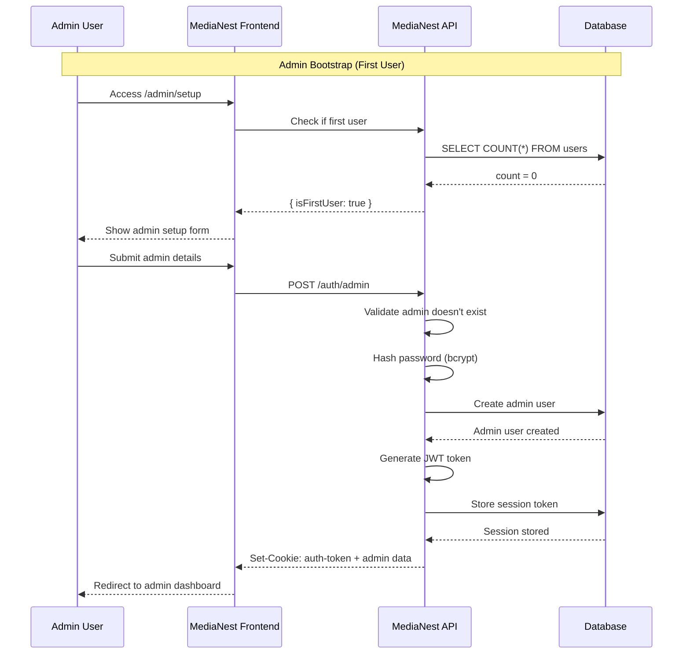
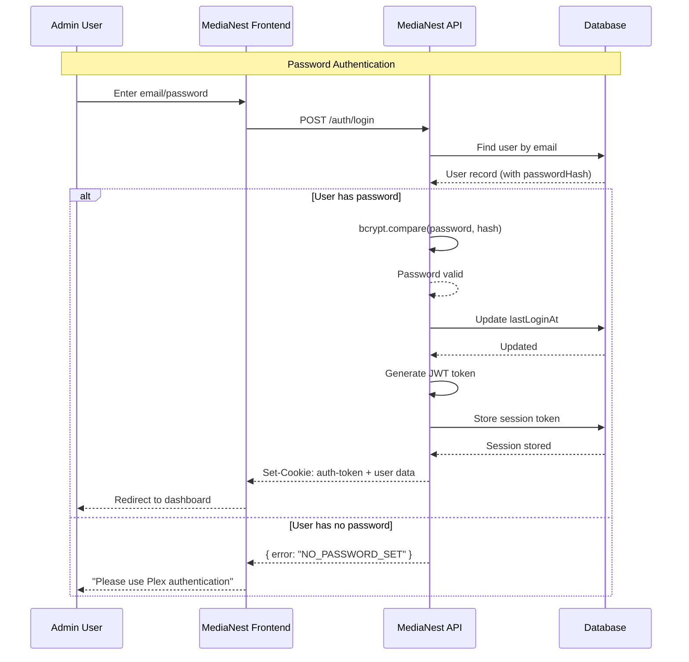
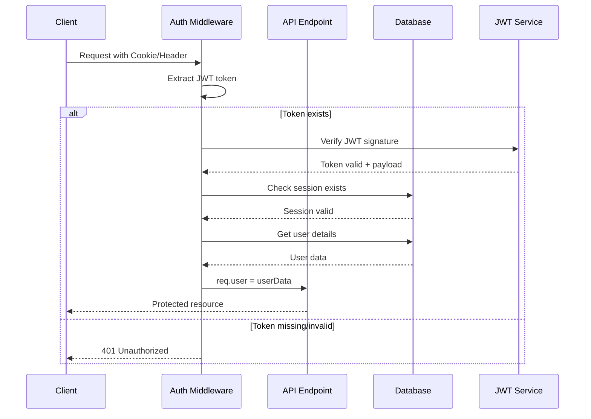
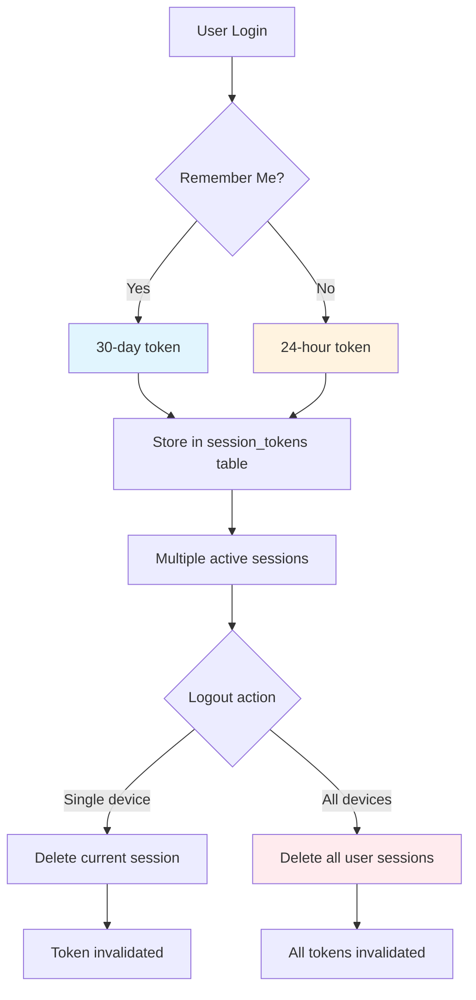
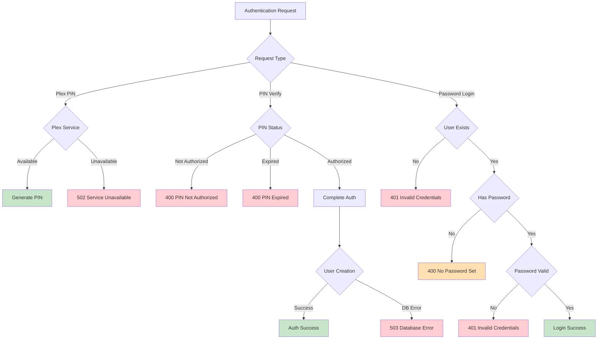
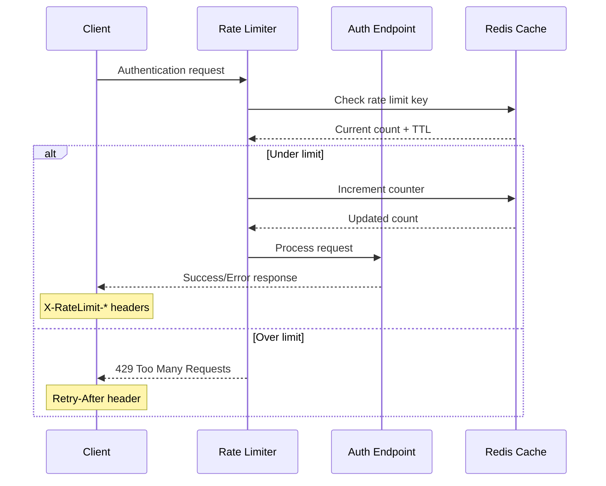
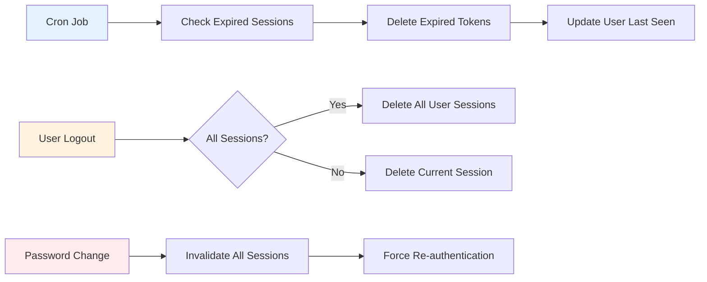

# Authentication Flow Diagrams

MediaNest uses multiple authentication methods with detailed flows for different use cases.

## Plex OAuth Flow

The primary authentication method using Plex.tv accounts:

```mermaid
sequenceDiagram
    participant U as User Browser
    participant M as MediaNest Frontend
    participant A as MediaNest API
    participant P as Plex.tv API
    participant DB as Database

    Note over U,DB: Initial Authentication Request
    U->>M: Click "Login with Plex"
    M->>A: POST /auth/plex/pin
    A->>P: Create PIN (X-Plex-Client-Identifier)
    P-->>A: PIN ID, Code, Expires (XML)
    A-->>M: { id, code, qrUrl, expiresIn }
    M-->>U: Show PIN code + QR code

    Note over U,P: User Authorization on Plex.tv
    U->>P: Visit plex.tv/link + Enter PIN
    P-->>U: Authorization page
    U->>P: Authorize MediaNest app
    P-->>U: Authorization confirmed

    Note over M,DB: Polling for Authorization
    loop Every 5 seconds
        M->>A: GET /auth/plex/pin/:id/status
        A->>P: Check PIN status
        P-->>A: Authorization status
        A-->>M: { authorized: true/false }
        break when authorized = true
    end

    Note over M,DB: Complete Authentication
    M->>A: POST /auth/plex (pinId)
    A->>P: Get auth token for PIN
    P-->>A: Plex auth token
    A->>P: Get user profile (/users/account.xml)
    P-->>A: User details (XML)

    A->>DB: Find/Create user by plexId
    DB-->>A: User record
    A->>A: Generate JWT token
    A->>DB: Store session token
    DB-->>A: Session stored

    A-->>M: Set-Cookie: auth-token + user data
    M-->>U: Redirect to dashboard
```

## Admin Bootstrap Flow

First-time admin user creation:



## Password Login Flow

For admin users with passwords:



## Session Validation Flow

How JWT tokens are validated on protected endpoints:



## Multi-Device Session Management

How sessions are handled across devices:



## Error Handling Flows

Authentication error scenarios:



## Rate Limiting Flow

How authentication rate limiting works:



## Session Cleanup Flow

Automatic session management:



## Security Considerations

### Token Security

- JWT tokens stored in HTTP-only cookies
- Secure flag set in production
- SameSite protection against CSRF
- Configurable expiration times

### Session Management

- Database-backed session validation
- Immediate invalidation on logout
- Cleanup of expired sessions
- Multi-device session tracking

### Rate Limiting

- Per-IP limits on auth endpoints
- Exponential backoff on failures
- Distributed rate limiting via Redis
- Bypass for trusted sources

### Audit Logging

- All auth events logged
- Failed login attempt tracking
- Session creation/destruction events
- Admin action audit trail
