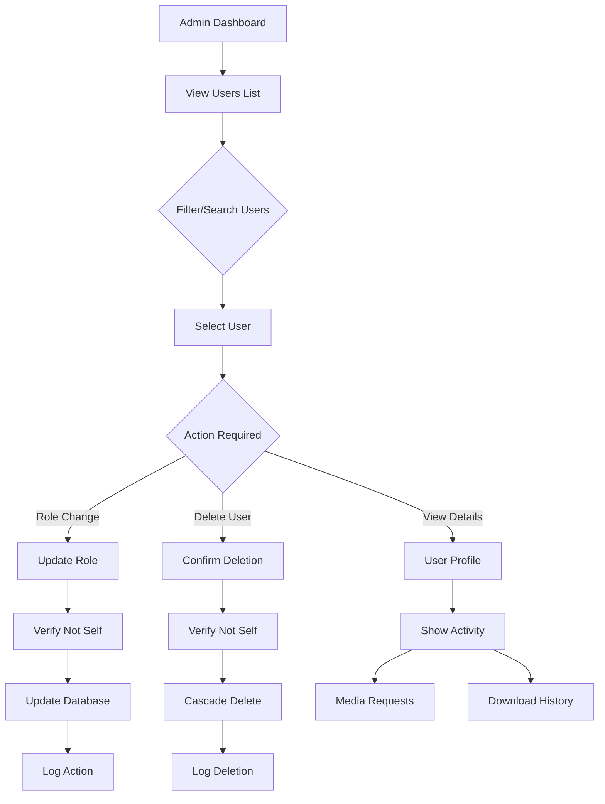

# Admin Endpoints

Admin endpoints provide user management, system administration, and service configuration capabilities. All admin endpoints require the `admin` role.

## Overview

Admin functionality includes:
- **User Management**: View, modify, and delete users
- **System Statistics**: Comprehensive system metrics
- **Service Configuration**: External service management
- **Role Management**: User role assignment

## Authentication

All admin endpoints require:
- Valid JWT token with `admin` role
- Proper authorization headers or cookies

## Endpoints

### GET /api/admin/users

Get all users with pagination, filtering, and sorting.

**Request**
```http
GET /api/admin/users?page=1&pageSize=20&search=john&role=user&sortBy=createdAt&sortOrder=desc
```

**Query Parameters**
- `page` (integer): Page number (default: 1)
- `pageSize` (integer): Items per page (default: 20, max: 100)
- `search` (string): Search in username/email
- `role` (string): Filter by role (`user`, `admin`, `all`)
- `sortBy` (string): Sort field (`createdAt`, `lastLoginAt`, `email`, `role`)
- `sortOrder` (string): Sort direction (`asc`, `desc`)

**Response** (200 OK)
```json
{
  "success": true,
  "data": {
    "users": [
      {
        "id": "user-123",
        "plexId": "plex-456",
        "plexUsername": "johnuser",
        "email": "john@example.com",
        "image": "https://plex.tv/users/avatar.jpg",
        "role": "user",
        "createdAt": "2023-12-01T10:00:00Z",
        "lastLoginAt": "2023-12-10T15:30:00Z",
        "_count": {
          "mediaRequests": 15,
          "youtubeDownloads": 3
        }
      }
    ],
    "pagination": {
      "total": 150,
      "page": 1,
      "pageSize": 20,
      "totalPages": 8
    }
  }
}
```

**Error Responses**
- `403` - Insufficient permissions (non-admin user)

### PUT /api/admin/users/:userId/role

Update a user's role.

**Request**
```http
PUT /api/admin/users/user-123/role
Content-Type: application/json

{
  "role": "admin"
}
```

**Response** (200 OK)
```json
{
  "success": true,
  "data": {
    "id": "user-123",
    "plexUsername": "johnuser",
    "email": "john@example.com",
    "role": "admin"
  }
}
```

**Error Responses**
- `400` - Invalid role or trying to remove own admin role
- `404` - User not found

### DELETE /api/admin/users/:userId

Delete a user account and all associated data.

**Request**
```http
DELETE /api/admin/users/user-123
```

**Response** (200 OK)
```json
{
  "success": true,
  "message": "User deleted successfully"
}
```

**Error Responses**
- `400` - Cannot delete own account
- `404` - User not found

**Cascade Behavior**: Deletes all associated media requests, YouTube downloads, and session tokens.

### GET /api/admin/stats

Get comprehensive system statistics.

**Request**
```http
GET /api/admin/stats
```

**Response** (200 OK)
```json
{
  "success": true,
  "data": {
    "users": {
      "total": 150,
      "active": 85
    },
    "requests": {
      "total": 1250,
      "pending": 25
    },
    "downloads": {
      "total": 340,
      "active": 3
    }
  }
}
```

**Statistics Include**:
- **Users**: Total count and active users (logged in within 30 days)
- **Media Requests**: Total and pending request counts
- **YouTube Downloads**: Total and currently active downloads

### GET /api/admin/services

Get all external service configurations.

**Request**
```http
GET /api/admin/services
```

**Response** (200 OK)
```json
{
  "success": true,
  "data": [
    {
      "id": "service-123",
      "serviceName": "overseerr",
      "serviceUrl": "https://overseerr.example.com",
      "isActive": true,
      "lastChecked": "2023-12-01T10:00:00Z",
      "configuration": {
        "apiKey": "***MASKED***",
        "timeout": 30000
      }
    }
  ]
}
```

**Note**: Sensitive configuration values are masked in the response for security.

## Security Safeguards

### Self-Protection
- Admins cannot delete their own account
- Admins cannot remove their own admin role
- Last admin cannot be demoted or deleted

### Audit Logging
All admin actions are logged with:
- Admin user ID performing the action
- Target user/resource affected
- Action performed and timestamp
- IP address and user agent

### Rate Limiting
Admin endpoints have generous rate limits but still enforce:
- 100 requests per minute for read operations
- 20 requests per minute for write operations

## User Management Workflow



## Permission Matrix

| Endpoint | User | Admin | Notes |
|----------|------|--------|-------|
| GET /admin/users | ❌ | ✅ | View all users |
| PUT /admin/users/:id/role | ❌ | ✅ | Cannot modify self |
| DELETE /admin/users/:id | ❌ | ✅ | Cannot delete self |
| GET /admin/stats | ❌ | ✅ | System statistics |
| GET /admin/services | ❌ | ✅ | Service configurations |

## Error Handling

Admin endpoints use consistent error responses:

```json
{
  "error": "ERROR_CODE",
  "message": "Human-readable error message",
  "details": ["Additional context"]
}
```

Common error codes:
- `ACCESS_DENIED` - Insufficient permissions
- `VALIDATION_ERROR` - Invalid request data
- `NOT_FOUND` - Resource not found
- `INTERNAL_ERROR` - Server error during operation

## Best Practices

1. **Regular Monitoring**: Check admin stats regularly for system health
2. **User Lifecycle**: Promptly remove access for departed users
3. **Role Management**: Use principle of least privilege for role assignments
4. **Audit Review**: Regularly review admin action logs
5. **Backup**: Ensure backups before bulk user operations