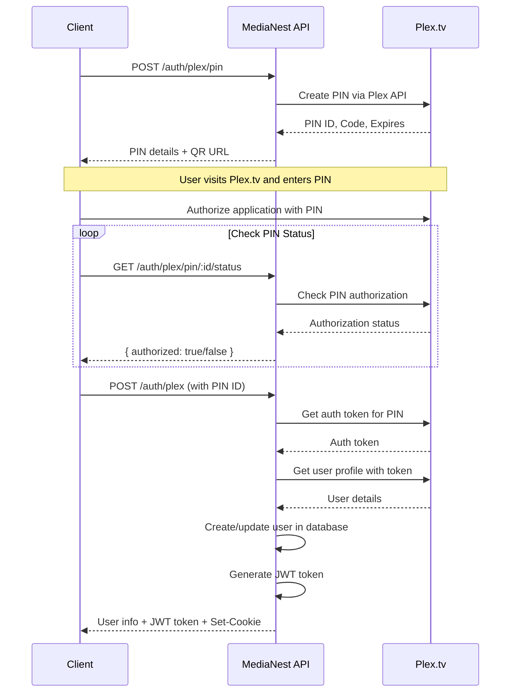

# Authentication Endpoints

Authentication in MediaNest uses Plex OAuth for user authentication and JWT tokens for session management. The API supports both cookie-based and header-based authentication.

## Overview

MediaNest provides multiple authentication methods:
- **Plex OAuth**: Primary authentication method using Plex.tv accounts
- **Admin Bootstrap**: One-time admin user creation for first deployment
- **Password Login**: For admin users with passwords set
- **Session Management**: JWT-based session handling

## Endpoints

### POST /api/auth/plex/pin

Generate a Plex OAuth PIN for authentication flow initiation.

**Request**
```http
POST /api/auth/plex/pin
Content-Type: application/json

{
  "clientName": "MediaNest" // Optional, defaults to "MediaNest"
}
```

**Response** (200 OK)
```json
{
  "success": true,
  "data": {
    "id": "123456789",
    "code": "ABCD1234",
    "qrUrl": "https://plex.tv/link/?pin=ABCD1234",
    "expiresIn": 900
  }
}
```

**Error Responses**
- `502` - Plex service unavailable
- `503` - Plex connection timeout
- `504` - Plex timeout

### GET /api/auth/plex/pin/:id/status

Check the authorization status of a Plex PIN.

**Request**
```http
GET /api/auth/plex/pin/123456789/status
```

**Response** (200 OK)
```json
{
  "success": true,
  "data": {
    "id": "123456789",
    "authorized": true,
    "expiresAt": "2023-12-01T10:15:00Z"
  }
}
```

### POST /api/auth/plex

Complete Plex OAuth flow and create authenticated session.

**Request**
```http
POST /api/auth/plex
Content-Type: application/json

{
  "pinId": "123456789"
}
```

**Response** (200 OK)
```json
{
  "success": true,
  "data": {
    "user": {
      "id": "user-abc123",
      "username": "plexuser",
      "email": "user@example.com", 
      "role": "user"
    },
    "token": "eyJhbGciOiJIUzI1NiIsInR5cCI6IkpXVCJ9...",
    "isNewUser": true
  }
}
```

**Set-Cookie Header**: `auth-token=<jwt>; HttpOnly; Secure; SameSite=Lax; Max-Age=86400`

**Error Responses**
- `400` - PIN not authorized or invalid
- `502` - Failed to retrieve user information from Plex
- `503` - Database error during user creation

### POST /api/auth/admin

Bootstrap admin user creation (only available when no users exist).

**Request**
```http
POST /api/auth/admin
Content-Type: application/json

{
  "email": "admin@medianest.com",
  "password": "securepassword123",
  "name": "Admin User"
}
```

**Response** (200 OK)
```json
{
  "success": true,
  "data": {
    "user": {
      "id": "admin-123",
      "email": "admin@medianest.com",
      "name": "Admin User",
      "role": "admin"
    },
    "token": "eyJhbGciOiJIUzI1NiIsInR5cCI6IkpXVCJ9...",
    "message": "Admin user created successfully"
  }
}
```

**Error Responses**
- `400` - Admin user already exists

### POST /api/auth/login

Password-based login for admin users.

**Request**
```http
POST /api/auth/login
Content-Type: application/json

{
  "email": "admin@medianest.com",
  "password": "securepassword123",
  "rememberMe": false // Optional, extends session to 30 days
}
```

**Response** (200 OK)
```json
{
  "success": true,
  "data": {
    "user": {
      "id": "admin-123",
      "email": "admin@medianest.com",
      "name": "Admin User",
      "role": "admin",
      "plexUsername": null
    },
    "token": "eyJhbGciOiJIUzI1NiIsInR5cCI6IkpXVCJ9..."
  }
}
```

**Error Responses**
- `401` - Invalid credentials
- `400` - User has no password set (must use Plex auth)

### GET /api/auth/session

Get current authenticated user session information.

**Request**
```http
GET /api/auth/session
Authorization: Bearer <token>
```

**Response** (200 OK)
```json
{
  "success": true,
  "data": {
    "user": {
      "id": "user-abc123",
      "username": "plexuser",
      "email": "user@example.com",
      "role": "user",
      "plexUsername": "plexuser",
      "lastLoginAt": "2023-12-01T09:30:00Z"
    },
    "authenticated": true
  }
}
```

### POST /api/auth/logout

Logout user and invalidate session.

**Request**
```http
POST /api/auth/logout
Authorization: Bearer <token>

{
  "allSessions": false // Optional, logout from all devices
}
```

**Response** (200 OK)
```json
{
  "success": true,
  "data": {
    "message": "Logged out successfully"
  }
}
```

### POST /api/auth/change-password

Change user password (admin users only).

**Request**
```http
POST /api/auth/change-password
Authorization: Bearer <token>

{
  "currentPassword": "oldpassword123",
  "newPassword": "newpassword456"
}
```

**Response** (200 OK)
```json
{
  "success": true,
  "data": {
    "message": "Password changed successfully"
  }
}
```

**Error Responses**
- `400` - Current password incorrect
- `400` - Admin users must have a password

## Authentication Flow Diagram



## Rate Limiting

Authentication endpoints have specific rate limits:

- `/auth/plex/pin`: 10 requests per minute per IP
- `/auth/plex`: 5 requests per minute per IP  
- `/auth/login`: 5 requests per minute per IP
- `/auth/change-password`: 3 requests per minute per user

## Security Considerations

1. **JWT Tokens**: Stored in HTTP-only cookies by default for security
2. **CSRF Protection**: Required for state-changing operations
3. **Password Hashing**: Uses bcrypt with 12 rounds for admin passwords
4. **Session Management**: Tokens have configurable expiration times
5. **Rate Limiting**: Prevents brute force attacks
6. **Audit Logging**: Authentication events are logged for security monitoring

## Error Handling

All authentication endpoints return consistent error formats:

```json
{
  "error": "ERROR_CODE",
  "message": "Human-readable error message",
  "details": ["Additional context if available"]
}
```

Common error codes:
- `AUTH_ERROR` - General authentication failure
- `PLEX_ERROR` - Plex service integration issue
- `VALIDATION_ERROR` - Request validation failed
- `TOKEN_ERROR` - JWT token generation/validation failed
- `DATABASE_ERROR` - User database operation failed