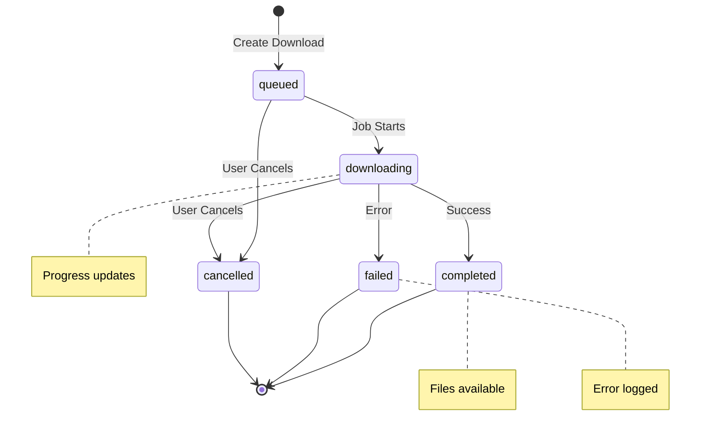

# YouTube Download Endpoints

YouTube download endpoints provide functionality for downloading videos with queue management, progress tracking, and WebSocket real-time updates.

## Overview

MediaNest's YouTube integration includes:
- **Video Downloads**: Queue-based downloading with progress tracking
- **Metadata Extraction**: Get video information without downloading
- **Rate Limiting**: Prevents abuse with 5 downloads per hour per user
- **Real-time Updates**: WebSocket events for download progress
- **Quality Selection**: Multiple quality and format options

## Authentication

All YouTube endpoints require valid JWT authentication.

## Endpoints

### POST /api/youtube/download

Create a new YouTube download job.

**Request**
```http
POST /api/youtube/download
Content-Type: application/json
Authorization: Bearer <token>

{
  "url": "https://www.youtube.com/watch?v=dQw4w9WgXcQ",
  "quality": "1080p",
  "format": "mp4"
}
```

**Request Body**
- `url` (string, required): YouTube video URL
- `quality` (string, optional): Video quality (default: "1080p")
  - Options: "144p", "240p", "360p", "480p", "720p", "1080p", "1440p", "2160p"
- `format` (string, optional): Video format (default: "mp4")
  - Options: "mp4", "webm", "mkv"

**Response** (201 Created)
```json
{
  "id": "download-123",
  "videoId": "dQw4w9WgXcQ",
  "title": "Rick Astley - Never Gonna Give You Up",
  "channel": "RickAstleyVEVO",
  "duration": 213,
  "thumbnail": "https://img.youtube.com/vi/dQw4w9WgXcQ/maxresdefault.jpg",
  "status": "queued",
  "progress": 0,
  "jobId": "bull-job-456",
  "quality": "1080p",
  "format": "mp4",
  "userId": "user-123",
  "createdAt": "2023-12-01T10:00:00Z"
}
```

**Rate Limiting Headers**
```
X-RateLimit-Limit: 5
X-RateLimit-Remaining: 4
X-RateLimit-Reset: 2023-12-01T11:00:00Z
```

**Error Responses**
- `429` - Rate limit exceeded (5 downloads per hour)
- `409` - Video already downloading or queued
- `400` - Invalid URL or unsupported video

### GET /api/youtube/downloads

Get user's download history with pagination and filtering.

**Request**
```http
GET /api/youtube/downloads?page=1&limit=20&status=completed
```

**Query Parameters**
- `page` (integer): Page number (default: 1)
- `limit` (integer): Items per page (default: 20, max: 100)
- `status` (string): Filter by status
  - Options: "queued", "downloading", "completed", "failed", "cancelled"

**Response** (200 OK)
```json
{
  "downloads": [
    {
      "id": "download-123",
      "url": "https://www.youtube.com/watch?v=dQw4w9WgXcQ",
      "title": "Rick Astley - Never Gonna Give You Up",
      "status": "completed",
      "progress": 100,
      "filePaths": [
        "/downloads/user-123/Rick Astley - Never Gonna Give You Up.mp4"
      ],
      "fileSize": 52428800,
      "quality": "1080p",
      "format": "mp4",
      "error": null,
      "createdAt": "2023-12-01T10:00:00Z",
      "completedAt": "2023-12-01T10:03:45Z"
    }
  ],
  "total": 25,
  "page": 1,
  "limit": 20,
  "totalPages": 2
}
```

### GET /api/youtube/downloads/:id

Get specific download details and current progress.

**Request**
```http
GET /api/youtube/downloads/download-123
```

**Response** (200 OK)
```json
{
  "id": "download-123",
  "url": "https://www.youtube.com/watch?v=dQw4w9WgXcQ",
  "title": "Rick Astley - Never Gonna Give You Up",
  "status": "downloading",
  "progress": 75,
  "filePaths": [],
  "fileSize": 0,
  "quality": "1080p",
  "format": "mp4",
  "error": null,
  "jobId": "bull-job-456",
  "jobDetails": {
    "progress": 75,
    "attemptsMade": 1,
    "processedOn": "2023-12-01T10:01:00Z",
    "finishedOn": null,
    "failedReason": ""
  },
  "createdAt": "2023-12-01T10:00:00Z",
  "completedAt": null
}
```

**Error Responses**
- `404` - Download not found or access denied

### DELETE /api/youtube/downloads/:id

Cancel or delete a download job.

**Request**
```http
DELETE /api/youtube/downloads/download-123
```

**Response** (200 OK)
```json
{
  "message": "Download cancelled successfully"
}
```

**Error Responses**
- `400` - Cannot cancel completed download
- `404` - Download not found

**Behavior**:
- Removes queued/active jobs from the queue
- Updates status to "cancelled"
- Emits WebSocket cancellation event

### GET /api/youtube/metadata

Get video metadata without downloading.

**Request**
```http
GET /api/youtube/metadata?url=https://www.youtube.com/watch?v=dQw4w9WgXcQ
```

**Query Parameters**
- `url` (string, required): YouTube video URL

**Response** (200 OK)
```json
{
  "id": "dQw4w9WgXcQ",
  "title": "Rick Astley - Never Gonna Give You Up",
  "channel": "RickAstleyVEVO",
  "duration": 213,
  "thumbnail": "https://img.youtube.com/vi/dQw4w9WgXcQ/maxresdefault.jpg",
  "description": "The official video for \"Never Gonna Give You Up\" by Rick Astley...",
  "uploadDate": "2009-10-25",
  "viewCount": 1400000000,
  "availableQualities": ["144p", "240p", "360p", "480p", "720p", "1080p"]
}
```

**Error Responses**
- `400` - Invalid URL or video unavailable

## WebSocket Events

YouTube downloads emit real-time events via WebSocket:

### youtube:created
Emitted when download is queued:
```json
{
  "downloadId": "download-123",
  "title": "Rick Astley - Never Gonna Give You Up",
  "thumbnail": "https://img.youtube.com/vi/dQw4w9WgXcQ/maxresdefault.jpg",
  "duration": 213,
  "status": "queued"
}
```

### youtube:progress
Emitted during download progress:
```json
{
  "downloadId": "download-123",
  "progress": 75,
  "status": "downloading",
  "speed": "2.5MB/s",
  "eta": "30s"
}
```

### youtube:completed
Emitted when download finishes:
```json
{
  "downloadId": "download-123",
  "status": "completed",
  "filePaths": ["/downloads/user-123/video.mp4"],
  "fileSize": 52428800
}
```

### youtube:failed
Emitted when download fails:
```json
{
  "downloadId": "download-123",
  "status": "failed",
  "error": "Video unavailable or private"
}
```

### youtube:cancelled
Emitted when download is cancelled:
```json
{
  "downloadId": "download-123"
}
```

## Download Status Lifecycle



## Rate Limiting

YouTube downloads are rate limited to prevent abuse:

- **Limit**: 5 downloads per hour per user
- **Window**: Rolling 1-hour window
- **Headers**: Rate limit info in response headers
- **Reset**: Automatic reset after 1 hour from first download

**Rate Limit Response** (429 Too Many Requests):
```json
{
  "error": "Download rate limit exceeded",
  "limit": 5,
  "window": "1 hour",
  "retryAfter": 3600
}
```

## Queue Management

Downloads use Bull queue for processing:

- **Priority**: All downloads have equal priority (1)
- **Retries**: 3 attempts with exponential backoff
- **Concurrency**: Limited concurrent downloads to prevent system overload
- **Cleanup**: Failed jobs retained for debugging

## Supported Formats

### Video Qualities
- 144p, 240p, 360p, 480p (SD)
- 720p, 1080p (HD)
- 1440p, 2160p (4K) - when available

### Container Formats
- **MP4**: Best compatibility, recommended
- **WebM**: Open source, good compression
- **MKV**: High quality, larger files

## Error Handling

Common error scenarios:

### Video Unavailable
```json
{
  "error": "Video unavailable",
  "message": "Video is private, deleted, or region-blocked"
}
```

### Unsupported URL
```json
{
  "error": "Invalid URL",
  "message": "URL is not a valid YouTube video"
}
```

### Download Failed
```json
{
  "error": "Download failed",
  "message": "Network error or video processing failed",
  "details": ["Specific error from yt-dlp"]
}
```

## Best Practices

1. **Rate Limit Awareness**: Check rate limit headers before submitting downloads
2. **WebSocket Monitoring**: Use WebSocket events for real-time progress updates
3. **Quality Selection**: Choose appropriate quality for storage constraints
4. **Error Handling**: Implement retry logic for network failures
5. **Cleanup**: Regularly clean up old/failed downloads