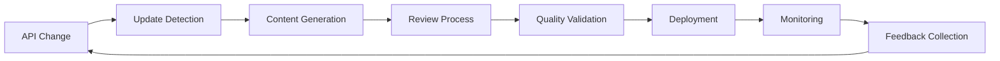

# API Documentation Maintenance Procedures

This document outlines the comprehensive maintenance procedures for MediaNest's API documentation system, ensuring high quality, accuracy, and continuous improvement of the documentation ecosystem.

## Overview

The API documentation maintenance system is designed to:

- **Automate** routine maintenance tasks
- **Validate** documentation accuracy and completeness
- **Monitor** documentation health and performance
- **Update** content based on API changes
- **Ensure** high documentation quality standards

## Maintenance Schedule

### Daily Automated Tasks

**Execution**: Every day at 2:00 AM UTC via GitHub Actions

```yaml
# .github/workflows/docs-maintenance.yml
name: Daily Documentation Maintenance
on:
  schedule:
    - cron: '0 2 * * *'
  workflow_dispatch:
```

**Tasks Performed**:
1. **Code Example Validation**: Test all code examples for syntax and functionality
2. **Link Checking**: Verify all internal and external links
3. **Coverage Analysis**: Calculate current documentation coverage
4. **Performance Monitoring**: Check documentation site performance
5. **Security Scanning**: Scan for security vulnerabilities in dependencies

**Execution Command**:
```bash
python scripts/api_docs_build_system.py --maintenance
```

### Weekly Maintenance Tasks

**Execution**: Every Sunday at 1:00 AM UTC

**Tasks Performed**:
1. **Comprehensive Build**: Full documentation rebuild with validation
2. **Broken Link Report**: Generate detailed broken link analysis
3. **Coverage Trend Analysis**: Analyze documentation coverage trends
4. **Performance Optimization**: Optimize images, minify assets, update cache
5. **Dependency Updates**: Check for and apply documentation dependency updates

**Execution Command**:
```bash
python scripts/weekly_maintenance.py
```

### Monthly Maintenance Tasks

**Execution**: First Sunday of each month at 12:00 AM UTC

**Tasks Performed**:
1. **Content Audit**: Review content for accuracy and relevance
2. **Style Guide Compliance**: Ensure consistency with documentation standards
3. **User Feedback Integration**: Process and integrate user feedback
4. **SEO Optimization**: Update meta tags, descriptions, and search optimization
5. **Analytics Review**: Analyze documentation usage and performance metrics

## Manual Maintenance Procedures

### 1. API Change Integration

When API changes are made, follow this procedure:

#### Step 1: Detect Changes
```bash
# Run API diff detection
python scripts/detect_api_changes.py --source backend/src --previous-version v1.0.0
```

#### Step 2: Update Documentation
```bash
# Generate updated documentation
python scripts/generate_comprehensive_api_docs.py --update-mode
```

#### Step 3: Validate Changes
```bash
# Validate all changes
python scripts/api_docs_build_system.py --validate-only
```

#### Step 4: Review and Approve
1. Create pull request with changes
2. Request review from technical writing team
3. Validate in staging environment
4. Merge after approval

### 2. Code Example Updates

When updating code examples:

#### Step 1: Identify Outdated Examples
```bash
# Find examples that may be outdated
python scripts/example_auditor.py --check-age --api-version latest
```

#### Step 2: Update Examples
```bash
# Update examples with latest API patterns
python scripts/update_code_examples.py --language all --validate
```

#### Step 3: Test Examples
```bash
# Test all code examples
python scripts/test_code_examples.py --comprehensive
```

### 3. Coverage Improvement

To improve documentation coverage:

#### Step 1: Generate Coverage Report
```bash
python scripts/generate_coverage_report.py --detailed --export-csv
```

#### Step 2: Identify Gaps
- Review undocumented endpoints
- Analyze missing examples
- Check incomplete descriptions

#### Step 3: Create Documentation Tasks
```bash
# Create GitHub issues for documentation gaps
python scripts/create_doc_tasks.py --coverage-threshold 90
```

## Quality Assurance Procedures

### Documentation Quality Checks

**Automated Quality Gates**:

1. **Coverage Threshold**: Minimum 85% API coverage
2. **Example Validation**: 100% working code examples  
3. **Link Validation**: 0 broken links allowed
4. **Performance**: Page load times < 3 seconds
5. **Accessibility**: WCAG 2.1 AA compliance

**Quality Check Command**:
```bash
python scripts/quality_checker.py --comprehensive --threshold 85
```

### Content Review Process

**Review Criteria**:
- ✅ Technical accuracy
- ✅ Clarity and readability
- ✅ Completeness
- ✅ Code example functionality
- ✅ Visual design consistency
- ✅ SEO optimization

**Review Workflow**:
1. **Author** creates content
2. **Technical Review** by development team
3. **Editorial Review** by technical writing team
4. **User Testing** with sample developers
5. **Final Approval** by documentation maintainer

### Style Guide Compliance

**Automated Style Checks**:
```bash
# Check writing style compliance
python scripts/style_checker.py --rules docs/style-guide.yml
```

**Manual Style Review**:
- Consistent terminology usage
- Proper API endpoint formatting
- Code example standards
- Screenshot quality and consistency

## Monitoring and Alerting

### Documentation Health Monitoring

**Metrics Tracked**:
- Documentation coverage percentage
- Build success rate
- Page load performance
- User engagement metrics
- Error rates in examples

**Monitoring Dashboard**: Available at `/docs/metrics/dashboard`

### Alerting Configuration

**Critical Alerts** (Immediate notification):
- Documentation build failures
- Coverage drops below 80%
- Critical broken links (authentication, main API flows)
- Security vulnerabilities in dependencies

**Warning Alerts** (Daily digest):
- Coverage drops below 85%
- Slow page load times (>3 seconds)
- Non-critical broken links
- Outdated examples detected

**Alert Configuration**:
```yaml
# config/alerts.yml
critical:
  - build_failure
  - coverage_drop_20_percent
  - critical_broken_links
  - security_vulnerabilities

warnings:
  - coverage_drop_5_percent
  - slow_performance
  - broken_links
  - outdated_examples
```

## Content Management

### Documentation Lifecycle



### Version Management

**Documentation Versioning**:
- **Latest**: Current API version (automatically updated)
- **Stable**: Last stable release version
- **Legacy**: Previous major versions (deprecated APIs)

**Version Update Process**:
```bash
# Create new version branch
git checkout -b docs/v2.0.0

# Update version references
python scripts/update_version_refs.py --version 2.0.0

# Deploy version
python scripts/deploy_version.py --version 2.0.0 --environment production
```

### Content Archival

**Archival Policy**:
- Keep 3 major versions of documentation
- Archive versions older than 2 years
- Maintain redirect mappings for archived content

**Archival Process**:
```bash
# Archive old version
python scripts/archive_docs.py --version 1.0.0 --create-redirects
```

## Performance Optimization

### Build Performance

**Optimization Techniques**:
- Parallel processing of documentation generation
- Incremental builds for unchanged content
- Caching of expensive operations
- Asset optimization (images, CSS, JS)

**Performance Targets**:
- Full build time: < 5 minutes
- Incremental build time: < 1 minute
- Page load time: < 3 seconds
- Time to interactive: < 5 seconds

### Content Delivery Optimization

**CDN Configuration**:
```yaml
# cdn-config.yml
cache_rules:
  static_assets:
    max_age: 31536000  # 1 year
    pattern: "*.{css,js,png,jpg,svg}"
  
  api_docs:
    max_age: 3600      # 1 hour
    pattern: "*.html"
  
  json_data:
    max_age: 300       # 5 minutes
    pattern: "*.json"
```

### Image Optimization

**Automated Image Processing**:
```bash
# Optimize images in documentation
python scripts/optimize_images.py --quality 85 --format webp --progressive
```

## Troubleshooting Guide

### Common Issues and Solutions

#### Build Failures

**Issue**: `mkdocstrings plugin fails to load`
**Solution**:
```bash
# Update dependencies
pip install -r requirements.txt --upgrade

# Clear cache
rm -rf .cache/
rm -rf site/

# Rebuild
mkdocs build --clean
```

**Issue**: `Code example validation failures`
**Solution**:
```bash
# Check specific failing examples
python scripts/validate_examples.py --verbose --fail-fast

# Update examples
python scripts/fix_examples.py --auto-fix --language javascript
```

#### Performance Issues

**Issue**: `Slow documentation site`
**Solutions**:
1. Optimize images: `python scripts/optimize_images.py`
2. Enable caching: Check CDN configuration
3. Minify assets: `python scripts/minify_assets.py`
4. Review large pages: Split content if > 100KB

#### Content Issues

**Issue**: `Outdated API information`
**Solutions**:
1. Check API version: `python scripts/check_api_version.py`
2. Update content: `python scripts/sync_api_docs.py`
3. Validate examples: `python scripts/validate_examples.py --api-version latest`

### Emergency Procedures

#### Critical Documentation Failure

1. **Immediate Response** (within 15 minutes):
   - Alert development team
   - Switch to previous working version
   - Begin diagnostic investigation

2. **Short-term Fix** (within 2 hours):
   - Identify root cause
   - Implement temporary fix
   - Restore service functionality

3. **Long-term Resolution** (within 24 hours):
   - Implement permanent fix
   - Update monitoring/alerting
   - Post-mortem analysis

#### Data Loss Recovery

**Backup Strategy**:
- **Git Repository**: Complete version history
- **Daily Snapshots**: Automated daily backups
- **Asset Backups**: Images and media files
- **Database Backups**: Analytics and metrics data

**Recovery Process**:
```bash
# Restore from Git
git checkout main
git pull origin main

# Restore assets
python scripts/restore_assets.py --backup-date 2025-09-08

# Rebuild documentation
python scripts/api_docs_build_system.py --full-rebuild
```

## Team Responsibilities

### Documentation Maintainer
- **Primary**: Overall documentation quality and strategy
- **Tasks**: Review major changes, manage quality standards, oversee automation
- **Frequency**: Daily monitoring, weekly deep review

### Technical Writers
- **Primary**: Content creation and editorial review
- **Tasks**: Write/update content, style guide compliance, user experience
- **Frequency**: As needed for API changes, monthly content audits

### Developers
- **Primary**: Technical accuracy and API change integration
- **Tasks**: Review technical content, update examples, validate accuracy
- **Frequency**: For all API changes, quarterly technical reviews

### DevOps Engineers
- **Primary**: Automation and infrastructure maintenance
- **Tasks**: Maintain build systems, monitoring, performance optimization
- **Frequency**: Weekly system maintenance, monthly infrastructure review

## Metrics and Reporting

### Key Performance Indicators

**Documentation Quality Metrics**:
- API Coverage: Target 90%+
- Code Example Success Rate: Target 100%
- Link Validation Success Rate: Target 100%
- User Satisfaction Score: Target 4.5/5.0

**Performance Metrics**:
- Build Time: Target < 5 minutes
- Page Load Speed: Target < 3 seconds
- Time to Interactive: Target < 5 seconds
- CDN Cache Hit Rate: Target 95%+

**Usage Metrics**:
- Monthly Active Users
- Page Views per Session
- Time on Documentation
- Most Popular Endpoints
- Search Success Rate

### Reporting Schedule

**Daily Reports** (Automated):
- Build status summary
- Critical error alerts
- Performance monitoring results

**Weekly Reports** (Automated):
- Coverage trend analysis
- Quality metrics summary
- User engagement statistics

**Monthly Reports** (Manual):
- Comprehensive metrics dashboard
- User feedback analysis  
- Improvement recommendations
- Resource utilization review

### Dashboard Access

**Public Dashboard**: https://docs.medianest.app/metrics
**Internal Dashboard**: https://internal-docs.medianest.app/metrics
**Build Status**: https://ci.medianest.app/docs

## Continuous Improvement

### Feedback Integration

**User Feedback Channels**:
- Documentation page feedback widgets
- GitHub issues and discussions
- Developer survey responses
- Support ticket analysis
- Community forum feedback

**Feedback Processing**:
```bash
# Analyze feedback trends
python scripts/analyze_feedback.py --period monthly --export-report

# Create improvement tasks
python scripts/create_improvement_tasks.py --priority high
```

### Innovation and Experimentation

**Quarterly Innovation Reviews**:
- Evaluate new documentation tools
- Test experimental features
- Analyze industry best practices
- Plan strategic improvements

**A/B Testing Framework**:
- Test documentation layout changes
- Experiment with content organization
- Measure impact of improvements
- Data-driven decision making

## Conclusion

This maintenance procedure document provides a comprehensive framework for maintaining high-quality API documentation. Regular execution of these procedures ensures:

- **Accuracy**: Up-to-date and technically correct information
- **Quality**: High standards of content and presentation
- **Performance**: Fast, accessible, and reliable documentation
- **Usability**: Developer-friendly experience and comprehensive coverage

For questions or suggestions about these procedures, contact the documentation team at docs@medianest.app or create an issue in the documentation repository.

---

**Last Updated**: 2025-09-09
**Version**: 1.0.0
**Maintainer**: API Documentation Team