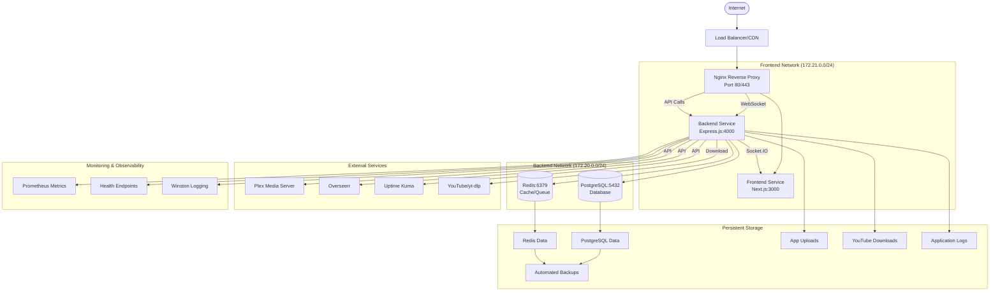
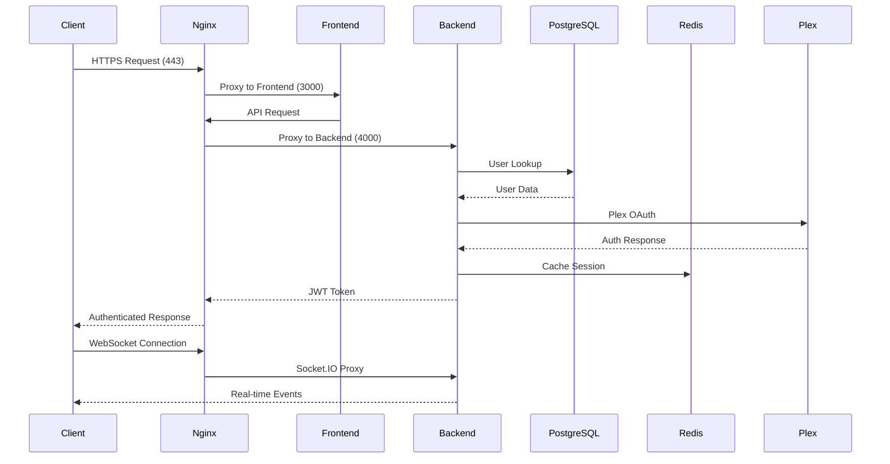
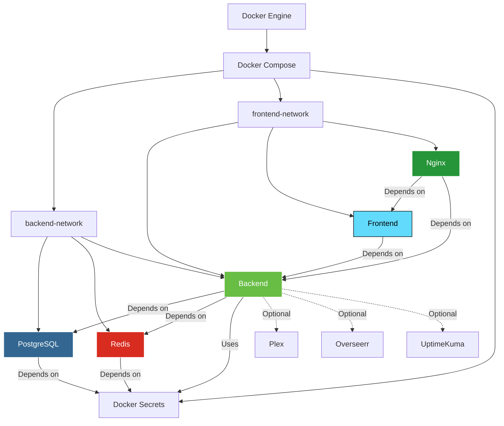
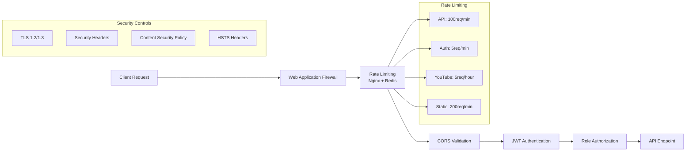
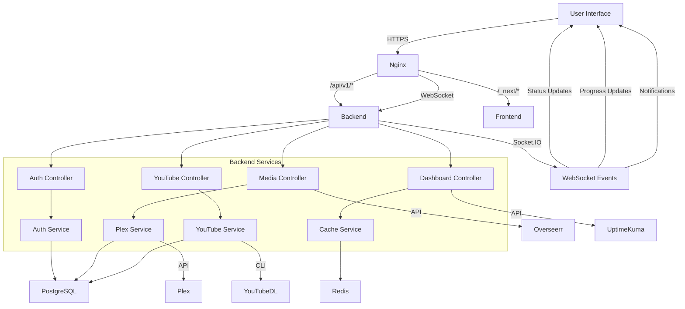
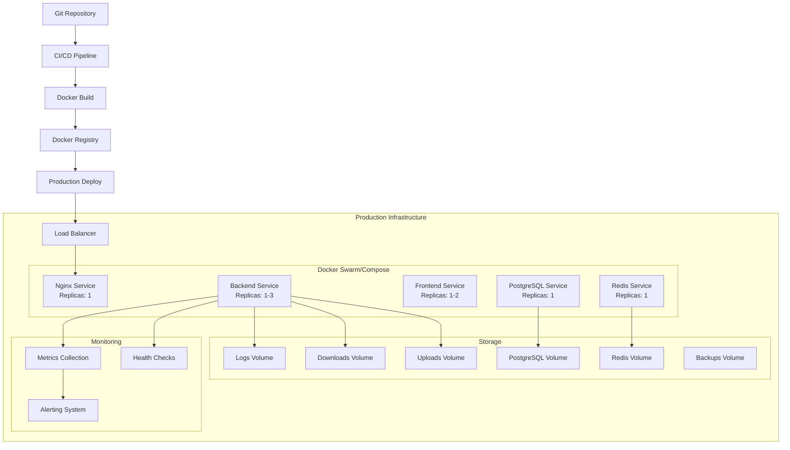
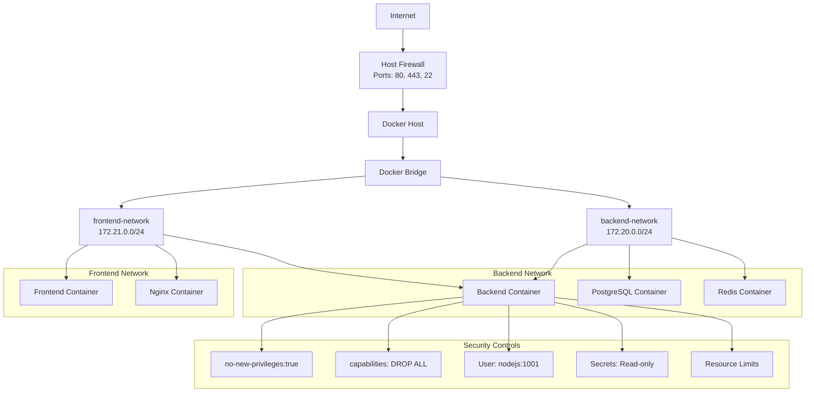

# MediaNest Backend Integration Architecture Diagram

## System Architecture Overview

## Container Communication Flow

## Service Dependency Graph

## Security Architecture

## Data Flow Architecture

## Deployment Architecture

## Network Security Model

## Integration Points Summary

| Component                 | Integration Point | Protocol            | Security        |
| ------------------------- | ----------------- | ------------------- | --------------- |
| **Nginx ↔ Backend**      | Port 4000         | HTTP/WebSocket      | TLS Termination |
| **Backend ↔ PostgreSQL** | Port 5432         | PostgreSQL Protocol | Docker Secrets  |
| **Backend ↔ Redis**      | Port 6379         | Redis Protocol      | Password Auth   |
| **Backend ↔ Plex**       | External API      | HTTPS               | OAuth 2.0       |
| **Backend ↔ Frontend**   | Socket.IO         | WebSocket           | CORS + JWT      |
| **Nginx ↔ Frontend**     | Port 3000         | HTTP                | Reverse Proxy   |

## Performance Characteristics

| Service        | Resource Limits | Health Check   | Startup Time |
| -------------- | --------------- | -------------- | ------------ |
| **Backend**    | 1 CPU, 1GB RAM  | /api/health    | 60 seconds   |
| **PostgreSQL** | 1 CPU, 1GB RAM  | pg_isready     | 30 seconds   |
| **Redis**      | 0.5 CPU, 512MB  | redis-cli ping | 20 seconds   |
| **Frontend**   | 0.5 CPU, 512MB  | HTTP check     | 45 seconds   |
| **Nginx**      | 1 CPU, 256MB    | stub_status    | 30 seconds   |

This architecture provides a comprehensive, production-ready backend integration with proper security, monitoring, and scalability considerations.
