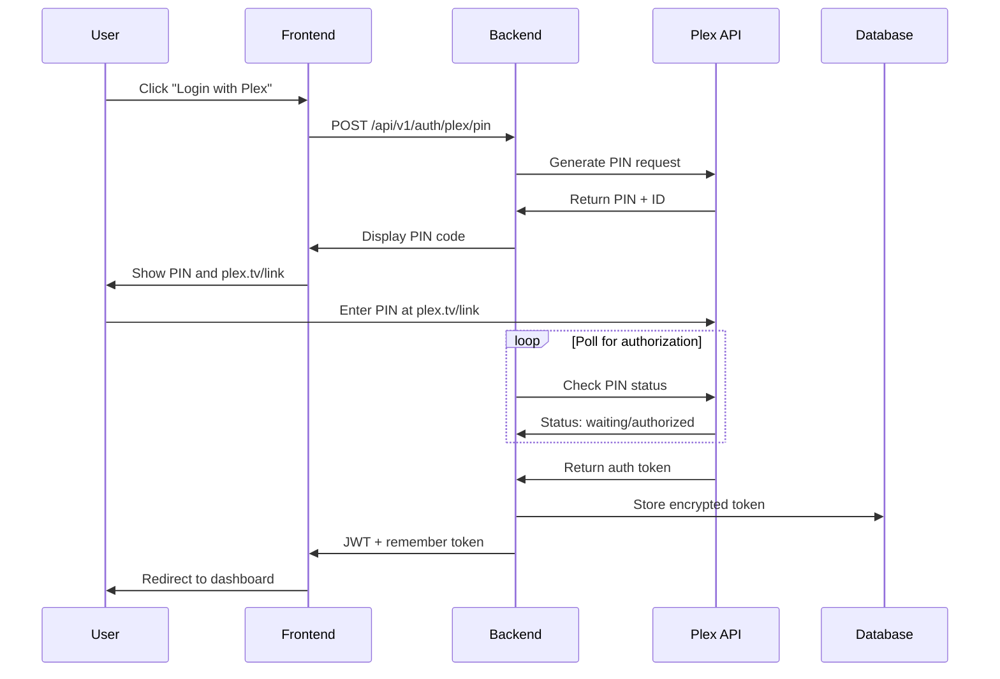

# MediaNest Complete System Architecture Analysis

**Generated:** 2025-09-09  
**Analyzed Branch:** develop  
**Analysis Scope:** Complete codebase structure, components, API endpoints, data models, and system integrations

## Executive Summary

MediaNest is a sophisticated **monolithic media management platform** built with modern TypeScript architecture. The system consolidates multiple external media services (Plex, Overseerr, Uptime Kuma, YouTube) into a unified authenticated interface designed for 10-20 concurrent users.

### Key Architectural Patterns
- **Monolithic Architecture** with clear separation of concerns
- **Multi-workspace TypeScript project** (Backend, Frontend, Shared)
- **Authentication-first design** with JWT and Plex OAuth integration
- **Real-time communication** via Socket.io with multiple namespaces
- **External service resilience** with circuit breakers and graceful degradation
- **Container-first deployment** with multi-stage Docker builds

## 1. Project Structure Analysis

### 1.1 Workspace Architecture

```
medianest/
├── backend/           # Express.js API server with TypeScript
├── frontend/          # Next.js 14 App Router with React 18
├── shared/            # Shared TypeScript types and utilities
├── docs/              # Documentation (25+ files)
├── tests/             # Comprehensive test suites (21 directories)
├── scripts/           # Build, deployment, and automation scripts
├── config/            # Configuration management (8 files)
├── deployment/        # Docker Compose and deployment configs
└── infrastructure/    # Infrastructure as code
```

### 1.2 Technology Stack

#### Core Technologies
- **Runtime:** Node.js 20.x LTS
- **Language:** TypeScript 5.6+ with strict type checking
- **Backend:** Express 4.21.0 with custom middleware stack
- **Frontend:** Next.js 14.2.32 with App Router
- **Database:** PostgreSQL 15+ with Prisma ORM 6.15.0
- **Cache/Queue:** Redis 7.x with BullMQ for job processing
- **Real-time:** Socket.io 4.8.1 with authentication middleware

#### Key Dependencies
- **Authentication:** Custom JWT + Plex OAuth PIN flow
- **Validation:** Zod 3.23+ for runtime type safety
- **Logging:** Winston 3.14+ with structured JSON logging
- **Security:** Helmet, CORS, rate limiting, encryption (AES-256-GCM)
- **Testing:** Vitest 3.2+ with comprehensive coverage setup
- **Monitoring:** Prometheus metrics, health checks, error tracking

## 2. Backend Architecture Deep Dive

### 2.1 Application Structure

```
backend/src/
├── config/            # Configuration management with type safety
│   ├── database.ts    # Prisma client configuration
│   ├── redis.ts       # Redis connection management
│   ├── queues.ts      # BullMQ queue configuration
│   └── secrets.ts     # Encrypted secret management
├── controllers/       # HTTP request handlers
│   ├── health.controller.ts    # Health check endpoints
│   ├── youtube.controller.ts   # YouTube download API
│   └── v1/                     # Versioned API controllers
├── middleware/        # Express middleware stack
│   ├── auth.ts        # JWT authentication with token rotation
│   ├── logging.ts     # Structured request logging
│   ├── rate-limit.ts  # Redis-backed rate limiting
│   └── error-handler.ts        # Global error handling
├── services/          # Business logic layer
│   ├── integration.service.ts  # External service management
│   ├── encryption.service.ts   # AES-256-GCM encryption
│   └── device-session.service.ts # Session management
├── integrations/      # External service clients
│   ├── plex/          # Plex API client with circuit breaker
│   ├── overseerr/     # Overseerr API integration
│   └── uptime-kuma/   # Uptime Kuma monitoring client
├── repositories/      # Data access layer (Repository pattern)
│   ├── user.repository.ts
│   ├── media-request.repository.ts
│   └── youtube-download.repository.ts
├── socket/            # WebSocket server and handlers
│   ├── socket-server.ts        # Main Socket.io server
│   ├── handlers/               # Event handlers by feature
│   └── middleware.ts           # Socket authentication
├── routes/            # API route definitions
│   ├── v1/            # Versioned routes
│   └── index.ts       # Route aggregation
└── utils/             # Shared utilities
    ├── logger.ts      # Winston logger configuration
    └── errors.ts      # Custom error classes
```

### 2.2 API Architecture

#### REST API Endpoints (v1)

**Authentication & Security**
```
POST   /api/v1/auth/plex        # Plex OAuth PIN flow
POST   /api/v1/auth/logout      # Session termination
GET    /api/v1/auth/session     # Current session info
POST   /api/v1/csrf/token       # CSRF token generation
```

**Dashboard & Status**
```
GET    /api/v1/dashboard/status # All service health status
GET    /api/v1/health          # System health check
GET    /api/v1/services        # External service configuration
```

**Media Management**
```
GET    /api/v1/media/search    # Media search across services
POST   /api/v1/media/request   # Submit media request
GET    /api/v1/media/requests  # User's media requests
```

**Plex Integration**
```
GET    /api/v1/plex/libraries  # Plex library enumeration
GET    /api/v1/plex/library/:id/items # Browse library content
GET    /api/v1/plex/collections # Plex collections
```

**YouTube Downloads** (Phase 4 - Implementation pending)
```
POST   /api/v1/youtube/download # Queue playlist download
GET    /api/v1/youtube/downloads # User's downloads (user-isolated)
DELETE /api/v1/youtube/downloads/:id # Delete own download
```

**Admin Panel** (Role-protected)
```
GET    /api/v1/admin/users     # User management
PUT    /api/v1/admin/users/:id # Update user roles
GET    /api/v1/admin/services  # Service configuration
PUT    /api/v1/admin/services/:name # Update service config
```

#### WebSocket Namespaces

```typescript
// Real-time communication architecture
namespaces: {
  '/': {                    // Public namespace
    events: ['connect', 'disconnect', 'error']
  },
  '/authenticated': {       // User-specific updates
    auth: 'JWT required',
    events: ['service:status', 'notification', 'media:update']
  },
  '/admin': {              // Admin-only namespace
    auth: 'Admin role required',
    events: ['user:update', 'system:alert', 'service:config']
  },
  '/media': {              // Media-specific events
    auth: 'JWT required',
    events: ['download:progress', 'request:update', 'library:sync']
  }
}
```

### 2.3 Authentication Architecture

#### Plex OAuth PIN Flow Implementation
```typescript
// Unique PIN-based authentication (not standard OAuth)
flow: {
  1. POST /auth/plex/pin     // Generate 4-digit PIN
  2. User visits plex.tv/link // User enters PIN on Plex
  3. Backend polls Plex API   // Check PIN authorization status
  4. Store encrypted token    // AES-256-GCM encryption
  5. Issue JWT + remember token // Session management
}
```

#### Security Features
- **JWT with rotation**: Automatic token refresh on usage
- **Remember Me tokens**: Secure long-term session persistence
- **Device fingerprinting**: Session isolation by device
- **Rate limiting**: Redis-backed with Lua scripts for atomicity
- **Encrypted storage**: All API keys and tokens encrypted at rest
- **CSRF protection**: Token-based CSRF prevention

## 3. Frontend Architecture

### 3.1 Next.js 14 App Router Structure

```
frontend/src/
├── app/                    # Next.js 14 App Router
│   ├── (auth)/            # Route groups for authenticated pages
│   │   └── dashboard/     # Main dashboard page
│   ├── api/               # API route handlers
│   │   └── auth/          # NextAuth.js configuration
│   ├── auth/              # Authentication pages
│   ├── media/             # Media browsing interface
│   ├── layout.tsx         # Root layout with providers
│   └── page.tsx           # Home page
├── components/            # React components
│   ├── dashboard/         # Dashboard-specific components
│   │   ├── cards/         # Service status cards
│   │   ├── ServiceCard.tsx
│   │   ├── ConnectionStatus.tsx
│   │   └── QuickActions.tsx
│   ├── media/             # Media management components
│   │   ├── MediaGrid.tsx
│   │   ├── SearchInput.tsx
│   │   └── RequestButton.tsx
│   ├── admin/             # Admin panel components
│   │   └── UserManagement.tsx
│   ├── ui/                # Reusable UI components (shadcn/ui style)
│   └── providers/         # React Context providers
├── hooks/                 # Custom React hooks
│   ├── useWebSocket.ts    # Socket.io integration
│   ├── useServiceStatus.ts
│   └── useMediaSearch.ts
├── lib/                   # Utility functions and configurations
│   ├── api/               # API client functions
│   ├── auth/              # NextAuth configuration
│   └── socket.ts          # Socket.io client setup
└── types/                 # Frontend TypeScript definitions
```

### 3.2 Component Architecture

#### Key Components Implemented
- **Service Status Dashboard**: Real-time service health monitoring
- **Plex Integration**: Library browser, collection manager
- **Media Search**: Unified search across external services
- **User Management**: Admin panel for user role management
- **Real-time Updates**: WebSocket-powered live status updates

#### Technology Integration
- **Styling**: Tailwind CSS with custom design system
- **State Management**: React hooks + Context API
- **Form Handling**: React Hook Form with Zod validation
- **Real-time**: Socket.io client with automatic reconnection
- **Testing**: Vitest with React Testing Library

## 4. Database Architecture

### 4.1 PostgreSQL Schema Design

```sql
-- Core entities with optimized indexes
-- User Management (Plex OAuth integration)
users: {
  id: UUID (primary key)
  plex_id: VARCHAR(255) UNIQUE
  plex_username: VARCHAR(255)
  email: VARCHAR(255) UNIQUE
  role: VARCHAR(50) DEFAULT 'user'
  plex_token: TEXT (encrypted)
  created_at, last_login_at, status
  -- Relations: media_requests, youtube_downloads, sessions
}

-- Media Request Management
media_requests: {
  id: UUID
  user_id: UUID → users(id)
  title: VARCHAR(500)
  media_type: VARCHAR(50)
  tmdb_id: VARCHAR(100)
  status: VARCHAR(50) DEFAULT 'pending'
  overseerr_id: VARCHAR(255)
  created_at, completed_at
  -- Indexes: [user_id, status], [created_at], [tmdb_id, media_type]
}

-- YouTube Downloads (User-isolated)
youtube_downloads: {
  id: UUID
  user_id: UUID → users(id) NOT NULL
  playlist_url: TEXT
  playlist_title: VARCHAR(500)
  status: VARCHAR(50) DEFAULT 'queued'
  file_paths: JSONB
  plex_collection_id: VARCHAR(255)
  created_at, completed_at
  -- Indexes: [user_id] for data isolation
}

-- Service Health Monitoring
service_status: {
  id: SERIAL
  service_name: VARCHAR(100) UNIQUE
  status: VARCHAR(50)
  response_time_ms: INTEGER
  last_check_at: TIMESTAMP
  uptime_percentage: DECIMAL(5,2)
}

-- Security & Session Management
session_tokens: {
  id: UUID
  user_id: UUID → users(id)
  token_hash: VARCHAR(255) UNIQUE
  expires_at: TIMESTAMP
  created_at, last_used_at
  -- Indexes: [user_id], [expires_at]
}

-- Configuration Management
service_config: {
  id: SERIAL
  service_name: VARCHAR(100) UNIQUE
  service_url: TEXT
  api_key: TEXT (encrypted)
  enabled: BOOLEAN DEFAULT true
  config_data: JSONB
  updated_at, updated_by
}

-- Monitoring & Analytics
error_logs: {
  id: UUID
  correlation_id: VARCHAR(255)
  user_id: UUID → users(id)
  error_code, error_message, stack_trace
  request_path, request_method, status_code
  metadata: JSONB
  created_at
  -- Indexes: [correlation_id], [created_at], [user_id]
}
```

### 4.2 Redis Data Structures

```redis
# Session Management
session:{sessionId} → {userId, role, expiresAt, deviceId}

# Rate Limiting (Atomic operations with Lua)
rate:api:{userId} → counter (TTL: 60s, limit: 100 req/min)
rate:youtube:{userId} → counter (TTL: 3600s, limit: 5 downloads/hour)

# Job Queues (BullMQ)
bull:youtube:waiting → [job1, job2, ...]
bull:youtube:active → {jobId: data, startTime}
bull:youtube:completed → {jobId: result, duration}
bull:youtube:failed → {jobId: error, attempts}

# Service Status Cache
status:{serviceName} → {status, lastCheck, uptime, responseTime}

# Remember Me Tokens (Secure)
remember:{tokenHash} → {userId, createdAt, deviceFingerprint}
```

## 5. External Service Integration

### 5.1 Integration Architecture

```typescript
// Service integration with resilience patterns
integrationService: {
  services: {
    plex: PlexApiClient,      // Media server integration
    overseerr: OverseerrClient, // Request management
    uptimeKuma: UptimeKumaClient // Monitoring integration
  },
  patterns: {
    circuitBreaker: true,     // Prevent cascade failures
    retryWithBackoff: true,   // Exponential backoff retry
    healthChecking: true,     // Active health monitoring
    gracefulDegradation: true // Continue without failed services
  }
}
```

### 5.2 Circuit Breaker Implementation

```typescript
// Circuit breaker configuration for external services
circuitBreakerConfig: {
  errorThresholdPercentage: 50,  // Open circuit at 50% error rate
  resetTimeout: 30000,           // 30s before retry
  timeout: 10000,                // 10s request timeout
  volumeThreshold: 10,           // Minimum requests for circuit evaluation
  fallbackResponse: 'CACHED_DATA' // Graceful degradation
}
```

### 5.3 Service Client Features

#### Plex Integration
- **OAuth PIN Flow**: Custom implementation for Plex authentication
- **Library Management**: Browse libraries, collections, metadata
- **Media Collection Creation**: Automated playlist → collection conversion
- **Real-time Sync**: WebSocket updates for library changes

#### Overseerr Integration
- **Media Requests**: Submit and track media requests
- **Status Synchronization**: Webhook handling for request updates
- **Search Integration**: Unified media search across services

#### Uptime Kuma Integration
- **Service Monitoring**: Real-time service status updates
- **Socket.io Connection**: Live monitoring data stream
- **Alert Integration**: Service incident notification system

## 6. Security Architecture

### 6.1 Security Layers

```
┌─────────────────────────────────────┐
│        Network Security             │
├─────────────────────────────────────┤
│ - SSL/TLS (Let's Encrypt)          │
│ - Nginx reverse proxy              │
│ - Rate limiting (multiple layers)   │
│ - CORS protection                  │
└─────────────────────────────────────┘
┌─────────────────────────────────────┐
│      Application Security           │
├─────────────────────────────────────┤
│ - JWT authentication               │
│ - Token rotation                   │
│ - CSRF protection                  │
│ - Input validation (Zod)           │
│ - Role-based access control        │
└─────────────────────────────────────┘
┌─────────────────────────────────────┐
│        Data Security                │
├─────────────────────────────────────┤
│ - AES-256-GCM encryption          │
│ - Encrypted API keys               │
│ - Secure session management        │
│ - Database query parameterization  │
└─────────────────────────────────────┘
```

### 6.2 Authentication Flow Detail



## 7. Performance & Scalability

### 7.1 Performance Optimizations

#### Backend Performance
- **Connection Pooling**: PostgreSQL with 20 connection limit
- **Redis Caching**: Aggressive caching of API responses
- **Compression**: Gzip with optimized settings for JSON/text
- **Query Optimization**: Strategic database indexes
- **Circuit Breakers**: Prevent resource exhaustion from failed services

#### Frontend Performance  
- **Static Generation**: Next.js static site generation for docs
- **Code Splitting**: Dynamic imports for feature modules
- **Image Optimization**: Next.js built-in image optimization
- **Bundle Analysis**: Webpack bundle analyzer integration

#### Caching Strategy
```typescript
cachingLayers: {
  CDN: '1 year (static assets)',
  APIResponses: '5 minutes (service status)',
  DatabaseQueries: '10 minutes (Plex library data)',
  ServiceHealth: '60 seconds (health checks)'
}
```

### 7.2 Scalability Considerations

#### Current Scale (10-20 users)
- **Monolithic Architecture**: Simplified deployment and maintenance
- **Single Database**: PostgreSQL with optimized queries
- **In-memory Caching**: Redis for sessions and rate limiting
- **Vertical Scaling**: Resource optimization over horizontal scaling

#### Future Scale Preparation
- **Stateless Design**: All session data externalized to Redis
- **Service Extraction**: YouTube downloader as separate service
- **Load Balancer Ready**: CORS and session handling supports multiple instances
- **Database Scaling**: Read replica configuration prepared

## 8. Deployment Architecture

### 8.1 Docker Multi-Stage Build

```dockerfile
# Optimized multi-stage build process
stages: {
  shared-builder:     'Build shared TypeScript package',
  backend-builder:    'Build Express.js backend',  
  frontend-builder:   'Build Next.js frontend',
  backend-production: 'Minimal backend runtime',
  frontend-production:'Minimal frontend runtime',
  development:        'Full development environment'
}

security: {
  non-root-user:     'medianest:1001, nextjs:1001',
  minimal-packages:  'Alpine Linux base images',
  secret-management: 'Docker secrets for production',
  health-checks:     'Built-in container health monitoring'
}
```

### 8.2 Production Environment

```yaml
# Docker Compose production stack
services:
  nginx:
    - SSL termination (Let's Encrypt)
    - Load balancing ready
    - Security headers
    - Static asset serving
    
  medianest-app:
    - Backend + Frontend unified
    - Non-root execution
    - Health check monitoring
    - Volume mounts for YouTube downloads
    
  postgres:
    - PostgreSQL 15 with optimized config
    - Persistent volume storage
    - Automated backups
    - Connection pooling
    
  redis:
    - Redis 7 with persistence
    - Memory optimization (256MB limit)
    - Append-only file backup
    - LRU eviction policy
```

## 9. Current Implementation Status

### 9.1 Completed Features ✅

**Core Infrastructure**
- Multi-workspace TypeScript project setup
- Comprehensive build and test pipelines
- Docker containerization with security hardening
- Environment configuration management
- Structured logging with Winston
- Health check and monitoring endpoints

**Authentication & Security**
- Plex OAuth PIN flow implementation
- JWT authentication with token rotation
- Role-based access control (Admin/User)
- AES-256-GCM encryption for sensitive data
- Rate limiting with Redis backend
- CSRF protection and security headers

**Service Integration**
- Plex API client with circuit breaker
- Overseerr API integration
- Uptime Kuma monitoring client
- Service health status tracking
- Real-time WebSocket communication

**Frontend Dashboard**
- Next.js 14 App Router setup
- Service status monitoring dashboard
- Plex library browser
- Media search interface
- User management admin panel
- Real-time status updates

**Data Management**
- PostgreSQL schema with optimized indexes
- Prisma ORM with type safety
- Redis for caching and session management
- Database migration system
- Error logging and tracking

### 9.2 Implementation Gaps ❌

**YouTube Integration (Phase 4)**
- Database schema: ✅ Complete
- API routes: ✅ Registered
- Frontend components: ✅ Complete
- Backend controller: ❌ Missing
- yt-dlp integration: ❌ Missing
- BullMQ worker: ❌ Missing
- File management: ❌ Missing

**Advanced Features (Phase 5)**
- Admin UI components: ❌ Missing
- Service configuration UI: ❌ Missing
- Advanced monitoring dashboards: ❌ Missing
- Prometheus metrics integration: ❌ Missing

## 10. API Endpoint Inventory

### 10.1 Public Endpoints
```
GET    /health                 # Basic health check
GET    /metrics                # Prometheus metrics (auth in prod)
POST   /api/v1/auth/plex/pin   # Generate Plex PIN
GET    /api/v1/auth/plex/status # Check PIN authorization
POST   /api/v1/csrf/token      # Get CSRF token
```

### 10.2 Authenticated Endpoints
```
GET    /api/v1/auth/session    # Current user session
POST   /api/v1/auth/logout     # Logout
GET    /api/v1/dashboard/status # Service status dashboard
GET    /api/v1/media/search    # Media search
POST   /api/v1/media/request   # Submit media request
GET    /api/v1/media/requests  # User's requests
GET    /api/v1/plex/libraries  # Plex libraries
GET    /api/v1/plex/library/:id/items # Library content
GET    /api/v1/services        # Service configurations
```

### 10.3 Admin-Only Endpoints
```
GET    /api/v1/admin/users     # User management
PUT    /api/v1/admin/users/:id # Update user
GET    /api/v1/admin/services  # Service admin
PUT    /api/v1/admin/services/:name # Update service
GET    /api/v1/admin/config    # System config
```

### 10.4 YouTube Endpoints (Phase 4)
```
POST   /api/v1/youtube/download # Queue download
GET    /api/v1/youtube/downloads # User downloads
DELETE /api/v1/youtube/downloads/:id # Delete download
WS     /ws/youtube/:id         # Download progress
```

## 11. Data Models and Relationships

### 11.1 Core Domain Models

```typescript
// User Domain
User: {
  id: string (UUID)
  plexId?: string (Plex user ID)
  plexUsername?: string
  email: string (unique)
  role: 'USER' | 'ADMIN'
  plexToken?: string (encrypted)
  status: 'active' | 'inactive'
  // Relations: mediaRequests[], youtubeDownloads[], sessions[]
}

// Media Request Domain  
MediaRequest: {
  id: string (UUID)
  userId: string
  title: string
  mediaType: 'movie' | 'tv' | 'music'
  tmdbId?: string
  status: 'pending' | 'approved' | 'completed' | 'denied'
  overseerrId?: string
  createdAt: Date
  completedAt?: Date
}

// YouTube Download Domain
YoutubeDownload: {
  id: string (UUID) 
  userId: string (user isolation)
  playlistUrl: string
  playlistTitle?: string
  status: 'queued' | 'downloading' | 'completed' | 'failed'
  filePaths?: string[] (JSON)
  plexCollectionId?: string
  createdAt: Date
  completedAt?: Date
}

// Service Configuration Domain
ServiceConfig: {
  serviceName: string (unique)
  serviceUrl: string
  apiKey?: string (encrypted)
  enabled: boolean
  configData?: object (JSON)
  updatedAt: Date
  updatedBy?: string
}
```

### 11.2 Relationship Mapping

```
User (1) -----> (n) MediaRequest
User (1) -----> (n) YoutubeDownload  
User (1) -----> (n) SessionToken
User (1) -----> (n) RateLimit
User (1) -----> (n) Account (NextAuth)
User (1) -----> (n) Session (NextAuth)
User (1) -----> (n) ErrorLog

ServiceConfig (1) -----> (1) User (updatedBy)

# External Relationships (API Integration)
MediaRequest -----> Overseerr Request (via overseerrId)
YoutubeDownload -----> Plex Collection (via plexCollectionId)
User -----> Plex User (via plexId)
```

## 12. Configuration Management

### 12.1 Environment Configuration

```typescript
// Hierarchical configuration management
config: {
  required: {
    JWT_SECRET: 'Generated 32-byte secret',
    ENCRYPTION_KEY: 'AES-256 encryption key',
    DATABASE_URL: 'PostgreSQL connection string'
  },
  optional: {
    PLEX_TOKEN: 'Plex server access token',
    OVERSEERR_URL: 'Overseerr instance URL',
    OVERSEERR_API_KEY: 'Overseerr API key',
    UPTIME_KUMA_URL: 'Uptime Kuma instance URL',
    YOUTUBE_API_KEY: 'YouTube Data API key',
    REDIS_URL: 'Redis connection string'
  },
  computed: {
    ALLOWED_ORIGINS: 'Comma-separated CORS origins',
    FRONTEND_URL: 'Frontend application URL',
    RATE_LIMIT_*: 'Rate limiting configurations'
  }
}
```

### 12.2 Service Configuration Management

```typescript
// Runtime service configuration (database-stored)
serviceConfigs: {
  plex: {
    enabled: boolean,
    serverUrl: string,
    defaultToken?: string (encrypted)
  },
  overseerr: {
    enabled: boolean,
    url: string,
    apiKey: string (encrypted)
  },
  uptimeKuma: {
    enabled: boolean,
    url: string,
    username: string,
    password: string (encrypted)
  }
}
```

## 13. Testing Infrastructure

### 13.1 Test Architecture

```
tests/
├── backend/           # Backend-specific tests
│   ├── unit/         # Unit tests for services, utils
│   ├── integration/  # Database and API integration tests
│   └── e2e/          # End-to-end API tests
├── frontend/         # Frontend component tests  
├── shared/           # Shared utility tests
├── e2e/              # Cross-system end-to-end tests
├── performance/      # Load testing and benchmarks
└── security/         # Security penetration tests
```

### 13.2 Testing Tools and Coverage

```typescript
testingStack: {
  unitTests: 'Vitest 3.2+ with TypeScript support',
  integrationTests: 'Vitest with test database',
  e2eTests: 'Playwright for browser automation', 
  componentTests: 'React Testing Library',
  coverage: '@vitest/coverage-v8',
  mocking: 'Vitest built-in mocks',
  fixtures: 'Custom test data factories'
}

coverageTargets: {
  overall: '65% minimum for CI',
  critical: '90% for auth, security, data access',
  services: '80% for business logic'
}
```

## 14. Monitoring and Observability

### 14.1 Logging Strategy

```typescript
loggingArchitecture: {
  logger: 'Winston 3.14+ with structured JSON',
  transports: ['Console', 'DailyRotateFile', 'Error file'],
  levels: ['error', 'warn', 'info', 'debug'],
  retention: '30 days with automatic cleanup',
  correlationId: 'Request tracing across services',
  metadata: {
    timestamp: 'ISO 8601',
    level: 'Log level',
    message: 'Human readable message',
    service: 'Service identifier', 
    userId: 'User context (if applicable)',
    requestId: 'Request correlation ID',
    duration: 'Operation timing',
    error: 'Error details and stack trace'
  }
}
```

### 14.2 Metrics and Health Checks

```typescript
metrics: {
  application: {
    requestRate: 'HTTP requests per second',
    responseTime: 'Request latency percentiles',
    errorRate: 'Error rate by endpoint',
    activeUsers: 'Concurrent user sessions',
    queueDepth: 'Background job queue size'
  },
  infrastructure: {
    cpuUsage: 'Process CPU utilization',
    memoryUsage: 'Heap and RSS memory',
    diskSpace: 'Available disk space',
    dbConnections: 'Active database connections'
  },
  business: {
    mediaRequests: 'Media requests per day',
    youtubeDownloads: 'Downloads per user',
    serviceAvailability: 'External service uptime',
    userEngagement: 'Daily/monthly active users'
  }
}

healthChecks: {
  system: '/health (basic liveness)',
  detailed: '/api/v1/health (comprehensive)',  
  database: 'PostgreSQL connection test',
  redis: 'Redis connectivity test',
  externalServices: 'Plex/Overseerr/Uptime Kuma status'
}
```

## 15. Future Architecture Considerations

### 15.1 Microservices Migration Path

```typescript
// Potential service boundaries for future extraction
potentialServices: {
  userService: {
    responsibility: 'User management, authentication',
    database: 'Users, sessions, permissions',
    apis: ['auth', 'user-profile', 'session-management']
  },
  mediaService: {
    responsibility: 'Media requests and library management',
    database: 'Media requests, Plex integration data', 
    apis: ['media-search', 'request-management', 'library-sync']
  },
  downloadService: {
    responsibility: 'YouTube downloads and file management',
    database: 'Download jobs, file metadata',
    apis: ['download-queue', 'progress-tracking', 'file-management']
  },
  notificationService: {
    responsibility: 'Real-time notifications and WebSocket',
    database: 'Notification history, user preferences',
    apis: ['websocket-gateway', 'notification-delivery']
  }
}
```

### 15.2 Scalability Enhancements

```typescript
scalabilityImprovements: {
  caching: {
    implementation: 'Redis Cluster for distributed caching',
    patterns: ['Cache-aside', 'Write-through', 'Cache warming'],
    invalidation: 'Event-driven cache invalidation'
  },
  database: {
    readReplicas: 'PostgreSQL read replicas for query scaling',
    partitioning: 'Table partitioning for large datasets',
    connectionPooling: 'PgBouncer for connection management'
  },
  messageQueue: {
    implementation: 'Redis Streams or Apache Kafka',
    patterns: ['Event sourcing', 'CQRS', 'Saga pattern'],
    monitoring: 'Queue depth and processing time metrics'
  },
  loadBalancing: {
    implementation: 'Nginx or HAProxy',
    healthChecks: 'Application-level health monitoring',
    sessionAffinity: 'Redis-based session sharing'
  }
}
```

## Conclusion

MediaNest demonstrates a **well-architected monolithic application** with clear separation of concerns, comprehensive security measures, and robust external service integration. The codebase exhibits enterprise-grade patterns including:

- **Type-safe development** with comprehensive TypeScript coverage
- **Security-first design** with authentication, encryption, and rate limiting
- **Resilient external integration** with circuit breakers and fallback mechanisms  
- **Real-time capabilities** through WebSocket architecture
- **Comprehensive testing** infrastructure with multiple test types
- **Production-ready deployment** with containerization and monitoring

The architecture successfully balances **simplicity for the target scale** (10-20 users) while maintaining **patterns that support future growth** through service extraction and horizontal scaling capabilities.

**Key Strengths:**
- Clear architectural boundaries and responsibilities
- Comprehensive security implementation
- Robust error handling and logging
- Real-time communication infrastructure
- Container-first deployment strategy
- Extensive documentation and testing

**Areas for Enhancement:**
- Complete YouTube integration implementation (Phase 4)
- Advanced admin UI components
- Enhanced monitoring and alerting
- Performance optimization for larger scales

This analysis provides a complete understanding of the MediaNest system architecture and serves as a foundation for continued development and potential future migrations to microservices architecture.