# MediaNest Component Relationship Diagram

**Generated:** 2025-09-09  
**Analysis Scope:** Complete system component interactions and data flows

## System Architecture Diagram

```mermaid
graph TB
    %% External Clients
    Browser[🌐 Browser Client]
    Admin[👑 Admin Panel]
    Mobile[📱 Mobile Client]
    
    %% Load Balancer / Proxy
    Nginx[🔒 Nginx Proxy<br/>SSL Termination<br/>Rate Limiting]
    
    %% Application Layer
    subgraph "MediaNest Application"
        Frontend[⚛️ Next.js 14 Frontend<br/>- App Router<br/>- Real-time UI<br/>- Component Library]
        Backend[🚀 Express.js Backend<br/>- TypeScript<br/>- Middleware Stack<br/>- API Routes]
        SocketServer[🔌 Socket.io Server<br/>- Real-time Events<br/>- Authenticated Namespaces<br/>- Rate Limited]
    end
    
    %% Shared Layer
    SharedLib[📚 Shared Library<br/>- Types<br/>- Utilities<br/>- Validation]
    
    %% Data Layer
    subgraph "Data Storage"
        PostgreSQL[🐘 PostgreSQL<br/>- User Data<br/>- Media Requests<br/>- Service Config<br/>- Error Logs]
        Redis[⚡ Redis<br/>- Sessions<br/>- Cache<br/>- Rate Limits<br/>- Job Queues]
    end
    
    %% External Services
    subgraph "External Integrations"
        Plex[📺 Plex Server<br/>- OAuth PIN Flow<br/>- Library Access<br/>- Collections]
        Overseerr[🎬 Overseerr<br/>- Media Requests<br/>- Search API<br/>- Webhooks]
        UptimeKuma[📊 Uptime Kuma<br/>- Service Monitoring<br/>- Socket.io<br/>- Alerts]
        YouTube[🎵 YouTube API<br/>- Video Downloads<br/>- Metadata<br/>- yt-dlp]
    end
    
    %% Infrastructure
    subgraph "Container Infrastructure"
        Docker[🐳 Docker Containers<br/>- Multi-stage Build<br/>- Non-root Users<br/>- Health Checks]
        Volumes[💾 Persistent Volumes<br/>- Database Data<br/>- Download Files<br/>- Logs]
    end
    
    %% Client Connections
    Browser --> Nginx
    Admin --> Nginx
    Mobile --> Nginx
    
    %% Proxy to Application
    Nginx --> Frontend
    Nginx --> Backend
    Nginx --> SocketServer
    
    %% Application Internal Connections
    Frontend -.->|WebSocket| SocketServer
    Frontend -->|API Calls| Backend
    Backend -.->|Events| SocketServer
    
    %% Shared Dependencies
    Frontend --> SharedLib
    Backend --> SharedLib
    SocketServer --> SharedLib
    
    %% Data Layer Connections
    Backend --> PostgreSQL
    Backend --> Redis
    SocketServer --> Redis
    
    %% External Service Integration
    Backend --> Plex
    Backend --> Overseerr
    Backend --> UptimeKuma
    Backend --> YouTube
    
    %% Container Deployment
    Frontend --> Docker
    Backend --> Docker
    SocketServer --> Docker
    PostgreSQL --> Docker
    Redis --> Docker
    Docker --> Volumes
    
    %% Styling
    classDef frontend fill:#61dafb,stroke:#333,stroke-width:2px,color:#000
    classDef backend fill:#68a063,stroke:#333,stroke-width:2px,color:#fff
    classDef database fill:#336791,stroke:#333,stroke-width:2px,color:#fff
    classDef external fill:#ff6b6b,stroke:#333,stroke-width:2px,color:#fff
    classDef infrastructure fill:#feca57,stroke:#333,stroke-width:2px,color:#000
    classDef proxy fill:#48dbfb,stroke:#333,stroke-width:2px,color:#000
    
    class Frontend,Admin,Browser,Mobile frontend
    class Backend,SocketServer,SharedLib backend
    class PostgreSQL,Redis database
    class Plex,Overseerr,UptimeKuma,YouTube external
    class Docker,Volumes infrastructure
    class Nginx proxy
```



## Component Interaction Flow


## API Component Architecture

```mermaid
graph LR
    %% API Gateway Layer
    subgraph "API Gateway"
        Router[🎯 Express Router]
        Auth[🔐 Auth Middleware]
        RateLimit[⏱️ Rate Limiter]
        CORS[🌐 CORS Handler]
    end
    
    %% Controller Layer
    subgraph "Controllers"
        AuthController[👤 Auth Controller]
        DashController[📊 Dashboard Controller]
        MediaController[🎬 Media Controller]
        PlexController[📺 Plex Controller]
        AdminController[👑 Admin Controller]
        YouTubeController[🎵 YouTube Controller]
    end
    
    %% Service Layer
    subgraph "Business Services"
        IntegrationService[🔗 Integration Service]
        EncryptionService[🔒 Encryption Service]
        JWTService[🎫 JWT Service]
        DeviceSessionService[📱 Device Session Service]
    end
    
    %% Repository Layer
    subgraph "Data Access"
        UserRepo[👥 User Repository]
        MediaRequestRepo[🎬 Media Request Repository]
        YouTubeRepo[🎵 YouTube Repository]
        ServiceStatusRepo[📊 Service Status Repository]
        SessionTokenRepo[🎫 Session Token Repository]
    end
    
    %% External Clients
    subgraph "Integration Clients"
        PlexClient[📺 Plex API Client]
        OverseerrClient[🎬 Overseerr Client]
        UptimeKumaClient[📊 Uptime Kuma Client]
    end
    
    %% Request Flow
    Router --> Auth
    Auth --> RateLimit
    RateLimit --> CORS
    CORS --> AuthController
    CORS --> DashController
    CORS --> MediaController
    CORS --> PlexController
    CORS --> AdminController
    CORS --> YouTubeController
    
    %% Controller to Service
    AuthController --> JWTService
    AuthController --> DeviceSessionService
    DashController --> IntegrationService
    MediaController --> IntegrationService
    PlexController --> IntegrationService
    AdminController --> EncryptionService
    YouTubeController --> IntegrationService
    
    %% Service to Repository
    JWTService --> UserRepo
    DeviceSessionService --> UserRepo
    DeviceSessionService --> SessionTokenRepo
    IntegrationService --> ServiceStatusRepo
    IntegrationService --> MediaRequestRepo
    IntegrationService --> YouTubeRepo
    
    %% Service to External
    IntegrationService --> PlexClient
    IntegrationService --> OverseerrClient
    IntegrationService --> UptimeKumaClient
```



## Data Flow Architecture

```mermaid
graph TD
    %% Input Layer
    subgraph "Data Input Sources"
        UserInput[👤 User Input<br/>- Forms<br/>- API Requests<br/>- WebSocket Events]
        ExternalAPIs[🌐 External APIs<br/>- Plex Webhooks<br/>- Overseerr Events<br/>- Kuma Notifications]
        SystemEvents[⚙️ System Events<br/>- Health Checks<br/>- Cron Jobs<br/>- Background Tasks]
    end
    
    %% Processing Layer
    subgraph "Data Processing"
        Validation[✅ Input Validation<br/>- Zod Schemas<br/>- Type Checking<br/>- Security Filters]
        BusinessLogic[🧠 Business Logic<br/>- Service Layer<br/>- Integration Rules<br/>- User Permissions]
        Transformation[🔄 Data Transformation<br/>- Encryption<br/>- Normalization<br/>- Enrichment]
    end
    
    %% Storage Layer
    subgraph "Data Storage"
        PrimaryDB[(🐘 PostgreSQL<br/>- User Data<br/>- Media Requests<br/>- Configuration<br/>- Error Logs)]
        CacheLayer[(⚡ Redis<br/>- Session Data<br/>- API Cache<br/>- Rate Limits<br/>- Job Queues)]
        FileStorage[💾 File Storage<br/>- YouTube Downloads<br/>- Upload Files<br/>- Log Files]
    end
    
    %% Output Layer
    subgraph "Data Output"
        APIResponses[📡 API Responses<br/>- JSON REST<br/>- GraphQL<br/>- Error Messages]
        WebSocketEvents[🔌 WebSocket Events<br/>- Real-time Updates<br/>- Notifications<br/>- Status Changes]
        ExternalIntegrations[🔗 External Updates<br/>- Plex Collections<br/>- Overseerr Requests<br/>- Monitoring Alerts]
    end
    
    %% Flow Connections
    UserInput --> Validation
    ExternalAPIs --> Validation
    SystemEvents --> Validation
    
    Validation --> BusinessLogic
    BusinessLogic --> Transformation
    
    Transformation --> PrimaryDB
    Transformation --> CacheLayer
    Transformation --> FileStorage
    
    PrimaryDB --> APIResponses
    CacheLayer --> APIResponses
    FileStorage --> APIResponses
    
    BusinessLogic --> WebSocketEvents
    BusinessLogic --> ExternalIntegrations
    
    %% Feedback Loops
    APIResponses -.->|Analytics| SystemEvents
    WebSocketEvents -.->|User Actions| UserInput
    ExternalIntegrations -.->|Status Updates| ExternalAPIs
```



## Authentication & Authorization Flow


## External Service Integration Patterns

```mermaid
graph TB
    %% Integration Management Layer
    subgraph "Integration Management"
        IntegrationService[🔗 Integration Service<br/>- Service Discovery<br/>- Health Monitoring<br/>- Event Coordination]
        CircuitBreaker[⚡ Circuit Breaker<br/>- Failure Detection<br/>- Fallback Logic<br/>- Auto Recovery]
        HealthChecker[💗 Health Checker<br/>- Periodic Checks<br/>- Status Aggregation<br/>- Alert Generation]
    end
    
    %% Individual Service Integrations
    subgraph "Plex Integration"
        PlexAuth[🔐 Plex OAuth<br/>- PIN Flow<br/>- Token Management<br/>- User Mapping]
        PlexLibrary[📚 Library Access<br/>- Browse Content<br/>- Search Media<br/>- Collection Mgmt]
        PlexWebhook[🪝 Webhook Handler<br/>- Library Updates<br/>- Playback Events<br/>- User Activity]
    end
    
    subgraph "Overseerr Integration"
        OverseerrRequests[🎬 Request Management<br/>- Submit Requests<br/>- Status Tracking<br/>- User Quotas]
        OverseerrSearch[🔍 Media Search<br/>- TMDB Integration<br/>- Content Discovery<br/>- Metadata Fetch]
        OverseerrWebhook[🪝 Status Updates<br/>- Request Approval<br/>- Download Progress<br/>- Completion Events]
    end
    
    subgraph "Uptime Kuma Integration"
        KumaMonitoring[📊 Service Monitoring<br/>- Health Status<br/>- Response Times<br/>- Uptime Metrics]
        KumaSocket[🔌 Socket Connection<br/>- Real-time Updates<br/>- Event Streaming<br/>- Notification Relay]
        KumaAlerts[🚨 Alert Processing<br/>- Incident Detection<br/>- Notification Routing<br/>- Status Aggregation]
    end
    
    subgraph "YouTube Integration (Phase 4)"
        YouTubeAPI[📺 YouTube API<br/>- Video Metadata<br/>- Playlist Info<br/>- Channel Data]
        YtDlpWrapper[⬇️ yt-dlp Wrapper<br/>- Video Download<br/>- Format Selection<br/>- Progress Tracking]
        FileManager[📁 File Management<br/>- Storage Handling<br/>- Plex Integration<br/>- User Isolation]
    end
    
    %% Integration Flow
    IntegrationService --> CircuitBreaker
    CircuitBreaker --> HealthChecker
    
    IntegrationService --> PlexAuth
    IntegrationService --> OverseerrRequests
    IntegrationService --> KumaMonitoring
    IntegrationService --> YouTubeAPI
    
    PlexAuth --> PlexLibrary
    PlexLibrary --> PlexWebhook
    
    OverseerrRequests --> OverseerrSearch
    OverseerrSearch --> OverseerrWebhook
    
    KumaMonitoring --> KumaSocket
    KumaSocket --> KumaAlerts
    
    YouTubeAPI --> YtDlpWrapper
    YtDlpWrapper --> FileManager
    
    %% Health Monitoring
    HealthChecker -.->|Monitor| PlexAuth
    HealthChecker -.->|Monitor| OverseerrRequests
    HealthChecker -.->|Monitor| KumaMonitoring
    HealthChecker -.->|Monitor| YouTubeAPI
    
    %% Circuit Breaker Protection
    CircuitBreaker -.->|Protect| PlexLibrary
    CircuitBreaker -.->|Protect| OverseerrSearch
    CircuitBreaker -.->|Protect| KumaSocket
    CircuitBreaker -.->|Protect| YtDlpWrapper
```



## Real-time Communication Architecture

```mermaid
graph TB
    %% Client Layer
    subgraph "Client Connections"
        WebClient[🌐 Web Browser<br/>- JavaScript Client<br/>- Auto Reconnection<br/>- Event Handlers]
        MobileClient[📱 Mobile App<br/>- Native Client<br/>- Background Sync<br/>- Push Notifications]
        AdminClient[👑 Admin Dashboard<br/>- Management UI<br/>- System Monitoring<br/>- User Control]
    end
    
    %% Socket.io Server Architecture
    subgraph "Socket.io Server"
        SocketServer[🔌 Socket.io Server<br/>- Authentication<br/>- Rate Limiting<br/>- Connection Management]
        
        subgraph "Namespaces"
            PublicNS[🌍 Public Namespace (/)<br/>- System Status<br/>- General Announcements<br/>- Service Alerts]
            AuthNS[🔐 Authenticated (/auth)<br/>- User-specific Events<br/>- Personal Notifications<br/>- Activity Updates]
            AdminNS[👑 Admin Namespace (/admin)<br/>- System Management<br/>- User Administration<br/>- Service Configuration]
            MediaNS[🎬 Media Namespace (/media)<br/>- Download Progress<br/>- Request Updates<br/>- Library Changes]
        end
        
        subgraph "Event Handlers"
            ConnectionHandler[🔗 Connection Handler<br/>- Authentication<br/>- Room Assignment<br/>- User Tracking]
            MessageHandler[💬 Message Handler<br/>- Event Routing<br/>- Validation<br/>- Rate Limiting]
            ErrorHandler[❌ Error Handler<br/>- Connection Errors<br/>- Authentication Failures<br/>- Timeout Handling]
        end
    end
    
    %% Backend Integration
    subgraph "Backend Services"
        EventEmitter[📡 Event Emitter<br/>- Service Events<br/>- Status Changes<br/>- User Actions]
        NotificationService[🔔 Notification Service<br/>- Message Formatting<br/>- User Targeting<br/>- Delivery Tracking]
        SessionManager[🎫 Session Manager<br/>- User Sessions<br/>- Device Tracking<br/>- Connection State]
    end
    
    %% Data Sources
    subgraph "Event Sources"
        ServiceIntegration[🔗 Service Integration<br/>- External API Events<br/>- Health Status Changes<br/>- Integration Updates]
        DatabaseEvents[🗄️ Database Events<br/>- Data Changes<br/>- User Updates<br/>- System Changes]
        SystemMonitoring[📊 System Monitoring<br/>- Performance Metrics<br/>- Error Events<br/>- Alert Triggers]
    end
    
    %% Client Connections
    WebClient --> SocketServer
    MobileClient --> SocketServer
    AdminClient --> SocketServer
    
    %% Namespace Routing
    SocketServer --> PublicNS
    SocketServer --> AuthNS
    SocketServer --> AdminNS
    SocketServer --> MediaNS
    
    %% Event Handling
    SocketServer --> ConnectionHandler
    SocketServer --> MessageHandler
    SocketServer --> ErrorHandler
    
    %% Backend Integration
    EventEmitter --> SocketServer
    NotificationService --> SocketServer
    SessionManager --> SocketServer
    
    %% Event Sources
    ServiceIntegration --> EventEmitter
    DatabaseEvents --> EventEmitter
    SystemMonitoring --> EventEmitter
    
    %% Room Management
    ConnectionHandler -.->|User Rooms| AuthNS
    ConnectionHandler -.->|Admin Rooms| AdminNS
    ConnectionHandler -.->|Media Rooms| MediaNS
```

## Deployment Component Relationships

```mermaid
graph TB
    %% Container Orchestration
    subgraph "Container Platform"
        DockerEngine[🐳 Docker Engine<br/>- Container Runtime<br/>- Image Management<br/>- Network Orchestration]
        DockerCompose[📋 Docker Compose<br/>- Service Definition<br/>- Volume Management<br/>- Network Configuration]
    end
    
    %% Application Containers
    subgraph "Application Stack"
        NginxContainer[🔒 Nginx Container<br/>- SSL Termination<br/>- Load Balancing<br/>- Static File Serving<br/>- Security Headers]
        
        AppContainer[⚛️ MediaNest Container<br/>- Next.js Frontend<br/>- Express.js Backend<br/>- Socket.io Server<br/>- Non-root Execution]
        
        DatabaseContainer[🐘 PostgreSQL Container<br/>- Primary Database<br/>- Data Persistence<br/>- Backup Integration<br/>- Health Monitoring]
        
        CacheContainer[⚡ Redis Container<br/>- Session Storage<br/>- API Caching<br/>- Job Queues<br/>- Rate Limiting]
    end
    
    %% Storage Layer
    subgraph "Persistent Storage"
        DatabaseVolume[💾 Database Volume<br/>- PostgreSQL Data<br/>- Transaction Logs<br/>- Backup Storage]
        
        CacheVolume[💾 Cache Volume<br/>- Redis Persistence<br/>- AOF Logs<br/>- Snapshot Data]
        
        MediaVolume[💾 Media Volume<br/>- YouTube Downloads<br/>- Upload Files<br/>- Temporary Files]
        
        LogVolume[💾 Log Volume<br/>- Application Logs<br/>- Access Logs<br/>- Error Logs<br/>- Audit Trails]
    end
    
    %% Network Layer
    subgraph "Network Infrastructure"
        FrontendNetwork[🌐 Frontend Network<br/>- Public Access<br/>- SSL/TLS<br/>- Load Balancing]
        
        BackendNetwork[🔒 Backend Network<br/>- Internal Communication<br/>- Service Discovery<br/>- Security Isolation]
        
        DatabaseNetwork[🛡️ Database Network<br/>- Data Access<br/>- Backup Communication<br/>- Monitoring Access]
    end
    
    %% External Connections
    subgraph "External Access"
        InternetAccess[🌍 Internet<br/>- User Access<br/>- External APIs<br/>- CDN Integration]
        
        ExternalServices[🔗 External Services<br/>- Plex Servers<br/>- Overseerr Instances<br/>- Monitoring Services]
    end
    
    %% Container Management
    DockerEngine --> DockerCompose
    DockerCompose --> NginxContainer
    DockerCompose --> AppContainer
    DockerCompose --> DatabaseContainer
    DockerCompose --> CacheContainer
    
    %% Volume Mounting
    DatabaseContainer --> DatabaseVolume
    CacheContainer --> CacheVolume
    AppContainer --> MediaVolume
    AppContainer --> LogVolume
    NginxContainer --> LogVolume
    
    %% Network Connections
    NginxContainer --> FrontendNetwork
    AppContainer --> BackendNetwork
    DatabaseContainer --> DatabaseNetwork
    CacheContainer --> BackendNetwork
    
    %% Service Communication
    NginxContainer -.->|Proxy| AppContainer
    AppContainer -.->|Database| DatabaseContainer
    AppContainer -.->|Cache| CacheContainer
    
    %% External Access
    InternetAccess --> FrontendNetwork
    AppContainer --> ExternalServices
    
    %% Health Checks
    DockerCompose -.->|Health Check| AppContainer
    DockerCompose -.->|Health Check| DatabaseContainer
    DockerCompose -.->|Health Check| CacheContainer
```



## Summary

This comprehensive component relationship analysis reveals MediaNest's well-structured architecture with clear separation of concerns:

**Key Architectural Strengths:**
- **Layered Architecture**: Clear separation between presentation, business, and data layers
- **Service Integration**: Robust external service integration with resilience patterns
- **Real-time Communication**: Comprehensive WebSocket architecture with namespace isolation
- **Security First**: Authentication and authorization integrated throughout the system
- **Container Ready**: Modern containerized deployment with proper volume and network management

**Data Flow Characteristics:**
- **Type Safety**: End-to-end TypeScript with shared type definitions
- **Validation**: Multiple validation layers (client, API, database)
- **Caching**: Strategic caching at multiple levels for performance
- **Event-Driven**: Real-time updates through WebSocket event architecture

**Integration Patterns:**
- **Circuit Breaker**: Protection against external service failures
- **Health Monitoring**: Comprehensive health checks across all components
- **Graceful Degradation**: System continues operating when external services fail
- **Rate Limiting**: Multiple rate limiting layers for security and performance

This architecture successfully balances monolithic simplicity with microservices-ready patterns, enabling both current operational efficiency and future scalability.