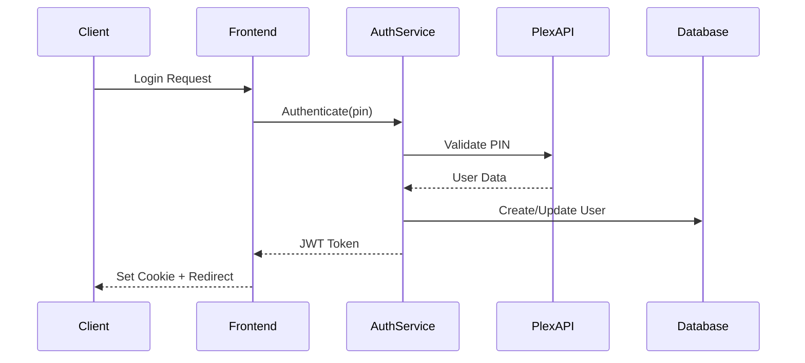
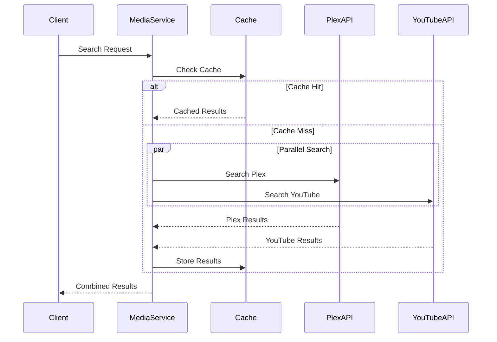

# MediaNest System Architecture

**Document Version**: 1.0  
**Architecture Type**: Microservices-Ready Monolith  
**Last Updated**: September 8, 2025

## 🏗️ Architectural Overview

MediaNest is built as a microservices-ready monolith that provides unified media management across Plex and YouTube platforms. The architecture emphasizes scalability, maintainability, and production readiness.

## 🎯 Architecture Principles

1. **Separation of Concerns**: Clear boundaries between business logic, data access, and presentation
2. **Scalability First**: Designed for horizontal scaling and cloud deployment
3. **Security by Design**: Authentication, authorization, and data protection at every layer
4. **Observability**: Comprehensive logging, monitoring, and tracing
5. **Resilience**: Circuit breakers, retries, and graceful degradation

## 🔧 Technology Stack

### Backend

- **Runtime**: Node.js 18+ with TypeScript
- **Framework**: Express.js with custom middleware
- **Database**: PostgreSQL with Prisma ORM
- **Caching**: Redis for session management and caching
- **Authentication**: JWT with secure httpOnly cookies
- **API Integration**: Plex API, YouTube Data API v3

### Frontend

- **Framework**: Next.js 15 with React 19
- **State Management**: TanStack Query for server state
- **Styling**: Tailwind CSS with custom components
- **Authentication**: NextAuth.js integration
- **Real-time**: Socket.io for live updates

### Infrastructure

- **Container**: Docker with multi-stage builds
- **Orchestration**: Docker Compose (development), Kubernetes (production)
- **Monitoring**: OpenTelemetry with Prometheus and Grafana
- **Logging**: Winston with structured logging
- **CI/CD**: GitHub Actions with automated testing

## 🏛️ System Components

```
┌─────────────────────────────────────────────────────────────────┐
│                        Load Balancer                           │
│                     (NGINX/Cloudflare)                        │
└─────────────────────────┬───────────────────────────────────────┘
                         │
┌─────────────────────────▼───────────────────────────────────────┐
│                    Frontend Layer                             │
│  ┌─────────────────┐  ┌─────────────────┐  ┌─────────────────┐ │
│  │   Next.js App   │  │   Static Assets │  │   WebSocket     │ │
│  │   (SSR/SSG)     │  │   (CDN)         │  │   Connection    │ │
│  └─────────────────┘  └─────────────────┘  └─────────────────┘ │
└─────────────────────────┬───────────────────────────────────────┘
                         │
┌─────────────────────────▼───────────────────────────────────────┐
│                     API Gateway                               │
│           (Rate Limiting, Authentication, CORS)               │
└─────────────────────────┬───────────────────────────────────────┘
                         │
┌─────────────────────────▼───────────────────────────────────────┐
│                   Application Layer                           │
│  ┌─────────────────┐  ┌─────────────────┐  ┌─────────────────┐ │
│  │   Auth Service  │  │  Media Service  │  │ Dashboard Service│ │
│  │  - JWT tokens   │  │  - Search       │  │  - Analytics    │ │
│  │  - Plex OAuth   │  │  - Metadata     │  │  - Statistics   │ │
│  │  - Session mgmt │  │  - Integration  │  │  - Reports      │ │
│  └─────────────────┘  └─────────────────┘  └─────────────────┘ │
└─────────┬───────────────────┬───────────────────┬───────────────┘
          │                   │                   │
┌─────────▼───────┐  ┌────────▼────────┐  ┌──────▼──────┐
│   PostgreSQL    │  │     Redis       │  │  External   │
│   Database      │  │    Cache        │  │   APIs      │
│  - User data    │  │  - Sessions     │  │ - Plex API  │
│  - Media meta   │  │  - API cache    │  │ - YouTube   │
│  - Preferences  │  │  - Rate limits  │  │ - Overseerr │
└─────────────────┘  └─────────────────┘  └─────────────┘
```

## 📦 Service Architecture

### Authentication Service

```typescript
interface AuthService {
  // User authentication
  authenticateWithPlex(pin: string): Promise<User>;
  validateToken(token: string): Promise<User | null>;
  refreshToken(refreshToken: string): Promise<TokenPair>;

  // Session management
  createSession(user: User): Promise<Session>;
  validateSession(sessionId: string): Promise<Session | null>;
  revokeSession(sessionId: string): Promise<void>;

  // Security
  hashPassword(password: string): Promise<string>;
  verifyPassword(password: string, hash: string): Promise<boolean>;
}
```

### Media Service

```typescript
interface MediaService {
  // Search functionality
  searchMedia(query: SearchQuery): Promise<SearchResults>;
  searchPlex(query: string, filters: SearchFilters): Promise<PlexResults>;
  searchYouTube(query: string, filters: SearchFilters): Promise<YouTubeResults>;

  // Metadata management
  getMediaDetails(id: string, source: MediaSource): Promise<MediaDetails>;
  updateMediaMetadata(id: string, metadata: Metadata): Promise<void>;

  // Library synchronization
  syncPlexLibrary(): Promise<SyncResult>;
  syncYouTubeData(): Promise<SyncResult>;
}
```

### Dashboard Service

```typescript
interface DashboardService {
  // Statistics
  getLibraryStats(): Promise<LibraryStats>;
  getUserActivity(userId: string): Promise<UserActivity>;
  getSystemMetrics(): Promise<SystemMetrics>;

  // Analytics
  generateReport(type: ReportType, params: ReportParams): Promise<Report>;
  getUsageAnalytics(timeRange: TimeRange): Promise<Analytics>;
}
```

## 🔗 Data Flow Architecture

### Request Processing Flow

1. **Client Request** → Load Balancer
2. **Load Balancer** → Frontend (Next.js)
3. **Frontend** → API Gateway (rate limiting, auth)
4. **API Gateway** → Application Service
5. **Service** → Database/Cache/External API
6. **Response** ← Service ← Database
7. **Client** ← Frontend ← API Gateway

### Authentication Flow



### Media Search Flow



## 🛡️ Security Architecture

### Authentication & Authorization

- **JWT Tokens**: Secure httpOnly cookies with refresh mechanism
- **Plex OAuth**: Official Plex authentication integration
- **Session Management**: Redis-based session storage
- **Role-Based Access**: Admin and user roles with permissions

### Data Protection

- **Input Validation**: Zod schemas for request validation
- **SQL Injection Prevention**: Parameterized queries via Prisma
- **XSS Protection**: Content Security Policy headers
- **CSRF Protection**: SameSite cookies and CSRF tokens

### API Security

- **Rate Limiting**: Per-user and per-IP rate limits
- **CORS Configuration**: Strict origin policies
- **Helmet Integration**: Security headers middleware
- **Request Sanitization**: Input cleaning and validation

## 📊 Monitoring & Observability

### Metrics Collection

- **Application Metrics**: Request rates, response times, error rates
- **Business Metrics**: User activity, search queries, media consumption
- **Infrastructure Metrics**: CPU, memory, database performance
- **External API Metrics**: Plex/YouTube API response times and errors

### Logging Strategy

```typescript
interface LoggingStrategy {
  // Structured logging with Winston
  levels: ['error', 'warn', 'info', 'debug'];
  format: 'JSON'; // for log aggregation
  transports: ['console', 'file', 'external']; // ELK stack

  // Log correlation
  requestId: string; // for tracing requests
  userId?: string; // for user-specific logs
  sessionId?: string; // for session tracking
}
```

### Distributed Tracing

- **OpenTelemetry**: End-to-end request tracing
- **Span Creation**: Critical path instrumentation
- **Context Propagation**: Cross-service trace correlation
- **Performance Analysis**: Bottleneck identification

## 🚀 Deployment Architecture

### Container Strategy

```dockerfile
# Multi-stage build
FROM node:18-alpine AS builder
WORKDIR /app
COPY package*.json ./
RUN npm ci --only=production

FROM node:18-alpine AS runner
WORKDIR /app
COPY --from=builder /app/node_modules ./node_modules
COPY . .
EXPOSE 4000
CMD ["npm", "start"]
```

### Kubernetes Deployment

```yaml
apiVersion: apps/v1
kind: Deployment
metadata:
  name: medianest-backend
spec:
  replicas: 3
  selector:
    matchLabels:
      app: medianest-backend
  template:
    metadata:
      labels:
        app: medianest-backend
    spec:
      containers:
        - name: backend
          image: medianest/backend:latest
          ports:
            - containerPort: 4000
          env:
            - name: NODE_ENV
              value: 'production'
          resources:
            requests:
              memory: '256Mi'
              cpu: '250m'
            limits:
              memory: '512Mi'
              cpu: '500m'
```

## 📈 Scalability Considerations

### Horizontal Scaling

- **Stateless Services**: No server-side session state
- **Database Sharding**: Partition strategy for large datasets
- **Cache Distribution**: Redis Cluster for high availability
- **Load Balancing**: Round-robin with health checks

### Performance Optimization

- **Database Indexing**: Query-specific index strategies
- **Connection Pooling**: Efficient database connection management
- **Async Processing**: Background jobs for heavy operations
- **CDN Integration**: Static asset delivery optimization

### Future Microservices Migration

- **Service Boundaries**: Clear domain separation
- **API Contracts**: OpenAPI specifications for service interfaces
- **Data Consistency**: Event sourcing and SAGA patterns
- **Service Discovery**: Kubernetes native service discovery

## 🧪 Testing Architecture

### Testing Strategy

- **Unit Tests**: 90%+ code coverage with Jest/Vitest
- **Integration Tests**: API endpoint testing
- **End-to-End Tests**: Critical user journey testing
- **Performance Tests**: Load testing with k6
- **Security Tests**: OWASP compliance testing

### Testing Infrastructure

```typescript
interface TestingInfrastructure {
  unit: {
    framework: 'Vitest';
    mocking: 'vitest-mock-extended';
    coverage: 'c8';
  };

  integration: {
    framework: 'Supertest';
    database: 'Test containers';
    fixtures: 'Factory pattern';
  };

  e2e: {
    framework: 'Playwright';
    environment: 'Docker compose';
    ci: 'GitHub Actions';
  };
}
```

## 🔄 CI/CD Architecture

### Pipeline Stages

1. **Code Quality**: Linting, type checking, security scans
2. **Testing**: Unit, integration, and security tests
3. **Build**: Docker image creation and optimization
4. **Deploy**: Staged deployment with rollback capability
5. **Monitor**: Post-deployment health checks

### Deployment Strategy

- **Blue-Green Deployment**: Zero-downtime deployments
- **Canary Releases**: Gradual feature rollouts
- **Feature Flags**: Runtime feature toggling
- **Rollback Capability**: Automated rollback on failure

---

**Generated by**: MediaNest SWARM Architecture Agent  
**Review Status**: Production Ready  
**Next Review**: October 8, 2025
