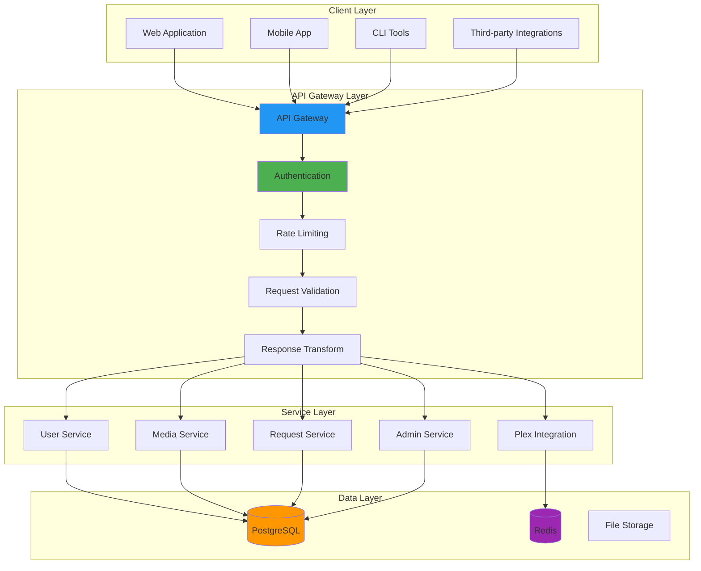
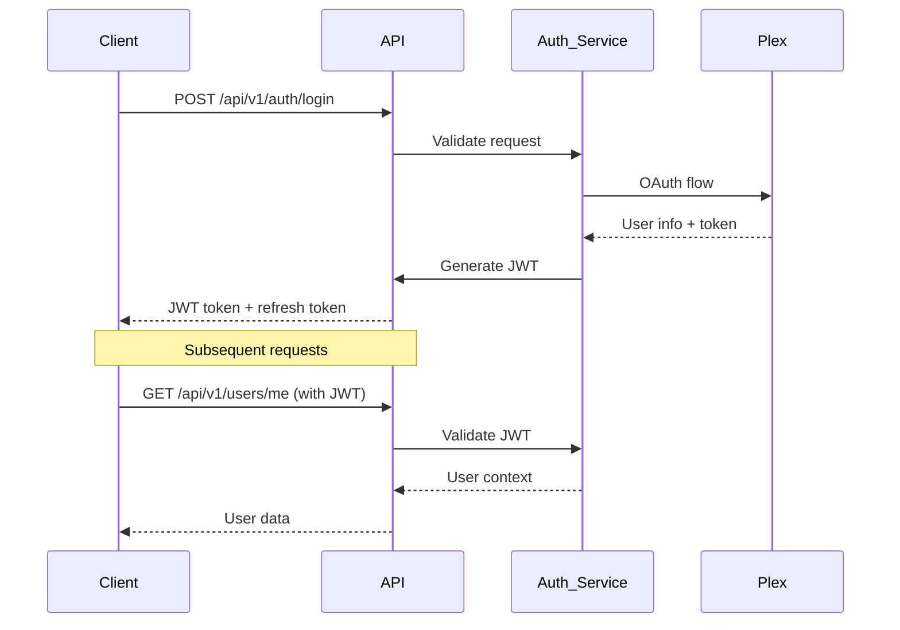
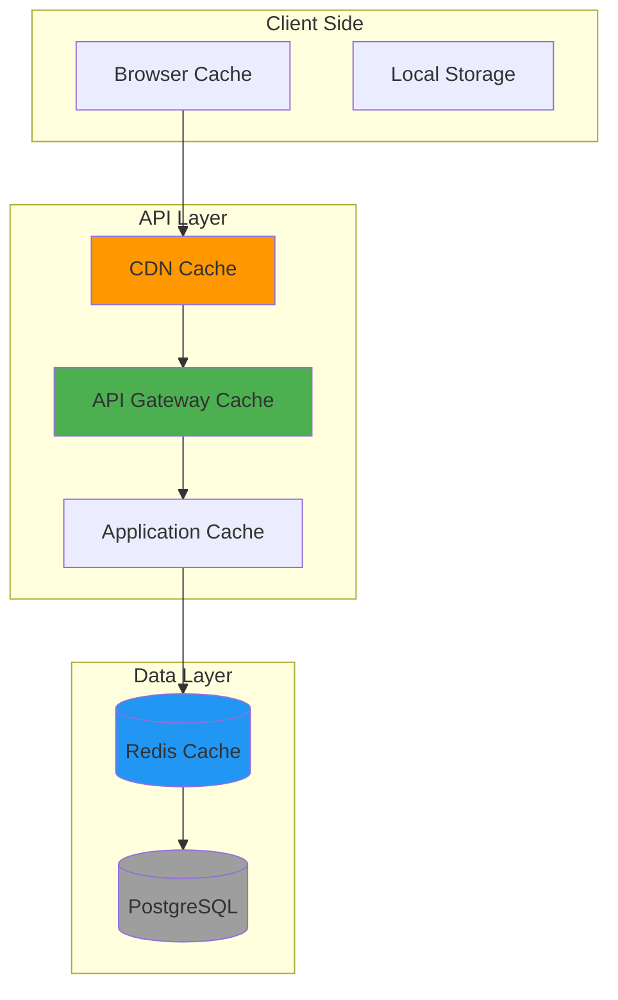

# MediaNest API Design Architecture

**Version:** 2.0  
**Date:** September 2025  
**Status:** Active Implementation  
**Tags:** api, rest, design-patterns, openapi

---

## Table of Contents

1. [API Design Overview](#api-design-overview)
2. [RESTful API Principles](#restful-api-principles)
3. [API Structure & Organization](#api-structure--organization)
4. [Request/Response Patterns](#requestresponse-patterns)
5. [Authentication & Authorization](#authentication--authorization)
6. [Error Handling Strategy](#error-handling-strategy)
7. [Pagination & Filtering](#pagination--filtering)
8. [API Versioning](#api-versioning)
9. [Performance Optimization](#performance-optimization)
10. [OpenAPI Specification](#openapi-specification)

---

## API Design Overview

MediaNest follows **RESTful API design principles** with a focus on consistency, discoverability, and developer experience. The API serves as the primary interface between the frontend application and backend services.

### Design Philosophy

- **Resource-Oriented**: APIs model business entities as resources
- **HTTP Semantic**: Proper use of HTTP methods and status codes
- **Consistent Patterns**: Uniform structure across all endpoints
- **Self-Documenting**: Clear, intuitive endpoint naming
- **Developer-First**: Optimized for ease of integration

### API Architecture Overview



---

## RESTful API Principles

### HTTP Methods Usage

| Method     | Purpose                  | Idempotent | Safe | Usage             |
| ---------- | ------------------------ | ---------- | ---- | ----------------- |
| **GET**    | Retrieve resources       | ✅         | ✅   | Read operations   |
| **POST**   | Create resources         | ❌         | ❌   | Create operations |
| **PUT**    | Update/Replace resources | ✅         | ❌   | Full updates      |
| **PATCH**  | Partial updates          | ❌         | ❌   | Partial updates   |
| **DELETE** | Remove resources         | ✅         | ❌   | Delete operations |

### Resource Naming Conventions

```
/api/v1/resources                    # Collection endpoint
/api/v1/resources/{id}               # Individual resource
/api/v1/resources/{id}/subresources  # Nested resources
/api/v1/resources/{id}/actions       # Resource actions
```

### URL Structure Examples

```bash
# Users
GET    /api/v1/users                 # List all users
GET    /api/v1/users/{id}            # Get specific user
POST   /api/v1/users                 # Create new user
PUT    /api/v1/users/{id}            # Update user
DELETE /api/v1/users/{id}            # Delete user

# Media Items
GET    /api/v1/media                 # List media items
GET    /api/v1/media/{id}            # Get specific media item
GET    /api/v1/media/search          # Search media
POST   /api/v1/media/{id}/request    # Request media item

# Requests
GET    /api/v1/requests              # List requests
GET    /api/v1/requests/{id}         # Get specific request
POST   /api/v1/requests              # Create request
PUT    /api/v1/requests/{id}         # Update request
POST   /api/v1/requests/{id}/approve # Approve request
```

---

## API Structure & Organization

### Endpoint Organization

```mermaid
graph TD
    subgraph "Core Resources"
        Users[/api/v1/users]
        Media[/api/v1/media]
        Requests[/api/v1/requests]
    end

    subgraph "Integration Endpoints"
        Plex[/api/v1/plex]
        YouTube[/api/v1/youtube]
        TMDB[/api/v1/tmdb]
    end

    subgraph "Administrative"
        Admin[/api/v1/admin]
        System[/api/v1/system]
        Health[/api/v1/health]
    end

    subgraph "Utility Endpoints"
        Search[/api/v1/search]
        Upload[/api/v1/upload]
        Export[/api/v1/export]
    end

    style Users fill:#4caf50
    style Media fill:#2196f3
    style Requests fill:#ff9800
    style Admin fill:#f44336
```

### Resource Hierarchy

```
/api/v1/
├── users/
│   ├── {id}/
│   │   ├── preferences
│   │   ├── requests
│   │   └── sessions
├── media/
│   ├── {id}/
│   │   ├── details
│   │   ├── requests
│   │   └── metadata
│   ├── search
│   └── categories
├── requests/
│   ├── {id}/
│   │   ├── approve
│   │   ├── reject
│   │   └── comments
│   ├── pending
│   └── history
└── admin/
    ├── users
    ├── system
    └── reports
```

---

## Request/Response Patterns

### Standard Response Envelope

All API responses follow a consistent envelope structure:

```typescript
interface ApiResponse<T> {
  success: boolean;
  data?: T;
  error?: ApiError;
  meta?: ResponseMeta;
  links?: PaginationLinks;
}

interface ApiError {
  code: string;
  message: string;
  details?: Record<string, any>;
  field?: string;
}

interface ResponseMeta {
  timestamp: string;
  requestId: string;
  version: string;
  pagination?: PaginationMeta;
}
```

### Success Response Examples

```json
{
  "success": true,
  "data": {
    "id": "uuid-here",
    "username": "john_doe",
    "email": "john@example.com",
    "role": "user",
    "createdAt": "2025-09-07T12:00:00Z"
  },
  "meta": {
    "timestamp": "2025-09-07T12:00:00Z",
    "requestId": "req-123456789",
    "version": "2.0"
  }
}
```

### Collection Response Example

```json
{
  "success": true,
  "data": [
    {
      "id": "media-1",
      "title": "Movie Title",
      "type": "movie",
      "year": 2023
    }
  ],
  "meta": {
    "timestamp": "2025-09-07T12:00:00Z",
    "requestId": "req-123456789",
    "version": "2.0",
    "pagination": {
      "page": 1,
      "limit": 20,
      "total": 150,
      "totalPages": 8
    }
  },
  "links": {
    "self": "/api/v1/media?page=1&limit=20",
    "next": "/api/v1/media?page=2&limit=20",
    "last": "/api/v1/media?page=8&limit=20"
  }
}
```

### Error Response Example

```json
{
  "success": false,
  "error": {
    "code": "VALIDATION_ERROR",
    "message": "Invalid input provided",
    "details": {
      "field": "email",
      "value": "invalid-email",
      "constraint": "Must be a valid email address"
    }
  },
  "meta": {
    "timestamp": "2025-09-07T12:00:00Z",
    "requestId": "req-123456789",
    "version": "2.0"
  }
}
```

---

## Authentication & Authorization

### Authentication Flow



### Authorization Headers

```http
# Authentication
Authorization: Bearer <jwt_token>

# Content Type
Content-Type: application/json

# Request ID (optional, for tracing)
X-Request-ID: req-123456789

# Client Version (optional, for analytics)
X-Client-Version: web-2.0.0
```

### Protected Endpoints

```typescript
// Endpoint access levels
enum AccessLevel {
  PUBLIC = 'public', // No authentication required
  AUTHENTICATED = 'auth', // Valid JWT required
  USER = 'user', // User role required
  MODERATOR = 'moderator', // Moderator role required
  ADMIN = 'admin', // Admin role required
}

// Example endpoint definitions
const endpoints = {
  'GET /api/v1/media': AccessLevel.PUBLIC,
  'GET /api/v1/users/me': AccessLevel.AUTHENTICATED,
  'POST /api/v1/requests': AccessLevel.USER,
  'POST /api/v1/requests/{id}/approve': AccessLevel.MODERATOR,
  'GET /api/v1/admin/users': AccessLevel.ADMIN,
};
```

---

## Error Handling Strategy

### HTTP Status Codes

| Status Code | Meaning               | Usage                      |
| ----------- | --------------------- | -------------------------- |
| **200**     | OK                    | Successful GET, PUT, PATCH |
| **201**     | Created               | Successful POST            |
| **204**     | No Content            | Successful DELETE          |
| **400**     | Bad Request           | Invalid request syntax     |
| **401**     | Unauthorized          | Authentication required    |
| **403**     | Forbidden             | Insufficient permissions   |
| **404**     | Not Found             | Resource not found         |
| **409**     | Conflict              | Resource conflict          |
| **422**     | Unprocessable Entity  | Validation errors          |
| **429**     | Too Many Requests     | Rate limit exceeded        |
| **500**     | Internal Server Error | Server-side error          |

### Error Code Categories

```typescript
enum ErrorCategory {
  // Authentication & Authorization
  AUTH_REQUIRED = 'AUTH_REQUIRED',
  AUTH_INVALID = 'AUTH_INVALID',
  AUTH_EXPIRED = 'AUTH_EXPIRED',
  PERMISSION_DENIED = 'PERMISSION_DENIED',

  // Validation
  VALIDATION_ERROR = 'VALIDATION_ERROR',
  INVALID_FORMAT = 'INVALID_FORMAT',
  MISSING_REQUIRED = 'MISSING_REQUIRED',

  // Resources
  RESOURCE_NOT_FOUND = 'RESOURCE_NOT_FOUND',
  RESOURCE_EXISTS = 'RESOURCE_EXISTS',
  RESOURCE_LOCKED = 'RESOURCE_LOCKED',

  // Rate Limiting
  RATE_LIMIT_EXCEEDED = 'RATE_LIMIT_EXCEEDED',
  QUOTA_EXCEEDED = 'QUOTA_EXCEEDED',

  // External Services
  PLEX_UNAVAILABLE = 'PLEX_UNAVAILABLE',
  EXTERNAL_SERVICE_ERROR = 'EXTERNAL_SERVICE_ERROR',

  // System
  SYSTEM_ERROR = 'SYSTEM_ERROR',
  MAINTENANCE_MODE = 'MAINTENANCE_MODE',
}
```

### Validation Error Response

```json
{
  "success": false,
  "error": {
    "code": "VALIDATION_ERROR",
    "message": "Request validation failed",
    "details": [
      {
        "field": "email",
        "value": "invalid-email",
        "message": "Must be a valid email address"
      },
      {
        "field": "password",
        "message": "Password is required"
      }
    ]
  },
  "meta": {
    "timestamp": "2025-09-07T12:00:00Z",
    "requestId": "req-123456789",
    "version": "2.0"
  }
}
```

---

## Pagination & Filtering

### Pagination Strategy

```typescript
interface PaginationQuery {
  page?: number; // Page number (1-based, default: 1)
  limit?: number; // Items per page (default: 20, max: 100)
  sort?: string; // Sort field (default: 'createdAt')
  order?: 'asc' | 'desc'; // Sort order (default: 'desc')
}

interface FilterQuery {
  search?: string; // Full-text search
  type?: string; // Filter by type
  status?: string; // Filter by status
  dateFrom?: string; // Date range start
  dateTo?: string; // Date range end
  [key: string]: any; // Additional filters
}
```

### Query Examples

```bash
# Basic pagination
GET /api/v1/media?page=2&limit=50

# Sorting
GET /api/v1/media?sort=title&order=asc

# Filtering
GET /api/v1/media?type=movie&search=avengers

# Combined
GET /api/v1/requests?status=pending&sort=createdAt&order=desc&page=1&limit=25
```

### Advanced Filtering

```bash
# Date range filtering
GET /api/v1/requests?dateFrom=2025-01-01&dateTo=2025-12-31

# Multiple value filtering
GET /api/v1/media?type=movie,tv&genre=action,comedy

# Nested field filtering
GET /api/v1/users?preferences.notifications=true

# Comparison operators
GET /api/v1/media?year[gte]=2020&rating[lte]=8.5
```

---

## API Versioning

### Versioning Strategy

MediaNest uses **URL path versioning** for clear version identification:

```bash
# Current version
https://api.medianest.com/v1/users

# Future version
https://api.medianest.com/v2/users
```

### Version Lifecycle

| Version  | Status     | End of Life | Migration Period |
| -------- | ---------- | ----------- | ---------------- |
| **v1.0** | Deprecated | 2025-12-31  | 6 months         |
| **v2.0** | Current    | TBD         | N/A              |
| **v2.1** | Beta       | N/A         | N/A              |

### Backward Compatibility

- **Additive changes**: New fields added without breaking existing clients
- **Non-breaking changes**: Optional parameters, new optional response fields
- **Breaking changes**: Require new version number
- **Deprecation notices**: 6-month advance notice for breaking changes

### Version Negotiation

```http
# Header-based version selection (alternative)
Accept: application/vnd.medianest.v2+json

# Default version fallback
# If no version specified, latest stable version is used
```

---

## Performance Optimization

### Caching Strategy



### Caching Headers

```http
# Static resources
Cache-Control: public, max-age=31536000, immutable

# Dynamic content with validation
Cache-Control: private, max-age=300
ETag: "abc123"
Last-Modified: Wed, 07 Sep 2025 12:00:00 GMT

# Real-time data
Cache-Control: no-cache, no-store, must-revalidate
```

### Response Optimization

1. **Field Selection**: Allow clients to specify required fields
2. **Response Compression**: Gzip compression for all responses
3. **Batch Operations**: Support batch requests where applicable
4. **Async Processing**: Long-running operations return job IDs

### Field Selection Example

```bash
# Select specific fields
GET /api/v1/users?fields=id,username,email

# Exclude sensitive fields
GET /api/v1/users?exclude=password,apiKey

# Nested field selection
GET /api/v1/users?fields=id,username,preferences.theme
```

---

## OpenAPI Specification

### Specification Structure

```yaml
openapi: 3.0.3
info:
  title: MediaNest API
  description: |
    MediaNest REST API for media management and Plex integration.

    ## Authentication
    All endpoints require JWT authentication via Bearer token.

    ## Rate Limiting
    API calls are limited to 100 requests per minute per user.

    ## Support
    For API support, contact: api-support@medianest.com
  version: '2.0'
  contact:
    name: MediaNest API Team
    email: api-support@medianest.com
    url: https://docs.medianest.com
  license:
    name: MIT
    url: https://opensource.org/licenses/MIT

servers:
  - url: https://api.medianest.com/v1
    description: Production server
  - url: https://staging-api.medianest.com/v1
    description: Staging server

paths:
  /users:
    get:
      summary: List users
      description: Retrieve a paginated list of users
      tags: [Users]
      security:
        - BearerAuth: []
      parameters:
        - $ref: '#/components/parameters/PageParam'
        - $ref: '#/components/parameters/LimitParam'
      responses:
        '200':
          $ref: '#/components/responses/UserListResponse'
        '401':
          $ref: '#/components/responses/UnauthorizedError'
```

### Component Definitions

```yaml
components:
  schemas:
    User:
      type: object
      required: [id, username, email, role]
      properties:
        id:
          type: string
          format: uuid
          example: '123e4567-e89b-12d3-a456-426614174000'
        username:
          type: string
          example: 'john_doe'
        email:
          type: string
          format: email
          example: 'john@example.com'
        role:
          type: string
          enum: [admin, moderator, user, guest]
        createdAt:
          type: string
          format: date-time
          example: '2025-09-07T12:00:00Z'

    ApiResponse:
      type: object
      required: [success]
      properties:
        success:
          type: boolean
        data:
          type: object
        error:
          $ref: '#/components/schemas/ApiError'
        meta:
          $ref: '#/components/schemas/ResponseMeta'
```

### Documentation Generation

- **Automated generation**: OpenAPI spec generated from code annotations
- **Interactive docs**: Swagger UI for API exploration
- **SDK generation**: Automatic client SDK generation
- **Testing integration**: OpenAPI spec used for contract testing

---

## Related Documentation

- [System Architecture](system-architecture.md) - Overall system design
- [Security Architecture](security-architecture.md) - API security implementation
- [API Reference](../03-api-reference/README.md) - Complete API documentation
- [Implementation Guide](../04-implementation-guides/README.md) - API implementation details
- [Testing Guide](../05-testing/README.md) - API testing strategies

---

_Last updated: September 2025_  
_API design review scheduled: December 2025_  
_OpenAPI spec version: 2.0_
