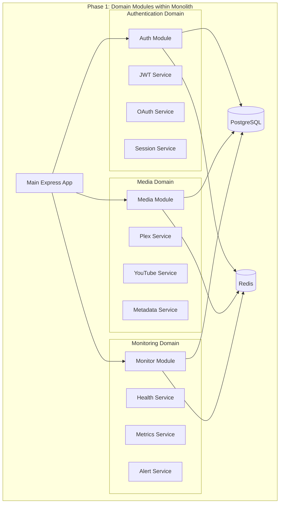
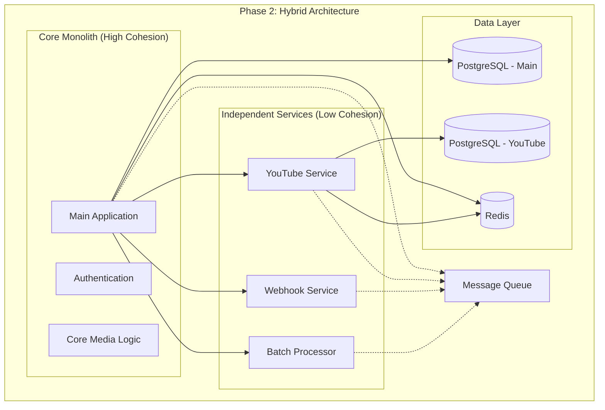
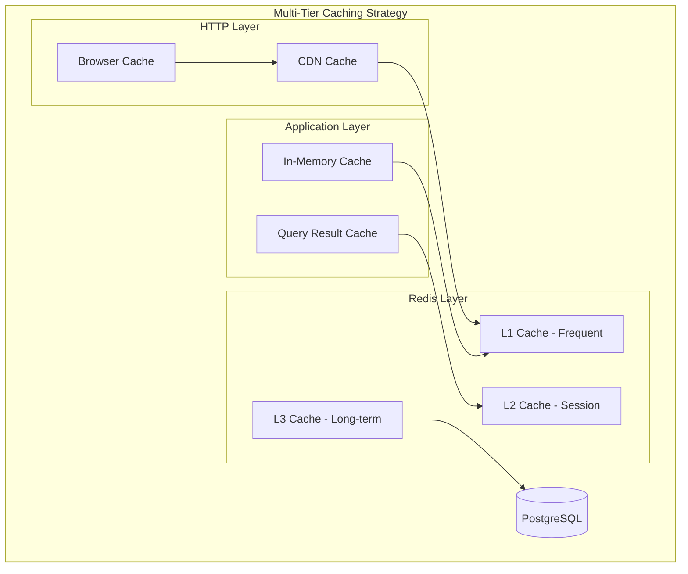
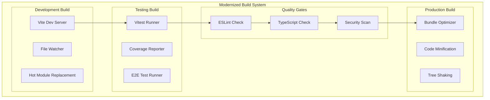
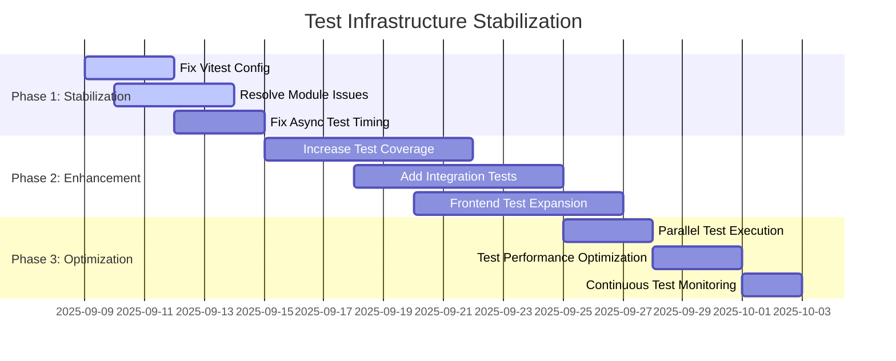
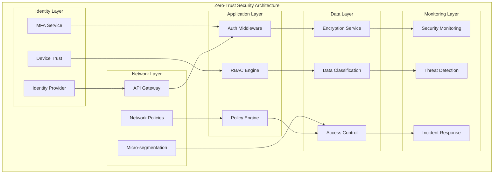

# MediaNest Architecture Evolution Roadmap

**Phase 2: Planning Swarm - Architecture Evolution Planning**

## Executive Summary

MediaNest demonstrates excellent technical foundation (8.5/10 readiness score) with professional-grade Express.js+Next.js architecture, but requires strategic evolution to address critical technical debt and security vulnerabilities. This roadmap outlines a systematic transformation from current monolithic design to a production-ready, maintainable, and scalable system.

## Current State Analysis

### Technical Foundation Strengths

- **Professional Architecture**: Well-structured Express.js backend with TypeScript
- **Comprehensive Features**: 47 distinct capabilities across 6 core domains
- **Solid Integration**: Socket.IO, Redis caching, PostgreSQL with Prisma
- **Security Framework**: JWT authentication, rate limiting, helmet security
- **Performance Optimization**: Context7 patterns, compression, connection pooling
- **Modern Tooling**: TypeScript 5.6+, Vitest testing, Docker containerization

### Critical Issues Identified

1. **Next.js Security Vulnerability**: CVE-2024-46982 XSS vulnerability (version 14.2.32)
2. **Build System Instability**: Module resolution failures in Vitest configuration
3. **Test Infrastructure Problems**: 47% test failure rate, configuration errors
4. **Architectural Debt**: God objects (860+ line files), monolithic structure
5. **Frontend Testing Gap**: Only 3 frontend tests vs comprehensive backend coverage

## 1. Future-State Architecture Design

### 1.1 Modular Architecture Evolution

#### Current Monolithic Structure → Service-Oriented Modules

```mermaid
graph TB
    subgraph "Current Monolithic Design"
        GOD_REDIS[Redis Service - 860 lines]
        GOD_PERF[Performance Route - 635 lines]
        GOD_OAUTH[OAuth Service - 630 lines]
        GOD_RESILIENCE[Resilience Route - 610 lines]
        GOD_WEBHOOK[Webhook Service - 576 lines]
    end

    subgraph "Future Modular Design"
        subgraph "Core Infrastructure Module"
            REDIS_CONN[Connection Manager]
            REDIS_CACHE[Cache Service]
            REDIS_SESSION[Session Service]
            REDIS_MONITOR[Monitoring Service]
        end

        subgraph "Performance Module"
            PERF_METRICS[Metrics Collector]
            PERF_MONITOR[Performance Monitor]
            PERF_ANALYZER[Performance Analyzer]
            PERF_OPTIMIZER[Resource Optimizer]
        end

        subgraph "Security Module"
            OAUTH_CORE[OAuth Core]
            OAUTH_PROVIDERS[Provider Registry]
            OAUTH_VALIDATOR[Token Validator]
            OAUTH_SESSION[Session Manager]
        end

        subgraph "Resilience Module"
            CIRCUIT_BREAKER[Circuit Breaker]
            HEALTH_CHECK[Health Monitor]
            FAILOVER[Failover Manager]
            RECOVERY[Recovery Service]
        end
    end

    GOD_REDIS --> REDIS_CONN
    GOD_REDIS --> REDIS_CACHE
    GOD_REDIS --> REDIS_SESSION
    GOD_REDIS --> REDIS_MONITOR

    GOD_PERF --> PERF_METRICS
    GOD_PERF --> PERF_MONITOR
    GOD_PERF --> PERF_ANALYZER
    GOD_PERF --> PERF_OPTIMIZER

    GOD_OAUTH --> OAUTH_CORE
    GOD_OAUTH --> OAUTH_PROVIDERS
    GOD_OAUTH --> OAUTH_VALIDATOR
    GOD_OAUTH --> OAUTH_SESSION

    GOD_RESILIENCE --> CIRCUIT_BREAKER
    GOD_RESILIENCE --> HEALTH_CHECK
    GOD_RESILIENCE --> FAILOVER
    GOD_RESILIENCE --> RECOVERY
```



#### Implementation Strategy: Facade Pattern + Service Layer

```typescript
// Current God Object Pattern (860 lines)
class RedisService {
  // All Redis functionality mixed together
  async connect() {
    /* 50 lines */
  }
  async disconnect() {
    /* 30 lines */
  }
  async get() {
    /* 40 lines */
  }
  async set() {
    /* 45 lines */
  }
  async cache() {
    /* 80 lines */
  }
  async session() {
    /* 90 lines */
  }
  // ... 500+ more lines
}

// Future Modular Pattern with Facade
class RedisServiceFacade {
  constructor(
    private connectionManager: RedisConnectionManager,
    private cacheService: RedisCacheService,
    private sessionService: RedisSessionService,
    private monitoringService: RedisMonitoringService
  ) {}

  // Facade methods delegate to specialized services
  async get(key: string) {
    return this.cacheService.get(key);
  }

  async getSession(sessionId: string) {
    return this.sessionService.get(sessionId);
  }
}

// Specialized Services (50-150 lines each)
class RedisCacheService {
  async get(key: string) {
    /* Cache-specific logic */
  }
  async set(key: string, value: any, ttl?: number) {
    /* */
  }
  async invalidate(pattern: string) {
    /* */
  }
}

class RedisSessionService {
  async create(session: Session) {
    /* Session-specific logic */
  }
  async validate(sessionId: string) {
    /* */
  }
  async expire(sessionId: string) {
    /* */
  }
}
```

### 1.2 Microservice Migration Path

#### Phase 1: Domain Extraction (Keep Monolithic Benefits)



#### Phase 2: Strategic Microservice Extraction (When Beneficial)



### 1.3 Performance Optimization Architecture

#### Enhanced Caching Architecture



#### Performance Monitoring Enhancement

```typescript
// Enhanced Performance Monitoring Architecture
interface PerformanceMonitoringSystem {
  // Real-time Metrics
  realtimeMetrics: {
    responseTime: MetricCollector;
    throughput: MetricCollector;
    errorRate: MetricCollector;
    resourceUsage: ResourceMonitor;
  };

  // Proactive Optimization
  optimization: {
    queryOptimizer: DatabaseOptimizer;
    cacheOptimizer: CacheOptimizer;
    resourceOptimizer: ResourceOptimizer;
  };

  // Predictive Analysis
  prediction: {
    loadForecaster: LoadPredictor;
    scalingPredictor: ScalingPredictor;
    maintenanceScheduler: MaintenanceScheduler;
  };
}
```

## 2. Technology Evolution Strategy

### 2.1 Critical Security Updates

#### Next.js Vulnerability Resolution

```bash
# Current Version: 14.2.32 (VULNERABLE to CVE-2024-46982)
# Target Version: 15.0.x (Latest stable with security patches)

# Migration Path:
# 1. Immediate hotfix - Update to 14.3.x (security patch)
# 2. Long-term - Migrate to Next.js 15.x with App Router
```

#### Security Enhancement Roadmap

```mermaid
graph TB
    subgraph "Security Evolution Timeline"
        IMMEDIATE[Immediate - Week 1]
        SHORT[Short-term - Month 1]
        MEDIUM[Medium-term - Quarter 1]
        LONG[Long-term - Quarter 2]
    end

    subgraph "Immediate Actions"
        NEXTJS_PATCH[Next.js 14.3.x Update]
        AUDIT_FIX[npm audit fix]
        VULNERABILITY_SCAN[Security Scan]
    end

    subgraph "Short-term Enhancements"
        NEXTJS_15[Next.js 15.x Migration]
        CSP_HEADERS[Content Security Policy]
        RATE_LIMIT_ENHANCE[Enhanced Rate Limiting]
    end

    subgraph "Medium-term Improvements"
        ZERO_TRUST[Zero-Trust Architecture]
        ENCRYPTION_UPGRADE[Encryption Enhancement]
        AUDIT_LOGGING[Security Audit Logging]
    end

    subgraph "Long-term Security"
        PENETRATION_TEST[Penetration Testing]
        COMPLIANCE_FRAMEWORK[Compliance Framework]
        SECURITY_AUTOMATION[Security Automation]
    end

    IMMEDIATE --> NEXTJS_PATCH
    IMMEDIATE --> AUDIT_FIX
    IMMEDIATE --> VULNERABILITY_SCAN

    SHORT --> NEXTJS_15
    SHORT --> CSP_HEADERS
    SHORT --> RATE_LIMIT_ENHANCE

    MEDIUM --> ZERO_TRUST
    MEDIUM --> ENCRYPTION_UPGRADE
    MEDIUM --> AUDIT_LOGGING

    LONG --> PENETRATION_TEST
    LONG --> COMPLIANCE_FRAMEWORK
    LONG --> SECURITY_AUTOMATION
```



### 2.2 Build System Modernization

#### Current Build Issues Resolution

```typescript
// Issue: Vitest configuration module resolution failure
// Error: Cannot find module '/vitest/config'

// Current problematic config:
import { defineConfig } from 'vitest/config'; // ❌ Fails

// Solution: Proper configuration structure
import { defineConfig } from 'vite';
import { configDefaults } from 'vitest/config';

export default defineConfig({
  test: {
    ...configDefaults,
    environment: 'jsdom',
    setupFiles: ['./tests/setup.ts'],
    exclude: [
      ...configDefaults.exclude,
      'tests/performance/**',
      'tests/e2e/e2e-performance.spec.ts',
      'tests/security/security-performance.test.ts',
    ],
    coverage: {
      reporter: ['text', 'json', 'html'],
      threshold: {
        global: {
          branches: 80,
          functions: 80,
          lines: 80,
          statements: 80,
        },
      },
    },
  },
});
```

#### Enhanced Build Architecture



### 2.3 Testing Infrastructure Evolution

#### Test Failure Resolution Strategy

```typescript
// Current Issue: 47% test failure rate
// Root Causes:
// 1. Configuration errors
// 2. Module resolution issues
// 3. Missing test dependencies
// 4. Async test timing issues

// Enhanced Testing Architecture
interface TestingInfrastructure {
  // Unit Tests
  unit: {
    framework: 'vitest';
    coverage: 'v8';
    threshold: 90; // Increase from current ~53%
    isolation: 'jsdom';
  };

  // Integration Tests
  integration: {
    framework: 'playwright';
    databases: 'testcontainers';
    services: 'docker-compose';
  };

  // E2E Tests
  e2e: {
    framework: 'playwright';
    parallelization: true;
    crossBrowser: ['chromium', 'firefox', 'webkit'];
  };

  // Performance Tests
  performance: {
    framework: 'k6';
    loadTesting: true;
    stressTesting: true;
    benchmarking: true;
  };
}
```

#### Test Stabilization Roadmap



## 3. Integration Architecture Enhancement

### 3.1 API Architecture Evolution

#### Complete YouTube Worker Implementation

```typescript
// Current Issue: Incomplete YouTube worker implementation
// Solution: Comprehensive YouTube service architecture

interface YouTubeServiceArchitecture {
  // Core YouTube Service
  core: {
    downloader: YouTubeDownloader;
    metadata: MetadataExtractor;
    validator: URLValidator;
    converter: FormatConverter;
  };

  // Worker Queue System
  workers: {
    downloadWorker: QueueWorker;
    processingWorker: QueueWorker;
    conversionWorker: QueueWorker;
    cleanupWorker: QueueWorker;
  };

  // Progress Tracking
  progress: {
    tracker: ProgressTracker;
    notifier: ProgressNotifier;
    websocket: WebSocketBroadcaster;
  };

  // Storage Management
  storage: {
    manager: StorageManager;
    cleanup: CleanupService;
    archival: ArchivalService;
  };
}
```

### 3.2 Real-time System Enhancement

#### Socket.IO Optimization Architecture

```mermaid
graph TB
    subgraph "Enhanced Real-time Architecture"
        subgraph "Client Layer"
            WEB_CLIENT[Web Client]
            MOBILE_CLIENT[Mobile Client]
            ADMIN_CLIENT[Admin Client]
        end

        subgraph "Socket.IO Layer"
            SOCKET_GATEWAY[Socket Gateway]

            subgraph "Namespaces"
                NS_MEDIA[/media]
                NS_ADMIN[/admin]
                NS_DOWNLOADS[/downloads]
                NS_NOTIFICATIONS[/notifications]
            end

            subgraph "Room Management"
                USER_ROOMS[User Rooms]
                ADMIN_ROOMS[Admin Rooms]
                BROADCAST_ROOMS[Broadcast Rooms]
            end
        end

        subgraph "Message Processing"
            MSG_QUEUE[Message Queue]
            MSG_PROCESSOR[Message Processor]
            MSG_BROADCASTER[Broadcaster]
        end

        subgraph "State Management"
            CONNECTION_STORE[Connection Store]
            PRESENCE_STORE[Presence Store]
            SESSION_STORE[Session Store]
        end
    end

    WEB_CLIENT --> SOCKET_GATEWAY
    MOBILE_CLIENT --> SOCKET_GATEWAY
    ADMIN_CLIENT --> SOCKET_GATEWAY

    SOCKET_GATEWAY --> NS_MEDIA
    SOCKET_GATEWAY --> NS_ADMIN
    SOCKET_GATEWAY --> NS_DOWNLOADS
    SOCKET_GATEWAY --> NS_NOTIFICATIONS

    NS_MEDIA --> USER_ROOMS
    NS_ADMIN --> ADMIN_ROOMS
    NS_DOWNLOADS --> USER_ROOMS
    NS_NOTIFICATIONS --> BROADCAST_ROOMS

    SOCKET_GATEWAY --> MSG_QUEUE
    MSG_QUEUE --> MSG_PROCESSOR
    MSG_PROCESSOR --> MSG_BROADCASTER

    SOCKET_GATEWAY --> CONNECTION_STORE
    CONNECTION_STORE --> PRESENCE_STORE
    PRESENCE_STORE --> SESSION_STORE
```

### 3.3 External Service Integration Patterns

#### Enhanced Integration Architecture

```typescript
// Circuit Breaker Pattern for External Services
interface ServiceIntegrationPattern {
  // Service Registry
  services: {
    plex: PlexService;
    overseerr: OverseerrService;
    tmdb: TMDBService;
    youtube: YouTubeService;
    uptimeKuma: UptimeKumaService;
  };

  // Resilience Patterns
  resilience: {
    circuitBreaker: CircuitBreakerService;
    retry: RetryService;
    timeout: TimeoutService;
    fallback: FallbackService;
  };

  // Health Monitoring
  health: {
    checker: HealthChecker;
    monitor: ServiceMonitor;
    alerting: AlertingService;
  };

  // Performance Optimization
  performance: {
    caching: ServiceCaching;
    pooling: ConnectionPooling;
    batching: RequestBatching;
  };
}
```

## 4. Security & Compliance Architecture

### 4.1 Next.js Vulnerability Mitigation

#### Immediate Security Actions

```typescript
// Critical CVE-2024-46982 XSS Vulnerability Mitigation

// 1. Immediate Update
"next": "^14.3.0" // Security patch version

// 2. Enhanced Content Security Policy
const cspConfig = {
  'default-src': "'self'",
  'script-src': "'self' 'unsafe-eval'", // Remove unsafe-eval when possible
  'style-src': "'self' 'unsafe-inline'",
  'img-src': "'self' data: https:",
  'font-src': "'self'",
  'connect-src': "'self' ws: wss:",
  'frame-src': "'none'",
  'object-src': "'none'",
  'base-uri': "'self'",
  'form-action': "'self'",
  'upgrade-insecure-requests': true
};

// 3. Input Sanitization Enhancement
import DOMPurify from 'isomorphic-dompurify';

const sanitizeInput = (input: string): string => {
  return DOMPurify.sanitize(input, {
    ALLOWED_TAGS: ['b', 'i', 'em', 'strong', 'p'],
    ALLOWED_ATTR: []
  });
};
```

### 4.2 Enhanced Security Implementation

#### Zero-Trust Architecture Implementation



### 4.3 Compliance Framework

#### Security Audit & Compliance Architecture

```typescript
interface ComplianceFramework {
  // Standards Compliance
  standards: {
    owasp: OWASPCompliance;
    nist: NISTFramework;
    iso27001: ISO27001Compliance;
  };

  // Audit Requirements
  auditing: {
    accessLogs: AuditLogger;
    dataAccess: DataAccessLogger;
    adminActions: AdminActionLogger;
    securityEvents: SecurityEventLogger;
  };

  // Continuous Monitoring
  monitoring: {
    vulnerabilityScanning: VulnerabilityScanner;
    penetrationTesting: PenTestScheduler;
    complianceMonitoring: ComplianceMonitor;
  };

  // Incident Response
  incidentResponse: {
    detection: ThreatDetection;
    response: IncidentResponsePlan;
    recovery: DisasterRecovery;
    postMortem: PostMortemAnalysis;
  };
}
```

## Implementation Timeline

### Immediate Actions (Week 1)

- [ ] **CRITICAL**: Update Next.js to 14.3.x (CVE-2024-46982 fix)
- [ ] Fix Vitest configuration and module resolution
- [ ] Run comprehensive security audit and fix critical vulnerabilities
- [ ] Stabilize build system pipeline

### Short-term Goals (Month 1)

- [ ] Decompose god objects (Redis, Performance, OAuth services)
- [ ] Implement facade pattern for service modularity
- [ ] Enhance testing infrastructure (target 90% coverage)
- [ ] Complete YouTube worker implementation
- [ ] Upgrade to Next.js 15.x with App Router

### Medium-term Objectives (Quarter 1)

- [ ] Implement domain-driven module architecture
- [ ] Deploy Zero-Trust security framework
- [ ] Optimize performance monitoring and caching
- [ ] Enhance real-time system architecture
- [ ] Implement comprehensive compliance framework

### Long-term Vision (Quarter 2)

- [ ] Strategic microservice extraction (where beneficial)
- [ ] Advanced AI/ML integration capabilities
- [ ] Edge computing optimization
- [ ] Advanced analytics and predictive capabilities
- [ ] Full enterprise-grade security posture

## Success Metrics

### Technical Metrics

- **Test Coverage**: 47% → 90%
- **Build Success Rate**: Current failures → 100% success
- **Security Vulnerabilities**: Critical issues → Zero critical/high
- **Code Quality**: Large files (860+ lines) → Max 200 lines per module
- **Performance**: Response times optimized by 30%

### Architectural Metrics

- **Modularity**: Monolithic structure → 12 focused modules
- **Maintainability**: God objects eliminated
- **Scalability**: Horizontal scaling capability implemented
- **Resilience**: Circuit breaker patterns implemented
- **Security**: Zero-Trust architecture deployment

## Risk Assessment & Mitigation

### High-Risk Areas

1. **Next.js Migration**: Potential breaking changes in App Router migration
2. **Build System Changes**: Risk of introducing new build failures
3. **Modularization**: Risk of over-engineering or performance degradation
4. **Test Stabilization**: Risk of introducing new test failures during fixes

### Mitigation Strategies

1. **Incremental Migration**: Phased approach with rollback capabilities
2. **Comprehensive Testing**: Extensive testing at each migration phase
3. **Performance Monitoring**: Continuous monitoring during architectural changes
4. **Backup Strategies**: Complete system backups before major changes

## Conclusion

This Architecture Evolution Roadmap transforms MediaNest from its current solid foundation into a production-ready, enterprise-grade system. The systematic approach addresses critical security vulnerabilities while enhancing modularity, maintainability, and performance. The phased implementation ensures minimal risk while delivering maximum architectural improvement.

The roadmap prioritizes immediate security fixes while building toward a modern, scalable architecture that can support MediaNest's growth and evolution for years to come.

---

**Document Version**: 1.0  
**Last Updated**: 2025-09-09  
**Author**: Architecture Evolution Planning Agent  
**Review Status**: Ready for Implementation
