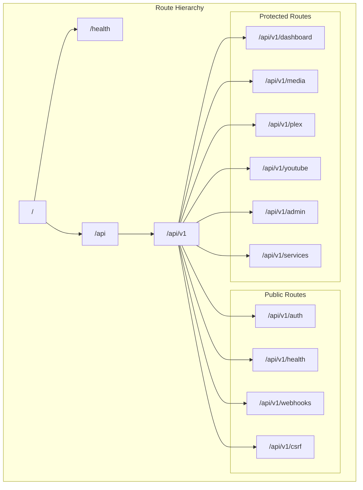
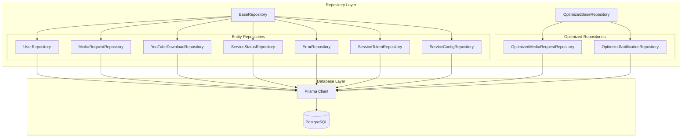
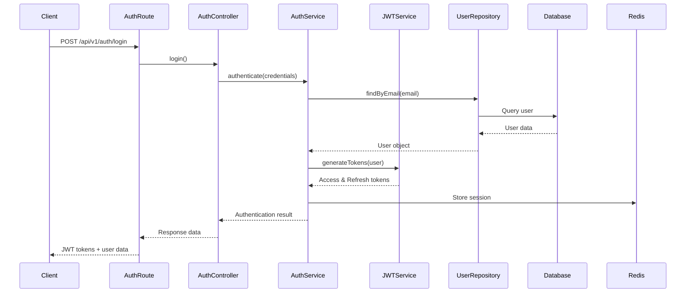
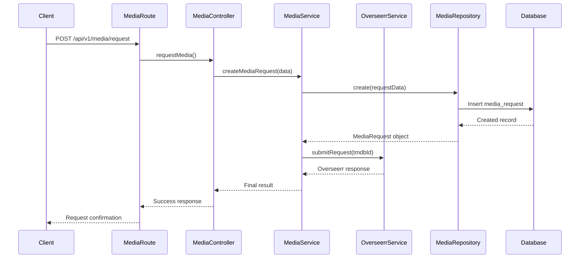
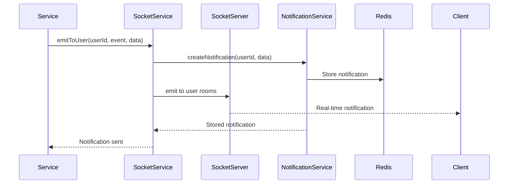

# MediaNest Component Architecture

## Overview

MediaNest follows a layered architecture pattern with clear separation of concerns between presentation, business logic, and data layers. The system is built using modern Node.js patterns with TypeScript for type safety and maintainability.

## Architecture Layers

### 1. Presentation Layer (Routes & Controllers)

#### Route Organization
Routes are organized in a hierarchical structure with versioning support:



#### Controller Architecture

```mermaid
graph TB
    subgraph "Controller Layer"
        AUTH_CTRL[AuthController]
        MEDIA_CTRL[MediaController]
        PLEX_CTRL[PlexController]
        DASHBOARD_CTRL[DashboardController]
        ADMIN_CTRL[AdminController]
        YOUTUBE_CTRL[YouTubeController]
        HEALTH_CTRL[HealthController]
    end

    subgraph "Controller Methods"
        subgraph "AuthController"
            AUTH_LOGIN[login()]
            AUTH_LOGOUT[logout()]
            AUTH_REFRESH[refreshToken()]
            AUTH_PLEX[plexAuth()]
        end
        
        subgraph "MediaController"
            MEDIA_SEARCH[searchMedia()]
            MEDIA_REQUEST[requestMedia()]
            MEDIA_DETAILS[getMediaDetails()]
            MEDIA_USER_REQ[getUserRequests()]
        end
        
        subgraph "PlexController"
            PLEX_SERVER[getServerInfo()]
            PLEX_LIBRARIES[getLibraries()]
            PLEX_SEARCH[search()]
            PLEX_RECENT[getRecentlyAdded()]
        end
        
        subgraph "DashboardController"
            DASH_STATS[getDashboardStats()]
            DASH_STATUS[getServiceStatuses()]
            DASH_NOTIF[getNotifications()]
        end
    end

    AUTH_CTRL --> AUTH_LOGIN
    AUTH_CTRL --> AUTH_LOGOUT
    AUTH_CTRL --> AUTH_REFRESH
    AUTH_CTRL --> AUTH_PLEX
    
    MEDIA_CTRL --> MEDIA_SEARCH
    MEDIA_CTRL --> MEDIA_REQUEST
    MEDIA_CTRL --> MEDIA_DETAILS
    MEDIA_CTRL --> MEDIA_USER_REQ
    
    PLEX_CTRL --> PLEX_SERVER
    PLEX_CTRL --> PLEX_LIBRARIES
    PLEX_CTRL --> PLEX_SEARCH
    PLEX_CTRL --> PLEX_RECENT
    
    DASHBOARD_CTRL --> DASH_STATS
    DASHBOARD_CTRL --> DASH_STATUS
    DASHBOARD_CTRL --> DASH_NOTIF
```

### 2. Business Logic Layer (Services)

#### Core Services Architecture

```mermaid
graph TB
    subgraph "Service Layer"
        AUTH_SVC[AuthenticationService]
        PLEX_SVC[PlexService]
        MEDIA_SVC[MediaService]
        CACHE_SVC[CacheService]
        NOTIF_SVC[NotificationService]
        YOUTUBE_SVC[YouTubeService]
        HEALTH_SVC[HealthMonitorService]
        ENCRYPTION_SVC[EncryptionService]
        WEBHOOK_SVC[WebhookIntegrationService]
    end

    subgraph "Service Dependencies"
        JWT_SVC[JWTService]
        REDIS_SVC[RedisService]
        SESSION_SVC[SessionAnalyticsService]
        DEVICE_SVC[DeviceSessionService]
        PASSWORD_SVC[PasswordResetService]
        TWO_FACTOR_SVC[TwoFactorService]
        OAUTH_SVC[OAuthProvidersService]
    end

    subgraph "Integration Services"
        OVERSEERR_SVC[OverseerrService]
        PLEX_AUTH_SVC[PlexAuthService]
        API_HEALTH_SVC[APIHealthMonitorService]
        SERVICE_MONITOR_SVC[ServiceMonitoringDatabaseService]
        RESILIENCE_SVC[ResilienceService]
    end

    AUTH_SVC --> JWT_SVC
    AUTH_SVC --> SESSION_SVC
    AUTH_SVC --> DEVICE_SVC
    AUTH_SVC --> PASSWORD_SVC
    AUTH_SVC --> TWO_FACTOR_SVC
    AUTH_SVC --> OAUTH_SVC
    
    PLEX_SVC --> PLEX_AUTH_SVC
    MEDIA_SVC --> OVERSEERR_SVC
    HEALTH_SVC --> API_HEALTH_SVC
    HEALTH_SVC --> SERVICE_MONITOR_SVC
    
    CACHE_SVC --> REDIS_SVC
    NOTIF_SVC --> REDIS_SVC
```



### 3. Data Access Layer (Repositories)

#### Repository Pattern Implementation



### 4. Middleware Architecture

#### Middleware Stack

```mermaid
graph LR
    subgraph "Request Processing Pipeline"
        REQUEST[HTTP Request]
        
        subgraph "Security Middleware"
            CORS_MW[CORS]
            HELMET_MW[Helmet Security]
            RATE_LIMIT_MW[Rate Limiting]
        end
        
        subgraph "Authentication Middleware"
            AUTH_MW[Authentication]
            TOKEN_VALIDATOR[Token Validator]
            USER_VALIDATOR[User Validator]
            DEVICE_SESSION[Device Session]
        end
        
        subgraph "Request Processing"
            VALIDATION_MW[Request Validation]
            COMPRESSION_MW[Compression]
            PERFORMANCE_MW[Performance Monitoring]
            CORRELATION_MW[Correlation ID]
        end
        
        subgraph "Response Middleware"
            CACHE_HEADERS[Cache Headers]
            ERROR_HANDLING[Error Handling]
            METRICS_MW[Metrics Collection]
        end
        
        CONTROLLER[Controller]
        RESPONSE[HTTP Response]
    end

    REQUEST --> CORS_MW
    CORS_MW --> HELMET_MW
    HELMET_MW --> RATE_LIMIT_MW
    RATE_LIMIT_MW --> AUTH_MW
    AUTH_MW --> TOKEN_VALIDATOR
    TOKEN_VALIDATOR --> USER_VALIDATOR
    USER_VALIDATOR --> DEVICE_SESSION
    DEVICE_SESSION --> VALIDATION_MW
    VALIDATION_MW --> COMPRESSION_MW
    COMPRESSION_MW --> PERFORMANCE_MW
    PERFORMANCE_MW --> CORRELATION_MW
    CORRELATION_MW --> CONTROLLER
    CONTROLLER --> CACHE_HEADERS
    CACHE_HEADERS --> ERROR_HANDLING
    ERROR_HANDLING --> METRICS_MW
    METRICS_MW --> RESPONSE
```



## Component Interactions

### Authentication Flow



### Media Request Flow



### Real-time Notification Flow



## Design Patterns Implemented

### 1. Repository Pattern
- **Purpose**: Abstraction layer for data access
- **Implementation**: Base repository with common CRUD operations
- **Benefits**: Testability, maintainability, and database independence

### 2. Service Layer Pattern
- **Purpose**: Business logic encapsulation
- **Implementation**: Services handle complex business operations
- **Benefits**: Separation of concerns, reusability

### 3. Middleware Pattern
- **Purpose**: Cross-cutting concerns
- **Implementation**: Express.js middleware stack
- **Benefits**: Modularity, reusability, separation of concerns

### 4. Factory Pattern
- **Purpose**: Object creation abstraction
- **Implementation**: Service and repository factories
- **Benefits**: Loose coupling, dependency injection

### 5. Observer Pattern
- **Purpose**: Event-driven architecture
- **Implementation**: Socket.IO event system
- **Benefits**: Real-time updates, loose coupling

## Performance Optimizations

### 1. Route Optimization
- Routes ordered by frequency of use
- Grouped routes with similar middleware requirements
- Cached route handlers for repeated operations

### 2. Database Optimization
- Strategic indexes on frequently queried columns
- Connection pooling with optimized parameters
- Query optimization with Prisma

### 3. Caching Strategy
- Redis for session and application-level caching
- HTTP cache headers for static responses
- Service-level caching for external API calls

### 4. Memory Management
- Optimized object creation and garbage collection
- Memory leak detection and monitoring
- Resource pooling for expensive operations

## Error Handling Strategy

### 1. Centralized Error Handling
- Global error middleware for consistent error responses
- Structured error logging with correlation IDs
- Error categorization and severity levels

### 2. Graceful Degradation
- Circuit breakers for external service failures
- Fallback mechanisms for critical operations
- Health checks with dependency validation

### 3. Monitoring and Alerting
- Real-time error tracking with Sentry
- Performance metrics with Prometheus
- Custom business metrics for key operations