# MediaNest Component Architecture

## Overview

MediaNest follows a layered architecture pattern with clear separation of concerns between presentation, business logic, and data layers. The system is built using modern Node.js patterns with TypeScript for type safety and maintainability.

## Architecture Layers

### 1. Presentation Layer (Routes & Controllers)

#### Route Organization
Routes are organized in a hierarchical structure with versioning support:

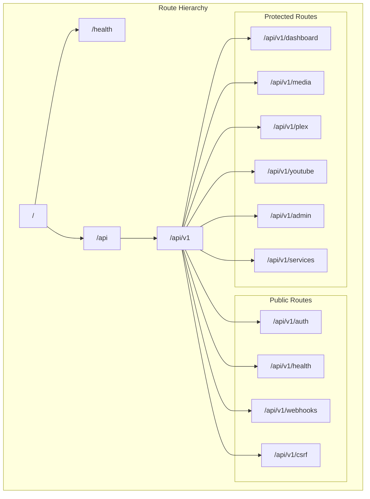

#### Controller Architecture

```mermaid
graph TB
    subgraph "Controller Layer"
        AUTH_CTRL[AuthController]
        MEDIA_CTRL[MediaController]
        PLEX_CTRL[PlexController]
        DASHBOARD_CTRL[DashboardController]
        ADMIN_CTRL[AdminController]
        YOUTUBE_CTRL[YouTubeController]
        HEALTH_CTRL[HealthController]
    end

    subgraph "Controller Methods"
        subgraph "AuthController"
            AUTH_LOGIN[login()]
            AUTH_LOGOUT[logout()]
            AUTH_REFRESH[refreshToken()]
            AUTH_PLEX[plexAuth()]
        end
        
        subgraph "MediaController"
            MEDIA_SEARCH[searchMedia()]
            MEDIA_REQUEST[requestMedia()]
            MEDIA_DETAILS[getMediaDetails()]
            MEDIA_USER_REQ[getUserRequests()]
        end
        
        subgraph "PlexController"
            PLEX_SERVER[getServerInfo()]
            PLEX_LIBRARIES[getLibraries()]
            PLEX_SEARCH[search()]
            PLEX_RECENT[getRecentlyAdded()]
        end
        
        subgraph "DashboardController"
            DASH_STATS[getDashboardStats()]
            DASH_STATUS[getServiceStatuses()]
            DASH_NOTIF[getNotifications()]
        end
    end

    AUTH_CTRL --> AUTH_LOGIN
    AUTH_CTRL --> AUTH_LOGOUT
    AUTH_CTRL --> AUTH_REFRESH
    AUTH_CTRL --> AUTH_PLEX
    
    MEDIA_CTRL --> MEDIA_SEARCH
    MEDIA_CTRL --> MEDIA_REQUEST
    MEDIA_CTRL --> MEDIA_DETAILS
    MEDIA_CTRL --> MEDIA_USER_REQ
    
    PLEX_CTRL --> PLEX_SERVER
    PLEX_CTRL --> PLEX_LIBRARIES
    PLEX_CTRL --> PLEX_SEARCH
    PLEX_CTRL --> PLEX_RECENT
    
    DASHBOARD_CTRL --> DASH_STATS
    DASHBOARD_CTRL --> DASH_STATUS
    DASHBOARD_CTRL --> DASH_NOTIF
```

### 2. Business Logic Layer (Services)

#### Core Services Architecture

```mermaid
graph TB
    subgraph "Service Layer"
        AUTH_SVC[AuthenticationService]
        PLEX_SVC[PlexService]
        MEDIA_SVC[MediaService]
        CACHE_SVC[CacheService]
        NOTIF_SVC[NotificationService]
        YOUTUBE_SVC[YouTubeService]
        HEALTH_SVC[HealthMonitorService]
        ENCRYPTION_SVC[EncryptionService]
        WEBHOOK_SVC[WebhookIntegrationService]
    end

    subgraph "Service Dependencies"
        JWT_SVC[JWTService]
        REDIS_SVC[RedisService]
        SESSION_SVC[SessionAnalyticsService]
        DEVICE_SVC[DeviceSessionService]
        PASSWORD_SVC[PasswordResetService]
        TWO_FACTOR_SVC[TwoFactorService]
        OAUTH_SVC[OAuthProvidersService]
    end

    subgraph "Integration Services"
        OVERSEERR_SVC[OverseerrService]
        PLEX_AUTH_SVC[PlexAuthService]
        API_HEALTH_SVC[APIHealthMonitorService]
        SERVICE_MONITOR_SVC[ServiceMonitoringDatabaseService]
        RESILIENCE_SVC[ResilienceService]
    end

    AUTH_SVC --> JWT_SVC
    AUTH_SVC --> SESSION_SVC
    AUTH_SVC --> DEVICE_SVC
    AUTH_SVC --> PASSWORD_SVC
    AUTH_SVC --> TWO_FACTOR_SVC
    AUTH_SVC --> OAUTH_SVC
    
    PLEX_SVC --> PLEX_AUTH_SVC
    MEDIA_SVC --> OVERSEERR_SVC
    HEALTH_SVC --> API_HEALTH_SVC
    HEALTH_SVC --> SERVICE_MONITOR_SVC
    
    CACHE_SVC --> REDIS_SVC
    NOTIF_SVC --> REDIS_SVC
```

### 3. Data Access Layer (Repositories)

#### Repository Pattern Implementation

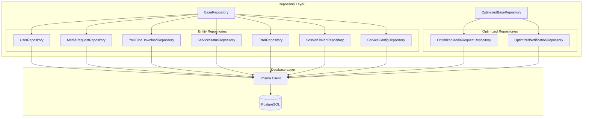

### 4. Middleware Architecture

#### Middleware Stack

```mermaid
graph LR
    subgraph "Request Processing Pipeline"
        REQUEST[HTTP Request]
        
        subgraph "Security Middleware"
            CORS_MW[CORS]
            HELMET_MW[Helmet Security]
            RATE_LIMIT_MW[Rate Limiting]
        end
        
        subgraph "Authentication Middleware"
            AUTH_MW[Authentication]
            TOKEN_VALIDATOR[Token Validator]
            USER_VALIDATOR[User Validator]
            DEVICE_SESSION[Device Session]
        end
        
        subgraph "Request Processing"
            VALIDATION_MW[Request Validation]
            COMPRESSION_MW[Compression]
            PERFORMANCE_MW[Performance Monitoring]
            CORRELATION_MW[Correlation ID]
        end
        
        subgraph "Response Middleware"
            CACHE_HEADERS[Cache Headers]
            ERROR_HANDLING[Error Handling]
            METRICS_MW[Metrics Collection]
        end
        
        CONTROLLER[Controller]
        RESPONSE[HTTP Response]
    end

    REQUEST --> CORS_MW
    CORS_MW --> HELMET_MW
    HELMET_MW --> RATE_LIMIT_MW
    RATE_LIMIT_MW --> AUTH_MW
    AUTH_MW --> TOKEN_VALIDATOR
    TOKEN_VALIDATOR --> USER_VALIDATOR
    USER_VALIDATOR --> DEVICE_SESSION
    DEVICE_SESSION --> VALIDATION_MW
    VALIDATION_MW --> COMPRESSION_MW
    COMPRESSION_MW --> PERFORMANCE_MW
    PERFORMANCE_MW --> CORRELATION_MW
    CORRELATION_MW --> CONTROLLER
    CONTROLLER --> CACHE_HEADERS
    CACHE_HEADERS --> ERROR_HANDLING
    ERROR_HANDLING --> METRICS_MW
    METRICS_MW --> RESPONSE
```

## Component Interactions

### Authentication Flow

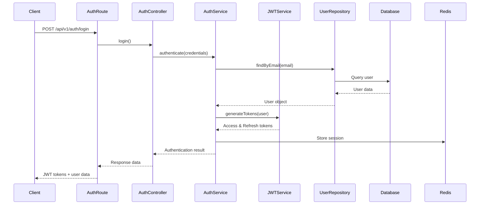

### Media Request Flow

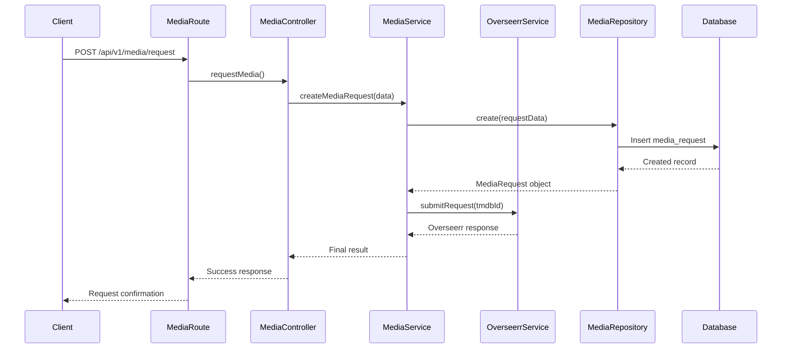

### Real-time Notification Flow

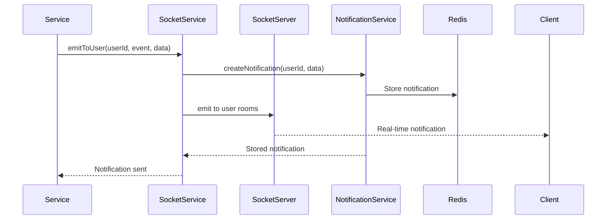

## Design Patterns Implemented

## Microservices Architecture Evolution

### Current Modular Monolith Architecture

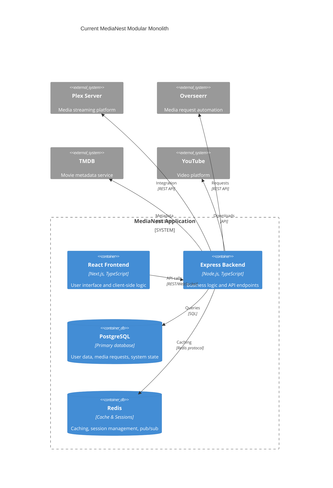

### Future Microservices Architecture

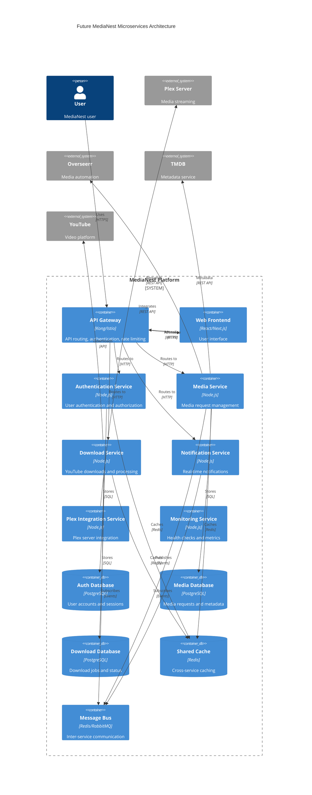

## Domain-Driven Design Architecture

### Domain Boundaries and Contexts

```mermaid
C4Container
    title MediaNest Domain Contexts

    System_Boundary(medianest, "MediaNest Platform") {
        System_Boundary(user_mgmt, "User Management Context") {
            Container(user_service, "User Service", "Node.js", "User management and profiles")
            Container(auth_service, "Authentication Service", "Node.js", "Authentication and authorization")
            ContainerDb(user_db, "User Database", "PostgreSQL", "User data and credentials")
        }
        
        System_Boundary(media_mgmt, "Media Management Context") {
            Container(media_service, "Media Service", "Node.js", "Media request lifecycle")
            Container(search_service, "Search Service", "Node.js", "Media search and discovery")
            Container(metadata_service, "Metadata Service", "Node.js", "Media metadata management")
            ContainerDb(media_db, "Media Database", "PostgreSQL", "Media requests and metadata")
        }
        
        System_Boundary(content_mgmt, "Content Management Context") {
            Container(download_service, "Download Service", "Node.js", "Content download and processing")
            Container(transcoding_service, "Transcoding Service", "Node.js", "Media transcoding and optimization")
            Container(storage_service, "Storage Service", "Node.js", "File storage and management")
            ContainerDb(content_db, "Content Database", "PostgreSQL", "Download jobs and file metadata")
        }
        
        System_Boundary(integration_mgmt, "Integration Management Context") {
            Container(plex_service, "Plex Service", "Node.js", "Plex server integration")
            Container(overseerr_service, "Overseerr Service", "Node.js", "Overseerr integration")
            Container(webhook_service, "Webhook Service", "Node.js", "Webhook processing")
            ContainerDb(integration_db, "Integration Database", "PostgreSQL", "Integration configurations")
        }
        
        System_Boundary(notification_mgmt, "Notification Context") {
            Container(notification_service, "Notification Service", "Node.js", "Real-time notifications")
            Container(email_service, "Email Service", "Node.js", "Email notifications")
            Container(push_service, "Push Service", "Node.js", "Push notifications")
            ContainerDb(notification_db, "Notification Database", "PostgreSQL", "Notification history")
        }
        
        System_Boundary(monitoring_mgmt, "Monitoring Context") {
            Container(health_service, "Health Service", "Node.js", "System health monitoring")
            Container(metrics_service, "Metrics Service", "Node.js", "Performance metrics")
            Container(audit_service, "Audit Service", "Node.js", "Audit logging and compliance")
            ContainerDb(monitoring_db, "Monitoring Database", "PostgreSQL", "Metrics and audit logs")
        }
        
        Container(api_gateway, "API Gateway", "Kong/Istio", "Request routing and cross-cutting concerns")
        Container(event_bus, "Event Bus", "Redis/Kafka", "Domain event communication")
        ContainerDb(shared_cache, "Shared Cache", "Redis", "Cross-domain caching")
    }

    %% API Gateway connections
    Rel(api_gateway, user_service, "Routes to", "HTTP")
    Rel(api_gateway, auth_service, "Routes to", "HTTP")
    Rel(api_gateway, media_service, "Routes to", "HTTP")
    Rel(api_gateway, download_service, "Routes to", "HTTP")
    Rel(api_gateway, notification_service, "Routes to", "HTTP")
    
    %% Event Bus connections
    Rel(media_service, event_bus, "Publishes events", "Async")
    Rel(download_service, event_bus, "Subscribes to events", "Async")
    Rel(notification_service, event_bus, "Subscribes to events", "Async")
    Rel(audit_service, event_bus, "Subscribes to events", "Async")
    
    %% Shared Cache connections
    Rel(auth_service, shared_cache, "Session caching", "Redis")
    Rel(media_service, shared_cache, "Metadata caching", "Redis")
    Rel(search_service, shared_cache, "Search results caching", "Redis")

    UpdateLayoutConfig($c4ShapeInRow="2", $c4BoundaryInRow="1")
```

### Aggregate Design Patterns

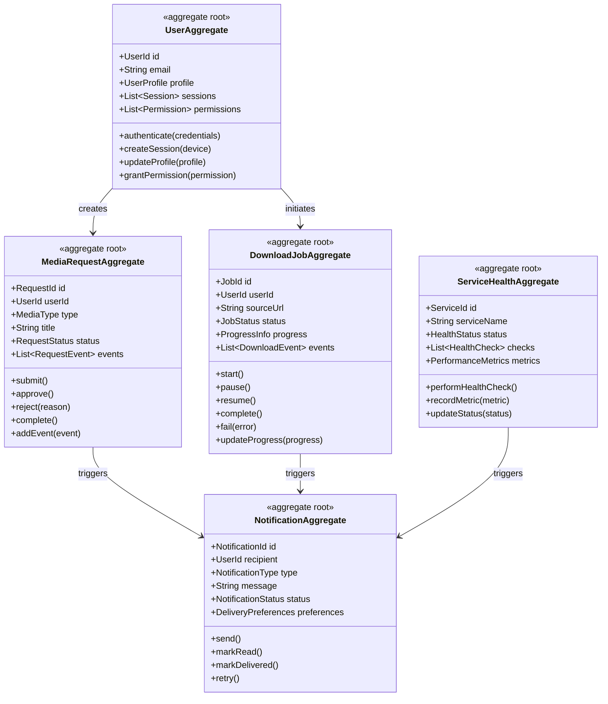

## Advanced Component Patterns

### 1. Repository Pattern Enhancement
- **Purpose**: Abstraction layer for data access with domain-specific operations
- **Implementation**: Base repository with specialized repositories for each aggregate
- **Benefits**: Testability, maintainability, and database independence with domain context

### 2. Domain Service Pattern
- **Purpose**: Complex business logic that doesn't belong to a single aggregate
- **Implementation**: Domain services coordinate between aggregates and enforce business rules
- **Benefits**: Clear domain modeling, business rule enforcement, testable business logic
- **Examples**: MediaRequestWorkflow, DownloadOrchestrator, NotificationRouter

### 3. Hexagonal Architecture Pattern
- **Purpose**: Isolate core business logic from external concerns
- **Implementation**: 
  - **Ports**: Interfaces defining how the application interacts with the outside world
  - **Adapters**: Implementations that connect ports to external systems
  - **Core Domain**: Business logic isolated from infrastructure concerns
- **Benefits**: Framework independence, testability, flexibility

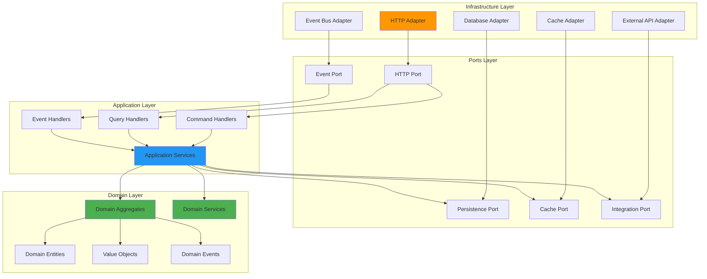

### 4. CQRS (Command Query Responsibility Segregation) Pattern
- **Purpose**: Separate read and write operations for optimal performance and scalability
- **Implementation**: 
  - **Commands**: Handle write operations and business logic
  - **Queries**: Handle read operations with optimized data structures
  - **Event Sourcing**: Optional pattern for complete audit trail
- **Benefits**: Performance optimization, scalability, maintainability

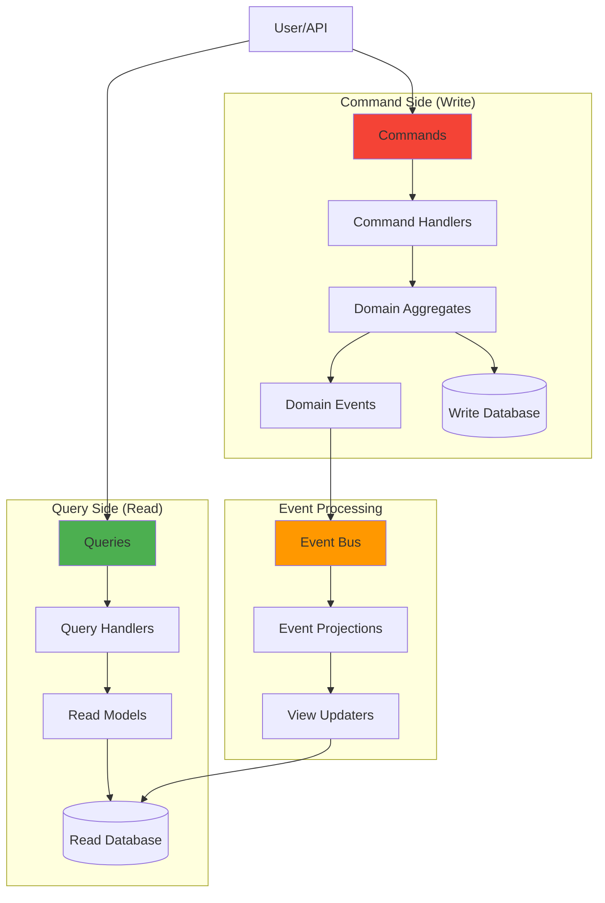

### 5. Event Sourcing Pattern
- **Purpose**: Store all changes as a sequence of events for complete audit trail
- **Implementation**: 
  - **Event Store**: Append-only store of domain events
  - **Event Streams**: Ordered sequences of events for each aggregate
  - **Snapshots**: Performance optimization for aggregate reconstruction
- **Benefits**: Complete audit trail, temporal queries, replay capability

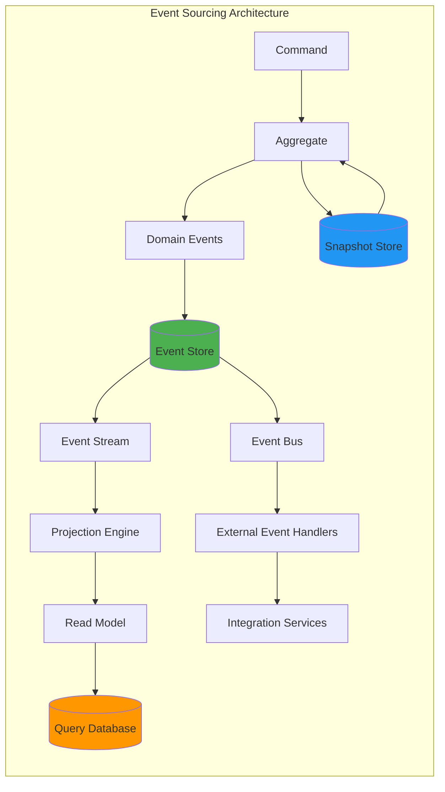

## Advanced Performance Architecture

### 1. Performance-First Design Principles

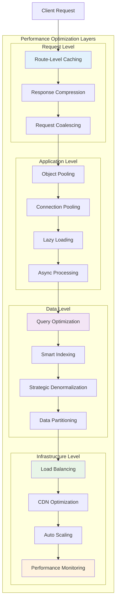

#### Route Optimization Strategies
- **Frequency-Based Ordering**: Routes ordered by usage analytics
- **Middleware Grouping**: Similar security/validation requirements grouped
- **Handler Caching**: Pre-compiled route handlers for repeated operations
- **Path Optimization**: Efficient path matching with prefix trees

#### Database Performance Architecture

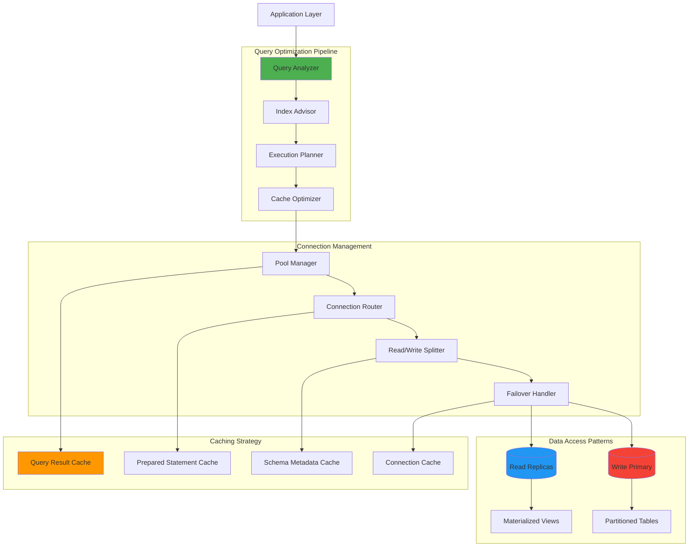

#### Advanced Caching Architecture

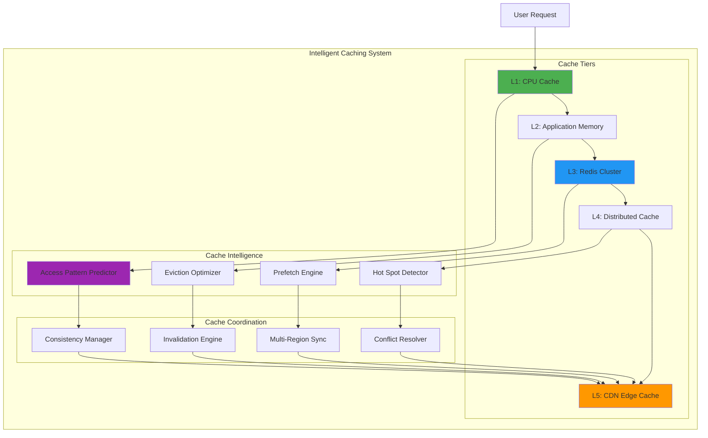

#### Memory Management and Resource Optimization

```mermaid
flowchart LR
    subgraph "Memory Management System"
        subgraph "Allocation Strategies"
            OBJECT_POOL[Object Pooling]
            BUFFER_POOL[Buffer Pooling]
            CONNECTION_POOL[Connection Pooling]
            THREAD_POOL[Worker Thread Pool]
        end
        
        subgraph "Garbage Collection Optimization"
            GC_MONITOR[GC Monitor]
            GC_TUNER[GC Tuner]
            HEAP_ANALYZER[Heap Analyzer]
            LEAK_DETECTOR[Memory Leak Detector]
        end
        
        subgraph "Resource Monitoring"
            MEMORY_PROFILER[Memory Profiler]
            ALLOCATION_TRACKER[Allocation Tracker]
            USAGE_ANALYZER[Usage Pattern Analyzer]
            THRESHOLD_MANAGER[Threshold Manager]
        end
        
        subgraph "Optimization Engine"
            SMART_ALLOCATOR[Smart Allocator]
            COMPACTION_ENGINE[Memory Compaction]
            RESOURCE_SCHEDULER[Resource Scheduler]
            PERFORMANCE_OPTIMIZER[Performance Optimizer]
        end
    end
    
    APP_REQUESTS[Application Requests] --> OBJECT_POOL
    OBJECT_POOL --> BUFFER_POOL
    BUFFER_POOL --> CONNECTION_POOL
    CONNECTION_POOL --> THREAD_POOL
    
    THREAD_POOL --> GC_MONITOR
    GC_MONITOR --> GC_TUNER
    GC_TUNER --> HEAP_ANALYZER
    HEAP_ANALYZER --> LEAK_DETECTOR
    
    LEAK_DETECTOR --> MEMORY_PROFILER
    MEMORY_PROFILER --> ALLOCATION_TRACKER
    ALLOCATION_TRACKER --> USAGE_ANALYZER
    USAGE_ANALYZER --> THRESHOLD_MANAGER
    
    THRESHOLD_MANAGER --> SMART_ALLOCATOR
    SMART_ALLOCATOR --> COMPACTION_ENGINE
    COMPACTION_ENGINE --> RESOURCE_SCHEDULER
    RESOURCE_SCHEDULER --> PERFORMANCE_OPTIMIZER
    
    style OBJECT_POOL fill:#4caf50
    style GC_MONITOR fill:#2196f3
    style MEMORY_PROFILER fill:#ff9800
    style SMART_ALLOCATOR fill:#9c27b0
```

## Error Handling Strategy

### 1. Centralized Error Handling
- Global error middleware for consistent error responses
- Structured error logging with correlation IDs
- Error categorization and severity levels

### 2. Graceful Degradation
- Circuit breakers for external service failures
- Fallback mechanisms for critical operations
- Health checks with dependency validation

### 3. Monitoring and Alerting
- Real-time error tracking with Sentry
- Performance metrics with Prometheus
- Custom business metrics for key operations