# MediaNest Data Flow Architecture

## Overview

This document details the data flow patterns within MediaNest, showing how information moves through the system layers, from client requests to database operations and real-time notifications.

## Core Data Flow Patterns

### 1. Request Processing Pipeline

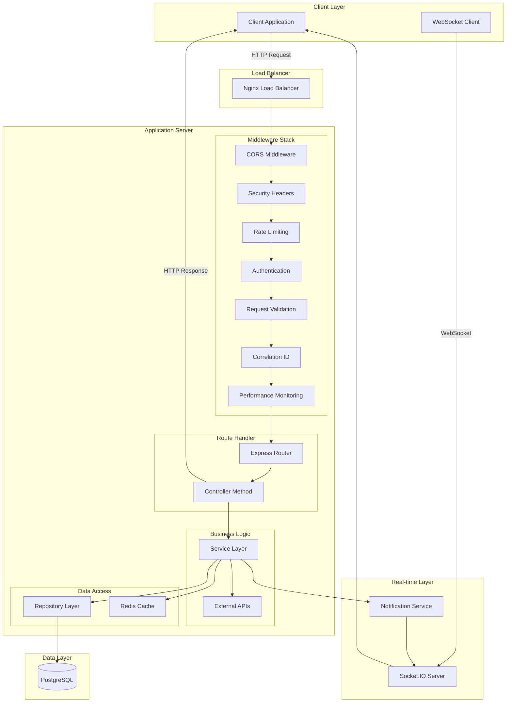

### 2. Authentication Data Flow

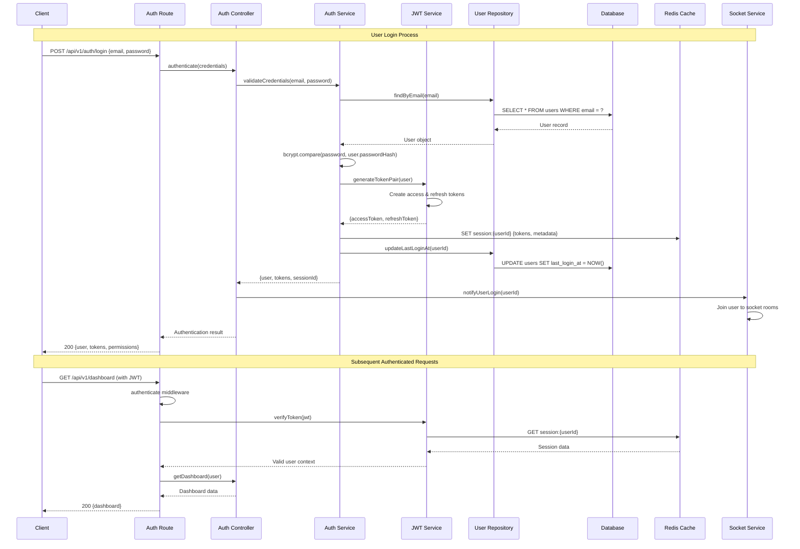

### 3. Media Request Data Flow

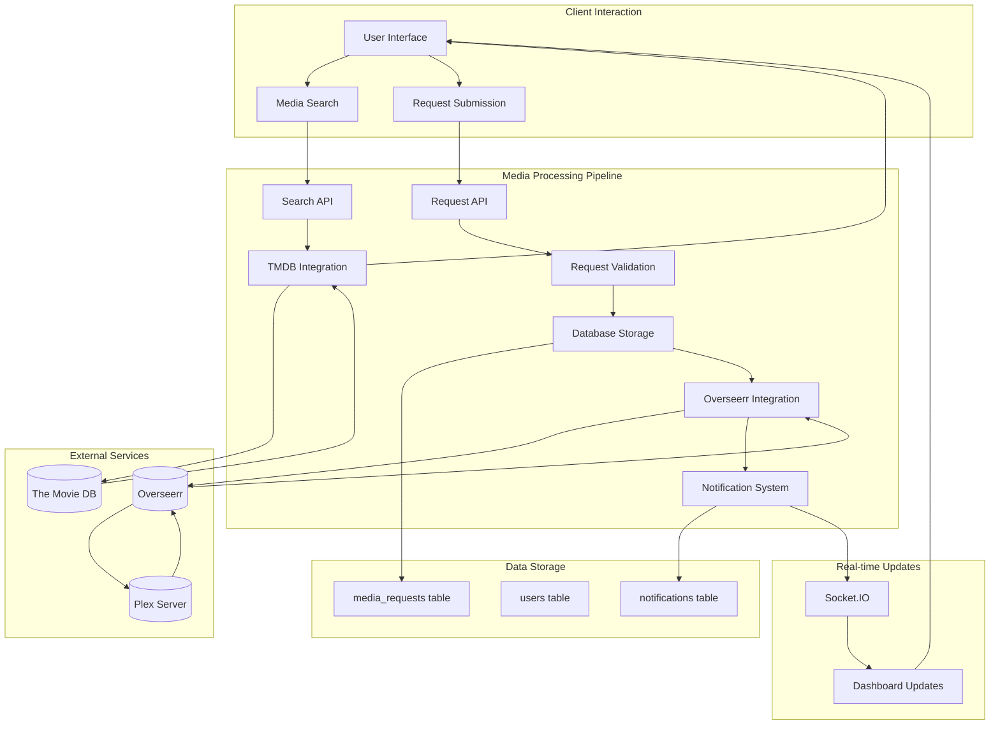

### 4. Real-time Notification Data Flow

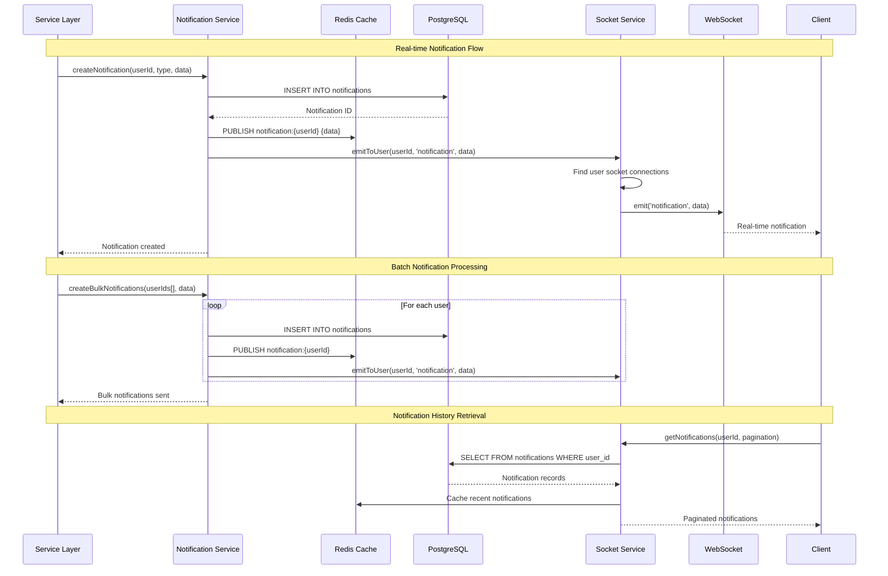

### 5. YouTube Download Data Flow

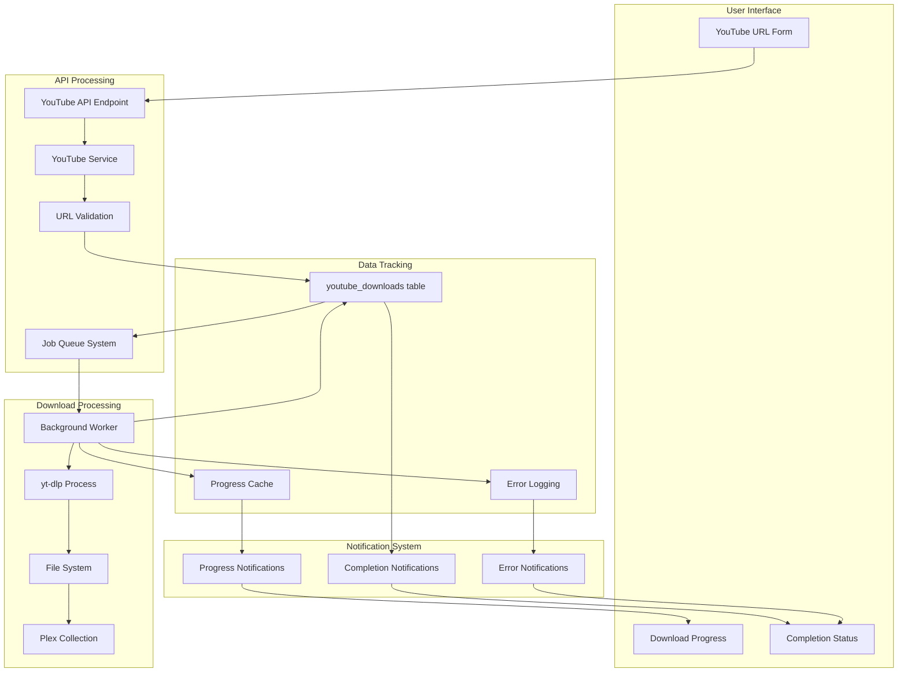

## Database Transaction Patterns

### 1. User Authentication Transactions

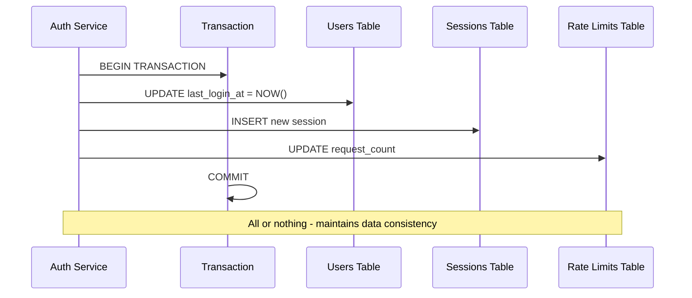

### 2. Media Request Transactions

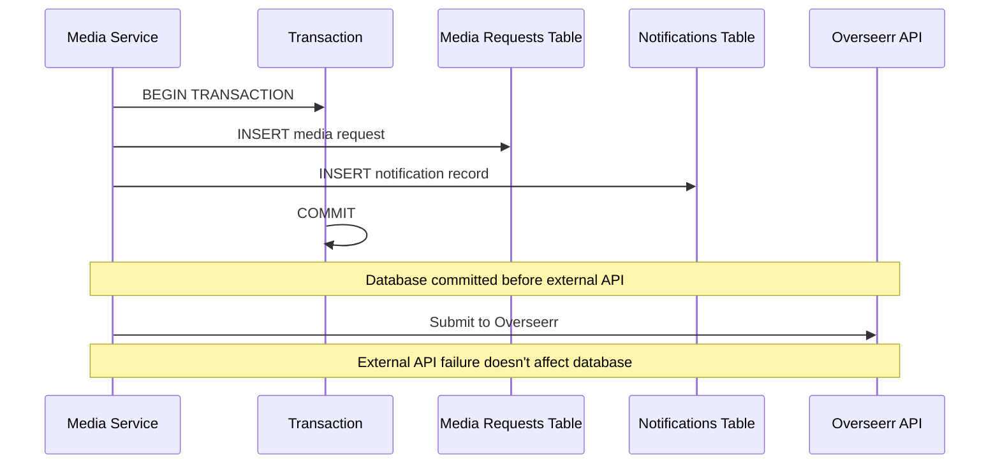

## Caching Strategy Data Flow

### 1. Multi-level Caching

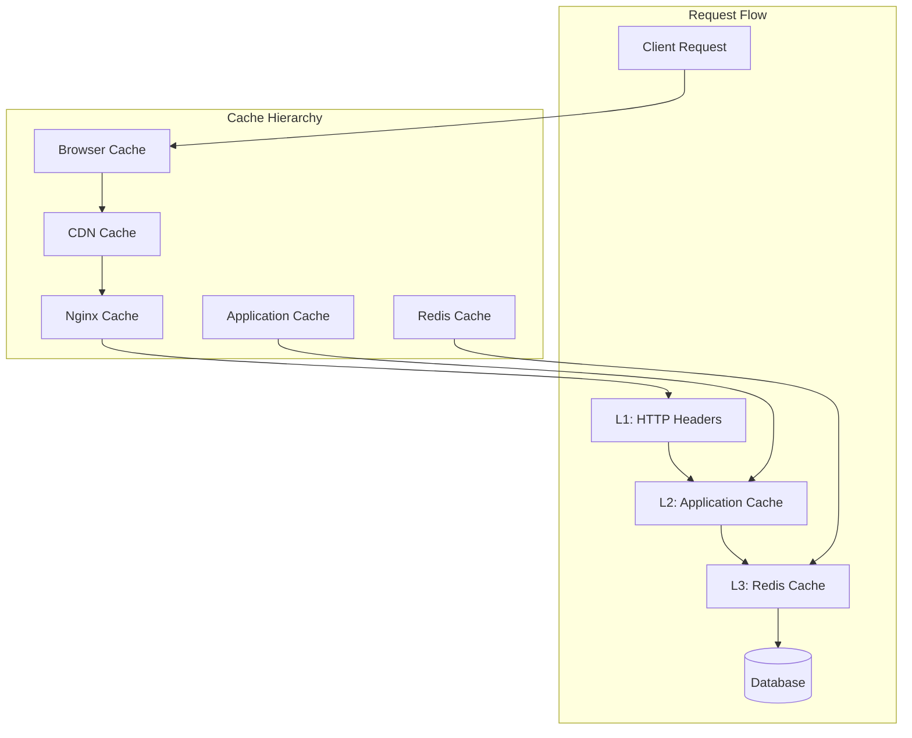

### 2. Cache Invalidation Patterns

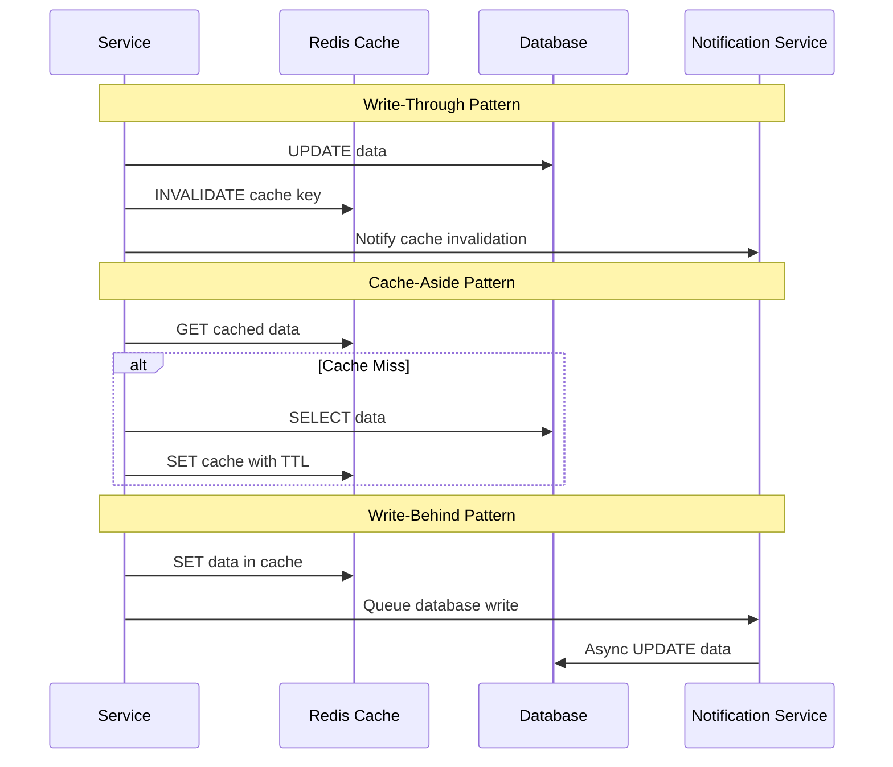

## Error Handling Data Flow

### 1. Error Propagation

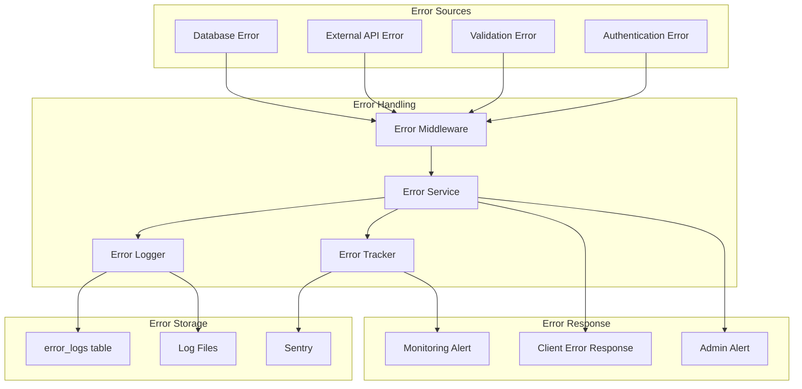

### 2. Circuit Breaker Pattern

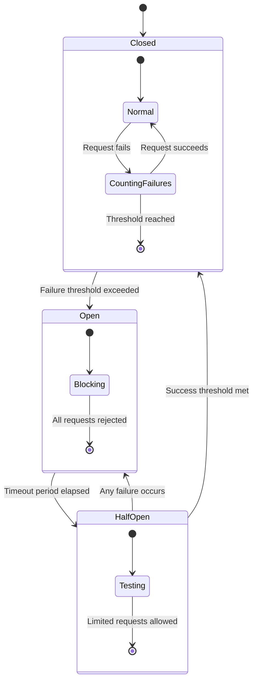

## Performance Monitoring Data Flow

### 1. Metrics Collection

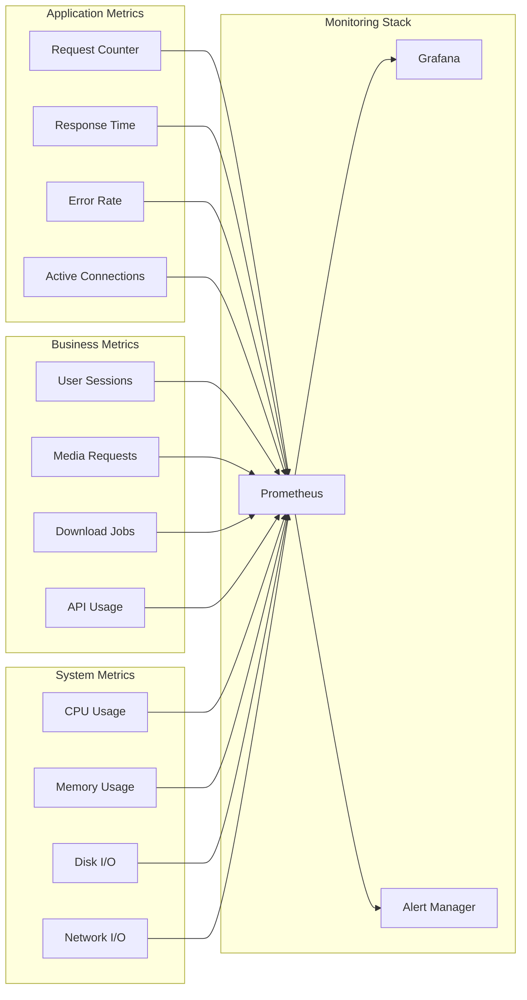

## Data Consistency Patterns

### 1. Eventual Consistency for External APIs

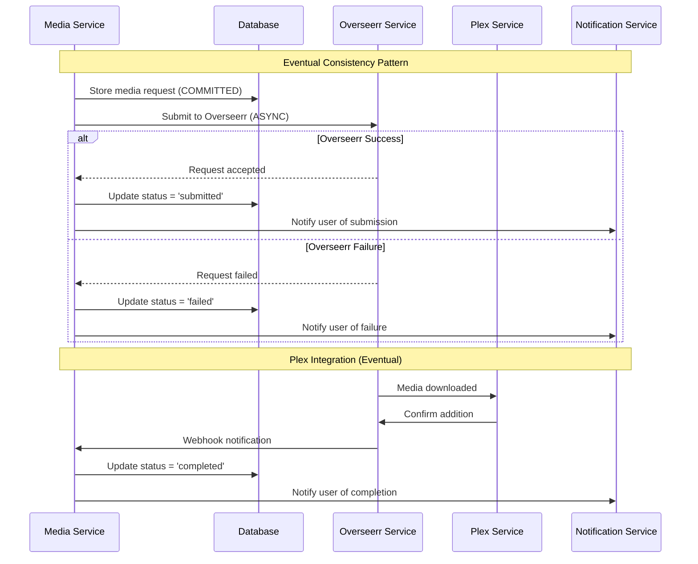

### 2. Strong Consistency for Critical Operations

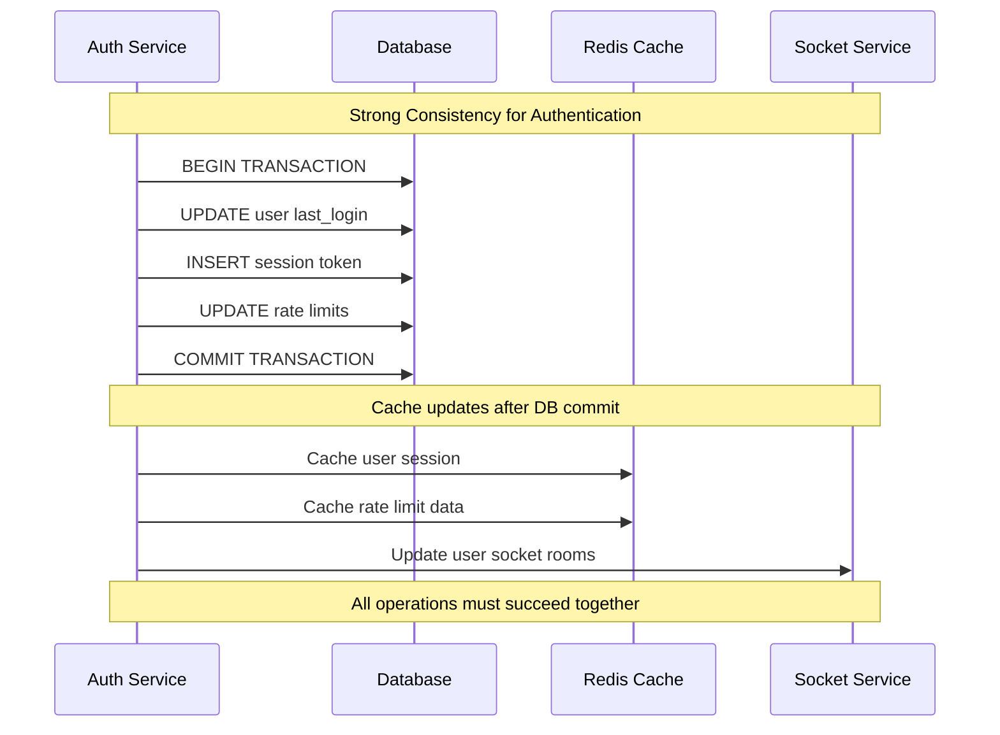