# MediaNest Data Flow Architecture

## Overview

This document details the data flow patterns within MediaNest, showing how information moves through the system layers, from client requests to database operations and real-time notifications.

## Core Data Flow Patterns

### 1. Enhanced Request Processing Pipeline

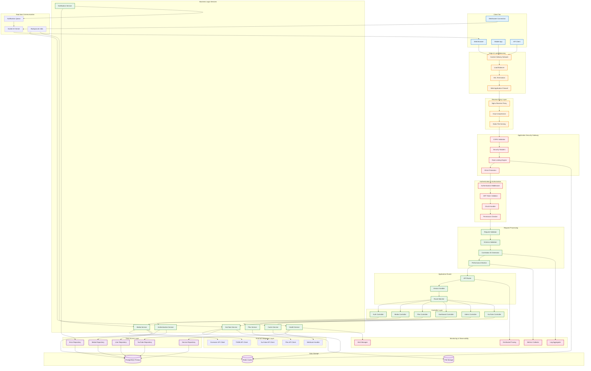

### 2. Authentication Data Flow

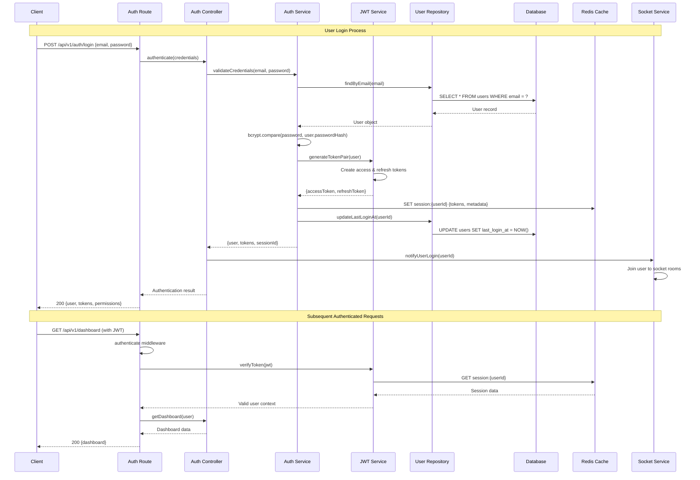

### 3. Media Request Data Flow

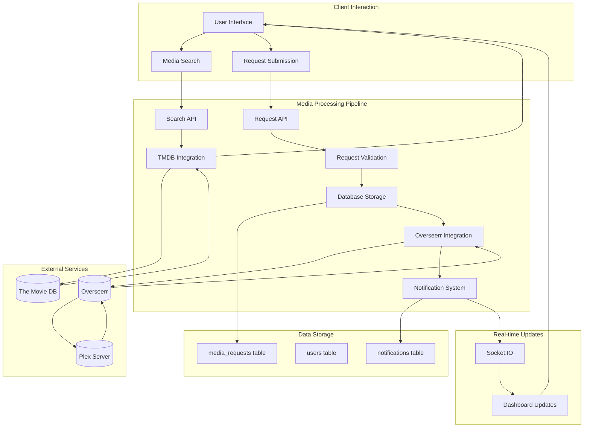

### 4. Real-time Notification Data Flow

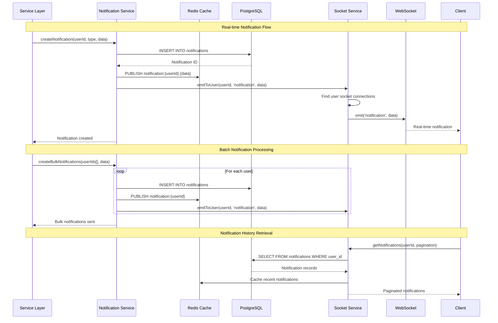

### 5. Enhanced YouTube Download Workflow

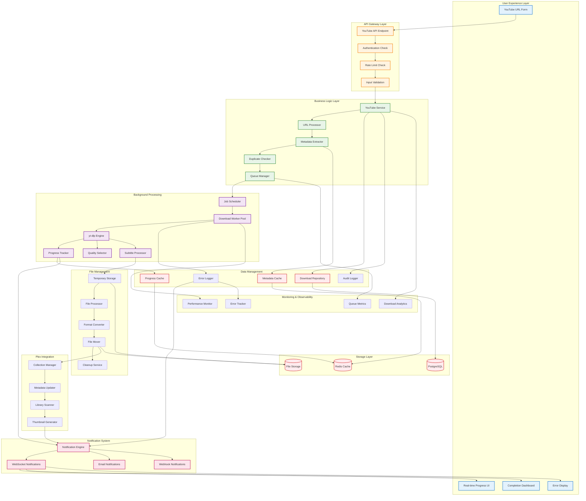

## Database Transaction Patterns

### 1. User Authentication Transactions

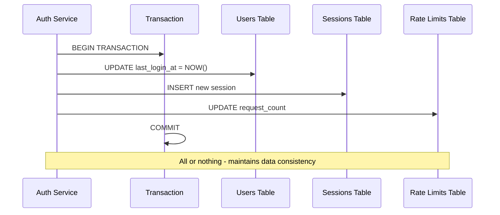

### 2. Media Request Transactions

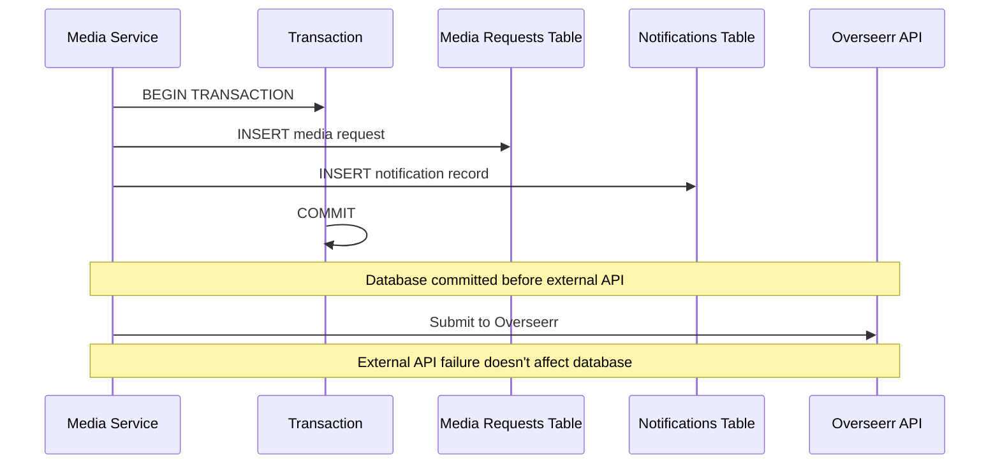

## Advanced Caching Strategy

### 1. Multi-Tier Caching Architecture

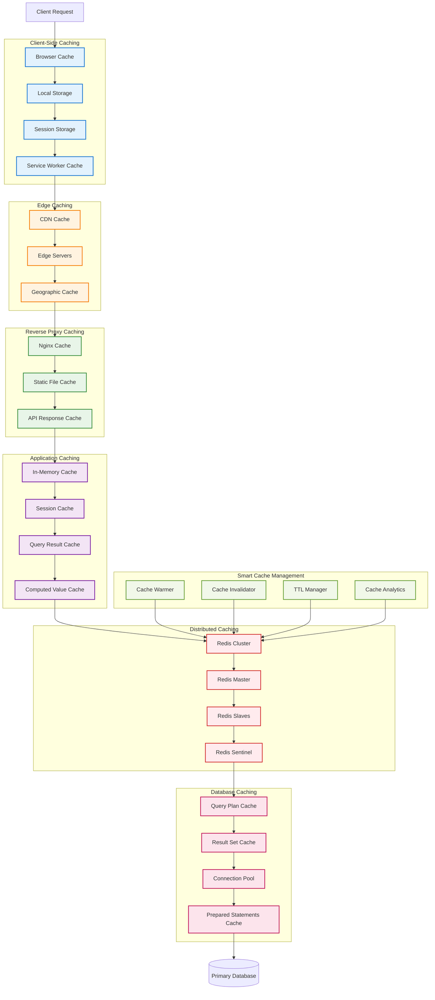

### 2. Intelligent Cache Invalidation System

```mermaid
flowchart TD
    subgraph "Cache Invalidation Triggers"
        DATA_CHANGE[Data Change Event]
        USER_ACTION[User Action]
        SCHEDULED_JOB[Scheduled Job]
        EXTERNAL_EVENT[External Event]
        MANUAL_TRIGGER[Manual Trigger]
    end

    subgraph "Invalidation Strategy Engine"
        STRATEGY_SELECTOR[Strategy Selector]
        PATTERN_MATCHER[Pattern Matcher]
        DEPENDENCY_ANALYZER[Dependency Analyzer]
        IMPACT_CALCULATOR[Impact Calculator]
    end

    subgraph "Invalidation Patterns"
        IMMEDIATE[Immediate Invalidation]
        LAZY[Lazy Invalidation]
        WRITE_THROUGH[Write-Through]
        WRITE_BEHIND[Write-Behind]
        WRITE_AROUND[Write-Around]
        REFRESH_AHEAD[Refresh-Ahead]
    end

    subgraph "Cache Layers"
        L1_BROWSER[Browser Cache]
        L2_CDN[CDN Cache]
        L3_NGINX[Nginx Cache]
        L4_APP[Application Cache]
        L5_REDIS[Redis Cache]
        L6_DB[Database Cache]
    end

    subgraph "Invalidation Mechanisms"
        TAG_BASED[Tag-Based Invalidation]
        TIME_BASED[Time-Based (TTL)]
        EVENT_BASED[Event-Based]
        DEPENDENCY_BASED[Dependency-Based]
        MANUAL_PURGE[Manual Purge]
    end

    subgraph "Notification System"
        CACHE_EVENTS[Cache Events]
        PUB_SUB[Pub/Sub System]
        WEBHOOK_NOTIF[Webhook Notifications]
        REAL_TIME_UPDATES[Real-time Updates]
    end

    subgraph "Monitoring & Analytics"
        HIT_RATE_MONITOR[Hit Rate Monitor]
        MISS_ANALYZER[Miss Analyzer]
        PERFORMANCE_TRACKER[Performance Tracker]
        COST_OPTIMIZER[Cost Optimizer]
    end

    %% Trigger Flow
    DATA_CHANGE --> STRATEGY_SELECTOR
    USER_ACTION --> STRATEGY_SELECTOR
    SCHEDULED_JOB --> STRATEGY_SELECTOR
    EXTERNAL_EVENT --> STRATEGY_SELECTOR
    MANUAL_TRIGGER --> STRATEGY_SELECTOR

    %% Strategy Selection
    STRATEGY_SELECTOR --> PATTERN_MATCHER
    PATTERN_MATCHER --> DEPENDENCY_ANALYZER
    DEPENDENCY_ANALYZER --> IMPACT_CALCULATOR

    %% Pattern Application
    IMPACT_CALCULATOR --> IMMEDIATE
    IMPACT_CALCULATOR --> LAZY
    IMPACT_CALCULATOR --> WRITE_THROUGH
    IMPACT_CALCULATOR --> WRITE_BEHIND
    IMPACT_CALCULATOR --> WRITE_AROUND
    IMPACT_CALCULATOR --> REFRESH_AHEAD

    %% Cache Layer Invalidation
    IMMEDIATE --> L1_BROWSER
    LAZY --> L2_CDN
    WRITE_THROUGH --> L3_NGINX
    WRITE_BEHIND --> L4_APP
    WRITE_AROUND --> L5_REDIS
    REFRESH_AHEAD --> L6_DB

    %% Mechanism Application
    L1_BROWSER --> TAG_BASED
    L2_CDN --> TIME_BASED
    L3_NGINX --> EVENT_BASED
    L4_APP --> DEPENDENCY_BASED
    L5_REDIS --> MANUAL_PURGE

    %% Notification Flow
    TAG_BASED --> CACHE_EVENTS
    TIME_BASED --> PUB_SUB
    EVENT_BASED --> WEBHOOK_NOTIF
    DEPENDENCY_BASED --> REAL_TIME_UPDATES

    %% Monitoring
    L1_BROWSER --> HIT_RATE_MONITOR
    L2_CDN --> MISS_ANALYZER
    L3_NGINX --> PERFORMANCE_TRACKER
    L4_APP --> COST_OPTIMIZER

    classDef trigger fill:#e3f2fd,stroke:#1976d2,stroke-width:2px
    classDef strategy fill:#fff3e0,stroke:#f57c00,stroke-width:2px
    classDef pattern fill:#e8f5e8,stroke:#388e3c,stroke-width:2px
    classDef cache fill:#f3e5f5,stroke:#7b1fa2,stroke-width:2px
    classDef mechanism fill:#ffebee,stroke:#d32f2f,stroke-width:2px
    classDef notification fill:#fce4ec,stroke:#c2185b,stroke-width:2px
    classDef monitoring fill:#f1f8e9,stroke:#689f38,stroke-width:2px

    class DATA_CHANGE,USER_ACTION,SCHEDULED_JOB,EXTERNAL_EVENT,MANUAL_TRIGGER trigger
    class STRATEGY_SELECTOR,PATTERN_MATCHER,DEPENDENCY_ANALYZER,IMPACT_CALCULATOR strategy
    class IMMEDIATE,LAZY,WRITE_THROUGH,WRITE_BEHIND,WRITE_AROUND,REFRESH_AHEAD pattern
    class L1_BROWSER,L2_CDN,L3_NGINX,L4_APP,L5_REDIS,L6_DB cache
    class TAG_BASED,TIME_BASED,EVENT_BASED,DEPENDENCY_BASED,MANUAL_PURGE mechanism
    class CACHE_EVENTS,PUB_SUB,WEBHOOK_NOTIF,REAL_TIME_UPDATES notification
    class HIT_RATE_MONITOR,MISS_ANALYZER,PERFORMANCE_TRACKER,COST_OPTIMIZER monitoring
```

## Error Handling Data Flow

### 1. Error Propagation

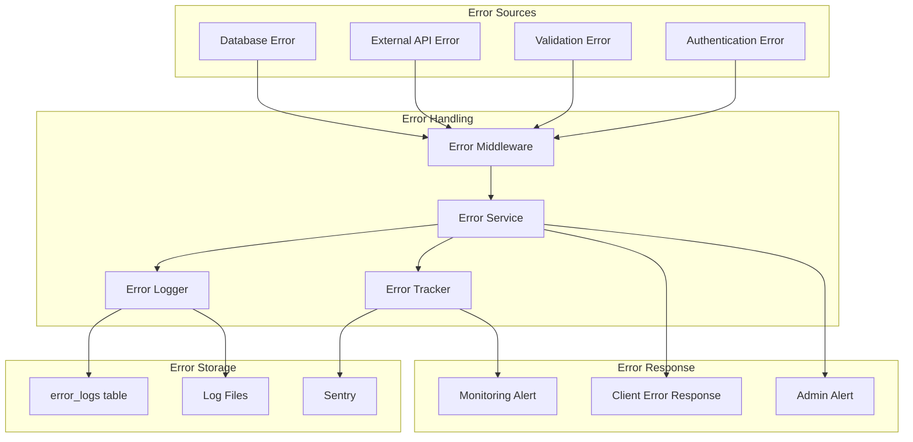

### 2. Circuit Breaker Pattern

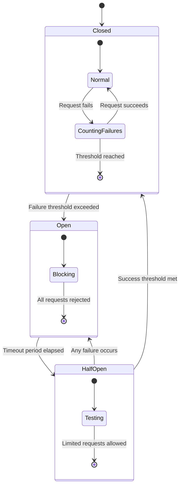

## Performance Monitoring Data Flow

### 1. Metrics Collection

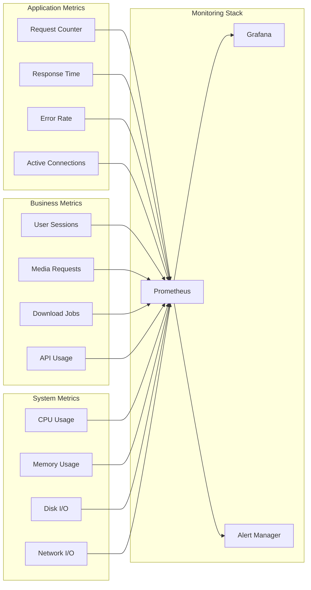

## Advanced Data Flow Patterns

### 1. Event-Driven Architecture Pattern

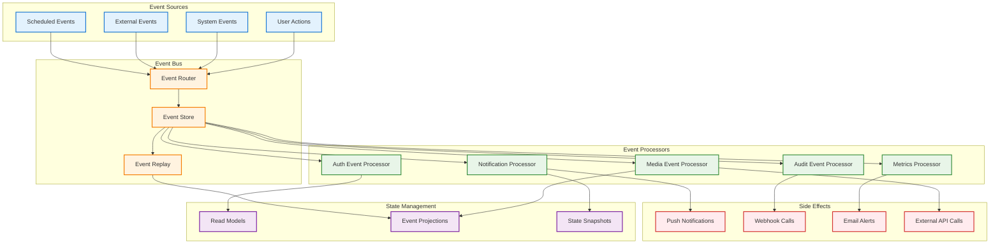

### 2. CQRS (Command Query Responsibility Segregation) Pattern

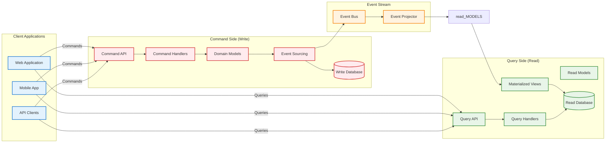

## Data Consistency Patterns

### 1. Eventual Consistency for External APIs

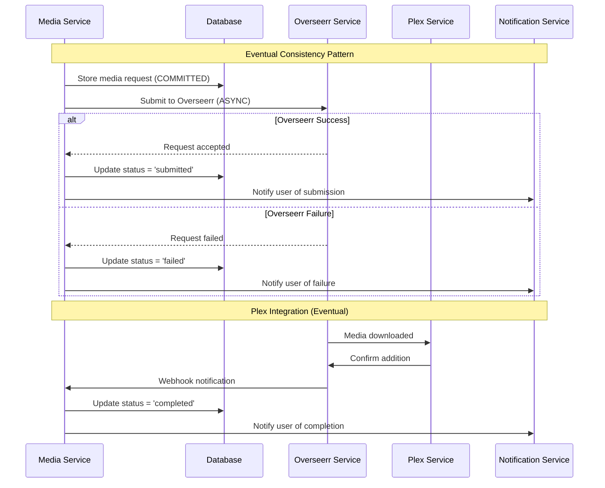

### 2. Strong Consistency for Critical Operations

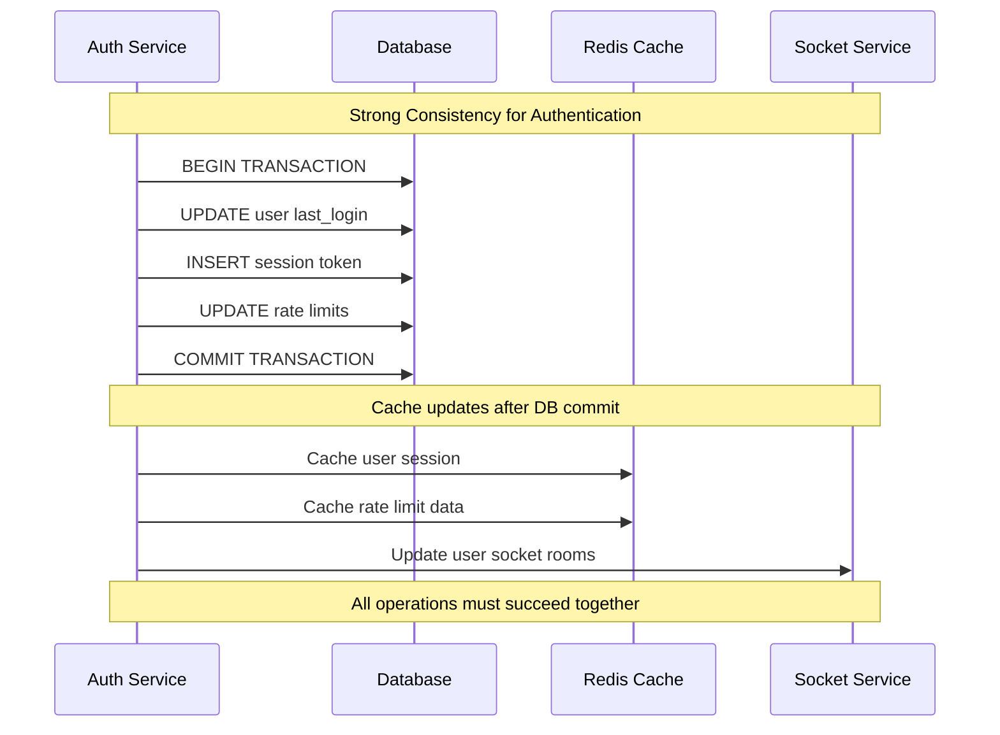
