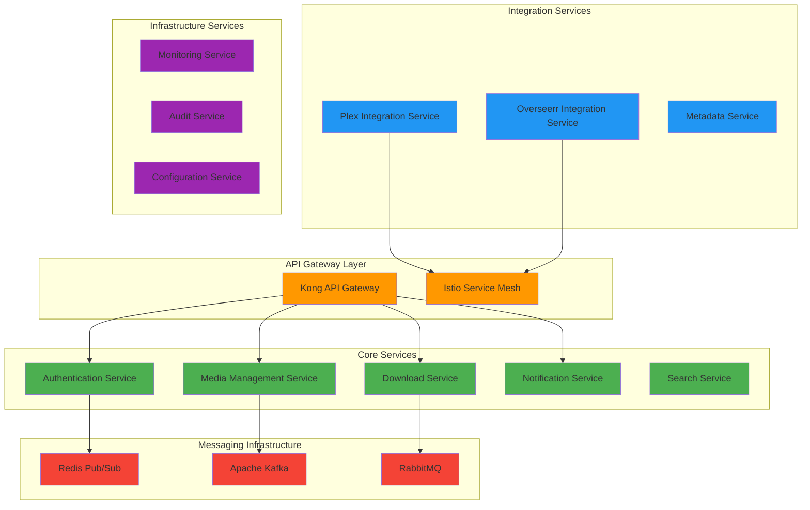

# ADR-002: Microservices Architecture Evolution Strategy

## Status
Accepted

## Context

MediaNest currently operates as a well-structured modular monolith built on Express.js with clear separation of concerns through layered architecture. As the system grows in complexity and scale, we need to evaluate the evolution path toward microservices architecture while maintaining system reliability and development velocity.

## Decision

We will adopt a **gradual microservices evolution strategy** following the "Strangler Fig" pattern, beginning with domain-driven service extraction based on bounded contexts rather than immediate architectural transformation.

### Evolution Phases

#### Phase 1: Domain Boundary Reinforcement (Current - 6 months)
- **Strengthen existing modular monolith** with clearer domain boundaries
- **Implement event-driven patterns** within the monolith using internal event bus
- **Enhance API gateway capabilities** for better request routing and security
- **Improve observability** with distributed tracing preparation

#### Phase 2: Strategic Service Extraction (6-12 months)
- **Extract Authentication Service** - Clear bounded context with minimal coupling
- **Extract Notification Service** - Event-driven with clear interfaces  
- **Extract Download Service** - CPU/IO intensive, benefits from isolation
- **Implement inter-service communication** via REST APIs and event messaging

#### Phase 3: Core Domain Services (12-18 months)
- **Extract Media Management Service** - Core business logic with complex workflows
- **Extract Plex Integration Service** - External dependency isolation
- **Extract Search and Metadata Service** - Performance optimization opportunities

#### Phase 4: Advanced Patterns (18+ months)
- **Implement CQRS patterns** where read/write optimization provides clear benefits
- **Add event sourcing** for complete audit trail requirements
- **Advanced deployment patterns** (blue-green, canary releases)

## Technical Implementation Strategy

### Service Communication Architecture

### Data Architecture Evolution

#### Current State: Shared Database
- **Single PostgreSQL instance** with clear schema boundaries
- **Domain-specific repositories** abstracting data access
- **Consistent ACID transactions** across domain operations

#### Target State: Database Per Service
- **Service-specific databases** optimized for domain requirements
- **Eventual consistency** between service boundaries via events
- **Distributed transaction coordination** using Saga pattern where needed

### Service Extraction Criteria

#### Authentication Service Extraction Rationale
- **Clear bounded context**: User identity and session management
- **Minimal cross-domain dependencies**: Self-contained functionality
- **Security isolation benefits**: Dedicated security focus
- **Scalability requirements**: Independent scaling for auth workloads

#### Download Service Extraction Rationale
- **Resource isolation**: CPU/IO intensive YouTube processing
- **Independent scaling**: Variable workload patterns
- **Technology flexibility**: Potential for specialized tech stack
- **Failure isolation**: Download failures don't affect core platform

## Implementation Guidelines

### Service Design Principles
1. **Domain-Driven Design**: Services aligned with business capabilities
2. **API-First**: Well-defined interfaces before implementation
3. **Event-Driven**: Loose coupling through domain events
4. **Autonomous Teams**: Service ownership by dedicated teams
5. **Observability-First**: Comprehensive monitoring and tracing

### Data Consistency Patterns
- **Strong Consistency**: Within service boundaries using ACID transactions
- **Eventual Consistency**: Across service boundaries using event sourcing
- **Saga Pattern**: For distributed transactions requiring coordination
- **Event Sourcing**: For complete audit trail and temporal queries

### Technology Decisions

#### Service Communication
- **Synchronous**: REST APIs for request/response patterns
- **Asynchronous**: Event messaging for domain events and notifications
- **Service Mesh**: Istio for advanced traffic management and security

#### Message Broker Selection
- **Redis Pub/Sub**: Lightweight event distribution for real-time notifications
- **Apache Kafka**: High-throughput event streaming for audit and analytics
- **RabbitMQ**: Reliable work queue processing for background jobs

#### API Gateway
- **Kong**: Feature-rich API gateway with plugin ecosystem
- **Authentication**: Centralized auth with distributed token validation
- **Rate Limiting**: Service-specific rate limiting policies
- **Monitoring**: Comprehensive API metrics and tracing

## Migration Strategy

### Database Migration Approach
1. **Schema Preparation**: Create service-specific schemas within existing database
2. **Data Access Abstraction**: Implement service-specific repositories
3. **Event Publishing**: Add domain event publishing to existing operations
4. **Service Extraction**: Extract service with database migration
5. **Event Replay**: Ensure consistency during migration

### Deployment Strategy
- **Blue-Green Deployment**: Zero-downtime service deployments
- **Feature Flags**: Gradual rollout of service extraction
- **Circuit Breakers**: Fallback to monolith during service issues
- **Rollback Capability**: Quick reversion to monolithic patterns

### Testing Strategy
- **Contract Testing**: Ensure API compatibility between services
- **End-to-End Testing**: Validate complete user journeys
- **Chaos Engineering**: Test system resilience during service failures
- **Load Testing**: Validate performance under microservice architecture

## Risks and Mitigations

### Technical Risks
- **Distributed System Complexity**: Mitigate with comprehensive observability
- **Data Consistency Challenges**: Implement proven eventual consistency patterns
- **Network Latency**: Optimize service communication and implement caching
- **Service Coordination**: Use choreography over orchestration where possible

### Organizational Risks
- **Team Coordination**: Implement clear service ownership and API contracts
- **Knowledge Distribution**: Maintain comprehensive documentation and runbooks
- **Deployment Complexity**: Invest in robust CI/CD and infrastructure automation
- **Monitoring Overhead**: Implement centralized monitoring and alerting

### Performance Risks
- **Network Calls Overhead**: Implement efficient serialization and connection pooling
- **Transaction Boundaries**: Design services to minimize distributed transaction needs
- **Query Performance**: Implement appropriate caching and read optimization strategies

## Consequences

### Positive Outcomes
- **Improved Scalability**: Independent scaling of service components
- **Technology Flexibility**: Service-specific technology choices
- **Team Autonomy**: Clear ownership and responsibility boundaries
- **Deployment Independence**: Faster feature delivery and bug fixes
- **Fault Isolation**: Service failures contained within boundaries

### Trade-offs Accepted
- **Increased Operational Complexity**: More services to monitor and maintain
- **Network Communication Overhead**: Inter-service communication latency
- **Data Consistency Complexity**: Eventual consistency vs. immediate consistency
- **Testing Complexity**: Integration testing across service boundaries
- **Development Environment Complexity**: Local development setup challenges

### Success Metrics
- **Service Independence**: Services can be developed, tested, and deployed independently
- **Performance Maintenance**: No significant degradation in user-facing performance
- **Reliability Improvement**: Overall system availability and fault tolerance
- **Development Velocity**: Faster feature delivery and reduced deployment friction
- **Observability Enhancement**: Improved system monitoring and troubleshooting capabilities

## Implementation Timeline

### Quarter 1-2: Foundation
- Domain boundary analysis and service interface design
- Infrastructure preparation (API gateway, service mesh, monitoring)
- Event-driven architecture implementation within monolith

### Quarter 3-4: First Extractions
- Authentication service extraction and testing
- Notification service extraction with event integration
- Download service extraction with background job processing

### Quarter 5-6: Core Services
- Media management service with complex workflow management
- Search and metadata service with performance optimization
- Integration service consolidation (Plex, Overseerr, TMDB)

### Quarter 7-8: Advanced Patterns
- CQRS implementation for read/write optimization
- Event sourcing for complete audit capabilities
- Advanced deployment and scaling patterns

This evolution strategy balances the benefits of microservices architecture with the operational complexity, ensuring a gradual and sustainable transformation path for MediaNest.