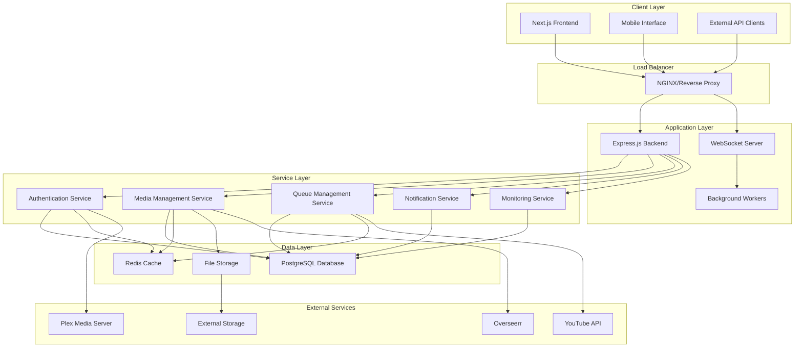
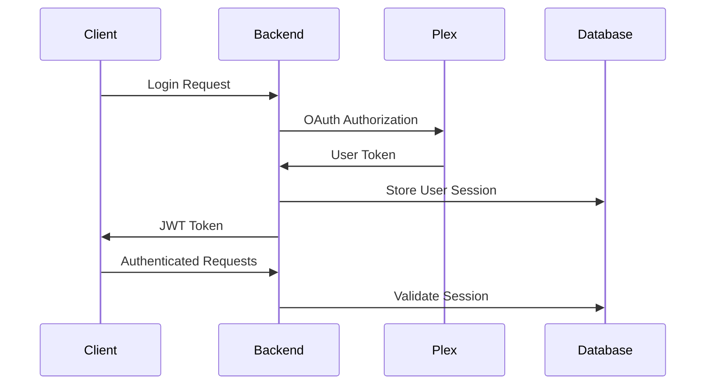
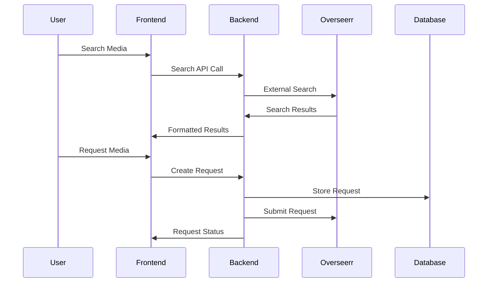
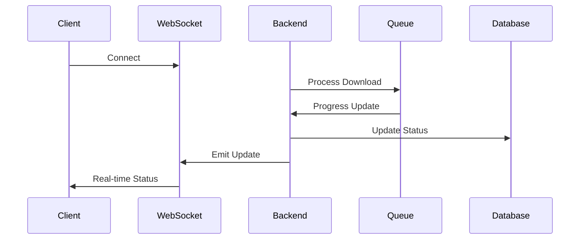

# Architecture Overview

MediaNest follows a modern three-tier architecture with clear separation of concerns, enterprise-grade security, and horizontal scalability.

## 🏗️ System Architecture



## 📊 Architecture Principles

### 1. **Separation of Concerns**
- **Frontend**: User interface and experience
- **Backend**: Business logic and API endpoints
- **Services**: Domain-specific functionality
- **Data**: Persistence and caching

### 2. **Scalability**
- Horizontal scaling support
- Stateless application design
- Database connection pooling
- Redis-based session management

### 3. **Security First**
- JWT-based authentication
- Input validation and sanitization
- Rate limiting and CORS protection
- Secure environment configuration

### 4. **Performance**
- Caching strategies with Redis
- Database query optimization
- Lazy loading and pagination
- Real-time updates via WebSockets

## 🔧 Component Details

### Frontend Layer

**Technology Stack:**
- **Next.js 15** - React framework with SSR/SSG
- **React 19** - Component-based UI library
- **TypeScript** - Type-safe development
- **Tailwind CSS** - Utility-first styling
- **Radix UI** - Accessible component primitives

**Key Features:**
- Server-side rendering for performance
- Static generation for marketing pages
- Real-time updates via Socket.IO client
- Responsive design with mobile-first approach
- Accessibility (WCAG 2.1 AA compliance)

**File Structure:**
```
frontend/
├── src/
│   ├── components/       # Reusable UI components
│   ├── hooks/           # Custom React hooks
│   ├── lib/             # Utility functions and helpers
│   ├── pages/           # Next.js pages and routing
│   ├── styles/          # Global styles and Tailwind config
│   └── types/           # TypeScript type definitions
├── public/              # Static assets
└── package.json         # Dependencies and scripts
```

### Backend Layer

**Technology Stack:**
- **Node.js 20+** - JavaScript runtime
- **Express.js** - Web application framework
- **Prisma ORM** - Type-safe database access
- **Socket.IO** - Real-time communication
- **TypeScript** - Type-safe server development

**Key Features:**
- RESTful API design
- Real-time WebSocket endpoints
- Comprehensive middleware stack
- Database migration system
- Background job processing

**File Structure:**
```
backend/
├── src/
│   ├── middleware/      # Express middleware
│   ├── models/          # Database models and schemas
│   ├── routes/          # API route handlers
│   ├── services/        # Business logic services
│   ├── utils/           # Helper functions
│   └── server.ts        # Application entry point
├── prisma/
│   ├── schema.prisma    # Database schema
│   └── migrations/      # Database migrations
├── tests/               # Test suites
└── package.json         # Dependencies and scripts
```

### Service Layer

#### Authentication Service
- **Plex OAuth Integration**: Secure single sign-on
- **JWT Token Management**: Stateless authentication
- **User Session Handling**: Secure session management
- **Role-Based Access Control**: Admin and user permissions

#### Media Management Service
- **Library Integration**: Plex media server connection
- **Request Processing**: Overseerr integration
- **Metadata Management**: Movie and TV show information
- **Search Functionality**: Cross-platform media search

#### Queue Management Service
- **Download Orchestration**: YouTube content processing
- **Progress Tracking**: Real-time download status
- **Queue Optimization**: Intelligent scheduling
- **Error Handling**: Retry mechanisms and fallbacks

#### Notification Service
- **Real-time Updates**: WebSocket notifications
- **Email Notifications**: Optional email alerts
- **Push Notifications**: Mobile app support (planned)
- **Event Logging**: Comprehensive audit trail

#### Monitoring Service
- **Health Checks**: System status monitoring
- **Performance Metrics**: Response time tracking
- **Error Tracking**: Comprehensive error logging
- **Usage Analytics**: User behavior insights

### Data Layer

#### PostgreSQL Database
- **Primary Storage**: User data, requests, configurations
- **ACID Compliance**: Data integrity and consistency
- **Connection Pooling**: Optimized database connections
- **Migration System**: Version-controlled schema changes

**Schema Overview:**
```sql
-- Users and Authentication
users, user_sessions, user_preferences

-- Media Management
media_requests, media_items, request_status

-- Queue Management
download_queue, download_history, queue_settings

-- System Configuration
system_settings, integration_configs, audit_logs
```

#### Redis Cache
- **Session Storage**: User session management
- **API Response Caching**: Performance optimization
- **Rate Limiting**: Request throttling
- **Background Job Queue**: Asynchronous processing

#### File Storage
- **Upload Management**: User-uploaded content
- **Temporary Files**: Processing intermediates
- **Log Files**: Application and error logs
- **Backup Storage**: Database and configuration backups

## 🔄 Data Flow Patterns

### 1. **User Authentication Flow**



### 2. **Media Request Flow**



### 3. **Real-time Update Flow**



## 🏷️ Design Patterns

### 1. **Repository Pattern**
Abstraction layer for data access:
```typescript
interface UserRepository {
  findById(id: string): Promise<User | null>;
  create(user: CreateUserDto): Promise<User>;
  update(id: string, data: UpdateUserDto): Promise<User>;
  delete(id: string): Promise<void>;
}
```

### 2. **Service Layer Pattern**
Business logic encapsulation:
```typescript
class MediaService {
  constructor(
    private mediaRepo: MediaRepository,
    private overseerrService: OverseerrService
  ) {}
  
  async requestMedia(userId: string, mediaId: string): Promise<Request> {
    // Business logic implementation
  }
}
```

### 3. **Middleware Pattern**
Request/response processing pipeline:
```typescript
const authMiddleware = (req: Request, res: Response, next: NextFunction) => {
  // Authentication logic
  next();
};

const validationMiddleware = (schema: ZodSchema) => {
  return (req: Request, res: Response, next: NextFunction) => {
    // Validation logic
    next();
  };
};
```

### 4. **Observer Pattern**
Event-driven architecture:
```typescript
class EventEmitter {
  on(event: string, handler: Function): void;
  emit(event: string, data: any): void;
}

// Usage
eventEmitter.on('download.complete', handleDownloadComplete);
eventEmitter.emit('download.complete', { id: '123', status: 'success' });
```

## 🔒 Security Architecture

### 1. **Authentication & Authorization**
- JWT tokens with short expiration
- Refresh token rotation
- Role-based access control (RBAC)
- Plex OAuth integration

### 2. **Input Validation**
- Zod schema validation
- SQL injection prevention
- XSS protection
- CSRF token validation

### 3. **Network Security**
- HTTPS enforcement
- CORS configuration
- Rate limiting
- IP whitelisting (optional)

### 4. **Data Protection**
- Password hashing with bcrypt
- Sensitive data encryption
- Secure cookie configuration
- Environment variable protection

## 📈 Performance Considerations

### 1. **Database Optimization**
- Proper indexing strategy
- Query optimization
- Connection pooling
- Read replicas (planned)

### 2. **Caching Strategy**
- Redis for session storage
- API response caching
- Static asset CDN
- Database query caching

### 3. **Real-time Performance**
- WebSocket connection management
- Event debouncing
- Selective data updates
- Connection pooling

### 4. **Horizontal Scaling**
- Stateless application design
- Load balancer support
- Database clustering
- Microservice architecture (planned)

## 🚀 Deployment Architecture

### Development Environment
```
Local Machine
├── Node.js (Backend)
├── Next.js Dev Server (Frontend)
├── PostgreSQL (Local/Docker)
└── Redis (Local/Docker)
```

### Production Environment
```
Production Server
├── NGINX (Reverse Proxy)
├── PM2/Docker (Process Management)
├── PostgreSQL (Managed Service)
├── Redis (Managed Service)
└── File Storage (S3/Local)
```

### Container Architecture
```
Docker Compose
├── medianest (Main Application)
├── postgres (Database)
├── redis (Cache)
└── nginx (Reverse Proxy)
```

## 🔮 Future Architecture Plans

### 1. **Microservices Migration**
- Service decomposition
- API gateway implementation
- Service mesh integration
- Independent scaling

### 2. **Event-Driven Architecture**
- Message queues (RabbitMQ/Kafka)
- Event sourcing
- CQRS pattern implementation
- Distributed tracing

### 3. **Cloud-Native Features**
- Kubernetes deployment
- Auto-scaling policies
- Health check endpoints
- Circuit breaker patterns

### 4. **Enhanced Monitoring**
- Distributed tracing
- Application performance monitoring
- Log aggregation
- Custom metrics dashboard

---

**Next**: [System Design](system-design.md) →