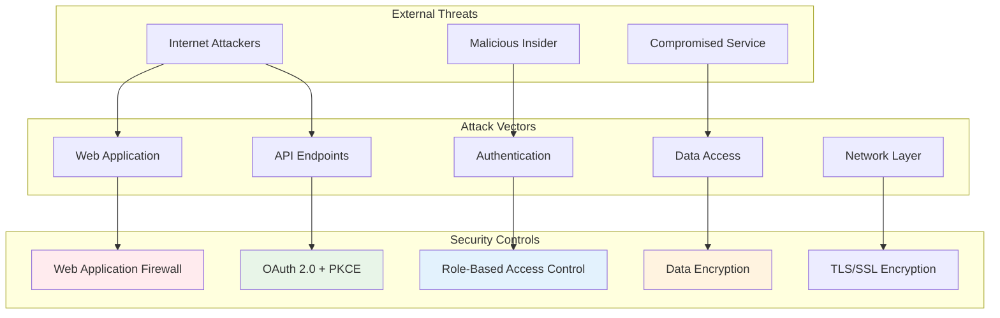
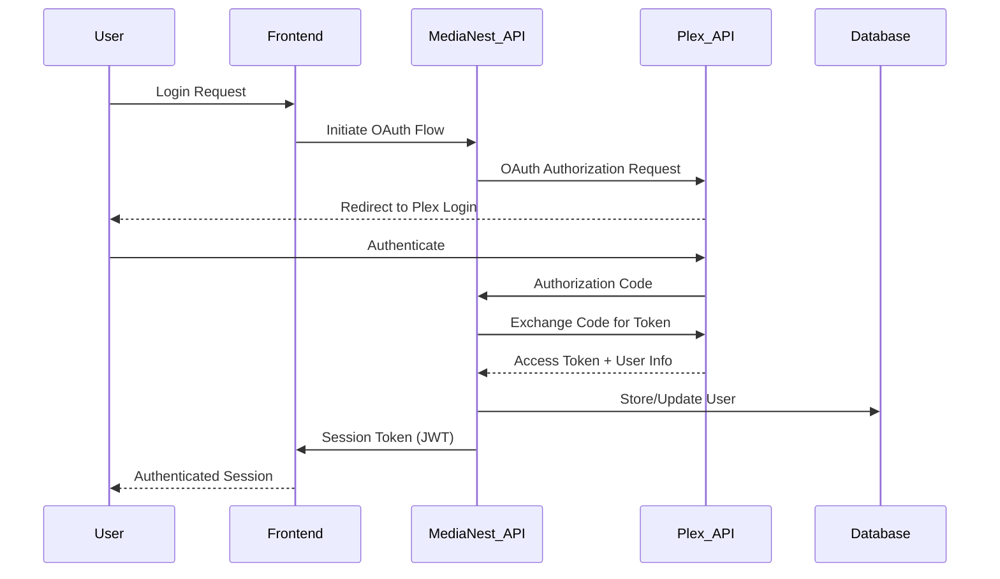
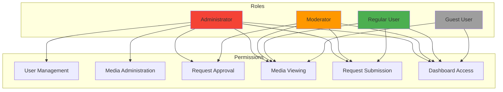
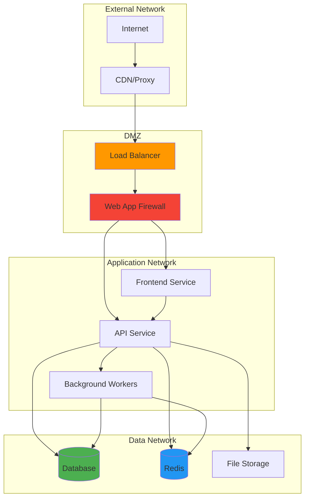
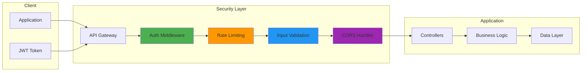
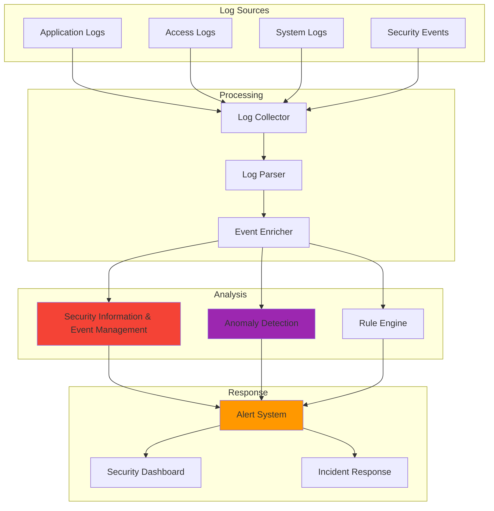

# MediaNest Security Architecture

**Version:** 2.0  
**Date:** September 2025  
**Status:** Active Implementation  
**Tags:** security, authentication, authorization, encryption

---

## Table of Contents

1. [Security Overview](#security-overview)
2. [Authentication Architecture](#authentication-architecture)
3. [Authorization Model](#authorization-model)
4. [Data Protection](#data-protection)
5. [Network Security](#network-security)
6. [API Security](#api-security)
7. [Container Security](#container-security)
8. [Monitoring & Incident Response](#monitoring--incident-response)
9. [Compliance & Audit](#compliance--audit)
10. [Security Roadmap](#security-roadmap)

---

## Security Overview

MediaNest implements a **defense-in-depth** security strategy with multiple layers of protection. The architecture prioritizes security without compromising usability, implementing industry best practices for authentication, authorization, and data protection.

### Security Principles

1. **Zero Trust Architecture**: Every request is authenticated and authorized
2. **Least Privilege Access**: Users get minimal required permissions
3. **Defense in Depth**: Multiple security layers prevent single points of failure
4. **Security by Design**: Security considerations integrated from the start
5. **Continuous Monitoring**: Real-time security monitoring and alerting

### Threat Model



---

## Authentication Architecture

### Plex OAuth Integration



### Authentication Flow Details

1. **OAuth 2.0 with PKCE**: Prevents authorization code interception
2. **JWT Tokens**: Stateless authentication with short expiration (15 minutes)
3. **Refresh Tokens**: Secure session management with longer lifetime (30 days)
4. **Session Management**: Redis-backed session storage with automatic cleanup

### Session Security

| Security Feature      | Implementation                 | Purpose                     |
| --------------------- | ------------------------------ | --------------------------- |
| **Token Rotation**    | New JWT on each refresh        | Limits token exposure       |
| **Secure Cookies**    | HttpOnly, Secure, SameSite     | Prevents XSS/CSRF           |
| **Session Timeout**   | 15-minute inactivity timeout   | Reduces unauthorized access |
| **Device Tracking**   | IP + User-Agent fingerprinting | Detects suspicious logins   |
| **Logout Everywhere** | Token invalidation             | Emergency logout capability |

---

## Authorization Model

### Role-Based Access Control (RBAC)



### Permission Matrix

| Resource                 | Admin   | Moderator         | User        | Guest        |
| ------------------------ | ------- | ----------------- | ----------- | ------------ |
| **User Management**      | ✅ CRUD | ❌                | ❌          | ❌           |
| **Media Administration** | ✅ CRUD | ❌                | ❌          | ❌           |
| **Request Approval**     | ✅ All  | ✅ Assign to self | ❌          | ❌           |
| **Request Creation**     | ✅      | ✅                | ✅          | ❌           |
| **Media Viewing**        | ✅      | ✅                | ✅          | ✅ Read-only |
| **Dashboard Access**     | ✅ Full | ✅ Limited        | ✅ Personal | ✅ Public    |
| **System Settings**      | ✅      | ❌                | ❌          | ❌           |
| **Audit Logs**           | ✅      | ❌                | ❌          | ❌           |

### Dynamic Authorization

- **Resource-based permissions**: Fine-grained access control per resource
- **Context-aware decisions**: Authorization based on request context
- **Delegation support**: Temporary permission delegation
- **Audit trail**: All authorization decisions logged

---

## Data Protection

### Encryption Strategy

```mermaid
graph TB
    subgraph "Data at Rest"
        DB[(Database)]
        Files[File Storage]
        Config[Configuration]
        Secrets[Application Secrets]
    end

    subgraph "Data in Transit"
        API_TLS[API Traffic]
        DB_TLS[Database Connection]
        External_TLS[External APIs]
        Internal_TLS[Internal Services]
    end

    subgraph "Encryption Methods"
        AES[AES-256-GCM]
        TLS13[TLS 1.3]
        JWT_Sign[JWT Signing (RS256)]
        PBKDF2[PBKDF2 Key Derivation]
    end

    DB --> AES
    Files --> AES
    Config --> AES
    Secrets --> AES

    API_TLS --> TLS13
    DB_TLS --> TLS13
    External_TLS --> TLS13
    Internal_TLS --> TLS13

    style AES fill:#4caf50
    style TLS13 fill:#2196f3
    style JWT_Sign fill:#ff9800
```

### Sensitive Data Handling

| Data Type            | Encryption             | Storage            | Access Control |
| -------------------- | ---------------------- | ------------------ | -------------- |
| **User Passwords**   | N/A (OAuth only)       | Not stored         | Plex OAuth     |
| **API Keys**         | AES-256-GCM            | Encrypted DB field | Admin only     |
| **Session Tokens**   | Signed JWT             | Redis (encrypted)  | Token bearer   |
| **User Preferences** | None (non-sensitive)   | Plain text         | User + Admin   |
| **Audit Logs**       | None (structured data) | Plain text         | Admin only     |
| **Database Backups** | AES-256 at rest        | Encrypted storage  | System only    |

### Key Management

- **Application-level encryption**: Database field encryption
- **Environment variables**: Secure secret injection
- **Key rotation**: Automated key rotation every 90 days
- **Hardware Security Modules**: Cloud HSM for production keys
- **Backup encryption**: Separate encryption keys for backups

---

## Network Security

### Network Architecture



### Network Security Controls

1. **Firewall Rules**: Restrictive ingress/egress rules
2. **Network Segmentation**: Isolated networks for different tiers
3. **TLS Everywhere**: End-to-end encryption for all traffic
4. **DDoS Protection**: Rate limiting and traffic analysis
5. **VPN Access**: Secure remote access for administrators

### Container Network Security

- **Bridge Networks**: Isolated container communication
- **Service Discovery**: Secure service-to-service communication
- **No Root Networking**: Non-privileged container execution
- **Network Policies**: Container network access control

---

## API Security

### API Security Architecture



### API Security Controls

| Security Control        | Implementation         | Configuration              |
| ----------------------- | ---------------------- | -------------------------- |
| **Authentication**      | JWT Bearer tokens      | Required on all endpoints  |
| **Rate Limiting**       | Token bucket algorithm | 100 req/min per user       |
| **Input Validation**    | Joi schema validation  | Strict type checking       |
| **CORS**                | Origin whitelist       | Production domains only    |
| **CSRF Protection**     | Double-submit cookie   | Required for state changes |
| **Request Size Limits** | Body parser limits     | 10MB max request size      |
| **SQL Injection**       | Parameterized queries  | Prisma ORM protection      |
| **XSS Protection**      | Output encoding        | Automatic HTML escaping    |

### API Endpoint Security

- **Endpoint Classification**: Public, authenticated, admin-only
- **Response Filtering**: Field-level access control
- **Error Handling**: Sanitized error responses
- **Audit Logging**: All API calls logged with context
- **Version Management**: Secure API versioning strategy

---

## Container Security

### Container Hardening

```dockerfile
# Security-hardened container example
FROM node:18-alpine AS security-hardened

# Create non-root user
RUN addgroup -g 1001 -S nodejs && adduser -S medianest -u 1001

# Install security updates
RUN apk update && apk upgrade && apk add --no-cache dumb-init

# Remove package manager
RUN rm -rf /var/cache/apk/* && rm -rf /usr/share/man/* && rm -rf /tmp/*

# Use non-root user
USER medianest

# Security labels
LABEL security.hardened="true"
LABEL security.user="medianest"
LABEL security.no-root="true"
```

### Container Security Features

1. **Non-root Execution**: All containers run as non-privileged users
2. **Minimal Base Images**: Alpine Linux for reduced attack surface
3. **No Sensitive Data**: Secrets via environment variables or volumes
4. **Read-only Root**: Immutable container filesystem
5. **Security Scanning**: Automated vulnerability scanning

### Docker Security Configuration

```yaml
# docker-compose.yml security settings
services:
  medianest-app:
    security_opt:
      - no-new-privileges:true
    cap_drop:
      - ALL
    cap_add:
      - NET_BIND_SERVICE
    read_only: true
    tmpfs:
      - /tmp:noexec,nosuid,size=100m
    user: '1001:1001'
```

---

## Monitoring & Incident Response

### Security Monitoring



### Security Metrics & Alerts

| Metric                      | Threshold           | Alert Level | Response            |
| --------------------------- | ------------------- | ----------- | ------------------- |
| **Failed Login Attempts**   | >5 per 5 minutes    | Warning     | Account lockout     |
| **Unusual Access Patterns** | ML-based detection  | Medium      | Investigation       |
| **Privilege Escalation**    | Any attempt         | Critical    | Immediate response  |
| **Brute Force Attacks**     | >50 attempts/hour   | High        | IP blocking         |
| **Data Exfiltration**       | Large downloads     | High        | Session termination |
| **Suspicious API Usage**    | Rate limit exceeded | Medium      | Temporary ban       |

### Incident Response Playbook

1. **Detection**: Automated monitoring and manual reporting
2. **Analysis**: Threat assessment and impact evaluation
3. **Containment**: Immediate threat isolation
4. **Eradication**: Root cause elimination
5. **Recovery**: System restoration and validation
6. **Lessons Learned**: Post-incident review and improvement

---

## Compliance & Audit

### Compliance Framework

| Standard                         | Applicable Controls      | Implementation Status   |
| -------------------------------- | ------------------------ | ----------------------- |
| **OWASP Top 10**                 | Web application security | ✅ Implemented          |
| **NIST Cybersecurity Framework** | Risk management          | ✅ Implemented          |
| **SOC 2 Type II**                | Security controls        | 📋 Planning             |
| **GDPR**                         | Data protection          | ✅ Implemented          |
| **ISO 27001**                    | Information security     | 📋 Future consideration |

### Audit Trail

- **Authentication Events**: Login, logout, session management
- **Authorization Decisions**: Permission grants and denials
- **Data Access**: All database queries and modifications
- **Administrative Actions**: User management, configuration changes
- **Security Events**: Failed attempts, suspicious activities

### Security Assessments

- **Quarterly Security Reviews**: Internal security assessment
- **Annual Penetration Testing**: Third-party security testing
- **Continuous Vulnerability Scanning**: Automated security scanning
- **Code Security Reviews**: Secure coding practices review

---

## Security Roadmap

### Phase 1: Foundation (Complete)

- ✅ OAuth 2.0 + PKCE authentication
- ✅ RBAC authorization model
- ✅ TLS 1.3 encryption
- ✅ Container security hardening
- ✅ Security monitoring basics

### Phase 2: Enhancement (In Progress)

- ⏳ Advanced threat detection
- ⏳ Security orchestration automation
- ⏳ Enhanced audit logging
- ⏳ Security training program

### Phase 3: Advanced Security (Planned)

- 📋 Zero-trust network architecture
- 📋 Advanced persistent threat protection
- 📋 Security orchestration platform
- 📋 SOC 2 Type II compliance

### Phase 4: Continuous Improvement (Ongoing)

- 🔄 Regular security assessments
- 🔄 Threat intelligence integration
- 🔄 Security awareness training
- 🔄 Incident response exercises

---

## Related Documentation

- [System Architecture](system-architecture.md) - Overall system design
- [API Security Guide](../03-api-reference/README.md) - API security implementation
- [Deployment Security](../06-deployment/README.md) - Secure deployment practices
- [Monitoring Guide](../08-monitoring/README.md) - Security monitoring setup
- [Incident Response](../10-troubleshooting/README.md) - Security incident handling

---

_Last updated: September 2025_  
_Security review scheduled: December 2025_  
_Next penetration test: March 2026_
