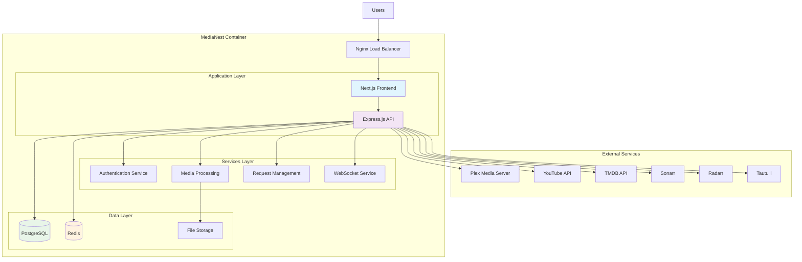
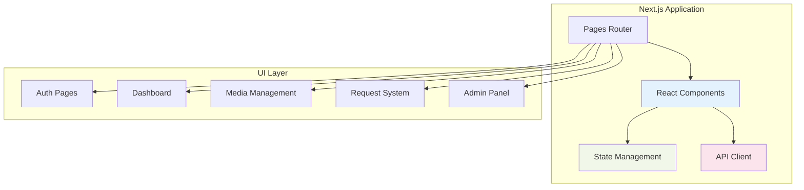
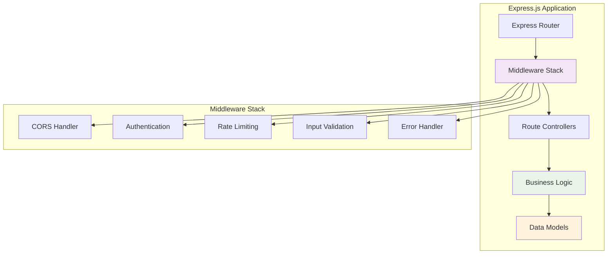
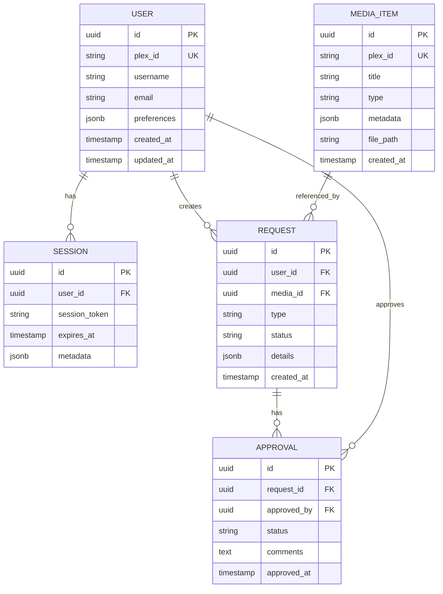
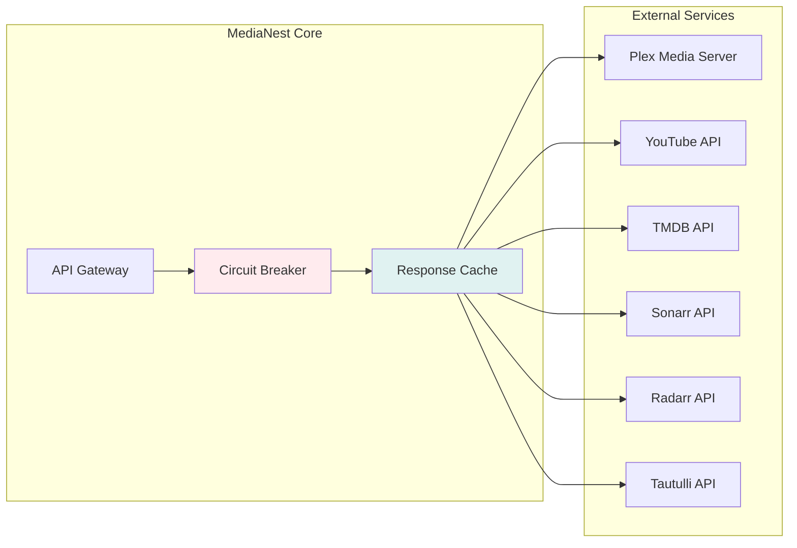
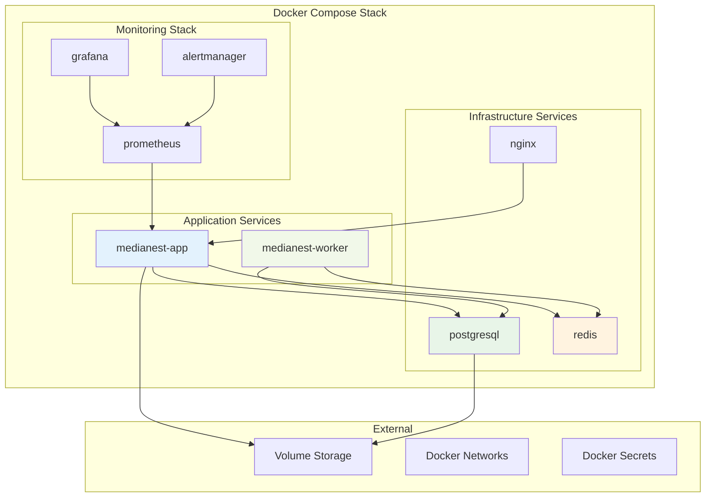
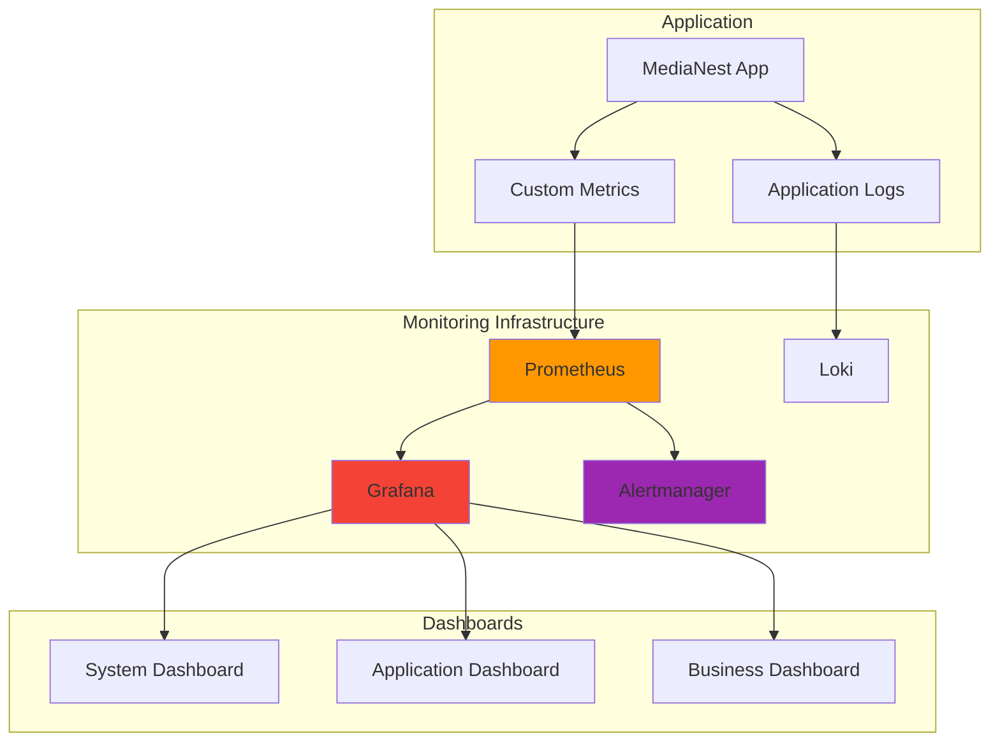

# MediaNest System Architecture

**Version:** 2.0  
**Date:** September 2025  
**Status:** Active Implementation  
**Tags:** architecture, system-design, monolithic, containers

---

## Table of Contents

1. [Executive Summary](#executive-summary)
2. [System Overview](#system-overview)
3. [Architecture Principles](#architecture-principles)
4. [Component Architecture](#component-architecture)
5. [Data Architecture](#data-architecture)
6. [Integration Architecture](#integration-architecture)
7. [Deployment Architecture](#deployment-architecture)
8. [Performance & Scalability](#performance--scalability)
9. [Monitoring & Observability](#monitoring--observability)
10. [Disaster Recovery](#disaster-recovery)

---

## Executive Summary

MediaNest is a unified web portal that consolidates multiple media management services into a single authenticated interface. The architecture follows a **monolithic design pattern** optimized for 10-20 concurrent users, leveraging modern web technologies and containerization for easy deployment and maintenance.

### Key Architectural Decisions

- **Monolithic Architecture**: Simplified deployment and maintenance for small user base
- **Container-First Design**: Docker Compose V2 for consistent environments
- **Real-time Communication**: Socket.io for live status updates
- **Secure by Default**: Plex OAuth, rate limiting, and AES-256-GCM encrypted storage
- **Service Resilience**: Circuit breakers with graceful degradation when external services unavailable

### Implementation Status

| Phase       | Status         | Description                  |
| ----------- | -------------- | ---------------------------- |
| **Phase 1** | ✅ Complete    | Core Infrastructure          |
| **Phase 2** | ✅ Complete    | External Service Integration |
| **Phase 3** | ✅ Complete    | Dashboard & Media Search UI  |
| **Phase 4** | ⏳ In Progress | YouTube Integration          |
| **Phase 5** | 📋 Planned     | Advanced Features            |

---

## System Overview

### High-Level Architecture

### Core Components

| Component           | Technology       | Purpose                          |
| ------------------- | ---------------- | -------------------------------- |
| **Frontend**        | Next.js 14       | React-based SPA with SSR         |
| **API Server**      | Express.js       | RESTful API with middleware      |
| **Database**        | PostgreSQL 15    | Primary data persistence         |
| **Cache**           | Redis 7          | Session storage & caching        |
| **Authentication**  | NextAuth.js      | Plex OAuth integration           |
| **File Processing** | Node.js + FFmpeg | Media processing pipeline        |
| **Real-time**       | Socket.io        | Live updates & notifications     |
| **Proxy**           | Nginx            | Load balancing & SSL termination |

---

## Architecture Principles

### 1. Simplicity First

- **Monolithic design** for easier debugging and deployment
- **Single database** to avoid distributed system complexity
- **Containerized services** for consistent environments

### 2. Security by Design

- **Zero-trust architecture** with authentication on every request
- **Encrypted storage** for sensitive configuration data
- **Rate limiting** and CSRF protection by default

### 3. Performance Optimization

- **Redis caching** for frequently accessed data
- **Connection pooling** for database efficiency
- **Lazy loading** and code splitting in frontend

### 4. Operational Excellence

- **Health checks** for all services
- **Structured logging** with centralized aggregation
- **Graceful degradation** when external services are unavailable

---

## Component Architecture

### Frontend Architecture (Next.js)

#### Key Frontend Patterns

- **Component-based architecture** with reusable UI components
- **Context API** for global state management
- **Custom hooks** for API interactions and business logic
- **Error boundaries** for graceful error handling
- **Responsive design** with Tailwind CSS

### Backend Architecture (Express.js)

#### API Design Patterns

- **RESTful endpoints** with consistent naming conventions
- **Middleware-first approach** for cross-cutting concerns
- **Service layer** separation for business logic
- **Repository pattern** for data access abstraction
- **Response envelope** standardization

---

## Data Architecture

### Database Schema Overview

### Data Access Patterns

| Pattern             | Implementation         | Use Case                   |
| ------------------- | ---------------------- | -------------------------- |
| **Repository**      | Prisma ORM             | Data access abstraction    |
| **Active Record**   | Model classes          | Business logic on entities |
| **Query Builder**   | Prisma Query API       | Complex queries            |
| **Connection Pool** | Prisma connection pool | Performance optimization   |
| **Migrations**      | Prisma migrations      | Schema versioning          |

---

## Integration Architecture

### External Service Integration

### Integration Patterns

- **Circuit Breaker Pattern**: Prevents cascading failures
- **Retry with Exponential Backoff**: Resilient API calls
- **Response Caching**: Reduces external API load
- **Graceful Degradation**: Core functionality remains available
- **Event-driven Architecture**: Webhook processing for real-time updates

---

## Deployment Architecture

### Container Architecture

### Deployment Environments

| Environment     | Purpose                | Configuration                  |
| --------------- | ---------------------- | ------------------------------ |
| **Development** | Local development      | Docker Compose with hot reload |
| **Staging**     | Pre-production testing | Production-like with test data |
| **Production**  | Live system            | Optimized with monitoring      |

---

## Performance & Scalability

### Performance Optimization Strategies

1. **Database Optimization**

   - Connection pooling (10-20 connections)
   - Query optimization with indexes
   - Read replicas for reporting queries

2. **Caching Strategy**

   - Redis for session storage
   - API response caching (5-minute TTL)
   - Static asset caching with CDN

3. **Frontend Optimization**

   - Code splitting and lazy loading
   - Image optimization and WebP support
   - Service worker for offline functionality

4. **API Optimization**
   - Response compression (gzip)
   - Pagination for large datasets
   - Selective field loading

### Scalability Considerations

- **Horizontal scaling**: Load balancer ready
- **Database scaling**: Read replica support
- **Cache scaling**: Redis cluster support
- **Service separation**: Microservice migration path

---

## Monitoring & Observability

### Monitoring Stack

### Key Metrics

- **System Metrics**: CPU, Memory, Disk, Network
- **Application Metrics**: Response time, Error rate, Throughput
- **Business Metrics**: Active users, Media requests, API usage
- **External Service Metrics**: Plex availability, API response times

---

## Disaster Recovery

### Backup Strategy

1. **Database Backups**

   - Daily automated backups
   - Point-in-time recovery capability
   - Cross-region backup storage

2. **Configuration Backups**

   - Docker Compose files
   - Environment configurations
   - SSL certificates

3. **Application Data**
   - User preferences and settings
   - Request history and approvals
   - Cached media metadata

### Recovery Procedures

1. **Service Recovery**: Automated container restart
2. **Database Recovery**: Point-in-time restore from backup
3. **Complete System Recovery**: Infrastructure as Code deployment

---

## Next Steps

### Phase 4: YouTube Integration Enhancement

- Complete backend YouTube API integration
- Enhanced media discovery features
- Automated content organization

### Phase 5: Advanced Features

- Machine learning for content recommendations
- Advanced analytics and reporting
- Mobile application development

---

## Related Documentation

- [Security Architecture](security-architecture.md) - Detailed security implementation
- [API Design](api-design.md) - API architecture and patterns
- [Database Design](database-design.md) - Detailed database schema
- [Deployment Guide](../06-deployment/README.md) - Deployment procedures
- [Performance Guide](../11-performance/README.md) - Performance optimization

---

_Last updated: September 2025_  
_Architecture review scheduled: December 2025_
