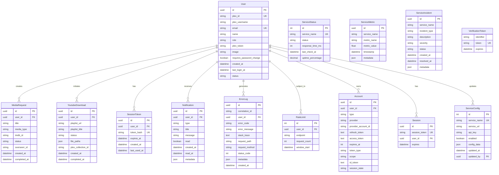

# MediaNest System Overview

## Introduction

MediaNest is an Advanced Media Management Platform built on a modern, scalable microservices architecture. The system provides comprehensive media management capabilities including content discovery, request management, Plex integration, and YouTube downloading with real-time notifications and monitoring.

## System Architecture

### High-Level Architecture

## C4 Model Architecture

### Level 1: System Context Diagram

### Level 2: Container Diagram

### Level 3: Component Diagram - API Application

## Core Components

### 1. Express.js Application Server

- **Framework**: Express.js 4.21+ with TypeScript
- **Architecture**: RESTful API with versioned endpoints
- **Performance**: Optimized with compression, caching, and connection pooling
- **Security**: Helmet, CORS, rate limiting, and authentication middleware

### 2. Authentication & Authorization

- **Primary**: JWT-based authentication with token rotation
- **OAuth**: Plex OAuth integration for seamless user experience
- **Security Features**:
  - Multi-device session management
  - Token blacklisting and rotation
  - Rate limiting per user and endpoint
  - Device fingerprinting

### 3. Data Persistence Layer

- **Database**: PostgreSQL 15+ with Prisma ORM
- **Cache**: Redis 7+ for session management and performance optimization
- **Connection Management**: Optimized connection pooling and query optimization
- **Backup Strategy**: Automated daily backups with disaster recovery procedures

### 4. Real-time Communication

- **WebSocket**: Socket.IO for real-time notifications and status updates
- **Namespaces**: Organized by feature (media requests, downloads, admin)
- **Authentication**: Socket-level authentication with JWT validation

### 5. External Integrations

- **Plex Media Server**: Direct API integration for library management
- **Overseerr**: Media request management and automation
- **The Movie Database (TMDB)**: Metadata enrichment for media content
- **YouTube API**: Video downloading and playlist management
- **Uptime Kuma**: Service monitoring and health checks

## Technology Stack

### Backend Core

- **Runtime**: Node.js 20+
- **Language**: TypeScript 5.6+
- **Framework**: Express.js 4.21
- **ORM**: Prisma 5+
- **Validation**: Zod schemas with custom middleware
- **Testing**: Vitest with comprehensive test suites

### Infrastructure

- **Containerization**: Docker with multi-stage builds
- **Orchestration**: Docker Compose with environment-specific configurations
- **Reverse Proxy**: Nginx with SSL termination and load balancing
- **Process Management**: PM2 for production process management

### Monitoring & Observability

- **Metrics**: Prometheus with custom business metrics
- **Tracing**: OpenTelemetry for distributed tracing
- **Logging**: Structured logging with correlation IDs
- **Error Tracking**: Sentry for error monitoring and alerting
- **Health Checks**: Multi-tier health checking with dependency validation

## Performance Characteristics

### Response Time Optimization

- **API Routes**: Optimized by frequency of use
- **Caching Strategy**: Multi-tier caching (Redis, HTTP headers, application-level)
- **Database**: Optimized indexes and query patterns
- **Connection Pooling**: Configured for high concurrency

### Scalability Features

- **Horizontal Scaling**: Stateless application design
- **Load Balancing**: Nginx-based load balancing
- **Resource Management**: Memory and CPU optimization
- **Circuit Breakers**: Resilience patterns for external service failures

## Security Architecture Deep Dive

### Zero-Trust Security Model

### Security Implementation Details

#### Authentication & Authorization

- **JWT Security**: Secure token generation and validation with RS256
- **Session Management**: Device-specific session handling with fingerprinting
- **OAuth Integration**: Plex OAuth 2.0 with PKCE flow
- **Rate Limiting**: Intelligent rate limiting per user and endpoint with Redis backing
- **Multi-Device Support**: Session management across multiple devices

#### API Security

- **CORS Policy**: Strict origin validation for production environments
- **Security Headers**: Comprehensive security headers via Helmet.js
  - Content Security Policy (CSP)
  - HTTP Strict Transport Security (HSTS)
  - X-Frame-Options, X-Content-Type-Options
  - Referrer Policy, Permissions Policy
- **Input Validation**: Zod schema validation with sanitization
- **SQL Injection Prevention**: Parameterized queries via Prisma ORM

#### Data Security

- **Encryption at Rest**: AES-256 database encryption
- **Encryption in Transit**: TLS 1.3 for all communications
- **Secret Management**: Environment variables with rotation capabilities
- **Password Hashing**: bcryptjs with configurable salt rounds
- **Token Security**: JWT with short expiration and refresh token rotation

### Data Protection

- **Encryption**: At-rest and in-transit encryption
- **Secret Management**: Environment-based secret management
- **Database Security**: Connection encryption and access controls
- **Audit Logging**: Comprehensive audit trails for security events

## Database Schema Architecture

### Entity Relationship Diagram

## System Integration Architecture

### External Service Integration Map

