# MediaNest System Architecture Overview

## Overview

MediaNest is a unified web portal for managing Plex media server and related services. The system follows a modern microservices-inspired architecture with a monorepo structure, providing seamless integration between media management, authentication, and external service orchestration.

## High-Level Architecture

The following diagram illustrates the complete MediaNest system architecture:

```mermaid
graph TB
    subgraph "Client Layer"
        WEB["🌐 Web Browser<br/>React SPA"]
        MOBILE["📱 Mobile App<br/>Future Implementation"]
        API_CLIENT["🔧 API Clients<br/>Third-party Integrations"]
    end

    subgraph "Load Balancer & Proxy"
        NGINX["⚖️ Nginx Proxy<br/>SSL/TLS Termination<br/>Load Balancing"]
    end

    subgraph "MediaNest Application Container"
        subgraph "Frontend Tier"
            NEXTJS["⚛️ Next.js 14<br/>App Router<br/>Server-Side Rendering<br/>Static Generation"]
        end

        subgraph "Backend Tier"
            EXPRESS["🚀 Express.js API<br/>REST Endpoints<br/>GraphQL (Future)"]
            AUTH["🔐 NextAuth.js<br/>Plex OAuth<br/>Session Management"]
            SOCKET["🔌 Socket.io<br/>Real-time Updates<br/>Live Status"]
        end

        subgraph "Processing Layer"
            BULLMQ["📋 BullMQ<br/>Job Queue<br/>Task Scheduling"]
            WORKER["⚙️ Background Workers<br/>Media Processing<br/>External API Calls"]
        end
    end

    subgraph "Data & Cache Layer"
        POSTGRES["🐘 PostgreSQL 15<br/>Primary Database<br/>ACID Compliance<br/>JSON Support"]
        REDIS["🔴 Redis 7<br/>Session Store<br/>Cache Layer<br/>Queue Backend"]
    end

    subgraph "External Service Integration"
        subgraph "Media Services"
            PLEX["🎬 Plex Media Server<br/>Content Library<br/>Streaming"]
            OVERSEERR["📥 Overseerr<br/>Request Management<br/>TMDB Integration"]
        end

        subgraph "Monitoring Services"
            UPTIME["📊 Uptime Kuma<br/>Service Monitoring<br/>Health Checks"]
        end

        subgraph "Content Services"
            YOUTUBE["📺 YouTube/yt-dlp<br/>Video Downloads<br/>Playlist Management"]
        end
    end

    %% Client Layer Connections
    WEB --> NGINX
    MOBILE --> NGINX
    API_CLIENT --> NGINX

    %% Proxy to Application
    NGINX --> NEXTJS
    NGINX --> EXPRESS

    %% Frontend to Backend
    NEXTJS <--> EXPRESS
    NEXTJS <--> SOCKET

    %% Backend Internal Connections
    EXPRESS --> AUTH
    EXPRESS --> BULLMQ
    SOCKET --> REDIS
    BULLMQ --> WORKER

    %% Data Layer Connections
    EXPRESS --> POSTGRES
    EXPRESS --> REDIS
    AUTH --> POSTGRES
    WORKER --> POSTGRES
    WORKER --> REDIS

    %% External Service Connections
    EXPRESS --> PLEX
    EXPRESS --> OVERSEERR
    EXPRESS --> UPTIME
    WORKER --> PLEX
    WORKER --> OVERSEERR
    WORKER --> UPTIME
    WORKER --> YOUTUBE

    %% Styling
    classDef clientLayer fill:#e1f5fe,stroke:#0277bd,stroke-width:2px
    classDef proxyLayer fill:#f3e5f5,stroke:#7b1fa2,stroke-width:2px
    classDef appLayer fill:#e8f5e8,stroke:#388e3c,stroke-width:2px
    classDef dataLayer fill:#fff3e0,stroke:#f57c00,stroke-width:2px
    classDef externalLayer fill:#ffebee,stroke:#d32f2f,stroke-width:2px

    class WEB,MOBILE,API_CLIENT clientLayer
    class NGINX proxyLayer
    class NEXTJS,EXPRESS,AUTH,SOCKET,BULLMQ,WORKER appLayer
    class POSTGRES,REDIS dataLayer
    class PLEX,OVERSEERR,UPTIME,YOUTUBE externalLayer
```



## Request Flow Architecture

The following sequence diagram shows how requests flow through the MediaNest system:

```mermaid
sequenceDiagram
    participant U as 👤 User
    participant N as ⚖️ Nginx
    participant F as ⚛️ Next.js
    participant A as 🚀 Express API
    participant Auth as 🔐 NextAuth
    participant Q as 📋 BullMQ
    participant W as ⚙️ Worker
    participant DB as 🐘 PostgreSQL
    participant R as 🔴 Redis
    participant EXT as 🎬 External Services
    participant WS as 🔌 WebSocket

    Note over U,WS: Authentication Flow
    U->>N: 1. HTTPS Request (login)
    N->>F: 2. Forward to Frontend
    F->>A: 3. API Call (/api/auth)
    A->>Auth: 4. NextAuth Processing
    Auth->>EXT: 5. Plex OAuth Verification
    EXT->>Auth: 6. OAuth Response
    Auth->>DB: 7. Store User Session
    Auth->>R: 8. Cache Session Data
    Auth->>F: 9. Auth Token Response
    F->>U: 10. Redirect to Dashboard

    Note over U,WS: Media Request Flow
    U->>F: 11. Request Media (UI)
    F->>A: 12. POST /api/media/request
    A->>DB: 13. Create Media Request
    A->>Q: 14. Queue Background Job
    A->>F: 15. Immediate Response
    F->>U: 16. Show Pending Status

    Note over U,WS: Background Processing
    Q->>W: 17. Process Queued Job
    W->>EXT: 18. Call Overseerr API
    EXT->>W: 19. API Response
    W->>DB: 20. Update Request Status
    W->>R: 21. Update Cache
    W->>WS: 22. Emit Status Update
    WS->>F: 23. Real-time Update
    F->>U: 24. Live Status Change
```



## Core Components

### 1. Frontend Layer (Next.js 15.5.2)

- **Framework**: Next.js with React 19.1.1
- **UI**: TailwindCSS with custom components
- **Authentication**: NextAuth.js v4.24.7 with Plex OAuth
- **State Management**: TanStack React Query v5.87.1
- **Real-time**: Socket.IO client for live updates
- **Build**: Production-ready with bundle analysis

### 2. Backend Layer (Node.js/Express)

- **Framework**: Express.js v5.1.0 with TypeScript
- **Architecture**: Layered architecture with services, controllers, and repositories
- **Authentication**: JWT + Session-based with device management
- **Real-time**: Socket.IO server with namespaced connections
- **Security**: Helmet, CORS, rate limiting, and CSP headers
- **Monitoring**: OpenTelemetry with Jaeger tracing

### 3. Data Layer

- **Primary Database**: PostgreSQL 15 with Prisma ORM
- **Cache**: Redis 7 for sessions, queue management, and caching
- **Queue**: Bull/BullMQ for async job processing
- **Storage**: File system with Docker volumes

### 4. Infrastructure

- **Containerization**: Docker with multi-service composition
- **Networking**: Bridge network with service discovery
- **Volumes**: Persistent storage for database, cache, and uploads
- **Health Checks**: Comprehensive service health monitoring

## Architecture Patterns

### 1. Monorepo Structure

```
medianest/
├── backend/           # Express.js API server
├── frontend/          # Next.js web application
├── shared/            # Shared utilities and types (referenced)
├── docs/              # Documentation
├── infrastructure/    # Docker and deployment configs
└── docker-compose.yml # Service orchestration
```

### 2. Layered Backend Architecture

```
┌──────────────────┐
│   Routes/API     │ ← Express routes and API endpoints
├──────────────────┤
│   Controllers    │ ← Request handling and validation
├──────────────────┤
│   Services       │ ← Business logic and orchestration
├──────────────────┤
│   Repositories   │ ← Data access abstraction
├──────────────────┤
│   Database       │ ← Prisma ORM + PostgreSQL
└──────────────────┘
```

### 3. Security Architecture

- **Authentication Flow**: Plex OAuth → JWT tokens → Session management
- **Authorization**: Role-based with admin/user distinction
- **Security Headers**: CSP, HSTS, and security middleware
- **Rate Limiting**: API-specific and global rate limiting
- **Input Validation**: Zod schema validation throughout

### 4. Integration Architecture

- **Service Discovery**: Environment-based configuration
- **Resilience**: Circuit breakers (Opossum) and retry logic
- **Health Monitoring**: Comprehensive service status tracking
- **External APIs**: Plex, Overseerr, Uptime Kuma integrations

## Key Architectural Decisions

### Technology Choices

1. **Next.js + Express**: Separate concerns with SSR frontend and dedicated API
2. **PostgreSQL**: Reliable ACID compliance for media metadata
3. **Prisma ORM**: Type-safe database operations with migrations
4. **Socket.IO**: Real-time updates for media processing status
5. **Redis**: High-performance caching and session storage
6. **Docker Compose**: Development and production consistency

### Design Patterns

1. **Repository Pattern**: Clean data access abstraction
2. **Service Layer**: Business logic separation
3. **Middleware Chain**: Request processing pipeline
4. **Event-Driven**: Socket.IO for real-time communication
5. **Configuration Management**: Environment-based with validation

### Scalability Considerations

1. **Horizontal Scaling**: Stateless backend design
2. **Database Optimization**: Indexes on critical query paths
3. **Caching Strategy**: Redis for frequent data access
4. **Queue Management**: Async processing for heavy operations
5. **Resource Limits**: Memory and connection pooling

## Performance Characteristics

### Database Performance

- **Connection Pooling**: Configured for optimal concurrency
- **Query Optimization**: Strategic indexing on user, media, and time-based queries
- **Migration Strategy**: Prisma-managed schema evolution

### Caching Strategy

- **Redis Usage**: Sessions, rate limiting, and query caching
- **Memory Management**: LRU eviction with 256MB limit
- **Cache Invalidation**: Event-driven cache updates

### Network Optimization

- **Compression**: Gzip compression for API responses
- **CDN Ready**: Static asset optimization
- **Connection Management**: Keep-alive and connection reuse

## Monitoring and Observability

### Health Checks

- **Service Health**: Database, Redis, and external service monitoring
- **Metrics Endpoint**: Prometheus-compatible metrics
- **Error Tracking**: Structured logging with correlation IDs

### Logging Strategy

- **Structured Logging**: JSON format with correlation tracking
- **Log Rotation**: Daily rotation with retention policies
- **Error Correlation**: Request tracing throughout the system

### Performance Monitoring

- **OpenTelemetry**: Distributed tracing with Jaeger
- **Metrics Collection**: Custom metrics for business logic
- **Health Dashboards**: Service status visualization

## Security Architecture

### Authentication & Authorization

- **Plex OAuth**: Primary authentication method
- **JWT Tokens**: Stateless authentication with refresh
- **Session Management**: Redis-backed session storage
- **Role-Based Access**: Admin and user role separation

### Security Measures

- **Input Validation**: Zod schema validation
- **SQL Injection Prevention**: Prisma ORM parameterized queries
- **XSS Protection**: Content Security Policy headers
- **CSRF Protection**: SameSite cookies and CSRF tokens
- **Rate Limiting**: API endpoint protection

## Future Considerations

### Scalability Roadmap

1. **Microservice Migration**: Service decomposition strategy
2. **Database Sharding**: User-based partitioning
3. **CDN Integration**: Static asset distribution
4. **Load Balancing**: Multiple backend instance support

### Technology Evolution

1. **Monitoring Enhancement**: APM integration
2. **CI/CD Pipeline**: Automated deployment pipeline
3. **Testing Strategy**: Enhanced test coverage and E2E testing
4. **Documentation**: API documentation with OpenAPI/Swagger

This architecture provides a robust foundation for media management while maintaining flexibility for future enhancements and scaling requirements.
